---
html:
  toc: true
---

# COCAUI：一个过渡性 UI 框架子集

> **定位与局限性。** 本设计系统的技术基础——基于 Qt 的 Widget 子类化、命令式 QPainter 渲染、QSS 补充样式——已显著落后于现代 UI 框架的前沿。如今的前沿由以下因素定义：
> 1. 编译为 GPU 合成渲染树的声明式 UI 描述（Flutter/Impeller、SwiftUI/Metal、Slint、GPUI）
> 2. 具有自动增量重渲染的响应式状态绑定（Solid、Leptos 或 xilem 中的信号/效果模型）
> 3. 替代手动几何计算的基于约束的布局求解器（Auto Layout 中的 Cassowary、Taffy/Dioxus 中的 Morphorm）
> 4. 完全消除 QWidget/QPainter 两阶段重绘模型的即时模式或保留场景图架构。
>
> COCAUI 的 Qt 基础所具有的时代局限性是显而易见的。然而，该系统之所以存在，是因为它是将遗留的 CATIA 应用程序框架适配到我们新的 COCA UI 设计的最短可行路径。技术债务是可控的：虽然业务集成层保留了旧的调用约定，但智力核心——由 Token 驱动的主题化、声明式样式解析、基于通知的信息流、数学化的 Widget 规范——已从第一性原理重建。结果不是一个目标架构；它是一个刻意限定范围的、稳定的过渡系统，旨在服务于完全重写应用程序框架变得可行之前。它在遗留运行时之上交付了现代的设计词汇，这种权衡是有意的。

---

## 目录

- [COCAUI：一个过渡性 UI 框架子集](#cocaui一个过渡性-ui-框架子集)
  - [目录](#目录)
- [第 0 部分 -- 动机与理论基础](#第-0-部分----动机与理论基础)
  - [第 0 章. 架构惯性下的 UI 重设计问题](#第-0-章-架构惯性下的-ui-重设计问题)
    - [0.1 从 CATIA 到 COCA：哪里出了问题](#01-从-catia-到-coca哪里出了问题)
    - [0.2 语义鸿沟：为什么转换层无法工作](#02-语义鸿沟为什么转换层无法工作)
      - [视图-模型纠缠问题](#视图-模型纠缠问题)
      - [范式转换并非适配](#范式转换并非适配)
    - [0.3 认知负荷与“失真”的现象学](#03-认知负荷与失真的现象学)
    - [0.4 架构后果：从适配器到防腐层失效](#04-架构后果从适配器到防腐层失效)
      - [腐蚀的防腐层](#腐蚀的防腐层)
      - [违反开闭原则](#违反开闭原则)
    - [0.5 作为架构响应的设计系统](#05-作为架构响应的设计系统)
      - [切断视图-模型纠缠](#切断视图-模型纠缠)
      - [同构准则](#同构准则)
      - [无噪信道](#无噪信道)
    - [0.6 将 Qt Designer 适配作为反需求](#06-将-qt-designer-适配作为反需求)
      - [0.6.1 构建系统耦合与 ABI 脆弱性](#061-构建系统耦合与-abi-脆弱性)
      - [0.6.2 静态拓扑与数据驱动组合](#062-静态拓扑与数据驱动组合)
    - [0.7 基于本文档范围的问题](#07-基于本文档范围的问题)
- [第 I 部分 -- 基础](#第-i-部分----基础)
  - [第 1 章. 概述与设计理念](#第-1-章-概述与设计理念)
    - [1.1 文档范围与受众](#11-文档范围与受众)
    - [1.2 核心设计原则](#12-核心设计原则)
      - [1.2.1 关注点分离：是什么 / 怎么做 / 何时 / 谁](#121-关注点分离是什么--怎么做--何时--谁)
      - [1.2.2 设计-代码同构](#122-设计-代码同构)
      - [1.2.3 无 Qt 的公共表面](#123-无-qt-的公共表面)
      - [1.2.4 仅向上信息流](#124-仅向上信息流)
      - [1.2.5 测试驱动规范：测试作为行为契约](#125-测试驱动规范测试作为行为契约)
    - [1.3 设计语言原则](#13-设计语言原则)
    - [1.4 四层 Token 架构](#14-四层-token-架构)
      - [1.4.1 Token 架构深度（行业对比）](#141-token-架构深度行业对比)
    - [1.5 架构层图](#15-架构层图)
    - [1.6 术语表](#16-术语表)
  - [第 2 章. 颜色系统](#第-2-章-颜色系统)
    - [2.1 颜色Token词汇表概述](#21-颜色token词汇表概述)
      - [2.1.1 基础变量表](#211-基础变量表)
    - [2.2 主题色：品牌色 / 品牌辅助色](#22-主题色品牌色--品牌辅助色)
    - [2.3 功能色：成功/警告/错误](#23-功能色成功警告错误)
    - [2.4 文本色：文本 / 反色文本](#24-文本色文本--反色文本)
    - [2.5 中性色阶：填充 / 交互 / 边框](#25-中性色阶填充--交互--边框)
    - [2.6 特殊用途Token](#26-特殊用途token)
    - [2.5 色调调色板生成算法](#25-色调调色板生成算法)
    - [2.6 颜色Seed与 JSON 配置](#26-颜色seed与-json-配置)
    - [2.7 禁用状态：Alpha 叠加正交性](#27-禁用状态alpha-叠加正交性)
    - [2.8 对比度检查器与 WCAG 合规性](#28-对比度检查器与-wcag-合规性)
  - [第 3 章. 字体排版系统](#第-3-章-字体排版系统)
    - [3.1 FontRole 枚举](#31-fontrole-枚举)
    - [3.2 FontSpec 结构体](#32-fontspec-结构体)
    - [3.3 平台字体选择](#33-平台字体选择)
    - [3.4 字体缩放系统](#34-字体缩放系统)
    - [3.5 JSON 字体覆盖](#35-json-字体覆盖)
    - [3.6 动态字体注册（插件）](#36-动态字体注册插件)
    - [3.7 完整的 FontRole 解析表](#37-完整的-fontrole-解析表)
      - [3.7.1 Windows (Segoe UI)](#371-windows-segoe-ui)
      - [3.7.2 macOS (SF Pro Text)](#372-macos-sf-pro-text)
      - [3.7.3 Linux (Noto Sans)](#373-linux-noto-sans)
      - [3.7.4 字体缩放效果](#374-字体缩放效果)
  - [第 4 章. 空间系统](#第-4-章-空间系统)
    - [4.1 间距 SpaceToken](#41-间距-spacetoken)
    - [4.2 密度系统 DensitySystem](#42-密度系统-densitysystem)
    - [4.3 圆角 RadiusToken](#43-圆角-radiustoken)
    - [4.4 线 LineToken](#44-线-linetoken)
    - [4.5 图标尺寸 IconToken](#45-图标尺寸-icontoken)
    - [4.6 控件高度 ControlToken](#46-控件高度-controltoken)
    - [4.7 弹出容器宽度 PopupWidthToken](#47-弹出容器宽度-popupwidthtoken)
    - [4.8 高度与阴影系统 ShadowToken](#48-高度与阴影系统-shadowtoken)
    - [4.9 层级 LayerToken](#49-层级-layertoken)
    - [4.10 密度缩放效果表](#410-密度缩放效果表)
      - [4.10.1 间距Token缩放](#4101-间距token缩放)
      - [4.10.2 尺寸Token缩放](#4102-尺寸token缩放)
      - [4.10.3 圆角Token缩放](#4103-圆角token缩放)
      - [4.10.4 线Token缩放](#4104-线token缩放)
      - [4.10.5 图标尺寸Token缩放](#4105-图标尺寸token缩放)
      - [4.10.6 控件高度Token缩放](#4106-控件高度token缩放)
      - [4.10.7 容器宽度Token缩放](#4107-容器宽度token缩放)
      - [4.10.8 阴影缩放](#4108-阴影缩放)
  - [第 5 章. 动效系统](#第-5-章-动效系统)
    - [5.1 动画持续时间 AnimationsToken](#51-动画持续时间-animationstoken)
    - [5.2 缓动曲线Token](#52-缓动曲线token)
    - [5.3 弹簧动力学](#53-弹簧动力学)
    - [5.4 TransitionDef](#54-transitiondef)
    - [5.5 减弱动作 (WCAG 2.1 SC 2.3.3)](#55-减弱动作-wcag-21-sc-233)
    - [5.6 速度倍率](#56-速度倍率)
- [第 II 部分 -- 主题引擎](#第-ii-部分----主题引擎)
  - [第 6 章. IThemeService 接口](#第-6-章-ithemeservice-接口)
    - [6.1 接口概述与继承](#61-接口概述与继承)
    - [6.2 主题生命周期 API](#62-主题生命周期-api)
    - [6.3 Token查询 API](#63-token查询-api)
    - [6.4 图标解析 API](#64-图标解析-api)
    - [6.5 声明式样式解析 API](#65-声明式样式解析-api)
    - [6.6 组件覆盖 API](#66-组件覆盖-api)
    - [6.7 动态Token API（插件扩展）](#67-动态token-api插件扩展)
    - [6.8 字体缩放 API](#68-字体缩放-api)
    - [6.9 密度与方向 API](#69-密度与方向-api)
    - [6.10 测试支持 API](#610-测试支持-api)
    - [6.11 ThemeChanged 信号与 ThemeAware 混入](#611-themechanged-信号与-themeaware-混入)
  - [第 7 章. JSON 主题配置](#第-7-章-json-主题配置)
    - [7.1 主题文件结构](#71-主题文件结构)
    - [7.2 颜色覆盖](#72-颜色覆盖)
    - [7.3 颜色Seed](#73-颜色seed)
    - [7.4 字体覆盖](#74-字体覆盖)
    - [7.5 弹簧配置](#75-弹簧配置)
    - [7.6 字体缩放](#76-字体缩放)
    - [7.7 主题继承](#77-主题继承)
    - [7.8 自定义主题注册流程](#78-自定义主题注册流程)
    - [7.9 验证](#79-验证)
    - [7.10 深色模式生成规则](#710-深色模式生成规则)
    - [7.11 DTFM 集成](#711-dtfm-集成)
  - [第 8 章. NyanTheme 实现](#第-8-章-nyantheme-实现)
    - [8.1 Token存储](#81-token存储)
    - [8.2 BuildFonts() 平台逻辑](#82-buildfonts-平台逻辑)
    - [8.3 BuildShadows() 算法](#83-buildshadows-算法)
    - [8.4 BuildDefaultVariants()](#84-builddefaultvariants)
    - [8.5 BuildGlobalStyleSheet()](#85-buildglobalstylesheet)
    - [8.6 LoadPalette() JSON 解析管道](#86-loadpalette-json-解析管道)
    - [8.7 TonalPaletteGenerator](#87-tonalpalettegenerator)
    - [8.8 SetTheme() 执行顺序](#88-settheme-执行顺序)
    - [8.9 NyanTheme 内部成员布局](#89-nyantheme-内部成员布局)
    - [8.10 BuildDefaultVariants() 覆盖范围](#810-builddefaultvariants-覆盖范围)
    - [8.11 BuildGlobalStyleSheet() QSS 生成](#811-buildglobalstylesheet-qss-生成)
    - [8.12 样式与资源重用的铁律](#812-样式与资源重用的铁律)
    - [8.13 现有图标资源清单](#813-现有图标资源清单)
- [第 III 部分 -- 组件样式系统](#第-iii-部分----组件样式系统)
  - [第 9 章. 声明式样式架构](#第-9-章-声明式样式架构)
    - [9.1 动机：为什么需要声明式样式](#91-动机为什么需要声明式样式)
    - [9.2 设计-代码同构](#92-设计-代码同构)
    - [9.3 设计信息交换的四个维度](#93-设计信息交换的四个维度)
    - [9.4 WidgetStyleSheet 结构体](#94-widgetstylesheet-结构体)
    - [9.5 StateStyle 结构体](#95-statestyle-结构体)
    - [9.6 VariantStyle 结构体](#96-variantstyle-结构体)
    - [9.7 ResolvedStyle 输出](#97-resolvedstyle-输出)
    - [9.8 Resolve() 中的密度缩放](#98-resolve-中的密度缩放)
    - [9.9 标准变体模式](#99-标准变体模式)
      - [9.9.1 标准中性模式（次要按钮、面板控件）](#991-标准中性模式次要按钮面板控件)
      - [9.9.2 标准主要模式（品牌 CTA）](#992-标准主要模式品牌-cta)
      - [9.9.3 幽灵模式（最小视觉权重）](#993-幽灵模式最小视觉权重)
      - [9.9.4 危险模式（破坏性操作）](#994-危险模式破坏性操作)
      - [9.9.5 复选指示器模式](#995-复选指示器模式)
      - [9.9.6 切换轨道模式](#996-切换轨道模式)
      - [9.9.7 标签页模式（活动/非活动）](#997-标签页模式活动非活动)
      - [9.9.8 数据行模式（默认/已选/斑马纹）](#998-数据行模式默认已选斑马纹)
    - [9.10 实施阶段](#910-实施阶段)
    - [9.11 迁移示例](#911-迁移示例)
    - [9.12 四维度覆盖矩阵](#912-四维度覆盖矩阵)
  - [第 10 章. 单 Widget 组件规范](#第-10-章-单-widget-组件规范)
    - [10.1 PushButton](#101-pushbutton)
      - [1）组件信息](#1组件信息)
      - [2）主题可配置属性](#2主题可配置属性)
      - [3）变体与状态样式表](#3变体与状态样式表)
      - [4）事件通知机制](#4事件通知机制)
      - [5）UiNode 公共 API](#5uinode-公共-api)
      - [6）动画规范](#6动画规范)
      - [7）数学模型](#7数学模型)
      - [8）无障碍契约](#8无障碍契约)
    - [10.2 ToolButton](#102-toolbutton)
      - [1）组件信息](#1组件信息-1)
      - [2）主题可配置属性](#2主题可配置属性-1)
      - [3）变体与状态样式表](#3变体与状态样式表-1)
      - [4）事件通知机制](#4事件通知机制-1)
      - [5）UiNode 公共 API](#5uinode-公共-api-1)
      - [6）动画](#6动画)
      - [8）无障碍](#8无障碍)
    - [10.3 FloatButton](#103-floatbutton)
      - [1）组件信息](#1组件信息-2)
      - [2）主题可配置属性](#2主题可配置属性-2)
      - [3）变体与状态样式表](#3变体与状态样式表-2)
      - [4）事件通知机制](#4事件通知机制-2)
      - [5）UiNode 公共 API](#5uinode-公共-api-2)
      - [6）动画](#6动画-1)
      - [7）数学模型](#7数学模型-1)
    - [10.4 LineEdit](#104-lineedit)
      - [1）组件信息](#1组件信息-3)
      - [2）主题可配置属性](#2主题可配置属性-3)
      - [3）变体与状态样式表](#3变体与状态样式表-3)
      - [4）事件通知机制](#4事件通知机制-3)
      - [5）UiNode 公共 API](#5uinode-公共-api-3)
      - [6）动画](#6动画-2)
      - [7）数学模型](#7数学模型-2)
      - [8）无障碍](#8无障碍-1)
    - [10.5 Search](#105-search)
      - [1）组件信息](#1组件信息-4)
      - [4）事件通知机制](#4事件通知机制-4)
      - [5）UiNode 公共 API](#5uinode-公共-api-4)
    - [10.6 InputNumber](#106-inputnumber)
    - [10.7 SpinBox](#107-spinbox)
      - [1）组件信息](#1组件信息-5)
      - [4）事件通知机制](#4事件通知机制-5)
      - [5）UiNode 公共 API](#5uinode-公共-api-5)
      - [7）数学模型](#7数学模型-3)
    - [10.8 DoubleSpinBox](#108-doublespinbox)
      - [1）组件信息](#1组件信息-6)
      - [4）事件通知机制](#4事件通知机制-6)
      - [5）UiNode 公共 API](#5uinode-公共-api-6)
      - [7）数学模型](#7数学模型-4)
    - [10.9 RadioButton](#109-radiobutton)
      - [1）组件信息](#1组件信息-7)
      - [4）事件通知机制](#4事件通知机制-7)
      - [5）UiNode 公共 API](#5uinode-公共-api-7)
      - [8）无障碍](#8无障碍-2)
    - [10.10 CheckBox](#1010-checkbox)
      - [1）组件信息](#1组件信息-8)
      - [2）主题可配置属性](#2主题可配置属性-4)
      - [3）变体与状态样式表](#3变体与状态样式表-4)
      - [4）事件通知机制](#4事件通知机制-8)
      - [5）UiNode 公共 API](#5uinode-公共-api-8)
      - [6）动画](#6动画-3)
      - [7）数学模型](#7数学模型-5)
      - [8）无障碍](#8无障碍-3)
    - [10.11 Slider](#1011-slider)
      - [1）组件信息](#1组件信息-9)
      - [2）主题可配置属性](#2主题可配置属性-5)
      - [3）状态-Token映射](#3状态-token映射)
      - [4）事件通知机制](#4事件通知机制-9)
      - [5）UiNode 公共 API](#5uinode-公共-api-9)
      - [6）动画](#6动画-4)
      - [7）数学模型](#7数学模型-6)
      - [8）无障碍](#8无障碍-4)
    - [10.11 RangeSlider](#1011-rangeslider)
      - [1）组件信息](#1组件信息-10)
      - [4）事件通知机制](#4事件通知机制-10)
      - [5）UiNode 公共 API](#5uinode-公共-api-10)
      - [7）数学模型](#7数学模型-7)
    - [10.12 Toggle (Switch)](#1012-toggle-switch)
      - [1）组件信息](#1组件信息-11)
      - [2）主题可配置属性](#2主题可配置属性-6)
      - [状态-Token映射](#状态-token映射)
      - [4）事件通知机制](#4事件通知机制-11)
      - [5）UiNode 公共 API](#5uinode-公共-api-11)
      - [6）动画](#6动画-5)
      - [7）数学模型](#7数学模型-8)
      - [8）无障碍](#8无障碍-5)
    - [10.13 ComboBox](#1013-combobox)
      - [1）组件信息](#1组件信息-12)
      - [4）事件通知机制](#4事件通知机制-12)
      - [5）UiNode 公共 API](#5uinode-公共-api-12)
      - [6）动画](#6动画-6)
    - [10.14 SelectionInput](#1014-selectioninput)
      - [1）组件信息](#1组件信息-13)
      - [2）主题可配置属性](#2主题可配置属性-7)
      - [3）变体与状态样式表](#3变体与状态样式表-5)
      - [4）事件通知机制](#4事件通知机制-13)
      - [5）UiNode 公共 API](#5uinode-公共-api-13)
      - [6）动画](#6动画-7)
      - [7）数学模型](#7数学模型-9)
    - [10.15 EntitySelector](#1015-entityselector)
      - [1）组件信息](#1组件信息-14)
      - [2）主题可配置属性](#2主题可配置属性-8)
      - [3）变体与状态样式表](#3变体与状态样式表-6)
      - [4）事件通知机制](#4事件通知机制-14)
      - [5）UiNode 公共 API](#5uinode-公共-api-14)
      - [6）动画](#6动画-8)
      - [7）数学模型](#7数学模型-10)
    - [10.16 Cascader](#1016-cascader)
      - [1）组件信息](#1组件信息-15)
      - [2）主题可配置属性](#2主题可配置属性-9)
      - [3）变体 x 状态Token映射](#3变体-x-状态token映射)
      - [4）事件通知机制](#4事件通知机制-15)
      - [5）UiNode 公共 API](#5uinode-公共-api-15)
      - [7）数学模型](#7数学模型-11)
      - [8）无障碍](#8无障碍-6)
    - [10.17 Transfer](#1017-transfer)
      - [1）组件信息](#1组件信息-16)
      - [2）主题可配置属性](#2主题可配置属性-10)
      - [3）变体 x 状态Token映射](#3变体-x-状态token映射-1)
      - [4）事件通知机制](#4事件通知机制-16)
      - [5）UiNode 公共 API](#5uinode-公共-api-16)
      - [7）数学模型](#7数学模型-12)
      - [8）无障碍](#8无障碍-7)
    - [10.18 FormLayout](#1018-formlayout)
      - [1）组件信息](#1组件信息-17)
      - [2）主题可配置属性](#2主题可配置属性-11)
      - [3）变体 x 状态Token映射](#3变体-x-状态token映射-2)
      - [4）事件通知机制](#4事件通知机制-17)
      - [5）UiNode 公共 API](#5uinode-公共-api-17)
      - [7）数学模型](#7数学模型-13)
      - [8）无障碍](#8无障碍-8)
    - [10.19 ColorPicker](#1019-colorpicker)
    - [10.20 ColorSwatch](#1020-colorswatch)
    - [10.21 Tag](#1021-tag)
      - [1）组件信息](#1组件信息-18)
      - [2）主题可配置属性](#2主题可配置属性-12)
      - [状态-Token映射](#状态-token映射-1)
      - [6）动画](#6动画-9)
    - [10.22 Label](#1022-label)
      - [1）组件信息](#1组件信息-19)
      - [2）主题可配置属性](#2主题可配置属性-13)
      - [4）事件通知机制](#4事件通知机制-18)
      - [5）UiNode 公共 API](#5uinode-公共-api-18)
      - [8）无障碍](#8无障碍-9)
    - [10.23 DataTable](#1023-datatable)
      - [1）组件信息](#1组件信息-20)
      - [3）变体与状态样式表](#3变体与状态样式表-7)
      - [ColumnDef (Widget 层) / DataColumnDef (UiNode 层)](#columndef-widget-层--datacolumndef-uinode-层)
      - [4）事件通知机制](#4事件通知机制-19)
      - [5）UiNode 公共 API (`DataTableNode`)](#5uinode-公共-api-datatablenode)
      - [绘制架构](#绘制架构)
      - [键盘导航](#键盘导航)
      - [8）无障碍](#8无障碍-10)
    - [10.24 PropertyGrid](#1024-propertygrid)
      - [1）组件信息](#1组件信息-21)
      - [主题](#主题)
      - [4）事件通知机制](#4事件通知机制-20)
      - [5）UiNode 公共 API](#5uinode-公共-api-19)
    - [10.25 List](#1025-list)
      - [1）组件信息](#1组件信息-22)
      - [4）事件通知机制](#4事件通知机制-21)
      - [5）UiNode 公共 API](#5uinode-公共-api-20)
    - [10.26 ContextMenu](#1026-contextmenu)
      - [1）组件信息](#1组件信息-23)
    - [10.27 CommandContextMenu](#1027-commandcontextmenu)
      - [1）组件信息](#1组件信息-24)
    - [10.28 Tree](#1028-tree)
      - [1）组件信息](#1组件信息-25)
      - [4）事件通知机制](#4事件通知机制-22)
      - [TreeItemNode (数据模型)](#treeitemnode-数据模型)
      - [5）UiNode 公共 API](#5uinode-公共-api-21)
      - [6）动画](#6动画-10)
    - [10.29 StructureTree](#1029-structuretree)
      - [1）组件信息](#1组件信息-26)
    - [10.30 Legend](#1030-legend)
      - [1）组件信息](#1组件信息-27)
    - [10.31 Badge](#1031-badge)
      - [1）组件信息](#1组件信息-28)
      - [2）主题可配置属性](#2主题可配置属性-14)
      - [3）变体 x 状态Token映射](#3变体-x-状态token映射-3)
      - [4）事件通知机制](#4事件通知机制-23)
      - [5）UiNode 公共 API](#5uinode-公共-api-22)
      - [7）数学模型](#7数学模型-14)
      - [8）无障碍](#8无障碍-11)
    - [10.32 Avatar](#1032-avatar)
      - [1）组件信息](#1组件信息-29)
      - [2）主题可配置属性](#2主题可配置属性-15)
      - [3）变体 x 状态Token映射](#3变体-x-状态token映射-4)
      - [4）事件通知机制](#4事件通知机制-24)
      - [5）UiNode 公共 API](#5uinode-公共-api-23)
      - [7）数学模型](#7数学模型-15)
      - [8）无障碍](#8无障碍-12)
    - [10.33 Panel / GroupBox](#1033-panel--groupbox)
    - [10.34 CollapsibleSection](#1034-collapsiblesection)
      - [1）组件信息](#1组件信息-30)
      - [2）主题可配置属性](#2主题可配置属性-16)
      - [4）事件通知机制](#4事件通知机制-25)
      - [5）UiNode 公共 API](#5uinode-公共-api-24)
      - [6）动画](#6动画-11)
      - [7）数学模型](#7数学模型-16)
      - [8）无障碍](#8无障碍-13)
    - [10.35 StackedWidget](#1035-stackedwidget)
      - [1）组件信息](#1组件信息-31)
      - [2）主题可配置属性](#2主题可配置属性-17)
      - [3）变体 x 状态Token映射](#3变体-x-状态token映射-5)
      - [4）事件通知机制](#4事件通知机制-26)
      - [5）UiNode 公共 API](#5uinode-公共-api-25)
      - [6）动画](#6动画-12)
      - [7）数学模型](#7数学模型-17)
      - [8）无障碍](#8无障碍-14)
    - [10.36 Divider(Separator)](#1036-dividerseparator)
      - [1）组件信息](#1组件信息-32)
      - [2）主题可配置属性](#2主题可配置属性-18)
      - [3）变体 x 状态Token映射](#3变体-x-状态token映射-6)
      - [4）事件通知机制](#4事件通知机制-27)
      - [5）UiNode 公共 API](#5uinode-公共-api-26)
      - [7）数学模型](#7数学模型-18)
      - [8）无障碍](#8无障碍-15)
    - [10.37 ScrollArea / ScrollBar](#1037-scrollarea--scrollbar)
      - [1）组件信息](#1组件信息-33)
      - [状态-Token映射](#状态-token映射-2)
      - [6）动画](#6动画-13)
    - [10.38 Splitter](#1038-splitter)
    - [10.39 MainTitleBar](#1039-maintitlebar)
      - [1）组件信息](#1组件信息-34)
      - [2）主题可配置属性](#2主题可配置属性-19)
      - [3）变体 x 状态Token映射](#3变体-x-状态token映射-7)
      - [4）事件通知机制](#4事件通知机制-28)
      - [5）UiNode 公共 API](#5uinode-公共-api-27)
      - [7）数学模型](#7数学模型-19)
      - [8）无障碍](#8无障碍-16)
    - [10.40 MenuBar](#1040-menubar)
      - [通知](#通知)
      - [6）动画](#6动画-14)
    - [10.41 NavigationBar](#1041-navigationbar)
    - [10.42 DocumentBar](#1042-documentbar)
      - [4）事件通知机制](#4事件通知机制-29)
    - [10.43 LogoButton](#1043-logobutton)
      - [1）组件信息](#1组件信息-35)
      - [2）主题可配置属性](#2主题可配置属性-20)
      - [3）变体 x 状态Token映射](#3变体-x-状态token映射-8)
      - [4）事件通知机制](#4事件通知机制-30)
      - [5）UiNode 公共 API](#5uinode-公共-api-28)
      - [7）数学模型](#7数学模型-20)
      - [8）无障碍](#8无障碍-17)
    - [10.44 ToolBar](#1044-toolbar)
      - [1）组件信息](#1组件信息-36)
    - [10.45 StatusBar](#1045-statusbar)
    - [10.46 Paginator](#1046-paginator)
      - [1）组件信息](#1组件信息-37)
      - [4）事件通知机制](#4事件通知机制-31)
      - [5）UiNode 公共 API](#5uinode-公共-api-29)
    - [10.47 TabWidget](#1047-tabwidget)
      - [1）组件信息](#1组件信息-38)
      - [3）变体与状态样式表](#3变体与状态样式表-8)
      - [6）动画](#6动画-15)
      - [8）无障碍](#8无障碍-18)
    - [10.48 ActionBar](#1048-actionbar)
      - [1）组件信息](#1组件信息-39)
      - [4）事件通知机制](#4事件通知机制-32)
    - [10.49 ModalDialog](#1049-modaldialog)
      - [1）组件信息](#1组件信息-40)
      - [2）主题可配置属性](#2主题可配置属性-21)
      - [4）事件通知机制](#4事件通知机制-33)
      - [6）动画](#6动画-16)
    - [10.50 Semi-modalDialog](#1050-semi-modaldialog)
      - [1）组件信息](#1组件信息-41)
    - [10.51 Non-modalDialog](#1051-non-modaldialog)
      - [1）组件信息](#1组件信息-42)
    - [10.52 SmallDialog](#1052-smalldialog)
      - [1）组件信息](#1组件信息-43)
    - [10.53 FileDialog](#1053-filedialog)
      - [1）组件信息](#1组件信息-44)
      - [2）主题可配置属性](#2主题可配置属性-22)
      - [4）事件通知机制](#4事件通知机制-34)
      - [5）UiNode 公共 API](#5uinode-公共-api-30)
      - [7）数学模型](#7数学模型-21)
      - [8）无障碍](#8无障碍-19)
    - [10.54 Drawer](#1054-drawer)
      - [1）组件信息](#1组件信息-45)
    - [10.55 ProgressBar](#1055-progressbar)
      - [1）组件信息](#1组件信息-46)
      - [2）主题可配置属性](#2主题可配置属性-23)
      - [5）UiNode 公共 API](#5uinode-公共-api-31)
      - [6）动画（不确定模式）](#6动画不确定模式)
      - [7）数学模型](#7数学模型-22)
    - [10.56 Tooltip](#1056-tooltip)
    - [10.57 Message](#1057-message)
      - [1）组件信息](#1组件信息-47)
      - [2）主题可配置属性](#2主题可配置属性-24)
      - [3）变体 x 状态Token映射](#3变体-x-状态token映射-9)
      - [4）事件通知机制](#4事件通知机制-35)
      - [5）UiNode 公共 API](#5uinode-公共-api-32)
      - [6）动画](#6动画-17)
      - [7）数学模型](#7数学模型-23)
      - [8）无障碍](#8无障碍-20)
    - [10.58 PopConfirm](#1058-popconfirm)
      - [1）组件信息](#1组件信息-48)
    - [10.59 Notification (Toast)](#1059-notification-toast)
      - [1）组件信息](#1组件信息-49)
      - [主题](#主题-1)
      - [4）事件通知机制](#4事件通知机制-36)
      - [5）UiNode 公共 API](#5uinode-公共-api-33)
      - [6）动画](#6动画-18)
    - [10.60 Alert](#1060-alert)
      - [1）组件信息](#1组件信息-50)
      - [2）主题可配置属性](#2主题可配置属性-25)
      - [3）变体 x 状态Token映射](#3变体-x-状态token映射-10)
      - [4）事件通知机制](#4事件通知机制-37)
      - [5）UiNode 公共 API](#5uinode-公共-api-34)
      - [6）动画](#6动画-19)
      - [7）数学模型](#7数学模型-24)
      - [8）无障碍](#8无障碍-21)
    - [10.61 DateTimePicker](#1061-datetimepicker)
      - [1）组件信息](#1组件信息-51)
      - [2）主题可配置属性](#2主题可配置属性-26)
      - [3）变体 x 状态Token映射](#3变体-x-状态token映射-11)
      - [4）事件通知机制](#4事件通知机制-38)
      - [5）UiNode 公共 API](#5uinode-公共-api-35)
      - [7）数学模型](#7数学模型-25)
      - [8）无障碍](#8无障碍-22)
  - [第 11 章. WidgetKind 注册表与组件覆盖](#第-11-章-widgetkind-注册表与组件覆盖)
    - [11.1 WidgetKind 枚举（54 个条目）](#111-widgetkind-枚举54-个条目)
    - [11.2 WidgetKind 到 UiNode 类的映射](#112-widgetkind-到-uinode-类的映射)
    - [11.3 变体系统架构](#113-变体系统架构)
    - [11.4 ComponentOverride 机制](#114-componentoverride-机制)
    - [11.5 ComponentOverride 结构体](#115-componentoverride-结构体)
    - [11.6 覆盖优先级规则](#116-覆盖优先级规则)
    - [11.7 覆盖生命周期](#117-覆盖生命周期)
    - [11.8 变体颜色覆盖（高级）](#118-变体颜色覆盖高级)
- [第 IV 部分 -- 动画引擎](#第-iv-部分----动画引擎)
  - [第 12 章. 动画架构](#第-12-章-动画架构)
    - [12.1 设计原则](#121-设计原则)
    - [12.2 IAnimationService 接口](#122-ianimationservice-接口)
    - [12.3 AnimationPropertyId 枚举](#123-animationpropertyid-枚举)
    - [12.4 AnimatableValue 标签联合](#124-animatablevalue-标签联合)
    - [12.5 TransitionHandle](#125-transitionhandle)
    - [12.6 GroupMode 和 GroupId](#126-groupmode-和-groupid)
    - [12.7 中断重新定向](#127-中断重新定向)
    - [12.8 组动画架构](#128-组动画架构)
  - [第 13 章. 弹簧动画物理](#第-13-章-弹簧动画物理)
    - [13.1 阻尼谐振子模型](#131-阻尼谐振子模型)
    - [13.2 半隐式欧拉积分](#132-半隐式欧拉积分)
    - [13.3 收敛检测](#133-收敛检测)
    - [13.4 CFL 稳定性条件](#134-cfl-稳定性条件)
    - [13.5 多类型弹簧插值](#135-多类型弹簧插值)
  - [第 14 章. Widget 动画集成](#第-14-章-widget-动画集成)
    - [14.1 ThemeAware::AnimateTransition() 辅助函数](#141-themeawareanimatetransition-辅助函数)
    - [14.2 状态转换动画](#142-状态转换动画)
    - [14.3 动画通知](#143-动画通知)
    - [14.4 测试模式下的动画](#144-测试模式下的动画)
    - [14.5 单 Widget 动画目录（摘要索引）](#145-单-widget-动画目录摘要索引)
  - [第 15 章. 无障碍：减弱动作](#第-15-章-无障碍减弱动作)
    - [15.1 WCAG 2.1 SC 2.3.3 合规性](#151-wcag-21-sc-233-合规性)
    - [15.2 操作系统检测](#152-操作系统检测)
    - [15.3 行为契约](#153-行为契约)
- [第 V 部分 -- 图标与光标](#第-v-部分----图标与光标)
  - [第 16 章. 图标系统](#第-16-章-图标系统)
    - [16.1 设计理念](#161-设计理念)
    - [16.2 URI 层次结构设计](#162-uri-层次结构设计)
      - [16.2.1 URI 方案](#1621-uri-方案)
      - [16.2.2 内置 URI 前缀](#1622-内置-uri-前缀)
      - [16.2.3 插件 URI 约定](#1623-插件-uri-约定)
      - [16.2.4 URI 解析顺序](#1624-uri-解析顺序)
    - [16.3 图标设计语言](#163-图标设计语言)
      - [16.3.1 网格规范](#1631-网格规范)
      - [16.3.2 样式原则](#1632-样式原则)
      - [16.3.3 特定尺寸优化](#1633-特定尺寸优化)
    - [16.4 图标分类法](#164-图标分类法)
      - [16.4.1 七个功能类别](#1641-七个功能类别)
      - [16.4.2 特定领域类别（插件注册）](#1642-特定领域类别插件注册)
      - [16.4.3 命名约定](#1643-命名约定)
    - [16.5 颜色继承模型](#165-颜色继承模型)
      - [16.5.1 单Token着色](#1651-单token着色)
      - [16.5.2 着色算法](#1652-着色算法)
      - [16.5.3 依赖状态的颜色映射](#1653-依赖状态的颜色映射)
      - [16.5.4 语义状态图标](#1654-语义状态图标)
    - [16.6 SVG 格式要求](#166-svg-格式要求)
      - [16.6.1 创作规则](#1661-创作规则)
      - [16.6.2 文件组织](#1662-文件组织)
    - [16.7 解析管道](#167-解析管道)
      - [16.7.1 API](#1671-api)
      - [16.7.2 管道阶段](#1672-管道阶段)
      - [16.7.3 缓存架构](#1673-缓存架构)
    - [16.8 RTL 图标翻转](#168-rtl-图标翻转)
      - [16.8.1 可翻转与不可翻转](#1681-可翻转与不可翻转)
      - [16.8.2 可翻转性确定](#1682-可翻转性确定)
      - [16.8.3 翻转实现](#1683-翻转实现)
    - [16.9 插件图标注册](#169-插件图标注册)
      - [16.9.1 注册 API](#1691-注册-api)
      - [16.9.2 注册生命周期](#1692-注册生命周期)
      - [16.9.3 注销](#1693-注销)
    - [16.10 无障碍注意事项](#1610-无障碍注意事项)
  - [第 17 章. 光标系统](#第-17-章-光标系统)
    - [17.1 CursorToken 枚举](#171-cursortoken-枚举)
    - [17.2 Widget 状态 -\> 光标映射](#172-widget-状态---光标映射)
- [第 VI 部分 -- 无障碍与国际化](#第-vi-部分----无障碍与国际化)
  - [第 18 章. 无障碍基础设施](#第-18-章-无障碍基础设施)
    - [18.1 A11yRole 枚举](#181-a11yrole-枚举)
    - [18.2 WidgetNode 无障碍属性](#182-widgetnode-无障碍属性)
    - [18.3 焦点管理](#183-焦点管理)
      - [18.3.1 Tab 键拦截](#1831-tab-键拦截)
      - [18.3.2 焦点作用域](#1832-焦点作用域)
      - [18.3.3 FocusManager 服务](#1833-focusmanager-服务)
      - [18.3.4 焦点环绘制](#1834-焦点环绘制)
    - [18.4 ContrastChecker API](#184-contrastchecker-api)
    - [18.5 A11yAudit（测试时审计器）](#185-a11yaudit测试时审计器)
    - [18.6 高对比度主题](#186-高对比度主题)
    - [18.7 键盘导航映射](#187-键盘导航映射)
    - [18.8 屏幕阅读器公告](#188-屏幕阅读器公告)
    - [18.9 模态对话框中的焦点陷阱](#189-模态对话框中的焦点陷阱)
    - [18.10 实时区域支持](#1810-实时区域支持)
  - [第 19 章. 国际化](#第-19-章-国际化)
    - [19.1 文本方向 (LTR / RTL)](#191-文本方向-ltr--rtl)
    - [19.2 布局方向影响](#192-布局方向影响)
    - [19.3 图标翻转](#193-图标翻转)
    - [19.4 CJK / RTL 脚本的字体回退](#194-cjk--rtl-脚本的字体回退)
    - [19.5 数字和日期格式化](#195-数字和日期格式化)
    - [19.6 标签中的双向文本](#196-标签中的双向文本)
- [第 VII 部分 -- 插件扩展](#第-vii-部分----插件扩展)
  - [第 20 章. 动态Token扩展](#第-20-章-动态token扩展)
    - [20.1 DynamicColorDef 结构体](#201-dynamiccolordef-结构体)
    - [20.2 DynamicFontDef 结构体](#202-dynamicfontdef-结构体)
    - [20.3 DynamicSpacingDef 结构体](#203-dynamicspacingdef-结构体)
    - [20.4 注册 API](#204-注册-api)
    - [20.5 查询 API](#205-查询-api)
    - [20.6 主题感知动态颜色](#206-主题感知动态颜色)
    - [20.7 命名约定](#207-命名约定)
    - [20.8 注销](#208-注销)
    - [20.9 动态Token生命周期](#209-动态token生命周期)
    - [20.10 存储实现](#2010-存储实现)
  - [第 21 章. 自定义主题注册](#第-21-章-自定义主题注册)
    - [21.1 注册流程](#211-注册流程)
    - [21.2 ThemeEntry 存储](#212-themeentry-存储)
    - [21.3 主题继承](#213-主题继承)
    - [21.4 多次注册](#214-多次注册)
    - [21.5 内置主题常量](#215-内置主题常量)
    - [21.6 主题发现模式](#216-主题发现模式)
    - [21.7 主题更改信号](#217-主题更改信号)
  - [第 22 章. C ABI (NyanCApi)](#第-22-章-c-abi-nyancapi)
    - [22.1 主题控制 API](#221-主题控制-api)
    - [22.2 动态Token API (C ABI)](#222-动态token-api-c-abi)
    - [22.3 图标注册 API (C ABI)](#223-图标注册-api-c-abi)
    - [22.4 错误代码](#224-错误代码)
    - [22.5 C ABI 使用示例](#225-c-abi-使用示例)
    - [22.6 线程安全](#226-线程安全)
    - [22.7 内存所有权](#227-内存所有权)
- [第 VIII 部分 -- 测试与验证](#第-viii-部分----测试与验证)
  - [第 23 章. 测试基础设施](#第-23-章-测试基础设施)
    - [23.1 SetAnimationOverride(0)](#231-setanimationoverride0)
    - [23.2 A11yAudit 集成](#232-a11yaudit-集成)
    - [23.3 WidgetTestFixture](#233-widgettestfixture)
    - [23.4 NotificationSpy 测试模式](#234-notificationspy-测试模式)
    - [23.5 主题测试模式](#235-主题测试模式)
    - [23.6 视觉回归测试（策略）](#236-视觉回归测试策略)
  - [第 24 章 JSON 验证管道](#第-24-章-json-验证管道)
    - [24.1 tokens\_schema.json](#241-tokens_schemajson)
    - [24.2 validate\_tokens.py](#242-validate_tokenspy)
    - [24.3 CI 集成](#243-ci-集成)
    - [24.4 添加新主题文件](#244-添加新主题文件)
  - [第 25. 设计Token一致性检查](#第-25-设计token一致性检查)
    - [25.1 static\_assert 守卫](#251-static_assert-守卫)
    - [25.2 枚举到名称表同步](#252-枚举到名称表同步)
    - [25.3 WidgetStyleSheet 覆盖测试](#253-widgetstylesheet-覆盖测试)
    - [25.4 Token往返测试](#254-token往返测试)
    - [25.5 跨主题对比度验证](#255-跨主题对比度验证)
    - [25.6 测试覆盖率目标](#256-测试覆盖率目标)
- [第 IX 部分. UI 架构](#第-ix-部分-ui-架构)
    - [为什么设计系统规范包含框架架构](#为什么设计系统规范包含框架架构)
  - [第 26 章. UiNode 树架构](#第-26-章-uinode-树架构)
    - [26.1 Application / Shell / WindowNode 分离](#261-application--shell--windownode-分离)
    - [26.2 UiNode 基类](#262-uinode-基类)
    - [26.3 容器节点清单](#263-容器节点清单)
    - [26.4 WidgetNode 类型化子类（方案 D）](#264-widgetnode-类型化子类方案-d)
    - [26.5 通知架构](#265-通知架构)
    - [26.6 级联菜单行为](#266-级联菜单行为)
      - [26.6.1 结构规则](#2661-结构规则)
      - [26.6.2 打开与定位](#2662-打开与定位)
      - [26.6.3 悬停与子菜单交互](#2663-悬停与子菜单交互)
      - [26.6. 解除规则](#266-解除规则)
      - [26.6.5 键盘导航](#2665-键盘导航)
      - [26.6.6 多级级联（3+ 层）](#2666-多级级联3-层)
      - [26.6.7 UiNode 层事件路由](#2667-uinode-层事件路由)
      - [26.6.8 通知](#2668-通知)
    - [26.7 插件系统](#267-插件系统)
      - [26.7.1 IExpansionPlugin 接口](#2671-iexpansionplugin-接口)
      - [26.7.2 PluginHost](#2672-pluginhost)
      - [26.7.3 插件 C 入口点](#2673-插件-c-入口点)
    - [26.8 应用程序关闭序列](#268-应用程序关闭序列)
      - [26.8.1 核心不变量](#2681-核心不变量)
      - [26.8.2 五阶段关闭模型](#2682-五阶段关闭模型)
      - [26.8.3 规范关闭代码](#2683-规范关闭代码)
  - [第 27 章 多窗口与浮动标签页协议](#第-27-章-多窗口与浮动标签页协议)
    - [27.1 WindowNode 内部组件表](#271-windownode-内部组件表)
    - [27.2 Document-DocumentPage 一对多模型](#272-document-documentpage-一对多模型)
    - [27.3 标签拖出 / 拖回协议](#273-标签拖出--拖回协议)
    - [27.4 标签拖放与拖放规范](#274-标签拖放与拖放规范)
    - [27.5 Z-Order 策略（Qt 窗口标志）](#275-z-order-策略qt-窗口标志)
  - [第 28 章 视口系统](#第-28-章-视口系统)
    - [28.1 数据模型](#281-数据模型)
    - [28.2 状态机](#282-状态机)
    - [28.3 键盘快捷键](#283-键盘快捷键)
    - [28.4 视口行为通知](#284-视口行为通知)
    - [28.5 视口 Widget 类](#285-视口-widget-类)
    - [28.6 IViewportRenderer 接口](#286-iviewportrenderer-接口)
    - [28.7 IViewportHost](#287-iviewporthost)
    - [28.8 Push vs Pull 模型](#288-push-vs-pull-模型)
    - [28.9 Wayland 策略](#289-wayland-策略)
    - [28.10 时序危害与缓解](#2810-时序危害与缓解)
  - [第 29. ActionBar 拖放与停靠行为](#第-29-actionbar-拖放与停靠行为)
    - [29.1 停靠状态](#291-停靠状态)
    - [29.2 拖拽状态机](#292-拖拽状态机)
    - [29.3 放置场景](#293-放置场景)
    - [29.4 折叠行为](#294-折叠行为)
- [第 X 部分. 实施路线图](#第-x-部分-实施路线图)
  - [第 30 章. 实施路线图摘要](#第-30-章-实施路线图摘要)
    - [30.1 指导原则](#301-指导原则)
    - [30.2 阶段时间表](#302-阶段时间表)
    - [30.3 Widget 库层级](#303-widget-库层级)
    - [30.4 测试策略](#304-测试策略)
- [附录](#附录)
  - [附录 A. 设计系统术语表](#附录-a-设计系统术语表)
    - [A.1 基础层](#a1-基础层)
    - [A.2 Token 层](#a2-token-层)
    - [A.3 组件层](#a3-组件层)
    - [A.4 动画层](#a4-动画层)
    - [A.5 服务层](#a5-服务层)
  - [附录 A.6 UI 架构层](#附录-a6-ui-架构层)
  - [附录 B. UI 状态快照（撤销/重做桥接）](#附录-b-ui-状态快照撤销重做桥接)
    - [B.1 设计原则](#b1-设计原则)
    - [B.2 ISnapshotable 接口](#b2-isnapshotable-接口)
    - [B.3 每服务快照覆盖范围](#b3-每服务快照覆盖范围)
  - [附录 C. Workbench 与 Workshop 架构](#附录-c-workbench-与-workshop-架构)
    - [C.1 问题：文档类型多态下的 UI 重新配置](#c1-问题文档类型多态下的-ui-重新配置)
    - [C.2 CATIA V5 Workshop/Workbench 模型（参考架构）](#c2-catia-v5-workshopworkbench-模型参考架构)
      - [C.2.1 概念模型](#c21-概念模型)
      - [C.2.2 关键抽象](#c22-关键抽象)
      - [C.2.3 Workshop 与 Workbench：精确区别](#c23-workshop-与-workbench精确区别)
      - [C.2.4 命令头和延迟加载](#c24-命令头和延迟加载)
    - [C.3 实体解析顺序和命令可见性](#c3-实体解析顺序和命令可见性)
    - [C.4 Addin 扩展模型](#c4-addin-扩展模型)
      - [C.4.1 Workshop Addin](#c41-workshop-addin)
      - [C.4.2 Workbench Addin](#c42-workbench-addin)
      - [C.4.3 Addin 发现](#c43-addin-发现)
    - [C.5 激活生命周期](#c5-激活生命周期)
      - [C.5.1 文档切换（Workshop 过渡）](#c51-文档切换workshop-过渡)
      - [C.5.2 任务模式切换（同一 Workshop 内的 Workbench 过渡）](#c52-任务模式切换同一-workshop-内的-workbench-过渡)
    - [C.6 COCAUI 映射：从 CATIA 概念到 UiNode 树](#c6-cocaui-映射从-catia-概念到-uinode-树)
    - [C.7 COCAUI Workshop/Workbench 架构](#c7-cocaui-workshopworkbench-架构)
      - [C.7.1 设计原则](#c71-设计原则)
      - [C.7.2 类型安全标识符](#c72-类型安全标识符)
      - [C.7.3 命令头描述符](#c73-命令头描述符)
      - [C.7.4 标签页和工具栏蓝图](#c74-标签页和工具栏蓝图)
      - [C.7.5 Workshop 描述符](#c75-workshop-描述符)
      - [C.7.6 Workbench 描述符](#c76-workbench-描述符)
      - [C.7.7 Addin 描述符](#c77-addin-描述符)
    - [C.8 生命周期接口](#c8-生命周期接口)
      - [C.8.1 IWorkbenchLifecycle](#c81-iworkbenchlifecycle)
      - [C.8.2 IWorkshopContributor](#c82-iworkshopcontributor)
    - [C.9 WorkshopRegistry](#c9-workshopregistry)
      - [C.9.1 API](#c91-api)
      - [C.9.2 命令解析顺序](#c92-命令解析顺序)
      - [C.9.3 验证](#c93-验证)
    - [C.10 WorkbenchManager 状态机](#c10-workbenchmanager-状态机)
      - [C.10.1 状态](#c101-状态)
      - [C.10.2 ActivateWorkshop(workshopId) -\> bool](#c102-activateworkshopworkshopid---bool)
      - [C.10.3 ActivateWorkbench(workbenchId) -\> bool](#c103-activateworkbenchworkbenchid---bool)
      - [C.10.4 PushWorkbench / PopWorkbench](#c104-pushworkbench--popworkbench)
      - [C.10.5 MaterializeTabs (蓝图到 UiNode)](#c105-materializetabs-蓝图到-uinode)
    - [C.11 时序和安全保证](#c11-时序和安全保证)
  - [附录 D. 业务层 ABI 边界](#附录-d-业务层-abi-边界)
    - [D.1 架构](#d1-架构)
    - [D.2 规则](#d2-规则)
  - [附录 E. 应用程序架构术语表](#附录-e-应用程序架构术语表)
    - [E.1 顶级容器和文档管理](#e1-顶级容器和文档管理)
    - [E.2 停靠与面板系统](#e2-停靠与面板系统)
    - [E.3 功能区域架构](#e3-功能区域架构)
    - [E.4 视口与图形区域架构](#e4-视口与图形区域架构)
    - [E.5 模态与非模态交互框架](#e5-模态与非模态交互框架)

---
---

# 第 0 部分 -- 动机与理论基础

> 本部分不是规范。它是所有后续设计决策所依据的智力基础。它回答了先于所有其他问题的问题：**为什么这个设计系统根本需要存在？**

## 第 0 章. 架构惯性下的 UI 重设计问题

### 0.1 从 CATIA 到 COCA：哪里出了问题

**CATIA** 是一个成熟多年的代码库。他们设计了一个 Widget 库和一组编程接口——我们称之为 **Interface A**——忠实地反映了 CATIA 的视觉布局：以工具栏为中心的命令结构、单个文档区域和一个状态栏。他们的业务逻辑——几何内核、求解器调用、文件 I/O——是在 Interface A 之上实现的，调用工具栏生命周期方法，监听工具栏特定事件，并依赖于工具栏强加的空间语义：顺序命令分发、固定位置的操作组、模态状态转换。

20 年后，我们决定用一种新设计 **COCA** 替换整个 UI：工具栏被可停靠的操作栏取代，引入了右侧属性面板，多窗口文档管理随之而来，并且完全移除了几种工具栏行为。业务逻辑没有改变——相同的几何内核、相同的求解器、相同的文件格式。只有*展示和交互范式*改变了。

我们面临着一个关键的架构决策。我们没有针对新的、与 UI 无关的接口重写业务逻辑，而是选择保留 Interface A，构建一个匹配 COCA 交互模型的新 **Interface B**，并在两者之间插入一个 **转换层**。COCA 的 UI 驱动 Interface B；转换层将 Interface B 调用转换为 Interface A 调用；Interface A 像以前一样执行业务逻辑。

结果是：系统工作了，但开发感觉*失真*。COCA 中的每个新功能都需要同时推理三个抽象级别。转换层变得越来越复杂。更糟糕的是，Interface A 开始积累新方法——以“A 的风格”编写，但专门服务于 COCA 的需求——这破坏了促使其保留的稳定性。

这不是一个寓言。这是直接促使创建 COCAUI 的工程经验。本章的其余部分对*为什么*会发生失真、*它*的代价以及*如何*通过正确设计的组件系统从根源上消除它进行了严格的、多学科的分析。

### 0.2 语义鸿沟：为什么转换层无法工作

#### 视图-模型纠缠问题

每种主要的 UI 架构模式——MVC、MVP、MVVM、整洁架构——都有一个共同的公理：**业务逻辑不得编码展示拓扑结构。** 模型层应该不知道其消费者渲染的是工具栏、功能区、停靠窗还是语音接口。

在实践中，在大型桌面应用程序中很难实现这种分离。原因很微妙：桌面 UI 不是薄薄的展示层。工具栏不仅仅是一行按钮；它是一个带有自己状态机的*命令分发拓扑*——启用/禁用组、单选风格的互斥、溢出菜单、拖放重排序。当我们在 CATIA 的工具栏“之上”实现业务逻辑时，我们不可避免地将工具栏的*交互语义*——它的时间顺序、空间分组模型、生命周期钩子——编码到了我们认为是纯业务逻辑的东西中。用领域驱动设计的术语来说，该接口变成了 **顺从者集成**：下游系统（业务逻辑）顺从了上游系统的模型（工具栏 UI），没有任何保护性抽象。

这就是*视图-模型纠缠问题*。Interface A 不是业务 API；它是一个 **视图模型**——通过特定视觉范式透镜对领域的投影。当 COCA 带着根本不同的范式（停靠窗而不是工具栏，面板而不是对话框）到来时，视图模型不再适用。转换层被迫执行*范式转换*：将停靠窗语义转换为工具栏语义，将多面板协调转换为单窗口逻辑，将异步面板生命周期转换为同步工具栏生命周期。

#### 范式转换并非适配

经典的适配器模式在两个接口的*语义内容*等效且仅*语法形式*不同时有效——电压适配器不会改变电的性质，只会改变插头的形状。相比之下，范式转换需要改变交互的*性质*：停靠窗的浮动/停靠/标签页化状态三元组在工具栏的可见/隐藏二元组中没有等效项。适配器必须*捏造*目标接口中不存在的状态，或*丢弃*源接口所需的状态。

要理解为什么这在数学上是不可避免的，请考虑涉及的状态空间。设 **S_COCA** 为 COCA 中所有可能的 UI 配置的集合——停靠窗位置、面板可见性、选择、焦点状态、拖动操作和动画阶段的每种组合。设 **S_A** 为 Interface A 可以表示的所有配置的集合。转换层实现映射 **f : S_COCA → S_A**。为了使系统正确运行，COCA 中不同的用户意图必须映射到不同的业务操作（在语义相关子集上的单射性），并且每个必需的业务操作都必须可达（在 S_A 的相关子集上的满射性）。

在实践中，这两个条件都不成立。COCA 区分了“停靠在文档上方浮动”和“停靠在右边缘”——两种具有不同用户意图的状态——但 Interface A 没有这种区别；两者都折叠为“面板可见”。映射丢失了信息。相反，COCA 可能需要触发一个业务操作（例如，由停靠窗标签页激活驱动的上下文相关属性刷新），而 Interface A 从未公开过该操作，因为工具栏范式没有等效的触发器。转换层无法在不*修改* Interface A 的情况下达到所需状态——这正是我们经历的“补充 A 风格接口”现象。

这种区别至关重要。当工程师将范式转换视为“只是一个适配器”时，他们会系统地低估其复杂性，并系统地将由此产生的开发摩擦归因于实现错误，而不是结构上的不可能性。

### 0.3 认知负荷与“失真”的现象学

在转换层工作的开发人员报告的“失真”不是主观偏好投诉。这是一种具有精确原因的可测量认知现象。

认知负荷理论区分了问题解决期间的三种心理努力类型：**内在负荷**（任务本身的固有复杂性）、**外在负荷**（由表示或工具而非任务强加的复杂性）和**相关负荷**（致力于构建能够实现未来问题解决的心理模型的努力）。在架构良好的系统中，实现新功能的开发人员主要经历内在和相关负荷；外在负荷被最小化，因为代码结构反映了问题结构。

在转换层架构中，外在负荷占主导地位。开发人员必须同时维护三个心理模型：(1) COCA 的交互模型——用户看到和做什么；(2) Interface A 的状态机——它期望什么调用序列，以及它的隐藏先决条件是什么；(3) 转换映射——每个 COCA 状态如何映射到 Interface A 调用，以及已知的丢失点在哪里。在工作记忆中同时保持三个非同构状态机超过了大多数非平凡交互的容量限制。开发人员的工作记忆被外在的交叉引用所消耗，没有足够的容量用于内在的问题解决。

失真在交互序列中复合。每个转换层方法必须接受高维 COCA 状态，将其压缩到“最接近的” Interface A 状态（丢失信息），生成业务逻辑期望但 COCA 交互流未产生的任何先决事件（捏造信息），分发调用，然后将响应解压缩回 COCA 术语（再次丢失信息）。对于触发 N 个状态转换链的用户操作，累积的失真至少随 N 线性增长，并且在存在 Interface A 的响应影响后续 COCA 状态的反馈循环的情况下，可能会超线性增长。这表现为*架构上不可避免*的错误：捏造的先决事件与真实事件之间的竞争条件，当转换层的 Interface A 模型与实际状态分歧时的状态机死锁，以及有损压缩丢弃了一个结果很重要的状态位的边缘情况中的细微行为差异。

这种过载的主观体验——代码在与开发人员对抗而不是表达开发人员意图的感觉——就是“失真”感。这不是技能问题。这是结构损坏架构的认知特征。

### 0.4 架构后果：从适配器到防腐层失效

#### 腐蚀的防腐层

在领域驱动设计中，防腐层 (ACL) 是一种边界模式，用于保护新系统免受遗留系统模型的影响。一个正确的 ACL 遵守两个不变量：

1.  **单向依赖**：新系统不知道遗留系统的存在。ACL 在两者之间进行转换，但新系统的领域模型是原始的。
2.  **遗留不可变性**：遗留系统被视为冻结的、不透明的服务。ACL 必须在遗留系统的现有能力*之内*工作；它绝不能要求修改遗留系统。

我们的转换层违反了两个不变量。Interface B 的设计始终考虑到 Interface A 的限制（违反不变量 1）。Interface A 被修改以适应 COCA 的需求（违反不变量 2）。结果是*双向腐蚀*：Interface A 吸收了 COCA 的 UI 语义，Interface B 吸收了 Interface A 的架构约束。两个接口都没有达到其预期目的。

#### 违反开闭原则

开闭原则指出软件实体应该*对扩展开放*但*对修改关闭*。“补充 A 风格接口”的行为直接违反了这一点：我们没有通过新的抽象扩展系统，而是修改了现有抽象以适应新需求。每次修改都增加了接口的表面积，而没有增加其概念连贯性，产生了*偶然复杂性*——这种复杂性不服务于任何用户需求，但仅仅作为实现历史的后果而存在。

随着时间的推移，Interface A 演变成了一个*上帝接口*：一个跨越多个职责的单一表面，没有清晰的语义边界，难以分解，因为每个消费者都依赖于其方法的不同子集。这种接口的维护成本随其方法数量呈二次方增长，因为每个新方法都可能通过共享状态与每个现有方法交互。

### 0.5 作为架构响应的设计系统

#### 切断视图-模型纠缠

上述分析确定了根本原因：**Interface A 从来不是业务 API。它是一个视图模型——领域特定的 UI 投影。** 转换层失败是因为它试图在两个视图模型（工具栏与停靠窗）之间进行水平转换，而不是垂直分解为与 UI 无关的领域层和每个 UI 范式的独立视图模型。

设计系统通过提供三件事来解决这个根本原因：

1.  **与 UI 无关的 Widget 词汇表。** Widget 是根据其*数学模型*（状态类型、值域、转换函数）指定的，而不是其视觉化身。`Slider` 是“具有连续用户操作的 [min, max] 中的值 v”——这个定义在工具栏、停靠窗面板或属性网格中同样有效。本文档中的规范（第 III 部分，第 10 章）在此级别定义了每个 Widget。

2.  **声明式样式解析系统。** 视觉外观通过确定性解析函数从语义 Token（`ColorToken`、`SpacingToken`、`RadiusToken`）计算得出：`UI = f(state, theme, density)`。该函数是从 Widget 状态到视觉输出的纯投影，没有副作用，不依赖于空间上下文。当 UI 范式改变时，只有 Widget 的*组合*改变——工具栏水平排列按钮，停靠窗垂直排列它们——但 Widget 本身及其样式解析保持不变。

3.  **仅向上通知架构。** Widget 不调用业务逻辑；它们发出*通知*（类型化的、携带载荷的事件），这些通知向上传播通过 UiNode 树。业务逻辑在适当的树级别订阅通知。这种反转确保业务层依赖于通知*类型*（与范式无关）而不是 Widget *标识*或*空间排列*（特定于范式）。

这三个属性共同确保当 UI 范式从 CATIA 变为 COCA 时，所需的工程工作是：将 Widget **重新组合** 到新容器中（停靠窗面板而不是工具栏组）——一个布局任务；将通知监听器 **重新订阅** 到新树拓扑——一个连接任务；仅此而已。没有转换层。没有范式转换。没有捏造的状态。没有修改业务 API。

#### 同构准则

COCAUI 的核心设计准则现在可以精确陈述：

> **设计-代码同构。** 从设计规范（本文档）到实现（C++ 源代码）的映射必须是*结构保持双射*。此处指定的每个 Widget 都恰好对应一个 `WidgetKind` 枚举值、一个 `WidgetNode` 子类、一个 `WidgetStyleSheet` 配置和一组通知类型。反之，每个实现工件都恰好追溯到一个规范条目。

该准则是纠缠问题的架构解毒剂。当规范和实现之间的映射是双射时，UI 范式的改变只需要在规范级别重新组合，并且双射保证实现改变同样受限。没有转换层，因为没有语义鸿沟：Widget 词汇表在构造上与范式无关。

#### 无噪信道

在 CATIA 到 COCA 的转换架构中，每次跨越转换层都会引入失真——信息丢失（状态冲突）、捏造（幻影先决事件）或延迟（反馈环分歧）。设计系统通过用*无噪编解码器*替换有噪转换信道来消除这种情况。“编码”步骤将用户意图映射到通知发射；“解码”步骤将通知映射到业务操作。两个步骤都是单射的（无信息丢失）并且在相关子集上是满射的（无能力缺口），因为通知词汇表的设计恰好跨越了业务相关的用户意图集，独立于空间排列。通知系统恰好携带用户意图的信息内容——不多也不少。

### 0.6 将 Qt Designer 适配作为反需求

在基于 QWidget 的框架开发中，一个反复出现的问题是是否提供深度的 Qt Designer 集成——通过 `QDESIGNER_WIDGET_EXPORT` 的自定义 Widget 插件、通过 `Q_PROPERTY` 宏的属性公开以及 `.ui` 文件往返。在大型、动态组合的工业应用程序的背景下，此需求不仅优先级低；它是一个*虚假需求*，对其追求会主动降低框架的架构完整性。拒绝基于三个独立的论据。

#### 0.6.1 构建系统耦合与 ABI 脆弱性

Qt Designer 是一个预编译二进制文件。加载自定义 Widget 插件要求插件 DLL 使用与 Designer 二进制文件*完全相同*的编译器版本、目标架构和 Qt 共享库版本进行编译。在使用自定义工具链（特定 MSVC/Clang 版本、自定义 CMake 预设、CI 控制的 sysroots）的大型工程组织中，维护一个仅用于 Designer 插件兼容性的并行构建配置引入了与产品价值流正交的永久维护负担。

成本不是一次性的。每次编译器升级、每次 Qt 次要版本升级以及插件公共头集的每次更改都会触发 Designer 兼容性验证周期。在具有 56+ 个自定义 Widget 的代码库中，每个都需要 Designer 插件、`Q_PROPERTY` 注释接口和预览像素图，聚合 ABI 表面积呈乘法增长。这是*偶然复杂性*的教科书实例——这种复杂性不服务于任何用户需求，但仅仅是为了满足工具约束而存在。

#### 0.6.2 静态拓扑与数据驱动组合

Qt Designer 的核心架构假设是 **静态实例化**：`.ui` 文件声明一个固定的 Widget 树，`uic` 将其编译为 `setupUi()` 函数，在编译时锁定 UI 拓扑。此假设与工业软件所需的数据驱动组合模型根本不兼容。

在 CAD/CAE 应用程序中，右侧属性面板、特征树和工具栏配置都是活动数据模型的*运行时投影*。当用户选择不同的几何特征时，属性面板必须根据特征的参数模式重建自身——不同的数字显示框、不同的组合框、不同的验证范围。这种重建不是显示/隐藏预放置 Widget 的问题；它是 Widget 子树的*结构重新组合*。

COCAUI 的 UiNode 树正是为此设计的：节点在运行时以编程方式创建、组合和销毁；树拓扑是应用程序状态的函数，而不是编译时常量。Qt Designer 的 `.ui` 文件只能表示此类 UI 的*静态骨架*，留给开发人员编写如果没有 Designer 本来需要的相同程序化组合代码——但现在负担着将动态逻辑放入静态脚手架的额外约束。“所见即所得”的承诺降级为“所见非所发”。

更正式地说：设 **T(s)** 表示作为应用程序状态 **s** 函数的 UI 树拓扑。在静态拓扑框架中，**T** 是一个常量函数——所有状态产生相同的树。在数据驱动框架中，**T** 随 **s** 变化，并且其范围的基数（不同拓扑的数量）可能是组合级大的。Qt Designer 只能表示此范围的一个元素。对于任何 |range(T)| >> 1 的应用程序，Designer 对开发过程的贡献接近于零，而其维护成本保持不变。

### 0.7 基于本文档范围的问题

前面的分析解释了为什么 COCAUI 需要一个异常深度和广度的规范。典型的 Widget 库记录 API 表面和视觉样式。COCAUI 的规范必须更进一步，因为该系统旨在防止特定类别的架构失败：

| 文档部分 | 它指定了什么 | 它防止了什么 |
|---------------|-------------------|------------------|
| **第 I 部分**（基础） | Token 词汇表、空间系统、动效系统 | 耦合到特定布局的临时视觉常量 |
| **第 II 部分**（主题引擎） | 声明式样式解析 | 编码空间假设的命令式样式代码 |
| **第 III 部分**（组件样式） | 单 Widget 数学模型、状态矩阵 | 视图-模型纠缠——由外观而非行为定义的 Widget |
| **第 IV 部分**（动画） | 基于物理的动画，符合减弱动作要求 | 分散在业务代码中的动画逻辑 |
| **第 V 部分**（图标与光标） | 具有语义着色的基于 URI 的图标系统 | 编码工具栏特定假设的图标逻辑 |
| **第 VI 部分**（无障碍） | 单 Widget 的角色、焦点、键盘契约 | 作为事后诸葛亮的无障碍，进一步将 UI 耦合到业务逻辑 |
| **第 VII 部分**（插件） | 动态 Token 和主题扩展点 | 绕过设计系统并创建新纠缠的插件系统 |
| **第 VIII 部分**（测试） | 测试基础设施和 TDD 契约 | 测试不足的 Widget，其行为由特定布局隐式定义 |
| **第 IX 部分**（UI 架构） | UiNode 树、通知路由、多窗口协议 | 抵制范式更改的单一窗口管理 |
| **第 X 部分**（路线图） | 分阶段实施顺序 | 重现纠缠问题的“大爆炸”重写 |

每个部分都解决了在缺乏设计系统的系统中观察到的特定失败模式——即 UI 重设计触发第 0.1 节中描述的转换层反模式的系统。因此，该规范不仅仅是参考手册；它是针对促使其创建的那类问题的*架构防火墙*。

---

# 第 I 部分 -- 基础

> 第 1-5 章。定义所有原始设计 Token 及其语义角色。
> 这些章节是设计系统的**词汇表**。

## 第 1 章. 概述与设计理念

### 1.1 文档范围与受众

- 本文档涵盖的内容（完整的设计系统规范）
- 谁应该阅读它（Widget 作者、插件开发人员、主题设计师、QA）
- 它**不**涵盖的内容（应用程序级 UX 模式、领域逻辑）

### 1.2 核心设计原则

COCAUI 由六个架构原则管理，这些原则适用于本规范的所有部分。每个原则在此介绍，并在相关章节中展开。

#### 1.2.1 关注点分离：是什么 / 怎么做 / 何时 / 谁

每个视觉属性都通过四个可分离的关注点：

| 关注点 | 问题 | COCAUI 机制 | 章节 |
|---------|----------|-----------------|---------|
| **是什么** | Widget 需要什么视觉属性？ | `WidgetStyleSheet` | 第 9 章 |
| **怎么做** | 如何从 Token 计算这些属性？ | `IThemeService::Resolve()` | 第 6 章 |
| **何时** | 属性何时更改（状态转换）？ | `InteractionState` + `IAnimationService` | 第 12 章 |
| **谁** | 谁可以覆盖默认值？ | `ComponentOverride` + `RegisterDynamicTokens()` | 第 11, 20 章 |

这种分离确保添加新 Widget（什么）不需要修改主题引擎（怎么做），动画行为（何时）独立于视觉值，并且插件定制（谁）具有有限的扩展半径。

#### 1.2.2 设计-代码同构

设计系统和 C++ 实现必须是 **结构同构的**：设计规范中的每个元素在代码中都有 1:1 的对应物，反之亦然。

形式上：`UI = f(state)`，其中：
- **定义域**：`InteractionState x VariantIndex x WidgetKind`
- **值域**：`ResolvedStyle`（颜色、几何、字体排印、动画）
- **映射**：`IThemeService::Resolve(kind, variant, state)` -- 一个纯函数

当此映射是显式和声明式时，设计器的组件树和开发人员的 Widget 树是同一结构的两个表示。这消除了实现逐渐偏离设计规范的“设计漂移”问题。请参阅第 9 章的四维度模型和量化动机。

#### 1.2.3 无 Qt 的公共表面

第 0 层（`fw` 命名空间）中的所有公共接口都是无 Qt 的。第 1 层（`gui`）仅在实现中使用 Qt 类型，从不使用插件消费的抽象接口。

| 层 | Qt 允许在 | Qt 禁止在 | 示例 |
|-------|--------------|----------------|---------|
| **第 0 层** (fw) | 从不 | 所有 | `TokenEnums.h`、`ITokenRegistry`、`AnimatableValue` |
| **第 1 层** (gui) | 实现 | 抽象接口 | `IThemeService` 仅在 `NyanTheme` 中使用 `QColor` |
| **第 2 层** (widget) | 自由 | 不适用 | `QPainter`、`QWidget`、`QFont` |

**理由**：针对第 0/1 层头编译的插件在 Qt 次要版本升级中幸存。C ABI (`NyanCApi.h`) 将所有 Qt 类型包装在 `extern "C"` 函数后面，启用 Python/Rust/C# 绑定。未来的后端替换（例如，Qt -> 自定义渲染器）仅影响 `NyanTheme`/`NyanAnimation` 实现，而不影响公共 API 表面。

#### 1.2.4 仅向上信息流

通知**仅向上**传播（子级 -> 父级 -> 祖级），从不向下或横向。从 CATIA V5 的命令/通知架构借用的此约束具有三个后果：

1.  **无循环分发**：通知不能触发自身
2.  **可预测流**：每个通知都有单个传播路径（到根）
3.  **订阅局部性**：消费者必须是生产者的祖级

对于非祖级消费者，`NotificationBridge` 模式（作为生产者子树和消费者子树两者的子节点插入的轻量级 CommandNode）提供了结构化的解决方法。请参阅第 26.5 章了解 3 层订阅安全模型。

#### 1.2.5 测试驱动规范：测试作为行为契约

在 COCAUI 的开发方法论中，**测试在实现之前或与实现一起编写，而不是之后**。测试具有双重作用：

1.  **行为契约**：测试定义了 Widget 在特定条件下**必须**做什么。它是本文档的机器可验证子集。
2.  **回归保护**：一旦测试了行为，任何破坏它的代码更改都会被立即检测到。

这是应用于 UI 框架的经典测试驱动开发 (TDD)。关键见解是，Widget 在不同状态、主题和密度级别下的行为是**完全可指定的**——没有“视情况而定”的情况。

**示例：菜单系统 TDD 工作流**

考虑实现上下文菜单子系统。在编写任何 `NyanContextMenu` Widget 代码之前，编写以下测试：

```cpp
TEST_CASE("ContextMenu: 右键点击时显示") {
    WidgetTestFixture fixture;
    ContextMenu menu;
    auto action = menu.AddAction("Cut", fw::icons::Cut);
    // 验证：菜单在触发前不可见
    CHECK_FALSE(menu.IsVisible());
    // 模拟在父 Widget 上右键点击 -> 菜单出现
    // （实现尚未编写 -- 测试失败，驱动实现）
}

TEST_CASE("ContextMenu: 键盘导航") {
    WidgetTestFixture fixture;
    ContextMenu menu;
    menu.AddAction("Cut", fw::icons::Cut);
    menu.AddAction("Copy", fw::icons::Copy);
    menu.AddAction("Paste", fw::icons::Paste);
    menu.Show(QPoint(100, 100));
    // 向下箭头 -> 第一项高亮
    fixture.SimulateKeyPress(&menu, Qt::Key_Down);
    CHECK(menu.HighlightedIndex() == 0);
    // 向下箭头 -> 第二项高亮
    fixture.SimulateKeyPress(&menu, Qt::Key_Down);
    CHECK(menu.HighlightedIndex() == 1);
    // 回车 -> 操作触发
    NotificationSpy spy(nullptr);
    menu.node().SetParent(&spy);
    fixture.SimulateKeyPress(&menu, Qt::Key_Return);
    CHECK(spy.Count<MenuActionTriggered>() == 1);
}

TEST_CASE("ContextMenu: 禁用项被键盘跳过") {
    WidgetTestFixture fixture;
    ContextMenu menu;
    menu.AddAction("Cut", fw::icons::Cut);
    auto paste = menu.AddAction("Paste", fw::icons::Paste);
    paste->SetEnabled(false);
    menu.AddAction("Delete", fw::icons::Delete);
    menu.Show(QPoint(100, 100));
    fixture.SimulateKeyPress(&menu, Qt::Key_Down);  // -> Cut (索引 0)
    fixture.SimulateKeyPress(&menu, Qt::Key_Down);  // -> 跳过 Paste, 落在 Delete (索引 2)
    CHECK(menu.HighlightedIndex() == 2);
}

TEST_CASE("ContextMenu: 子菜单在悬停时延迟打开") {
    WidgetTestFixture fixture;
    auto submenu = std::make_unique<ContextMenu>();
    submenu->AddAction("Submenu Item");
    ContextMenu menu;
    menu.AddSubmenu("More...", std::move(submenu));
    menu.Show(QPoint(100, 100));
    // 悬停在 "More..." 项上
    fixture.SimulateHover(&menu, menu.ItemRect(0).center());
    // 子菜单不应立即出现（防闪烁延迟）
    CHECK_FALSE(menu.SubmenuAt(0)->IsVisible());
    // 延迟后，子菜单出现
    QTest::qWait(300);
    CHECK(menu.SubmenuAt(0)->IsVisible());
}

TEST_CASE("ContextMenu: 无障碍审计通过") {
    WidgetTestFixture fixture;
    ContextMenu menu;
    menu.AddAction("Cut");
    menu.AddAction("Copy");
    menu.AddSeparator();
    menu.AddAction("Paste");
    auto violations = A11yAudit::AuditWidget(&menu.node());
    CHECK(violations.empty());
}
```

这五个测试编码了上下文菜单核心交互模型的**完整行为契约**：可见性生命周期、键盘导航、禁用项跳过、子菜单时序和无障碍。然后编写实现以使这些测试按顺序通过。任何破坏键盘导航的未来重构都将被立即捕获。

**测试类别及其规范作用**：

| 测试类别 | 它指定了什么 | 示例 |
|---------------|------------------|---------|
| **Widget API** | 公共方法行为 | `SetValue(42)` -> `Value() == 42` |
| **用户交互** | 鼠标/键盘响应 | 右键点击 -> 上下文菜单可见 |
| **状态转换** | InteractionState 更改 | 悬停 -> Hovered 状态 -> 背景颜色更改 |
| **主题切换** | 视觉适应 | 浅色 -> 深色 -> `bg != previousBg` |
| **密度缩放** | 布局适应 | 紧凑 -> 更小的 minHeight |
| **无障碍** | A11y 契约 | 无错误严重性审计违规 |
| **通知发射** | 事件契约 | `SetValue()` -> `IntValueChanged` 已分发 |

> 请参阅第 23 章了解测试基础设施详细信息（`WidgetTestFixture`、`NotificationSpy`、`A11yAudit`）。

### 1.3 设计语言原则

COCAUI 的视觉设计语言建立在五个原则之上：

1.  **专业工具优先** -- 针对 CAD/CAE 优化：高信息密度、低颜色噪点、在持续使用下具有最大可读性
2.  **品牌** -- Seed颜色可替换；框架不绑定到任何品牌
3.  **内置无障碍** -- WCAG 2.1 AA 对比度作为硬约束，而不是附加组件
4.  **密度自适应** -- 三种密度级别（紧凑/默认/舒适）用于不同的用户上下文（高级用户与触摸屏）
5.  **主题可扩展** -- 通过 JSON 实现无限自定义主题；插件在运行时扩展 Token

### 1.4 四层 Token 架构
1. SeedToken：基础原子，最底层、最原始
2. MapToken：派生变量，基于Seed组合而来
3. AliasToken：组件别名，可以引用 MapToken，也可以自己覆盖值，组件专属，不影响全局
4. ComponentToken ：把一个组件需要的所有 AliasToken 打包成一份 “组件专用样式配置表”，不新增值，不改变值，只做归集 + 标准化输出

```mermaid
graph TD
    subgraph "Layer 0: Seed Tokens"
        S1[primary seed<br/>#1677FF]
        S2[success seed<br/>#52C41A]
        S3[warning seed<br/>#FAAD14]
        S4[error seed<br/>#FF4D4F]
        S5[info seed<br/>#1677FF]
        S6[neutralBg<br/>#FFFFFF]
        S7[neutralText<br/>#1A1A1A]
    end

    subgraph "Layer 1: Map Tokens"
        N[16 Neutral tokens]
        H[50 Hue tokens<br/>5 hues × 10 steps]
        SP[9 Special tokens]
    end

    %% 👇 这一层是你要求新增的 Alias Tokens（语义别名）
    subgraph "Layer 2: Alias Tokens"
        A1[bg-default]
        A2[text-primary]
        A3[border-default]
        A4[button-primary-bg]
        A5[input-bg]
        A6[success-main]
    end

    subgraph "Layer 3: Component Tokens"
        CO[ComponentOverride<br/>per-widget-class]
    end

    subgraph "Layer 4: Style & Variant"
        WS[WidgetStyleSheet<br/>per-WidgetKind]
        VS[VariantStyle<br/>variant × state matrix]
    end

    %% 正确依赖关系
    S1 --> H
    S2 --> H
    S3 --> H
    S4 --> H
    S5 --> H
    S6 --> N
    S7 --> N

    N --> A1
    H --> A2
    N --> A3
    H --> A4
    N --> A5
    H --> A6

    A1 --> CO
    A2 --> CO
    A3 --> CO
    A4 --> CO
    A5 --> CO
    A6 --> CO

    CO --> WS
    WS --> VS
 ```

#### 1.4.1 Token 架构深度（行业对比）

COCAUI 实现了 7 级 Token 深度。大多数 Web 设计系统止步于 4-5 级。

| 深度 | COCAUI | Material 3 | Ant Design v5 | 描述 |
|-------|--------|-----------|---------------|-------------|
| **原始** | JSON 十六进制值 | XML 颜色资源 | Less 变量 | 原始值 |
| **语义** | `ColorToken` 枚举 | `ColorScheme` 角色 | `token` 函数 | 命名意图 |
| **组件** | 每个 `WidgetKind` 的 `WidgetStyleSheet` | `ColorScheme` + Compose 修饰符 | 组件级 CSS 变量 | 单 Widget 默认值 |
| **变体** | `VariantStyle` 数组 | Compose 变体参数 | 组件 `type` 属性 | 视觉变体 |
| **状态** | 每个 `InteractionState` 的 `StateStyle` | `Interaction.Indication` | CSS 伪类 | 交互反馈 |
| **覆盖** | `ComponentOverride` | `MaterialTheme` 组合 | `ConfigProvider` | 插件/应用程序定制 |
| **动态** | `RegisterDynamicTokens()` | 不适用 | 不适用 | 运行时扩展 |

**设计规则。** 所有视觉属性都表示为语义设计 Token，而不是原始值。这实现了无需 Widget 代码更改的主题切换、密度缩放和无障碍覆盖。每个 Widget 必须使用 `IThemeService::Resolve()` 而不是硬编码的颜色/尺寸。

### 1.5 架构层图

```mermaid
graph LR
    subgraph L0["Layer 0 : fw -- Qt-free"]
        TE["TokenEnums.h\nSpacingToken RadiusToken\nAnimationToken EasingToken\nSpringSpec InteractionState\nDensityLevel TextDirection\nIconId CursorToken LayerToken\nSizeToken TransitionDef\nAnimationPropertyId\nAnimatableValue"]
        ITR["ITokenRegistry\nSpacingPx Radius AnimationMs\nSetDensity SetDirection"]
    end

    subgraph L1["Layer 1 : gui -- Qt-dependent"]
        DT["DesignTokens.h\nColorToken FontRole\nFontSpec ShadowSpec\nStateStyle VariantStyle"]
        ITS["IThemeService\nColor Font Shadow Easing\nSpring ResolveIcon\nResolve ResolveStyleSheet\nComponentOverride\nDynamicTokens"]
        IAS["IAnimationService\nAnimate AnimateSpring\nAnimateGroup Cancel\nCancelGroup CancelAll"]
    end

    subgraph L2["Layer 2 : Widget"]
        TA["ThemeAware mixin\nStyleSheet Theme\nAnimateTransition\nPaintFocusRing"]
        W["Widget paintEvent\nauto style = Resolve\nQPainter draw commands"]
    end

    TE --> ITR
    TE --> DT
    ITR --> ITS
    DT --> ITS
    ITS --> TA
    IAS --> TA
    TA --> W
```

### 1.6 术语表

| 术语 | 定义 |
|------|-----------|
| **Token** | 一个命名的、语义设计值（颜色、间距、持续时间等），它将具体的视觉参数从其使用上下文中抽象出来 |
| **Variant** | Widget 的视觉子类型（例如，PushButton 具有 Primary、Secondary、Ghost、Danger 变体） |
| **State** | Widget 的交互状态（`InteractionState` 枚举：Normal、Hovered、Pressed、Disabled、Focused、Selected、Error、DragOver） |
| **Density** | 缩放间距、半径、阴影和组件尺寸的全局 UI 紧凑度级别 |
| **WidgetKind** | 用于样式表解析的标识每个 Widget 类型的枚举（54 个条目） |
| **ResolvedStyle** | 由 `IThemeService::Resolve()` 生成的完全具体的样式快照（QColor、QFont、px 值） |
| **ThemeAware** | 一个混入类，它自动将 Widget 连接到主题引擎并提供样式访问器 |
| **WidgetStyleSheet** | 单 Widget 种类的几何 Token + 变体颜色映射的组合 |
| **ComponentOverride** | 由 Widget 作者或插件注册的单 Widget 类 Token 偏差 |
| **DynamicToken** | 在运行时扩展核心词汇表的插件注册 Token（颜色、字体或间距） |

---
## 第 2 章. 颜色系统

### 2.1 颜色Token词汇表概述

76 个语义颜色Token，分为五类：

| 类别                     | Token数量      | 命名模式           |
| :----------------------- | :----------------- | :----------------- |
| 主题色（品牌色）         | 13        | 名称+用途          |
| 功能色（成功/警告/错误等） | 24        | 名称+用途          |
| 文本色（文本）           | 8         | 名称级别           |
| 中性色（填充/交互/边框） | 22        | 名称级别（+用途）  |
| 特殊用途                 | 9         | 独特的功能名称     |
| **总计**                 | **76**        |                  
|

#### 2.1.1 基础变量表

| SeedToken | 描述 | 类型 | Light（默认值） | Dark |
| :--- | :--- | :--- | :--- | :--- |
|  colorPrimaryBase | 品牌色用体现产品主视觉，点缀主色调 | string（字符串） | #0066FF | #0066FF |
|  colorPrimaryNavBase | 用于导航区域，品牌色辅助色，均衡高饱和品牌色 | string | #0059B3 | #1E1E1E |
|  colorSuccessBase | 用于成功色派生的基础变量 | string | #32CE99 | #32CE99 |
|  colorWarningBase | 用于警告色派生的基础变量 | string | #ED7B2F | #ED7B2F |
|  colorErrorBase | 用于错误色派生的基础变量 | string | #CC1423 | #CC1423 |
|  colorTextBase | 用于文本色派生的基础变量 | string | #000000 | #000000 |
|  colorBgBase | 用于容器色派生的基础变量 | string | #FFFFFF | #FFFFFF |
|

### 2.2 主题色：品牌色 / 品牌辅助色

> 13 个Token。双色原因由于品牌色饱和度过高，需要辅助色中和一下，同时迎合界面中渐变色的功能图标，使整体过渡统一。

注：***×××Base*** 是SeedToken，之下是 MapToken

| SeedToken 和 MapToken 名称 | 描述 | 类型 | Light（默认值） | Dark |
| :--- | :--- | :--- | :--- | :--- |
|  ***colorPrimaryBase*** | 品牌色用体现产品主视觉，点缀主色调 | string（字符串） | #0066FF | #0066FF |
|  colorPrimaryBg | 主色浅色背景 | string | #F0F7FF | #3B444F |
|  colorPrimaryBgActive | 主色浅色背景激活 | string | #D6E8FF | #334966 |
|  colorPrimaryDisabled | 主色禁用 | string | #BDDAFF | #27508D |
|  colorPrimaryBorder | 主色描边色 | string | #6BB0FF | #1658BC |
|  colorPrimaryBgHover | 主色悬浮 | string | #2986FF | #2986FF |
|  colorPrimary | 主色（品牌） | string | #0066FF | #0066FF |
|  colorPrimaryActive | 主色按下 | string | #004FD9 | #004FD9 |
|  colorPrimaryGradient | 主色竖向渐变 | string | x1:0,y1:0,x2:0,y2:1, stop:0 #0F0077FF, stop:1 #2B0066FF | x1:0,y1:0,x2:0,y2:1, stop:0 #0F0077FF, stop:1 #2B0066FF |
|  ***colorPrimaryNavBase*** | 用于导航区域，品牌色辅助色，均衡高饱和品牌色 | string | #0059B3 | #1E1E1E |
|  colorPrimaryNav | 导航背景 | string | #0059B3 | #1E1E1E |
|  colorPrimaryNavRev | 导航一级反色（用于导航标签背景、文本，80%） | string | #CCFFFFFF | #CCFFFFFF |
|  colorPrimaryNavSecondaryRev | 导航二级反色（用于导航标签背景、文本，65%） | string | #A6FFFFFF | #A6FFFFFF |
|  colorPrimaryNavTertiaryRev | 导航三级反色（用于导航标签背景、描边、文本，40%） | string | #66FFFFFF | #66FFFFFF |
| colorPrimaryNavQuaternaryRev | 导航四级反色（用于导航图标悬浮背景，25%） | string | #40FFFFFF | #40FFFFFF |
|
### 2.3 功能色：成功/警告/错误

> 24 个Token。功能色需要支持扩展，以同样派生算法增加其他色相。

注：***×××Base*** 是SeedToken，之下是 MapToken

| SeedToken 和 MapToken 名称 | 描述 | 类型 | Light（默认值） | Dark |
| :--- | :--- | :--- | :--- | :--- |
|  ***colorSuccessBase*** | 用于成功色派生的基础变量 | string | #32CE99 | #32CE99 |
|  colorSuccessBg | 成功色浅色背景 | string | #F0FFF7 | #3F4844 |
|  colorSuccessBgActive | 成功色浅色背景激活 | string | #E0FFF1 | #3E574B |
|  colorSuccessDisabled | 成功色禁用 | string | #B0F5D7 | #3B795F |
|  colorSuccessBorder | 成功色描边色 | string | #82E8BF | #369C77 |
|  colorSuccessHover | 成功色悬浮 | string | #58DBAB | #58DBAB |
|  colorSuccess | 成功色（主色） | string | #32CE99 | #32CE99 |
|  colorSuccessActive | 成功色按下 | string | #20A87F | #20A87F |
|  colorSuccessGradient | 成功色竖向渐变 | string | x1:0,y1:0,x2:0,y2:1, stop:0 #0F32CE99, stop:1 #2B32CE99 | x1:0,y1:0,x2:0,y2:1, stop:0 #0F32CE99, stop:1 #2B32CE99 |
|  ***colorWarningBase*** | 用于警告色派生的基础变量 | string | #ED7B2F | #ED7B2F |
|  colorWarningBg | 警告色浅色背景 | string | #FFF8F0 | #4A443E |
|  colorWarningBgActive | 警告色浅色背景激活 | string | #FFECD6 | #5C4B3D |
|  colorWarningDisabled | 警告色禁用 | string | #FFD6AD | #865A39 |
|  colorWarningBorder | 警告色描边色 | string | #FFBE85 | #B06634 |
|  colorWarningHover | 警告色悬浮 | string | #FA9F5A | #FA9F5A |
|  colorWarning | 警告色（主色） | string | #ED7B2F | #ED7B2F |
|  colorWarningActive | 警告色按下 | string | #CE5C1E | #CE5C1E |
|  colorWarningGradient | 警告色竖向渐变 | string | x1:0,y1:0,x2:0,y2:1, stop:0 #0FED7B2F, stop:1 #2BED7B2F | x1:0,y1:0,x2:0,y2:1, stop:0 #0FED7B2F, stop:1 #2BED7B2F |
|  ***colorErrorBase*** | 用于错误色派生的基础变量 | string | #CC1423 | #CC1423 |
|  colorErrorBg | 错误色浅色背景 | string | #FFF1F0 | #4B3E3D |
|  colorErrorBgActive | 错误色浅色背景激活 | string | #FFE0E0 | #573A39 |
|  colorErrorDisabled | 错误色禁用 | string | #FFC8C7 | #6B3333 |
|  colorErrorBorder | 错误色描边色 | string | #FF9EA0 | #8D282B |
|  colorErrorHover | 错误色悬浮 | string | #D93840 | #D93840 |
|  colorError | 错误色（主色） | string | #CC1423 | #CC1423 |
|  colorErrorActive | 错误色按下 | string | #A6081B | #A6081B |
|  colorErrorGradient | 错误色竖向渐变 | string | x1:0,y1:0,x2:0,y2:1, stop:0 #0FCC1423, stop:1 #2BCC1423 | x1:0,y1:0,x2:0,y2:1, stop:0 #0FCC1423, stop:1 #2BCC1423 |
|

### 2.4 文本色：文本 / 反色文本

> 8 个Token。正常文本和主题色下反色的文本。

注：***×××Base*** 是SeedToken，之下是 MapToken

| SeedToken 和 MapToken 名称 | 描述 | 类型 | Light（默认值） | Dark |
| :--- | :--- | :--- | :--- | :--- |
| ***colorTextBase*** | 用于文本色派生的基础变量 | string | #000000 | #FFFFFF |
| colorText | 一级文本（主要，88%） | string | #E0000000 | #E0FFFFFF |
| colorTextSecondary | 二级文本（次要，65%） | string | #A6000000 | #A6FFFFFF |
| colorTextTertiary | 三级文本（提示，40%） | string | #66000000 | #66FFFFFF |
| colorTextQuaternary | 四级文本（禁用，25%） | string | #40000000 | #40FFFFFF |
| colorTextRev | 一级文本反色（主要，88%） | string | #E0FFFFFF | #E0000000 |
| colorTextSecondaryRev | 二级文本反色（次要，65%） | string | #A6FFFFFF | #A6000000 |
| colorTextTertiaryRev | 三级文本反色（提示，40%） | string | #66FFFFFF | #66000000 |
| colorTextQuaternaryRev | 四级文本反色（禁用，25%） | string | #40FFFFFF | #40000000 |
|


### 2.5 中性色阶：填充 / 交互 / 边框

> 22 个Token。8个常规界面控件填充 + 5个容器背景 + 4个渲染界面控件填充 + 5个边框线

注：***×××Base*** 是SeedToken，之下是 MapToken

| SeedToken 和 MapToken 名称 | 描述 | 类型 | Light（默认值） | Dark |
| :--- | :--- | :--- | :--- | :--- |
| ***colorBgBase*** | 用于中性色派生的基础变量 | string | #FFFFFF | #000000 |
| colorFill | 一级填充色（默认组件填充，输入框、搜索框） | string | #FFFFFF | #404040 |
| colorFillSecondary | 二级填充色（选择器） | string | #FAFAFC | #454545 |
| colorFillTertiary | 三级填充色（按钮、只读背景） | string | #EEEEF0 | #505050 |
| colorFillQuaternary | 四级填充色（滚动条） | string | #BEBEC0 | #696969 |
| colorFillHover | 一级填充移入（无色文字按钮、图标按钮） | string | #0D000000 | #EBFFFFFF |
| colorFillSecondaryHover | 二级填充悬浮（按钮悬浮、无底色按下） | string | #1A000000 | #26FFFFFF |
| colorFillTertiaryHover | 三级填充悬浮（按钮按下） | string | #33000000 | #40FFFFFF |
| colorFillQuaternaryHover | 四级填充悬浮（滚动条悬浮） | string | #66000000 | #66FFFFFF |
| colorBgContainer | 一级容器背景（默认） | string | #FFFFFF | #404040 |
| colorBgContainerSecondary | 二级容器背景（列表斑马纹） | string | #FAFAFC | #3A3A3A |
| colorBgContainerTertiary | 三级容器背景（容器下层布局） | string | #F4F4F6 | #343434 |
| colorBgContainerQuaternary | 四级容器背景（上层叠加容器） | string | #EEEEF0 | #2E2E2E |
| colorBgContainerQuinary | 五级容器背景（工具提示） | string | #58585A | #F2F2F2 |
| colorBgRender | 一级渲染填充背景（停靠标签悬浮） | string | #FFFFFF | #404040 |
| colorBgRenderSecondary | 二级渲染填充背景（停靠标签） | string | #A6FFFFFF | #A6404040 |
| colorBgRenderTertiary | 三级渲染填充背景（树节点） | string | #66FFFFFF | #66404040 |
| colorBgRenderQuaternary | 四级渲染填充背景（弱悬浮） | string | #1AFFFFFF | 1A404040 |
| colorBorder | 一级边框色（输入框、选择器） | string | #D8D8DA | #505050 |
| colorBorderSecondary | 二级边框色（按钮） | string | #BEBEC0 | #5A5A5A |
| colorDivider | 一级分割线（内分割线） | string | #E3E3E6 | #2B2B2B |
| colorDividerSecondary | 二级分割线（外轮廓线） | string | #D8D8DA | #282828 |
| colorDividerTertiary | 三级分割线（结构树线） | string | #8C8C8E | #8C8C8C |
|


### 2.6 特殊用途Token

| Token | 数量 | 用途 | 行业参考 |
|-------|:-----:|---------|-------------------|
| `OnAccent` | 1 | 纯强调背景上的文本/图标（浅色主题中为白色） | M3 `onPrimary` |
| `OnAccentSecondary` | 1 | 纯强调背景上的次要文本 | M3 `onPrimaryContainer` |
| `Focus` | 1 | 焦点环颜色 | Carbon `focus` |
| `Selection` | 1 | 选择高亮（文本、表格行） | VS Code `selection.background` |
| `Link` | 1 | 超链接默认颜色 | Carbon `link-primary` |
| `Scrim` | 1 | 模态背景遮罩（对话框、抽屉覆盖层） | M3 `scrim` |
| `Overlay` | 1 | 非模态覆盖层背景（弹出框、下拉菜单背景） | -- |
| `Shadow` | 1 | 盒阴影基础颜色 | Fluent `colorNeutralShadow*` |
| `Separator` | 1 | 水平/垂直分割线 | Carbon `border-subtle` |

### 2.5 色调调色板生成算法

***待重新定义：*** 需要加入渐变色

**输入**：Seed颜色 (sRGB)、ThemeMode (浅色/深色)
**输出**：10 步色调坡度，格式为 `std::array<QColor, 10>`

**算法** (OKLCH 色彩空间)：

1. 将Seed sRGB 转换为 OKLCH (亮度 Lightness、色度 Chroma、色相 Hue)
2. 对于 [1..10] 中的每个步骤 i：
   - 浅色主题：L 从 0.96 (步骤 1) 到 0.30 (步骤 10)
   - 深色主题：L 从 0.20 (步骤 1) 到 0.90 (步骤 10)
3. 保持Seed的恒定色度和色相
4. 限制在 sRGB 色域内（如有必要则减少色度）
5. 转换回 QColor

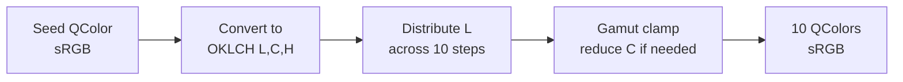

**API**：`TonalPaletteGenerator::GenerateLight(seed)` / `GenerateDark(seed)`

**色彩空间**：OKLCH（感知均匀）。参考：Bjorn Ottosson,
<https://bottosson.github.io/posts/oklab/>

OKLCH 提供感知均匀性：相等的亮度步长产生相等的感知亮度变化。HSL 受 Helmholtz-Kohlrausch 效应的影响。实现需要 sRGB <-> OKLCH 转换函数以及高色度Seed的色域限制。

### 2.6 颜色Seed与 JSON 配置

主题 JSON 文件支持用于算法调色板生成的 `"colorSeeds"` 对象：

```json
{
  "colorSeeds": {
    "colorPrimaryBase": "#0066ff",
    "colorPrimaryNavBase": "#0059b3",
    "colorSuccessBase": "#32CE99",
    "colorWarningBase": "#ED7B2F",
    "colorErrorBase": "#CC1423",
    "colorTextBase":   "#000000"，
    "colorBgBase":   "#FFFFFF"
  }
}
```

当提供Seed时，将算法生成该色相的 10 步调色板。
仍然可以通过 JSON 中的显式十六进制值覆盖单个步骤颜色。

### 2.7 禁用状态：Alpha 叠加正交性

>注：需要针对组件测试一下效果

禁用状态与颜色语义是 **正交的**。不使用每个变体的禁用Token，而是应用统一的 Alpha 叠加：

```
displayColor = baseTokenColor * kDisabledOpacity
```

其中 `kDisabledOpacity = 0.40F`（40% 不透明度）。

这防止了 `{variant} x {hue} x {state}` Token的组合爆炸。
当 `InteractionState::Disabled` 处于活动状态时，框架会自动应用此设置。

### 2.8 对比度检查器与 WCAG 合规性

**类**：`ContrastChecker`（静态工具）

| 方法 | 输入 | 输出 | 描述 |
|--------|-------|--------|-------------|
| `RelativeLuminance(color)` | `QColor` | `double [0,1]` | WCAG 2.1 相对亮度 |
| `Ratio(fg, bg)` | `QColor, QColor` | `double [1,21]` | 对比度比率 |
| `MeetsAA(fg, bg)` | `QColor, QColor` | `bool` | 正常文本 >= 4.5:1 |
| `MeetsAAA(fg, bg)` | `QColor, QColor` | `bool` | 正常文本 >= 7:1 |
| `MeetsAALargeText(fg, bg)` | `QColor, QColor` | `bool` | 大文本 >= 3:1 |
| `SuggestFix(fg, bg, ratio)` | `QColor, QColor, double` | `QColor` | 调整后的前景色以满足目标比率 |

**公式**：

$$L = 0.2126 \, R_{\text{lin}} + 0.7152 \, G_{\text{lin}} + 0.0722 \, B_{\text{lin}}$$

其中

$$R_{\text{lin}} = \begin{cases} \dfrac{R/255}{12.92} & \text{if } R/255 \le 0.04045 \\[6pt] \left(\dfrac{R/255 + 0.055}{1.055}\right)^{2.4} & \text{otherwise} \end{cases}$$

---

## 第 3 章. 字体排版系统

### 3.1 FontRole 枚举
>字体的字重、行高、字间距和是否斜体默认不赋值，即默认使用只改变字体大小，其他值变化时再以变量形式追加。

注：***font×××*** 是SeedToken，之下是 MapToken

| SeedToken 和 MapToken 名称 | 描述 | 类型 | 默认值 |
| :--- | :--- | :--- | :--- |
| ***fontWeightRegular*** | 常规文本 | number | 400 |
| ***fontWeightMedium*** | 中级文本 | number | 500 |
| ***fontWeightBold*** | 加粗文本 | number | 700 |
| ***fontItalic*** | 斜体文本 | Boolean | false |
| ***fontLineHeight*** | 行高 | number | 1.4 |
| ***fontLetterSpacing*** | 字间距 | number | 0 |
| ***fontSizeBase*** | 设计系统中使用最广泛的字体大小，文本派生也将基于该字号进行派生 | number | 12 |
| fontSizeXS | 特小尺寸（狭窄区域） | number | 10 |
| fontSizeSM | 小尺寸（默认大小） | number | 12 |
| fontSizeMD | 中尺寸（小模块标题） | number | 14 |
| fontSizeLG | 大尺寸（大模块标题） | number | 16 |
| fontSizeXL | 超大尺寸 | number | 18 |
| fontSizeXXL | 最大尺寸 | number | 20 |
|

### 3.2 FontSpec 结构体

```cpp
struct FontSpec {
    QString family;                     // 平台解析的字体家族
    int     sizeInPt      = 12;          // 与 DPI 无关的点大小
    int     weight        = 400;        // QFont::Weight (Normal=400, Bold=700)
    bool    italic        = false;      // 斜体样式标志
    qreal   lineHeightMultiplier = 1.4; // 行高 = fontSize * multiplier
    qreal   letterSpacing = 0.0;        // 额外字间距，单位 px
};
```

### 3.3 平台字体选择

| 平台 | 主要字体家族 | 等宽字体家族 | 选择方法 |
|----------|---------------|-----------------|-----------------|
| Windows | 中文：Microsoft YaHei；英文：Segoe UI | Noto Sans CJK SC / Arial | `QFontDatabase::systemFont(GeneralFont)` |
| macOS | 中文：PingFang SC；英文：San Francisco| SF Mono / Helvetica Neue | `QFontDatabase::systemFont(GeneralFont)` |
| Linux | 中文：WenQuanYi Micro Hei；英文：Roboto | Noto Sans Mono / DejaVu Sans | `QFontDatabase::systemFont(GeneralFont)` |

### 3.4 字体缩放系统

**全局字体缩放** 乘以所有 FontRole 基础大小：

| 预设 | 因子 | 用例 |
|--------|:------:|----------|
| `FontSizePreset::Small` | 0.875x | 用于密集 UI 的紧凑文本 |
| `FontSizePreset::Medium` | 1.0x | 默认 |
| `FontSizePreset::Large` | 1.25x | 无障碍 / 大显示屏 |

**自定义因子**：`SetFontScale(float)` 限制在 `[kFontScaleMin=0.5, kFontScaleMax=3.0]`。

**实际大小**：$\text{actualPt} = \text{basePt} \times \text{fontScaleFactor} \times \text{densityScale}$

### 3.5 JSON 字体覆盖

通过 `"fonts"` JSON 对象进行每个 FontRole 的自定义：

```json
{
  "fonts": {
    "Heading": { "size": 14, "weight": 700 },
    "Body":    { "size": 10 }
  }
}
```

**字段**：`size`（int，点大小）和 `weight`（int，QFont 字重）。
未指定的字段保留平台默认值。

### 3.6 动态字体注册（插件）

插件注册特定于领域的字体：

```cpp
DynamicFontDef defs[] = {
    { "CAD/PropertyGrid", FontSpec{ "Consolas", 8, 400 } },
};
theme.RegisterDynamicFonts(defs);

// 查询
auto font = theme.DynamicFont("CAD/PropertyGrid"); // -> std::optional<FontSpec>
```

全局 `_fontScale` 应用于动态字体查询。

### 3.7 完整的 FontRole 解析表

平台检测和默认缩放 (1.0x) 后的实际字体参数。

#### 3.7.1 Windows (Segoe UI)

| 角色 | 字体家族 | 大小 | 字重 | 斜体 | 行高 |
|------|--------|:---------:|:------:|:------:|:-----------:|
| `fontSizeXS` | Microsoft YaHei | 10 | 400 | 否 | 1.4x |
| `fontSizeSM` | Microsoft YaHei | 12 | 400 | 否 | 1.4x |
| `fontSizeMD` | Microsoft YaHei | 14 | 400 | 否 | 1.4x |
| `fontSizeLG` | Microsoft YaHei | 16 | 400 | 否 | 1.4x |
| `fontSizeXL` | Microsoft YaHei | 18 | 400 | 否 | 1.4x |
| `fontSizeXXL` | Microsoft YaHei | 20 | 400 | 否 | 1.4x |
|

#### 3.7.2 macOS (SF Pro Text)

| 角色 | 字体家族 | 大小 | 字重 | 斜体 | 行高 |
|------|--------|:---------:|:------:|:------:|:-----------:|
| `fontSizeXS` | PingFang SC | 10 | 400 | 否 | 1.4x |
| `fontSizeSM` | PingFang SC | 12 | 400 | 否 | 1.4x |
| `fontSizeMD` | PingFang SC | 14 | 400 | 否 | 1.4x |
| `fontSizeLG` | PingFang SC | 16 | 400 | 否 | 1.4x |
| `fontSizeXL` | PingFang SC | 18 | 400 | 否 | 1.4x |
| `fontSizeXXL` | PingFang SC | 20 | 400 | 否 | 1.4x |
|

#### 3.7.3 Linux (Noto Sans)

| 角色 | 字体家族 | 大小 | 字重 | 斜体 | 行高 |
|------|--------|:---------:|:------:|:------:|:-----------:|
| `fontSizeXS` | WenQuanYi Micro Hei | 10 | 400 | 否 | 1.4x |
| `fontSizeSM` | WenQuanYi Micro Hei | 12 | 400 | 否 | 1.4x |
| `fontSizeMD` | WenQuanYi Micro Hei | 14 | 400 | 否 | 1.4x |
| `fontSizeLG` | WenQuanYi Micro Hei | 16 | 400 | 否 | 1.4x |
| `fontSizeXL` | WenQuanYi Micro Hei | 18 | 400 | 否 | 1.4x |
| `fontSizeXXL` | WenQuanYi Micro Hei | 20 | 400 | 否 | 1.4x |
|


#### 3.7.4 字体缩放效果

对于字体缩放 $s$，实际点大小 $= \max(\lfloor \text{basePt} \cdot s + 0.5 \rfloor,\; 6)$。

| 缩放 | fontSizeXS | fontSizeSM | fontSizeMD | fontSizeLG |
|:-----:|:----:|:-------:|:-------:|:---------:|
| 0.5x | 6pt（限制） | 6pt | 7pt | 8pt |
| 0.875x (小) | 9pt | 11pt | 12pt | 14pt |
| 1.0x (中) | 10pt | 12pt | 14pt | 16pt |
| 1.25x (大) | 13pt | 15pt | 18pt | 20pt |
| 2.0x | 20pt | 24pt | 28pt | 32pt |
| 3.0x | 30pt | 36pt | 42pt | 48pt |

---

## 第 4 章. 空间系统

### 4.1 间距 SpaceToken

>分为内间距和外间距

注：sizeStep和sizeUnit是基础变量，其他派生计算

| SeedToken 和 MapToken 名称 | 描述 | 类型 | 默认值 |
| :--- | :--- | :--- | :--- |
| ***sizeStep*** | 尺寸步长：定义marginMS和paddingMS中间值 =sizeStep×sizeUnit | number | 4 |
| ***sizeUnit*** | 尺寸变化单位：变量加减的值 | number | 4 |
| SpaceNone | 无间距 | number | 0 |
| marginXXXS | 特殊值不参与计算 | number | 2 |
| marginXXS | 极小外边距 | number | 4 |
| marginXS | 特小外边距 | number | 8 |
| marginSM | 小外边距 | number | 12 |
| marginMS | 中外边距 | number | 16 |
| marginMD | 中大外边距 | number | 20 |
| marginLG | 外边距 | number | 24 |
| marginXL | 大外边距 | number | 28 |
| marginXXL | 特大外边距 | number | 32 |
| paddingXXXS | 特殊值不参与计算 | number | 2 |
| paddingXXS | 极小内间距 | number | 4 |
| paddingXS | 特小内间距 | number | 8 |
| paddingSM | 小内间距 | number | 12 |
| paddingMS | 中内间距 | number | 16 |
| paddingMD | 中大内间距 | number | 20 |
| paddingLG | 内间距 | number | 24 |
| paddingXL | 大内间距 | number | 28 |
| paddingXXL | 特大内间距 | number | 32 |
|


**实际像素输出**：$\lfloor \text{basePx} \times \text{densityScale} + 0.5 \rfloor$。

### 4.2 密度系统 DensitySystem

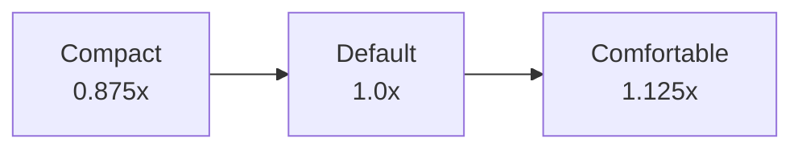

| 级别 | 缩放因子 | 目标用户 |
|-------|:----------:|------------|
| `Compact` | 0.875 | 高级用户、小屏幕 |
| `Default` | 1.000 | 标准 |
| `Comfortable` | 1.125 | 触摸设备、无障碍 |

**受影响的Token**：所有 `SpacingPx()`、`Radius()`、`SizeToken`、阴影 offsetY/blurRadius。

**API**：`SetDensity(DensityLevel)` -> 重建 QSS + 发出 `ThemeChanged`。

### 4.3 圆角 RadiusToken

注： ***borderRadius*** 是基础变量，其他派生计算

| SeedToken 和 MapToken 名称 | 描述 | 类型 | 默认值 |
| :--- | :--- | :--- | :--- |
| ***borderRadius*** | 边界半径 | number | 3 |
| borderRadiusNone | 无圆角 | number | 0 |
| borderRadiusSM | 小圆角 | number | 1 |
| borderRadiusMD | 默认圆角 | number | 3 |
| borderRadiusLG | 大圆角 | number | 6 |
| borderRadiusRound | 圆胶囊形状（调用者使用 `min(w,h)/2`） | number | 255 |
|

在 `Resolve()` 中进行密度缩放：$\text{radiusPx} = \text{Radius}(\text{token}) \times \text{densityScale}$。

### 4.4 线 LineToken

注： ***lineStyle*** 和 ***lineWidth*** 是基础变量，其他派生计算

| SeedToken 和 MapToken 名称 | 描述 | 类型 | 默认值 |
| :--- | :--- | :--- | :--- |
| ***lineStyle*** | 线类型 | string | solid |
| lineStyleSolid | 实线 | string | Solid |
| lineStyleDashed | 虚线 | string | Dashed |
| lineStyleDotted | 点线 | string | Dotted |
| ***lineWidth*** | 线宽 | number | 1 |
| lineWidth0 | 线0 | number | 0 |
| lineWidth1 | 线1（默认） | number | 1 |
| lineWidth2 | 线2（强调） | number | 2 |
| lineWidth3 | 线3 | number | 3 |
| lineWidth4 | 线4（高亮提示） | number | 4 |
|

### 4.5 图标尺寸 IconToken

注： ***SizeToken*** 是基础变量，其他派生计算

| SeedToken 和 MapToken 名称 | 描述 | 类型 | 默认值 |
| :--- | :--- | :--- | :--- |
| ***SizeToken*** | 控制图标大小 | number | 20 |
| IconSizeXXXXXS | 更多小角标图标 | number | 4 |
| IconSizeXXXXS | 更多大角标图标 | number | 6 |
| IconSizeXXXS | 小符号图标 | number | 8 |
| IconSizeXXS | 树节点角标图标 | number | 10 |
| IconSizeXS | 系统状态角标图标 | number | 12 |
| IconSizeSM | 小图标（系统图标） | number | 16 |
| IconSizeMS | 中图标（对话框标题图标） | number | 20 |
| IconSizeMD | 中大图标（对话框内主功能图标） | number | 24 |
| IconSizeLG | 工具栏图标 | number | 32 |
| IconSizeXL | 大图标 | number | 40 |
| IconSizeXXL | 大Logo图标 | number | 56 |
| IconSizeXXXL | 特大图标 | number | 64 |
|

### 4.6 控件高度 ControlToken

 注：***controlHeight*** 是基础变量，其他派生计算。

| SeedToken 和 MapToken 名称 | 描述 | 类型 | 默认值 |
| :--- | :--- | :--- | :--- |
| ***controlHeight*** | 控制基础部件高度 | number | 24 |
| controlHeightXS | 特小高度 | number | 20 |
| controlHeightSM | 小高度（默认） | number | 24 |
| controlHeightMS | 中高度 | number | 28 |
| controlHeightMD | 中大高度 | number | 32 |
| controlHeightLG | 高度 | number | 36 |
| controlHeightXL | 大高度 | number | 40 |
| controlHeightXXL | 大大高度 | number | 44 |
| controlHeightXXXL | 特大高度 | number | 48 |
|

密度缩放：$\text{actualPx} = \text{kBaseSizePx}[\text{token}] \times \text{densityScale}$。

### 4.7 弹出容器宽度 PopupWidthToken
>用于弹出容器外轮廓宽度；基于栅格系统（1920×1080屏幕）,列宽72px、槽8px（两侧余间距4px），1920px = 24×72px+23×8px+2×4px。

注：***controlColumnWidth*** 和 ***controlGutterWidth*** 是基础变量，其他是派生变量。
s
| SeedToken 和 MapToken 名称 | 描述 | 类型 | 默认值 |
| :--- | :--- | :--- | :--- |
| ***controlColumnWidth*** | 控制列宽宽度 | number | 72 |
| ***controlGutterWidth*** | 控制槽宽度 | number | 8 |
| controlPopupWidthXS | 特小宽度=72×2+8×1 | number | 152 |
| controlPopupWidthSM | 小宽度=72×3+8×2 | number | 232 |
| controlPopupWidthMS | 中宽度（默认对话框）=72×4+8×3 | number | 312 |
| controlPopupWidthMD | 中大宽度=72×6+8×5 | number | 472 |
| controlPopupWidthLG | 大宽度=72×8+8×7 | number | 632 |
| controlPopupWidthXL | 特大宽度=72×12+8×11 | number | 952 |
|

### 4.8 高度与阴影系统 ShadowToken

注：***Shadow*** 是基础变量，其他是派生变量。

| SeedToken 和 MapToken 名称 | 描述 | 类型 | 默认值 |
| :--- | :--- | :--- | :--- |
| ***Shadow*** | 方向(X, Y), 模糊度(Blur), 扩展值(Spread), RGBA | string | none |
| boxShadow | 一级阴影（悬浮） | string | 0px 1px 2px -2px rgba(0, 10, 26, 0.16), 0px 3px 6px 0px rgba(0, 10, 26, 0.12), 0px 5px 12px 4px rgba(0, 10, 26, 0.09) |
| boxShadowSecondary | 二级阴影（上下文菜单） | string | 0px 3px 6px -4px rgba(0, 10, 26, 0.12), 0px 6px 16px 0px rgba(0, 10, 26, 0.08), 0px 9px 28px 8px rgba(0, 10, 26, 0.05) |
| boxShadowTertiary | 三级阴影（对话框） | string | 0px 6px 16px -8px rgba(0, 10, 26, 0.08), 0px 9px 28px 0px rgba(0, 10, 26, 0.05), 0px 12px 48px 16px rgba(0, 10, 26, 0.03) |
|

**ShadowSpec 结构体**：`{ offsetX, offsetY, blurRadius, opacity }`。

阴影 `offsetY` 和 `blurRadius` 在 `Resolve()` 中进行密度缩放。

### 4.9 层级 LayerToken

注：***zIndexBase*** 和 ***zIndexPopupBase*** 是基础变量，其他是派生变量。

| SeedToken 和 MapToken 名称 | 描述 | 类型 | 默认值 |
| :--- | :--- | :--- | :--- |
| ***zIndexBase*** | 所有组件的基础 Z 轴值，用于一些悬浮类的组件的可以基于该值 Z 轴控制层级，例如 BackTop、Affix 等 | number | 0 |
| ***zIndexPopupBase*** | 浮层类组件的基础 Z 轴值，用于一些悬浮类的组件的可以基于该值 Z 轴控制层级，例如 FloatButton、Affix、Modal 等 | number | 1000 |
| zIndexElevated | 卡片、面板 | number | 1010 |
| zIndexSticky | 粘性标题（表格滚动时固定的表头） | number | 1020 |
| zIndexDropdown | 下拉菜单 | number | 1030 |
| zIndexModal | 对话框（模态、半模态、非模态） | number | 1040 |
| zIndexTooltip | 工具提示 | number | 1050 |
| zIndexNotification | 通知 | number | 1060 |
| zIndexLoading | 加载遮罩 | number | 1070 |
| zIndexMaximum | 调试覆盖层 | number | 9999 |
|

### 4.10 密度缩放效果表

紧凑 (0.875x)、默认 (1.0x) 和舒适 (1.125x)，每个密度级别下关键Token的实际像素值。

#### 4.10.1 间距Token缩放

适用

#### 4.10.2 尺寸Token缩放

适用

#### 4.10.3 圆角Token缩放

不适用

#### 4.10.4 线Token缩放

不适用

#### 4.10.5 图标尺寸Token缩放

适用

#### 4.10.6 控件高度Token缩放

适用

#### 4.10.7 容器宽度Token缩放

适用

#### 4.10.8 阴影缩放

适用

---

## 第 5 章. 动效系统


### 5.1 动画持续时间 AnimationsToken

注：***motionBase** 是基础变量，其他是派生变量。

| Token | 持续时间 | 感知阈值 | 用例 |
|-------|:--------:|---------------------|----------|
| ***motionBase*** | 0ms | -- | 无动画 / 测试模式 |
| motionDurationFast | 150ms | 因果关系 (~100ms) | 微交互（悬停、焦点） |
| motionDurationDefault | 200ms | 注意力窗口 (~200ms) | 标准状态转换 |
| motionDurationSlow | 350ms | 刻意转换 | 页面转换、展开/折叠 |
|

### 5.2 缓动曲线Token

| Token | 曲线 | 用例 |
|-------|-------|----------|
| `Linear` | 线性插值 | 进度条、确定性动画 |
| `OutCubic` | 减速（三次） | 大多数转换的默认值（快速退出） |
| `InOutCubic` | 先加速后减速 | 页面转换、模态框进入 |
| `Spring` | 弹簧动力学（见 5.3） | 自然、基于物理的运动 |

**数学定义**：

- **Linear**：$f(t) = t$
- **OutCubic**：$f(t) = 1 - (1 - t)^3$。属性：$f(0)=0$, $f(1)=1$, $f'(0)=3$, $f'(1)=0$（零终端速度）。感知为“快速开始，缓慢结束”——非常适合进入视口的元素。
- **InOutCubic**：$f(t) = 4t^3$ (当 $t < 0.5$)；$f(t) = 1 - (-2t + 2)^3 / 2$ (当 $t \ge 0.5$)。属性：$f(0)=0$, $f(1)=1$, $f'(0)=0$, $f'(1)=0$（两端速度为零）。感知为“缓入缓出”——非常适合页面转换。
- **Spring**：不是参数曲线。通过半隐式欧拉积分求解（见 5.3）。

### 5.3 弹簧动力学

**模型**：阻尼谐振子

$$m \, x''(t) + c \, x'(t) + k \bigl(x(t) - x_{\text{target}}\bigr) = 0$$

其中 $m$ = 质量，$c$ = 阻尼，$k$ = 刚度。

**SpringSpec 结构体**：`{ mass=1.0, stiffness=200.0, damping=20.0 }`

**JSON 配置**：

```json
{
  "spring": {
    "mass": 1.0,
    "stiffness": 180.0,
    "damping": 18.0
  }
}
```

**积分**：半隐式欧拉法 (SIE)。运行直到收敛
（速度 < 阈值 且 位移 < 阈值）。

**API**：`IThemeService::Spring()` 返回全局默认 `SpringSpec`。
`IAnimationService::AnimateSpring()` 接受每次调用的覆盖。

### 5.4 TransitionDef

存储在 `WidgetStyleSheet::transition` 中的单 Widget 动画配置：

```cpp
struct TransitionDef {
    AnimationToken duration = AnimationToken::Normal;  // 200ms
    EasingToken    easing   = EasingToken::OutCubic;   // 减速
};
```

### 5.5 减弱动作 (WCAG 2.1 SC 2.3.3)

`SetReducedMotion(true)` -> 所有 `Animate()` 调用立即跳转到目标值。
仍然会分派 `AnimationStarted` 和 `AnimationCompleted` 通知
（因此触发验证测试可以工作）。

### 5.6 速度倍率

`SetSpeedMultiplier(float)`：1.0 = 正常，0.5 = 半速，2.0 = 双倍。
全局影响所有动画持续时间。

---
---

# 第 II 部分 -- 主题引擎

> 第 6-8 章。将Token解析为具体值的运行时基础设施。

## 第 6 章. IThemeService 接口

### 6.1 接口概述与继承

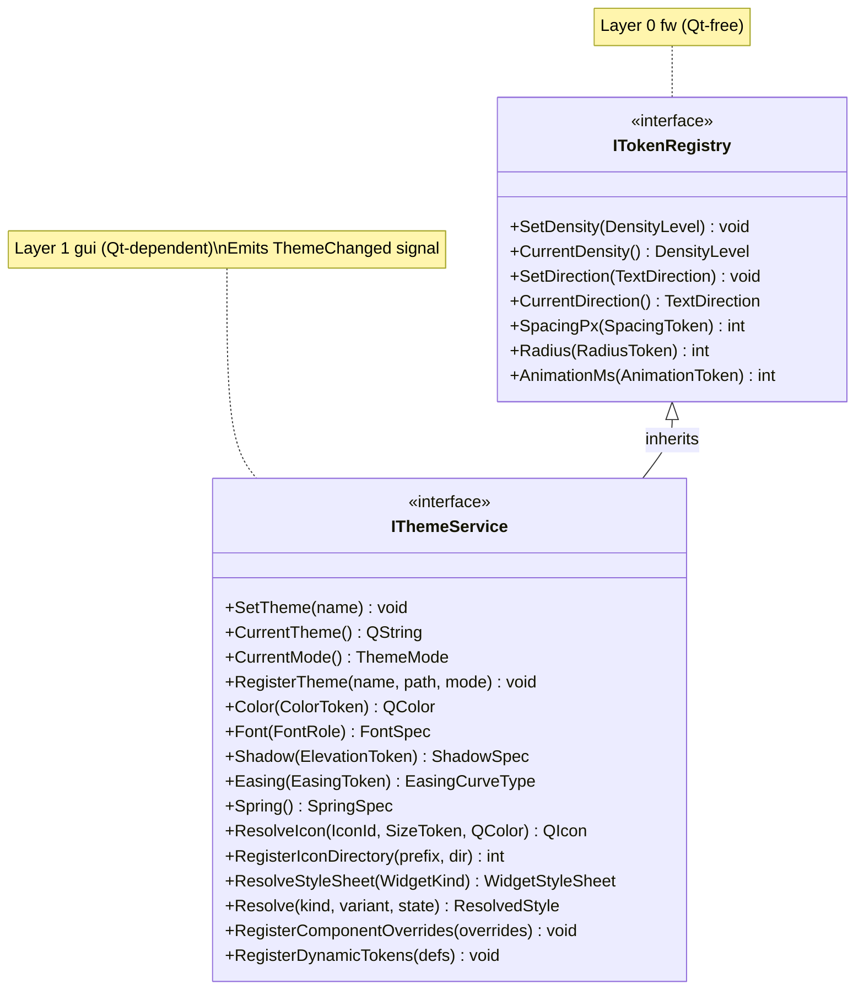

**线程安全**：`IThemeService` 仅限主线程。所有查询方法都是
`const`，对于绘制线程的并发读取是安全的，但变更
方法（`SetTheme`、`SetDensity` 等）必须从主线程调用。

### 6.2 主题生命周期 API

| 方法 | 签名 | 描述 |
|--------|-----------|-------------|
| `SetTheme` | `void SetTheme(const QString& name)` | 按名称加载并激活主题。发出 `ThemeChanged`。 |
| `CurrentTheme` | `QString CurrentTheme() const` | 返回活动主题的名称。 |
| `CurrentMode` | `ThemeMode CurrentMode() const` | 返回活动主题的 `Light` 或 `Dark` 分类。 |
| `RegisterTheme` | `void RegisterTheme(const QString& name, const QString& jsonPath, ThemeMode mode)` | 注册自定义主题。没有插槽限制。 |

**内置主题常量**：`kThemeLight`、`kThemeDark`、`kThemeHighContrast`。

**ThemeMode 枚举**：`enum class ThemeMode : uint8_t { Light, Dark }`。

### 6.3 Token查询 API

所有查询方法都是 O(1) 平数组查找。

| 方法 | 输入 | 输出 | 备注 |
|--------|-------|--------|-------|
| `Color(token)` | `ColorToken` | `QColor` | 通过 `std::to_underlying(token)` 索引 |
| `Font(role)` | `FontRole` | `const FontSpec&` | 已缓存，应用了字体缩放 |
| `Shadow(level)` | `ElevationToken` | `ShadowSpec` | 密度缩放 |
| `Easing(token)` | `EasingToken` | `QEasingCurve::Type` | 映射到 Qt 枚举 |
| `Spring()` | -- | `SpringSpec` | 主题配置的弹簧参数 |
| `SpacingPx(token)` | `SpacingToken` | `int` | 密度缩放（继承自 ITokenRegistry） |
| `Radius(token)` | `RadiusToken` | `int` | 密度缩放（继承自 ITokenRegistry） |
| `AnimationMs(token)` | `AnimationToken` | `int` | 持续时间（毫秒） |

### 6.4 图标解析 API

| 方法 | 签名 | 描述 |
|--------|-----------|-------------|
| `ResolveIcon` | `QIcon ResolveIcon(const IconId& uri, SizeToken size, QColor tint) const` | 加载 SVG、着色、缓存。感知 DPI。 |
| `RegisterIconDirectory` | `int RegisterIconDirectory(std::string_view uriPrefix, const QString& dirPath)` | 扫描目录中的 .svg 文件，将每个文件注册为 `{prefix}/{filename}`。返回计数。 |
| `InvalidateIconCache` | `void InvalidateIconCache()` | 清除缓存的图标（主题更改后调用）。 |

**图标 URI 格式**：内置图标使用 `asset://COCAUI/icons/{name}`。
插件使用自定义前缀：`asset://myplugin/icons/{name}`。

**着色**：SVG `fill` 和 `stroke` 属性被替换为 `tint` 颜色。
这使单一来源的 SVG 能够适应任何主题。

### 6.5 声明式样式解析 API

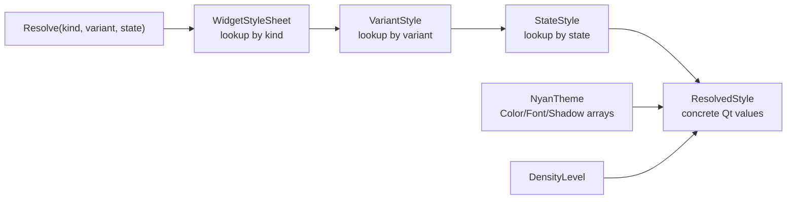

| 方法 | 输入 | 输出 | 描述 |
|--------|-------|--------|-------------|
| `Resolve` | `WidgetKind, size_t variantIdx, InteractionState` | `ResolvedStyle` | 一次调用完成样式解析 |
| `ResolveStyleSheet` | `WidgetKind` | `const WidgetStyleSheet&` | 单 Widget 几何 + 变体范围 |

**ResolvedStyle 结构体**（所有字段都是具体的 Qt 值）：

| 字段 | 类型 | 来源 |
|-------|------|--------|
| `background` | `QColor` | `StateStyle::background` -> `Color(token)` |
| `foreground` | `QColor` | `StateStyle::foreground` -> `Color(token)` |
| `border` | `QColor` | `StateStyle::border` -> `Color(token)` |
| `radiusPx` | `int` | `WidgetStyleSheet::radius` -> `Radius(token) * density` |
| `paddingHPx` | `int` | `WidgetStyleSheet::paddingH` -> `SpacingPx(token)` |
| `paddingVPx` | `int` | `WidgetStyleSheet::paddingV` -> `SpacingPx(token)` |
| `gapPx` | `int` | `WidgetStyleSheet::gap` -> `SpacingPx(token)` |
| `minHeightPx` | `int` | `WidgetStyleSheet::minHeight` -> `ToPixels(token) * density` |
| `borderWidthPx` | `int` | `StateStyle::borderWidth` -> `SpacingPx(token)` |
| `font` | `QFont` | `WidgetStyleSheet::font` -> `Font(role)` |
| `shadow` | `ShadowSpec` | `WidgetStyleSheet::elevation` -> `Shadow(token)` |
| `opacity` | `float` | `StateStyle::opacity` (1.0 正常，<1.0 禁用) |
| `durationMs` | `int` | `WidgetStyleSheet::transition.duration` -> `AnimationMs(token)` |
| `easingType` | `int` | `WidgetStyleSheet::transition.easing` -> `Easing(token)` |

### 6.6 组件覆盖 API

```cpp
struct ComponentOverride {
    WidgetKind     kind;
    RadiusToken    radius;        // 覆盖此 widget 类的圆角
    SpacingToken   paddingH;      // 覆盖水平内边距
    SpacingToken   paddingV;      // 覆盖垂直内边距
    FontRole       font;          // 覆盖字体角色
    ElevationToken elevation;     // 覆盖高度
};
```

**注册**：`RegisterComponentOverrides(std::span<const ComponentOverride>)`

**优先级**：ComponentOverride > BuildDefaultVariants() 默认值。

### 6.7 动态Token API（插件扩展）

| 定义结构体 | 字段 | 描述 |
|------------------|--------|-------------|
| `DynamicColorDef` | `name, lightValue, darkValue` | 主题感知颜色（每种模式不同值） |
| `DynamicFontDef` | `name, fontSpec` | 自定义字体规范 |
| `DynamicSpacingDef` | `name, basePx` | 自定义间距值（密度缩放） |

| 方法 | 描述 |
|--------|-------------|
| `RegisterDynamicTokens(span<DynamicColorDef>)` | 注册插件颜色 |
| `RegisterDynamicFonts(span<DynamicFontDef>)` | 注册插件字体 |
| `RegisterDynamicSpacings(span<DynamicSpacingDef>)` | 注册插件间距 |
| `DynamicColor(name) -> optional<QColor>` | 按字符串名称查询 |
| `DynamicFont(name) -> optional<FontSpec>` | 按字符串名称查询 |
| `DynamicSpacingPx(name) -> optional<int>` | 按字符串名称查询（密度缩放） |
| `UnregisterDynamicTokens(span<string_view>)` | 按名称移除 |

### 6.8 字体缩放 API

| 方法 | 描述 |
|--------|-------------|
| `SetFontScale(float)` | 设置自定义字体缩放因子 [0.5, 3.0] |
| `FontScale() -> float` | 获取当前字体缩放 |
| `SetFontSizePreset(FontSizePreset)` | 从预设设置（小/中/大） |

### 6.9 密度与方向 API

| 方法 | 描述 |
|--------|-------------|
| `SetDensity(DensityLevel)` | 设置密度（重建 QSS，发出 ThemeChanged） |
| `CurrentDensity() -> DensityLevel` | 获取活动密度 |
| `SetDirection(TextDirection)` | 设置 LTR/RTL（重建 QSS，发出 ThemeChanged） |
| `CurrentDirection() -> TextDirection` | 获取活动方向 |

### 6.10 测试支持 API

| 方法 | 描述 |
|--------|-------------|
| `SetAnimationOverride(int forceMs)` | 强制所有动画为指定持续时间。0 = 瞬间跳转。-1 = 恢复正常。 |

### 6.11 ThemeChanged 信号与 ThemeAware 混入

**信号**：`void ThemeChanged(const QString& newThemeName)`

发出者：`SetTheme()`、`SetDensity()`、`SetDirection()`、`SetFontScale()`。

**ThemeAware 混入**（用于 Widget）：

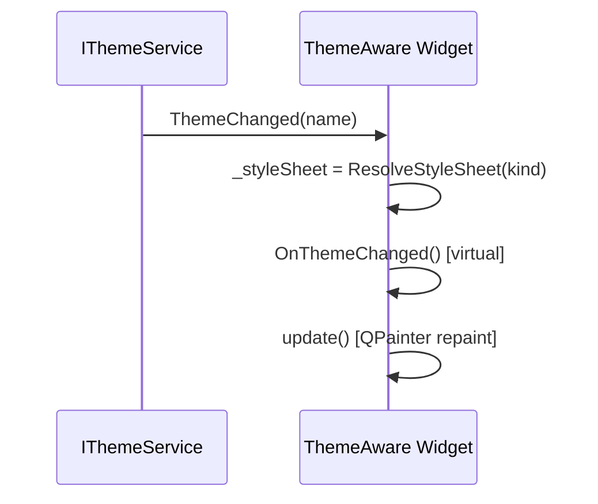

| ThemeAware 方法 | 描述 |
|-------------------|-------------|
| `Theme() -> IThemeService&` | 访问全局主题服务 |
| `StyleSheet() -> const WidgetStyleSheet&` | 缓存的单 Widget 样式表 |
| `OnThemeChanged()` | 虚拟回调，覆盖以触发重绘 |
| `AnimateTransition(propId, from, to)` | 使用 StyleSheet 中的 TransitionDef 进行动画 |
| `PaintFocusRing(QPainter&, QRect, int radius)` | 绘制标准焦点指示器 |

---

## 第 7 章. JSON 主题配置

### 7.1 主题文件结构

```json
{
  "extends": "Light",
  "colorSeeds": { ... },
  "colors": { ... },
  "fonts": { ... },
  "spring": { ... },
  "fontScale": 1.0
}
```

所有键都是可选的。缺失的键从 `extends` 主题或内置默认值继承。

### 7.2 颜色覆盖

`"colors"` 对象将 ColorToken 名称映射到十六进制值：

```json
{
  "colors": {
    "Surface": "#FAFAFA",
    "Primary": "#0066FF",
    "TextPrimary": "#1A1A1A"
  }
}
```

键名必须完全匹配 `ColorToken` 枚举成员名称（区分大小写）。

### 7.3 颜色Seed

`"colorSeeds"` 对象触发算法调色板生成：

```json
{
  "colorSeeds": {
    "primary": "#0066FF"
  }
}
```

当提供Seed时，TonalPaletteGenerator 为该色相生成 10 个步骤。
同一色相的显式 `"colors"` 条目会覆盖单个生成的步骤。

### 7.4 字体覆盖

```json
{
  "fonts": {
    "Heading": { "size": 14, "weight": 700 },
    "Monospace": { "size": 10 }
  }
}
```

键匹配 `FontRole` 枚举名称。字段：`size`（int pt）、`weight`（int）。

### 7.5 弹簧配置

```json
{
  "spring": {
    "mass": 1.0,
    "stiffness": 180.0,
    "damping": 18.0
  }
}
```

### 7.6 字体缩放

```json
{
  "fontScale": 1.25
}
```

浮点值，限制在 [0.5, 3.0]。

### 7.7 主题继承

`"extends"` 键按名称引用已注册的主题：

```json
{
  "extends": "Dark",
  "colors": {
    "Primary": "#BB86FC"
  }
}
```

继承是递归的。解析链：此主题 -> extends -> extends.extends -> 内置默认值。

### 7.8 自定义主题注册流程

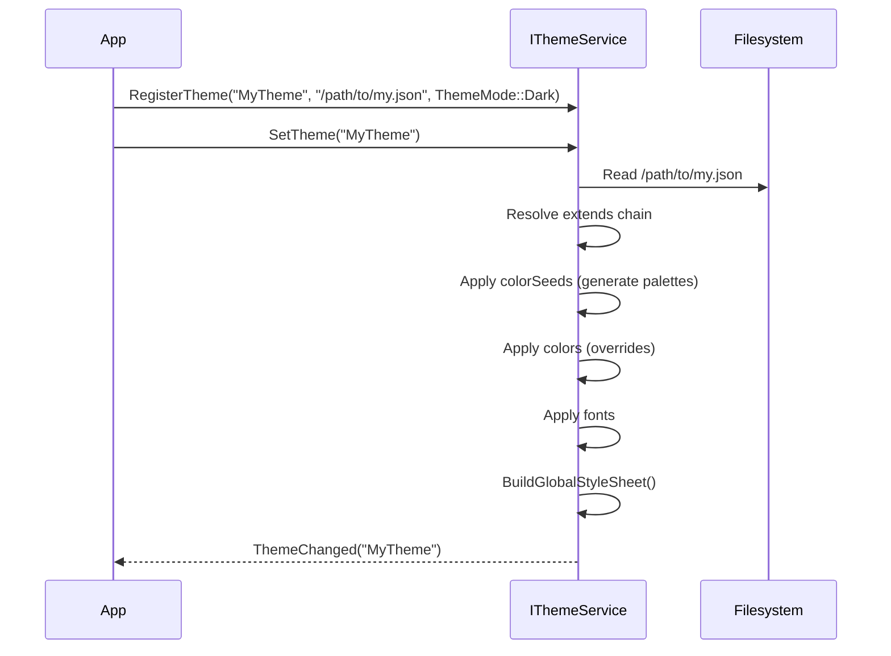

### 7.9 验证

**架构**：`Resources/tokens_schema.json` (JSON Schema draft-07)

**验证器**：`Scripts/validate_tokens.py`（由 CMake 自定义命令调用）

验证：
- 所需的颜色键都存在
- 十六进制颜色格式（`#RRGGBB` 或 `#RRGGBBAA`）
- 没有未知的顶级键
- 字体大小/字重范围

### 7.10 深色模式生成规则

深色模式 **不是**简单的反转。调色板生成算法需要：

1.  **HSV/HSB 色彩空间操作**：将Seed颜色转换为 HSV
2.  **亮度插值的贝塞尔曲线**：浅色和深色主题的不同参数
3.  **深色模式下的饱和度限制**：限制饱和度以避免持续使用下的视觉疲劳
4.  **移植 Ant Design 的 `generate()` 函数**：该算法从Seed生成 10 个色调步骤

**设计决策**：

| 决策 | 解决方案 | 理由 |
|----------|-----------|-----------|
| `TextDisabled` vs `TextQuaternary` | 保留 `TextDisabled` | 始终显示禁用外观文本的便捷Token |
| Info 色相独立性 | 是，独立于 Primary | Info 在领域上下文中可能需要不同的色相 |
| 调色板算法 | 移植 Ant Design 的 `generate()` | 经过良好测试、行业公认的色调生成 |
| 代码生成工具 | Python | 跨平台，易于 JSON I/O |
| 合并 `BgComponentStrong/Stronger` | 接受合并 | 在不丢失表现力的情况下减少Token数量 |

### 7.11 DTFM 集成

JSON 调色板格式与 **W3C Design Tokens Format Module** (DTFM) 对齐：

- 每个Token都有 `$type` 和 `$value` 字段
- `$type` 值：`color`、`dimension`、`fontFamily`、`fontWeight`、`duration`、`cubicBezier`
- 主题文件可以通过 `{token.path}` 语法引用其他Token
- 构建时代码生成（Python）读取 DTFM JSON 并生成 C++ constexpr 数组

---

## 第 8 章. NyanTheme 实现

### 8.1 Token存储

所有Token值都存储在扁平的 `std::array` 容器中：

| 数组 | 类型 | 大小 | 索引 |
|-------|------|:----:|-------|
| `_colors` | `QColor` | 75 | `ColorToken` |
| `_fonts` | `FontSpec` | 7 | `FontRole` |
| `_shadows` | `ShadowSpec` | 5 | `ElevationToken` |
| `_easings` | `QEasingCurve::Type` | 4 | `EasingToken` |
| `_styleSheets` | `WidgetStyleSheet` | 54 | `WidgetKind` |

查找：`_colors[std::to_underlying(token)]` -- O(1)，缓存友好。

### 8.2 BuildFonts() 平台逻辑

1. 查询 `QFontDatabase::systemFont(QFontDatabase::GeneralFont)` 获取主要字体家族
2. 查询等宽字体家族：尝试 "Cascadia Mono" (Win)、"SF Mono" (mac)、"Noto Sans Mono" (Linux)
3. 使用平台字体家族 + 特定于角色的尺寸/字重填充 `_fonts[role]`
4. 应用 `_fontScale` 乘数

### 8.3 BuildShadows() 算法

对于每个 `ElevationToken` 级别：
- `offsetY = level * 1`（线性缩放）
- `blurRadius = level * 3`（3 倍乘数）
- `opacity = level * 0.04`（每级 4%）
- 对 offsetY 和 blurRadius 应用密度缩放

### 8.4 BuildDefaultVariants()

为每个 `WidgetKind` 构造 `std::vector<VariantStyle>`。
每个 VariantStyle 有 8 个 `StateStyle` 条目（每个 `InteractionState` 一个）。

第 10 章中有详细的单 Widget 规范。

### 8.5 BuildGlobalStyleSheet()

从设计Token生成全局 QSS 字符串，通过
`QApplication::setStyleSheet()` 应用。涵盖标准 Qt Widget：
QPushButton、QLineEdit、QTextEdit、QSpinBox、QComboBox、QScrollBar、
QTabBar、QCheckBox、QRadioButton、QGroupBox、QSlider、QProgressBar、
QToolTip、QMenu、QMenuBar、QHeaderView。

重建时机：`SetTheme()`、`SetDensity()`、`SetDirection()`。

### 8.6 LoadPalette() JSON 解析管道

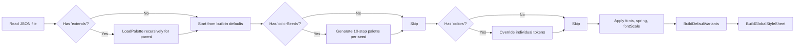

### 8.7 TonalPaletteGenerator

**类**：`TonalPaletteGenerator`（静态工具）

| 方法 | 输入 | 输出 |
|--------|-------|--------|
| `GenerateLight(QColor seed)` | Seed颜色 | `std::array<QColor, 10>` 浅色主题坡度 |
| `GenerateDark(QColor seed)` | Seed颜色 | `std::array<QColor, 10>` 深色主题坡度 |

**算法**：具有 sRGB 色域限制的 OKLCH 亮度分布。
有关数学细节，请参阅第 2.5 章。

### 8.8 SetTheme() 执行顺序

调用 `SetTheme(name)` 时的完整序列：

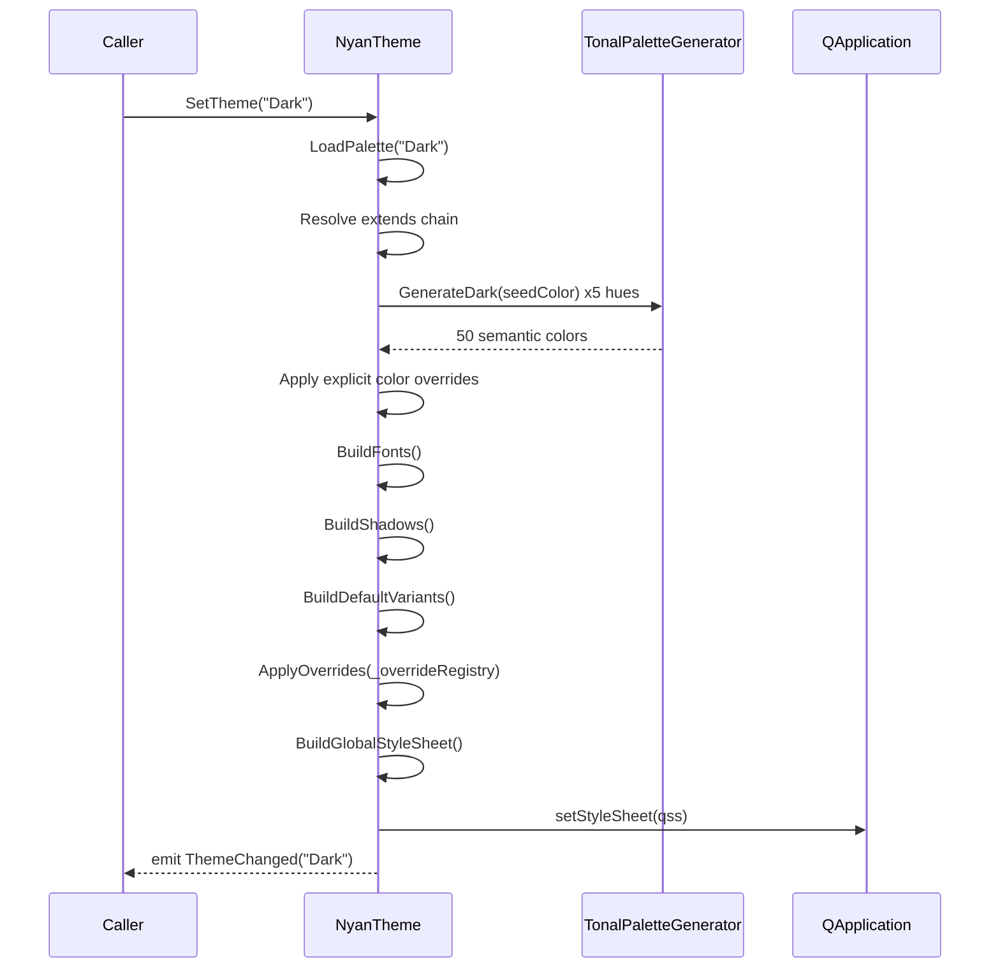

### 8.9 NyanTheme 内部成员布局

| 成员 | 类型 | 初始化 |
|--------|------|-------------|
| `_colors` | `std::array<QColor, 75>` | `LoadPalette()` |
| `_fonts` | `std::array<FontSpec, 7>` | `BuildFonts()` |
| `_shadows` | `std::array<ShadowSpec, 5>` | `BuildShadows()` |
| `_easings` | `std::array<QEasingCurve::Type, 4>` | 构造函数（静态） |
| `_styleSheets` | `std::array<WidgetStyleSheet, 54>` | `BuildDefaultVariants()` |
| `_iconRegistry` | `unordered_map<string, QString>` | `RegisterIconDirectory()` |
| `_dynamicColors` | `unordered_map<string, DynamicColorDef>` | `RegisterDynamicTokens()` |
| `_dynamicFonts` | `unordered_map<string, DynamicFontDef>` | `RegisterDynamicFonts()` |
| `_dynamicSpacings` | `unordered_map<string, DynamicSpacingDef>` | `RegisterDynamicSpacings()` |
| `_themeRegistry` | `unordered_map<string, ThemeEntry>` | `RegisterTheme()` |
| `_overrideRegistry` | `vector<ComponentOverride>` | `RegisterComponentOverrides()` |
| `_currentTheme` | `QString` | `SetTheme()` |
| `_currentMode` | `ThemeMode` | `SetTheme()` |
| `_fontScale` | `float` | 构造函数 (1.0) |
| `_density` | `DensityLevel` | 构造函数 (默认) |
| `_direction` | `TextDirection` | 构造函数 (LTR) |
| `_spring` | `SpringSpec` | `LoadPalette()` |
| `_paletteDir` | `QString` | 构造函数 |

### 8.10 BuildDefaultVariants() 覆盖范围

`BuildDefaultVariants()` 必须填充所有 54 个 `WidgetKind` 条目。该函数
内部分派给按 Widget 层级组织的辅助函数：

```cpp
void NyanTheme::BuildDefaultVariants()
{
    BuildCoreInputVariants();       // PushButton, ToolButton, LineEdit, ...
    BuildContainerVariants();       // ScrollArea, Panel, GroupBox, ...
    BuildMenuVariants();            // MenuBar, Menu, MenuItem, ...
    BuildApplicationVariants();     // DocumentBar, ProgressBar, Tooltip, ...
    BuildDialogVariants();          // Dialog, DialogTitleBar, DialogFootBar, ...
    BuildActionBarVariants();       // ActionTab, ActionToolbar
    BuildShellVariants();           // MainTitleBar, StatusBar, DocumentToolBar, ...
}
```

每个辅助函数使用Token引用（而不是原始颜色值）构造 `VariantStyle` 数组。示例模式：

```cpp
void NyanTheme::BuildCoreInputVariants()
{
    auto& sheet = _styleSheets[std::to_underlying(WidgetKind::PushButton)];
    sheet.radius    = RadiusToken::Default;
    sheet.paddingH  = SpacingToken::Px12;
    sheet.paddingV  = SpacingToken::Px6;
    sheet.font      = FontRole::BodyMedium;
    sheet.elevation = ElevationToken::Low;
    sheet.transition = { AnimationToken::Quick, EasingToken::OutCubic };

    // 变体 0：Primary
    sheet.variants[0].colors[Normal]   = { ColorToken::colorPrimary,   ColorToken::OnAccent, ColorToken::colorPrimary };
    sheet.variants[0].colors[Hovered]  = { ColorToken::colorPrimaryBgHover, ColorToken::OnAccent, ColorToken::colorPrimaryBgHover };
    sheet.variants[0].colors[Pressed]  = { ColorToken::colorPrimaryActive, ColorToken::OnAccent, ColorToken::colorPrimaryActive };
    sheet.variants[0].colors[Disabled] = { ColorToken::colorPrimary, ColorToken::OnAccent, ColorToken::colorPrimary, 0.45F };
    // ... (Focused, Selected, Error, DragOver)

    // 变体 1：Secondary
    // ...（使用中性Token的类似模式）
}
```

### 8.11 BuildGlobalStyleSheet() QSS 生成

生成的 QSS 字符串涵盖约 300 行 Qt 样式表规则。关键模式：

| Qt Widget | 设置的 QSS 属性 |
|-----------|-------------------|
| `QPushButton` | `background-color`、`color`、`border`、`border-radius`、`padding`、`font` |
| `QLineEdit` | `background-color`、`color`、`border`、`border-radius`、`padding`、`selection-*` |
| `QComboBox` | `background-color`、`color`、`border`、`padding`、`::drop-down`、`::down-arrow` |
| `QScrollBar` | `background`、`::handle`、`::add-line`、`::sub-line`、`width`/`height` |
| `QTabBar::tab` | `background`、`color`、`border-bottom`、`padding`、`:selected`、`:hover` |
| `QCheckBox::indicator` | `width`、`height`、`border`、`border-radius`、`:checked`、`:indeterminate` |
| `QSlider::groove` | `background`、`height`/`width`、`border-radius` |
| `QSlider::handle` | `background`、`width`、`height`、`border-radius`、`margin` |
| `QProgressBar` | `background`、`color`、`border`、`text-align`、`::chunk` |
| `QToolTip` | `background-color`、`color`、`border`、`padding`、`font` |
| `QMenu` | `background-color`、`color`、`border`、`padding`、`::item`、`::separator` |
| `QMenuBar` | `background-color`、`color`、`::item:selected`、`::item:pressed` |
| `QHeaderView::section` | `background-color`、`color`、`border`、`padding`、`font` |

QSS 中的所有颜色值在生成时从 `_colors[token]` 解析。
生成的 QSS 中不出现Token名称——只有解析后的十六进制值。

### 8.12 样式与资源重用的铁律

> **现有的视觉标识（调色板、图标资源、ToolBench 配置、菜单定义）是 UI/UX 设计工作的产物，必须逐字保留。** 重构改变的是 **代码架构**，而不是 **美术输出**。

| 规则 | 细节 |
|------|--------|
| **R1: 无颜色值更改** | 调色板中约 85x2 个颜色值是规范的。未经设计师签署批准，不得修改十六进制值。 |
| **R2: 无图标替换** | 所有 SVG/PNG 图标都是设计交付物。缺失的文件获取相同尺寸的占位符，绝不删除 `.qrc` 条目。 |
| **R3: 无样式默认值更改** | `NyanAbstractStyle` 默认值（Radius=3、Border=Line2 等）定义了视觉语言。新的 `WidgetStyleSheet` 必须产生相同的输出。 |
| **R4: ToolBench/Menu 配置保留** | `.cfg` 和 `.json` 资源文件按原样使用。 |
| **R5: 主题路径约定** | `:/<Theme>/<Theme>/...` 模式。`IThemeService::IconPath()` 遵循此模式。 |
| **R6: 字体基线** | ToolButton 字体：11px 逻辑。未经设计师批准不得更改大小。 |

### 8.13 现有图标资源清单

整体分为系统级图标和功能图标，全都使用PNG格式，大小基于1K屏幕提供四倍图


> **注意**：本项目中的资源接口与未来的资产管理器系统保持一致，但不提供具体实现。迁移将在资产管理器系统和资源编译器合并到主流之后立即进行。

---

# 第 III 部分 -- 组件样式系统

> 第 9-11 章。连接设计Token与 Widget 绘制的桥梁。

## 第 9 章. 声明式样式架构

### 9.1 动机：为什么需要声明式样式

引入声明式样式系统是为了解决传统 Qt Widget 绘制中特定的、可量化的一组工程缺陷：

| 问题 | 量化 | 后果 |
|---------|---------------|-------------|
| 硬编码颜色查询 | **248** 个分散在 `paintEvent` 方法中的 `svc.Color(token)` 调用 | 主题切换需要审计每个 Widget |
| 未使用的变体基础设施 | `WidgetStyleSheet::variants` 字段已分配但从未填充 | 死内存，虚假的 API 承诺 |
| 死的默认构建代码 | `BuildDefaultVariants()` 已编译但从未执行 | 零收益的维护成本 |
| 缺失的状态叠加 | 声明了 `Color(token, state)` 但未实现 | 悬停/按下状态使用临时颜色数学 |
| 硬编码像素值 | 间距、尺寸、边框宽度作为魔术数字 | 无法进行密度缩放 |
| 手动字体构造 | 在绘制代码中内联构建 `QFont` | 字体缩放更改需要接触每个 Widget |

根本原因是 **缺少抽象**：没有单一函数将 (widget 身份、视觉变体、交互状态) 映射到一组完整的视觉属性。每个 Widget 都在其 `paintEvent` 中重新发明这种映射，导致不一致、不可测试的视觉逻辑以及 O(N) 的维护成本，其中 N = Widget 数量。

**声明式样式系统通过引入正是那个缺失的函数来消除这类问题**：`IThemeService::Resolve()`。

> 有关实施阶段和迁移示例，请参阅第 9.10-9.12 节。

### 9.2 设计-代码同构

目标是 `UI = f(state)`，其中：

- **定义域** (状态): `InteractionState` x `VariantIndex` x `WidgetKind`
- **值域** (视觉输出): `ResolvedStyle` (颜色、几何、字体排印、动画)
- **映射** (f): `IThemeService::Resolve(kind, variant, state)`

当此映射是显式和声明式时，C++ 视图层与设计组件树实现结构同构。

**设计规则。** Widget 绘制使用 `ResolvedStyle = Theme().Resolve(kind, variant, state)` —— 一个从 (WidgetKind, 变体索引, InteractionState) 到视觉属性的纯函数。这消除了绘制方法中分散的 `if/else` 颜色逻辑。所有 54 种 Widget 种类都需要在 `BuildDefaultVariants()` 中拥有完整的变体 x 状态矩阵。

### 9.3 设计信息交换的四个维度

| 维度 | 内容 | COCAUI 机制 |
|-----------|---------|-----------------|
| **静态基元** | 颜色、字体、间距、阴影、缓动 | `ColorToken`、`FontRole`、`SpacingToken`、`ShadowSpec`、`EasingToken` |
| **布局约束** | 内边距、外边距、间隙、最小高度、密度 | `WidgetStyleSheet` 几何字段 + `SizeToken` + `DensityLevel` |
| **组件 FSM** | 状态枚举、状态到视觉的映射 | `InteractionState` + `StateStyle` + `VariantStyle` |
| **动态行为** | 动画持续时间、缓动、弹簧 | `TransitionDef` + `AnimationToken` + `EasingToken` + `SpringSpec` |

### 9.4 WidgetStyleSheet 结构体

```cpp
struct WidgetStyleSheet {
    // 几何（由 Resolve 进行密度缩放）
    RadiusToken    radius      = RadiusToken::Default;
    SpacingToken   paddingH    = SpacingToken::Px4;
    SpacingToken   paddingV    = SpacingToken::Px4;
    SpacingToken   gap         = SpacingToken::Px4;
    SizeToken      minHeight   = SizeToken::Md;
    SpacingToken   borderWidth = SpacingToken::Px1;

    // 字体排印
    FontRole       font        = FontRole::Body;

    // 视觉
    ElevationToken elevation   = ElevationToken::Flat;
    LayerToken     layer       = LayerToken::Base;

    // 过渡
    TransitionDef  transition;

    // 变体颜色映射（NyanTheme 存储的非拥有视图）
    std::span<const VariantStyle> variants;
};
```

| 字段 | 类型 | 默认值 | 描述 |
|-------|------|---------|-------------|
| `radius` | `RadiusToken` | `Default` (3px) | 圆角半径 |
| `paddingH` | `SpacingToken` | `Px4` (4px) | 水平内容内边距 |
| `paddingV` | `SpacingToken` | `Px4` (4px) | 垂直内容内边距 |
| `gap` | `SpacingToken` | `Px4` (4px) | 图标-文本间隙、项目间距 |
| `minHeight` | `SizeToken` | `Md` (32px) | 最小组件高度 |
| `borderWidth` | `SpacingToken` | `Px1` (1px) | 默认边框描边宽度 |
| `font` | `FontRole` | `Body` | 文本字体角色 |
| `elevation` | `ElevationToken` | `Flat` | 盒阴影级别 |
| `layer` | `LayerToken` | `Base` | Z-index 堆叠顺序 |
| `transition` | `TransitionDef` | `{Normal, OutCubic}` | 状态更改的动画配置 |
| `variants` | `span<VariantStyle>` | -- | 变体颜色映射的非拥有视图 |

### 9.5 StateStyle 结构体

```cpp
struct StateStyle {
    ColorToken   background  = ColorToken::Surface;
    ColorToken   foreground  = ColorToken::colorText;
    ColorToken   border      = ColorToken::BorderSubtle;
    float        opacity     = 1.0F;
    SpacingToken borderWidth = SpacingToken::Px1;
    CursorToken  cursor      = CursorToken::Default;
};
```

| 字段 | 类型 | 描述 |
|-------|------|-------------|
| `background` | `ColorToken` | Widget 背景填充颜色 |
| `foreground` | `ColorToken` | 文本 / 图标颜色 |
| `border` | `ColorToken` | 边框描边颜色 |
| `opacity` | `float` | 整个 Widget 不透明度 (0.0-1.0)。禁用 =0.4|
| `borderWidth` | `SpacingToken` | 边框描边宽度（聚焦 = 2px） |
| `cursor` | `CursorToken` | 鼠标光标形状 |

### 9.6 VariantStyle 结构体

```cpp
struct VariantStyle {
    std::array<StateStyle, kInteractionStateCount> colors = {};
};
```

每个变体 8 个状态：Normal、Hovered、Pressed、Disabled、Focused、
Selected、Error、DragOver。

### 9.7 ResolvedStyle 输出

完整的字段表请参阅第 6.5 章。

**使用模式**（所有 Widget 的目标）：

```cpp
void MyWidget::paintEvent(QPaintEvent*) {
    QPainter p(this);
    auto style = Theme().Resolve(WidgetKind::MyWidget,
                                  variantIndex(), currentState());
    p.setOpacity(style.opacity);
    p.setBrush(style.background);
    p.setPen(QPen(style.border, style.borderWidthPx));
    p.drawRoundedRect(rect(), style.radiusPx, style.radiusPx);
    p.setFont(style.font);
    p.setPen(style.foreground);
    p.drawText(textRect(), Qt::AlignVCenter, text());
}
```

### 9.8 Resolve() 中的密度缩放

以下字段在 `Resolve()` 内部进行密度缩放：

| 字段 | 公式 |
|-------|---------|
| `radiusPx` | $\text{Radius}(\text{token}) \times \text{densityScale}$ |
| `paddingHPx` | $\text{SpacingPx}(\text{token})$ (已密度缩放) |
| `paddingVPx` | $\text{SpacingPx}(\text{token})$ |
| `gapPx` | $\text{SpacingPx}(\text{token})$ |
| `minHeightPx` | $\text{ToPixels}(\text{sizeToken}) \times \text{densityScale}$ |
| `borderWidthPx` | $\text{SpacingPx}(\text{token})$ |
| `shadow.offsetY` | $\text{base} \times \text{densityScale}$ |
| `shadow.blurRadius` | $\text{base} \times \text{densityScale}$ |

### 9.9 标准变体模式

最常用变体模式的默认 `StateStyle` 条目。
Widget 在第 10 章中引用这些模式。

#### 9.9.1 标准中性模式（次要按钮、面板控件）

用于：PushButton(Secondary)、ToolButton(Default)、ComboBox、SpinBox、LineEdit。

| 状态 | background | foreground | border | opacity | cursor |
|-------|-----------|------------|--------|:-------:|--------|
| Normal | `Fill` | `TextPrimary` | `BorderDefault` | 1.0 | `Pointer` |
| Hovered | `FillHover` | `TextPrimary` | `BorderStrong` | 1.0 | `Pointer` |
| Pressed | `FillActive` | `TextPrimary` | `BorderStrong` | 1.0 | `Pointer` |
| Disabled | `Fill` | `TextPrimary` | `BorderDefault` |0.4| `Forbidden` |
| Focused | `Fill` | `TextPrimary` | `Focus` | 1.0 | `Pointer` |
| Selected | `PrimaryBg` | `Primary` | `PrimaryBorder` | 1.0 | `Pointer` |
| Error | `ErrorBg` | `Error` | `ErrorBorder` | 1.0 | `Pointer` |
| DragOver | `PrimaryBg` | `TextPrimary` | `Primary` | 1.0 | `Move` |

#### 9.9.2 标准主要模式（品牌 CTA）

用于：PushButton(Primary)。

| 状态 | background | foreground | border | opacity | cursor |
|-------|-----------|------------|--------|:-------:|--------|
| Normal | `Primary` | `OnAccent` | `Primary` | 1.0 | `Pointer` |
| Hovered | `PrimaryHover` | `OnAccent` | `PrimaryHover` | 1.0 | `Pointer` |
| Pressed | `PrimaryActive` | `OnAccent` | `PrimaryActive` | 1.0 | `Pointer` |
| Disabled | `Primary` | `OnAccent` | `Primary` |0.4| `Forbidden` |
| Focused | `Primary` | `OnAccent` | `Focus` | 1.0 | `Pointer` |

#### 9.9.3 幽灵模式（最小视觉权重）

用于：PushButton(Ghost)、ToolButton(Ghost)。

| 状态 | background | foreground | border | opacity | cursor |
|-------|-----------|------------|--------|:-------:|--------|
| Normal | `Surface` (透明) | `TextPrimary` | `Surface` (透明) | 1.0 | `Pointer` |
| Hovered | `FillHover` | `TextPrimary` | `FillHover` | 1.0 | `Pointer` |
| Pressed | `FillActive` | `TextPrimary` | `FillActive` | 1.0 | `Pointer` |
| Disabled | `Surface` | `TextDisabled` | `Surface` |0.4| `Forbidden` |
| Focused | `Surface` | `TextPrimary` | `Focus` | 1.0 | `Pointer` |

#### 9.9.4 危险模式（破坏性操作）

用于：PushButton(Danger)。

| 状态 | background | foreground | border | opacity | cursor |
|-------|-----------|------------|--------|:-------:|--------|
| Normal | `Error` | `OnAccent` | `Error` | 1.0 | `Pointer` |
| Hovered | `ErrorHover` | `OnAccent` | `ErrorHover` | 1.0 | `Pointer` |
| Pressed | `ErrorActive` | `OnAccent` | `ErrorActive` | 1.0 | `Pointer` |
| Disabled | `Error` | `OnAccent` | `Error` |0.4| `Forbidden` |
| Focused | `Error` | `OnAccent` | `Focus` | 1.0 | `Pointer` |

#### 9.9.5 复选指示器模式

用于：CheckBox（已选中/未选中变体）、RadioButton。

**未选中**（变体 0）：

| 状态 | 指示器 bg | 指示器 border | 勾选标记 |
|-------|-------------|-----------------|-----------|
| Normal | `Surface` | `BorderDefault` | 无 |
| Hovered | `Surface` | `BorderStrong` | 无 |
| Pressed | `Surface` | `Primary` | 无 |

**已选中**（变体 1）：

| 状态 | 指示器 bg | 指示器 border | 勾选标记 |
|-------|-------------|-----------------|-----------|
| Normal | `Primary` | `Primary` | `OnAccent` |
| Hovered | `PrimaryHover` | `PrimaryHover` | `OnAccent` |
| Pressed | `PrimaryActive` | `PrimaryActive` | `OnAccent` |

#### 9.9.6 切换轨道模式

用于：ToggleSwitch。

**关闭**（变体 0）：

| 状态 | 轨道 bg | 滑块 bg |
|-------|---------|---------|
| Normal | `FillMuted` | `Surface` |
| Hovered | `FillHover` | `Surface` |

**开启**（变体 1）：

| 状态 | 轨道 bg | 滑块 bg |
|-------|---------|---------|
| Normal | `Primary` | `OnAccent` |
| Hovered | `PrimaryHover` | `OnAccent` |

#### 9.9.7 标签页模式（活动/非活动）

用于：TabWidget、DocumentBar、ActionTab。

| 变体 | 状态 | background | foreground | 强调色 |
|---------|-------|-----------|------------|--------|
| Inactive | Normal | `Surface` | `TextSecondary` | 无 |
| Inactive | Hovered | `FillHover` | `TextPrimary` | 无 |
| Active | Normal | `SurfaceElevated` | `Primary` | `Primary` (2px 底部) |

#### 9.9.8 数据行模式（默认/已选/斑马纹）

用于：DataTable、ListWidget、TreeWidget。

| 上下文 | background | foreground | border |
|---------|-----------|------------|--------|
| Default | `Surface` | `TextPrimary` | `BorderSubtle` |
| Striped | `SurfaceContainer` | `TextPrimary` | `BorderSubtle` |
| Hovered | `FillHover` | `TextPrimary` | `BorderSubtle` |
| Selected | `PrimaryBg` | `TextPrimary` | `Primary` |

### 9.10 实施阶段

| 阶段 | 描述 | 交付物 |
|-------|-------------|-------------|
| 1 | `StateStyle` 替换 `StateColors` | 添加 `opacity`、`borderWidth`、`cursor` 字段 |
| 2 | `SizeToken` 枚举 | 替换硬编码像素值 |
| 3 | `TransitionDef` 结构体 | 组合 `AnimationToken` + `EasingToken` |
| 4 | 扩展 `WidgetStyleSheet` | 添加 `paddingH/V`、`gap`、`minHeight`、`borderWidth`、`layer`、`transition` |
| 5 | `ResolvedStyle` 结构体 | 所有解析值：颜色、几何、字体、阴影、不透明度、过渡 |
| 6 | `IThemeService::Resolve()` | 返回 (WidgetKind, 变体, 状态) 的 `ResolvedStyle` |
| 7 | `constexpr DefaultPalette.h` | 编译时默认调色板 |
| 8 | 迁移第 1 层 Widget | 用 `Resolve()` 替换硬编码绘制调用 |
| 9 | 迁移第 2+3 层 Widget | 完成迁移 |
| 10 | 移除遗留绘制代码 | 从 `paintEvent` 中删除 `svc.Color()` 直接调用 |

### 9.11 迁移示例

**之前**（硬编码）：

```cpp
void NyanPushButton::paintEvent(QPaintEvent*) {
    auto& svc = ThemeService();
    QColor bg = svc.Color(ColorToken::PrimaryNormal);
    QColor fg = svc.Color(ColorToken::FgInverse);
    // ... 使用原始颜色手动绘制
}
```

**之后**（声明式）：

```cpp
void NyanPushButton::paintEvent(QPaintEvent*) {
    auto style = ThemeService().Resolve(WidgetKind::PushButton, _variant, _state);
    // style.bg, style.fg, style.border, style.radius, style.font, style.shadow
    // ... 使用完全解析的值进行绘制
}
```

### 9.12 四维度覆盖矩阵

| 维度 | RFC 之前 | RFC 之后 |
|-----------|-----------|-----------|
| 静态基元 | 部分（仅颜色） | 完整（颜色 + 间距 + 尺寸 + 半径） |
| 布局约束 | 手动像素 | SizeToken + 密度缩放 |
| 组件 FSM | 仅 StateColors | StateStyle（不透明度、边框宽度、光标） |
| 动态行为 | 仅 AnimationToken | TransitionDef（持续时间 + 缓动组合） |

---

## 第 10 章. 单 Widget 组件规范

> 本章是设计系统的核心交付物。每个 Widget 都使用统一的 8 节模板进行规范：
>
> 1.  **1）组件信息** -- 用途、WidgetKind、UiNode 类、A11yRole
> 2.  **2）主题可配置属性** -- WidgetStyleSheet 几何覆盖
> 3.  **3）变体与状态样式表** -- 完整的 (变体 x InteractionState) -> Token 映射
> 4.  **4）事件通知机制** -- 发出的每个通知、触发条件、载荷
> 5.  **5）UiNode 公共 API** -- 编程控制表面
> 6.  **动画规范** -- 动画属性、持续时间、缓动、弹簧
> 7.  **数学模型** -- 布局方程、命中测试几何、值映射
> 8.  **无障碍契约** -- 角色、名称策略、键盘交互

**按数学模型分类的 Widget**

Widget 按章节号排序，但在此处按其底层数学抽象分组。相关的 Widget 共享行为模式：

| 类别 | 数学模型 | Widget（章节） |
|----------|-------------------|-------------------|
| **离散状态按钮** | FSM: `InteractionState -> visual` | PushButton (10.1)、ToolButton (10.2)、LogoButton (10.43) |
| **文本输入** | 字符串缓冲区 + 光标位置 | LineEdit (10.3)、SpinBox (10.4)、SearchBox (10.30) |
| **布尔/三元选择器** | `{0,1}` 或 `{0,1,2}` 状态 | CheckBox (10.7)、RadioButton (10.8)、Toggle (10.10) |
| **连续值控件** | `value in [min, max] subset R` | Slider (10.9)、RangeSlider (10.31) |
| **离散选择器** | `index in {0..N-1}` | ComboBox (10.6)、Cascader (10.38)、DateTimePicker (10.41) |
| **静态显示** | 无状态投影 | Label (10.11)、Tag (10.12)、Line (10.45)、Avatar (10.36)、Badge (10.37) |
| **可滚动容器** | `viewport subset content, offset in [0, overflow]` | ScrollArea (10.13)、Panel (10.15)、GroupBox (10.15)、CollapsibleSection (10.14)、StackedWidget (10.46) |
| **选项卡导航** | `active in {0..N-1}` | TabWidget (10.17)、ActionBar (10.19) |
| **数据集合** | `Row[0..N] x Col[0..M], selection subset Rows` | DataTable (10.27)、ListWidget (10.28)、TreeWidget (10.29)、Transfer (10.39) |
| **对话框与覆盖层** | 模态/非模态生命周期 FSM | Dialog (10.18)、FileDialog (10.44)、Tooltip (10.33)、Notification (10.32)、Message (10.34)、Alert (10.35) |
| **菜单** | 项目的递归树 | ContextMenu (10.24)、MenuBar/Menu/MenuItem (10.25-10.26) |
| **属性编辑** | 带有类型化编辑器的键值对 | PropertyGrid (10.23)、FormLayout (10.40)、ColorPicker（在 11.1 中引用） |
| **进度与状态** | `progress in [0,1]` 或不确定 | ProgressBar (10.28b)、Paginator (10.29b) |
| **应用程序外壳** | 固定位置框架 Chrome | MainTitleBar (10.42)、LogoButton (10.43)、StatusBar（在 11.1 中引用） |
|

**按应用分类的 Widget**

| 类别 | 说明 | Widget |
|----------|----------|-------------------|
| **数据输入**| 用户输入、编辑、选择 | PushButton、ToolButton、FloatButton、LineEdit、Search、InputNumber、SpinBox、DoubleSpinBox、RadioButton、CheckBox、Slider、RangeSlider、Toggle、ComboBox、SelectionInput、EntitySelector、Cascader、Transfer、FormLayout、ColorPicker、ColorSwatch、*DateTimePicker*，（10.1~10.20）|
| **数据展示** | 信息呈现、层级、状态 | Tag、Label、DataTable、PropertyGrid、List、ContextMenu、Tree、StructureTree、Legend、Badge、Avatar，（10.21~10.32）|
| **布局容器** | 页面 / 模块结构承载、排版 | Panel/GroupBox、CollapsibleSection、StackedWidget、Divider、ScrollArea / ScrollBar、Splitter，（10.33~10.38）|
| **导航与操作区** | 路径指引、操作入口、命令管理 | MainTitleBar、MenuBar、NavigationBar、DocumentBar、LogoButton、ToolBar、StatusBar、Paginator、TabWidget、ActionBar  (Vertical / Horizontal)，（10.39~10.48）|
| **反馈与弹窗** | 操作反馈、交互提示、信息弹窗 | ModalDialog (GrouMaodalDialog)、Semi-modalDialog、Non-modalDialog、SmallDialog、FileDialog、Drawer、ProgressBar、Tooltip (RenderTooltip)、Message、PopConfirm、Notification、Alert，（10.49~10.60）|


---

### 10.1 PushButton


#### 1）组件信息

| 属性 | 值 |
|-----------|-------|
| **WidgetKind** | `PushButton` |
| **UiNode 类** | `PushButtonNode`（方案 D 类型化 WidgetNode） |
| **Qt widget** | `NyanPushButton`（自定义 QPushButton 子类） |
| **A11yRole** | `Button` |
| **变体枚举** | `gui::ButtonVariant { PrimaryButton, SecondaryButton, TertiaryButton, QuaternaryButton, ErrorButton, ErrorLineButton, TextButton, MenuButton }` |
|

#### 2）主题可配置属性

| WidgetStyleSheet 字段 | 覆盖 | 默认值 | 单位 |
|----------------------|---------|---------|------|
| `radius` | `borderRadiusMD` | 3 | px |
| `paddingH` | `paddingXS` | 16 | px |
| `paddingV` | `paddingXXS` | 4 | px |
| `gap` | `paddingXXS` | 4 | px (图标到文本) |
| `minHeight` | `controlHeightSM` | 24 | px |
| `borderWidth` | `lineWidth1` | 1 | px |
| `font` | `fontSizeSM` | 12 | px |
| `elevation` | `Shadow` | 0 | -- |
| `transition` | `{Normal, OutCubic}` | 200ms | -- |

#### 3）变体与状态样式表

**8 个变体** x **8 个状态** = 64 个样式条目。

| 变体索引 | 名称 | 标准模式（第 9.9 节） |
|:-------------:|------|-------------------------------|
| 0 | Primary | 标准主要模式 (9.9.2) |
| 1 | Secondary | 标准中性模式 (9.9.1) |
| 2 | Ghost | 幽灵模式 (9.9.3) |
| 3 | Danger | 危险模式 (9.9.4) |

PushButton 不使用 Selected、Error 或 DragOver 状态——这些槽位保留为默认（无操作）值。

#### 4）事件通知机制

| 通知 | 触发器 | 载荷 | 分发 |
|-------------|---------|---------|----------|
| `Activated` | 鼠标点击或 Enter/Space 键 | (无) | 同步 |
| `Pressed` | 鼠标按下 | (无) | 同步 |
| `Released` | 鼠标释放 | (无) | 同步 |
| `FocusChanged` | 焦点进入/离开 | `bool hasFocus` | 同步 |
| `EnabledChanged` | `setEnabled()` 调用 | `bool enabled` | 同步 |
| `InteractionStateChanged` | 任何状态转换 | `InteractionState old, new` | 同步 |

#### 5）UiNode 公共 API

| 方法 | 签名 | 描述 |
|--------|-----------|-------------|
| `SetText` | `void SetText(string_view)` | 设置按钮标签文本 |
| `Text` | `string Text() const` | 获取按钮标签文本 |
| `SetVariant` | `void SetVariant(ButtonVariant)` | 切换视觉变体 |
| `SetIcon` | `void SetIcon(string_view iconId)` | 设置图标（继承自 WidgetNode） |
| `SetEnabled` | `void SetEnabled(bool)` | 启用/禁用（继承） |
| `SetVisible` | `void SetVisible(bool)` | 显示/隐藏（继承） |
| `SetTooltip` | `void SetTooltip(TooltipSpec)` | 设置工具提示（继承） |

#### 6）动画规范

| 属性 | 从 -> 到 | 持续时间 | 缓动 | 触发器 |
|----------|-----------|----------|--------|---------|
| `BackgroundColor` | 旧 bg -> 新 bg | `Normal` (200ms) | `OutCubic` | 状态更改 |
| `ForegroundColor` | 旧 fg -> 新 fg | `Normal` | `OutCubic` | 状态更改 |
| `BorderColor` | 旧 border -> 新 border | `Normal` | `OutCubic` | 状态更改 |

所有三种颜色在每个 `InteractionState` 转换上同时动画化。

#### 7）数学模型

**命中测试几何**：

```
contentRect = QRect(paddingH, paddingV, width - 2*paddingH, height - 2*paddingV)
iconRect    = QRect(paddingH, (height - SizeToken) / 2, SizeToken, SizeToken)
textRect    = QRect(paddingH + SizeToken + gap, 0, width - 2*paddingH - SizeToken - gap, height)
```

当没有图标时：`textRect = contentRect`。

**最小尺寸**：`minWidth = 2*paddingH + textWidth + (hasIcon ? SizeToken + gap : 0)`，
`minHeight = max(SizeToken::Md, fontHeight + 2*paddingV)`。

#### 8）无障碍契约

| 属性 | 值 |
|----------|-------|
| **角色** | `A11yRole::Button` |
| **名称** | 自动从 `Text()` 派生。如果仅是图标，必须调用 `SetAccessibleName()`。 |
| **键盘** | `Space`/`Enter` = Activated。`Tab` = 焦点下一个。 |
| **焦点环** | 通过键盘焦点上的 `PaintFocusRing()` 绘制。 |

---

### 10.2 ToolButton

>工具按钮分为非选择态与选择态


#### 1）组件信息

| 属性 | 值 |
|-----------|-------|
| **WidgetKind** | `ToolButton` |
| **UiNode 类** | `ToolButtonNode` |
| **A11yRole** | `Button` |
| **变体枚举** | `gui::ButtonVariant { ToolTextButton, ToolDefaultButton, ToolSmallButton, ToolLineButton }` |


#### 2）主题可配置属性

| 字段 | 覆盖 | 默认值 | 备注 |
|-------|---------|---------|------|
| `paddingH` | `paddingXXS` | 4px | 紧凑水平内边距 |
| `gap` | `SpaceNone` | 0px | 图与文本垂直间距 |
| `Size` | `IconSizeLG` | 32px | 紧凑垂直内边距 |
| `minHeight` | `controlHeightXL` | 40px | 默认工具图标 |
| `borderWidth` | `lineWidth0` | 0 | 默认无边框，状态有 |
| `font` | `fontSizeXS` | 11px | 较小的文本 |
| `radius` | `borderRadiusMD` | 3px | -- |

#### 3）变体与状态样式表

| 变体 | 状态 | Background | Foreground | Border |
|---------|-------|-----------|------------|--------|
| Default | Normal | `Surface` | `TextSecondary` | `None` |
...

#### 4）事件通知机制

| 通知 | 触发器 | 载荷 |
|-------------|---------|---------|
| `Activated` | 点击、Enter、Space | (无) |
| `RightClicked` | 鼠标右键 | (无) |
| `FocusChanged` | 焦点进入/离开 | `bool hasFocus` |
| `InteractionStateChanged` | 状态转换 | `InteractionState old, new` |

#### 5）UiNode 公共 API

| 方法 | 描述 |
|--------|-------------|
| `SetText(string_view)` | 设置标签文本 |
| `SetCheckable(bool)` | 启用切换模式 |
| `IsCheckable() -> bool` | 查询切换模式 |
| `SetChecked(bool)` | 设置选中状态（切换模式） |
| `IsChecked() -> bool` | 查询选中状态 |
| `SetIcon(string_view)` | 设置图标（继承） |

#### 6）动画

与 PushButton 相同：`BackgroundColor`、`ForegroundColor`、`BorderColor` 在状态更改时使用 `{Normal, OutCubic}` 进行动画化。

#### 8）无障碍

角色：`Button`。可选中按钮会宣布 `checked`/`unchecked` 状态。
右键上下文可通过 `RightClicked` 通知获得。

---

### 10.3 FloatButton

>悬浮按钮用于非模态对话框停靠后收起侧边，支持单列拓展多个，需要区分是否同组（同组之间间隔0px，非同组间隔4px）


#### 1）组件信息

| 属性 | 值 |
|-----------|-------|
| **WidgetKind** | `FloatButton` |
| **UiNode 类** | `FloatButtonNode` |
| **A11yRole** | `Button` |
| **变体枚举** | Default (0) |
|

#### 2）主题可配置属性

#### 3）变体与状态样式表

#### 4）事件通知机制

#### 5）UiNode 公共 API

#### 6）动画

#### 7）数学模型


### 10.4 LineEdit


#### 1）组件信息

| 属性 | 值 |
|-----------|-------|
| **WidgetKind** | `LineEdit` |
| **UiNode 类** | `LineEditNode` |
| **A11yRole** | `TextInput` |
| **变体** | InputDefault、InputClear、InputMultiline、InputPassword、Small、Lager |

#### 2）主题可配置属性


| 字段 | 覆盖 | 默认值 | 备注 |
|-------|---------|---------|------|
| `paddingH` | `paddingXS` | 8px | 输入文本插入 |
| `radius` | `borderRadiusMD` | 3px | -- |
| `minHeight` | `controlHeightSM` | 24px | -- |
| `Border` | `lineWidth1` | 1px | -- |
| `font` | `fontSizeSM` | 12px | -- |

**附加Token绑定**（不在 WidgetStyleSheet 中，在 QSS 中应用）：

| 视觉元素 | Token |
|---------------|-------|
| 选择背景 | `Selection` |
| 选择文本 | `OnAccent` |
| 占位符文本 | `TextTertiary` |

#### 3）变体与状态样式表

| 状态 | Background | Foreground | Border | Opacity | Cursor |
|-------|-----------|------------|--------|:-------:|--------|
| Normal | `SurfaceElevated` | `TextPrimary` | `BorderDefault` | 1.0 | `Text` |
| Hovered | `SurfaceElevated` | `TextPrimary` | `BorderStrong` | 1.0 | `Text` |
| Focused | `SurfaceElevated` | `TextPrimary` | `Primary` | 1.0 | `Text` |
| Error | `SurfaceElevated` | `TextPrimary` | `Error` | 1.0 | `Text` |
| Disabled | `FillMuted` | `TextDisabled` | `BorderSubtle` |0.4| `Forbidden` |

#### 4）事件通知机制

| 通知 | 触发器 | 载荷 |
|-------------|---------|---------|
| `TextChanged` | 每次按键 / 程序化 `SetText()` | `string text`（新内容） |
| `EditingFinished` | Enter 键或焦点移出 | (无) |
| `ReturnPressed` | Enter 键 | (无) |
| `FocusChanged` | 焦点进入/离开 | `bool hasFocus` |

**重要**：`TextChanged` 在每次字符输入时触发。对于去抖动处理，请改为订阅 `EditingFinished`。

#### 5）UiNode 公共 API


| 方法 | 描述 |
|--------|-------------|
| `SetText(string_view)` | 设置文本内容 |
| `Text() -> string` | 获取文本内容 |
| `SetPlaceholder(string_view)` | 设置占位符文本 |
| `SetReadOnly(bool)` | 禁用编辑 |
| `SetMaxLength(int)` | 设置最大字符数 |
|

*参考：*
| 参数 | 说明 | 类型 | 默认值 |
| :--- | :--- | :--- | :--- |
| allowClear | 可以点击清除图标删除内容 | boolean \| { clearIcon: ReactNode } | - |
| classNames | 用于自定义组件内部各语义化结构的 class，支持对象或函数 | Record<SemanticDOM, string> \| (info: { props }) => Record<SemanticDOM, string> | - |
| count | 字符计数配置 | CountConfig | - |
| defaultValue | 输入框默认内容 | string | - |
| disabled | 是否禁用状态，默认为 false | boolean | false |
| id | 输入框的 id | string | - |
| maxLength | 最大长度 | number | - |
| prefix | 带有前缀图标的 input | ReactNode | - |
| showCount | 是否展示字数 | boolean \| { formatter: (info: { value: string, count: number, maxLength?: number }) => ReactNode } | false |
| status | 设置校验状态 | 'error' \| 'warning' | - |
| styles | 用于自定义组件内部各语义化结构的行内 style，支持对象或函数 | Record<SemanticDOM, CSSProperties> \| (info: { props }) => Record<SemanticDOM, CSSProperties> | - |
| size | 控件大小。注：标准表单内的输入框大小限制为 medium | large \| medium \| small | - |
| suffix | 带有后缀图标的 input | ReactNode | - |
| value | 输入框内容 | string | - |
| variant | 形态变体 | outlined \| borderless \| filled \| underlined | outlined |
| onChange | 输入框内容变化时的回调 | function(e) | - |
| onPressEnter | 按下回车的回调 | function(e) | - |
| onClear | 按下清除按钮的回调 | () => void | - |


#### 6）动画

边框颜色在状态转换上动画化：
- Normal -> Focused：`BorderColor` 从 `BorderDefault` 到 `Primary` (200ms OutCubic)
- Focused -> Normal：`BorderColor` 从 `Primary` 到 `BorderDefault` (200ms OutCubic)

#### 7）数学模型

**文本布局**：单行，裁剪到 `contentRect`。当文本超过可见宽度时水平滚动。
光标闪烁率：操作系统默认值（~530ms）。

**输入验证**：没有内置验证。应用程序层通过 `EditingFinished` 通知进行验证，并通过边框覆盖设置 Error 状态。

#### 8）无障碍

角色：`TextInput`。名称：派生自关联标签或 `SetAccessibleName()`。
键盘：标准文本编辑（Ctrl+A、Ctrl+C/V/X、Home/End 等）。

---

### 10.5 Search


#### 1）组件信息

| 属性 | 值 |
|-----------|-------|
| **WidgetKind** | (共享 `LineEdit`) |
| **UiNode 类** | `SearchBoxNode` |
| **A11yRole** | `SearchBox` |

LineEdit 样式 + 左侧搜索图标（`TextTertiary`）。

#### 4）事件通知机制

| 通知 | 触发器 | 载荷 |
|-------------|---------|---------|
| `TextChanged` | 每次按键 | `string text` |
| `SearchSubmitted` | Enter 键或提交操作 | `string text` |

#### 5）UiNode 公共 API

| 方法 | 描述 |
|--------|-------------|
| `SetText(string_view)` | 设置搜索文本 |
| `Text() -> string` | 获取搜索文本 |
| `SetPlaceholder(string_view)` | 设置占位符 |
| `SetSearchMode(SearchMode)` | 设置搜索模式 |
| `Clear()` | 清除文本 |

---


### 10.6 InputNumber

>数字输入框可以放到 LineEidt 下作为一个变体枚举


### 10.7 SpinBox


#### 1）组件信息

| 属性 | 值 |
|-----------|-------|
| **WidgetKind** | `SpinBox` |
| **UiNode 类** | `SpinBoxNode` |
| **A11yRole** | `SpinBox` |

与 LineEdit 相同的主题样式（半径、内边距、minHeight）。
上/下按钮在内部使用 `ToolButton` 样式。

#### 4）事件通知机制

| 通知 | 触发器 | 载荷 |
|-------------|---------|---------|
| `IntValueChanged` | 值更改（箭头点击、键盘、程序化） | `int value` |
| `EditingFinished` | Enter 键或焦点移出 | (无) |

#### 5）UiNode 公共 API

| 方法 | 描述 |
|--------|-------------|
| `SetValue(int)` | 设置当前值 |
| `Value() -> int` | 获取当前值 |
| `SetRange(int min, int max)` | 设置有效范围 |
| `SetSuffix(string_view)` | 设置单位后缀（例如 "px"、"mm"） |

#### 7）数学模型

**值域**：`v in [min, max]`，步长 = 1（默认）。
限制：`v' = clamp(v + delta, min, max)`。
显示：`sprintf("%d%s", v, suffix)`。

---

### 10.8 DoubleSpinBox


#### 1）组件信息

| 属性 | 值 |
|-----------|-------|
| **WidgetKind** | `SpinBox`（与 SpinBox 共享 WidgetKind） |
| **UiNode 类** | `DoubleSpinBoxNode` |
| **A11yRole** | `SpinBox` |

#### 4）事件通知机制

| 通知 | 触发器 | 载荷 |
|-------------|---------|---------|
| `DoubleValueChanged` | 值更改 | `double value` |
| `EditingFinished` | Enter 键或焦点移出 | (无) |

#### 5）UiNode 公共 API

| 方法 | 描述 |
|--------|-------------|
| `SetValue(double)` | 设置当前值 |
| `Value() -> double` | 获取当前值 |
| `SetRange(double min, double max)` | 设置有效范围 |
| `SetStep(double)` | 设置增量步长 |
| `SetPrecision(int decimals)` | 设置显示精度 |
| `SetSuffix(string_view)` | 设置单位后缀 |

#### 7）数学模型

**值域**：`v in [min, max] subset R`，步长 = `s`，精度 = `d`。
显示：`sprintf("%.*f%s", d, v, suffix)`。
键盘：上/下箭头增加/减少 `s`。

---

### 10.9 RadioButton


#### 1）组件信息

| 属性 | 值 |
|-----------|-------|
| **WidgetKind** | `RadioButton` |
| **UiNode 类** | `RadioButtonNode` |
| **A11yRole** | `RadioButton` |

与 CheckBox 的Token映射相同，除了：
- 指示器形状：圆形（12px 直径，密度缩放）
- 内部点：6px 圆形，选中时为 `OnAccent`
- 单选组互斥性由 Qt 的按钮组机制处理

#### 4）事件通知机制

与 CheckBox 相同：`Toggled(bool checked)`、`Clicked`。

#### 5）UiNode 公共 API

与 CheckBox 相同：`SetChecked`、`IsChecked`、`SetText`。

#### 8）无障碍

角色：`RadioButton`。必须与其他 RadioButton 在一个组中。
键盘：方向键在组内移动选择。

---

### 10.10 CheckBox


#### 1）组件信息

| 属性 | 值 |
|-----------|-------|
| **WidgetKind** | `CheckBox` |
| **UiNode 类** | `CheckBoxNode` |
| **A11yRole** | `CheckBox` |
| **变体** | Unchecked (0), Checked (1) |

#### 2）主题可配置属性

| 字段 | 覆盖 | 备注 |
|-------|---------|------|
| `gap` | `Px8` | 指示器到文本的间隙 |
| `minHeight` | `Sm` (24px) | -- |

**指示器几何**（自定义绘制，非 WidgetStyleSheet）：

| 属性 | 值 |
|----------|-------|
| 指示器尺寸 | 16x16px（密度缩放） |
| 指示器半径 | `RadiusToken::Small` (2px) |
| 勾选标记描边 | 2px，`OnAccent` 颜色 |

#### 3）变体与状态样式表

| 状态 | 指示器 BG | 指示器 Border | 勾选颜色 | 标签颜色 | Opacity |
|-------|-------------|-----------------|-------------|-------------|:-------:|
| Unchecked | `Surface` | `BorderDefault` | -- | `TextPrimary` | 1.0 |
| Unchecked+Hovered | `Surface` | `BorderStrong` | -- | `TextPrimary` | 1.0 |
| Checked | `Primary` | `Primary` | `OnAccent` | `TextPrimary` | 1.0 |
| Checked+Hovered | `PrimaryHover` | `PrimaryHover` | `OnAccent` | `TextPrimary` | 1.0 |
| Disabled | `FillMuted` | `BorderSubtle` | `TextDisabled` | `TextDisabled` |0.4|

#### 4）事件通知机制

| 通知 | 触发器 | 载荷 |
|-------------|---------|---------|
| `Toggled` | 选中状态更改 | `bool checked` |
| `Clicked` | 原始点击事件 | (无) |

#### 5）UiNode 公共 API

| 方法 | 描述 |
|--------|-------------|
| `SetChecked(bool)` | 设置选中状态 |
| `IsChecked() -> bool` | 获取选中状态 |
| `SetText(string_view)` | 设置标签文本 |

#### 6）动画

指示器背景：`BackgroundColor` 过渡 `Normal` (200ms) `OutCubic`。
勾选标记：即时跳转（标记本身没有动画）。

#### 7）数学模型

**指示器命中测试**：`indicatorRect = QRect(0, (h - 16) / 2, 16, 16)`。
**标签命中测试**：`labelRect = QRect(16 + gap, 0, w - 16 - gap, h)`。
两个区域都可点击（点击任何位置切换）。

#### 8）无障碍

角色：`CheckBox`。状态宣布：`checked` / `unchecked`。
键盘：`Space` 切换。

---

### 10.11 Slider


#### 1）组件信息

| 属性 | 值 |
|-----------|-------|
| **WidgetKind** | `Slider` |
| **UiNode 类** | `SliderNode` |
| **A11yRole** | `Slider` |

#### 2）主题可配置属性

| 属性 | Token / 值 | 备注 |
|----------|-------------|------|
| 轨道高度 | `Px4` (4px) | 水平轨道厚度 |
| 滑块直径 | 16px | 密度缩放 |
| 轨道半径 | `RadiusToken::Full` | 完全圆角 |

#### 3）状态-Token映射

| 元素 | 状态 | Token |
|---------|-------|-------|
| 轨道（未填充） | Normal | `FillMuted` |
| 轨道（已填充） | Normal | `Primary` |
| 滑块 | Normal | `Primary` |
| 滑块 | Hovered | `PrimaryHover` |
| 滑块 | Pressed | `PrimaryActive` |
| 轨道（所有） | Disabled | `FillMuted` (opacity 0.45) |
| 滑块 | Disabled | `Primary` (opacity 0.45) |

#### 4）事件通知机制

| 通知 | 触发器 | 载荷 |
|-------------|---------|---------|
| `IntValueChanged` | 值更改（拖动、点击、键盘） | `int value` |
| `SliderPressed` | 滑块拖动开始 | (无) |
| `SliderReleased` | 滑块拖动结束 | (无) |

**设计说明**：`IntValueChanged` 在拖动期间连续触发。对于释放时提交，请订阅 `SliderReleased` 然后读取当前值。

#### 5）UiNode 公共 API

| 方法 | 描述 |
|--------|-------------|
| `SetValue(int)` | 设置当前值 |
| `Value() -> int` | 获取当前值 |
| `SetRange(int min, int max)` | 设置值范围 |
| `SetStep(int)` | 设置步长增量 |

#### 6）动画

滑块：悬停时 `Scale` 从 1.0 到 1.2 (100ms OutCubic)，离开时回到 1.0。
轨道填充颜色：无动画（值更改时即时重绘）。

#### 7）数学模型

**值到位置映射**：

```
normalizedValue = (value - min) / (max - min)       // 在 [0, 1] 中
thumbCenterX    = trackLeft + normalizedValue * trackWidth
filledWidth     = normalizedValue * trackWidth
```

**位置到值映射**（在鼠标点击/拖动上）：

```
normalizedValue = clamp((mouseX - trackLeft) / trackWidth, 0, 1)
value           = round(min + normalizedValue * (max - min))
value           = round(value / step) * step           // 吸附到步长
```

**轨道几何**：`trackRect = QRect(thumbR, (h - trackH) / 2, w - 2*thumbR, trackH)`。
**滑块几何**：`QRect(thumbCenterX - thumbR, (h - thumbD) / 2, thumbD, thumbD)`。

#### 8）无障碍

角色：`Slider`。值作为百分比宣布。
键盘：左/下 = 减量，右/上 = 增量，PageUp/PageDown = 10x 步长。

---

### 10.11 RangeSlider


#### 1）组件信息

| 属性 | 值 |
|-----------|-------|
| **WidgetKind** | `Slider` (与 Slider 共享) |
| **UiNode 类** | `RangeSliderNode` |
| **A11yRole** | `Slider` |

定义 `[low, high]` 子区间的双手柄滑块。

#### 4）事件通知机制

| 通知 | 触发器 | 载荷 |
|-------------|---------|---------|
| `RangeChanged` | 任一手柄移动 | `int low, int high` |

#### 5）UiNode 公共 API

| 方法 | 描述 |
|--------|-------------|
| `SetRange(int min, int max)` | 设置域 |
| `SetLow(int)` | 设置低手柄 |
| `Low() -> int` | 获取低值 |
| `SetHigh(int)` | 设置高手柄 |
| `High() -> int` | 获取高值 |
| `SetStep(int)` | 设置步长 |

#### 7）数学模型

与 Slider 相同，但有两个独立的滑块：

```
lowNorm   = (low - min) / (max - min)
highNorm  = (high - min) / (max - min)
lowThumbX  = trackLeft + lowNorm * trackWidth
highThumbX = trackLeft + highNorm * trackWidth
filledRect = QRect(lowThumbX, trackY, highThumbX - lowThumbX, trackH)
```

约束：`low <= high` 由 Widget 强制执行。

---

### 10.12 Toggle (Switch)


#### 1）组件信息

| 属性 | 值 |
|-----------|-------|
| **WidgetKind** | `Toggle` |
| **UiNode 类** | `ToggleSwitchNode` |
| **A11yRole** | `Toggle` |

#### 2）主题可配置属性

**轨道**：36x20px（密度缩放），`RadiusToken::Full`。
**滑块**：16px 圆形，距离轨道边缘 2px 插入。

#### 状态-Token映射

| 状态 | 轨道 | 滑块 | 光标 |
|-------|-------|-------|--------|
| Off | `FillMuted` | `Surface` | `Pointer` |
| Off+Hovered | `FillHover` | `Surface` | `Pointer` |
| On | `Primary` | `OnAccent` | `Pointer` |
| On+Hovered | `PrimaryHover` | `OnAccent` | `Pointer` |
| Disabled+Off | `FillMuted` | `Surface` | `Forbidden` |
| Disabled+On | `Primary` | `OnAccent` | `Forbidden` |

禁用状态：整个 Widget 不透明度 0.4。

#### 4）事件通知机制

| 通知 | 触发器 | 载荷 |
|-------------|---------|---------|
| `Toggled` | 切换状态更改 | `bool checked` |

#### 5）UiNode 公共 API

| 方法 | 描述 |
|--------|-------------|
| `SetChecked(bool)` | 设置切换状态 |
| `IsChecked() -> bool` | 获取切换状态 |

#### 6）动画

**滑块位置**：滑块圆的 X 坐标上的弹簧动画（`SpringSpec{1.0, 200.0, 20.0}`）。

```
Off position:  thumbCenterX = 2 + thumbR = 10px
On position:   thumbCenterX = trackWidth - 2 - thumbR = 26px
```

**轨道颜色**：`BackgroundColor` 过渡，`Normal` (200ms)，`OutCubic`。

#### 7）数学模型

**滑块行程**：`dx = trackWidth - 4 - thumbDiameter = 16px`。
**命中测试**：整个轨道+滑块区域都可点击。

#### 8）无障碍

角色：`Toggle`。状态宣布：`on` / `off`。
键盘：`Space` 切换。

---

### 10.13 ComboBox


#### 1）组件信息

| 属性 | 值 |
|-----------|-------|
| **WidgetKind** | `ComboBox` |
| **UiNode 类** | `ComboBoxNode` |
| **A11yRole** | `ComboBox` |

与 LineEdit 相同的基础样式。下拉箭头图标使用 `TextSecondary`。
下拉弹出窗口使用 `SurfaceElevated`，配合 `ElevationToken::Medium`、
`LayerToken::Dropdown`。

#### 4）事件通知机制

| 通知 | 触发器 | 载荷 |
|-------------|---------|---------|
| `IndexChanged` | 选择更改（用户或程序化） | `int index` |
| `TextActivated` | 用户通过文本选择项目 | `string text` |
| `FocusChanged` | 焦点进入/离开 | `bool hasFocus` |

#### 5）UiNode 公共 API

项目是 **基于 UiNode 的**：每个项目都是一个 `UiNode` 子树（包括用于复合布局的 `ContainerNode`、`WidgetNode` 子类等）。
`AddItem(text)` 是一个便捷方法，它在内部创建一个 `LabelNode`。
弹出视图被替换为 `QListWidget`，因此每个项目的 `Widget()` 都通过 `setItemWidget()` 嵌入。

| 方法 | 描述 |
|--------|-------------|
| `AddItemNode(unique_ptr<UiNode>)` | 将任何 UiNode 子树注入为组合项目 |
| `InsertItemNode(int, unique_ptr<UiNode>)` | 在位置插入项目节点 |
| `AddItem(string_view)` | 便捷：创建 LabelNode 并添加 |
| `AddItems(span<string>)` | 便捷：添加多个文本项目 |
| `ItemNode(int) -> UiNode*` | 访问索引处的项目节点 |
| `RemoveItem(int)` | 按索引移除 |
| `ItemCount() -> int` | 获取项目计数 |
| `SetCurrentIndex(int)` | 设置选中索引 |
| `CurrentIndex() -> int` | 获取选中索引 |
| `CurrentText() -> string` | 获取选中文本 |
| `SetEditable(bool)` | 允许自由文本输入 |
| `SetPlaceholder(string_view)` | 空选择的占位符文本 |
| `Clear()` | 移除所有项目和项目节点 |

#### 6）动画

下拉弹出窗口：`SlideOffset` 从 -8px 到 0px，`Quick` (160ms)，`OutCubic`。

---

### 10.14 SelectionInput


#### 1）组件信息

| 属性 | 值 |
|-----------|-------|
| **WidgetKind** | `SelectionInput` |
| **UiNode 类** | `SelectionInputNode` |
| **A11yRole** | `Selector` |
| **变体** | Default、Input |
|

#### 2）主题可配置属性

#### 3）变体与状态样式表

#### 4）事件通知机制

#### 5）UiNode 公共 API

#### 6）动画

#### 7）数学模型

---

### 10.15 EntitySelector


#### 1）组件信息

| 属性 | 值 |
|-----------|-------|
| **WidgetKind** | `EntitySelector` |
| **UiNode 类** | `EntitySelectorNode` |
| **A11yRole** | `Selector` |
| **变体** | Default、Single、Multiple、List |
|

#### 2）主题可配置属性

#### 3）变体与状态样式表

#### 4）事件通知机制

#### 5）UiNode 公共 API

#### 6）动画

#### 7）数学模型

---

### 10.16 Cascader


#### 1）组件信息

| 属性 | 值 |
|-----------|-------|
| **WidgetKind** | `Cascader` |
| **UiNode 类** | `CascaderNode` |
| **Qt widget** | `NyanCascader` |
| **角色** | 多级分层下拉选择器 |
| **变体** | (单个变体) |
| **类别** | 离散选择器（树路径选择） |

#### 2）主题可配置属性

触发器字段：与 ComboBox 相同。每个下拉级别：与菜单样式相同。

#### 3）变体 x 状态Token映射

触发器：遵循标准中性模式 (9.9.1)。
每个级别面板：`SurfaceElevated` bg，`ElevationToken::E3`。
项目：菜单项样式（悬停：`FillHover`，选中：`PrimaryBg`）。

#### 4）事件通知机制

| 通知 | 载荷 | 时间 |
|-------------|---------|------|
| `CascaderValueChanged` | `vector<string> path` | 选择路径更改 |
| `CascaderPanelOpened` | `int level` | 新级别面板打开 |

#### 5）UiNode 公共 API

| 方法 | 描述 |
|--------|-------------|
| `SetOptions(CascaderOption root)` | 设置树数据 |
| `Value() -> vector<string>` | 当前选择路径 |
| `SetValue(vector<string>)` | 编程选择 |
| `SetPlaceholder(string_view)` | 触发器占位符文本 |

#### 7）数学模型

选择：深度为 `d` 的树中的路径 `P = (p_0, p_1, ..., p_k)`。
每个 `p_i` 是 `p_{i-1}` 的子节点中的索引。
显示文本：`join(labels[p_0], " / ", labels[p_1], ..., labels[p_k])`。

#### 8）无障碍

| 属性 | 值 |
|----------|-------|
| A11yRole | `ComboBox`（触发器）+ `Menu`（每个级别面板） |
| 键盘 | 左/右 导航级别，级别内 上/下，Enter 选择 |

---

### 10.17 Transfer


#### 1）组件信息

| 属性 | 值 |
|-----------|-------|
| **WidgetKind** | `Transfer` |
| **UiNode 类** | `TransferNode` |
| **Qt widget** | `NyanTransfer` |
| **角色** | 带有移动操作的双列表选择器 |
| **变体** | (单个变体) |
| **类别** | 数据集合（子集选择：S ⊂ U） |

#### 2）主题可配置属性

每个列表面板：ListWidget 样式。箭头按钮：选中项目时为 PushButton(Primary)，否则为 PushButton(Disabled)。

#### 3）变体 x 状态Token映射

| 组件 | 样式来源 |
|-----------|---------------|
| 左列表 | ListWidget (10.28) |
| 右列表 | ListWidget (10.28) |
| 右移按钮 | PushButton Primary（启用）/ Disabled |
| 左移按钮 | PushButton Primary（启用）/ Disabled |
| 搜索（如果启用） | SearchBox (10.30) |

#### 4）事件通知机制

| 通知 | 载荷 | 时间 |
|-------------|---------|------|
| `TransferChanged` | `vector<string> targetKeys` | 项目在列表之间移动 |

#### 5）UiNode 公共 API

| 方法 | 描述 |
|--------|-------------|
| `SetDataSource(vector<TransferItem>)` | 所有可用项目 |
| `SetTargetKeys(vector<string>)` | 当前选定（右侧）项目 |
| `TargetKeys() -> vector<string>` | 获取当前选择 |
| `SetSearchable(bool)` | 启用搜索筛选 |

#### 7）数学模型

全集 `U = {item_0, ..., item_{n-1}}`。目标集 `T ⊂ U`。
源显示：`U \ T`。目标显示：`T`。
右移：`T' = T ∪ S`，其中 `S` = 源中的选定项目。
左移：`T' = T \ S`，其中 `S` = 目标中的选定项目。

#### 8）无障碍

| 属性 | 值 |
|----------|-------|
| A11yRole | `Group`（容器），每个列表 `List`，按钮 `Button` |
| 键盘 | Tab 在列表和按钮之间切换，Space 选择，Enter 移动 |

---
### 10.18 FormLayout


#### 1）组件信息

| 属性 | 值 |
|-----------|-------|
| **WidgetKind** | `FormLayout` |
| **UiNode 类** | `FormLayoutNode` |
| **Qt widget** | `NyanFormLayout` |
| **角色** | 用于结构化数据输入的标签-值网格 |
| **变体** | `FormLayoutStyle{Horizontal, Vertical}` |
| **类别** | 属性编辑（键值对） |

#### 2）主题可配置属性

| 属性 | Token/值 |
|----------|-------------|
| label font | `FontRole::BodyBold` |
| label alignment | 右对齐（水平），左对齐（垂直） |
| label color | `TextSecondary` |
| row gap | `SpacingToken::Px8` |
| label-field gap | `SpacingToken::Px12` |
| label width | 容器的 33%（水平模式） |

#### 3）变体 x 状态Token映射

FormLayout 本身没有交互状态。子组件提供自己的样式。

#### 4）事件通知机制

无。FormLayout 是纯布局容器。子组件发出自己的通知。

#### 5）UiNode 公共 API

| 方法 | 描述 |
|--------|-------------|
| `AddRow(string_view label, WidgetNode* field)` | 添加标签-字段对 |
| `InsertRow(int index, string_view label, WidgetNode*)` | 在位置插入 |
| `RemoveRow(int index)` | 移除行 |
| `SetLabelWidth(int percent)` | 标签列宽度（水平模式） |

#### 7）数学模型

网格：`rows[0..n-1]`，每行 = `(label: string, field: WidgetNode*)`。
布局：2 列网格（水平）或堆叠标签在字段上方（垂直）。

#### 8）无障碍

| 属性 | 值 |
|----------|-------|
| A11yRole | `Group` |
| 标签关联 | 每个字段的可访问名称 = 行标签文本 |

---

### 10.19 ColorPicker


| 属性 | 值 |
|-----------|-------|
| **WidgetKind** | `ColorPicker` |
| **UiNode 类** | `ColorPickerNode` |

特定领域：显示字面颜色（非主题化）。选择器区域、色相条
和 Alpha 滑块使用实际颜色值绘制，而不是设计Token。

| 通知 | 触发器 | 载荷 |
|-------------|---------|---------|
| `ColorChanged` | 用户选择颜色 | `uint32_t rgba` |

API：`SetColor(uint32_t)`、`Color() -> uint32_t`、`SetAlphaEnabled(bool)`。

---

### 10.20 ColorSwatch


| 属性 | 值 |
|-----------|-------|
| **WidgetKind** | `ColorSwatch` |

显示字面颜色的小方块。`radius=Small`，border=`BorderDefault`。
点击时分派 `ColorChanged`（打开 ColorPicker 对话框）。

---

### 10.21 Tag


#### 1）组件信息

| 属性 | 值 |
|-----------|-------|
| **WidgetKind** | `Tag` |
| **A11yRole** | `Label` |

#### 2）主题可配置属性

| 字段 | 覆盖 | 备注 |
|-------|---------|------|
| `paddingH` | `Px4` | -- |
| `paddingV` | `Px2` | -- |
| `radius` | `Small` (2px) | 胶囊形状 |
| `minHeight` | `Xs` (20px) | 紧凑 |
| `font` | `Caption` | 小文本 |

#### 状态-Token映射

| 状态 | Background | Foreground | 关闭图标 |
|-------|-----------|------------|-----------|
| Normal | `FillMuted` | `TextSecondary` | `TextTertiary` |
| Hovered (可关闭) | `FillHover` | `TextPrimary` | `TextSecondary` |

#### 6）动画

无。Tag 是静态显示元素。

---

### 10.22 Label


#### 1）组件信息

| 属性 | 值 |
|-----------|-------|
| **WidgetKind** | `Label` |
| **UiNode 类** | `LabelNode` |
| **A11yRole** | `Label` |
| **变体枚举** | `gui::LabelRole { Title, Name, Body, Caption }` |

#### 2）主题可配置属性

没有 WidgetStyleSheet 几何覆盖（透明背景、无边框、无内边距）。

| LabelRole | FontRole | 颜色Token |
|-----------|---------|-------------|
| `Title` | `Heading` | `TextPrimary` |
| `Name` | `BodyBold` | `TextPrimary` |
| `Body` | `Body` | `TextPrimary` |
| `Caption` | `Caption` | `TextSecondary` |

#### 4）事件通知机制

| 通知 | 触发器 | 载荷 |
|-------------|---------|---------|
| `LinkActivated` | 用户点击富文本超链接 | `string url` |

纯显示 Widget -- 没有其他通知。

#### 5）UiNode 公共 API

| 方法 | 描述 |
|--------|-------------|
| `SetText(string_view)` | 设置文本（纯文本或富文本 HTML） |
| `Text() -> string` | 获取文本 |
| `SetRole(LabelRole)` | 切换视觉角色（字体 + 颜色） |

#### 8）无障碍

角色：`Label`。除非包含链接，否则不可聚焦。

---

### 10.23 DataTable


#### 1）组件信息

| 属性 | 值 |
|-----------|-------|
| **WidgetKind** | `DataTable` |
| **Widget 类** | `NyanDataTable` |
| **UiNode 类** | `DataTableNode` |
| **A11yRole** | `Table` |
| **变体** | Default (0), Selected (1), Striped (2) |

自定义绘制的表格 Widget，支持丰富的列定义、每列使用自定义比较器排序、行过滤（文本或谓词）、冻结（固定）列、多行选择、单元格内联编辑、每行图标和键盘导航。不使用 Qt Model/View —— 所有绘制和命中测试都是手动的。

#### 3）变体与状态样式表

| 上下文 | Background | Foreground | Border |
|---------|-----------|------------|--------|
| Header 行 | `SurfaceSunken` | `TextPrimary` (`BodyBold`) | `BorderSubtle` |
| Default 行 | `Surface` | `TextPrimary` | `BorderSubtle` |
| Striped 行 | `SurfaceContainer` | `TextPrimary` | `BorderSubtle` |
| Selected 行 | `PrimaryBg` | `TextPrimary` | `Primary` |
| Hovered 行 | `FillHover` | `TextPrimary` | `BorderSubtle` |
| Empty 状态 | `Surface` | `TextDisabled` | (无) |
| Empty filter | `Surface` | `TextDisabled` ("No matching rows") | (无) |

#### ColumnDef (Widget 层) / DataColumnDef (UiNode 层)

控制外观和行为的每列元数据：

| 字段 | 类型 | 默认值 | 描述 |
|-------|------|---------|-------------|
| `title` | `string` | `""` | 标题显示文本 |
| `width` | `int` | `80` | 列宽，单位 px |
| `minWidth` | `int` | `40` | 最小调整宽度 |
| `alignment` | `gui::HAlign` | `HAlign::Left` | 单元格水平对齐 (`Left`, `Center`, `Right`) |
| `sortable` | `bool` | `true` | 标题点击触发排序 |
| `editable` | `bool` | `true` | 每列可编辑覆盖 |
| `visible` | `bool` | `true` | 列可见性切换 |
| `resizable` | `bool` | `true` | 启用用户拖动调整大小 |

Widget 层额外支持 `SortComparator` (`std::function<bool(const QString&, const QString&)>`) 用于每列的自定义排序逻辑。

#### 4）事件通知机制

| 通知 | 触发器 | 载荷 |
|-------------|---------|---------|
| `CellSelected` | 单元格点击 | `int row, int col` |
| `CellChanged` | 单元格值编辑 | `int row, int col, string value` |
| `DataChanged` | 批量数据更新 (`Clear()`、筛选更改、排序) | (无) |
| `RowAdded` | 调用 `AddRow()` | `int row` |
| `RowRemoved` | 调用 `RemoveRow()` | `int row` |
| `SelectionChanged` | 选择状态更改 | (无) |
| `SortChanged` | 列排序更改 | `int column, int order` |
| `EmptyClicked` | 点击空状态表格 | (无) |

#### 5）UiNode 公共 API (`DataTableNode`)

**列 API：**

| 方法 | 描述 |
|--------|-------------|
| `SetColumns(span<DataColumnDef>)` | 设置带有丰富元数据的列 |
| `GetColumns() -> vector<DataColumnDef>` | 检索列定义 |
| `SetHeaders(span<string>)` | 设置列标题（便捷，创建默认 ColumnDefs） |
| `Headers() -> vector<string>` | 获取标题文本 |
| `ColumnCount() -> int` | 列数 |

**行 API：**

| 方法 | 描述 |
|--------|-------------|
| `SetRowCount(int)` | 设置行数 |
| `RowCount() -> int` | 获取行数 |
| `AddRow(span<string>)` | 追加带有单元格值的行 |
| `RemoveRow(int)` | 按索引移除行 |
| `RemoveSelectedRows() -> vector<int>` | 移除所有选定行，返回已移除的索引 |
| `RowData(int) -> vector<string>` | 获取一行的单元格值 |
| `SetCellText(int, int, string_view)` | 设置单元格值 |
| `CellText(int, int) -> string` | 获取单元格值 |
| `Clear()` | 移除所有行 |

**选择 API：**

| 方法 | 描述 |
|--------|-------------|
| `SetSelectionMode(SelectionMode)` | `SingleRow` 或 `MultiRow` |
| `GetSelectionMode() -> SelectionMode` | 当前选择模式 |
| `SelectRow(int)` | 以编程方式选择一行 |
| `ClearSelection()` | 取消选择所有行 |
| `SelectedRow() -> int` | 第一个选定行索引（如果没有则为 -1） |
| `SelectedRows() -> vector<int>` | 所有选定行索引 |

**排序 API：**

| 方法 | 描述 |
|--------|-------------|
| `SetSortingEnabled(bool)` | 启用/禁用标题点击排序 |
| `IsSortingEnabled() -> bool` | 查询已启用排序状态 |
| `SortByColumn(int, SortOrder)` | 编程排序 (Ascending/Descending/None) |
| `SortColumn() -> int` | 当前排序列（如果没有则为 -1） |
| `GetSortOrder() -> SortOrder` | 当前排序顺序 |

**筛选 API：**

| 方法 | 描述 |
|--------|-------------|
| `SetFilterText(string_view)` | 通过跨所有单元格的不区分大小写文本匹配来筛选行 |
| `FilterText() -> string` | 当前筛选文本 |
| `ClearFilter()` | 移除活动筛选 |
| `DisplayRowCount() -> int` | 筛选后可见行数 |

Widget 层额外支持 `SetFilterPredicate(RowFilterPredicate)` 用于自定义筛选逻辑。

**冻结列 API：**

| 方法 | 描述 |
|--------|-------------|
| `SetFrozenColumnCount(int)` | 固定最左侧 N 列（0 = 无）。冻结列不水平滚动。 |
| `FrozenColumnCount() -> int` | 冻结列数 |

**外观 API：**

| 方法 | 描述 |
|--------|-------------|
| `SetAlternatingRowColors(bool)` | 启用斑马纹行 |
| `IsAlternatingRowColors() -> bool` | 查询斑马纹状态 |
| `SetEditable(bool)` | 启用双击进行单元格内联编辑 |
| `IsEditable() -> bool` | 查询可编辑状态 |
| `SetColumnWidth(int, int)` | 设置第 N 列的宽度（单位 px） |
| `ColumnWidth(int) -> int` | 获取第 N 列的宽度 |
| `SetRowIcon(int, string_view)` | 设置每行图标 (asset:// URI) |

**滚动 API：**

| 方法 | 描述 |
|--------|-------------|
| `ScrollToRow(int)` | 滚动以使行在顶部可见 |
| `EnsureRowVisible(int)` | 滚动最小距离以使行可见 |

#### 绘制架构

表格分多次渲染以支持冻结列：

1.  **背景** —— 圆角矩形填充
2.  **空状态** —— "Click to add data" 或 "No matching rows"（如果筛选处于活动状态且结果为 0）
3.  **可滚动标题** —— 裁剪到 `[frozenW, vpW)`，按 `_hScrollOffset` 偏移
4.  **冻结标题** —— 裁剪到 `[0, frozenW)`，绘制在顶部，无水平滚动
5.  **可滚动行单元格** —— 与可滚动标题相同的裁剪，垂直滚动
6.  **冻结行单元格** —— 绘制在顶部，无水平滚动

命中测试（`HitTestHeader`、`HitTestRow`、`HitTestColumnEdge`）使用相同的冻结/可滚动分割。

#### 键盘导航

| 键 | 动作 |
|-----|--------|
| `Up` / `Down` | 在显示行之间移动焦点（感知筛选） |
| `Home` / `End` | 跳转到第一个/最后一个显示行 |
| `Tab` | 移动到下一列，换行到下一行 |
| `Enter` | 开始单元格编辑（如果可编辑） |
| `Escape` | 取消单元格编辑 |

导航在 **显示行** 空间（筛选后）上操作，映射回数据行进行选择。

#### 8）无障碍

角色：`Table`。通过箭头键进行单元格导航。通过 `SelectionChanged` 通知宣布选择。

---

### 10.24 PropertyGrid


#### 1）组件信息

| 属性 | 值 |
|-----------|-------|
| **WidgetKind** | `PropertyGrid` |
| **UiNode 类** | `PropertyGridNode` |
| **A11yRole** | `Table` |

#### 主题

交替行：`Surface` / `SurfaceContainer`。标签列：`BodyBold`。
值列使用嵌入式编辑器（LineEdit、SpinBox、ComboBox、CheckBox、ColorSwatch），
它们继承自己的 WidgetKind 样式。

**PropertyType 枚举**：`Text`、`Integer`、`Double`、`Bool`、`Choice`、`Color`。

#### 4）事件通知机制

| 通知 | 触发器 | 载荷 |
|-------------|---------|---------|
| `PropertyChanged` | 编辑任何属性值 | `string key, string value` |

#### 5）UiNode 公共 API

| 方法 | 描述 |
|--------|-------------|
| `AddProperty(name, type, default)` | 添加属性（多个重载） |
| `AddProperty(name, type, default, choices)` | 添加 Choice 属性 |
| `SetPropertyValue(name, value)` | 以编程方式设置值 |
| `PropertyValue(name) -> string` | 获取值 |
| `AddGroup(name)` | 添加节组 |
| `Clear()` | 移除所有 |

---

### 10.25 List


#### 1）组件信息

| 属性 | 值 |
|-----------|-------|
| **WidgetKind** | `ListWidget` |
| **UiNode 类** | `ListWidgetNode` |
| **A11yRole** | `List` |

与 DataTable Default/Selected 变体类似的Token映射（单列）。

#### 4）事件通知机制

| 通知 | 触发器 | 载荷 |
|-------------|---------|---------|
| `IndexChanged` | 选择更改 | `int index` |
| `ItemDoubleClicked` | 双击项目 | `int row` |

#### 5）UiNode 公共 API

项目是 **基于 UiNode 的**：每个项目都是一个 `UiNode` 子树（包括用于复合布局的 `ContainerNode`、`WidgetNode` 子类等）。
`AddItem(text)` 是一个便捷方法，它在内部创建一个 `LabelNode`。
每个项目的 `Widget()` 都通过 `setItemWidget()` 嵌入到 `QListWidget` 行中。

| 方法 | 描述 |
|--------|-------------|
| `AddItemNode(unique_ptr<UiNode>)` | 将任何 UiNode 子树作为列表项注入 |
| `InsertItemNode(int, unique_ptr<UiNode>)` | 在位置插入项目节点 |
| `AddItem(string_view)` | 便捷：创建 LabelNode 并添加 |
| `AddItems(span<string>)` | 便捷：添加多个文本项目 |
| `ItemNode(int) -> UiNode*` | 访问索引处的项目节点 |
| `RemoveItem(int)` | 按索引移除 |
| `ItemCount() -> int` | 获取项目计数 |
| `SetCurrentIndex(int)` | 设置选择 |
| `CurrentIndex() -> int` | 获取选择 |
| `Clear()` | 移除所有项目和项目节点 |

---

### 10.26 ContextMenu


#### 1）组件信息

| 属性 | 值 |
|-----------|-------|
| **WidgetKind** | `ContextMenu` |
| **UiNode 类** | `ContextMenu` |
| **A11yRole** | `Menu` |


---

### 10.27 CommandContextMenu


#### 1）组件信息

| 属性 | 值 |
|-----------|-------|
| **WidgetKind** | `CommandContextMenu` |
| **UiNode 类** | `CommandContextMenuNode` |
| **A11yRole** | `Menu` |


---

### 10.28 Tree


#### 1）组件信息

| 属性 | 值 |
|-----------|-------|
| **WidgetKind** | `Tree` |
| **UiNode 类** | `TreeNode` |
| **A11yRole** | `Tree` |

#### 4）事件通知机制

| 通知 | 触发器 | 载荷 |
|-------------|---------|---------|
| `SelectionChanged` | 选择模型更改 | (无) |
| `ItemDoubleClicked` | 双击行 | `int row` |
| `CollapsedChanged` | 节点展开/折叠 | `bool collapsed` |
| `ContextMenuRequest` | 右键点击 | `int globalX, int globalY` + 贡献的节点 |

#### TreeItemNode (数据模型)

`TreeItemNode` 是一个轻量级数据类（不是 UiNode），表示单个树节点。
每个节点持有 `text`、可选的 `iconPath` 和有序的子节点。
`TreeWidgetNode` 拥有根项目并在内部将它们同步到 `QStandardItemModel` —— 公共 API 中不出现 Qt 类型。

| 方法 | 描述 |
|--------|-------------|
| `TreeItemNode(string text)` | 使用显示文本构造 |
| `SetText(string_view)` | 更改显示文本 |
| `Text() -> string&` | 获取显示文本 |
| `SetIconPath(string_view)` | 可选图标资源路径 |
| `IconPath() -> string&` | 获取图标路径 |
| `AddChild(unique_ptr<TreeItemNode>) -> TreeItemNode*` | 追加子节点 |
| `InsertChild(int, unique_ptr<TreeItemNode>) -> TreeItemNode*` | 在索引处插入子节点 |
| `RemoveChild(int)` | 移除索引处的子节点 |
| `ChildCount() -> int` | 直接子节点数 |
| `Child(int) -> TreeItemNode*` | 访问索引处的子节点 |
| `Parent() -> TreeItemNode*` | 非拥有父节点（根节点为 nullptr） |
| `IndexInParent() -> int` | 同级中的索引（根节点为 -1） |

#### 5）UiNode 公共 API

| 方法 | 描述 |
|--------|-------------|
| `AddRootItem(unique_ptr<TreeItemNode>) -> TreeItemNode*` | 添加根级树项目 |
| `RemoveRootItem(int)` | 移除索引处的根项目 |
| `RootItem(int) -> TreeItemNode*` | 访问索引处的根项目 |
| `RootItemCount() -> int` | 根项目数 |
| `Clear()` | 移除所有项目 |
| `SetHeaderLabel(string_view)` | 设置列标题文本 |
| `SyncModel()` | 在直接修改 TreeItemNode 后重建内部模型 |
| `SelectedPath() -> vector<int>` | 选择的根到叶索引路径（如果没有则为空） |
| `SetTitle(string_view)` | 设置树标题栏文本 |
| `Title() -> string` | 获取标题 |
| `ExpandAll()` | 展开所有节点 |
| `CollapseAll()` | 折叠所有节点 |

#### 6）动画

展开/折叠 V 形箭头：`ArrowRotation` 从 0 到 90 度，`Normal` (200ms)，`OutCubic`。

---

### 10.29 StructureTree


#### 1）组件信息

| 属性 | 值 |
|-----------|-------|
| **WidgetKind** | `StructureTree` |
| **UiNode 类** | `StructureTreeNode` |
| **A11yRole** | `Tree` |

---

### 10.30 Legend


#### 1）组件信息

| 属性 | 值 |
|-----------|-------|
| **WidgetKind** | `Legend` |
| **UiNode 类** | `LegendNode` |
| **A11yRole** | `Legend` |

---

### 10.31 Badge


#### 1）组件信息

| 属性 | 值 |
|-----------|-------|
| **WidgetKind** | `Badge`（使用父组件的 WidgetKind 进行样式解析） |
| **UiNode 类** | `BadgeNode` |
| **Qt widget** | 在父组件上绘制的覆盖层 |
| **角色** | 父组件上的数字或圆点指示器 |
| **变体** | `BadgeMode{Dot, Count}` |
| **类别** | 静态显示（无状态投影） |

#### 2）主题可配置属性

| 属性 | Token/值 |
|----------|-------------|
| size (dot) | 8px 直径 |
| size (count) | `SizeToken::Xs` (20px) 高度，可变宽度 |
| font | `FontRole::Caption` (10px) |
| radius | 圆形 (50%) |

#### 3）变体 x 状态Token映射

| 模式 | background | foreground | border |
|------|-----------|------------|--------|
| Dot | `Error` | N/A | `Surface` (1px，对比环) |
| Count | `Error` | `OnAccent` | `Surface` (1px) |

无交互状态 —— Badge 始终是被动的。

#### 4）事件通知机制

无。Badge 是纯显示元素。

#### 5）UiNode 公共 API

| 方法 | 描述 |
|--------|-------------|
| `SetCount(int)` | 显示计数（0 隐藏 Badge，99+ 显示 "99+"） |
| `SetDot(bool)` | 切换到圆点模式 |
| `SetMaxCount(int)` | 溢出阈值（默认：99） |

#### 7）数学模型

显示函数：
- `count == 0` -> 隐藏
- `0 < count <= maxCount` -> 显示 `count`
- `count > maxCount` -> 显示 `"{maxCount}+"`

位置：锚定到父组件的右上角，偏移 (-4, -4)px。

#### 8）无障碍

装饰性。不可聚焦。父组件的可访问描述应包含 Badge 信息。

---

### 10.32 Avatar


#### 1）组件信息

| 属性 | 值 |
|-----------|-------|
| **WidgetKind** | `Avatar` |
| **UiNode 类** | `AvatarNode` |
| **Qt widget** | `NyanAvatar` |
| **角色** | 圆形用户/实体表示 |
| **变体** | `AvatarMode{Initials, Image, Icon}` |
| **类别** | 静态显示（无状态投影） |

#### 2）主题可配置属性

| 属性 | Token/值 |
|----------|-------------|
| radius | 圆形（尺寸的 50%） |
| sizes | `Xs`(20), `Sm`(24), `Md`(32), `Lg`(40), `Xl`(64) |
| font | `FontRole::Caption` (Xs/Sm), `FontRole::Body` (Md+) |

#### 3）变体 x 状态Token映射

| 模式 | background | foreground | border |
|------|-----------|------------|--------|
| Initials | `PrimaryBg` | `Primary` | 无 |
| Image | 无（图像填充） | N/A | `BorderSubtle` (1px) |
| Icon | `FillMuted` | `TextSecondary` | 无 |

悬停状态：仅当可点击时（`A11yRole::Button`）。使用 `FillHover` bg 叠加。

#### 4）事件通知机制

| 通知 | 载荷 | 时间 |
|-------------|---------|------|
| `AvatarClicked` | 无 | 仅当启用交互模式时 |

#### 5）UiNode 公共 API

| 方法 | 描述 |
|--------|-------------|
| `SetInitials(string_view)` | 1-2 个字符显示 |
| `SetImage(QPixmap)` | 圆形裁剪图像 |
| `SetIcon(IconId)` | 图标模式 |
| `SetSize(AvatarSize)` | 调整大小 |

#### 7）数学模型

投影：`f(initials, image, icon, size) -> 圆形渲染输出`。
首字母提取：输入字符串的第一个和最后一个单词的首字符。
图像：使用 QPainterPath 裁剪居中裁剪为圆形。

#### 8）无障碍

| 属性 | 值 |
|----------|-------|
| A11yRole | `Image`（显示）或 `Button`（交互） |
| 可访问名称 | 首字母文本或图像的替代文本 |

---

### 10.33 Panel / GroupBox


**Panel** (`WidgetKind::Panel`)：`SurfaceContainer` bg、`BorderSubtle` border、
`radius=Medium`。无通知。纯容器。

**GroupBox** (`WidgetKind::GroupBox`)：与 Panel 相同 + 标题使用 `Heading` 字体，
V形箭头动画化 `ArrowRotation`。类似于 CollapsibleSection，但在内容区域周围有可见边框。

---

### 10.34 CollapsibleSection


#### 1）组件信息

| 属性 | 值 |
|-----------|-------|
| **WidgetKind** | `CollapsibleSection` |
| **UiNode 类** | `CollapsibleSectionNode` |
| **A11yRole** | `Group` |

#### 2）主题可配置属性

| 字段 | 值 | 备注 |
|-------|-------|------|
| Background | `Surface` | 透明感 |
| Border | `BorderSubtle`（仅底部） | 分隔线 |
| 标题字体 | `BodyBold` | 章节标题 |
| V形箭头 | 12px，`TextSecondary` | 旋转指示器 |

#### 4）事件通知机制

| 通知 | 触发器 | 载荷 |
|-------------|---------|---------|
| `ExpandToggled` | 展开/折叠切换 | `bool expanded` |

#### 5）UiNode 公共 API

| 方法 | 描述 |
|--------|-------------|
| `SetTitle(string_view)` | 设置章节标题 |
| `Title() -> string` | 获取标题 |
| `SetExpanded(bool)` | 设置展开状态 |
| `IsExpanded() -> bool` | 获取展开状态 |
| `SetContentNode(UiNode*)` | 设置内容 Widget |

#### 6）动画

| 属性 | 从 | 到 | 持续时间 | 缓动 |
|----------|------|-----|----------|--------|
| `ArrowRotation` | 0 deg | 90 deg | `Slow` (300ms) | `OutCubic` |
| `MaximumHeight` | 0 | contentHeight | `Slow` (300ms) | `OutCubic` |

**折叠**：上述的反向（90->0，contentHeight->0）。

#### 7）数学模型

**内容高度**：通过内容 Widget 上的 `QWidget::sizeHint().height()` 测量。
动画目标在每次展开时动态计算。

```
expandedHeight = titleRowHeight + contentWidget.sizeHint().height()
collapsedHeight = titleRowHeight
```

#### 8）无障碍

角色：`Group`。宣布展开/折叠状态。
键盘：`Enter`/`Space` 切换。焦点在标题行上。

---

### 10.35 StackedWidget


#### 1）组件信息

| 属性 | 值 |
|-----------|-------|
| **WidgetKind** | `StackedWidget` |
| **UiNode 类** | `StackedWidgetNode` |
| **Qt widget** | `NyanStackedWidget` |
| **角色** | 一次显示一个子容器并带有过渡动画的容器 |
| **变体** | (单个变体) |
| **类别** | 可滚动容器（基于索引的子容器可见性） |

#### 2）主题可配置属性

| 属性 | Token/值 |
|----------|-------------|
| transition | `AnimationToken::Normal` (200ms)，`OutCubic` |
| background | transparent（继承父级） |

#### 3）变体 x 状态Token映射

无自身的视觉状态。每个子页面提供自己的样式。

#### 4）事件通知机制

| 通知 | 载荷 | 时间 |
|-------------|---------|------|
| `StackedPageChanged` | `int oldIndex, int newIndex` | 活动页面更改 |

#### 5）UiNode 公共 API

| 方法 | 描述 |
|--------|-------------|
| `AddPage(WidgetNode*)` | 添加子页面 |
| `RemovePage(int index)` | 按索引移除 |
| `SetCurrentIndex(int)` | 切换可见页面 |
| `CurrentIndex() -> int` | 获取活动页面索引 |
| `PageCount() -> int` | 页面数量 |

#### 6）动画

| 触发器 | 属性 | 持续时间 | 缓动 |
|---------|----------|----------|--------|
| 页面切换 | `opacity` 交叉淡入淡出（旧：1->0，新：0->1） | `Normal` (200ms) | `OutCubic` |

#### 7）数学模型

状态：`activeIndex ∈ {0, ..., N-1}`，其中 `N = page count`。
可见性：`page[i].visible = (i == activeIndex)`。
过渡：传出和传入页面上的并发不透明度动画。

#### 8）无障碍

| 属性 | 值 |
|----------|-------|
| A11yRole | `Group` |
| 活动页面 | 只有活动页面在 Tab 顺序中 |

---

### 10.36 Divider(Separator)


#### 1）组件信息

| 属性 | 值 |
|-----------|-------|
| **WidgetKind** | `Divider` |
| **UiNode 类** | `DividerNode` |
| **Qt widget** | `NyanDivider` |
| **角色** | 内容部分之间的视觉分隔符 |
| **变体** | `LineOrientation{Horizontal, Vertical}` |
| **类别** | 静态显示（无状态投影） |

#### 2）主题可配置属性

| 属性 | Token/值 |
|----------|-------------|
| color | `ColorToken::Separator` |
| thickness | `SpacingToken::Px1` (1px) |
| margin | `SpacingToken::Px8`（每侧 8px，沿轴线方向） |

#### 3）变体 x 状态Token映射

无交互状态。单一视觉：`Separator` 颜色的 1px 线条。

#### 4）事件通知机制

无。纯显示元素。

#### 5）UiNode 公共 API

| 方法 | 描述 |
|--------|-------------|
| `SetOrientation(LineOrientation)` | 水平或垂直 |

#### 7）数学模型

退化矩形：`width = parentWidth, height = 1px`（水平）或
`width = 1px, height = parentHeight`（垂直）。

#### 8）无障碍

| 属性 | 值 |
|----------|-------|
| A11yRole | `Separator` |
| 可聚焦 | 否 |

---

### 10.37 ScrollArea / ScrollBar


#### 1）组件信息

| 属性 | 值 |
|-----------|-------|
| **WidgetKind** | `ScrollArea` / `ScrollBar` |
| **A11yRole** | `ScrollView` |

#### 状态-Token映射

| 元素 | 状态 | Token |
|---------|-------|-------|
| 轨道 | 所有 | 透明 |
| 滑块 | Normal | `FillHover` |
| 滑块 | Hovered | `FillActive` |
| 滑块 | Pressed | `FillActive` |

**最小滑块尺寸**：40px。**滑块宽度**：6px（悬停时 8px）。

#### 6）动画

滑块宽度：悬停时 `BorderWidth` 动画从 6px 到 8px，`Quick` (160ms)。
滑块不透明度：当滚动区域获得/失去悬停时淡入/淡出。

---

### 10.38 Splitter


| 属性 | 值 |
|-----------|-------|
| **WidgetKind** | `Splitter` |

| 状态 | 手柄颜色 | 光标 |
|-------|-------------|--------|
| Normal | `BorderSubtle` | `SplitH` / `SplitV` |
| Hovered | `Primary` | `SplitH` / `SplitV` |
| Pressed | `PrimaryActive` | `SplitH` / `SplitV` |

手柄宽度：4px（8px 命中测试区域）。

---

### 10.39 MainTitleBar

>主标题栏集成菜单栏、导航栏和Logo按钮


#### 1）组件信息

| 属性 | 值 |
|-----------|-------|
| **WidgetKind** | `MainTitleBar` |
| **UiNode 类** | `MainTitleBarNode` |
| **Qt widget** | `NyanMainTitleBar` |
| **角色** | 带有菜单、文档栏、快速命令的顶级窗口标题栏 |
| **变体** | (单个变体) |
| **类别** | 应用程序外壳（固定位置 Chrome） |

#### 2）主题可配置属性

| 属性 | Token/值 |
|----------|-------------|
| 第 1 行（系统）bg | `SurfaceSunken` |
| 第 2 行（文档）bg | `PrimaryBg` |
| height（总高度） | 第 1 行：`SizeToken::Lg` (40px)，第 2 行：`SizeToken::Md` (32px) |
| 系统按钮大小 | 46x32px（Windows 约定） |

#### 3）变体 x 状态Token映射

| 组件 | Normal bg | Hover bg | Pressed bg |
|-----------|----------|----------|-----------|
| 关闭按钮 | transparent | `Error` | `ErrorActive` |
| 最小化按钮 | transparent | `FillHover` | `FillActive` |
| 最大化按钮 | transparent | `FillHover` | `FillActive` |

关闭按钮 fg：`TextPrimary`（正常），`OnAccent`（悬停/按下）。
其他按钮 fg：始终为 `TextPrimary`。

#### 4）事件通知机制

系统按钮通知在 WindowNode 级别处理，而非 MainTitleBar。

#### 5）UiNode 公共 API

| 方法 | 返回值 | 描述 |
|--------|--------|-------------|
| `GetMenuBar()` | `observer_ptr<MenuBarNode>` | 访问菜单栏 |
| `GetDocumentBar()` | `observer_ptr<DocumentBarNode>` | 访问文档标签栏 |
| `GetQuickCommandSlot()` | `observer_ptr<ContainerNode>` | 快速命令搜索槽位 |
| `GetGlobalButtonSlot()` | `observer_ptr<ContainerNode>` | 全局操作按钮槽位 |
| `SetTitle(string_view)` | void | 窗口标题文本 |
| `Title()` | `string_view` | 获取当前标题 |

#### 7）数学模型

布局：两个固定高度行的垂直堆叠。
第 1 行：`[LogoButton | MenuBar | drag-area (flex) | QuickCommand | GlobalButtons | Min|Max|Close]`
第 2 行：`[DocumentBar (full width)]`

#### 8）无障碍

| 属性 | 值 |
|----------|-------|
| A11yRole | `Toolbar` |
| 系统按钮 | 每个都有 `Button` 角色和可访问名称 |
| 拖拽区域 | 不可聚焦，不可访问 |

---

### 10.40 MenuBar

**ContextMenu / Menu** (`WidgetKind::ContextMenu` / `Menu`)：

| 属性 | Token |
|----------|-------|
| Background | `SurfaceElevated` |
| Elevation | `Medium` |
| Layer | `Dropdown` |
| Radius | `Default` |

**MenuItem** (`WidgetKind::MenuItem`)：

| 状态 | Background | Foreground |
|-------|-----------|------------|
| Normal | `SurfaceElevated` | `TextPrimary` |
| Hovered | `PrimaryBg` | `Primary` |
| Disabled | `SurfaceElevated` | `TextDisabled` (opacity 0.45) |

**MenuCheckItem**：与 MenuItem 相同 + 复选指示器（`Primary` / `OnAccent`）。

**MenuSeparator**：`Separator` 颜色，1px 高度，`Px8` 水平外边距。

**MenuBar**：`SurfaceContainer` bg。活动项目：`FillHover` bg。

#### 通知

| 通知 | 触发器 | 载荷 |
|-------------|---------|---------|
| `ContextMenuRequest` | 右键点击任何 Widget | `int globalX, int globalY` + 节点向量 |
| `ContextMenuItemActivated` | 菜单项点击 | `string actionId` |

#### 6）动画

菜单弹出：`SlideOffset` 从 -4px 到 0px + `Opacity` 从 0 到 1，`Quick` (160ms)，`OutCubic`。

---

### 10.41 NavigationBar

>导航栏包含：核心板块切换区、文档栏、系统功能区

| 属性 | 值 |
|-----------|-------|
| **WidgetKind** | `NavigationBar` |
|

### 10.42 DocumentBar

| 属性 | 值 |
|-----------|-------|
| **WidgetKind** | `DocumentBar` |
| **A11yRole** | `TabPanel` |

用于文档页面的标签栏。使用 TabWidget Active/Inactive 样式。

#### 4）事件通知机制

| 通知 | 触发器 | 载荷 |
|-------------|---------|---------|
| `TabPageSwitched` | 活动 Tab 更改 | `PageId pageId` |
| `TabPageCloseRequested` | Tab 上的关闭按钮 | `PageId pageId` |
| `TabPageDraggedOut` | Tab 拖出栏外 | `PageId, int globalX, globalY` |
| `TabDroppedIn` | 外部 Tab 放入栏中 | `PageId, int insertIndex` |
| `TabReordered` | 通过拖动重新排序 Tab | `PageId, int oldIndex, newIndex` |

---

### 10.43 LogoButton

>Logo按钮横跨菜单栏和导航栏

#### 1）组件信息

| 属性 | 值 |
|-----------|-------|
| **WidgetKind** | `LogoButton` |
| **UiNode 类** | `LogoButtonNode` |
| **Qt widget** | `NyanLogoButton` |
| **角色** | 带有可选菜单的应用程序品牌图标 |
| **变体** | (单个变体) |
| **类别** | 应用程序外壳（固定位置 Chrome） |

#### 2）主题可配置属性

| 属性 | Token/值 |
|----------|-------------|
| size | 40x40px（匹配第 1 行高度） |
| icon tint | `Primary` |
| hover bg | `FillHover` |

#### 3）变体 x 状态Token映射

遵循幽灵模式 (9.9.3)，但使用 `Primary` 图标着色而非 `TextPrimary`。

#### 4）事件通知机制

| 通知 | 载荷 | 时间 |
|-------------|---------|------|
| `LogoButtonClicked` | 无 | 点击（可能打开应用程序菜单） |

#### 5）UiNode 公共 API

| 方法 | 描述 |
|--------|-------------|
| `SetIcon(IconId)` | 应用程序徽标图标 |
| `SetMenu(ContextMenu*)` | 点击时的可选下拉菜单 |

#### 7）数学模型

单状态按钮：`f(clicked) -> 打开菜单或发出通知`。

#### 8）无障碍

| 属性 | 值 |
|----------|-------|
| A11yRole | `Button` |
| 可访问名称 | 应用程序名称 |

---

### 10.44 ToolBar


#### 1）组件信息

| 属性 | 值 |
|-----------|-------|
| **WidgetKind** | `Toolbar` / `ToolTab` |
| **A11yRole** | `Toolbar` / `Tab` |


---

### 10.45 StatusBar


| 属性 | 值 |
|-----------|-------|
| **WidgetKind** | `StatusBar` |
| **A11yRole** | `Toolbar` |

`SurfaceSunken` bg，`Caption` 字体，`TextSecondary` fg。
项目通过 `StatusBarSide { Left, Right }` 枚举排列。
无通知 —— 纯显示容器。

---

### 10.46 Paginator


#### 1）组件信息

| 属性 | 值 |
|-----------|-------|
| **WidgetKind** | `Paginator` |
| **UiNode 类** | `PaginatorNode` |
| **A11yRole** | `Toolbar` |

#### 4）事件通知机制

| 通知 | 触发器 | 载荷 |
|-------------|---------|---------|
| `PageChanged` | 页面导航 | `int page` (0 索引) |
| `ResetClicked` | 重置按钮点击 | (无) |

#### 5）UiNode 公共 API

| 方法 | 描述 |
|--------|-------------|
| `SetCount(int)` | 设置总页数 |
| `Count() -> int` | 获取总页数 |
| `SetCurrent(int)` | 设置当前页 |
| `Current() -> int` | 获取当前页 |
| `SetResetButtonVisible(bool)` | 显示/隐藏重置按钮 |

页按钮使用 `ToolButton` Default/Active 变体样式。
活动页：`Primary` bg，`OnAccent` fg。

---

### 10.47 TabWidget


#### 1）组件信息

| 属性 | 值 |
|-----------|-------|
| **WidgetKind** | `TabWidget` |
| **A11yRole** | `TabPanel` |
| **变体** | Inactive (0), Active (1) |

#### 3）变体与状态样式表

| 变体 | 状态 | Background | Foreground | Border |
|---------|-------|-----------|------------|--------|
| Inactive | Normal | `Surface` | `TextSecondary` | `BorderSubtle` |
| Inactive | Hovered | `FillHover` | `TextPrimary` | `BorderSubtle` |
| Active | Normal | `SurfaceElevated` | `Primary` | `Primary` (底部 2px 强调色) |

#### 6）动画

Tab 切换：底部强调条滑动到新标签页位置。
`Position` 动画，`Normal` (200ms)，`OutCubic`。

#### 8）无障碍

角色：`TabPanel`。标签页为 `Tab` 角色。
键盘：左/右箭头切换标签页。Home/End 跳转到第一个/最后一个。

---

### 10.48 ActionBar

>分为竖向和横向切换栏


#### 1）组件信息

| 属性 | 值 |
|-----------|-------|
| **WidgetKind** | `ActionBar` / `ActionTab` |
| **A11yRole** | `Toolbar` / `Tab` |

**ActionBar**：`SurfaceContainer` bg，左侧垂直标签栏。

**ActionTab** 状态映射：

| 状态 | Background | Foreground |
|-------|-----------|------------|
| Inactive | transparent | `TextSecondary` |
| Active | `PrimaryBg` | `Primary` |
| Hovered | `FillHover` | `TextPrimary` |

#### 4）事件通知机制

| 通知 | 触发器 | 载荷 |
|-------------|---------|---------|
| `TabSwitched` | 活动 Tab 更改 | `string tabId` |
| `CollapsedChanged` | 面板折叠切换 | `bool collapsed` |

---

### 10.49 ModalDialog


#### 1）组件信息

| 属性 | 值 |
|-----------|-------|
| **WidgetKind** | `Dialog` / `DialogTitleBar` / `DialogFootBar` |
| **A11yRole** | `Dialog` 或 `AlertDialog` |

#### 2）主题可配置属性

| 属性 | Token | 备注 |
|----------|-------|------|
| Background | `SurfaceElevated` | -- |
| Elevation | `High` | 强阴影 |
| Layer | `Modal` | 在所有内容之上 |
| Radius | `Large` (8px) | 圆角 |
| Overlay | `Overlay` 颜色，40% 不透明度 | 背景遮罩变暗 |

**DialogTitleBar**：`Heading` 字体，`TextPrimary` 前景色。关闭按钮使用 `ToolButton`。

**DialogFootBar**：`Surface` bg，右对齐按钮行，`Px8` 间隙。

#### 4）事件通知机制

| 通知 | 触发器 | 载荷 |
|-------------|---------|---------|
| `DialogClosed` | 对话框关闭 | `uint8_t result` (0=Cancel, 1=Accept, 2+=自定义) |
| `CloseRequested` | 关闭按钮或 Escape 键 | 可否决（调用 `SetCancel(true)` 以阻止） |

#### 6）动画

对话框进入：`Opacity` 从 0 到 1 + `Scale` 从 0.95 到 1.0，`Normal` (200ms)，`OutCubic`。
背景遮罩：`Opacity` 从 0 到 0.4，`Normal` (200ms)。

---

### 10.50 Semi-modalDialog


#### 1）组件信息

| 属性 | 值 |
|-----------|-------|
| **WidgetKind** | `Semi-modalDialog` |
| **A11yRole** | `Dialog` |

---

### 10.51 Non-modalDialog


#### 1）组件信息

| 属性 | 值 |
|-----------|-------|
| **WidgetKind** | `Non-modalDialog` |
| **A11yRole** | `Dialog` |

---

### 10.52 SmallDialog


#### 1）组件信息

| 属性 | 值 |
|-----------|-------|
| **WidgetKind** | `SmallDialog` |
| **A11yRole** | `Dialog` |

---

### 10.53 FileDialog


#### 1）组件信息

| 属性 | 值 |
|-----------|-------|
| **WidgetKind** | `FileDialog` |
| **UiNode 类** | `FileDialogNode` |
| **Qt widget** | `NyanFileDialog` |
| **角色** | 带有浏览器的模态文件选择对话框 |
| **变体** | `FileDialogMode{Open, Save, SelectDirectory}` |
| **类别** | 对话框与覆盖层（模态生命周期 FSM） |

#### 2）主题可配置属性

继承 Dialog (10.18) 样式。附加组件：

| 组件 | 样式来源 |
|-----------|---------------|
| 路径面包屑栏 | 带有 `ChevronRight` 分隔符的 PushButton(Ghost) 链 |
| 文件列表 | DataTable (10.27) |
| 文件名输入 | LineEdit (10.3) |
| 文件类型选择器 | ComboBox (10.6) |
| 导航侧边栏 | 带有图标 + 标签的 ListWidget (10.28) |

#### 4）事件通知机制

| 通知 | 载荷 | 时间 |
|-------------|---------|------|
| `FileDialogAccepted` | `vector<string> paths` | 用户确认选择 |
| `FileDialogRejected` | 无 | 用户取消 |
| `FileDialogDirectoryChanged` | `string path` | 导航到新目录 |

#### 5）UiNode 公共 API

| 方法 | 描述 |
|--------|-------------|
| `SetMode(FileDialogMode)` | Open/Save/SelectDirectory |
| `SetFilters(vector<FileFilter>)` | 扩展名筛选器 |
| `SetInitialDirectory(string_view)` | 起始路径 |
| `SelectedPaths() -> vector<string>` | 接受后获取结果 |
| `SetMultiSelect(bool)` | 允许多文件选择（打开模式） |

#### 7）数学模型

状态：`(currentDir, selectedFiles[], filterIndex, filenameText)`。
导航：点击面包屑、侧边栏或双击目录时 `currentDir` 更改。
接受守卫：文件名必须非空（保存）或选择非空（打开）。

#### 8）无障碍

继承 Dialog 无障碍特性。文件列表：`Table` 角色。路径栏：`Navigation` 角色。

---

### 10.54 Drawer


#### 1）组件信息

| 属性 | 值 |
|-----------|-------|
| **WidgetKind** | `Drawer` |
| **A11yRole** | `Drawer` |


---

### 10.55 ProgressBar


#### 1）组件信息

| 属性 | 值 |
|-----------|-------|
| **WidgetKind** | `ProgressBar` |
| **UiNode 类** | `ProgressBarNode` |
| **A11yRole** | `ProgressBar` |

纯显示 —— 无用户交互，无通知。

#### 2）主题可配置属性

槽高度：`Px7` (7px)。`RadiusToken::Full`。

**变体**（3 个）：

| 变体 | 轨道 | 填充 |
|---------|-------|------|
| Primary | `FillMuted` | `Primary` |
| Success | `FillMuted` | `Success` |
| Error | `FillMuted` | `Error` |

#### 5）UiNode 公共 API

| 方法 | 描述 |
|--------|-------------|
| `SetValue(int)` | 设置当前值 (0-100) |
| `Value() -> int` | 获取值 |
| `SetRange(int min, int max)` | 设置范围 |
| `SetIndeterminate(bool)` | 启用不确定（脉动）模式 |

#### 6）动画（不确定模式）

不确定填充：循环 `SlideOffset` 动画，无限重复，
每个周期 `Normal` (200ms)，`Linear` 缓动。填充条宽度 = 轨道的 30%。

#### 7）数学模型

```
fillWidth = (value - min) / (max - min) * trackWidth
fillRect  = QRect(trackLeft, trackTop, fillWidth, grooveHeight)
```
---

### 10.56 Tooltip


| 属性 | 值 |
|-----------|-------|
| **WidgetKind** | `Tooltip` |
| **A11yRole** | `Tooltip` |

`Spotlight` bg，`ToolTip` 字体，`TextPrimary` fg，
`ElevationToken::Medium`，`LayerToken::Popover`。

**RichTooltip**：相同 + 图标插槽 + 使用 `TextSecondary` 的描述行。

显示延迟：500ms。淡入：`Opacity` 0->1，`Quick` (160ms)。

---

### 10.57 Message


#### 1）组件信息

| 属性 | 值 |
|-----------|-------|
| **WidgetKind** | `Message` |
| **UiNode 类** | `MessageNode` |
| **Qt widget** | `NyanMessage` |
| **角色** | 瞬态反馈横幅，自动关闭 |
| **变体** | `MessageSemantic{Info, Success, Warning, Error}` |
| **类别** | 对话框与覆盖层（生命周期 FSM） |

#### 2）主题可配置属性

| 属性 | Token/值 |
|----------|-------------|
| radius | `RadiusToken::Default` |
| paddingH / paddingV | `Px12` / `Px8` |
| elevation | `ElevationToken::E2` |
| font | `FontRole::Body` |
| minHeight | `SizeToken::Md` (32px) |
| icon size | `SizeToken::Sm` (16px) |

#### 3）变体 x 状态Token映射

| 变体 | background | foreground | border | icon color |
|---------|-----------|------------|--------|-----------|
| Info | `InfoBg` | `TextPrimary` | `InfoBorder` | `Info6` |
| Success | `SuccessBg` | `TextPrimary` | `SuccessBorder` | `Success6` |
| Warning | `WarningBg` | `TextPrimary` | `WarningBorder` | `Warning6` |
| Error | `ErrorBg` | `TextPrimary` | `ErrorBorder` | `Error6` |

所有变体共享相同的 InteractionState 行为：仅 Normal（无悬停/按下）。

#### 4）事件通知机制

| 通知 | 载荷 | 时间 |
|-------------|---------|------|
| `MessageShown` | `MessageSemantic semantic, string text` | 滑入动画完成后 |
| `MessageDismissed` | `MessageSemantic semantic` | 自动关闭或手动关闭后 |

#### 5）UiNode 公共 API

| 方法 | 描述 |
|--------|-------------|
| `Show(string_view text, MessageSemantic)` | 显示消息并带自动关闭计时器 |
| `SetDuration(int ms)` | 自动关闭延迟（默认：3000ms） |
| `Dismiss()` | 手动关闭 |

#### 6）动画

| 触发器 | 属性 | 持续时间 | 缓动 |
|---------|----------|----------|--------|
| Show | `translateY` (从 -32px 向下滑动) | `Normal` (200ms) | `OutCubic` |
| Dismiss | `opacity` (1.0 -> 0.0) | `Fast` (150ms) | `InCubic` |

#### 7）数学模型

生命周期 FSM：`Hidden -> Entering -> Visible -> Exiting -> Hidden`。
计时器 `T`：在 `Show()` 之后，`T = duration_ms`。当 `T` 过期时，转换到 `Exiting`。
位置：在父容器的顶部水平居中。

#### 8）无障碍

| 属性 | 值 |
|----------|-------|
| A11yRole | `Alert`（用于 Error/Warning）或 `Status`（用于 Info/Success） |
| 实时区域 | `aria-live="polite"` (Info/Success)，`"assertive"` (Warning/Error) |
| 屏幕阅读器 | 显示时宣布消息文本 |

---

### 10.58 PopConfirm


#### 1）组件信息

| 属性 | 值 |
|-----------|-------|
| **WidgetKind** | `PopConfirm` |
| **UiNode 类** | `PopConfirmNode` |
| **A11yRole** | `Label` (实时区域) |


---

### 10.59 Notification (Toast)


#### 1）组件信息

| 属性 | 值 |
|-----------|-------|
| **WidgetKind** | `Notification` |
| **UiNode 类** | `NotificationNode` |
| **A11yRole** | `Label` (实时区域) |

#### 主题

| 属性 | Token |
|----------|-------|
| Background | `SurfaceElevated` |
| Elevation | `High` |
| Radius | `Default` |

**语义类型颜色**（类型字段，`uint8_t`）：

| 类型 | 图标着色 | 左侧强调色 |
|------|----------|-------------|
| 0 (Info) | `Info` | `Info` |
| 1 (Success) | `Success` | `Success` |
| 2 (Warning) | `Warning` | `Warning` |
| 3 (Error) | `Error` | `Error` |

#### 4）事件通知机制

| 通知 | 触发器 | 载荷 |
|-------------|---------|---------|
| `Dismissed` | 自动关闭超时或手动关闭 | (无) |
| `ActionClicked` | 操作按钮点击 | (无) |

#### 5）UiNode 公共 API

| 方法 | 描述 |
|--------|-------------|
| `SetMessage(string_view)` | 设置消息文本 |
| `Message() -> string` | 获取消息 |
| `SetType(uint8_t)` | 设置语义类型 (0-3) |
| `Type() -> uint8_t` | 获取类型 |
| `SetDurationMs(int)` | 设置自动关闭延迟（0 = 无自动） |
| `SetAction(string_view)` | 设置操作按钮标签 |
| `ClearAction()` | 移除操作按钮 |
| `ShowAt(int globalX, int globalY)` | 在屏幕位置显示 |
| `Dismiss()` | 编程关闭 |

#### 6）动画

| 属性 | 从 | 到 | 持续时间 | 缓动 |
|----------|------|-----|----------|--------|
| `SlideOffset` (进入) | -60px | 0px | `Normal` (200ms) | `OutCubic` |
| `Opacity` (进入) | 0.0 | 1.0 | `Normal` | `OutCubic` |
| `SlideOffset` (退出) | 0px | -60px | `Normal` | `InCubic` |
| `Opacity` (退出) | 1.0 | 0.0 | `Normal` | `InCubic` |

---

### 10.60 Alert


#### 1）组件信息

| 属性 | 值 |
|-----------|-------|
| **WidgetKind** | `Alert` |
| **UiNode 类** | `AlertNode` |
| **Qt widget** | `NyanAlert` |
| **角色** | 带有可选关闭按钮的持久性内联反馈横幅 |
| **变体** | `MessageSemantic{Info, Success, Warning, Error}` |
| **类别** | 对话框与覆盖层（生命周期 FSM） |

#### 2）主题可配置属性

与 Message (10.34) 相同，除了：`elevation = ElevationToken::Flat`（内联，非浮动）。

#### 3）变体 x 状态Token映射

与 Message (10.34) 相同的Token映射。附加关闭按钮遵循幽灵模式 (9.9.3)。

#### 4）事件通知机制

| 通知 | 载荷 | 时间 |
|-------------|---------|------|
| `AlertDismissed` | `MessageSemantic semantic` | 用户点击关闭按钮 |

#### 5）UiNode 公共 API

| 方法 | 描述 |
|--------|-------------|
| `SetSemantic(MessageSemantic)` | 设置视觉变体 |
| `SetMessage(string_view)` | 设置显示文本 |
| `SetClosable(bool)` | 显示/隐藏关闭按钮（默认：true） |
| `SetIcon(IconId)` | 覆盖默认语义图标 |

#### 6）动画

| 触发器 | 属性 | 持续时间 | 缓动 |
|---------|----------|----------|--------|
| Dismiss | `height` (当前 -> 0) + `opacity` (1 -> 0) | `Normal` (200ms) | `OutCubic` |

#### 7）数学模型

二进制生命周期：`Visible <-> Dismissed`。无计时器（不同于 Message）。
布局：内联块，占据完整的父宽度。关闭时高度折叠。

#### 8）无障碍

与 Message 相同。关闭按钮：`A11yRole::Button`，可访问名称 "Close alert"。

---

### 10.61 DateTimePicker


#### 1）组件信息

| 属性 | 值 |
|-----------|-------|
| **WidgetKind** | `DateTimePicker` |
| **UiNode 类** | `DateTimePickerNode` |
| **Qt widget** | `NyanDateTimePicker` |
| **角色** | 用于日期时间选择的日历/时间弹出窗口 |
| **变体** | `PickerMode{Date, Time, DateTime}` |
| **类别** | 离散选择器（日期 ∈ 日历网格） |

#### 2）主题可配置属性

| 属性 | Token/值 |
|----------|-------------|
| 触发器字段 | ComboBox 样式 |
| 弹出窗口 | `SurfaceElevated`，`ElevationToken::E3` |
| 日单元格大小 | `SizeToken::Md` (32x32) |
| 选中日期 | `Primary` bg，`OnAccent` fg |
| 今天指示器 | `Primary` border (1px)，无 bg 填充 |
| 禁用日期 | opacity0.4|

#### 3）变体 x 状态Token映射

| 日单元格状态 | background | foreground | border |
|---------------|-----------|------------|--------|
| Normal | `Surface` | `TextPrimary` | 无 |
| Hovered | `FillHover` | `TextPrimary` | 无 |
| Selected | `Primary` | `OnAccent` | `Primary` |
| Today | `Surface` | `Primary` | `Primary` (1px) |
| Disabled | `Surface` | `TextDisabled` | 无 |
| 其他月份 | `Surface` | `TextQuaternary` | 无 |

#### 4）事件通知机制

| 通知 | 载荷 | 时间 |
|-------------|---------|------|
| `DateTimeChanged` | `int64_t msecsSinceEpoch` | 确认选择 |
| `DateTimePickerOpened` | 无 | 弹出窗口打开 |
| `DateTimePickerClosed` | 无 | 弹出窗口关闭 |

#### 5）UiNode 公共 API

| 方法 | 描述 |
|--------|-------------|
| `SetDateTime(int64_t msecs)` | 设置当前值 |
| `DateTime() -> int64_t` | 获取当前值 |
| `SetMinDateTime(int64_t)` | 下限 |
| `SetMaxDateTime(int64_t)` | 上限 |
| `SetFormat(string_view)` | 显示格式（例如，"yyyy-MM-dd HH:mm"） |

#### 7）数学模型

日历网格：6 行 x 7 列 = 42 个日单元格用于月视图。
第一个单元格：包含当月 1 号的周的星期一。
导航：`month ∈ [1,12]`，`year ∈ [1970, 2099]`。
时间：`hour ∈ [0,23]`，`minute ∈ [0,59]`，`second ∈ [0,59]`。

#### 8）无障碍

| 属性 | 值 |
|----------|-------|
| A11yRole | `ComboBox`（触发器）+ `Grid`（日历） |
| 键盘 | 箭头键导航日期，Page Up/Down 切换月份，Enter 选择 |
| 宣布 | 选择更改时宣布 "Selected [date]" |

---


## 第 11 章. WidgetKind 注册表与组件覆盖

> Widget 注册表、变体系统和组件覆盖机制的完整参考。

### 11.1 WidgetKind 枚举（54 个条目）

> **54 vs 66**：`WidgetKind` 枚举有 **54** 个条目，因为某些 Widget 类共享一个 `WidgetKind`（例如，`SpinBox` 和 `DoubleSpinBox` 都使用 `WidgetKind::SpinBox`）。不同的 Widget *类* 的总数是 **66**（见第 30.3 章）。样式系统按 `WidgetKind` 索引，因此共享 Kind 的 Widget 共享相同的 `WidgetStyleSheet` 和变体矩阵。

按层级组织的完整列表：

| 层级 | Widget |
|------|---------|
| **第 1 层：核心输入** | PushButton, ToolButton, LineEdit, SpinBox, ComboBox, CheckBox, RadioButton, Slider, Toggle, Label, Tag |
| **第 2 层：容器与布局** | ScrollArea, ScrollBar, Panel, GroupBox, CollapsibleSection, TabWidget, Dialog, PopConfirm, ActionBar, DataTable, ListWidget, TableWidget, StructureTree, ContextMenu, StatusBar, Splitter, PropertyGrid, ColorPicker |
| **第 3 层：应用程序** | DocumentBar, Legend, ProgressBar, ColorSwatch, Paginator, SelectionInput, StackedWidget, Tooltip |
| **菜单系统** | MenuBar, Menu, MenuItem, MenuSeparator, MenuCheckItem |
| **通知** | Notification |
| **标题栏** | MainTitleBar |
| **对话框系统** | DialogTitleBar, DialogFootBar, FileDialog |
| **ActionBar 系统** | ActionTab, ActionToolbar |
| **第 3b 阶段** | Cascader, Transfer, FormLayout |
| **第 3c 阶段** | Message, Alert, Avatar |
| **外壳拆分** | DocumentToolBar, LogoButton |

### 11.2 WidgetKind 到 UiNode 类的映射

每个 `WidgetKind` 都有一个对应的 `WidgetNode` 子类：

| WidgetKind | UiNode 类 | Qt Widget 类 | 变体枚举 |
|-----------|-------------|----------------|-------------|
| `PushButton` | `PushButtonNode` | `NyanPushButton` | `ButtonVariant{Primary,Secondary,Ghost,Danger}` |
| `ToolButton` | `ToolButtonNode` | `NyanToolButton` | `ButtonVariant{Default,Ghost}` |
| `LineEdit` | `LineEditNode` | `NyanLineEdit` | (单个变体) |
| `SpinBox` | `SpinBoxNode` | `NyanSpinBox` | (单个变体) |
| `DoubleSpinBox` | `DoubleSpinBoxNode` | `NyanDoubleSpinBox` | (单个变体) |
| `ComboBox` | `ComboBoxNode` | `NyanComboBox` | (单个变体) |
| `CheckBox` | `CheckBoxNode` | `NyanCheckBox` | `CheckState{Unchecked,Checked,Indeterminate}` |
| `RadioButton` | `RadioButtonNode` | `NyanRadioButton` | `CheckState{Unchecked,Checked}` |
| `Slider` | `SliderNode` | `NyanSlider` | (单个变体) |
| `Toggle` | `ToggleNode` | `NyanToggle` | `ToggleState{Off,On}` |
| `Label` | `LabelNode` | `NyanLabel` | (单个变体) |
| `Tag` | `TagNode` | `NyanTag` | `TagVariant{Default,Primary,Success,Warning,Error}` |
| `ScrollArea` | `ScrollAreaNode` | `NyanScrollArea` | (单个变体) |
| `ScrollBar` | `ScrollBarNode` | `QScrollBar` | (单个变体) |
| `Panel` | `PanelNode` | `NyanPanel` | (单个变体) |
| `GroupBox` | `GroupBoxNode` | `NyanGroupBox` | `GroupState{Expanded,Collapsed}` |
| `CollapsibleSection` | `CollapsibleSectionNode` | `NyanCollapsibleSection` | `GroupState{Expanded,Collapsed}` |
| `TabWidget` | `TabWidgetNode` | `NyanTabWidget` | `TabState{Active,Inactive}` |
| `Dialog` | `DialogNode` | `NyanDialog` | (单个变体) |
| `DataTable` | `DataTableNode` | `NyanDataTable` | `RowState{Default,Striped,Selected}` |
| `ListWidget` | `ListWidgetNode` | `NyanListWidget` | `RowState{Default,Selected}` |
| `StructureTree` | `StructureTreeNode` | `NyanStructureTree` | `TreeNodeState{Collapsed,Expanded}` |
| `ContextMenu` | `ContextMenuNode` | `NyanContextMenu` | (单个变体) |
| `Menu` | `MenuNode` | `NyanMenu` | (单个变体) |
| `MenuItem` | `MenuItemNode` | `NyanMenuItem` | (单个变体) |
| `ProgressBar` | `ProgressBarNode` | `NyanProgressBar` | `ProgressStyle{Determinate,Indeterminate}` |
| `Tooltip` | `TooltipNode` | `NyanTooltip` | (单个变体) |
| `Notification` | `NotificationNode` | `NyanNotification` | `AlertLevel{Info,Success,Warning,Error}` |
| `DocumentBar` | `DocumentBarNode` | `NyanDocumentBar` | `TabState{Active,Inactive}` |
| `StatusBar` | `StatusBarNode` | `NyanStatusBar` | (单个变体) |
| `Splitter` | `SplitterNode` | `NyanSplitter` | (单个变体) |
| `PropertyGrid` | `PropertyGridNode` | `NyanPropertyGrid` | (单个变体) |
| `ColorPicker` | `ColorPickerNode` | `NyanColorPicker` | (单个变体) |
| `ColorSwatch` | `ColorSwatchNode` | `NyanColorSwatch` | (单个变体) |

### 11.3 变体系统架构

每个 `WidgetKind` 都有固定数量的变体。每个变体都是一个完整的
`VariantStyle`（8 个 `StateStyle` 条目）。变体索引选择活动的
颜色集。

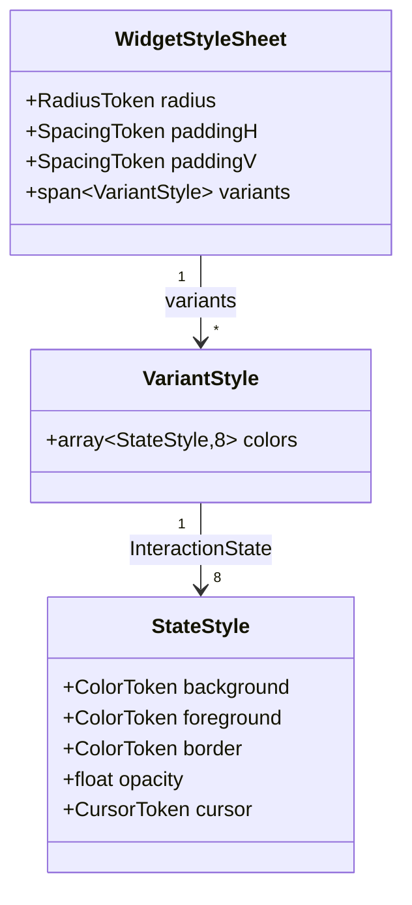

**按 Widget 统计的变体数量**：

| 变体数 | Widget |
|:--------:|---------|
| 1 | LineEdit, SpinBox, ComboBox, Slider, Label, ScrollArea, Panel, Dialog, Menu, Tooltip, StatusBar, Splitter |
| 2 | Toggle(Off/On), CheckBox(Unchecked/Checked), RadioButton, GroupBox, CollapsibleSection, TabWidget, DocumentBar, ProgressBar |
| 3 | CheckBox(+Indeterminate), DataTable(Default/Striped/Selected) |
| 4 | PushButton(Primary/Secondary/Ghost/Danger), Notification(Info/Success/Warning/Error) |
| 5 | Tag(Default/Primary/Success/Warning/Error) |

### 11.4 ComponentOverride 机制

Widget 作者或插件可以注册每个 Widget 类的Token偏差：

```cpp
ComponentOverride overrides[] = {
    { WidgetKind::PushButton, RadiusToken::Large,
      SpacingToken::Px12, SpacingToken::Px8,
      FontRole::BodyBold, ElevationToken::Low },
};
theme.RegisterComponentOverrides(overrides);
```

### 11.5 ComponentOverride 结构体

```cpp
struct ComponentOverride {
    WidgetKind     kind;
    std::optional<RadiusToken>    radius;
    std::optional<SpacingToken>   paddingH;
    std::optional<SpacingToken>   paddingV;
    std::optional<SpacingToken>   gap;
    std::optional<SizeToken>      minHeight;
    std::optional<FontRole>       font;
    std::optional<ElevationToken> elevation;
    std::optional<TransitionDef>  transition;
};
```

只有非 nullopt 的字段会覆盖默认值。这允许选择性覆盖
而无需指定每个字段。

### 11.6 覆盖优先级规则

```
ComponentOverride > BuildDefaultVariants() > WidgetStyleSheet defaults
```

覆盖在 `SetTheme()` / 主题更改期间应用。它们在主题切换之间持久存在
（注册一次，应用于每个主题）。

### 11.7 覆盖生命周期

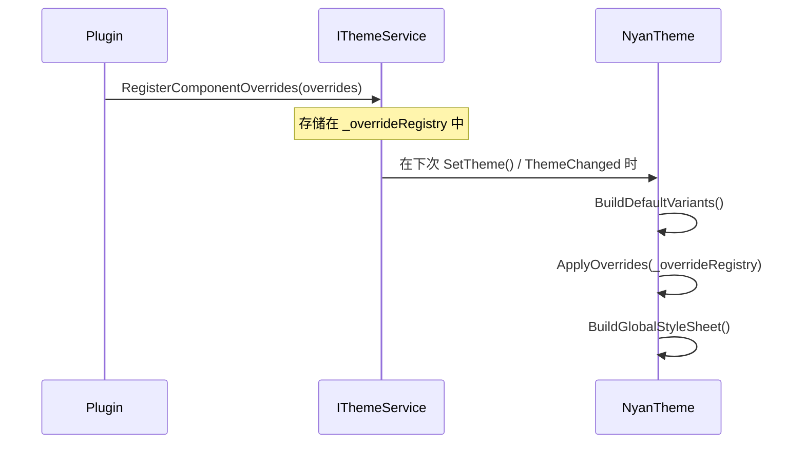

### 11.8 变体颜色覆盖（高级）

用于覆盖特定的变体 x 状态颜色映射：

```cpp
struct VariantColorOverride {
    WidgetKind     kind;
    int            variantIndex;
    InteractionState state;
    std::optional<ColorToken> background;
    std::optional<ColorToken> foreground;
    std::optional<ColorToken> border;
    std::optional<float>      opacity;
};
```

**用例**：需要 PushButton(Primary) 使用 `Success` 色相
而不是 `Primary` 色相的插件。

```cpp
VariantColorOverride override = {
    .kind = WidgetKind::PushButton,
    .variantIndex = 0,  // Primary
    .state = InteractionState::Normal,
    .background = ColorToken::Success,
    .foreground = ColorToken::OnAccent,
    .border = ColorToken::Success,
};
theme.RegisterVariantColorOverride(override);
```

---
---

# 第 IV 部分 -- 动画引擎

> 第 12-15 章。集中式、由Token驱动的动画架构。

## 第 12 章. 动画架构

### 12.1 设计原则

| 原则 | 描述 |
|-----------|-------------|
| **什么/怎么做/何时/谁分离** | Widget 说明要动画化什么（PropertyId，from，to）。服务决定怎么做（持续时间，从 WidgetStyleSheet 获取的缓动）。框架决定何时（状态更改触发器）。测试工具控制谁（覆盖以跳转）。 |
| **无 Qt 的公共 API** | `IAnimationService` 使用 `AnimationPropertyId`、`AnimatableValue`、`TransitionHandle` —— 公共接口中没有 `QPropertyAnimation`、`QVariant`、`QByteArray`。 |
| **状态空间轨迹** | 动画是状态空间中的轨迹：`x(t): [0, T] -> ValueSpace`。弹簧动力学：ODE 解。缓动：参数曲线。 |

> **无 Qt 的公共动画 API** -- `IAnimationService` 使用 `AnimatableValue`、`AnimationPropertyId`、`TransitionHandle`，公共接口中不包含 Qt 类型。支持未来后端替换并简化 C ABI 包装。`AnimatableValue` 和 `QVariant`/`QPropertyAnimation` 之间的内部转换层。

### 12.2 IAnimationService 接口

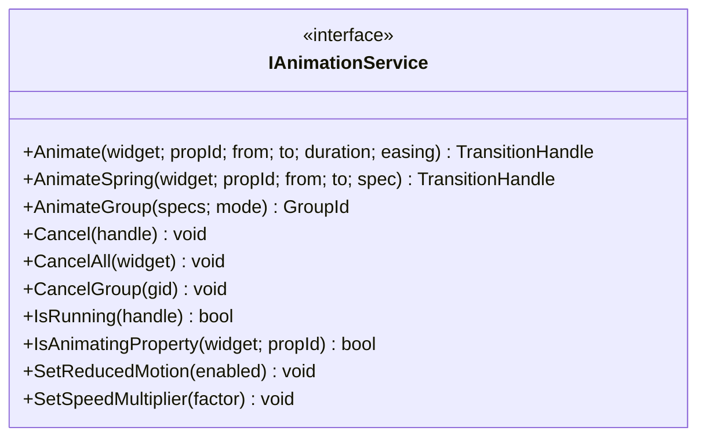

| 方法 | 输入 | 输出 | 描述 |
|--------|-------|--------|-------------|
| `Animate` | `WidgetNode*, AnimationPropertyId, AnimatableValue from, AnimatableValue to, AnimationToken, EasingToken` | `TransitionHandle` | 启动缓动动画。如果相同的 `(target, property)` 已在动画化，则从当前插值值自动重新定向。 |
| `AnimateSpring` | `WidgetNode*, AnimationPropertyId, AnimatableValue from, AnimatableValue to, SpringSpec` | `TransitionHandle` | 启动弹簧动画。与 `Animate` 具有相同的重新定向行为。 |
| `AnimateGroup` | `span<GroupAnimationSpec>, GroupMode` | `GroupId` | 并行或顺序组。每个子动画单独注册以实现中断隔离。 |
| `Cancel` | `TransitionHandle` | `void` | 取消运行中的动画。分派 `AnimationCancelled`。 |
| `CancelAll` | `WidgetNode*` | `void` | 取消 widget 的所有动画（独立 + 组成员）。 |
| `CancelGroup` | `GroupId` | `void` | 取消整个组以及所有成员转换。为每个成员分派 `AnimationCancelled`。 |
| `IsRunning` | `TransitionHandle` | `bool` | 检查动画是否处于活动状态 |
| `IsAnimatingProperty` | `WidgetNode*, AnimationPropertyId` | `bool` | 检查属性是否正在动画化（独立或组成员） |
| `SetReducedMotion` | `bool` | `void` | 启用/禁用减弱动作 |
| `SetSpeedMultiplier` | `float` | `void` | 全局速度因子 |

### 12.3 AnimationPropertyId 枚举

| 属性 | 描述 | 值类型 |
|----------|-------------|-----------|
| `Opacity` | Widget 不透明度 (0.0-1.0) | Double |
| `BackgroundColor` | 背景填充颜色 | Rgba |
| `ForegroundColor` | 文本/图标颜色 | Rgba |
| `BorderColor` | 边框描边颜色 | Rgba |
| `Position` | Widget 位置 | Point2D |
| `SlideOffset` | 用于滑动动画的平移偏移量 | Double |
| `MaximumHeight` | QWidget::maximumHeight 用于展开/折叠 | Int |
| `MinimumHeight` | QWidget::minimumHeight | Int |
| `ArrowRotation` | V 形箭头旋转角度（度） | Double |
| `Scale` | 变换缩放因子 | Double |
| `BorderWidth` | 边框描边宽度 | Int |
| `ContentHeight` | 内容区域高度（展开/折叠） | Int |
| `ScrollOffset` | 滚动位置 | Double |
| `UserDefined` | 插件定义范围的开始（1000+） | 任意 |

### 12.4 AnimatableValue 标签联合

```cpp
struct AnimatableValue {
    enum class Tag : uint8_t { Double, Int, Rgba, Point2D };
    Tag tag;
    union {
        double  d;
        int     i;
        uint32_t rgba;    // 打包的 ARGB
        struct { int x; int y; } pt;
    };

    static AnimatableValue FromDouble(double v);
    static AnimatableValue FromInt(int v);
    static AnimatableValue FromRgba(uint8_t r, uint8_t g, uint8_t b, uint8_t a);
    static AnimatableValue FromPoint(int x, int y);
};
```

无 Qt。内部 `AnimationService` 转换为 `QVariant` 以用于 `QPropertyAnimation`。

### 12.5 TransitionHandle

```cpp
struct TransitionHandle {
    uint64_t id = 0;
    explicit operator bool() const { return id != 0; }
};
```

用于取消和状态查询的不透明句柄。零 = 无效/无动画。

### 12.6 GroupMode 和 GroupId

| 模式 | 描述 |
|------|-------------|
| `Parallel` | 组中的所有动画同时开始（`QParallelAnimationGroup`） |
| `Sequential` | 每个动画在前一个完成后开始（`QSequentialAnimationGroup`） |

`GroupId` 是由 `AnimateGroup()` 返回的不透明 `enum class : uint64_t`。由 `CancelGroup()` 使用以取消整个组。

### 12.7 中断重新定向

当对已具有运行中动画的 `(target, property)` 对调用 `Animate()` 或 `AnimateSpring()` 时：

1.  通过 `QVariantAnimation::currentValue()` 捕获运行中动画的 **当前插值值**
2.  停止运行中动画并分派 `AnimationCancelled` 通知
3.  新动画从 **捕获的值** 开始（而不是调用者提供的 `from`）

这在快速状态更改期间提供平滑的视觉连续性（例如，鼠标悬停闪烁，转换期间的按钮按下/释放）。

```
时间 -->   |----旧动画 (bg: gray->blue)----X
                                             |
                                             +----新动画 (bg: current->red)---->
                                             ^
                                             在约 60% 插值处捕获
```

**不变量**：如果在 `(target, property)` 上未找到现有动画，则按原样使用调用者提供的 `from`。

### 12.8 组动画架构

组动画提供多 Widget 协调转换。关键设计：

**子动画注册**：每个 `GroupAnimationSpec` 生成一个单独的 `TransitionEntry`，注册在活动动画映射中，并带有自己的 `TransitionHandle`。该条目携带一个 `owningGroup` 字段，将其链接回 `GroupId`。

**中断隔离**：因为组子动画是单独注册的，所以在相同 `(target, property)` 上调用新的 `Animate()` 将正确地仅中断该子动画，而其他组成员继续。`CancelAll(widget)` 也能正确找到并取消该 Widget 的组成员。

**生命周期管理**：

| 场景 | Qt 对象生命周期 | `_active` 条目 |
|----------|-------------------|-----------------|
| 独立动画完成 | 由 `OnFinished` 执行 `deleteLater()` | 擦除，分派 `AnimationCompleted` |
| 组成员单独完成 | 组拥有 Qt 对象 | 从 `_active` 中擦除，分派 `AnimationCompleted` |
| 整个组完成 | 由 `OnGroupFinished` 执行组 `deleteLater()` | 所有剩余成员被擦除，为每个成员分派 `AnimationCompleted` |
| 调用 `CancelGroup(gid)` | 组 `stop()` + `deleteLater()` | 所有成员被擦除，为每个成员分派 `AnimationCancelled` |
| 外部 `Animate()` 中断组成员 | 仅从 `_active` 中移除该子条目 | 分派 `AnimationCancelled`；组继续运行剩余成员 |

**通知生命周期**（组内的每个子动画）：

```
调用 AnimateGroup()
  --> AnimationStarted(propId, subHandle)   [每个规范]
  ...
  --> AnimationCompleted(propId, subHandle)  [自然完成时]
  或
  --> AnimationCancelled(propId, subHandle)  [取消/CancelAll/CancelGroup/重新定向时]
```

---

## 第 13 章. 弹簧动画物理

### 13.1 阻尼谐振子模型

弹簧动画求解二阶 ODE：

$$m \, x''(t) + c \, x'(t) + k \bigl(x(t) - x_{\text{target}}\bigr) = 0$$

其中：
- $m$ = 质量（默认 1.0，无量纲）
- $c$ = 阻尼系数（默认 20.0）
- $k$ = 刚度（默认 200.0）
- $x_{\text{target}}$ = 目标值

**阻尼比**：

$$\zeta = \frac{c}{2\sqrt{m \, k}}$$

| 制度 | 条件 | 行为 |
|--------|-----------|----------|
| 欠阻尼 | $\zeta < 1$ | 围绕目标振荡并衰减 |
| 临界阻尼 | $\zeta = 1$ | 无过冲的最快接近 |
| 过阻尼 | $\zeta > 1$ | 缓慢的指数接近 |

默认 `SpringSpec{1.0, 200.0, 20.0}` 产生 $\zeta \approx 0.707$（欠阻尼，轻微过冲）。

### 13.2 半隐式欧拉积分

$$v(t + \Delta t) = v(t) + \Delta t \left( -\frac{k}{m}\bigl(x(t) - x_{\text{target}}\bigr) - \frac{c}{m}\,v(t) \right)$$

$$x(t + \Delta t) = x(t) + \Delta t \cdot v(t + \Delta t)$$

半隐式欧拉（辛）：使用新速度更新位置。
对振荡系统具有能量守恒特性。固定时间步长：$\Delta t = 1/60$（60 FPS）。

### 13.3 收敛检测

动画在满足以下条件时终止：
- $|v(t)| < \varepsilon_v$（默认 $\varepsilon_v = 0.01$）
- $|x(t) - x_{\text{target}}| < \varepsilon_x$（默认 $\varepsilon_x = 0.1$）

两个条件必须在连续 `kSettleFrames` 帧（默认 3 帧）内同时满足。

### 13.4 CFL 稳定性条件

对于显式欧拉类积分器，CFL 稳定性限制为：

$$\Delta t < 2\sqrt{\frac{m}{k}}$$

当 $m=1, k=200$ 时：$\Delta t_{\max} = 0.141\text{s}$。在 60 FPS 下，$\Delta t = 0.0167\text{s}$ —— 安全地在限制范围内。

如果自定义 `SpringSpec` 违反 CFL（$\Delta t > 2\sqrt{m/k}$），引擎将：
1. 记录警告
2. 回退到 `OutCubic` 缓动，持续时间为 `AnimationToken::Normal`

### 13.5 多类型弹簧插值

| 类型 | 插值策略 |
|------|----------------------|
| `Double` | 直接标量弹簧 |
| `Int` | 标量弹簧，在输出时四舍五入为整数 |
| `Rgba` | 在 R、G、B、A 上独立进行逐分量弹簧 |
| `Point2D` | 在 x 和 y 上独立进行弹簧 |

---

## 第 14 章. Widget 动画集成

### 14.1 ThemeAware::AnimateTransition() 辅助函数

```cpp
// 从 WidgetStyleSheet::transition 自动解析持续时间/缓动
TransitionHandle AnimateTransition(AnimationPropertyId propId,
                                    AnimatableValue from,
                                    AnimatableValue to);

// 显式控制
TransitionHandle AnimateTransition(AnimationPropertyId propId,
                                    AnimatableValue from,
                                    AnimatableValue to,
                                    AnimationToken duration,
                                    EasingToken easing);
```

### 14.2 状态转换动画

当 `InteractionState` 更改时（例如，Normal -> Hovered），框架
使用 Widget 的 `TransitionDef`（通常为 200ms OutCubic）为
`BackgroundColor`、`ForegroundColor` 和 `BorderColor` 设置动画。

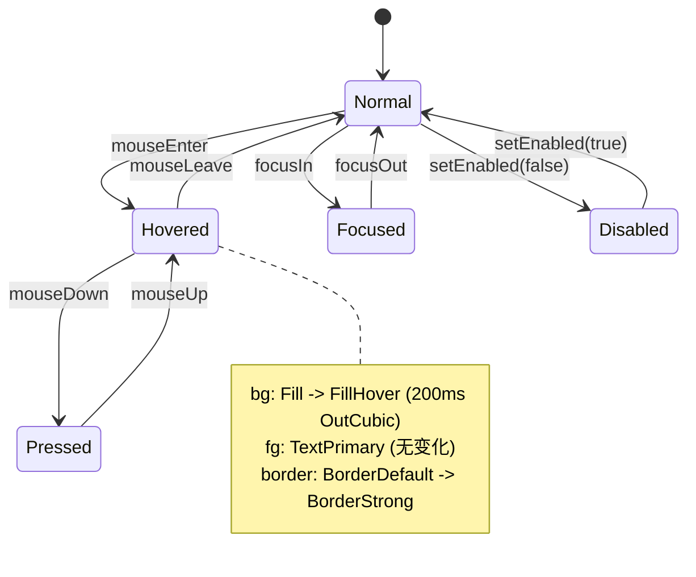

### 14.3 动画通知

通过 `WidgetNode::SendNotification()` 分派三种通知类型：

| 通知 | 载荷 | 时间 |
|-------------|---------|------|
| `AnimationStarted` | `{ propertyId, handle }` | 动画开始（或在测试模式下跳转） |
| `AnimationCompleted` | `{ propertyId, handle }` | 动画到达目标 |
| `AnimationCancelled` | `{ propertyId, handle }` | 动画被 `Cancel()` 或同一属性上的新动画取消 |

### 14.4 测试模式下的动画

当 `SetAnimationOverride(0)` 处于活动状态时：
- 所有 `Animate()` 调用立即设置目标值（无插值）
- 分派 `AnimationStarted`（触发验证测试有效）
- 在 Started 之后立即分派 `AnimationCompleted`
- 不创建 `QPropertyAnimation` 对象
- 零视觉延迟 -- 所有 Widget 测试保持确定性

### 14.5 单 Widget 动画目录（摘要索引）

> 此表为便捷索引。每个 Widget 的权威动画规范
> 在其第 10 章“动画”部分。

| Widget | 动画属性 | 持续时间 | 缓动 |
|--------|-------------------|:--------:|--------|
| PushButton | bg, fg, border 颜色 | Normal | OutCubic |
| Toggle | 轨道颜色，滑块位置 | Normal | Spring |
| GroupBox | ArrowRotation, ContentHeight | Slow | OutCubic |
| CollapsibleSection | ArrowRotation, ContentHeight | Slow | OutCubic |
| StackedWidget | Opacity（交叉淡入淡出） | Normal | OutCubic |
| Notification | SlideOffset（滑入/滑出） | Normal | OutCubic |
| ComboBox | SlideOffset（下拉） | Quick | OutCubic |
| Menu | SlideOffset（弹出） | Quick | OutCubic |

---

## 第 15 章. 无障碍：减弱动作

### 15.1 WCAG 2.1 SC 2.3.3 合规性

WCAG 成功标准 2.3.3 (AAA)：由交互触发的动作动画可以禁用。
COCAUI 提供 `SetReducedMotion(true)`，它会立即将所有动画跳转到其目标值。

### 15.2 操作系统检测

| 平台 | API | 检测 |
|----------|-----|-----------|
| Windows | `SystemParametersInfoW(SPI_GETCLIENTAREAANIMATION)` | 如果禁用动画则返回 `FALSE` |
| macOS | `NSWorkspace.accessibilityDisplayShouldReduceMotion` | 如果启用减弱动作则返回 `YES` |
| Linux/GNOME | `org.gnome.desktop.interface.enable-animations` | GSettings 布尔值 |

`Application::Initialize()` 在启动时查询操作系统首选项并相应地调用
`AnimationService::SetReducedMotion()`。

### 15.3 行为契约

当减弱动作处于活动状态时：
- `Animate()` 跳转到目标（0ms 持续时间）
- `AnimateSpring()` 跳转到目标
- `AnimateGroup()` 跳转所有成员
- 状态转换颜色跳转（无插值）
- 仍然分派 `AnimationStarted` / `AnimationCompleted`
- 滚动动画跳转（无平滑滚动）
- 页面转换交叉淡入淡出跳转（即时切换）

---
---

# 第 V 部分 -- 图标与光标

> 第 16-17 章。

## 第 16 章. 图标系统

> 图标识别、设计语言、URI 层次结构、颜色继承、解析管道和插件可扩展性的完整参考。

### 16.1 设计理念

CAD/CAE 桌面应用程序的图标系统面临着与 Web 图标库根本不同的约束：

| 约束 | Web (Material/Lucide) | 桌面 CAD (COCAUI) | 设计后果 |
|------------|----------------------|----------------------|-------------------|
| **图标数量** | 1,000-5,000 通用 | 300-800 特定领域 + 通用 | 需要开放注册表，而非封闭枚举 |
| **可扩展性** | npm 包更新 | 运行时插件 DLL | 基于 URI，而非基于序数 |
| **着色** | CSS `color` 属性 | 主题感知，多 Token | 加载时替换 SVG `fill`/`stroke` |
| **尺寸范围** | 16-48px，离散 | 12-32px，5 个离散尺寸 | 每个尺寸都对齐像素网格 |
| **语义密度** | 低（通用操作） | 高（网格操作 vs 零件操作 vs 草图操作） | 需要分层分类 |
| **DPI 感知** | CSS 处理缩放 | Qt devicePixelRatio | 整数像素尺寸，无小数 |

**核心设计决策**：用开放的基于 URI 的 `IconId` 系统替换封闭的 `IconToken` 枚举。
这以运行时可扩展性换取编译时的详尽性 —— 当插件数量不受限且图标词汇表特定于领域时，这是正确的权衡。

> **基于 URI 的图标系统** -- 用开放的 `asset://` URI 字符串替换封闭的 `IconToken` 枚举。插件需要注册特定于领域的图标。图标查找使用字符串哈希映射而不是数组索引；运行时成本略有增加，但通过缓存可忽略不计。

### 16.2 URI 层次结构设计

#### 16.2.1 URI 方案

所有图标标识符都遵循 `asset://` URI 方案：

```
asset://<authority>/<category>/<name>
```

| 组件 | 描述 | 示例 |
|-----------|-------------|---------|
| **方案** | 始终为 `asset://` | 固定协议标识符 |
| **授权** | 图标集所有者（供应商/插件命名空间） | `COCAUI`、`fea-plugin`、`cfd-viz` |
| **类别** | 授权内的功能分组 | `icons`、`cursors`、`logos` |
| **名称** | 叶标识符（无扩展名） | `save`、`undo`、`mesh-boolean` |

**设计理由**：三层层次结构（授权/类别/名称）反映了插件生态系统的组织结构：
1.  **授权** 防止独立插件之间的命名空间冲突
2.  **类别** 分离图标类型（UI 图标 vs 领域字形 vs 徽标）
3.  **名称** 识别其类别中的特定字形

#### 16.2.2 内置 URI 前缀

```cpp
constexpr std::string_view kCOCAUIIconPrefix = "asset://COCAUI/icons/";
```

所有框架提供的图标都位于此前缀下。`fw::icons::`
命名空间提供编译时常量：

```cpp
namespace fw::icons {
    inline constexpr std::string_view Save       = "asset://COCAUI/icons/save";
    inline constexpr std::string_view Undo       = "asset://COCAUI/icons/undo";
    inline constexpr std::string_view Redo       = "asset://COCAUI/icons/redo";
    inline constexpr std::string_view Close      = "asset://COCAUI/icons/close";
    inline constexpr std::string_view ChevronR   = "asset://COCAUI/icons/chevron-right";
    // ~50 总计
}
```

**为什么使用 `constexpr string_view` 而不是 `constexpr char[]`**：`string_view` 提供
`.size()`、比较运算符和哈希支持，而无需堆分配。
字符串数据驻留在 `.rodata` 中。在调用点，`fw::icons::Save` 是
零成本的 —— 无分配、无复制，只是一个指针+长度对。

#### 16.2.3 插件 URI 约定

插件注册自己的授权：

```cpp
// FEA 插件注册其图标目录
theme.RegisterIconDirectory("asset://fea-plugin/icons/",
                            pluginPath + "/icons");

// 在插件代码中使用
button.SetIcon("asset://fea-plugin/icons/stress-field");
```

**冲突防止规则**：每个插件必须使用唯一的授权字符串。
约定是 `<plugin-id>/icons/`，其中 `plugin-id` 匹配
`IExpansionPlugin::Id()`。

#### 16.2.4 URI 解析顺序

当调用 `ResolveIcon(iconId, size, color)` 时：

1.  在 `_iconRegistry`（哈希映射：`string -> filesystem path`）中查找 `iconId`
2.  如果找到：从路径加载 SVG，着色，在 `size` px 处光栅化
3.  如果未找到：返回空 `QIcon`（调用者应优雅处理）

无回退链。无通配符匹配。这是有意为之——在插件繁重的环境中，模糊的解析会产生调试噩梦。

### 16.3 图标设计语言

#### 16.3.1 网格规范

所有 COCAUI 图标都在 **方形像素网格**上设计，具有一致的
视觉大小规则：

| 属性 | 值 | 理由 |
|----------|-------|-----------|
| **画布** | N x N px（其中 N = 目标 SizeToken） | 与渲染大小 1:1 映射 |
| **安全区域** | 每条边向内 2px | 防止小尺寸下的视觉裁剪 |
| **描边粗细** | 1.5px (Sm/Md)，2.0px (Lg/Xl) | 在各尺寸间保持可读性 |
| **圆角半径** | 1px（内部形状） | 与 RadiusToken::Small 一致 |
| **视觉对齐** | 在安全区域内居中 | 三角形形状向右偏移 0.5-1px 以实现视觉居中 |

```
+------------------+     N = 16px 示例
|  2px padding     |
|  +------------+  |
|  |            |  |     12 x 12 px 安全区域
|  |   glyph   |  |     1.5px 描边粗细
|  |            |  |
|  +------------+  |
|                  |
+------------------+
```

**为什么固定描边粗细，而不是按比例？** 在 12-32px 尺寸下，按比例
描边粗细（例如，画布的 10%）会产生 1.2px-3.2px 的描边，
这会在非 Retina 显示屏上产生亚像素渲染伪影。1.5px 的固定粗细
在 1x DPR 下能干净地对齐到像素网格。

#### 16.3.2 样式原则

| 原则 | 描述 | 反例 |
|-----------|-------------|----------------|
| **轮廓线，非填充** | 默认样式使用描边轮廓，而非实心填充 | 避免密集工具栏中的视觉沉重感 |
| **几何，非有机** | 形状源自圆形、矩形、45 度对角线 | 有机曲线在工程 UI 中显得格格不入 |
| **最小细节** | 每个图标以最少的笔画传达一个概念 | 无装饰元素，无投影 |
| **中性权重** | 整个图标集中的视觉权重平衡 | 没有图标应该比同尺寸的其他图标更“跳脱” |
| **一致的隐喻** | 相同的现实世界概念 = 相同的视觉处理 | 箭头始终表示导航，铅笔始终表示编辑 |

**设计思路**：选择轮廓几何样式是因为：
1.  **着色**：轮廓线图标比填充图标更能响应单色着色
2.  **密度**：工程工具栏包含 20-40 个图标；轮廓样式减少了视觉噪点
3.  **无障碍**：在所有尺寸下，描边与背景之间具有高对比度
4.  **可扩展性**：几何图元在 5 个尺寸档位上能干净地缩放

#### 16.3.3 特定尺寸优化

图标不是简单地从单个主图缩放。每个 SizeToken 都有针对该像素网格优化的自己的 SVG：

| SizeToken | 像素 | 用例 | 优化 |
|----------|:------:|----------|-------------|
| `Xs` (12) | 12x12 | 内联指示器、树展开/折叠 | 简化至最多 2-3 笔 |
| `Sm` (16) | 16x16 | 菜单项、小按钮、状态栏 | 标准细节级别 |
| `Md` (20) | 20x20 | 工具栏按钮（默认） | 完整细节级别 |
| `Lg` (24) | 24x24 | 大型工具栏、卡片标题 | 可能包含附加细节 |
| `Xl` (32) | 32x32 | 功能图标、空状态 | 最大细节，可选填充 |

**回退规则**：如果特定尺寸变体不可用，解析管道将选择最近的较大尺寸并缩小（绝不放大）。
缩小保留细节；放大会产生模糊。

### 16.4 图标分类法

#### 16.4.1 七个功能类别

图标按其 **语义功能** 组织，而非按视觉外观：

| 类别 | URI 段 | 数量 | 描述 |
|----------|-------------|:-----:|-------------|
| **File** | `file-*` | ~8 | 文档生命周期：new、open、save、save-as、close、import、export、print |
| **Edit** | `edit-*` | ~8 | 修改操作：undo、redo、cut、copy、paste、delete、select-all、find |
| **View** | `view-*` | ~6 | 显示控制：zoom-in、zoom-out、fit-all、grid-toggle、wireframe、shaded |
| **Navigation** | `nav-*` 或方向 | ~8 | 空间移动：arrow-*、chevron-*、expand、collapse、home、back |
| **Action** | (特定领域) | ~10 | 通用操作：add、remove、refresh、settings、filter、sort、pin、lock |
| **Status** | `status-*` | ~5 | 状态指示器：check、warning、error、info、loading |
| **UI Chrome** | `ui-*` | ~5 | 框架 Chrome：close、minimize、maximize、restore、menu |

#### 16.4.2 特定领域类别（插件注册）

| 领域 | 授权 | 典型图标 | 数量 |
|--------|-----------|--------------|:-----:|
| **Part Design** | `part-design` | extrude、revolve、fillet、chamfer、pocket、pad、mirror、pattern | ~70 |
| **Mesh Operations** | `mesh-ops` | boolean-union、boolean-subtract、boolean-intersect、refine、decimate | ~55 |
| **Sketch** | `sketch` | line、arc、circle、rectangle、spline、dimension、constraint | ~40 |
| **View Control** | `view-ctrl` | orbit、pan、zoom-window、section-plane、explode | ~50 |
| **FEA** | `fea-plugin` | stress-field、displacement、mesh-quality、boundary-condition | ~30 |
| **CFD** | `cfd-viz` | velocity-field、pressure-contour、streamline、particle-trace | ~20 |

**总图标资产**：~830（详细美术资产清单见第 8.13 节）。

#### 16.4.3 命名约定

每个类别内的图标名称遵循一致的模式：

```
<verb>-<object>[-<modifier>]
```

| 模式 | 示例 | 描述 |
|---------|---------|-------------|
| `<verb>` | `save`、`undo`、`close` | 单操作图标 |
| `<verb>-<object>` | `zoom-in`、`fit-all`、`select-face` | 对目标执行的操作 |
| `<object>-<modifier>` | `arrow-right`、`chevron-down` | 参数化变体 |
| `<state>` | `check`、`warning`、`error` | 状态指示器 |

**禁止的模式**：
- 名称中无尺寸后缀（尺寸是查询参数，而非身份）
- 无颜色后缀（颜色由主题上下文决定）
- 无文件扩展名（`.svg` 是实现细节）

### 16.5 颜色继承模型

#### 16.5.1 单Token着色

默认着色模型：每个图标从其 Widget 上下文继承 **单一前景颜色**。
此颜色统一应用于 SVG 中的所有 `stroke` 和 `fill` 属性。

```
Icon Color = f(widget context)

其中：
  - Button 图标     -> ResolvedStyle.fg（来自变体 x 状态）
  - Menu item 图标  -> ColorToken::colorText（正常）/ TextDisabled（禁用）
  - Status 图标     -> 语义颜色（Success/Warning/Error/Info 色相步骤 6）
  - Tree node 图标  -> ColorToken::colorTextSecondary
```

**为什么是单Token，而不是多Token？** 多色图标（例如，带有黄色主体 + 蓝色标签的文件夹）会产生三个问题：
1.  **主题脆弱性**：每种颜色必须映射到一个Token；N 种颜色 = N 个绑定
2.  **对比度不可预测**：颜色组合在某些主题中可能无法通过 WCAG
3.  **认知开销**：彩色图标会与语义颜色信号（错误红、成功绿）竞争

对于需要多色的极少数情况（例如，应用程序徽标），请使用预渲染的 PNG 资产，而不是着色的 SVG。

#### 16.5.2 着色算法

```
对于每个 SVG 元素：
  1. 如果元素具有 `fill` 属性且 `fill != "none"`：
     用 tintColor 替换 fill 值
  2. 如果元素具有 `stroke` 属性且 `stroke != "none"`：
     用 tintColor 替换 stroke 值
  3. 如果元素具有 `opacity` 属性：保持原样
  4. 如果元素具有 class="preserve-color"：跳过着色
```

`preserve-color` CSS 类是针对必须保留其原始颜色的图标的逃生口（罕见；仅用于关于对话框中的品牌徽标）。

#### 16.5.3 依赖状态的颜色映射

图标颜色通过解析样式跟踪 Widget 的 `InteractionState`：

| Widget 状态 | 图标颜色来源 | 典型结果（浅色） | 典型结果（深色） |
|-------------|-------------------|----------------------|---------------------|
| Normal | `ResolvedStyle.fg` | `TextPrimary` (~#1C1C1E) | `TextPrimary` (~#E5E5E7) |
| Hovered | `ResolvedStyle.fg` | 相同（悬停更改 bg，而非 fg） | 相同 |
| Pressed | `ResolvedStyle.fg` | 略微调整 | 略微调整 |
| Disabled | `ResolvedStyle.fg` | `TextDisabled` (~#A0A0A8) | `TextDisabled` (~#5C5C64) |
| Focused | `ResolvedStyle.fg` | 与 Normal 相同 | 与 Normal 相同 |
| Selected | `ResolvedStyle.fg` | `OnAccent`（白色）在强调 bg 上 | `OnAccent` 在强调 bg 上 |

**关键原则**：图标从不独立决定其颜色。它始终继承自封闭 Widget 的解析样式。这确保了同一 Widget 内图标和标签文本之间的视觉一致性。

#### 16.5.4 语义状态图标

单Token模型的例外：状态指示器图标（check、warning、error、info）使用其 **语义色相颜色**，而不是 Widget 前景色：

| 状态图标 | 颜色Token | 理由 |
|------------|-------------|-----------|
| `check` / `success` | `Success6` | 绿色传达积极状态 |
| `warning` | `Warning6` | 琥珀色传达警告 |
| `error` | `Error6` | 红色传达失败 |
| `info` | `Info6` | 蓝色传达信息 |

这些图标使用相应语义调色板的色相步骤 6（中间色调）进行着色，确保在所有主题中与 Surface 和 SurfaceContainer 背景的对比度均符合 WCAG AA 标准。

### 16.6 SVG 格式要求

#### 16.6.1 创作规则

| 规则 | 细节 | 理由 |
|------|--------|-----------|
| **根 `viewBox`** | 必须是 `"0 0 N N"`，其中 N = 目标尺寸 | 启用正确的缩放 |
| **无嵌入样式** | 无 `<style>` 块；使用内联属性 | 着色替换内联属性 |
| **无 `<text>` 元素** | 文本必须转换为路径 | 目标系统上字体不可用 |
| **无 `<image>` 引用** | 无嵌入光栅图像 | 违背着色目的 |
| **无渐变** | 仅纯色填充/描边 | 渐变破坏单Token着色 |
| **坐标对齐** | 所有坐标在 0.5px 网格上 | 防止 1x DPR 下的亚像素模糊 |
| **最小化 DOM** | 展平组，移除 Illustrator 元数据 | 减少解析时间 |
| **`fill="currentColor"`** | 源 SVG 中的默认 fill 值 | 表示着色意图 |

#### 16.6.2 文件组织

```
Resources/Icons/
  16/                     <- Sm 尺寸变体
    save.svg
    undo.svg
    ...
  20/                     <- Md 尺寸变体（默认）
    save.svg
    undo.svg
    ...
  24/                     <- Lg 尺寸变体
    save.svg
    ...
  32/                     <- Xl 尺寸变体
    save.svg
    ...
```

`RegisterIconDirectory()` 扫描目录，将每个 `.svg` 文件注册为 URI。
尺寸选择在 `ResolveIcon()` 时根据请求的 `SizeToken` 进行。

### 16.7 解析管道

#### 16.7.1 API

```cpp
auto IThemeService::ResolveIcon(const IconId& iconId,
                                 SizeToken size,
                                 QColor tintColor) -> QIcon;
```

#### 16.7.2 管道阶段

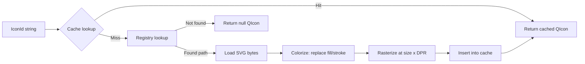

#### 16.7.3 缓存架构

| 属性 | 值 |
|----------|-------|
| **Key** | `(uri_string, size_px, rgba_u32)` 三元组 |
| **Value** | `QIcon`（包含目标 DPR 的 `QPixmap`） |
| **Structure** | 带有自定义哈希的 `std::unordered_map<CacheKey, QIcon>` |
| **Invalidation** | 在 `ThemeChanged` 信号上完全清除缓存 |
| **Capacity** | 无限制（典型工作集：~200-400 条目） |
| **Thread safety** | 仅主线程（与所有 UI 操作相同） |

**为什么主题更改时完全失效？** 因为着色颜色在主题更改时会改变（深色 ↔ 浅色）。部分失效需要跟踪哪些图标使用哪些颜色Token——鉴于主题切换后重建 400 个图标的缓存耗时 < 50ms，这种复杂性是不合理的。

### 16.8 RTL 图标翻转

#### 16.8.1 可翻转与不可翻转

并非所有图标都应在 RTL 布局中镜像。只有 **方向性** 图标才会被翻转：

| 可翻转（在 RTL 中镜像） | 不可翻转（在 RTL 中相同） |
|--------------------------|---------------------------|
| `chevron-right`, `chevron-left` | `check`, `close`, `warning` |
| `arrow-right`, `arrow-left` | `zoom-in`, `zoom-out` |
| `undo`, `redo` | `settings`, `filter` |
| `indent`, `outdent` | `save`, `delete` |
| `nav-back`, `nav-forward` | 对称图标（plus, minus） |

#### 16.8.2 可翻转性确定

```cpp
auto IsRtlFlippable(std::string_view iconId) -> bool;
```

该函数根据已知可翻转图标名称的内置集合进行检查。
插件图标默认为不可翻转。插件可以通过调用注册 API 来注册可翻转图标。

**设计理由**：选择性加入（opt-in）的可翻转列表比选择性退出（opt-out）更安全。
错误翻转的领域图标（例如，网格操作字形）比未翻转的方向箭头更令人困惑。

#### 16.8.3 翻转实现

RTL 翻转在光栅化时应用（着色之后）：

```cpp
if (textDirection == TextDirection::RTL && IsRtlFlippable(iconId)) {
    QImage img = pixmap.toImage().mirrored(true, false);  // 水平翻转
    pixmap = QPixmap::fromImage(img);
}
```

### 16.9 插件图标注册

#### 16.9.1 注册 API

```cpp
auto IThemeService::RegisterIconDirectory(
    std::string_view uriPrefix,
    QString dirPath) -> int;
```

**参数**：
- `uriPrefix`：要注册的 URI 前缀（例如，`"asset://fea-plugin/icons/"`）
- `dirPath`：包含 `.svg` 文件的文件系统目录

**返回**：注册的图标数量，或负错误代码。

**行为**：扫描 `dirPath` 中的 `*.svg` 文件。对于每个文件 `foo.svg`，
在图标注册表中注册 `"<uriPrefix>foo"` -> `"<dirPath>/foo.svg"`。

#### 16.9.2 注册生命周期

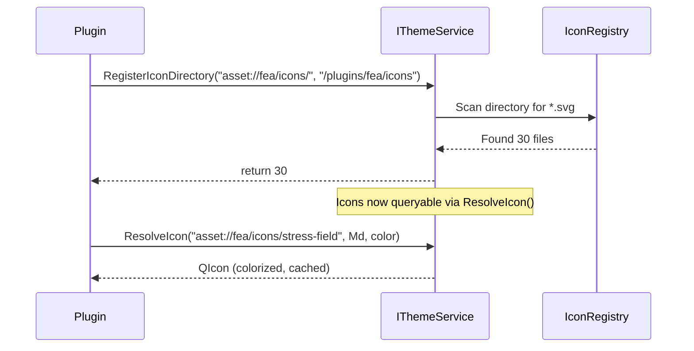

#### 16.9.3 注销

插件注册的图标在插件停止时**不会**自动移除。图标注册表在应用程序生命周期内仅支持追加。
这是有意为之：Widget 在插件关闭后仍可能持有对 `IconId` 字符串的引用，返回空图标会导致视觉伪影。

### 16.10 无障碍注意事项

| 要求 | 实现 |
|------------|----------------|
| **装饰性图标** | 文本标签旁边的图标是装饰性的；将 `QAccessible::NameChanged` 设置为仅文本 |
| **独立图标** | 仅图标的按钮必须在 WidgetNode 上调用 `SetAccessibleName()` |
| **高对比度** | 图标通过来自高对比度主题Token的着色自动适应 |
| **减弱动作** | 不适用（图标是静态的） |
| **最小触摸目标** | 图标按钮必须满足 32x32px 的最小触摸目标，无论图标大小如何 |

---

## 第 17 章. 光标系统

### 17.1 CursorToken 枚举

| Token | Qt 映射 | 描述 |
|-------|-----------|-------------|
| `Default` | `Qt::ArrowCursor` | 标准指针 |
| `Pointer` | `Qt::PointingHandCursor` | 可点击元素 |
| `Text` | `Qt::IBeamCursor` | 文本输入 |
| `Wait` | `Qt::WaitCursor` | 忙碌/加载 |
| `Crosshair` | `Qt::CrossCursor` | 精确选择 |
| `Move` | `Qt::SizeAllCursor` | 可拖动元素 |
| `SplitH` | `Qt::SplitHCursor` | 水平分割器 |
| `SplitV` | `Qt::SplitVCursor` | 垂直分割器 |
| `ResizeN` | `Qt::SizeVerCursor` | 向上调整大小 |
| `ResizeE` | `Qt::SizeHorCursor` | 向右调整大小 |
| `ResizeNE` | `Qt::SizeBDiagCursor` | 向东北对角线调整大小 |
| `ResizeNW` | `Qt::SizeFDiagCursor` | 向西北对角线调整大小 |
| `Forbidden` | `Qt::ForbiddenCursor` | 不允许的操作 |
| `Grab` | `Qt::OpenHandCursor` | 准备抓取 |
| `Grabbing` | `Qt::ClosedHandCursor` | 正在抓取 |

### 17.2 Widget 状态 -> 光标映射

光标在 `StateStyle::cursor` 中按状态指定：

```cpp
StateStyle normal  = { .cursor = CursorToken::Pointer };   // 可点击
StateStyle disabled = { .cursor = CursorToken::Forbidden }; // 不允许
StateStyle dragging = { .cursor = CursorToken::Grabbing };  // 正在拖动
```

当 Widget 的交互状态更改时，框架会自动应用解析后的 `StateStyle` 中的光标。

---
---

# 第 VI 部分 -- 无障碍与国际化

> 第 18-19 章。

## 第 18 章. 无障碍基础设施

### 18.1 A11yRole 枚举

UI 元素的 28 种语义角色：

| 类别 | 角色 |
|----------|-------|
| **Input** | Button, CheckBox, RadioButton, Slider, SpinBox, ComboBox, TextInput, Toggle, SearchBox |
| **Container** | Group, Panel, TabPanel, Dialog, AlertDialog, Menu, MenuBar, Toolbar, ScrollView, Table, Tree, List |
| **Display** | Label, Image, ProgressBar, Separator, Tooltip |
| **Navigation** | Link, Tab |

**映射**：每个 `A11yRole` 在 Widget 层映射到 `QAccessible::Role`。

### 18.2 WidgetNode 无障碍属性

| 方法 | 描述 |
|--------|-------------|
| `SetAccessibleName(string_view)` | 屏幕阅读器可读的标签 |
| `AccessibleName() -> string_view` | 获取当前可访问名称 |
| `SetA11yRole(A11yRole)` | 设置语义角色 |
| `GetA11yRole() -> A11yRole` | 获取语义角色 |
| `IsFocusable() -> bool` | Widget 是否可以接收键盘焦点 |
| `SetFocusable(bool)` | 设置焦点能力 |

### 18.3 焦点管理

焦点系统有三层：

| 层级 | 类 | 职责 |
|-------|-------|----------------|
| **Tab 遍历** | `FocusTabEventFilter`（`WidgetNode` 内部） | 拦截 Tab/Shift+Tab QKeyEvent，使用 `FocusChain::Collect` + `Next`/`Previous` 在封闭焦点作用域内移动焦点 |
| **焦点作用域** | `UiNode::SetFocusScope(bool)` | 标记子树边界。Tab 循环被困在作用域内。`DialogNode` 在其构造函数中自动设置此属性 |
| **焦点管理器** | `FocusManager`（全局服务） | 集中跟踪焦点节点、跨区域 F6 循环、对话框打开/关闭的保存/恢复 |

#### 18.3.1 Tab 键拦截

当在 `WidgetNode` 上调用 `SetFocusable(true)` 时，会自动在底层 QWidget 上安装 `FocusTabEventFilter`（QObject 事件过滤器）。

在 Tab/Shift+Tab 按键按下时：

1.  通过 `FindEnclosingFocusScope()` 查找封闭的焦点作用域，如果没有则遍历到树根
2.  调用 `FocusChain::Collect(scope)` 收集所有可聚焦的节点，按 `TabIndex` 排序
3.  通过 `QApplication::focusWidget()` + `WidgetNode::FromWidget()` 解析当前聚焦的 `WidgetNode`。如果 `FromWidget` 返回 nullptr（外部 QWidget 具有 Qt 焦点），则回退到过滤器的拥有者节点
4.  调用 `FocusChain::Next()` 或 `FocusChain::Previous()` 并转移焦点
5.  通知 `GetFocusManager()->NotifyFocusGained()` 以便全局跟踪器保持同步
6.  事件被消耗（Qt 原生 Tab 顺序被绕过）

#### 18.3.2 焦点作用域

`UiNode::SetFocusScope(true)` 创建一个焦点陷阱边界。`FocusChain::Collect()` 不会下降到子焦点作用域中，因此 Tab/Shift+Tab 仅在作用域子树内循环。

自动设置焦点作用域的节点：

| 节点 | 原因 |
|------|--------|
| `DialogNode` | 模态/半模态对话框必须将 Tab 困在对话框内容中 |

业务层代码可以在任何 `UiNode` 上设置焦点作用域以实现自定义陷阱（例如，浮动面板或嵌入式向导）。

#### 18.3.3 FocusManager 服务

`FocusManager` 由 `Application::Initialize()` 创建，并通过 `GetFocusManager()` 全局访问。

**焦点跟踪 API：**

| 方法 | 描述 |
|--------|-------------|
| `NotifyFocusGained(WidgetNode*)` | 更新跟踪的焦点节点 + 通过 `SendNotification` 分派 `FocusChanged(true)` 通知 |
| `NotifyFocusLost(WidgetNode*)` | 如果匹配则清除跟踪节点 + 分派 `FocusChanged(false)` 通知 |
| `FocusedNode()` | 当前聚焦的 WidgetNode（或 nullptr） |
| `PreviousFocusedNode()` | 之前聚焦的 WidgetNode |

**感知作用域的遍历 API：**

| 方法 | 描述 |
|--------|-------------|
| `FocusNext(current)` | 移动到封闭作用域内的下一个可聚焦对象 |
| `FocusPrevious(current)` | 移动到封闭作用域内的上一个可聚焦对象 |

**跨区域焦点流（F6/Shift+F6）：**

| 方法 | 描述 |
|--------|-------------|
| `RegisterRegion(FocusRegion)` | 注册一个带有排序顺序的命名区域。`FocusRegion::rootToken`（来自 `AliveToken()` 的 weak_ptr）守护生命周期 |
| `UnregisterRegion(id)` | 移除一个区域 |
| `FocusNextRegion()` | 循环到下一个区域（F6 行为） |
| `FocusPreviousRegion()` | 循环到上一个区域（Shift+F6） |
| `FocusRegionById(id)` | 跳转到特定区域 |
| `ActiveRegionId()` | 当前区域 ID |

**焦点保存/恢复堆栈（用于嵌套对话框）：**

| 方法 | 描述 |
|--------|-------------|
| `PushFocusState()` | 将当前焦点推入恢复堆栈（每次调用一级） |
| `PopFocusState()` | 弹出并恢复最近推入的焦点。如果堆栈为空则为空操作 |
| `FocusRestoreDepth()` | 恢复堆栈的当前深度 |
| `SaveFocusState()` | `PushFocusState()` 的传统别名 |
| `RestoreFocusState()` | `PopFocusState()` 的传统别名 |

嵌套对话框场景：对话框 A 打开对话框 B。每次 `PushFocusState()` 保存当前焦点。关闭 B 弹出到 A 的焦点，关闭 A 弹出到原始焦点。

**区域生命周期安全：**

`FocusRegion::rootToken` 存储来自 `EventNode::AliveToken()` 的 `weak_ptr<void>`。
在任何区域操作（`FocusRegionById`、`FocusNextRegion`、`NotifyFocusGained`）之前，
`PurgeStaleRegions()` 移除Token已过期的条目。这防止了当区域的 UiNode 子树被销毁时访问悬空的 `root` 指针。

#### 18.3.4 焦点环绘制

**焦点环绘制**：`ThemeAware::PaintFocusRing(QPainter&, QRect, int radius)`

使用 `Focus` 颜色Token，2px 边框宽度，绘制在 Widget 矩形之外。

**仅键盘焦点**：焦点环仅在通过键盘（Tab/Shift+Tab）获得焦点时可见，而不是通过鼠标点击。这遵循 `:focus-visible` CSS 伪类约定。

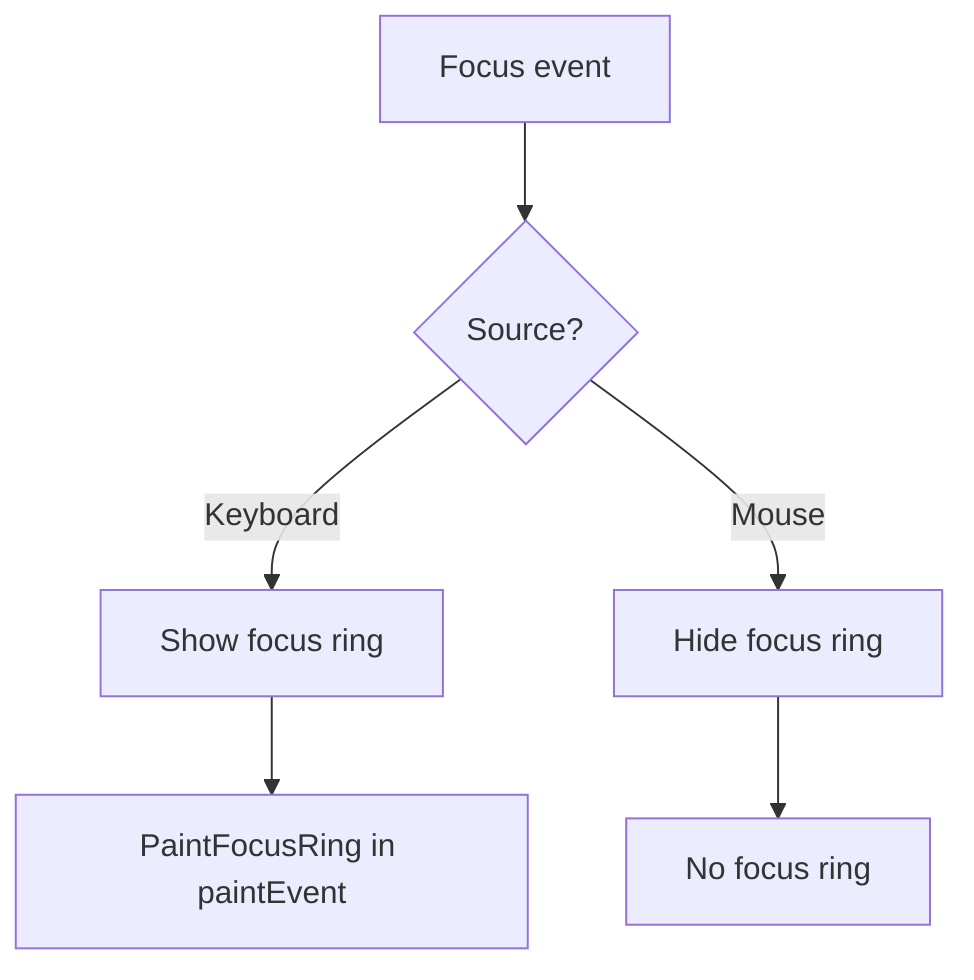

### 18.4 ContrastChecker API

完整的 API 参考请参阅第 2.8 章。

**与 A11yAudit 集成**：审计工具使用 `ContrastChecker::MeetsAA()` 来验证 Widget 树中的所有文本-背景组合。

### 18.5 A11yAudit（测试时审计器）

**类**：`A11yAudit`（静态工具，仅测试时）

| 方法 | 输入 | 输出 | 描述 |
|--------|-------|--------|-------------|
| `Audit(root)` | `WidgetNode*` | `vector<A11yViolation>` | 遍历子树，报告违规 |
| `AuditWidget(widget)` | `WidgetNode*` | `vector<A11yViolation>` | 审计单个 Widget |

**违规规则**：

| 规则 ID | 严重性 | 描述 |
|---------|----------|-------------|
| `a11y.name.missing` | Error | 交互式 Widget 没有可访问名称 |
| `a11y.role.missing` | Warning | Widget 具有默认角色（应显式设置） |
| `a11y.contrast.below-aa` | Error | 文本/背景对比度 < 4.5:1 |
| `a11y.contrast.below-aa-large` | Warning | 大文本对比度 < 3:1 |
| `a11y.focus.unreachable` | Error | 可聚焦 Widget 无法通过 Tab 到达 |

**A11yViolation 结构体**：

```cpp
struct A11yViolation {
    std::string ruleId;
    std::string widgetPath;    // UiNode 树中的节点路径
    std::string message;       // 人类可读的描述
    Severity    severity;      // Error, Warning, Info
};
```

### 18.6 高对比度主题

`kThemeHighContrast` 是一个注册的内置主题，具有：
- 所有文本Token处于最大对比度（白底黑字 / 黑底白字）
- 焦点环：3px 实线（而不是 2px）
- 边框Token完全不透明（无微妙/柔和变体）
- 所有色相步骤处于最大饱和度

**高对比度Token覆盖**（相对于浅色主题）：

| Token | 浅色 | HighContrast | 更改 |
|-------|-------|-------------|------|
| `TextPrimary` | `#E01F1F20` (88% opacity) | `#FF000000` (100% 黑色) | 完全不透明 |
| `TextSecondary` | `#C03C3C3E` (75%) | `#FF000000` (100%) | 提升为主色 |
| `TextDisabled` | `#668B8B8E` (40%) | `#99666666` (60%) | 更高的可见性 |
| `BorderSubtle` | `#E7E7E9` | `#999999` | 更强的对比度 |
| `BorderDefault` | `#DCDCDE` | `#666666` | 强得多 |
| `Focus` | `#0066FF` | `#0000FF` | 饱和蓝色 |

### 18.7 键盘导航映射

每个交互式 Widget 都定义了键盘交互契约：

| Widget | 键 | 动作 |
|--------|-----|--------|
| PushButton | `Enter`, `Space` | 激活 |
| CheckBox | `Space` | 切换选中状态 |
| RadioButton | `Space` | 选择（组内：`Arrow` 键循环） |
| Slider | `Left`/`Down` | 按步长减少 |
| Slider | `Right`/`Up` | 按步长增加 |
| Slider | `PageDown`/`PageUp` | 按页步长减少/增加 |
| Slider | `Home`/`End` | 跳转到最小/最大值 |
| SpinBox | `Up`/`Down` | 增加/减少 |
| ComboBox | `Enter`, `Space` | 打开下拉菜单 |
| ComboBox (open) | `Up`/`Down` | 导航项目 |
| ComboBox (open) | `Enter` | 选择项目 |
| ComboBox (open) | `Escape` | 关闭下拉菜单 |
| Toggle | `Space` | 切换开/关 |
| TabWidget | `Left`/`Right` | 切换标签页 |
| Tree | `Left` | 折叠节点 |
| Tree | `Right` | 展开节点 |
| Tree | `Up`/`Down` | 导航节点 |
| Menu | `Up`/`Down` | 导航项目 |
| Menu | `Enter` | 激活项目 |
| Menu | `Right` | 打开子菜单 |
| Menu | `Left`, `Escape` | 关闭子菜单 / 菜单 |
| Dialog | `Escape` | 关闭对话框 |
| Dialog | `Enter` | 激活主按钮 |
| DataTable | `Arrow` 键 | 导航单元格 |
| DataTable | `Enter` | 开始单元格编辑 |
| DataTable | `Escape` | 取消单元格编辑 |
| SearchBox | `Enter` | 提交搜索 |
| SearchBox | `Escape` | 清除并失去焦点 |
| CollapsibleSection | `Enter`, `Space` | 切换展开/折叠 |

### 18.8 屏幕阅读器公告

Widget 自动向辅助技术宣布状态更改：

| 事件 | 公告 |
|-------|-------------|
| CheckBox 切换 | "Checked" / "Unchecked" |
| Toggle 切换 | "On" / "Off" |
| ComboBox 选择 | "Selected: {item text}" |
| Tab 切换 | "{tab name}, tab {n} of {total}" |
| Dialog 打开 | "{dialog title}, dialog" |
| Dialog 关闭 | "Dialog closed" |
| Toast 出现 | "{severity}: {message}" |
| 进度更改 | "{value} percent"（节流至每 10%） |
| Tree 节点展开 | "Expanded" |
| Tree 节点折叠 | "Collapsed" |

### 18.9 模态对话框中的焦点陷阱

当通过 `NyanDialog::exec()` 或 `NyanDialog::open()` 显示 `Dialog` 时：

1.  焦点移动到第一个可聚焦的子节点
2. Tab 循环被限制在对话框内
3.  从第一个可聚焦对象按 `Shift+Tab` 会回绕到最后一个
4.  从最后一个可聚焦对象按 `Tab` 会回绕到第一个
5. `Escape` 关闭对话框并恢复焦点到之前的 Widget

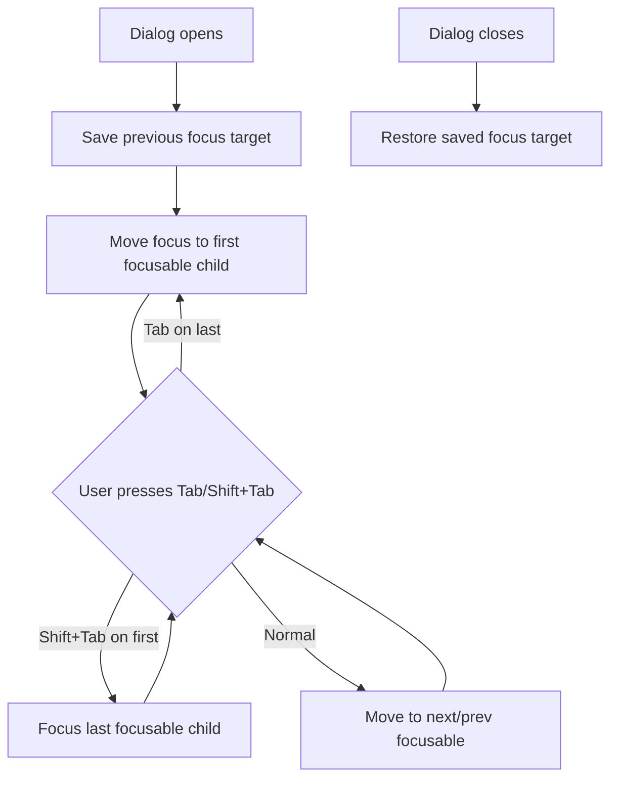

### 18.10 实时区域支持

通知 Toast 使用 ARIA 实时区域语义：

| 严重性 | 礼貌 | 行为 |
|----------|-----------|----------|
| Info | `polite` | 在当前语音之后阅读 |
| Success | `polite` | 在当前语音之后阅读 |
| Warning | `assertive` | 中断当前语音 |
| Error | `assertive` | 中断当前语音 |

通过 `QAccessible::updateAccessibility()` 使用适当的事件类型实现。

---

## 第 19 章. 国际化

> 设计系统完整的 i18n 支持参考。

### 19.1 文本方向 (LTR / RTL)

**枚举**：`TextDirection { LTR, RTL }`

**API**：在 `ITokenRegistry` / `IThemeService` 上调用 `SetDirection(TextDirection)`。

**检测**：`QGuiApplication::layoutDirection()` 返回系统默认值。COCAUI 在初始化时遵循此设置，并允许运行时覆盖。

### 19.2 布局方向影响

| 方面 | LTR 行为 | RTL 行为 |
|--------|-------------|-------------|
| `paddingH` | 左内边距 | 右内边距 |
| 图标位置 | 文本左侧 | 文本右侧 |
| V 形箭头方向 | 指向右侧 (`>`) | 指向左侧 (`<`) |
| 标签栏流 | 从左到右 | 从右到左 |
| 菜单级联 | 右侧 | 左侧 |
| 滚动方向 | 标准 | 标准（滚动是双向的） |
| 进度条填充 | 从左到右 | 从右到左 |
| 滑块轨道 | 左 = 最小值 | 右 = 最小值 |
| 面包屑分隔符 | `>` | `<` |
| 关闭按钮 | 右上角 | 左上角 |
| 对话框按钮 | OK 在右，Cancel 在左 | OK 在左，Cancel 在右 |

### 19.3 图标翻转

方向性图标在 RTL 模式下自动翻转。有关完整的可翻转/不可翻转分类、可翻转性确定 API 和翻转实现细节，请参阅第 16.8 节。

### 19.4 CJK / RTL 脚本的字体回退

| 脚本 | 回退字体 | 回退字体 | 回退字体 |
|--------|--------------------------|------------------------|------------------------|
| CJK (简体中文) | Microsoft YaHei | PingFang SC | Noto Sans CJK SC |
| CJK (繁体中文) | Microsoft JhengHei | PingFang TC | Noto Sans CJK TC |
| CJK (日语) | Yu Gothic | Hiragino Sans | Noto Sans CJK JP |
| CJK (韩语) | Malgun Gothic | Apple SD Gothic Neo | Noto Sans CJK KR |
| 阿拉伯语 | Segoe UI | Geeza Pro | Noto Sans Arabic |
| 希伯来语 | Segoe UI | Arial Hebrew | Noto Sans Hebrew |
| 梵文 | Nirmala UI | Devanagari Sangam MN | Noto Sans Devanagari |
| 泰语 | Leelawadee UI | Thonburi | Noto Sans Thai |

字体回退由 Qt 的字体匹配引擎处理。COCAUI 确保根据平台正确设置主字体家族；Qt 自动处理脚本级别的回退。

### 19.5 数字和日期格式化

COCAUI 不提供自己的 i18n 格式化库。显示数值的 Widget（SpinBox、DoubleSpinBox、Paginator、ProgressBar）使用 Qt 的 `QLocale` 进行：

| 功能 | Qt API | 示例 | 示例 |
|---------|--------|-----------------|-----------------|
| 小数分隔符 | `QLocale::decimalPoint()` | `.` | `,` |
| 千位分隔符 | `QLocale::groupSeparator()` | `,` | `.` |
| 百分比 | `QLocale::percent()` | `%` | `%` |

**DoubleSpinBox** 遵循区域设置的小数分隔符，用于显示和输入解析。

### 19.6 标签中的双向文本

当未设置显式对齐时，`NyanLabel` 使用 `Qt::LayoutDirectionAuto` 进行文本对齐。Qt 的双向文本算法（Unicode Bidi）处理单个标签内的混合方向文本。

对于显式控制：

```cpp
label.node().SetProperty("textAlign", "start"); // 逻辑：LTR=左，RTL=右
label.node().SetProperty("textAlign", "end");   // 逻辑：LTR=右，RTL=左
label.node().SetProperty("textAlign", "center");
```

---
---

# 第 VII 部分 -- 插件扩展

> 第 20-22 章。

## 第 20 章. 动态Token扩展

> 插件定义的设计Token完整参考。

### 20.1 DynamicColorDef 结构体

```cpp
struct DynamicColorDef {
    std::string name;         // 唯一的Token名称（约定："Domain/TokenName"）
    std::string lightValue;   // 浅色主题的十六进制颜色 (#RRGGBB 或 #RRGGBBAA)
    std::string darkValue;    // 深色主题的十六进制颜色
};
```

### 20.2 DynamicFontDef 结构体

```cpp
struct DynamicFontDef {
    std::string name;         // 唯一的Token名称
    FontSpec    spec;         // 基础字体规范（家族、大小、字重）
};
```

动态字体遵循 `FontScale`：实际大小 $= \max(\lfloor \text{spec.pointSize} \cdot \text{fontScale} + 0.5 \rfloor,\; 6)$。

### 20.3 DynamicSpacingDef 结构体

```cpp
struct DynamicSpacingDef {
    std::string name;         // 唯一的Token名称
    int         basePx;       // 密度缩放之前的基础像素值
};
```

动态间距遵循 `DensityLevel`：实际 px $= \lfloor \text{basePx} \times \text{densityScale} + 0.5 \rfloor$。

### 20.4 注册 API

```cpp
// 颜色Token（主题感知：浅色/深色模式下的不同值）
DynamicColorDef colorDefs[] = {
    { "FEA/StressHigh",  "#FF0000", "#FF4444" },  // light, dark
    { "FEA/StressLow",   "#0000FF", "#4444FF" },
    { "FEA/StressMid",   "#FFFF00", "#FFFF66" },
    { "CAD/OverConstrained", "#E34D59", "#E86B6B" },
    { "CAD/UnderConstrained", "#0066FF", "#3385FF" },
    { "CAD/FullyConstrained", "#32CE99", "#4DD9A8" },
};
theme.RegisterDynamicTokens(colorDefs);

// 字体Token
DynamicFontDef fontDefs[] = {
    { "CAD/Dimension", FontSpec{ "Consolas", 8, 400 } },
    { "CAD/Tolerance", FontSpec{ "Consolas", 7, 400 } },
};
theme.RegisterDynamicFonts(fontDefs);

// 间距Token（密度缩放）
DynamicSpacingDef spacingDefs[] = {
    { "CAD/ConstraintGap", 6 },   // 基础 6px，密度缩放
    { "CAD/DimensionPad", 4 },    // 基础 4px
    { "FEA/LegendMargin", 8 },    // 基础 8px
};
theme.RegisterDynamicSpacings(spacingDefs);
```

### 20.5 查询 API

```cpp
auto stressColor = theme.DynamicColor("FEA/StressHigh");       // std::optional<QColor>
auto dimFont     = theme.DynamicFont("CAD/Dimension");          // std::optional<FontSpec>
auto gap         = theme.DynamicSpacingPx("CAD/ConstraintGap"); // std::optional<int>
```

如果Token名称未注册，则返回 `std::nullopt`。

### 20.6 主题感知动态颜色

`DynamicColorDef` 同时具有 `lightValue` 和 `darkValue`。引擎根据 `CurrentMode()` 返回适当的值：

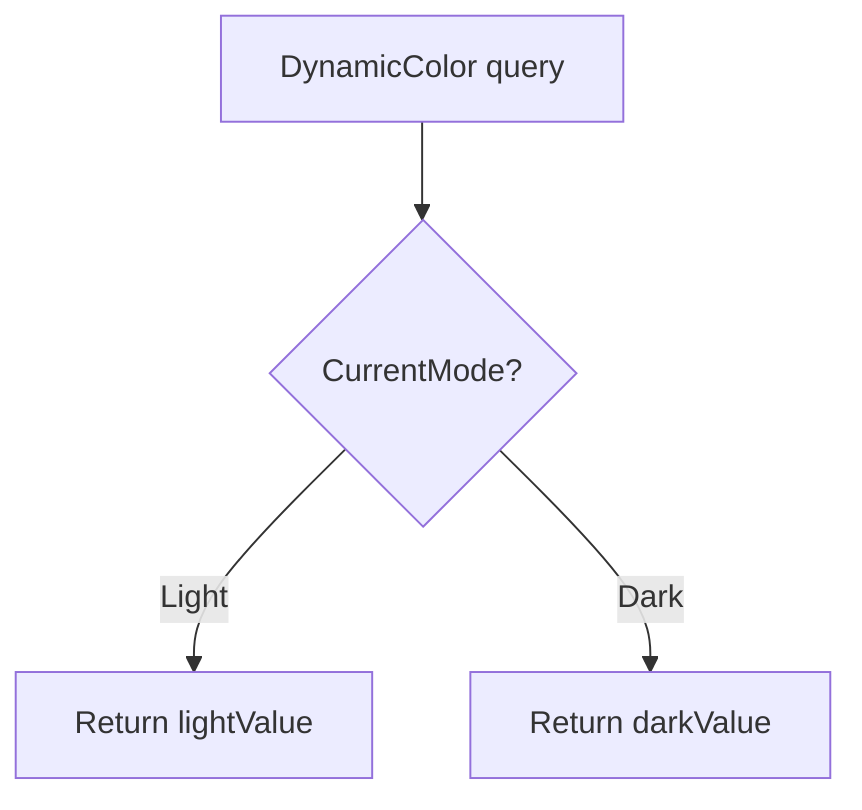

当主题更改时（例如，浅色 -> 深色），所有动态颜色查询自动返回适当模式的值。无需重新注册。

### 20.7 命名约定

动态Token名称应遵循分层约定：

```
<Domain>/<Category>/<Name>
```

| 模式 | 示例 | 描述 |
|---------|---------|-------------|
| `FEA/Stress/<Level>` | `FEA/Stress/High` | FEA 应力可视化 |
| `FEA/Displacement/<Level>` | `FEA/Displacement/Max` | 位移场 |
| `CAD/Constraint/<State>` | `CAD/Constraint/Over` | 几何约束 |
| `CAD/Dimension/<Part>` | `CAD/Dimension/Font` | 尺寸标注 |
| `CFD/Flow/<Property>` | `CFD/Flow/Velocity` | CFD 可视化 |

### 20.8 注销

```cpp
std::string_view names[] = { "FEA/StressHigh", "FEA/StressLow" };
theme.UnregisterDynamicTokens(names);
```

注销会从所有查找映射中移除该Token。后续查询返回 `std::nullopt`。使用这些Token的活动 Widget 应优雅地处理 nullopt 情况。

### 20.9 动态Token生命周期

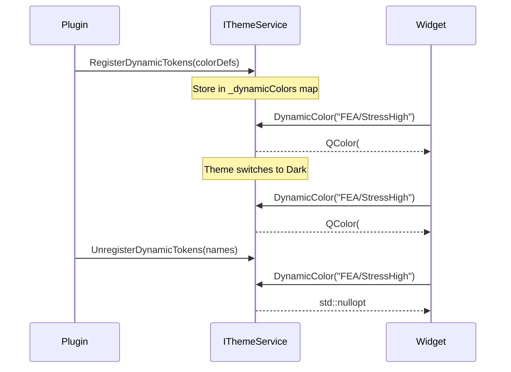

### 20.10 存储实现

动态Token存储在 `std::unordered_map` 中：

| 映射 | 键类型 | 值类型 | 容量 |
|-----|---------|-----------|---------|
| `_dynamicColors` | `std::string` | `DynamicColorDef` | 无限制 |
| `_dynamicFonts` | `std::string` | `DynamicFontDef` | 无限制 |
| `_dynamicSpacings` | `std::string` | `DynamicSpacingDef` | 无限制 |

查找：O(1) 摊销。比静态Token数组索引（`_colors[enum]`）慢，但对于查询频率较低的插件用例来说是可以接受的。

> **动态Token扩展** -- 插件可以在运行时通过 `RegisterDynamicTokens()` 注册特定领域的颜色、字体和间距Token。CAD/CAE 插件具有特定于领域的视觉要求（FEA 应力颜色、几何约束指示器），这是基础设计系统无法预料的。动态Token存储在 `unordered_map`（而非扁平数组）中。

---

## 第 21 章. 自定义主题注册

> 主题注册和继承的完整参考。

### 21.1 注册流程

```cpp
// 1. 注册主题（不激活）
theme.RegisterTheme("CorporateBlue",
                     "/themes/corporate-blue.json",
                     ThemeMode::Light);

// 2. 激活
theme.SetTheme("CorporateBlue");
```

### 21.2 ThemeEntry 存储

```cpp
struct ThemeEntry {
    QString    jsonPath;   // JSON 主题文件的绝对路径
    ThemeMode  mode;       // Light 或 Dark 分类
};
```

所有注册的主题都存储在 `std::unordered_map<std::string, ThemeEntry>` 中。

### 21.3 主题继承

```json
{
  "extends": "Light",
  "colorSeeds": {
    "primary": "#003366"
  },
  "fonts": {
    "Body": { "size": 10 }
  }
}
```

仅指定覆盖的值。其他所有内容继承自父主题。

**继承解析顺序**：

1. 读取此主题的 JSON
2.  如果存在 `"extends"` 键，递归解析父主题
3.  应用父主题的值作为基础
4.  应用此主题的 `colorSeeds`（生成新的色调调色板）
5.  应用此主题的 `colors`（覆盖单个Token）
6.  应用此主题的 `fonts`、`spring`、`fontScale`

**循环继承检测**：如果 `extends` 链形成循环，`LoadPalette()` 记录错误并回退到内置默认值。

### 21.4 多次注册

无插槽限制。主题存储在 `unordered_map<string, ThemeEntry>` 中。
使用相同名称重新注册会覆盖之前的条目。

### 21.5 内置主题常量

| 常量 | 名称 | 模式 | 描述 |
|----------|------|------|-------------|
| `kThemeLight` | `"Light"` | Light | 默认浅色主题 |
| `kThemeDark` | `"Dark"` | Dark | 默认深色主题 |
| `kThemeHighContrast` | `"HighContrast"` | Light | WCAG AAA 高对比度 |

这些在 `NyanTheme` 构造时预注册。可以通过使用相同名称调用 `RegisterTheme()` 来覆盖（不推荐）。

### 21.6 主题发现模式

对于插件贡献的主题：

```cpp
void PluginInit(IThemeService& theme) {
    // 注册插件主题目录中的所有 JSON 文件
    QDir themeDir(pluginPath + "/themes");
    for (const auto& entry : themeDir.entryInfoList({"*.json"})) {
        QString name = entry.baseName();
        ThemeMode mode = name.contains("dark", Qt::CaseInsensitive)
                         ? ThemeMode::Dark : ThemeMode::Light;
        theme.RegisterTheme(name.toStdString(),
                            entry.absoluteFilePath(),
                            mode);
    }
}
```

### 21.7 主题更改信号

当调用 `SetTheme()` 时：

1. `LoadPalette(newThemeName)` —— 加载 JSON，解析继承，生成调色板
2. `BuildDefaultVariants()` —— 重建所有 WidgetStyleSheet 变体矩阵
3. `ApplyOverrides()` —— 重新应用已注册的 ComponentOverrides
4. `BuildGlobalStyleSheet()` —— 重新生成 QSS
5.  `emit ThemeChanged(newThemeName)` —— 通知所有 `ThemeAware` Widget

`ThemeAware` Widget 接收信号并调用 `update()` 以使用新Token值重绘。无需手动干预。

> **基于字符串的主题标识符** -- `ThemeId = QString` 而不是固定的 `enum class ThemeId`。插件需要在运行时注册自定义主题。主题名称没有编译时的详尽性检查；通过内置常量（`kThemeLight`、`kThemeDark`）来缓解。

---

## 第 22 章. C ABI (NyanCApi)

> 设计系统的 C 语言插件接口完整参考。
> 所有函数使用 `extern "C"` 链接，并从 COCAUI 共享库导出。

### 22.1 主题控制 API

| C 函数 | 签名 | 返回 |
|------------|-----------|--------|
| `NyanTheme_SetTheme` | `int NyanTheme_SetTheme(NyanApp* app, const char* themeName)` | `Nyan_OK` 或错误 |
| `NyanTheme_CurrentName` | `int NyanTheme_CurrentName(NyanApp* app, char* outBuf, int bufSize)` | `Nyan_OK` 或 `Nyan_ERR_BUFFER_TOO_SMALL` |
| `NyanTheme_Register` | `int NyanTheme_Register(NyanApp* app, const char* name, const char* jsonPath, int isDark)` | `Nyan_OK` 或错误 |
| `NyanTheme_SetFontScale` | `int NyanTheme_SetFontScale(NyanApp* app, float scale)` | `Nyan_OK` |
| `NyanTheme_FontScale` | `float NyanTheme_FontScale(NyanApp* app)` | 当前缩放 (0.5-3.0) |
| `NyanTheme_SetDensity` | `int NyanTheme_SetDensity(NyanApp* app, int densityLevel)` | `Nyan_OK` |
| `NyanTheme_SetDirection` | `int NyanTheme_SetDirection(NyanApp* app, int direction)` | `Nyan_OK` |

### 22.2 动态Token API (C ABI)

| C 函数 | 签名 | 返回 |
|------------|-----------|--------|
| `NyanTheme_RegisterDynamicColor` | `int NyanTheme_RegisterDynamicColor(NyanApp*, const char* name, const char* lightHex, const char* darkHex)` | `Nyan_OK` |
| `NyanTheme_QueryDynamicColor` | `int NyanTheme_QueryDynamicColor(NyanApp*, const char* name, uint32_t* outRgba)` | `Nyan_OK` 或 `Nyan_ERR_NOT_FOUND` |
| `NyanTheme_UnregisterDynamicColor` | `int NyanTheme_UnregisterDynamicColor(NyanApp*, const char* name)` | `Nyan_OK` |

### 22.3 图标注册 API (C ABI)

| C 函数 | 签名 | 返回 |
|------------|-----------|--------|
| `NyanTheme_RegisterIconDirectory` | `int NyanTheme_RegisterIconDirectory(NyanApp*, const char* uriPrefix, const char* dirPath)` | 注册的图标数量，或负错误代码 |

### 22.4 错误代码

| 代码 | 名称 | 描述 |
|:----:|------|-------------|
| 0 | `Nyan_OK` | 成功 |
| 1 | `Nyan_ERR_NULL_PTR` | 空指针参数 |
| 2 | `Nyan_ERR_INVALID_ARG` | 无效参数值 |
| 3 | `Nyan_ERR_NOT_FOUND` | 未找到命名资源 |
| 4 | `Nyan_ERR_IO` | 文件 I/O 错误 |
| 5 | `Nyan_ERR_PARSE` | JSON 解析错误 |
| 6 | `Nyan_ERR_SCHEMA` | JSON 模式验证失败 |
| 7 | `Nyan_ERR_ALREADY_EXISTS` | 资源已注册 |
| 8 | `Nyan_ERR_BUFFER_TOO_SMALL` | 输出缓冲区太小 |

### 22.5 C ABI 使用示例

```c
#include <NyanCApi.h>

void setup_custom_theme(NyanApp* app) {
    // 注册并激活自定义主题
    int rc = NyanTheme_Register(app, "CorporateBlue",
                                 "/themes/corporate-blue.json", 0);
    if (rc != Nyan_OK) return;

    rc = NyanTheme_SetTheme(app, "CorporateBlue");
    if (rc != Nyan_OK) return;

    // 注册特定于插件的颜色Token
    NyanTheme_RegisterDynamicColor(app,
        "FEA/StressHigh", "#FF0000", "#FF4444");
    NyanTheme_RegisterDynamicColor(app,
        "FEA/StressLow", "#0000FF", "#4444FF");

    // 注册插件图标
    NyanTheme_RegisterIconDirectory(app,
        "asset://fea-plugin/icons/", "/plugins/fea/icons");

    // 设置无障碍首选项
    NyanTheme_SetFontScale(app, 1.25f);
    NyanTheme_SetDensity(app, 2);  // Comfortable
}
```

### 22.6 线程安全

所有 C ABI 函数必须从 **GUI 线程**（Qt 主线程）调用。
从其他线程调用是未定义行为。C ABI 不提供
受互斥锁保护的包装器 —— 线程封送是调用者的责任。

### 22.7 内存所有权

- `const char*` 字符串参数 **不被保留** —— 调用者可以在调用返回后释放。
- `char* outBuf` 为调用者所有 —— 调用者分配，C ABI 写入。
- `NyanApp*` 指针必须在应用程序生命周期内保持有效。

---
---

# 第 VIII 部分 -- 测试与验证

> 第 23-25 章。

## 第 23 章. 测试基础设施

> 设计系统测试设施的完整参考。

### 23.1 SetAnimationOverride(0)

主要的测试支持机制。当处于活动状态时：
- 所有动画跳转到目标值（0ms 持续时间）
- Widget 状态转换是确定性的
- 无依赖于时间的测试失败
- 所有现有的 Widget 测试无需修改即可通过
- 仍然分派 `AnimationStarted` / `AnimationCompleted` 通知

**自动调用**：在 `WidgetTestFixture` 构造函数中。

**手动使用**（用于自定义测试工具）：

```cpp
auto& anim = app.AnimationService();
anim.SetSpeedMultiplier(0.0f);  // 等效于 SetAnimationOverride(0)
```

### 23.2 A11yAudit 集成

```cpp
TEST_CASE("PushButton accessibility") {
    WidgetTestFixture fixture;
    NyanPushButton btn("Save");
    auto violations = A11yAudit::AuditWidget(&btn.node());
    CHECK(violations.empty());
}
```

**批量审计**（树中的所有 Widget）：

```cpp
TEST_CASE("Shell accessibility audit") {
    WidgetTestFixture fixture;
    auto shell = CreateTestShell();
    auto violations = A11yAudit::Audit(&shell.rootNode());

    for (const auto& v : violations) {
        CAPTURE(v.ruleId, v.widgetPath, v.message);
        CHECK(v.severity != Severity::Error);
    }
}
```

### 23.3 WidgetTestFixture

标准测试设置：
1. 初始化 `QApplication`（如果尚未初始化）
2. 创建带有浅色主题的 `NyanTheme`
3. 调用 `SetAnimationOverride(0)`
4. 为测试提供 `Theme()` 访问器
5. 设置 `NotificationQueue` 以进行异步通知测试

**Fixture API**：

| 方法 | 描述 |
|--------|-------------|
| `Theme() -> IThemeService&` | 访问测试主题实例 |
| `FlushQueue()` | 处理所有挂起的排队通知 |
| `SimulateMouseClick(widget, pos)` | 发送鼠标按下 + 释放事件 |
| `SimulateKeyPress(widget, key)` | 发送按键按下事件 |
| `SimulateHover(widget, pos)` | 发送鼠标进入 + 移动事件 |

### 23.4 NotificationSpy 测试模式

用于验证通知发送：

```cpp
class NotificationSpy : public CommandNode {
    std::vector<std::shared_ptr<Notification>> _captured;
public:
    void AnalyseNotification(CommandNode*, Notification& n) override {
        _captured.push_back(n.Clone());
        n.SetAccepted(true);
    }

    template <typename T>
    int Count() const {
        return std::ranges::count_if(_captured,
            [](auto& n) { return n->IsA<T>(); });
    }

    template <typename T>
    const T& Last() const {
        auto it = std::ranges::find_if(_captured | std::views::reverse,
            [](auto& n) { return n->IsA<T>(); });
        return it->get()->template As<T>();
    }
};
```

**用法**：

```cpp
TEST_CASE("Slider emits IntValueChanged") {
    WidgetTestFixture fixture;
    NotificationSpy spy(nullptr);
    NyanSlider slider;
    slider.node().SetParent(&spy);

    slider.node().SetValue(42);

    CHECK(spy.Count<IntValueChanged>() == 1);
    CHECK(spy.Last<IntValueChanged>().Value() == 42);
}
```
### 23.5 主题测试模式

**使用多个主题进行测试**：

```cpp
TEST_CASE("Widget colors adapt to theme") {
    WidgetTestFixture fixture;
    NyanPushButton btn("OK");

    // 测试浅色主题
    fixture.Theme().SetTheme("Light");
    auto lightStyle = fixture.Theme().Resolve(
        WidgetKind::PushButton, 0, InteractionState::Normal);

    // 测试深色主题
    fixture.Theme().SetTheme("Dark");
    auto darkStyle = fixture.Theme().Resolve(
        WidgetKind::PushButton, 0, InteractionState::Normal);

    CHECK(lightStyle.background != darkStyle.background);
}
```

**测试密度缩放**：

```cpp
TEST_CASE("Widget height scales with density") {
    WidgetTestFixture fixture;
    NyanPushButton btn("OK");

    fixture.Theme().SetDensity(DensityLevel::Compact);
    int compactH = btn.minimumHeight();

    fixture.Theme().SetDensity(DensityLevel::Comfortable);
    int comfortH = btn.minimumHeight();

    CHECK(compactH < comfortH);
}
```

### 23.6 视觉回归测试（策略）

COCAUI 不提供视觉回归框架，但通过以下方式支持它：

| 设施 | 目的 |
|----------|---------|
| `SetAnimationOverride(0)` | 确定性快照（无动画中途帧） |
| `SetTheme("Light")` | 已知的基线主题 |
| `SetDensity(Default)` | 已知的基线密度 |
| `SetFontScale(1.0)` | 已知的基线字体缩放 |
| `SetDirection(LTR)` | 已知的基线文本方向 |
| `QWidget::grab()` | Qt 内置 Widget 截图 |

推荐的外部工具：Qt Test `QVERIFY(QTest::qWaitForWindowExposed(widget))` +
`QPixmap::toImage()` 对比。

---

## 第 24 章 JSON 验证管道

> 主题文件验证的完整参考。

### 24.1 tokens_schema.json

定义主题 JSON 文件结构的 JSON Schema (draft-07)。

**必需的顶级属性**：无（全部可选，可通过 `extends` 继承）。

**允许的顶级键**：`extends`、`colors`、`colorSeeds`、`fonts`、`spring`、`fontScale`。

**颜色值格式**：`"#RRGGBB"` 或 `"#RRGGBBAA"` (正则：`^#[0-9A-Fa-f]{6}([0-9A-Fa-f]{2})?$`)。

**架构结构**：

```json
{
    "$schema": "http://json-schema.org/draft-07/schema#",
    "type": "object",
    "additionalProperties": false,
    "properties": {
        "extends": { "type": "string" },
        "colors": {
            "type": "object",
            "additionalProperties": false,
            "properties": {
                "Surface": { "$ref": "#/definitions/color" },
                "SurfaceContainer": { "$ref": "#/definitions/color" },
                ...
            }
        },
        "colorSeeds": {
            "type": "object",
            "additionalProperties": false,
            "properties": {
                "primary": { "$ref": "#/definitions/color" },
                "success": { "$ref": "#/definitions/color" },
                "warning": { "$ref": "#/definitions/color" },
                "error":   { "$ref": "#/definitions/color" },
                "info":    { "$ref": "#/definitions/color" }
            }
        },
        "fonts": {
            "type": "object",
            "properties": {
                "Body":      { "$ref": "#/definitions/fontSpec" },
                "Caption":   { "$ref": "#definitions/fontSpec" },
                "Heading":   { "$ref": "#/definitions/fontSpec" },
                "Monospace": { "$ref": "#/definitions/fontSpec" }
            }
        },
        "spring": { "$ref": "#/definitions/springSpec" },
        "fontScale": { "type": "number", "minimum": 0.5, "maximum": 3.0 }
    },
    "definitions": {
        "color": {
            "type": "string",
            "pattern": "^#[0-9A-Fa-f]{6}([0-9A-Fa-f]{2})?$"
        },
        "fontSpec": {
            "type": "object",
            "properties": {
                "family": { "type": "string" },
                "size":   { "type": "number", "minimum": 6, "maximum": 72 },
                "weight": { "type": "integer", "minimum": 100, "maximum": 900 }
            }
        },
        "springSpec": {
            "type": "object",
            "properties": {
                "mass":      { "type": "number", "minimum": 0.01 },
                "stiffness": { "type": "number", "minimum": 1.0 },
                "damping":   { "type": "number", "minimum": 0.0 }
            }
        }
    }
}
```

### 24.2 validate_tokens.py

作为 CMake 自定义命令在构建期间调用的 Python 脚本。

**检查**：
1. JSON 语法有效性
2. 模式合规性（通过 `jsonschema` 库）
3. Light.json 和 Dark.json 中覆盖所有 `ColorToken` 枚举名称
4. 无多余的颜色键（拼写错误检测）
5. 字体大小/字重范围验证
6. ColorSeed 十六进制格式验证
7. `extends` 链循环检测（无循环继承）

**退出代码**：

| 代码 | 含义 |
|:----:|---------|
| 0 | 所有验证通过 |
| 1 | JSON 语法错误 |
| 2 | 模式验证失败 |
| 3 | 缺少必需的颜色Token |
| 4 | 检测到多余键 |

**CMake 集成**：

```cmake
add_custom_command(
    OUTPUT ${CMAKE_BINARY_DIR}/tokens_validated.stamp
    COMMAND ${Python3_EXECUTABLE} ${CMAKE_SOURCE_DIR}/Scripts/validate_tokens.py
            --schema ${CMAKE_SOURCE_DIR}/Resources/tokens_schema.json
            --light  ${CMAKE_SOURCE_DIR}/Resources/Themes/Light.json
            --dark   ${CMAKE_SOURCE_DIR}/Resources/Themes/Dark.json
    DEPENDS ${theme_files} ${schema_file}
)
```

### 24.3 CI 集成

验证在每个 PR 上运行。如果任何主题文件无效，则构建失败。

**CI 流程顺序**：

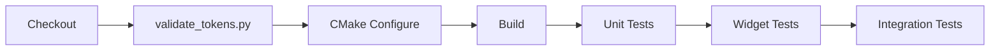

### 24.4 添加新主题文件

创建新主题 JSON 文件时的步骤：

1. 复制 `Light.json` 或 `Dark.json` 作为模板
2. 修改所需颜色/字体/弹簧值
3. 在本地运行 `validate_tokens.py`：`python Scripts/validate_tokens.py --schema ... --theme path/to/new.json`
4. 通过 `RegisterTheme()` 在应用程序代码中注册
5. 添加到 CMake `DEPENDS` 列表以进行验证

---

## 第 25. 设计Token一致性检查

> 设计Token完整性的编译时和运行时验证。

### 25.1 static_assert 守卫

编译时验证枚举计数与存储数组大小匹配：

```cpp
static_assert(std::to_underlying(ColorToken::Count_)    == kColorTokenCount);
static_assert(std::to_underlying(SpacingToken::Count_)   == 16);
static_assert(std::to_underlying(FontRole::Count_)       == kFontRoleCount);
static_assert(std::to_underlying(ElevationToken::Count_)  == kElevationTokenCount);
static_assert(std::to_underlying(WidgetKind::Count_)     == kWidgetKindCount);
static_assert(std::to_underlying(EasingToken::Count_)     == kEasingTokenCount);
static_assert(std::to_underlying(RadiusToken::Count_)     == kRadiusTokenCount);
static_assert(std::to_underlying(LayerToken::Count_)      == kLayerTokenCount);
static_assert(std::to_underlying(AnimationToken::Count_)  == kAnimationTokenCount);
static_assert(std::underlying(InteractionState::Count_) == kInteractionStateCount);
```

### 25.2 枚举到名称表同步

名称查找表（用于 JSON 解析）必须与枚举顺序匹配。
通过遍历所有枚举值并检查名称解析的单元测试进行验证。

```cpp
TEST_CASE("ColorToken name table is complete") {
    for (int i = 0; i < kColorTokenCount; ++i) {
        auto token = static_cast<ColorToken>(i);
        auto name = ColorTokenName(token);
        CHECK_FALSE(name.empty());
        CHECK(ColorTokenFromName(name) == token);
    }
}
```

### 25.3 WidgetStyleSheet 覆盖测试

验证每个 `WidgetKind` 都具有非空的 `WidgetStyleSheet`，并至少包含一个 `VariantStyle`：

```cpp
TEST_CASE("All WidgetKinds have style sheets") {
    WidgetTestFixture fixture;
    for (int i = 0; i < kWidgetKindCount; ++i) {
        auto kind = static_cast<WidgetKind>(i);
        auto sheet = fixture.Theme().StyleSheet(kind);
        CAPTURE(i, WidgetKindName(kind));
        CHECK_FALSE(sheet.variants.empty());
    }
}
```

### 25.4 Token往返测试

验证所有颜色Token在主题序列列化-反序列化循环中存活：

```cpp
TEST_CASE("Color tokens roundtrip through JSON") {
    WidgetTestFixture fixture;
    for (int i = 0; i < kColorTokenCount; ++i) {
        auto token = static_cast<ColorToken>(i);
        QColor color = fixture.Theme().Color(token);
        CHECK(color.isValid());
        CHECK(color.alpha() > 0 || token == ColorToken::Scrim);
    }
}
```

### 25.5 跨主题对比度验证

自动检查浅色和深色主题中所有文本-背景Token组合是否符合 WCAG AA 对比度合规性：

```cpp
TEST_CASE("WCAG AA contrast compliance") {
    WidgetTestFixture fixture;
    for (auto themeName : {"Light", "Dark"}) {
        fixture.Theme().SetTheme(themeName);

        struct Pair { ColorToken text; ColorToken bg; };
        Pair pairs[] = {
            { ColorToken::colorText,   ColorToken::Surface },
            { ColorToken::colorText,   ColorToken::SurfaceContainer },
            { ColorToken::colorTextSecondary, ColorToken::Surface },
            { ColorToken::OnAccent,      ColorToken::colorPrimary },
            { ColorToken::OnAccent,      ColorToken::colorError },
        };

        for (auto [text, bg] : pairs) {
            QColor fg = fixture.Theme().Color(text);
            QColor bgc = fixture.Theme().Color(bg);
            float ratio = ContrastChecker::Ratio(fg, bgc);
            CAPTURE(themeName, text, bg, ratio);
            CHECK(ratio >= 4.5f);
        }
    }
}
```

### 25.6 测试覆盖率目标

| 类别 | 目标 | 描述 |
|----------|:------:|-------------|
| 枚举完整性 | 100% | 每个枚举值都有名称，每个名称都能解析 |
| WidgetStyleSheet 覆盖 | 100% | 每个 WidgetKind 都有非空样式表 |
| 颜色对比度 AA | 100% | 所有文本/背景对满足 4.5:1 |
| 通知发送 | 90%+ | 交互式 Widget 发出正确的通知 |
| 无障碍审计 | 100% | 零 Error 严重性违规 |
| 字体缩放极限 | 100% | 所有角色在 0.5x 和 3.0x 下产生有效字体 |
| 密度极限 | 100% | Compact 和 Comfortable 产生有效布局 |

---

# 第 IX 部分. UI 架构

> 本部分指定 UiNode 树、多窗口协议、视口管理、渲染器抽象、关闭序列、ActionBar 停靠行为和样式复用策略。
> 这些章节将设计系统（第 I-VIII 部分）与框架实现连接起来。

### 为什么设计系统规范包含框架架构

COCAUI 不是一个独立的、由独立 Widget 工具箱消费的“设计Token库”。它是一个 **集成的设计系统 + Widget 框架**：设计Token、样式解析引擎、动画服务和 Widget 树作为一个单一构件在一个共享库（`COCAUI.dll`）中共同设计。

这种集成具有具体的架构后果：**设计Token必须在运行时正确地流经 UiNode 树**。具体而言：

1.  **Token传播**：`IThemeService::Resolve(kind, variant, state)` 要求框架知道每个 Widget 的 `WidgetKind`、当前变体索引和 `InteractionState`。这些是 UiNode 层属性（第 26 章）。
2. 主题更改广播**：`ThemeChanged` 信号必须到达每个 `ThemeAware` Widget 在每个窗口中，包括在初始主题设置后创建的浮动窗口。这需要多窗口协议（第 27 章）。
3.  **动画生命周期**：`IAnimationService` 处理必须能在选项卡拖出期间在视口重新挂载时存活。这需要渲染器抽象（第 28 章）和关闭序列（第 26.8 节）。
4.  **组件覆盖范围**：`ComponentOverride` 注册对 `IThemeService` 是全局的，但其视觉效果必须传播到所有现有的 Widget 实例。通知架构（第 26.5 节）定义了其实现方式。

如果没有这些章节，设计系统规范将是不完整的——它定义了**存在**哪些视觉属性，但没有定义它们**如何**到达屏幕上的像素。

## 第 26 章. UiNode 树架构

### 26.1 Application / Shell / WindowNode 分离

框架分离了三个关注点：

| 类 | 角色 | Qt 依赖 |
|-------|------|---------------|
| **`Application`** | 非 UiNode。拥有 `QApplication` 生命周期。`Initialize`、`Tick`、`ProcessEvents`、`FlushDirtyViewports`、`Shutdown`。多窗口：`CreateWindow`、`DestroyWindow`。 | Pimpl 隐藏 Qt |
| **`Shell`** | UiNode 根。**零 Qt 成员**。`MainWindow()`、`GetActionBar()`、`GetDocumentManager()`、`FreezeUpdates()`。 | 无 |
| **`WindowNode` | 每个顶层窗口的 UiNode。Pimpl 隐藏 `QMainWindow`。`WindowKind`: Main/Floating/Detached。 | Pimpl 隐藏 Qt |

### 26.2 UiNode 基类

`UiNode` 提供：`Id()`、`Type()`、`Name()`、`Parent()`、`Children()`、`AddChild()`、`RemoveChild()`、`FindById()`、`FindByName()`，树遍历（`Descendants()`、`DescendantsOfType`）。

**Widget 树同步钩子**（虚函数，默认无操作）：`OnChildAdded(UiNode*)`、`OnChildRemoved(UiNode*)`。容器子类覆盖以同步 Qt Widget 树。

**双 API 模式**：(1) **命令式** —— 便捷工厂，如 `AddTab(id, label)`，在一个调用中创建子节点 + Widget + 树插入；(2) **声明式**—— 在外部构造节点，然后 `parent->AddNode(move(node))`。

### 26.3 容器节点清单

| UiNode | Widget | 关键 API |
|--------|--------|---------|
| `ActionBarNode` | `NyanActionBar` | `AddTab()`, `SwitchTab()`, `SetDockSide()`, `SetCollapsed()` |
| `ActionTabNode` | `NyanActionTab` | `AddToolbar()`, `RemoveToolbar()` |
| `ActionToolbarNode` | `NyanActionToolbar` | `AddButton()`, `RemoveButton()` |
| `ActionButtonNode` | `NyanToolButton` | `SetEnabled()`, `SetChecked()`, `SetCheckable()` |
| `DialogNode` | `NyanDialog` | `ShowModal()`, `ShowSemiModal()`, `ShowModeless()`, `Close()` |
| `StatusBarNode` | `NyanStatusBar` | `AddLabel()`, `AddProgress()`, `AddWidget()`, `RemoveItem()` |
| `ContextMenu` | `NyanContextMenu` | `AddContributor()`, `RemoveContributor()` |
| `DocumentArea` | 内部 | `AddPage()`, `RemovePage()`, `ActivePage()`, `SwitchPage()` |
| `ControlBar` | 业务层 | `Clear()`, `AddChild()` |
| `ContainerNode` | 布局组合 | `SetSpacing()`, `SetMargins()`, LayoutKind: V/H/Grid/Form/Stack |
| `WidgetWrapper` | 用户 QWidget | 通用包装器 |`

### 26.4 WidgetNode 类型化子类（方案 D）

~15 个类型化子类为高频原子 Widget 提供直接的 UiNode 级访问：

| 节点 | Widget | 关键通知 |
|------|--------|-------------------|
| `PushButtonNode` | `NyanPushButton` | `Activated`, `Pressed`, `Released` |
| `ToolButtonNode` | `NyanToolButton` | `Activated`, `RightClicked` |
| `LineEditNode` | `NyanLineEdit` | `TextChanged`, `EditingFinished`, `ReturnPressed` |
| `CheckBoxNode` | `NyanCheckBox` | `Toggled`, `Clicked` |
| `RadioButtonNode` | `NyanRadioButton` | `Toggled`, `Clicked` |
| `ToggleSwitchNode` | `NyanToggleSwitch` | `Toggled` |
| `ComboBoxNode` | `NyanComboBox` | `IndexChanged`, `TextActivated` |
| `SpinBoxNode` | `NyanSpinBox` | `ValueChanged`, `EditingFinished` |
| `DoubleSpinBoxNode` | `NyanDoubleSpinBox` | `ValueChanged`, `EditingFinished` |
| `SliderNode` | `NyanSlider` | `ValueChanged`, `SliderPressed`, `SliderReleased` |
| `SearchBoxNode` | `NyanSearchBox` | `TextChanged`, `SearchSubmitted` |
| `LabelNode` | `NyanLabel` | `LinkActivated` |
| `ProgressBarNode` | `ProgressBarNode` | *(无 -- 纯显示)* |
| `ColorSwatchNode` | `NyanColorSwatch` | `ColorChanged`, `Activated` |
| `ColorPickerNode` | `NyanColorPicker` | `ColorChanged` |
| `ListWidgetNode` | `NyanListWidget` | `IndexChanged`, `ItemDoubleClicked` |
| `DataTableNode` | `NyanDataTable` | `CellSelected`, `CellChanged`, `DataChanged`, `RowAdded`, `RowRemoved`, `SelectionChanged`, `SortChanged`, `EmptyClicked` |
| `TreeWidgetNode` | `NyanStructureTree` | `SelectionChanged`, `ItemDoubleClicked`, `ContextMenuRequested` |
| `PropertyGridNode` | `NyanPropertyGrid` | `PropertyChanged` |

公共 API：`SetEnabled()`、`SetVisible()`、`SetToolTip()`、`SetIcon()`。

### 26.5 通知架构

> **仅向上通知传播** -- 通知仅向上传播（子 -> 父 -> 祖先），绝不向下或横向。简化通知流推理。防止循环分派。符合既定的 CAD 框架模式（CATIA V5 Command/Notification 架构）。消费者必须是发送者的祖先。对于非祖先消费者，使用 `NotificationBridge` 模式。

> **3 层订阅安全** -- 三层生命周期安全：(L1) ScopedSubscription 订阅守卫，(L2) 带有发布者Token的 EventNode 双向跟踪，(L3) 跨边界清理（在 RemoveChild 时）。防止销毁期间的悬空指针访问。每个订阅有微小的内存开销（两个 `weak_ptr`）。所有对象存活时零开销。

> **带生成戳的排队通知** -- 排队（异步）通知带有 `SourceGeneration` 时间戳，自动从发送者的 `Generation()` 计数器设置。异步通知可能在发送者状态再次更改后到达，导致通知在语义上已过时。订阅者应比较 `notif.SourceGeneration()` 与 `sender.Generation()` 以检测过期。

### 26.6 级联菜单行为

级联菜单是一种弹出菜单，其项目本身可以打开子菜单，从而形成任意深度的树。本节定义了 `NyanMenu` / `MenuNode` 级联菜单的可观察交互契约。该契约遵循 Windows 资源管理器、macOS Finder、CATIA V5 和 Qt Creator 共享的标准桌面级联约定；偏差已明确指出。

#### 26.6.1 结构规则

菜单包含一个有序的 **项目**、**分隔符**和**子菜单触发器**。每个子菜单触发器在视觉上通过向右的 V 形箭头进行区分。激活子菜单触发器会打开子菜单；子菜单本身是一个完整的菜单，可能包含进一步的子菜单触发器，从而产生 N 级联。没有硬性深度限制，但可用性指导建议最多 3 层。

在任何给定时刻，每个菜单 **至多有一个打开的子菜单**。打开一个新的子菜单会隐式关闭前一个。

#### 26.6.2 打开与定位

| 触发器 | 行为 |
|---------|----------|
| MenuBar 按钮点击 | 根菜单出现在按钮下方。 |
| MenuBar 悬停（当另一个菜单已打开） | 前一个菜单关闭；悬停的菜单打开。保持单开不变性。 |
| Alt + 助记符 | 根菜单打开。助记字符是菜单标签中 `&` 后面的字母。 |
| 上下文菜单请求 | 根菜单出现在光标位置。 |

**弹出动画**：菜单从光标方向滑入，持续 160ms，带有减速缓动。如果菜单延伸到屏幕边缘，其位置被限制在所有四个侧面的可用屏幕几何形状上。

**子菜单定位**：子菜单与其触发项的右上角对齐。如果这将导致子菜单超出屏幕，子菜单翻转到触发器的左侧。

#### 26.6.3 悬停与子菜单交互

| # | 场景 | 预期行为 |
|---|----------|-------------------|
| H1 | 悬停子菜单触发器 | 200 毫秒停留延迟后，子菜单打开。 |
| H2 | 悬停普通（非子菜单）项目，同时子菜单已打开 | 子菜单立即关闭。 |
| H3 | 悬停拥有当前打开子菜单的触发器 | 子菜单保持打开（无关闭/重新打开循环）。 |
| H4 | 悬停不同的子菜单触发器，同时子菜单已打开 | 旧子菜单立即关闭；新触发器的 200 毫秒延迟开始。 |
| H5 | 从触发器向打开的子菜单对角移动（安全三角区） | 子菜单保持打开，即使光标暂时穿过其他项目。安全区是由光标原点、子菜单的左上角和子菜单的左下角形成的三角形。 |

#### 26.6. 解除规则

| # | 触发器 | 对菜单链的影响 |
|---|---------|---------------------|
| D1 | 点击叶子项目 | 项目触发。**整个链关闭** —— 从点击项目的菜单向上到根。 |
| D2 | Escape 键 | **仅最内层的打开菜单关闭。** 焦点返回其父菜单。如果在根菜单上按下，则根菜单关闭。 |
| D3 | 点击所有打开菜单之外 | **整个链关闭** —— 根和所有后代。 |
| D4 | 在该按钮的菜单已打开时点击 MenuBar 按钮 | 菜单切换关闭。 |

**级联关闭不变性**：当通过外部点击（D3）或项目激活（D1）解除第 N 层菜单时，所有 > N 层的菜单也会被解除。Escape (D2) 是唯一仅关闭单层的操作。

#### 26.6.5 键盘导航

| 键 | 上下 | 行为 |
|-----|------|----------|
| Down | 在菜单内 | 将高亮移动到下一个项目（绕回到顶部）。分隔符被跳过。 |
| Up | 在菜单内 | 将高亮移动到上一个项目（绕回到底部）。分隔符被跳过。 |
| Enter / Return | 项目高亮 | 激活项目（等同于点击）。如果项目是子菜单触发器，则打开子菜单。 |
| Right | 在子菜单触发器上 | 打开子菜单。 |
| Right | 在根菜单中的非子菜单项目上 | 切换到 MenuBar 中的下一个菜单（如果存在）。 |
| Left | 在子菜单内 | 关闭子菜单，焦点返回父菜单。 |
| Left | 在根菜单内 | 切换到 MenuBar 中的上一个菜单（如果存在）。 |
| Escape | 任何菜单 | 关闭最内层的打开菜单（同 D2）。 |

#### 26.6.6 多级级联（3+ 层）

上述所有规则递归适用。深层级联的特定行为：

| 场景 | 行为 |
|----------|----------|
| 在第 3 层按 Escape | 第 3 层关闭。第 2 层和根保持打开。 |
| 在有 3 层打开时点击外部 | 所有三个层级都关闭。 |
| 在第 3 层点击叶子项目 | 项目触发；第 3、2 和第 1 层全部关闭。 |
| 从第 3 层移回第 1 层（跳过第 2 层） | 第 3 层关闭。第 2 层关闭。第 1 层正常处理悬停（可能打开不同的子菜单或高亮普通项目）。 |

#### 26.6.7 UiNode 层事件路由

当光标退出子菜单的几何形状时，Widget 发出方向信号。`MenuNode` UiNode 层通过向上遍历 `MenuNode` 父链来处理此操作：每个祖先检查光标是否在其自己的菜单几何形状内。第一个包含光标位置的祖先处理悬停（可能会关闭中间子菜单）。如果没有祖先包含该位置，该事件是外部点击解除的候选。

此路由是必要的，因为 Qt 的弹出抓取仅将鼠标事件传递给最顶层的弹出窗口。如果没有 UiNode 层转发，父菜单无法得知光标在子弹出窗口占据时已重新进入其区域。

#### 26.6.8 通知

| 通知 | 发送者 | 载荷 | 触发器 |
|-------------|--------|---------|---------|
| `Activated` | `MenuNode` | *(无)* | 任何后代叶子项目被触发（点击或 Enter） |

`Activated` 通知通过 UiNode 树向上传播，允许祖先（例如 `MenuBarNode`、`Shell`）对菜单项激活做出反应，而无需耦合到特定项目。

### 26.7 插件系统

插件通过在 `Start()` 中接收 `Shell` 根 UiNode 来扩展应用程序，从而获得对 UiNode 树和 `IDocumentManager` 的完全访问权限。不允许访问全局状态。

#### 26.7.1 IExpansionPlugin 接口

```cpp
class IExpansionPlugin {
public:
    virtual ~IExpansionPlugin() = default;
    virtual auto Id() -> std::string_view = 0;
    virtual auto Start(Shell& shell) -> Expected<void> = 0;
    virtual void Stop() = 0;
};
```

#### 26.7.2 PluginHost

- `LoadPlugin(path) -> Expected<string_view>`：加载 DLL，调用工厂函数
- `LoadPluginsFromDirectory(dir) -> Expected<vector<string_view>>`：使用 `std::ranges` + `std::filesystem` 进行文件系统扫描
- `StopPlugin(id)`、`StopAll()`：生命周期管理
- 无 `dlclose`/`FreeLibrary` —— DLL 保持加载状态

#### 26.7.3 插件 C 入口点

```cpp
extern "C" COCAUI_EXPORT IExpansionPlugin* CreateExpansionPlugin();
```

每个 DLL 一个工厂函数。

### 26.8 应用程序关闭序列

#### 26.8.1 核心不变量

> **关机期间**：在关机期间的任何时刻，如果正在执行 `UiNode` 析构函数体，该 `UiNode` 通过 `CreateWidget()` / `BuildWindow()` 创建的 **所有 QWidget 仍然存活**。

通过以下方式强制执行：(1) 在删除 Qt Widget 之前调用 `CommandNode::DestroyChildren()`；(2) `WindowNode::~WindowNode` 中的 `QPointer` 守卫。

#### 26.8.2 五阶段关闭模型

| 阶段 | 名称 | 后置条件 | 层级 |
|-------|------|---------------|-------|
| **S0** | 退出主循环 | `ShouldClose() == true` | App |
| **S1** | 分离业务观察者 | 所有 `ScopedSubscription` 已释放。UiNode tree 存活。 | App |
| **S2** | 停止服务 | 插件停止，浮动窗口关闭，主窗口隐藏。 | App |
| **S3** | 框架拆解 | `Application::Shutdown()`：Shell 销毁（UiNode + Qt Widget 已消失）。 | Framework |
| **S4** | 平台清理 | 释放操作系统句柄，延迟 Qt 删除已处理。 | App/OS |

#### 26.8.3 规范关闭代码

```cpp
// S0: 退出主循环 (ShouldClose() == true)

// S1: 分离业务观察者
_impl->mainWindow.CloseFloatingWindows();
_impl->mainWindow.Teardown();
_impl->debugWindow.reset();

// S2: 停止服务
_impl->app->MainWindow().Close();
_impl->app->MainWindow().Hide();
_impl->sketchEditor.Stop();
_impl->pluginHost.StopAll();

// S3: 框架拆解
_impl->app->Shutdown();

// S4: 平台清理
ReleaseSingleInstanceLock();
QApplication::processEvents();
```

---

## 第 27 章 多窗口与浮动标签页协议

### 27.1 WindowNode 内部组件表

| 组件 | 主窗口 | 浮动窗口 | 备注 |
|-----------|:-----------:|:---------------:|-------|
| **NyanMainTitleBar** | 是（64px，2 行） | 否 | Logo, MenuBar, QuickCmds, DocumentBar, GlobalBtns |
| **NyanDocumentBar** | 标题栏第 2 行内 | 是（独立） | 支持标签拖出/拖回 |
| **WorkspaceFrame** | 全屏 | 全屏 | 可扩展容器 |
| **ActionBar** | 全屏（4 边可停靠） | 全屏 | 每个窗口独立 |
| **DocumentArea** | 全屏 | 全屏 | 两者都支持多标签页 |
| **ControlBar** | 每个文档 | 每个文档 | 遵循活动文档 |
| **StatusBar** | 全屏 | 简化 | 浮动：坐标 + 仅进度 |
| **Dialog floating** | 是 | 是 | 对齐 |

### 27.2 Document-DocumentPage 一对多模型

单个 `Document` 可以在不同窗口中拥有**多个** `DocumentPage` 视图：

- `DocumentPage` 拥有 `DocId()` 以查找父 Document
- 多个页面共享模型数据，但具有**独立**的 ViewportGroup（相机、分割模式）
- 撤销/重做在 Document 层级操作 -- 所有页面在 `OnModelChanged` 上重新渲染
- `SetModified(true)` 传播到同一 Document 的所有页面
- 关闭 `DocumentPage` **不**关闭 Document —— 只有**最后**一页触发关闭流程
- 右键点击标签：**“新建视图”** 创建额外的 DocumentPage（CATIA “窗口 > 新窗口”）

**IDocumentManager 1:N 扩展**：

```cpp
auto CreateDocumentPage(DocId doc, WindowId targetWindow = {}) -> Expected<PageId>;
auto GetDocumentPages(DocId doc) -> std::span<DocumentPage*>;
auto GetPageWindow(PageId page) -> WindowNode*;
auto ActiveWindow() -> WindowNode*;
```

### 27.3 标签拖出 / 拖回协议

**拖出**（任意窗口 -> 新的 FloatingWindow）：

1.  `NyanDocumentBar` 检测到垂直拖动 > 标签页高度
2.  使用标签页截图像素图启动 `QDrag`
3. 放置在空区域：`Application::CreateWindow(Floating)`，重新父级 `DocumentPage` UiNode
4.  `IViewportRenderer` 接收 `OnNativeHandleChanged()` —— 重建交换链
5. 源窗口标签栏更新

**拖回**（FloatingWindow -> 任意窗口）：

1. 目标识别（DocumentBar 标签区域）
2. DocumentPage UiNode 重新父级化（反向方向）
3. 源 FloatingWindow 如果剩余页面为零则自动销毁

**关闭行为**：
- 关闭浮动窗口：对于每个页面 —— 最后一页触发关闭并带有保存提示；非最后一页仅销毁页面
- 关闭主窗口：所有浮动窗口首先关闭，然后应用程序关闭

### 27.4 标签拖放与拖放规范

三种拖放场景：

| 场景 | 触发器 | 机制 | MIME 类型 |
|----------|---------|-----------|-----------|
| **A: 栏内重排** | 栏内水平拖动 | 纯鼠标跟踪（无 QDrag） | 无 |
| **B: 跨窗口传输** | 从栏中垂直拖出，放置到另一个栏 | 带有 MIME 的 `QDrag` | `application/x-COCAUI-tab` |
| **C: 拖放到虚空** | 放置在空白区域 | `QDrag::exec()` 返回 `IgnoreAction` | `application/x-COCAUI-tab` |

**浮动窗口标签栏自动隐藏**：`TabCount <= 1` -> 隐藏；`TabCount >= 2` -> 可见（仅浮动样式）。

**新 Widget 信号**：`TabReordered(PageId, oldIdx, newIdx)`、`TabDropReceived(PageId, sourceWin, insertIdx)`、`TabDraggedToVoid(PageId, globalPos)`。

**新 UiNode 通知**：`TabReordered`、`TabDroppedIn`、`TabPageDraggedOut`。

### 27.5 Z-Order 策略（Qt 窗口标志）

| 规范层级 | 内容 | Qt 实现 |
|:----------:|---------|-------------------|
| I | Tooltip / PopConfirm | `Qt::ToolTip` 标志，自动隐藏计时器 |
| II | 模态对话框 | `QDialog` + `Qt::ApplicationModal` |
| III | 半模态 / 非模态 | `QDialog` + `Qt::WindowModal` 或非模态 |
| IV | 浮动 WindowNode | `QMainWindow` + `setParent(mainWindow)` + `Qt::Window` |
| V | WorkspaceFrame 覆盖 | WindowNode 的 WorkspaceFrame 内的子 `QWidget` |
| VI | 主 WindowNode / 栏栏 | 顶层 `QMainWindow` |
| VII | Application | 不适用（进程级别） | N/A（进程级别） |

**关键规则**：在 FloatingWindowNode 上使用 `setParent(mainWindow)` 确保正确的堆叠。

---

## 第 28 章 视口系统

### 28.1 数据模型

```
TreeNode = std::variant<SplitNode, LeafNode>

SplitNode {
    direction : SplitDirection     // H (Left|Right) 或 V (Top/Bottom)
    ratio     : double [0.1, 0.9] // 第一个子节点获得 ratio * 大小
    first     : unique_ptr<TreeNode>
    second    : unique_ptr<TreeNode>
}

LeafNode {
    viewportId : ViewportId
    viewport   : Viewport*         // 非拥有
}
```

二叉拆分树是一个 **纯布局拓扑结构**，不是 UiNode 子列表的一部分。`Viewport` 节点作为 `ViewportGroup` 的平面 UiNode 子节点存在。

### 28.2 状态机

```mermaid
stateDiagram-v2
    [*] --> Normal
    Normal --> Dragging : 拖动视口头部
    Normal --> Maximized : 双击头部
    Normal --> Resizing : 拖动分割线

    Dragging --> Normal : 放置（分割/交换）

    Maximized --> Normal : 双击 / Escape / Ctrl+Shift+Enter

    Resizing --> Resizing : 拖动继续
    Resizing --> Normal : 鼠标释放
```

**Normal**：显示拆分树，所有视口可见。通过拖动、双击头部、分割线拖动、键盘快捷键进行转换。

**Dragging**：用户拖动视口头部。放置区域：上/下/左/右（分割），中心（交换）。30% 边缘阈值用于区域检测。

**Maximized**：单个视口填满区域，其他隐藏但树被保留。通过双击、Escape 或 `Ctrl+Shift+Enter` 退出。

**Resizing**：用户拖动分割线分割器。实时比率更新限制在 `[0.1, 0.9]`。

### 28.3 键盘快捷键

| 快捷键 | 动作 | 守卫条件 |
|----------|--------|-------|
| `Ctrl+\` | 水平分割（50/50） | 存在活动视窗，未最大化 |
| `Ctrl+Shift+\` | 垂直分割（50/50） | 存在活动视窗，未最大化 |
| `Ctrl+W` | 关闭活动视口 | 计数 > 1，未最大化 |
| `Ctrl+Shift+Enter` | 切换最大化 / 恢复 | 存在活动视窗 |
| `Ctrl+\` (Horizontal) | 分割活动 | 存在活动视窗，未最大化 |

### 28.4 视口行为通知

| # | 通知 | 载荷 | 触发器 |
|---|-------------|---------|---------|
| 1 | ViewportCreated | `newId, splitFrom, dir` | 拆分创建新视口 |
| 2 | ViewportRemoved | `removedId` | 视口被销毁 |
| 3 | ViewportSwapped | `a, b` | 两个视口交换位置 |
| 4 | ViewportMoved | `movedId` | 拖放并移动 |
| 5 | ViewportMaximized | `vpId` | 进入最大化模式 |
| 6 | ViewportRestored | `vpId` | 退出最大化模式 |
| 7 | ActiveViewportChanged | `newActiveId` | 焦点切换 |
| 8 | StateChanged | `oldState, newState` | 组状态转换 |
| 9 | SplitRatioChanged | `firstChild, secondChild, ratio` | 分割器拖动 |
| 10 | LayoutRebuilt | *(无)* | `RebuildWidgetTree()` 完成 |

**触发顺序**：通知在树变异之后但在 Widget 重建之前触发（例外：`LayoutRebuilt` 在重建之后触发）。所有回调均在 GUI 线程上。

### 28.5 视口 Widget 类

| Widget | 职责 |
|--------|----------------|
| `ViewportHeaderBar` | 24px 头部：标签、关闭按钮（悬停）、QDrag 启动、幽灵模式 |
| `DropZoneOverlay` | 透明覆盖层：在拖动期间高亮 T/B/L/R/Center 区域 |
| `ViewportFrame` | 复合：HeaderBar（顶部） + ViewportWidget（填充） + DropZoneOverlay（堆叠） | |

视口拖拽的 MIME 类型：`application/x-COCAUI-viewport`。

### 28.6 IViewportRenderer 接口

```cpp
class IViewportRenderer {
public:
    virtual auto OnAttach(void* nativeHandle, QSize size, qreal dpr) -> Expected<void> = 0;
    virtual void OnDetach() = 0;
    virtual auto OnRenderFrame() -> Expected<void> = 0;
    virtual void OnResize(QSize size, qreal dpr) = 0;
    virtual void OnDprChanged(qreal dpr) = 0;
    virtual void OnVisibilityChanged(bool visible) = 0;
    virtual void OnNativeHandleChanged(void* handle, QSize size, qreal dpr) = 0;
    virtual void OnInputEvent(InputEvent event) = 0;
    virtual void OnInputBatch(std::span<InputEvent> events) = 0;
    virtual auto IsReady() -> bool = 0;
};
```

所有回调在 **Qt 主线程**上调用。渲染器不得阻塞超过 16ms。

### 28.7 IViewportHost

用于脏标志管理的抽象接口：`RequestFrame(ViewportId)`（线程安全）。由 `Viewport` 内部实现。渲染器在场景更改时调用 `RequestFrame()`。

### 28.8 Push vs Pull 模型

| 方面 | 拉取（框架驱动） | 推送（渲染器驱动） |
|--------|------------------------|------------------------|
| **帧的发起** | `Application::Tick()` 刷新脏视口 | 渲染器线程 + `RequestFrame()` |
| **线程模型** | 全部在主线程 | 渲染线程 + 主线程存在 |
| **GPU 空闲成本** | 零（无脏 = 无渲染） | 持续 |
| **延迟** | 1 Tick 周期 | 接近零 |
| **最适用于** | CAD 编辑、静态场景（默认） | 仿真、实时可视化 |

### 28.9 Wayland 策略

- **Windows/macOS/X11 (默认)**：`QWindow::createWindowContainer` —— 外部引擎接收原始原生句柄（`HWND`/`NSView`/`XID`）并创建自己的交换链。
- **Wayland**：原生句柄不可用。`ViewportWidget` 成为 `QRhiWidget` 子类，分配渲染目标纹理。引擎通过 `VK_KHR_external_memory` / `GL_EXT_memory_object` 进行零拷贝互操作。
- **覆盖**：环境变量 `COCAUI_VIEWPORT_BACKEND=native` 或 `rhi`。

### 28.10 时序危害与缓解

| 危害 | 缓解措施 |
|--------|-----------|
| 渲染期间调整大小 | 回调序列化；OnResize 排队直到 OnRenderFrame 返回 |
| DPR 更改但未调整大小 | `OnDprChanged` 单独触发；渲染器独立处理两者 |
| 原生句柄更改 | `OnNativeHandleChanged` 触发；渲染器重建交换链 |
| Vsync 停滞 | Pull：使用 `VK_PRESENT_MODE_IMMEDIATE`/`MAILBOX`。Push：离屏渲染，仅 OnRenderFrame 仅进行 Blit |
| 多视口争用 | 顺序刷新；在 60fps/4 个视口的每个视口预算 4ms |
| 输入批处理 | 每个周期批量事件，通过 `OnInputBatch(span)` 交付 |
| 渲染器崩溃 | `try/catch` 包装；解绑渲染器，显示错误占位符 |

---

## 第 29. ActionBar 拖放与停靠行为

### 29.1 停靠状态

ActionBar 可以是：(1) **停靠**到边缘（底部/顶部/左侧/右侧）；(2) **未停靠（浮动）** 在 `ActionBarFloatingFrame` 中；(3) **折叠（停靠）** 带有梯形手柄；(4) **折叠（未停靠）** 带有迷你按钮。

### 29.2 拖拽状态机

```
Idle -> DragPending (MousePress in empty area)
     -> Dragging    (manhattan distance exceeded)
     -> FinalizeDrop (MouseRelease)
     -> Idle
```

**关键**：当 `BeginDrag()` 隐藏 ActionBar 时，Qt 停止传递鼠标事件。修复：`container->grabMouse()` 确保拖动期间事件流动。

### 29.3 放置场景

| 放置位置 | 动作 |
|--------------|--------|
| 容器底部边缘 | 停靠到底部（水平） |
| 容器顶部边缘 | 停靠到顶部（水平） |
| 容器左侧边缘 | 做靠到左侧（垂直） |
| 容器右侧边缘 | 做靠到右侧（垂直） |
| 中心 / 外部 | 取消停靠到 `ActionBarFloatingFrame` |

### 29.4 折叠行为

| 状态 | 动作 | 视觉 |
|-------|--------|--------|
| 停靠 + 展开 | 点击折叠 | ActionBar 隐藏，停靠边缘上的梯形手柄 |
| 停靠 + 折叠 | 点击梯形 | ActionBar 展开 |
| 未停靠 + 展开 | 点击迷你按钮 | ActionBar **原地** 展开 |
| 未停靠 + 折叠 | 点击迷你按钮 | ActionBar 展开 |

---
---


# 第 X 部分. 实施路线图

## 第 30 章. 实施路线图摘要

### 30.1 指导原则

- **自底向上**：在实现上层之前完成并测试下层
- **测试优先**：测试与实现并行编写，双框架（doctest + Qt Test）
- **单一可编译产物**：单个库 `COCAUI` + 演示 `NyanCad`
- **C++23 习语**：`std::expected`, `std::ranges`, `deducing this`, `std::flat_map`, `if consteval`
- **无 C++ 模块或协程**

### 30.2 阶段时间表

| 阶段 | 周数 | 累计 | 测试（累计） | 关键里程碑 |
|-------|-------|------------|-----------------|---------------|
| **1: 框架与基础** | 1-2 | 2 | ~20 | CMake, StrongId, ErrorCode, `Expected<T>`, CI |
| **2: 设计Token系统** | 3-4 | 4 | ~55 | 所有Token枚举、WidgetStyleSheet、IThemeService、NyanTheme |
| **3a：第 1 层核心 Widget** | 5-7 | 7 | ~112 | 26 个核心输入 Widget |
| **3b：第 2 层容器** | 8-9 | 9 | ~163 | 18 个容器/布局 Widget |
| **3c：第 3 层应用程序外壳** | 10-12 | 12 | ~228 | 22 个应用程序 Widget + UpdateGuard |
| **4：UiNode 树与布局** | 13-17 | 17 | ~347 | UiNode、Application、Shell、WindowNode、ViewportGroup、IDocumentManager |
| **5：视口** | 18-20 | 20 | ~367 | Viewport UiNode、IViewportRenderer、Wayland 策略 |
| **6：插件** | 21-23 | 23 | ~392 | PluginHost、IExpansionPlugin |
| **7：C ABI** | 24-26 | 26 | ~422 | NyanCApi.h 完整，WidgetId 生成计数器 |
| **8：NyanCad 演示** | 27-30 | 30 | **470+** | 完整演示、6 个插件、网格编辑器 |
| **9：硬化** | 31-33 | 33 | **470+** | 压力测试、高 DPI、TSAN、性能基线 |
| **10：文档与冻结** | 34-35 | 35 | **470+** | API 冻结 1.0.0、Doxygen、打包 |

**总计：35 周**（约 9 个月）。测试目标：470+（120 个单元 + 120 个 Widget + 60 个集成 + 缝位填充）。

### 30.3 Widget 库层级

| 层级 | 数量 | 阶段 | 依赖 |
|------|-------|-------|------------|
| **第 0 层（设计Token）** | 8 种类型 | 第 2 阶段 | 仅限基础 |
| **第 1 层（核心输入）** | 26 个 Widget（#1-26） | 第 3a 阶段 | 仅限第 0 层 |
| **第 2 层（容器/布局）** | 18 个 Widget（#27-44） | 第 3b 阶段 | 第 0 层 + 第 1 层 |
| **第 3 层（应用程序外壳）** | 22 个 Widget（#45-68，减去 #48-49 已移除） | 第 3c 阶段 | 第 0 + 1 + 2 层 |
| **总计** | **66 个 Widget + 8 种Token类型** | 第 2-3 阶段 | 自底向上，无循环 |

### 30.4 测试策略

**双测试框架**：
- **doctest**：基础/服务逻辑（无 Qt 依赖）
- **Qt Test**：Widget 渲染/交互（需要 `QApplication`）

**WidgetTestFixture**：无头 `QApplication`，动画抑制（通过 `SetAnimationOverride(0)` 为 0ms），`qWaitFor` 用于异步断言，`createWidget<T>()` 工厂，`MockRenderer`。

**GUI 测试类别**：Widget API、用户交互、键盘导航、主题切换、布局正确性、高 DPI、无障碍、对话框流、拖放、压力/抖动。

---
---


# 附录

## 附录 A. 设计系统术语表

> 设计系统中使用的所有设计系统术语的规范定义，按架构层组织，以便在本文档（设计系统）和 UI 架构原语之间进行系统的交叉引用。

### A.1 基础层

| 术语 | 定义 |
|------|-----------|
| **AliveToken** | 从 `shared_ptr` 哨前哨兵创建的 `weak_ptr<void>`，用于在异步通知分发中检测对象销毁。 |
| **CommandNode** | UiNode 树中的基类，提供父子层次结构、通知分派和订阅管理。 |
| **EventNode** | 提供发布-订阅事件系统的底层基类，具有双向生命周期跟踪。 |
| **Notification** | 所有向上通过 CommandNode 树分派的类型化消息的基类。 |
| **NotificationQueue** | 用于延迟通知的异步分发队列，在下一个事件循环迭代时刷新。 |
| **ScopedSubscription** | RAII 守卫，销毁时自动取消订阅。 |
| **SourceGeneration** | 排队通知上的 uint64_t 时间戳，与 `CommandNode::Generation()` 进行比较以检测过期。 |
| **WidgetNode** | 所有 UiNode 层 Widget 表示的基类。持有可访问名称、图标、可聚焦性。 |

### A.2 Token 层

| 术语 | 定义 |
|------|-----------|
| **AnimationToken** | 持续时间预设的枚举：`Instant`(0ms)、`Quick`(160ms)、`Normal`(200ms)、`Slow`(350ms)。 |
| **ColorToken** | 75 个语义颜色槽位：16 个中性、50 个语义色相（5 个色相 x 10 步）、9 个特殊用途。 |
| **CursorToken** | 15 种鼠标光标形状（Default, Pointer, Text, Wait, Move 等），映射到 `Qt::CursorShape`。 |
| **DensityLevel** | 枚举：`Compact`(0.875x)、`Default`(1.0x)、`Comfortable`(1.125x)。缩放间距、尺寸、半径和阴影Token。 |
| **DesignToken** | 抽象的命名值（颜色、间距、字体、持续时间等），连接设计意图与实现。 |
| **EasingToken** | 缓动曲线预设的枚举：`Linear`、`OutCubic`、`InOutCubic`、`Spring`。 |
| **ElevationToken** | 阴影深度级别的枚举：`Flat`、`Low`、`Medium`、`High`、`Window`。 |
| **FontRole** | 7 种排版角色：`Body`、`BodyMedium`、`BodyBold`、`Caption`、`Heading`、`Monospace`、`ToolTip`。 |
| **FontScale** | 全局乘数（0.5-3.0），应用于所有字体点大小。公式：$\max(\lfloor \text{basePt} \cdot s + 0.5 \rfloor,\; 6)$。 |
| **FontSizePreset** | 便捷枚举：`Small`(0.875x)、`Medium`(1.0x)、`Large`(1.25x)。映射到 `FontScale` 值。
| **FontSpec** | 结构体：`{ QString family; int pointSize; int weight; }` 描述解析字体。
| **IconId** | `std::string` typedef，用于资产 URI 图标标识符（例如，`"asset://COCAUI/icons/save"`）。
| **SizeToken** | 图标像素大小的枚举：`Xs`(12)、`Sm`(16)、`Md`(20)、`Lg`(24)、`Xl`(32)。
| **InteractionState** | 8 种 Widget 交互状态的枚举：`Normal`、`Hovered`、`Pressed`、`Disabled`、`Focused`、`Selected`、`Error`、`DragOver`。
| **LayerToken` | Z 序堆叠上下文的枚举：`Base`(0)、`Elevated`(100)、`Dropdown`(200)、`Sticky`(300)、`Popover`(400)、`Modal`(500)、`Notification`(600)、`Toast`(700)。
| **OKLCH** | 用于色调调色生成的感知均匀颜色空间（亮度、色度、色相）。优于 HSL。
| **RadiusToken** | 圆角半径预设的枚举：`None`(0)、`Small`(2)、`Default`(3)、`Medium`(4)、`Large`(8)、`Round`(255)。
| **ShadowSpec** | 盒盒阴影渲染的结构体：`{ int offsetY; int blurRadius; float opacity; QColor color; }`。
| **SizeToken** | 组件高度预设的枚举：`Xs`(20)、`Sm`(24)、`Md`(32)、`Lg`(40)、`Xl`(48) px。
| **SpacingToken** | 大约几何递进的 16 个间距值，从 `None`(0) 到 `Px64`(64)。
| **TextDirection** | 枚举：`LTR`, `RTL`。影响内边距方向、图标位置、V 形箭头、菜单级联侧、菜单级联侧、文本方向。
| **TransitionDef** | 结构体：`{ AnimationToken duration; EasingToken easing; }` 指定状态更改动画。 |

### A.3 组件层

| 术语 | 定义 |
|------|-----------|
| **A11yRole** | 映射到 `QAccessible::Role` 的 28 种语义角色枚举。 |
| **BuildDefaultVariants()** | NyanTheme 方法，构建每个 `WidgetKind` 的完整 `VariantStyle` 数组，定义默认颜色矩阵。 |
| **BuildGlobalStyleSheet()** | NyanTheme 方法，从设计Token生成 QSS 字符串，通过 `QApplication::setStyleSheet()` 全局应用。 |
| **ComponentOverride** | 允许插件覆盖特定 `WidgetKind` 默认 `WidgetStyleSheet` 字段的结构体。
| **ResolvedStyle** | `IThemeService::Resolve()` 的输出结构体，包含所有计算出的用于绘制的视觉属性。
| **StateStyle** | 为一个 `InteractionState` 定义视觉Token（背景、前景、边框、不透明度、光标）的结构体。
| **VariantColorOverride** | 覆盖 Widget 样式矩阵中特定变体 x 状态颜色映射的结构体。
| **VariantStyle** | 包含 `array<StateStyle, 8>` 的结构体 —— 针对一个变体的每种 `InteractionState` 的 `StateStyle`。
| **WidgetKind** | 样式表索引的枚举，用于 54+ 个 Widget 类型标识符。
| **WidgetStyleSheet** | 组合几何Token（半径、内边距、间隙、最小高度）、排版（字体角色）、视觉（高度、图层、过渡）和变体颜色映射的结构体。 |

### A.4 动画层

| 术语 | 定义 |
|------|-----------|
| **AnimatableValue** | 标签联合（`Double`、`Int`、`Rgba`、`Point2D`），表示可以由动画引擎插值的值。 |
| **AnimationPropertyId** | 枚举，标识正在动画化的 Widget 视觉属性（例如，`Opacity`、`BackgroundColor`、`SlideOffset`）。 |
| **CFL condition** | 弹簧积分器的 CFL 稳定性条件：$\Delta t < 2\sqrt{m/k}$。 |
| **GroupMode** | 动画组的枚举：`Parallel`（全部一起开始）或 `Sequential`（链式）。 |
| **ReducedMotion** | 无障碍模式，所有动画跳转到目标值（0ms 持续时间）。尊重操作系统首选项。 |
| **SpringSpec**: 结构体：`{ float mass; float stiffness; float damping; }`，用于弹簧动画动力学。
| **TransitionHandle**: 不透明 `uint64_t` 句柄，用于动画取消和状态查询。零 = 无效。 |

### A.5 服务层

| 术语 | 定义 |
|------|-----------|
| **ContrastChecker** | 静态工具，计算 WCAG 2.1 亮度对比度比率。
| **DynamicColorDef** | 插件定义颜色Token的结构体，带有浅色/深色模式值。
| **IAnimationService** | 所有动画操作的抽象接口：缓动、弹簧、组（并行/顺序）、取消、取消组、重新定向中断、减弱动作、速度倍率。
| **IThemeService** | 所有主题操作的抽象接口：Token查询、样式解析、图标解析、动态Token等。
| **NyanTheme** | `IThemeService` 的具体实现。管理Token存储、调色板生成、样式构建。
| **ThemeAware**：混入类，提供主题感知绘制辅助（`AnimateTransition`、`PaintFocusRing`、`Theme()`）。
| **ThemeChanged**: `IThemeService` 发出的信号。Widget 接收信号并调用 `update()` 以重绘。
| **ThemeEntry**: 结构体：`{ QString jsonPath; ThemeMode mode; }`，存储在主题注册表中。
| **ThemeId**: `using ThemeId = QString`。字符串主题标识符（例如，`"Light"`、`"Dark"`、`"CorporateBlue"`）。
| **ThemeMode**: 枚举：`Light`、`Dark`。系统级主题变体分类。
| **TonalPaletteGenerator**: 静态工具，使用 OKLCH 亮度分布从Seed颜色生成 10 步色调坡度。
| |


## 附录 A.6 UI 架构层

| 术语 | 定义 |
|------|-----------|
| **Application** | 非 UiNode。拥有 `QApplication` 生命周期。管理多窗口创建/销毁和事件处理。 |
| **Shell** | UiNode 根。**零 Qt 成员**。`MainWindow()`、`GetActionBar()`、`GetDocumentManager()`、`FreezeUpdates()`。 |
| **WindowNode** | UiNode 代表顶层窗口。包含 TitleBar、WorkspaceFrame、StatusBar 子节点。 |
| **ContainerNode** | 非可视的 UiNode，用于组合子节点。`Wrap()` 工厂用于非拥有 Widget 的 Widget 采用。 |
| **CommandNode** | 提供通知分派和订阅管理。 |
| **EventNode** | 底层提供双向订阅跟踪和跨边界清理（在子节点分离时）。
| **ScopedSubscription** | RAII 守卫，自动取消订阅。持有订阅者 `AliveToken` 以确保生命周期安全。 |
| **NotificationQueue** | 延迟分发队列，延迟分发，带有可选的 `guardToken` 用于外部生命周期绑定。 |
| **DocumentView** | 纯 C++ 对象（非 QWidget），管理文档标签页的内容，通过 `DocumentArea` WidgetNode 进行管理。 |
| **ViewportGroup** | 二分拆分树，用于视口布局。TreeNode/SplitNode/LeafNode。 |

---

## 附录 B. UI 状态快照（撤销/重做桥接）

### B.1 设计原则

框架在每个有状态的 UiNode 容器上提供 `SnapshotState() -> QByteArray` / `RestoreState(QByteArray)`。业务层的命令栈可随意调用这些方法。框架本身从不发起撤销/重做。

### B.2 ISnapshotable 接口

```cpp
class ISnapshotable {
public:
    virtual ~ISnapshotable() = default;
    [[nodiscard]] virtual auto SnapshotState() const -> QByteArray = 0;
    virtual auto RestoreState(QByteArray snapshot) -> std::expected<void, SnapshotError> = 0;
};

enum class SnapshotError : uint8_t {
    CorruptData, VersionMismatch, ServiceNotReady
};
```

### B.3 每服务快照覆盖范围

| UiNode / Service | 捕获的状态 |
|-----------------|----------------|
| `IDocumentManager` | 活动文档、创建顺序、每个文档的页面列表、活动窗口 |
| `WindowNode` | 类型、位置、大小、可见性、父子关系 |
| `ActionBar` | 每个文档的活动标签页、按钮选中状态 |
| `Dialog` | 可见的非模态对话框、位置、吸附组 |
| `ViewportGroup` | 活动视口、分割模式、每个 DocumentPage 的分割比例 |
| `StatusBar` | 不可快照（瞬态） |
| `ContextMenu` | 不可快照（临时） |

**格式**：带版本前缀的二进制（4 字节头 + 标记节）。向前兼容：跳过未知标记。

**范围排除**：Widget 级别的微状态（滚动位置、文本光标）**不**捕获。仅捕获服务级别的逻辑状态。通常 < 1 KB。

---

## 附录 C. Workbench 与 Workshop 架构

> 本附录将 Workshop/Workbench 模式记录为基于 COCAUI 的 CAD/CAE 应用程序的实现指南。
> 它从问题陈述开始，详细分析 CATIA V5 参考架构，然后将每个概念映射到 COCAUI 的 UiNode 树。

### C.1 问题：文档类型多态下的 UI 重新配置

CAD/CAE 应用程序必须解决以下组合问题：

**给定** $N$ 种文档类型（零件、装配、工程图、网格等），每种文档类型有 $M$ 种任务
模式（例如，零件具有实体建模、草图、钣金），以及 $P$ 个第三方插件，每个插件为一个或多个
（文档类型，任务模式）对贡献命令：

**生成**一个 UI 配置（工具栏、菜单、侧边面板、上下文菜单、
键盘快捷键），该配置必须：

1.  **反映当前上下文** -- 仅与活动文档类型和任务模式相关的命令可见且启用
2.  **原子切换** -- 更改文档或任务模式必须在单一、无闪烁的事务中交换整个 UI 配置
3.  **可扩展** -- 插件可以向现有配置贡献命令，而无需修改主机应用程序代码
4.  **支持延迟加载** -- 直到用户实际调用命令时才加载命令实现 DLL
5.  **维护命令可用性** -- 每个命令的启用/禁用状态由当前选择和模型状态确定

如果没有结构化的架构，朴素的方法是在每个 UI 设置函数中使用 $O(N \times M)$ 的硬编码 `if/else` 分支，每个插件都会增加更多分支。这就是第 0 章中描述的“上帝接口”问题。

### C.2 CATIA V5 Workshop/Workbench 模型（参考架构）

CATIA V5 的 CAA（组件应用程序架构）通过三层层次结构解决了这个问题：**应用程序框架 > 车间 > 工作台**。

#### C.2.1 概念模型

```
Application Frame (CATApplicationFrame)
  -- 单例，拥有菜单栏、状态栏、标准工具栏
  -- 无论文档类型如何始终存在
  |
  +-- Workshop (每个文档类型一个)
  |     -- 绑定到文档类型（零件、产品、工程图等）
  |     -- 定义该文档类型的“基本命令集”
  |     -- 当其类型的文档获得焦点时自动激活
  |     -- 一次激活一个 workshop
  |     |
  |     +-- Workbench A (workshop 内的任务模式)
  |     |     -- 例如：Part workshop 中的 "Part Design"（零件设计）
  |     |     -- 添加特定于任务模式的工具栏和菜单
  |     |     -- workshop 内一次激活一个 workbench
  |     |
  |     +-- Workbench B
  |           -- 例如：Part workshop 中的 "Sketcher"（草图）
  |
  +-- Workshop Addins (扩展任何 workshop)
  +-- Workbench Addins (扩展特定的 workbench)
```

#### C.2.2 关键抽象

| CATIA 概念 | 角色 | 生命周期 |
|---------------|------|-----------|
| **CATApplicationFrame** | 单例。拥有主窗口 chrome（菜单栏、标准工具栏、状态栏）。提供 `GetFrame()`、`SetMessage()`。 | 会话范围 |
| **CATFrmEditor** | MVC 中的控制器。每个打开的文档一个。管理可视化和交互性。文档打开时创建，关闭时销毁。 | 文档范围 |
| **Workshop** | 绑定到文档类型。定义编辑该文档类型时始终可用的基本命令头、菜单和工具栏。内部由 `CATCmdWorkshop` 支持。 | 文档类型范围 |
| **Workbench** | Workshop 内的任务模式特化。添加/替换工具栏和菜单。由 `CATCmdWorkbench` 支持。Workshop 内一次只能有一个活动。 | 任务模式范围 |
| **Command Header** | 命令的轻量级代理。保存：DLL 名称、类名、图标、工具提示、帮助、键盘快捷键。实际的命令类 **不加载**，直到被调用。 | 延迟，每会话 |
| **Addin** | 插件扩展点。Workshop addins 向 workshop 的所有 workbenches 贡献命令。Workbench addins 向特定的 workbench 贡献。 | 插件范围 |

#### C.2.3 Workshop 与 Workbench：精确区别

**Workshop** 代表 **文档类型**级别。它是较低级别的、面向 API 的概念。
在 CATIA 的内部架构（继承自 V4）中，Workshop 是定义一组命令及其排列的类或接口。
Workshop 是 **自动选择** 的，基于“UI 活动对象”（当前具有焦点的文档或特征）的类型。

**Workbench** 代表 **任务模式**级别。它是面向用户的概念。
当用户说“切换到 Part Design（零件设计）”或“进入 Sketcher（草图）”时，他们正在切换 workbench。
Workbench 始终 **包含在** Workshop 内，并在 workshop 的基本命令之上添加特定于任务的命令。

关系是严格分层的：

- 一个 Workshop 包含 1..N 个 Workbench
- 一个 Workbench 恰好属于一个 Workshop
- 切换文档类型 → Workshop 更改 → 活动 Workbench 重置为默认
- 切换任务模式 → 仅 Workbench 更改；Workshop 保持不变

**历史说明。** 在 CATIA V4 中，只有 Workshops（没有 Workbenches）。
V5 引入了 Workbenches 作为 V4 Workshop API 之上的用户可见改进。
这解释了命名混淆：底层保留了旧名称“Workshop”，而用户可见层获得了新名称“Workbench”。

#### C.2.4 命令头和延迟加载

命令头模式是架构可扩展性的核心：

1.  在 Workshop/Workbench 创建时，`CreateCommands()` 仅实例化 **命令头**（轻量级元数据对象），而不是实际命令
2.  每个头存储：`(commandClassName, dllName, arguments)`
3.  工具栏和菜单通过 ID 引用头，显示头的图标和工具提示
4.  当用户单击工具栏按钮或菜单项时，框架：
    a. 加载头中指定的 DLL（如果尚未加载）
    b. 实例化命令类
    c. 将焦点传递给命令（激活它）
5.  当命令完成或取消时，焦点返回到默认命令（通常是选择命令）

这意味着一个具有 200 个命令的 Workshop 仅加载实际使用的 1-2 个 DLL，而不是全部 200 个命令 DLL。

### C.3 实体解析顺序和命令可见性

当框架需要确定哪些命令可见且启用时，它按严格的优先级顺序（从高到低）解析实体：

```
1. CATAfrGeneralWks     -- 应用程序级命令（始终存在）
2. Current Workshop     -- 文档类型基本命令
3. Workshop Addins      -- Workshop 的插件扩展
4. Current Workbench    -- 任务模式命令
5. Workbench Addins     -- Workbench 的插件扩展
```

**可见性规则**：级别 $k$ 处定义的命令头在 UI 中可见，当且仅当级别 $k$ 处的相应实体处于活动状态。
当用户从 Workbench A 切换到 Workbench B（两者都在同一个 Workshop 中）时，级别 4 的命令会更改，但级别 1-3 保持不变。

**命令重用规则**：命令头 ID 应仅在同一个实体级别内重用。
在另一个 Workbench 中重用 Workbench 级别的头会强制框架加载所有 workbench 来解析该头，从而破坏延迟加载。

### C.4 Addin 扩展模型

Addins 是主要的插件扩展机制。它们回答了以下问题：
*“第三方插件如何在不修改源代码的情况下向现有的 workshop 或 workbench 添加命令？”*

#### C.4.1 Workshop Addin

Workshop Addin 向给定 workshop 的 **所有 workbenches** 贡献命令。
无论哪个 workbench 处于活动状态，贡献的工具栏都会出现。

用例：“网格质量”插件向 Mesh workshop 添加分析工具栏。
无论用户是在 Surface Meshing（曲面网格）还是 Volume Meshing（体网格）workbench 中，此工具栏都可见。

#### C.4.2 Workbench Addin

Workbench Addin 仅向 **一个特定的 workbench** 贡献命令。
仅当该 workbench 处于活动状态时，贡献的工具栏才会出现。

用例：“钣金冲孔库”插件添加一个仅在钣金 workbench 中出现的工具栏，而不在通用零件设计 中出现。

#### C.4.3 Addin 发现

在 CATIA V5 中，通过 `CATImplementClass` / `CATDeclareClass` 宏和接口实现来发现 addins。
框架在 workshop 激活时查询所有实现 `CATIPRDWorkshopAddin`（或特定 workshop 的 addin 接口）的类。

### C.5 激活生命周期

用户切换文档或任务模式时的激活序列：

#### C.5.1 文档切换（Workshop 过渡）

```
当文档 A（类型：零件）处于活动状态时，用户单击文档 B（类型：装配）

1. 停用 Workshop A 的当前 Workbench
   - 移除 Workbench 级别的工具栏和菜单
   - 停用 Workbench addins
2. 停用 Workshop A
   - 移除 Workshop 级别的工具栏和菜单
   - 停用 Workshop addins
3. 激活 Workshop B (装配)
   - CreateCommands()：实例化所有命令头
   - CreateWorkshop()：构建工具栏/菜单容器
   - 激活 Workshop addins (CreateCommands + CreateToolbars)
4. 激活 Workshop B 的默认 Workbench
   - CreateCommands()：特定于 workbench 的头
   - CreateWorkshop()：特定于 workbench 的容器
   - 激活 Workbench addins
5. 重建 UI 布局
   - 菜单栏：合并 应用程序 + Workshop + Workbench 菜单
   - 工具栏区域：显示 Workshop 工具栏 + Workbench 工具栏
   - 侧边面板：显示特定于 workbench 的面板（如果有）
```

#### C.5.2 任务模式切换（同一 Workshop 内的 Workbench 过渡）

```
用户在零件设计 workbench 中选择“切换到草图”

1. 停用当前 Workbench（零件设计）
   - 移除 Workbench 级别的工具栏和菜单
   - 停用 Workbench addins
   - 可选隐藏 Workshop 扩展标签页
2. 激活新 Workbench（草图）
   - CreateCommands()：特定于草图的头
   - CreateWorkshop()：草图工具栏/菜单容器
   - 激活 Workbench addins
3. 重建 UI 布局（Workshop 工具栏未更改）
```

注意：Workshop 级别的命令在整个过程中保持可见。仅 workbench 级别的命令会更改。

### C.6 COCAUI 映射：从 CATIA 概念到 UiNode 树

| CATIA V5 概念 | COCAUI 等效项 | 备注 |
|-----------------|-------------------|-------|
| `CATApplicationFrame` | `Application` + `Shell` | `Application` 拥有 Qt 生命周期；`Shell` 是 UiNode 根 |
| `CATFrmEditor` | `DocumentView` + `DocumentPage` | `DocumentView` 是控制器；`DocumentPage` 是每个标签页的视觉 |
| `CATFrmLayout` | `IDocumentManager` | 管理文档创建、销毁、激活 |
| `CATFrmWindow` | `WindowNode` | 顶级 OS 窗口 |
| Workshop | `WorkshopDescriptor`（业务层） | 映射到 ActionBar 基本标签页 + 侧边面板 |
| Workbench | `WorkbenchDescriptor`（业务层） | 映射到额外的 ActionBar 标签页 + 可选覆盖 |
| Command Header | 带有延迟工厂的 `ActionButtonNode` | UiNode 中的元数据；调用前不加载命令 |
| Workshop Addin | `IExpansionPlugin::Start()` + Workshop 级别的工具栏贡献 | 插件向 Workshop 的 ActionBar 标签页添加节点 |
| Workbench Addin | `IExpansionPlugin::Start()` + Workbench 级别的工具栏贡献 | 插件向特定 Workbench 的标签页添加节点 |
| `CATCmdContainer` (Toolbar) | `ActionTabNode` 内的 `ActionToolbarNode` | 包含 `ActionButtonNode` 子节点 |
| `CreateCommands()` | 描述符中的 `TabFactory` / `ToolbarFactory` lambda | 延迟：仅在 workbench 激活时调用工厂 |
| `CATAfrGeneralWks` | `MainTitleBarNode::GetQuickCommandSlot()` + `MenuBarNode` | 始终可见的应用程序级命令 |
| `CATIWorkbenchTransition` | `WorkbenchManager::ActivateWorkbench()` | UI 重新配置的协调器 |
| 实体解析顺序 | `ActionBarNode` 内的 UiNode 树子节点顺序 | 应用程序标签页优先，Workshop 标签页其次，Workbench 标签页最后 |
| `UpdateGuard` (COCAUI 特有) | 无 CATIA 等效项 | 用于批量 UiNode 变更的零闪烁事务括号 |

### C.7 COCAUI Workshop/Workbench 架构

#### C.7.1 设计原则

| 原则 | CATIA CAA 参考 | COCAUI 方法 |
|-----------|--------------------|--------------------|
| **声明式优于命令式** | V5 `CreateCommands()` / `CreateWorkshop()` 虚拟覆盖 | 描述符结构体 + `TabBlueprint` + `CmdHeaderId` 引用 |
| **类型安全标识符** | V5 到处使用字符串 ID | `StrongId<Tag>`（Workshop、Workbench、CmdHeader 的编译时不同类型） |
| **延迟求值** | 命令头模式：调用前不加载 DLL | `CommandHeaderDescriptor::factory` 是 `move_only_function`；仅在首次激活时调用 |
| **声明式插件绑定** | `CATIPRDWorkshopAddin` 接口实现 | `IWorkshopContributor::GetAddins()` 返回类型化的 `AddinDescriptor` |
| **显式生命周期** | `CATCmdWorkshop/Workbench` 上的 `Activate/Deactivate` | `IWorkbenchLifecycle::OnActivate(Shell&)` / `OnDeactivate(Shell&)` |
| **集中解析** | CAA Late Type / 接口字典 | `WorkshopRegistry` — 所有描述符的唯一真实来源 |

#### C.7.2 类型安全标识符

所有 Workshop/Workbench/Command 引用都使用 `StrongId<Tag>`（已在
`Foundation/Types.h` 中）。这消除了拼写错误类的 bug：`WorkshopId` 不能
意外传递到期望 `WorkbenchId` 的地方。

```cpp
using WorkshopId  = StrongId<struct WorkshopIdTag>;
using WorkbenchId = StrongId<struct WorkbenchIdTag>;
using CmdHeaderId = StrongId<struct CmdHeaderIdTag>;
```

**工厂辅助函数**，便于字面量构造：

```cpp
constexpr auto wsId  = WorkshopId::From("mesh_workshop");
constexpr auto wbId  = WorkbenchId::From("surface_mesh");
constexpr auto cmdId = CmdHeaderId::From("cmd.mesh.refine");
```

#### C.7.3 命令头描述符

命令头是延迟命令加载的基本单元。
在 Workshop/Workbench 注册时，仅存储 **描述符**。
直到用户调用它之前，才构造实际的命令 UiNode。

```cpp
/// 在首次调用时创建 CommandNode 的工厂。
/// 共享（非仅移动），以便多个描述符或注册表查找可以引用
/// 同一个工厂而不会出现所有权问题。
using CommandFactory = std::shared_ptr<
    std::move_only_function<std::unique_ptr<CommandNode>() const>>;

/// 可选回调，用于查询命令可用性。
/// 如果应启用命令，则返回 true。nullptr => 始终启用。
using CommandAvailabilityFn = std::function<bool()>;

struct CommandHeaderDescriptor {
    CmdHeaderId   id;              // 唯一命令标识符
    std::string   label;           // "Refine Mesh"
    std::string   iconId;          // NyanToolButton 的图标资产 URI
    std::string   tooltip;         // 工具提示文本
    std::string   shortcut;        // "Ctrl+R"（空 = 无快捷键）
    std::string   libraryHint;     // 用于未来跨 DLL 延迟加载的 DLL 名称提示
    SizeToken      SizeToken = SizeToken::Sm;

    // 延迟命令工厂（shared_ptr 以便在注册表查找之间共享）。
    // nullptr => 按钮仅是元数据（例如分隔符、标签）。
    CommandFactory      factory;

    // 可选可用性谓词（nullptr => 始终启用）。
    CommandAvailabilityFn availability;
};
```

**激活流程（P0a: ButtonClicked -> factory 闭环）：**

```
1. 用户单击 ActionButtonNode（或触发 QShortcut）
2. ButtonClicked 通知向上传播到 UiNode 树
3. WorkbenchManager::OnButtonClicked 拦截，解析 CmdHeaderId
4. 如果 factory != nullptr：
     a. 销毁先前的 _activeCommand（如果有）
     b. auto cmd = (*factory)()  -- 调用延迟工厂
     c. _activeCommand = std::move(cmd)
5. 分发 CommandInvoked 通知
```

这符合 CATIA 的模式，即存在 200 个命令头，但在典型会话期间仅加载 1-2 个 DLL。

#### C.7.4 标签页和工具栏蓝图

标签页和工具栏 **声明式地** 定义为蓝图，而不是通过工厂函数命令式地定义。
这实现了：

- **内省**：注册表可以枚举 workshop 中的所有命令，而无需实例化任何 UI
- **序列化**：蓝图为纯数据，适合配置文件
- **验证**：注册表可以在注册时检测重复的 CmdHeaderIds

```cpp
/// 描述标签页内的一个工具栏。
struct ToolbarBlueprint {
    std::string                toolbarId;   // "toolbar.mesh.refine"
    std::string                label;       // "Refine"
    std::vector<CmdHeaderId>   commands;    // 命令头的有序列表
};

/// 描述 ActionBar 内的一个标签页。
struct TabBlueprint {
    std::string                    tabId;       // "tab.mesh.operations"
    std::string                    label;       // "Operations"
    std::vector<ToolbarBlueprint>  toolbars;    // 工具栏的有序列表
};

/// 用于声明式菜单定义的菜单蓝图类型 (P3a)。
struct MenuItemBlueprint {
    CmdHeaderId  commandId;     // 引用 CommandHeaderDescriptor
    std::string  label;         // 覆盖标签（空 => 使用描述符标签）
};

struct MenuBlueprint {
    std::string                    menuId;    // "menu.mesh.operations"
    std::string                    label;     // "Operations"
    std::vector<MenuItemBlueprint> items;     // 有序菜单项
};

/// 侧边面板或控制栏内容的工厂（业务层）。
using PanelFactory = std::move_only_function<std::unique_ptr<UiNode>() const>;
```

**物化**（蓝图 -> 实时 UiNode 树）由 `WorkbenchManager` 在激活时执行：

```
TabBlueprint --[物化]--> ActionTabNode
  ToolbarBlueprint --> ActionToolbarNode
    CmdHeaderId --[从注册表解析]--> ActionButtonNode
      （来自 CommandHeaderDescriptor 的图标、标签、工具提示、快捷键）
      （尚未调用 factory -- 仅在用户单击时）
```

#### C.7.5 Workshop 描述符

```cpp
struct WorkshopDescriptor {
    WorkshopId                               id;
    std::string                              label;

    // 此 workshop 拥有的命令头。
    // 这些在全局 WorkshopRegistry 中注册，并可通过
    // 此 workshop 或其 addin 内任何蓝图中的 CmdHeaderId 解析。
    std::vector<CommandHeaderDescriptor>      commands;

    // 基本标签页：当此 workshop 处于活动状态时始终可见。
    std::vector<TabBlueprint>                baseTabs;

    // 当 workshop 激活时激活的默认 workbench。
    WorkbenchId                              defaultWorkbenchId;

    // 属于此 workshop 的所有 workbench ID（用于验证）。
    std::vector<WorkbenchId>                 workbenchIds;

    // 可选：用于 workshop 级别资源管理的生命周期回调。
    // nullptr => 无操作。
    std::shared_ptr<IWorkbenchLifecycle>     lifecycle;
};
```

#### C.7.6 Workbench 描述符

```cpp
struct WorkbenchDescriptor {
    WorkbenchId                              id;
    std::string                              label;
    WorkshopId                               workshopId;     // 父 workshop

    // 特定于此 workbench 的命令头。
    std::vector<CommandHeaderDescriptor>      commands;

    // 特定于任务的标签页（添加在 workshop 基本标签页之上）。
    std::vector<TabBlueprint>                taskTabs;

    // 当此 workbench 处于活动状态时要隐藏的 Workshop 基本标签页 ID。
    std::vector<std::string>                 hiddenBaseTabIds;

    // 可选：用于 workbench 级别资源管理的生命周期回调。
    std::shared_ptr<IWorkbenchLifecycle>     lifecycle;
};
```

#### C.7.7 Addin 描述符

Addins 是插件扩展点。单个 `AddinDescriptor` 可以针对
workshop（在所有 workbenches 中可见）或特定的 workbench。

```cpp
struct AddinDescriptor {
    std::string                              pluginId;    // 拥有插件 ID
    std::variant<WorkshopId, WorkbenchId>    target;      // 要扩展的内容

    // 此 addin 贡献的额外命令头。
    std::vector<CommandHeaderDescriptor>      commands;

    // 此 addin 贡献的额外标签页。
    std::vector<TabBlueprint>                addinTabs;
};
```

**解析规则**：当 Workshop 激活时，注册表收集所有 `target` 与 `WorkshopId` 匹配的 `AddinDescriptor` 条目。
当 Workbench 激活时，它还会收集针对该 `WorkbenchId` 的 addins。

### C.8 生命周期接口

#### C.8.1 IWorkbenchLifecycle

`WorkshopDescriptor` 和 `WorkbenchDescriptor` 都可以选择性地持有
`shared_ptr<IWorkbenchLifecycle>`。`WorkbenchManager` 在激活/停用转换期间调用这些钩子。

```cpp
class IWorkbenchLifecycle {
public:
    virtual ~IWorkbenchLifecycle() = default;

    /// 在 workshop/workbench UI 物化后调用。
    /// 用于：分配昂贵资源、连接到文档模型、
    /// 订阅通知。
    virtual void OnActivate(Shell& shell) = 0;

    /// 在 workshop/workbench UI 拆除之前调用。
    /// 用于：释放资源、取消订阅通知、
    /// 保存瞬态状态。
    virtual void OnDeactivate(Shell& shell) = 0;
};
```

**Workbench 切换的生命周期调用顺序：**

```
1. current_workbench.lifecycle->OnDeactivate(shell)
2. current_workshop.lifecycle->OnDeactivate(shell)
3. [UiNode 树变更：移除旧标签页，添加新标签页]
4. new_workshop.lifecycle->OnActivate(shell)
5. new_workbench.lifecycle->OnActivate(shell)
```

**Workbench 切换的生命周期调用顺序（同一 workshop）：**

```
1. current_workbench.lifecycle->OnDeactivate(shell)
2. [UiNode 树变更：移除旧的 workbench 标签页，添加新的]
3. new_workbench.lifecycle->OnActivate(shell)
```

#### C.8.2 IWorkshopContributor

希望贡献 Workshop/Workbench addins 的插件实现此接口。
插件加载时由 `WorkshopRegistry` 查询。

```cpp
class IWorkshopContributor {
public:
    virtual ~IWorkshopContributor() = default;

    /// 返回此插件提供的所有 addin 描述符。
    /// 在插件 Start() 期间调用一次。
    virtual auto GetAddins() -> std::vector<AddinDescriptor> = 0;
};
```

**与 IExpansionPlugin 集成：**

```cpp
class MyPlugin : public IExpansionPlugin, public IWorkshopContributor {
public:
    auto Start(Shell& shell) -> Expected<void> override {
        // 向 workshop 注册表注册 addins
        if (auto* reg = shell.GetApplication()->GetWorkshopRegistry()) {
            for (auto&& addin : GetAddins()) {
                reg->RegisterAddin(std::move(addin));
            }
        }
        return {};
    }

    auto GetAddins() -> std::vector<AddinDescriptor> override {
        return {
            AddinDescriptor{
                .pluginId = std::string(Id()),
                .target   = WorkshopId::From("mesh_workshop"),
                .commands = { /* ... */ },
                .addinTabs = { /* ... */ },
            }
        };
    }
};
```

插件 **不** 被要求实现 `IWorkshopContributor`。
简单插件（例如，视口覆盖层）可以继续仅实现 `IExpansionPlugin`。

### C.9 WorkshopRegistry

`WorkshopRegistry` 是所有已注册描述符的集中式、非拥有索引。
它由 `Application::Initialize()` 创建，并通过 `Application::GetWorkshopRegistry()` 访问。

#### C.9.1 API

```cpp
class WorkshopRegistry {
public:
    // -- 注册（P1a: 重复 ID 返回 false）--
    auto RegisterWorkshop(WorkshopDescriptor desc)   -> bool;
    auto RegisterWorkbench(WorkbenchDescriptor desc)  -> bool;
    void RegisterAddin(AddinDescriptor desc);

    // -- 注销（P1a: 如果找不到 ID 返回 false）--
    auto UnregisterWorkshop(WorkshopId id)   -> bool;
    auto UnregisterWorkbench(WorkbenchId id) -> bool;

    // -- 查找 --
    auto FindWorkshop(WorkshopId id)    -> WorkshopDescriptor*;
    auto FindWorkbench(WorkbenchId id)  -> WorkbenchDescriptor*;

    // -- Addin 查询 --
    auto FindAddins(WorkshopId id)      -> std::vector<const AddinDescriptor*>;
    auto FindAddins(WorkbenchId id)     -> std::vector<const AddinDescriptor*>;

    // -- 命令解析 --
    auto ResolveCommand(CmdHeaderId id) -> const CommandHeaderDescriptor*;

    // -- 枚举 --
    auto WorkshopCount()  -> size_t;
    auto WorkbenchCount() -> size_t;
    auto AllWorkshopIds()               -> std::vector<WorkshopId>;
    auto WorkbenchIdsFor(WorkshopId id) -> std::vector<WorkbenchId>;

    // -- 验证 --
    struct ValidationResult {
        bool                    valid;
        std::vector<std::string> errors;
    };
    auto Validate() -> ValidationResult;
};
```

> **P1a 更改：** `RegisterWorkshop` 和 `RegisterWorkbench` 现在返回 `bool`
> （重复 ID 时为 false）。添加了 `UnregisterWorkshop` 和 `UnregisterWorkbench`
> 用于动态插件卸载。添加了 `WorkshopCount()` / `WorkbenchCount()`
> 用于枚举。

#### C.9.2 命令解析顺序

当 `WorkbenchManager` 物化 `TabBlueprint` 时，它按以下顺序解析每个
`CmdHeaderId`：

```
1. 当前 Workbench 的 commands[]
2. 当前 Workshop 的 commands[]
3. 活动 Workbench Addins 的 commands[]
4. 活动 Workshop Addins 的 commands[]
```

第一个匹配项获胜。这反映了 CATIA 的实体解析顺序 (C.3)，但具有编译时类型安全性。

#### C.9.3 验证

`WorkshopRegistry::Validate()` 在启动时执行结构检查：

| 检查 | 错误条件 |
|-------|----------|
| 孤立 workbench | 注册表中未找到 `WorkbenchDescriptor::workshopId` |
| 缺少默认 | 未注册 `WorkshopDescriptor::defaultWorkbenchId` |
| 悬空命令引用 | `TabBlueprint` 引用了在任何描述符中未找到的 `CmdHeaderId` |
| 重复 ID | 相同的 `WorkshopId`、`WorkbenchId` 或 `CmdHeaderId` 注册了两次 |
| 循环检测 | Workshop A 的默认 workbench 属于 Workshop B |

### C.10 WorkbenchManager 状态机

`WorkbenchManager` 是一个 **COCAUI 框架类**。它拥有
激活/停用编排，是 UI 重新配置的唯一联系点。

#### C.10.1 状态

```cpp
class WorkbenchManager {
    Shell&             _shell;
    WorkshopRegistry&  _registry;

    WorkshopId         _activeWorkshopId;
    WorkbenchId        _activeWorkbenchId;

    // 用于 push/pop 的堆栈（例如，草图从零件设计进入）
    struct StackEntry {
        WorkshopId   workshopId;
        WorkbenchId  workbenchId;
    };
    std::vector<StackEntry> _stack;

    // 物化的 UiNode ID，用于拆除跟踪
    std::vector<std::string> _workshopTabIds;
    std::vector<std::string> _workbenchTabIds;
    std::vector<std::string> _workshopAddinTabIds;
    std::vector<std::string> _workbenchAddinTabIds;
    std::vector<std::string> _hiddenBaseTabIds;    // P1b: 由 HideTabsById 隐藏的标签页

    // P0a: 来自延迟工厂调用的活动命令
    std::unique_ptr<CommandNode>   _activeCommand;

    // P2a: QShortcut 实例（Qt 父级拥有，手动删除）
    std::vector<QShortcut*>        _shortcuts;
};
```

**P0b: 由 WorkbenchManager 分发的通知类型：**

| 通知 | 分发时机 |
|-------------|-----------------|
| `WorkshopActivated(WorkshopId)` | Workshop 激活完成 |
| `WorkshopDeactivated(WorkshopId)` | Workshop 停用开始 |
| `WorkbenchActivated(WorkbenchId)` | Workbench 激活完成 |
| `WorkbenchDeactivated(WorkbenchId)` | Workbench 停用开始 |
| `CommandInvoked(CmdHeaderId)` | 通过 OnButtonClicked 调用命令工厂 |

#### C.10.2 ActivateWorkshop(workshopId) -> bool

```
前置条件：workshopId 在 WorkshopRegistry 中注册
后置条件：Workshop + 默认 Workbench 处于活动状态，UI 已物化
返回：成功时为 true，如果找不到 workshopId 则为 false (P2c)

 0. AssertMainThread()                           // P2d
 1. if _activeWorkshopId == workshopId: return true (无操作)
 2. ws = registry.FindWorkshop(workshopId)
 3. if ws == nullptr: return false
 4. guard = shell.FreezeUpdates()               // RAII UpdateGuard
 5. if _activeWorkbenchId.IsValid():
        DeactivateWorkbench()                   // 生命周期 + 拆除 + 分发 WorkbenchDeactivated
 6. if _activeWorkshopId.IsValid():
        DeactivateWorkshop()                    // 生命周期 + 拆除 + 分发 WorkshopDeactivated
 7. _activeWorkshopId = workshopId
 8. MaterializeTabs(ws->baseTabs, actionBar)     // 创建 ActionTabNodes
 9. _workshopTabIds = [已创建标签页的 ID]
10. MaterializeAddins(workshopId)                // 查询 + 物化 workshop addins
11. ws->lifecycle->OnActivate(shell)             // 生命周期钩子
12. Dispatch WorkshopActivated(workshopId)       // P0b
13. ActivateWorkbench(ws->defaultWorkbenchId)    // 递归调用
14. return true
15. // guard 析构函数 -> 重绘
```

#### C.10.3 ActivateWorkbench(workbenchId) -> bool

```
前置条件：workbenchId 属于 _activeWorkshopId
后置条件：Workbench 处于活动状态，特定于任务的 UI 已物化
返回：成功时为 true，如果找不到 workbenchId 则为 false (P2c)

 0. AssertMainThread()                           // P2d
 1. if _activeWorkbenchId == workbenchId: return true (无操作)
 2. wb = registry.FindWorkbench(workbenchId)
 3. if wb == nullptr: return false
 4. guard = shell.FreezeUpdates()
 5. if _activeWorkbenchId.IsValid():
        DeactivateWorkbench()                    // 生命周期 + 拆除 + 分发 WorkbenchDeactivated
 6. _activeWorkbenchId = workbenchId
 7. HideTabsById(wb->hiddenBaseTabIds)           // P1b: 隐藏，而不是移除
 8. MaterializeTabs(wb->taskTabs, actionBar)     // + 在每个按钮上订阅 ButtonClicked
 9. _workbenchTabIds = [已创建标签页的 ID]
10. MaterializeAddins(workbenchId)
11. RegisterShortcuts(wb->commands)              // P2a: 为每个快捷键字段绑定 QShortcut
12. wb->lifecycle->OnActivate(shell)
13. Dispatch WorkbenchActivated(workbenchId)      // P0b
14. return true
15. // guard 析构函数 -> 重绘
```

#### C.10.4 PushWorkbench / PopWorkbench

某些任务模式（例如，草图）临时替换 **整个** workshop 级别的 UI。
这被建模为一个堆栈：

```cpp
void WorkbenchManager::PushWorkbench(WorkbenchId wbId) {
    _stack.push_back({_activeWorkshopId, _activeWorkbenchId});
    // 查找 workbench 的父 workshop
    auto* wb = _registry.FindWorkbench(wbId);
    if (wb->workshopId != _activeWorkshopId) {
        ActivateWorkshop(wb->workshopId);  // 完整的 workshop 切换
    } else {
        ActivateWorkbench(wbId);           // 同一 workshop，仅 workbench
    }
}

void WorkbenchManager::PopWorkbench() {
    assert(!_stack.empty());
    auto [wsId, wbId] = _stack.back();
    _stack.pop_back();
    if (wsId != _activeWorkshopId) {
        ActivateWorkshop(wsId);            // 恢复 workshop + 默认 workbench
        ActivateWorkbench(wbId);           // 然后覆盖为保存的 workbench
    } else {
        ActivateWorkbench(wbId);
    }
}
```

**`WorkbenchGuard`** (RAII) 确保在作用域退出时调用 `PopWorkbench()`。
**P2b: 原子构造** -- 守卫现在接受一个 `WorkbenchId` 并在其构造函数中调用
`PushWorkbench`，消除了 push 和守卫之间的间隙：

```cpp
class WorkbenchGuard {
public:
    /// 原子：在构造函数中调用 PushWorkbench(wbId)。
    explicit WorkbenchGuard(WorkbenchManager& mgr, WorkbenchId wbId);
    ~WorkbenchGuard() { _mgr.PopWorkbench(); }
    // 仅可移动，不可复制
private:
    WorkbenchManager& _mgr;
};

// 用法（P2b：push 和守卫所有权之间没有间隙）：
WorkbenchGuard guard(mgr, WorkbenchId::From("sketcher"));
// ... 草图操作 ...
// guard 析构函数 -> PopWorkbench()
```

#### C.10.5 MaterializeTabs (蓝图到 UiNode)

物化算法将声明式蓝图转换为实时 UiNode 子树：

```
MaterializeTabs(blueprints, actionBar):
  for each TabBlueprint tab in blueprints:
    tabNode = actionBar->AddTab(tab.tabId, tab.label)
    for each ToolbarBlueprint toolbar in tab.toolbars:
      toolbarNode = tabNode->AddToolbar(toolbar.toolbarId, toolbar.label)
      for each CmdHeaderId cmdId in toolbar.commands:
        header = registry.ResolveCommand(cmdId)
        if header == nullptr: 记录警告，跳过
        buttonNode = toolbarNode->AddButton(header->id, header->label)
        buttonNode->SetIcon(header->iconId, header->SizeToken)
        buttonNode->SetToolTip(header->tooltip)
        // header->factory 此处未调用 — 仅在 ButtonClicked 时调用
```

**延迟命令实例化 (P0a)** 发生在 `ButtonClicked` 通知传播到 `WorkbenchManager` 时。
在 `MaterializeTabs` 期间创建的每个 `ActionButtonNode` 都有一个 `Subscribe(button, "ButtonClicked", ...)` 回调，
该回调连接到 `OnButtonClicked`。

```
WorkbenchManager::OnButtonClicked(cmdHeaderId):
  header = registry.ResolveCommand(cmdHeaderId)
  if header == nullptr || header->factory == nullptr: return
  _activeCommand.reset()                     // 销毁先前的命令
  auto cmd = (*header->factory)()            // 调用延迟工厂
  if cmd:
    _activeCommand = std::move(cmd)
  Dispatch CommandInvoked(cmdHeaderId)        // P0b 通知
```

**P2a: `RegisterShortcuts` 期间的快捷键绑定**：

```
RegisterShortcuts(commands, parentWidget):
  for each CommandHeaderDescriptor cmd in commands:
    if cmd.shortcut 为空: 跳过
    sc = new QShortcut(QKeySequence(cmd.shortcut), parentWidget)
    连接 sc->activated 到 OnButtonClicked(cmd.id)
    _shortcuts.push_back(sc)

UnregisterShortcuts():
  for sc in _shortcuts: delete sc
  _shortcuts.clear()
```

### C.11 时序和安全保证

| 保证 | 机制 |
|-----------|-----------|
| **零闪烁** | `Shell::FreezeUpdates()` 返回 RAII `UpdateGuard`；所有标签页/面板变更都在守卫内发生 |
| **视口帧同步** | 视口脏标记延迟到 `UpdateGuard` 销毁 |
| **堆栈完整性** | `WorkbenchGuard` (RAII) 确保在异常或提前返回时调用 `PopWorkbench`。P2b：原子构造函数消除了 push-guard 间隙 |
| **生命周期排序** | `OnDeactivate` 始终在树拆除之前调用；`OnActivate` 始终在树物化之后调用 |
| **线程安全 (P2d)** | 所有 `WorkbenchManager` 公共方法断言 Qt 主线程 (`Q_ASSERT(QThread::currentThread() == qApp->thread())`) |
| **延迟命令加载** | `CommandHeaderDescriptor::factory` (shared_ptr) 仅在 `ButtonClicked` 时调用；200 个命令 = 200 个轻量级描述符，使用前加载 0 个 DLL |
| **确定性拆除** | `DeactivateWorkbench` 在 `DeactivateWorkshop` 移除 workshop 标签页 ID 之前移除所有 workbench 标签页 ID；没有孤立节点 |
| **Addin 隔离** | Workshop 和 workbench addin 标签页分别跟踪；addin 崩溃/卸载仅移除其标签页 |
| **注册表验证** | `WorkshopRegistry::Validate()` 在启动时运行；结构错误（孤立 workbench、悬空命令引用、重复 ID）在首次激活前报告 |
| **重复 ID 拒绝 (P1a)** | `RegisterWorkshop`/`RegisterWorkbench` 在重复 ID 时返回 `false`；调用者可以检测并处理 |
| **动态注销 (P1a)** | `UnregisterWorkshop`/`UnregisterWorkbench` 用于插件卸载；如果找不到 ID 则返回 `false` |
| **标签页隐藏 (P1b)** | `HideTabsById`/`ShowTabsById` 保留标签页节点（无销毁/重建）；`_hiddenBaseTabIds` 跟踪隐藏的标签页以进行恢复 |
| **快捷键生命周期 (P2a)** | 在 workbench 激活时 `RegisterShortcuts`，在停用时 `UnregisterShortcuts`；QShortcuts 父级为窗口 widget |
| **通知分发 (P0b)** | 5 种通知类型在激活/停用序列中的明确定义点分发 |
| **优雅失败 (P2c)** | `ActivateWorkshop`/`ActivateWorkbench` 返回 `bool`；未知 ID 时返回 `false` 而无副作用 |

---

## 附录 D. 业务层 ABI 边界

### D.1 架构

```mermaid
graph LR
    A["App.exe"] -- "links (stable ABI)" --> B["BusinessLayer.dll"]
    B -- "links (can recompile)" --> C["COCAUI.dll"]

    A -. "biz public headers<br/>zero COCAUI includes" .-> B
    B -. "biz .cpp includes COCAUI" .-> C
    C -. "internal<br/>no Pimpl needed" .-> C
```

### D.2 规则

| 规则 | 细节 |
|------|--------|
| **COCAUI widgets: 无 Pimpl** | 私有成员直接在类中。节省约 3400 LOC 样板代码。 |
| **业务层的 ABI 稳定性** | 业务层 Pimpl 隐藏应用程序中的所有 COCAUI 类型。 |
| **业务公共头文件：零 COCAUI 包含** | `#include <NyanXxx.h>` 仅在 `.cpp` 文件中。 |
| **FFI 的 C ABI** | `NyanCApi.h` 仍然是 Python/Rust/C# 的稳定边界。 |

---

## 附录 E. 应用程序架构术语表

> 本术语表收集了继承自 CATIA V4/V5/3DEXPERIENCE 世系的规范 CAD 应用程序架构术语。
> 每个术语都在其行业标准意义上定义，并映射到其当前的 COCAUI 实现
>（或标记为尚未实现 / 业务层责任）。

### E.1 顶级容器和文档管理

| 英文术语 | 中文 | 定义 | COCAUI 实现 |
|-------------|---------|------------|----------------------|
| **Root Window / Main Frame** | 根窗口/主窗体 | 应用程序的主窗口，承载所有子容器 | `WindowNode` (UiNode) + `QMainWindow` (Widget 层) |
| **MDI (Multiple Document Interface)** | 多文档界面 | 允许在同一个主窗口内打开多个子文档（零件、装配、图纸）的架构模式。状态：层叠、平铺、水平/垂直排列。**子类型**：Tabbed MDI（选项卡式），在 MDI 基础上子文档以选项卡形式排列在顶部 | `DocumentArea` (UiNode) + `TabBarNode` (UiNode)。COCAUI 采用 Tabbed MDI 模式 |
| **Document Window** | 文档子窗口 | MDI 容器内的独立窗口，封装特定的视图和模型数据 | `DocumentPage` (UiNode) — 每个 tab 对应一个 DocumentPage |
| **SDI (Single Document Interface)** | 单文档界面 | 每个文档窗口独立运行于操作系统进程或顶级窗口中 | 未采用。COCAUI 使用 Tabbed MDI |
| **Workspace / Workbench** | 工作台/工作空间 | 面向终端用户的产品名称和入口，实际上是在创建一个继承或关联自 Workshop 机制的组件。例：零件设计、线框曲面设计、装配设计、网格剖分等，切换时工具栏和侧边栏布局自动重组 | 框架层。`WorkbenchDescriptor` (声明式描述) + `WorkbenchManager::ActivateWorkbench()` (状态机) + `ActionBarNode` (UI 物化) |
| **Workshop** | 车间 | 面向底层开发（CAA）的技术实体名称，是一个基础的类或接口概念。在底层架构中，Workbench 往往是基于 Workshop 的机制搭建的。历史遗留从 V4 到 V5，UI 改了 Workbench 但底层很大程度上继承了 Workshop 的 API | 框架层。`WorkshopDescriptor` (声明式描述) + `WorkshopRegistry` (注册/查找/验证) + `WorkbenchManager::ActivateWorkshop()` (状态机) |
| **Session Context** | 会话上下文 | 单次应用程序运行期的全局环境对象 | `Application` (非 UiNode) + `Shell` (UiNode 根) |

### E.2 停靠与面板系统

| 英文术语 | 中文 | 定义 | COCAUI 实现 |
|-------------|---------|------------|----------------------|
| **Docking Manager** | 停靠管理器 | 核心布局引擎，负责计算所有窗格的位置、大小、堆叠顺序及 Z 轴层级支持，持百分比布局与像素边界约束 | 未实现独立 Docking Manager。当前由 `WorkspaceFrame` + `ContainerNode` 布局管理 |
| **Dock Pane / Dock Window** | 停靠窗格 | 具有特定功能的容器面板。例：FeatureManager（特征树）、Layer Manager（图层管理器）。状态：Docked（停靠）、Floating（浮动）、Auto-Hide（自动隐藏） | `ContainerNode` + 侧面板（业务层通过 `IWorkbenchLifecycle::OnActivate` 创建） |
| **Auto-Hide Channel** | 自动隐藏通道 | 当窗格启用自动隐藏时，缩回至主窗口边缘留下的窄条。交互：鼠标 Hover 时滑出，移开时收起 | 未实现。预留于未来 Docking 系统 |
| **Pinning / Pin Button** | 图钉按钮 | 控制窗格在 Auto-Hide 与 Always Visible 状态间切换的 UI 元件 | `NyanStructureTree` 已有 Pin Button（`SetTitleBarPinned()`），通用 Dock Pin 未实现 |
| **Tabbed Document** | 标签页文档 | 用于管理 MDI 子窗口的 Tab 控件，文档标签。支持水平滚动、右键菜单（关闭/新建/垂直拆分）、拖拽重排 | `TabBarNode` + `TabItemNode`。支持拖拽重排、右键菜单、关闭按钮 |
| **Splitter Container** | 分割容器 | 包含两个或多个子面板的容器，中间由可拖动的 Splitter Bar（分割条）隔开 | `ViewportGroup`（二叉分割树 `SplitTreeNode`）+ `NyanSplitter` (Widget) |
| **Floating Window** | 浮动窗口 | 脱离主窗体边界的独立窗口，位于主窗口上层，支持拖回停靠位置 | `FloatingWindowNode` / `FloatingTabWindowNode` + `ActionBarFloatingFrame` |
| **Nested Docking** | 嵌套停靠 | 高级布局能力，允许窗格在左右分割的基础上再进行上下分割，形成复杂的田字格布局 | `ViewportGroup` 支持递归二叉分割（水平/垂直），实现任意嵌套布局 |
| **Layout Anchor** | 布局锚点 | 定义窗格相对于父容器的对齐策略（Left/Right/Top/Bottom/Fill），通常在 `SaveLayout` 序列化时保存此数据 | 未实现独立锚点系统。`ViewportGroup` 使用 split ratio 持久化 |
| **Locked Layout State** | 布局锁定状态 | 冻结 Docking Manager 的交互响应，禁止拖拽、移动窗格。通常在全屏演示模式或误操作防护时开启 | 未实现。可通过 `SetEnabled(false)` 在各 UiNode 上局部实现 |

### E.3 功能区域架构

| 英文术语 | 中文 | 定义 | COCAUI 实现 |
|-------------|---------|------------|----------------------|
| **Application Menu** | 应用程序菜单 | 点击左上角大图标或文件弹出的全屏或下拉菜单 | `MenuBarNode` + `MenuNode` / `MenuItemNode` |
| **Menu Bar** | 菜单栏 | 主窗体上方，用于放 logo、文件管理、窗口最小化关闭 | `MenuBarNode` (UiNode) + `NyanMenuBar` (Widget)。集成于 `MainTitleBarNode` |
| **Navigation Bar** | 导航栏 | 主窗体上方，用于工作台切换、文档标签、全局功能 | `DocumentToolBarNode` — 文档标签区域 + 全局工具按钮 |
| **Quick Access Toolbar (QAT)** | 快速访问工具栏 | 位于文档窗口上方的微型工具条，视图控制工具 | `MainTitleBarNode::GetQuickCommandSlot()` — 返回 `ContainerNode`，业务层填充 `ToolButtonNode` |
| **Main ToolBar** | 主工具栏 | 容纳所有功能命令的复合控件 | `ActionBarNode` — 包含多个 `ActionTabNode`，每个 Tab 包含 `ActionToolbarNode` |
| **ToolTab** | 工具页签 | 命令的逻辑分类页（如"实体建模"、"草图"、"网格剖分"） | `ActionTabNode` — `ActionBarNode` 的子页签 |
| **ToolGroup** | 工具分组 | 页签内的逻辑分组 | `ActionToolbarNode` 内的 `ActionButtonNode` 分组，通过 `LineNode` 分隔 |
| **Enhanced Tooltip** | 增强型提示框 | 鼠标悬停时的富文本气泡 | `NyanRichTooltip` (Widget)。支持双层延迟显示（简要摘要 + 详细信息）、图标、快捷键、预览图封装 |
| **Tear-off Toolbar** | 分离工具栏 | 允许从 Main ToolBar 将一个工具页签拖拽出的独立悬浮工具条 | `ActionBarFloatingFrame` — ActionBar 拖拽分离后的浮动窗口 |
| **Floating Toolbar** | 浮动工具栏 | 鼠标悬停在特定物体上时动态弹出的微型工具条，又叫快捷上下文工具栏 | 未实现独立浮动工具栏。可通过 `ContextMenu` + `ActionButtonNode` 近似 |
| **ViewCube** | 罗盘 | 位于视口右下角的 3D 导航立方体 | 业务层/渲染层负责。框架提供 `Viewport` + `IViewportRenderer` 接口 |
| **Status Bar** | 状态栏 | 底部的窄条容器，需支持分区。例：提示区、坐标显示区、鼠标状态区等 | `StatusBarNode` (UiNode) + `NyanStatusBar` (Widget)。支持多分区 |

### E.4 视口与图形区域架构

| 英文术语 | 中文 | 定义 | COCAUI 实现 |
|-------------|---------|------------|----------------------|
| **View / Graphics Viewport** | 图形视口 | 承载 3D 渲染（OpenGL/DirectX/Vulkan）句柄的窗口部件，通常需要处理双缓冲、垂直同步及高 DPI 缩放 | `Viewport` (UiNode) + `ViewportWidget` / `ViewportFrame` (Widget) + `IViewportRenderer` 接口 |
| **Active Viewport** | 激活视口 | 在多视口布局中，当前接收键盘输入和鼠标事件的视口。交互：边框加粗、标题高亮 | `ViewportGroup::ActiveViewportChanged` 通知 + `_activeViewportId` 状态 |
| **Viewport Splitter** | 视口分割器 | 将一个视口沿水平或垂直方向切割为两个的逻辑操作，创建一个新的视图对象，共享同一模型数据但相机参数独立 | `ViewportGroup::SplitViewport()` — 二叉树分割，产生 `ViewportCreated` / `ViewportSplit` 通知 |
| **Tiled Viewports** | 平铺视口模式 | 将屏幕划分为标准的工程视图阵列，四视图 | `ViewportGroup` 支持通过多次 `SplitViewport` 实现。无内置预设但可编程创建 |
| **Linked Views** | 关联视图/同步视图 | 一种视图模式配置，主视图的平移/缩放/旋转事件广播并同步到其他从视图，保持相对位置一致 | 未实现。需业务层通过 `Viewport` 通知订阅 + 相机同步实现 |
| **Overlay Layer / HUD Layer** | 叠加层 | 渲染在 3D 场景之上的 2D UI 层（通常使用 HTML5 或 Canvas 2D 绘制）。例：坐标读数、动态输入框、Viewport Triad（坐标系手柄）、快捷操作菜单 | 业务层/渲染层。框架提供 `ViewportHeaderBar` 作为视口内 2D 覆盖条 |
| **Background/Foreground Plane** | 背景/前景平面 | 视图的视觉层。背景：处理渐变色填充、环境贴图、地板网格。前景：处理全屏特效（如 VR 模式下的遮罩）、反锯齿处理 | 业务层/渲染层。超出框架职责范围 |

### E.5 模态与非模态交互框架

| 英文术语 | 中文 | 定义 | COCAUI 实现 |
|-------------|---------|------------|----------------------|
| **Modal Dialog** | 模态对话框 | 阻塞父窗口输入的弹出窗口 | `DialogNode` (UiNode) + `NyanDialog` (Widget)，`SetModal(true)` |
| **Modeless Dialog** | 非模态对话框 | 允许用户在保持对话框打开的同时操作主窗口 | `DialogNode` + `NyanDialog`，`SetModal(false)` |
| **Semi-Modal** | 半模态状态 | 一种特殊的交互模式，锁定工具链但允许特定视图操作 | 未实现独立半模态。可通过业务层控制 `SetEnabled()` 选择性锁定 UI 区域 |
| **Focus Scope / Focus Manager** | 焦点域/焦点管理器 | 管理键盘输入焦点在 Main ToolBar、PropertyGrid、Viewport、CommandLine 之间流转的系统 | `FocusManager` (UiNode 层) + `WidgetNode::SetFocusable()` / `SetTabIndex()` |
| **Rubber Band / Marquee** | 框选框 | 鼠标拖拽生成的矩形或多边形选择区域 | 业务层/渲染层负责。框架提供 DnD 通知（`DragMoved` 含坐标）可用于框选起止点 |

---

*COCAUI 设计系统规范结束*