# Matcha: A Transitional UI Framework Subset

> **Positioning & Limitations.** Much of this design system's technical foundation — Qt-based widget subclassing, imperative QPainter rendering, QSS-supplemented styling — has fallen significantly behind the frontier of modern UI frameworks. The frontier today is defined by: 
> 1. declarative UI descriptions compiled to GPU-composited render trees (Flutter/Impeller, SwiftUI/Metal, Slint, GPUI)
> 2. reactive state binding with automatic incremental re-render (signals/effects models in Solid, Leptos, or xilem)
> 3. constraint-based layout solvers replacing manual geometry (Cassowary in Auto Layout, Morphorm in Taffy/Dioxus)
> 4. immediate-mode or retained-scene-graph architectures that eliminate the QWidget/QPainter two-phase repaint model entirely.
>
> The era-specific constraints of Matcha's Qt foundation are obvious. However, this system exists because it is the shortest viable path to adapt the legacy CATIA application framework to our new COCA UI design. The technical debt is manageable: while the business-integration layer retains the old calling conventions, the intellectual core — token-driven theming, declarative style resolution, notification-based information flow, mathematical widget specifications — has been rebuilt from first principles. The result is not a target architecture; it is a deliberately scoped, stable transitional system designed to serve until a full application-framework rewrite becomes feasible. It ships a modern design vocabulary on top of a legacy runtime, and that trade-off is intentional.

---

## Table of Contents

- [Matcha: A Transitional UI Framework Subset](#matcha-a-transitional-ui-framework-subset)
  - [Table of Contents](#table-of-contents)
- [Part 0 -- Motivation \& Theoretical Foundations](#part-0----motivation--theoretical-foundations)
  - [Chapter 0. The Problem of UI Redesign under Architectural Inertia](#chapter-0-the-problem-of-ui-redesign-under-architectural-inertia)
    - [0.1 From CATIA to COCA: What Went Wrong](#01-from-catia-to-coca-what-went-wrong)
    - [0.2 The Semantic Gap: Why the Translation Layer Cannot Work](#02-the-semantic-gap-why-the-translation-layer-cannot-work)
      - [The View-Model Entanglement Problem](#the-view-model-entanglement-problem)
      - [Paradigm Translation is Not Adaptation](#paradigm-translation-is-not-adaptation)
    - [0.3 Cognitive Load and the Phenomenology of "Distortion"](#03-cognitive-load-and-the-phenomenology-of-distortion)
    - [0.4 Architectural Consequences: From Adapter to Anti-Corruption Layer Failure](#04-architectural-consequences-from-adapter-to-anti-corruption-layer-failure)
      - [The Anti-Corruption Layer That Corrupts](#the-anti-corruption-layer-that-corrupts)
      - [The Open-Closed Principle Violation](#the-open-closed-principle-violation)
    - [0.5 The Design System as Architectural Response](#05-the-design-system-as-architectural-response)
      - [Severing the View-Model Entanglement](#severing-the-view-model-entanglement)
      - [The Isomorphism Criterion](#the-isomorphism-criterion)
      - [The Noiseless Channel](#the-noiseless-channel)
    - [0.6 Qt Designer Adaptation as Anti-Requirement](#06-qt-designer-adaptation-as-anti-requirement)
      - [0.6.1 Build-System Coupling and ABI Fragility](#061-build-system-coupling-and-abi-fragility)
      - [0.6.2 Static Topology versus Data-Driven Composition](#062-static-topology-versus-data-driven-composition)
    - [0.7 Scope of This Document in Light of the Problem](#07-scope-of-this-document-in-light-of-the-problem)
- [Part I -- Foundations](#part-i----foundations)
  - [Chapter 1. Overview \& Design Philosophy](#chapter-1-overview--design-philosophy)
    - [1.1 Document Scope \& Audience](#11-document-scope--audience)
    - [1.2 Core Design Principles](#12-core-design-principles)
      - [1.2.1 Separation of Concerns: What / How / When / Who](#121-separation-of-concerns-what--how--when--who)
      - [1.2.2 Design-Code Isomorphism](#122-design-code-isomorphism)
      - [1.2.3 Qt-Free Public Surface](#123-qt-free-public-surface)
      - [1.2.4 Upward-Only Information Flow](#124-upward-only-information-flow)
      - [1.2.5 Test-Driven Specification: Tests as Behavioral Contracts](#125-test-driven-specification-tests-as-behavioral-contracts)
    - [1.3 Design Language Principles](#13-design-language-principles)
    - [1.4 Three-Layer Token Architecture](#14-three-layer-token-architecture)
      - [1.4.1 Token Architecture Depth (Industry Comparison)](#141-token-architecture-depth-industry-comparison)
    - [1.5 Architecture Layer Diagram](#15-architecture-layer-diagram)
    - [1.6 Terminology Glossary](#16-terminology-glossary)
  - [Chapter 2. Color System](#chapter-2-color-system)
    - [2.1 Color Token Vocabulary Overview](#21-color-token-vocabulary-overview)
    - [2.2 Neutral Scale: Surface / Fill / Border / Text](#22-neutral-scale-surface--fill--border--text)
    - [2.3 Semantic Hue Scales](#23-semantic-hue-scales)
    - [2.4 Special Purpose Tokens](#24-special-purpose-tokens)
    - [2.5 Tonal Palette Generation Algorithm](#25-tonal-palette-generation-algorithm)
    - [2.6 Color Seeds \& JSON Configuration](#26-color-seeds--json-configuration)
    - [2.7 Disabled State: Alpha Overlay Orthogonality](#27-disabled-state-alpha-overlay-orthogonality)
    - [2.8 Contrast Checker \& WCAG Compliance](#28-contrast-checker--wcag-compliance)
  - [Chapter 3. Typography System](#chapter-3-typography-system)
    - [3.1 FontRole Enum](#31-fontrole-enum)
    - [3.2 FontSpec Struct](#32-fontspec-struct)
    - [3.3 Platform Font Selection](#33-platform-font-selection)
    - [3.4 Font Scale System](#34-font-scale-system)
    - [3.5 JSON Font Override](#35-json-font-override)
    - [3.6 Dynamic Font Registration (Plugin)](#36-dynamic-font-registration-plugin)
    - [3.7 Complete FontRole Resolution Table](#37-complete-fontrole-resolution-table)
      - [3.7.1 Windows (Segoe UI)](#371-windows-segoe-ui)
      - [3.7.2 macOS (SF Pro Text)](#372-macos-sf-pro-text)
      - [3.7.3 Linux (Noto Sans)](#373-linux-noto-sans)
      - [3.7.4 Font Scale Effect](#374-font-scale-effect)
  - [Chapter 4. Spatial System](#chapter-4-spatial-system)
    - [4.1 Spacing Tokens](#41-spacing-tokens)
    - [4.2 Density System](#42-density-system)
    - [4.3 Radius Tokens](#43-radius-tokens)
    - [4.4 Size Tokens](#44-size-tokens)
    - [4.5 Elevation \& Shadow System](#45-elevation--shadow-system)
    - [4.6 Layer (Z-index) Tokens](#46-layer-z-index-tokens)
    - [4.7 Density Scaling Effect Tables](#47-density-scaling-effect-tables)
      - [4.7.1 Spacing Token Scaling](#471-spacing-token-scaling)
      - [4.7.2 Size Token Scaling](#472-size-token-scaling)
      - [4.7.3 Radius Token Scaling](#473-radius-token-scaling)
      - [4.7.4 Shadow Scaling (ElevationToken)](#474-shadow-scaling-elevationtoken)
  - [Chapter 5. Motion System](#chapter-5-motion-system)
    - [5.1 Animation Duration Tokens](#51-animation-duration-tokens)
    - [5.2 Easing Curve Tokens](#52-easing-curve-tokens)
    - [5.3 Spring Dynamics](#53-spring-dynamics)
    - [5.4 TransitionDef](#54-transitiondef)
    - [5.5 Reduced Motion (WCAG 2.1 SC 2.3.3)](#55-reduced-motion-wcag-21-sc-233)
    - [5.6 Speed Multiplier](#56-speed-multiplier)
- [Part II -- Theme Engine](#part-ii----theme-engine)
  - [Chapter 6. IThemeService Interface](#chapter-6-ithemeservice-interface)
    - [6.1 Interface Overview \& Inheritance](#61-interface-overview--inheritance)
    - [6.2 Theme Lifecycle API](#62-theme-lifecycle-api)
    - [6.3 Token Query API](#63-token-query-api)
    - [6.4 Icon Resolution API](#64-icon-resolution-api)
    - [6.5 Declarative Style Resolution API](#65-declarative-style-resolution-api)
    - [6.6 Component Override API](#66-component-override-api)
    - [6.7 Dynamic Token API (Plugin Extension)](#67-dynamic-token-api-plugin-extension)
    - [6.8 Font Scale API](#68-font-scale-api)
    - [6.9 Density \& Direction API](#69-density--direction-api)
    - [6.10 Test Support API](#610-test-support-api)
    - [6.11 ThemeChanged Signal \& ThemeAware Mixin](#611-themechanged-signal--themeaware-mixin)
  - [Chapter 7. JSON Theme Configuration](#chapter-7-json-theme-configuration)
    - [7.1 Theme File Structure](#71-theme-file-structure)
    - [7.2 Color Overrides](#72-color-overrides)
    - [7.3 Color Seeds](#73-color-seeds)
    - [7.4 Font Overrides](#74-font-overrides)
    - [7.5 Spring Configuration](#75-spring-configuration)
    - [7.6 Font Scale](#76-font-scale)
    - [7.7 Theme Inheritance](#77-theme-inheritance)
    - [7.8 Custom Theme Registration Flow](#78-custom-theme-registration-flow)
    - [7.9 Validation](#79-validation)
    - [7.10 Dark Mode Generation Rules](#710-dark-mode-generation-rules)
    - [7.11 DTFM Integration](#711-dtfm-integration)
  - [Chapter 8. NyanTheme Implementation](#chapter-8-nyantheme-implementation)
    - [8.1 Token Storage](#81-token-storage)
    - [8.2 BuildFonts() Platform Logic](#82-buildfonts-platform-logic)
    - [8.3 BuildShadows() Algorithm](#83-buildshadows-algorithm)
    - [8.4 BuildDefaultVariants()](#84-builddefaultvariants)
    - [8.5 BuildGlobalStyleSheet()](#85-buildglobalstylesheet)
    - [8.6 LoadPalette() JSON Parsing Pipeline](#86-loadpalette-json-parsing-pipeline)
    - [8.7 TonalPaletteGenerator](#87-tonalpalettegenerator)
    - [8.8 SetTheme() Execution Order](#88-settheme-execution-order)
    - [8.9 NyanTheme Internal Member Layout](#89-nyantheme-internal-member-layout)
    - [8.10 BuildDefaultVariants() Coverage](#810-builddefaultvariants-coverage)
    - [8.11 BuildGlobalStyleSheet() QSS Generation](#811-buildglobalstylesheet-qss-generation)
    - [8.12 Style \& Resource Reuse Iron Rules](#812-style--resource-reuse-iron-rules)
    - [8.13 Existing Art Asset Inventory](#813-existing-art-asset-inventory)
- [Part III -- Component Style System](#part-iii----component-style-system)
  - [Chapter 9. Declarative Style Architecture](#chapter-9-declarative-style-architecture)
    - [9.1 Motivation: Why Declarative Styling is Necessary](#91-motivation-why-declarative-styling-is-necessary)
    - [9.2 Design-Code Isomorphism](#92-design-code-isomorphism)
    - [9.3 Four Dimensions of Design Information Exchange](#93-four-dimensions-of-design-information-exchange)
    - [9.4 WidgetStyleSheet Struct](#94-widgetstylesheet-struct)
    - [9.5 StateStyle Struct](#95-statestyle-struct)
    - [9.6 VariantStyle Struct](#96-variantstyle-struct)
    - [9.7 ResolvedStyle Output](#97-resolvedstyle-output)
    - [9.8 Density Scaling in Resolve()](#98-density-scaling-in-resolve)
    - [9.9 Standard Variant Patterns](#99-standard-variant-patterns)
      - [9.9.1 Standard Neutral Pattern (Secondary Button, Panel controls)](#991-standard-neutral-pattern-secondary-button-panel-controls)
      - [9.9.2 Standard Primary Pattern (Brand CTA)](#992-standard-primary-pattern-brand-cta)
      - [9.9.3 Ghost Pattern (Minimal visual weight)](#993-ghost-pattern-minimal-visual-weight)
      - [9.9.4 Danger Pattern (Destructive action)](#994-danger-pattern-destructive-action)
      - [9.9.5 Check Indicator Pattern](#995-check-indicator-pattern)
      - [9.9.6 Toggle Track Pattern](#996-toggle-track-pattern)
      - [9.9.7 Tab Pattern (Active/Inactive)](#997-tab-pattern-activeinactive)
      - [9.9.8 Data Row Pattern (Default/Selected/Striped)](#998-data-row-pattern-defaultselectedstriped)
    - [9.10 Implementation Stages](#910-implementation-stages)
    - [9.11 Migration Example](#911-migration-example)
    - [9.12 Four-Dimension Coverage Matrix](#912-four-dimension-coverage-matrix)
  - [Chapter 10. Per-Widget Component Specification](#chapter-10-per-widget-component-specification)
    - [10.1 PushButton](#101-pushbutton)
      - [Synopsis](#synopsis)
      - [Theme-Customizable Properties](#theme-customizable-properties)
      - [Variant \& State Matrix](#variant--state-matrix)
      - [Notification Catalog](#notification-catalog)
      - [UiNode Public API](#uinode-public-api)
      - [Animation Specification](#animation-specification)
      - [Mathematical Model](#mathematical-model)
      - [Accessibility Contract](#accessibility-contract)
    - [10.2 ToolButton](#102-toolbutton)
      - [Synopsis](#synopsis-1)
      - [Theme-Customizable Properties](#theme-customizable-properties-1)
      - [Variant \& State Matrix](#variant--state-matrix-1)
      - [Notification Catalog](#notification-catalog-1)
      - [UiNode Public API](#uinode-public-api-1)
      - [Animation](#animation)
      - [Accessibility](#accessibility)
    - [10.3 LineEdit](#103-lineedit)
      - [Synopsis](#synopsis-2)
      - [Theme-Customizable Properties](#theme-customizable-properties-2)
      - [Variant \& State Matrix](#variant--state-matrix-2)
      - [Notification Catalog](#notification-catalog-2)
      - [UiNode Public API](#uinode-public-api-2)
      - [Animation](#animation-1)
      - [Mathematical Model](#mathematical-model-1)
      - [Accessibility](#accessibility-1)
    - [10.4 SpinBox](#104-spinbox)
      - [Synopsis](#synopsis-3)
      - [Notification Catalog](#notification-catalog-3)
      - [UiNode Public API](#uinode-public-api-3)
      - [Mathematical Model](#mathematical-model-2)
    - [10.5 DoubleSpinBox](#105-doublespinbox)
      - [Synopsis](#synopsis-4)
      - [Notification Catalog](#notification-catalog-4)
      - [UiNode Public API](#uinode-public-api-4)
      - [Mathematical Model](#mathematical-model-3)
    - [10.6 ComboBox](#106-combobox)
      - [Synopsis](#synopsis-5)
      - [Notification Catalog](#notification-catalog-5)
      - [UiNode Public API](#uinode-public-api-5)
      - [Animation](#animation-2)
    - [10.7 CheckBox](#107-checkbox)
      - [Synopsis](#synopsis-6)
      - [Theme-Customizable Properties](#theme-customizable-properties-3)
      - [Variant \& State Matrix](#variant--state-matrix-3)
      - [Notification Catalog](#notification-catalog-6)
      - [UiNode Public API](#uinode-public-api-6)
      - [Animation](#animation-3)
      - [Mathematical Model](#mathematical-model-4)
      - [Accessibility](#accessibility-2)
    - [10.8 RadioButton](#108-radiobutton)
      - [Synopsis](#synopsis-7)
      - [Notification Catalog](#notification-catalog-7)
      - [UiNode Public API](#uinode-public-api-7)
      - [Accessibility](#accessibility-3)
    - [10.9 Slider](#109-slider)
      - [Synopsis](#synopsis-8)
      - [Theme-Customizable Properties](#theme-customizable-properties-4)
      - [State-Token Mapping](#state-token-mapping)
      - [Notification Catalog](#notification-catalog-8)
      - [UiNode Public API](#uinode-public-api-8)
      - [Animation](#animation-4)
      - [Mathematical Model](#mathematical-model-5)
      - [Accessibility](#accessibility-4)
    - [10.10 Toggle (Switch)](#1010-toggle-switch)
      - [Synopsis](#synopsis-9)
      - [Theme-Customizable Properties](#theme-customizable-properties-5)
      - [State-Token Mapping](#state-token-mapping-1)
      - [Notification Catalog](#notification-catalog-9)
      - [UiNode Public API](#uinode-public-api-9)
      - [Animation](#animation-5)
      - [Mathematical Model](#mathematical-model-6)
      - [Accessibility](#accessibility-5)
    - [10.11 Label](#1011-label)
      - [Synopsis](#synopsis-10)
      - [Theme-Customizable Properties](#theme-customizable-properties-6)
      - [Notification Catalog](#notification-catalog-10)
      - [UiNode Public API](#uinode-public-api-10)
      - [Accessibility](#accessibility-6)
    - [10.12 Tag](#1012-tag)
      - [Synopsis](#synopsis-11)
      - [Theme-Customizable Properties](#theme-customizable-properties-7)
      - [State-Token Mapping](#state-token-mapping-2)
      - [Animation](#animation-6)
    - [10.13 ScrollArea / ScrollBar](#1013-scrollarea--scrollbar)
      - [Synopsis](#synopsis-12)
      - [State-Token Mapping](#state-token-mapping-3)
      - [Animation](#animation-7)
    - [10.14 CollapsibleSection](#1014-collapsiblesection)
      - [Synopsis](#synopsis-13)
      - [Theme-Customizable Properties](#theme-customizable-properties-8)
      - [Notification Catalog](#notification-catalog-11)
      - [UiNode Public API](#uinode-public-api-11)
      - [Animation](#animation-8)
      - [Mathematical Model](#mathematical-model-7)
      - [Accessibility](#accessibility-7)
    - [10.15 Panel / GroupBox](#1015-panel--groupbox)
    - [10.16 TabWidget](#1016-tabwidget)
      - [Synopsis](#synopsis-14)
      - [Variant \& State Matrix](#variant--state-matrix-4)
      - [Animation](#animation-9)
      - [Accessibility](#accessibility-8)
    - [10.17 Dialog / DialogTitleBar / DialogFootBar](#1017-dialog--dialogtitlebar--dialogfootbar)
      - [Synopsis](#synopsis-15)
      - [Theme-Customizable Properties](#theme-customizable-properties-9)
      - [Notification Catalog](#notification-catalog-12)
      - [Animation](#animation-10)
    - [10.18 ActionBar / ActionTab](#1018-actionbar--actiontab)
      - [Synopsis](#synopsis-16)
      - [Notification Catalog](#notification-catalog-13)
    - [10.19 DataTable](#1019-datatable)
      - [Synopsis](#synopsis-17)
      - [Variant \& State Matrix](#variant--state-matrix-5)
      - [ColumnDef (Widget Layer) / DataColumnDef (UiNode Layer)](#columndef-widget-layer--datacolumndef-uinode-layer)
      - [Notification Catalog](#notification-catalog-14)
      - [UiNode Public API (`DataTableNode`)](#uinode-public-api-datatablenode)
      - [Painting Architecture](#painting-architecture)
      - [Keyboard Navigation](#keyboard-navigation)
      - [Accessibility](#accessibility-9)
    - [10.20 ListWidget](#1020-listwidget)
      - [Synopsis](#synopsis-18)
      - [Notification Catalog](#notification-catalog-15)
      - [UiNode Public API](#uinode-public-api-12)
    - [10.21 TreeWidget (StructureTree)](#1021-treewidget-structuretree)
      - [Synopsis](#synopsis-19)
      - [Notification Catalog](#notification-catalog-16)
      - [TreeItemNode (Data Model)](#treeitemnode-data-model)
      - [UiNode Public API](#uinode-public-api-13)
      - [Animation](#animation-11)
    - [10.22 Menu System](#1022-menu-system)
      - [Notification](#notification)
      - [Animation](#animation-12)
    - [10.23 StatusBar](#1023-statusbar)
    - [10.24 Splitter](#1024-splitter)
    - [10.25 PropertyGrid](#1025-propertygrid)
      - [Synopsis](#synopsis-20)
      - [Theme](#theme)
      - [Notification Catalog](#notification-catalog-17)
      - [UiNode Public API](#uinode-public-api-14)
    - [10.26 ColorPicker / ColorSwatch](#1026-colorpicker--colorswatch)
      - [ColorPicker](#colorpicker)
      - [ColorSwatch](#colorswatch)
    - [10.27 DocumentBar](#1027-documentbar)
      - [Notification Catalog](#notification-catalog-18)
    - [10.28 ProgressBar](#1028-progressbar)
      - [Synopsis](#synopsis-21)
      - [Theme-Customizable Properties](#theme-customizable-properties-10)
      - [UiNode Public API](#uinode-public-api-15)
      - [Animation (Indeterminate mode)](#animation-indeterminate-mode)
      - [Mathematical Model](#mathematical-model-8)
    - [10.29 Paginator](#1029-paginator)
      - [Synopsis](#synopsis-22)
      - [Notification Catalog](#notification-catalog-19)
      - [UiNode Public API](#uinode-public-api-16)
    - [10.30 SearchBox](#1030-searchbox)
      - [Synopsis](#synopsis-23)
      - [Notification Catalog](#notification-catalog-20)
      - [UiNode Public API](#uinode-public-api-17)
    - [10.31 RangeSlider](#1031-rangeslider)
      - [Synopsis](#synopsis-24)
      - [Notification Catalog](#notification-catalog-21)
      - [UiNode Public API](#uinode-public-api-18)
      - [Mathematical Model](#mathematical-model-9)
    - [10.32 Notification (Toast)](#1032-notification-toast)
      - [Synopsis](#synopsis-25)
      - [Theme](#theme-1)
      - [Notification Catalog](#notification-catalog-22)
      - [UiNode Public API](#uinode-public-api-19)
      - [Animation](#animation-13)
    - [10.33 Tooltip](#1033-tooltip)
    - [10.34 Message](#1034-message)
      - [Synopsis](#synopsis-26)
      - [Theme-Customizable Properties](#theme-customizable-properties-11)
      - [Variant x State Token Mapping](#variant-x-state-token-mapping)
      - [Notification Catalog](#notification-catalog-23)
      - [UiNode Public API](#uinode-public-api-20)
      - [Animation](#animation-14)
      - [Mathematical Model](#mathematical-model-10)
      - [Accessibility](#accessibility-10)
    - [10.35 Alert](#1035-alert)
      - [Synopsis](#synopsis-27)
      - [Theme-Customizable Properties](#theme-customizable-properties-12)
      - [Variant x State Token Mapping](#variant-x-state-token-mapping-1)
      - [Notification Catalog](#notification-catalog-24)
      - [UiNode Public API](#uinode-public-api-21)
      - [Animation](#animation-15)
      - [Mathematical Model](#mathematical-model-11)
      - [Accessibility](#accessibility-11)
    - [10.36 Avatar](#1036-avatar)
      - [Synopsis](#synopsis-28)
      - [Theme-Customizable Properties](#theme-customizable-properties-13)
      - [Variant x State Token Mapping](#variant-x-state-token-mapping-2)
      - [Notification Catalog](#notification-catalog-25)
      - [UiNode Public API](#uinode-public-api-22)
      - [Mathematical Model](#mathematical-model-12)
      - [Accessibility](#accessibility-12)
    - [10.37 Badge](#1037-badge)
      - [Synopsis](#synopsis-29)
      - [Theme-Customizable Properties](#theme-customizable-properties-14)
      - [Variant x State Token Mapping](#variant-x-state-token-mapping-3)
      - [Notification Catalog](#notification-catalog-26)
      - [UiNode Public API](#uinode-public-api-23)
      - [Mathematical Model](#mathematical-model-13)
      - [Accessibility](#accessibility-13)
    - [10.38 Cascader](#1038-cascader)
      - [Synopsis](#synopsis-30)
      - [Theme-Customizable Properties](#theme-customizable-properties-15)
      - [Variant x State Token Mapping](#variant-x-state-token-mapping-4)
      - [Notification Catalog](#notification-catalog-27)
      - [UiNode Public API](#uinode-public-api-24)
      - [Mathematical Model](#mathematical-model-14)
      - [Accessibility](#accessibility-14)
    - [10.39 Transfer](#1039-transfer)
      - [Synopsis](#synopsis-31)
      - [Theme-Customizable Properties](#theme-customizable-properties-16)
      - [Variant x State Token Mapping](#variant-x-state-token-mapping-5)
      - [Notification Catalog](#notification-catalog-28)
      - [UiNode Public API](#uinode-public-api-25)
      - [Mathematical Model](#mathematical-model-15)
      - [Accessibility](#accessibility-15)
    - [10.40 FormLayout](#1040-formlayout)
      - [Synopsis](#synopsis-32)
      - [Theme-Customizable Properties](#theme-customizable-properties-17)
      - [Variant x State Token Mapping](#variant-x-state-token-mapping-6)
      - [Notification Catalog](#notification-catalog-29)
      - [UiNode Public API](#uinode-public-api-26)
      - [Mathematical Model](#mathematical-model-16)
      - [Accessibility](#accessibility-16)
    - [10.41 DateTimePicker](#1041-datetimepicker)
      - [Synopsis](#synopsis-33)
      - [Theme-Customizable Properties](#theme-customizable-properties-18)
      - [Variant x State Token Mapping](#variant-x-state-token-mapping-7)
      - [Notification Catalog](#notification-catalog-30)
      - [UiNode Public API](#uinode-public-api-27)
      - [Mathematical Model](#mathematical-model-17)
      - [Accessibility](#accessibility-17)
    - [10.42 MainTitleBar](#1042-maintitlebar)
      - [Synopsis](#synopsis-34)
      - [Theme-Customizable Properties](#theme-customizable-properties-19)
      - [Variant x State Token Mapping](#variant-x-state-token-mapping-8)
      - [Notification Catalog](#notification-catalog-31)
      - [UiNode Public API](#uinode-public-api-28)
      - [Mathematical Model](#mathematical-model-18)
      - [Accessibility](#accessibility-18)
    - [10.43 LogoButton](#1043-logobutton)
      - [Synopsis](#synopsis-35)
      - [Theme-Customizable Properties](#theme-customizable-properties-20)
      - [Variant x State Token Mapping](#variant-x-state-token-mapping-9)
      - [Notification Catalog](#notification-catalog-32)
      - [UiNode Public API](#uinode-public-api-29)
      - [Mathematical Model](#mathematical-model-19)
      - [Accessibility](#accessibility-19)
    - [10.44 FileDialog](#1044-filedialog)
      - [Synopsis](#synopsis-36)
      - [Theme-Customizable Properties](#theme-customizable-properties-21)
      - [Notification Catalog](#notification-catalog-33)
      - [UiNode Public API](#uinode-public-api-30)
      - [Mathematical Model](#mathematical-model-20)
      - [Accessibility](#accessibility-20)
    - [10.45 Line (Separator)](#1045-line-separator)
      - [Synopsis](#synopsis-37)
      - [Theme-Customizable Properties](#theme-customizable-properties-22)
      - [Variant x State Token Mapping](#variant-x-state-token-mapping-10)
      - [Notification Catalog](#notification-catalog-34)
      - [UiNode Public API](#uinode-public-api-31)
      - [Mathematical Model](#mathematical-model-21)
      - [Accessibility](#accessibility-21)
    - [10.46 StackedWidget](#1046-stackedwidget)
      - [Synopsis](#synopsis-38)
      - [Theme-Customizable Properties](#theme-customizable-properties-23)
      - [Variant x State Token Mapping](#variant-x-state-token-mapping-11)
      - [Notification Catalog](#notification-catalog-35)
      - [UiNode Public API](#uinode-public-api-32)
      - [Animation](#animation-16)
      - [Mathematical Model](#mathematical-model-22)
      - [Accessibility](#accessibility-22)
  - [Chapter 11. WidgetKind Registry \& Component Override](#chapter-11-widgetkind-registry--component-override)
    - [11.1 WidgetKind Enum (54 entries)](#111-widgetkind-enum-54-entries)
    - [11.2 WidgetKind to UiNode Class Mapping](#112-widgetkind-to-uinode-class-mapping)
    - [11.3 Variant System Architecture](#113-variant-system-architecture)
    - [11.4 ComponentOverride Mechanism](#114-componentoverride-mechanism)
    - [11.5 ComponentOverride Struct](#115-componentoverride-struct)
    - [11.6 Override Priority Rules](#116-override-priority-rules)
    - [11.7 Override Lifecycle](#117-override-lifecycle)
    - [11.8 Variant Color Override (Advanced)](#118-variant-color-override-advanced)
- [Part IV -- Animation Engine](#part-iv----animation-engine)
  - [Chapter 12. Animation Architecture](#chapter-12-animation-architecture)
    - [12.1 Design Principles](#121-design-principles)
    - [12.2 IAnimationService Interface](#122-ianimationservice-interface)
    - [12.3 AnimationPropertyId Enum](#123-animationpropertyid-enum)
    - [12.4 AnimatableValue Tagged Union](#124-animatablevalue-tagged-union)
    - [12.5 TransitionHandle](#125-transitionhandle)
    - [12.6 GroupMode and GroupId](#126-groupmode-and-groupid)
    - [12.7 Interruption Re-targeting](#127-interruption-re-targeting)
    - [12.8 Group Animation Architecture](#128-group-animation-architecture)
  - [Chapter 13. Spring Animation Physics](#chapter-13-spring-animation-physics)
    - [13.1 Damped Harmonic Oscillator Model](#131-damped-harmonic-oscillator-model)
    - [13.2 Semi-Implicit Euler Integration](#132-semi-implicit-euler-integration)
    - [13.3 Convergence Detection](#133-convergence-detection)
    - [13.4 CFL Stability Condition](#134-cfl-stability-condition)
    - [13.5 Multi-Type Spring Interpolation](#135-multi-type-spring-interpolation)
  - [Chapter 14. Widget Animation Integration](#chapter-14-widget-animation-integration)
    - [14.1 ThemeAware::AnimateTransition() Helpers](#141-themeawareanimatetransition-helpers)
    - [14.2 State Transition Animation](#142-state-transition-animation)
    - [14.3 Animation Notifications](#143-animation-notifications)
    - [14.4 Animation in Test Mode](#144-animation-in-test-mode)
    - [14.5 Per-Widget Animation Catalog (Summary Index)](#145-per-widget-animation-catalog-summary-index)
  - [Chapter 15. Accessibility: Reduced Motion](#chapter-15-accessibility-reduced-motion)
    - [15.1 WCAG 2.1 SC 2.3.3 Compliance](#151-wcag-21-sc-233-compliance)
    - [15.2 OS Detection](#152-os-detection)
    - [15.3 Behavioral Contract](#153-behavioral-contract)
- [Part V -- Iconography \& Cursors](#part-v----iconography--cursors)
  - [Chapter 16. Icon System](#chapter-16-icon-system)
    - [16.1 Design Philosophy](#161-design-philosophy)
    - [16.2 URI Hierarchy Design](#162-uri-hierarchy-design)
      - [16.2.1 URI Scheme](#1621-uri-scheme)
      - [16.2.2 Built-in URI Prefix](#1622-built-in-uri-prefix)
      - [16.2.3 Plugin URI Convention](#1623-plugin-uri-convention)
      - [16.2.4 URI Resolution Order](#1624-uri-resolution-order)
    - [16.3 Icon Design Language](#163-icon-design-language)
      - [16.3.1 Grid Specification](#1631-grid-specification)
      - [16.3.2 Style Principles](#1632-style-principles)
      - [16.3.3 Size-Specific Optimization](#1633-size-specific-optimization)
    - [16.4 Icon Classification Taxonomy](#164-icon-classification-taxonomy)
      - [16.4.1 Seven Functional Categories](#1641-seven-functional-categories)
      - [16.4.2 Domain-Specific Categories (Plugin-Registered)](#1642-domain-specific-categories-plugin-registered)
      - [16.4.3 Naming Convention](#1643-naming-convention)
    - [16.5 Color Inheritance Model](#165-color-inheritance-model)
      - [16.5.1 Single-Token Colorization](#1651-single-token-colorization)
      - [16.5.2 Colorization Algorithm](#1652-colorization-algorithm)
      - [16.5.3 State-Dependent Color Mapping](#1653-state-dependent-color-mapping)
      - [16.5.4 Semantic Status Icons](#1654-semantic-status-icons)
    - [16.6 SVG Format Requirements](#166-svg-format-requirements)
      - [16.6.1 Authoring Rules](#1661-authoring-rules)
      - [16.6.2 File Organization](#1662-file-organization)
    - [16.7 Resolution Pipeline](#167-resolution-pipeline)
      - [16.7.1 API](#1671-api)
      - [16.7.2 Pipeline Stages](#1672-pipeline-stages)
      - [16.7.3 Cache Architecture](#1673-cache-architecture)
    - [16.8 RTL Icon Flipping](#168-rtl-icon-flipping)
      - [16.8.1 Flippable vs Non-Flippable](#1681-flippable-vs-non-flippable)
      - [16.8.2 Flippability Determination](#1682-flippability-determination)
      - [16.8.3 Flip Implementation](#1683-flip-implementation)
    - [16.9 Plugin Icon Registration](#169-plugin-icon-registration)
      - [16.9.1 Registration API](#1691-registration-api)
      - [16.9.2 Registration Lifecycle](#1692-registration-lifecycle)
      - [16.9.3 Unregistration](#1693-unregistration)
    - [16.10 Accessibility Considerations](#1610-accessibility-considerations)
  - [Chapter 17. Cursor System](#chapter-17-cursor-system)
    - [17.1 CursorToken Enum](#171-cursortoken-enum)
    - [17.2 Widget State -\> Cursor Mapping](#172-widget-state---cursor-mapping)
- [Part VI -- Accessibility \& Internationalization](#part-vi----accessibility--internationalization)
  - [Chapter 18. Accessibility Infrastructure](#chapter-18-accessibility-infrastructure)
    - [18.1 A11yRole Enum](#181-a11yrole-enum)
    - [18.2 WidgetNode Accessibility Properties](#182-widgetnode-accessibility-properties)
    - [18.3 Focus Management](#183-focus-management)
      - [18.3.1 Tab Key Interception](#1831-tab-key-interception)
      - [18.3.2 Focus Scope](#1832-focus-scope)
      - [18.3.3 FocusManager Service](#1833-focusmanager-service)
      - [18.3.4 Focus Ring Painting](#1834-focus-ring-painting)
    - [18.4 ContrastChecker API](#184-contrastchecker-api)
    - [18.5 A11yAudit (Test-Time Auditor)](#185-a11yaudit-test-time-auditor)
    - [18.6 High Contrast Theme](#186-high-contrast-theme)
    - [18.7 Keyboard Navigation Map](#187-keyboard-navigation-map)
    - [18.8 Screen Reader Announcements](#188-screen-reader-announcements)
    - [18.9 Focus Trap in Modal Dialogs](#189-focus-trap-in-modal-dialogs)
    - [18.10 Live Region Support](#1810-live-region-support)
    - [18.11 Mnemonic (Access Key) System](#1811-mnemonic-access-key-system)
      - [18.11.1 Terminology](#18111-terminology)
      - [18.11.2 Applicable Widget Types](#18112-applicable-widget-types)
      - [18.11.3 Activation Modes](#18113-activation-modes)
      - [18.11.4 Underline Visibility](#18114-underline-visibility)
      - [18.11.5 Menu Bar Mnemonic Behavior](#18115-menu-bar-mnemonic-behavior)
      - [18.11.6 Menu Item Mnemonic Behavior](#18116-menu-item-mnemonic-behavior)
      - [18.11.7 Dialog Control Mnemonic Behavior](#18117-dialog-control-mnemonic-behavior)
      - [18.11.8 Label Buddy Mechanism](#18118-label-buddy-mechanism)
      - [18.11.9 GroupBox Mnemonic Behavior](#18119-groupbox-mnemonic-behavior)
      - [18.11.10 ActionBar / Toolbar Mnemonic Behavior](#181110-actionbar--toolbar-mnemonic-behavior)
      - [18.11.11 CollapsibleSection Mnemonic Behavior](#181111-collapsiblesection-mnemonic-behavior)
      - [18.11.12 Mnemonic Scope and Conflict Resolution](#181112-mnemonic-scope-and-conflict-resolution)
      - [18.11.13 Rendering Specification](#181113-rendering-specification)
      - [18.11.14 Controls Exempt from Mnemonic](#181114-controls-exempt-from-mnemonic)
      - [18.11.15 Mnemonic Assignment Guidelines](#181115-mnemonic-assignment-guidelines)
      - [18.11.16 Internationalization Considerations](#181116-internationalization-considerations)
      - [18.11.17 Screen Reader Integration](#181117-screen-reader-integration)
      - [18.11.18 Architecture: MnemonicManager](#181118-architecture-mnemonicmanager)
  - [Chapter 19. Internationalization](#chapter-19-internationalization)
    - [19.1 Text Direction (LTR / RTL)](#191-text-direction-ltr--rtl)
    - [19.2 Layout Direction Impact](#192-layout-direction-impact)
    - [19.3 Icon Flipping](#193-icon-flipping)
    - [19.4 Font Fallback for CJK / RTL Scripts](#194-font-fallback-for-cjk--rtl-scripts)
    - [19.5 Number and Date Formatting](#195-number-and-date-formatting)
    - [19.6 Bidirectional Text in Labels](#196-bidirectional-text-in-labels)
- [Part VII -- Plugin Extension](#part-vii----plugin-extension)
  - [Chapter 20. Dynamic Token Extension](#chapter-20-dynamic-token-extension)
    - [20.1 DynamicColorDef Struct](#201-dynamiccolordef-struct)
    - [20.2 DynamicFontDef Struct](#202-dynamicfontdef-struct)
    - [20.3 DynamicSpacingDef Struct](#203-dynamicspacingdef-struct)
    - [20.4 Registration API](#204-registration-api)
    - [20.5 Query API](#205-query-api)
    - [20.6 Theme-Aware Dynamic Colors](#206-theme-aware-dynamic-colors)
    - [20.7 Naming Convention](#207-naming-convention)
    - [20.8 Unregistration](#208-unregistration)
    - [20.9 Dynamic Token Lifecycle](#209-dynamic-token-lifecycle)
    - [20.10 Storage Implementation](#2010-storage-implementation)
  - [Chapter 21. Custom Theme Registration](#chapter-21-custom-theme-registration)
    - [21.1 Registration Flow](#211-registration-flow)
    - [21.2 ThemeEntry Storage](#212-themeentry-storage)
    - [21.3 Theme Inheritance](#213-theme-inheritance)
    - [21.4 Multiple Registration](#214-multiple-registration)
    - [21.5 Built-in Theme Constants](#215-built-in-theme-constants)
    - [21.6 Theme Discovery Pattern](#216-theme-discovery-pattern)
    - [21.7 Theme Change Signal](#217-theme-change-signal)
  - [Chapter 22. C ABI (NyanCApi)](#chapter-22-c-abi-nyancapi)
    - [22.1 Theme Control API](#221-theme-control-api)
    - [22.2 Dynamic Token API (C ABI)](#222-dynamic-token-api-c-abi)
    - [22.3 Icon Registration API (C ABI)](#223-icon-registration-api-c-abi)
    - [22.4 Error Codes](#224-error-codes)
    - [22.5 C ABI Usage Example](#225-c-abi-usage-example)
    - [22.6 Thread Safety](#226-thread-safety)
    - [22.7 Memory Ownership](#227-memory-ownership)
- [Part VIII -- Testing \& Validation](#part-viii----testing--validation)
  - [Chapter 23. Test Infrastructure](#chapter-23-test-infrastructure)
    - [23.1 SetAnimationOverride(0)](#231-setanimationoverride0)
    - [23.2 A11yAudit Integration](#232-a11yaudit-integration)
    - [23.3 WidgetTestFixture](#233-widgettestfixture)
    - [23.4 NotificationSpy Test Pattern](#234-notificationspy-test-pattern)
    - [23.5 Theme Testing Patterns](#235-theme-testing-patterns)
    - [23.6 Visual Regression Testing (Strategy)](#236-visual-regression-testing-strategy)
  - [Chapter 24. JSON Validation Pipeline](#chapter-24-json-validation-pipeline)
    - [24.1 tokens\_schema.json](#241-tokens_schemajson)
    - [24.2 validate\_tokens.py](#242-validate_tokenspy)
    - [24.3 CI Integration](#243-ci-integration)
    - [24.4 Adding a New Theme File](#244-adding-a-new-theme-file)
  - [Chapter 25. Design Token Consistency Checks](#chapter-25-design-token-consistency-checks)
    - [25.1 static\_assert Guards](#251-static_assert-guards)
    - [25.2 Enum-to-NameTable Synchronization](#252-enum-to-nametable-synchronization)
    - [25.3 WidgetStyleSheet Coverage Test](#253-widgetstylesheet-coverage-test)
    - [25.4 Token Roundtrip Test](#254-token-roundtrip-test)
    - [25.5 Cross-Theme Contrast Verification](#255-cross-theme-contrast-verification)
    - [25.6 Test Coverage Target](#256-test-coverage-target)
- [Part IX. UI Architecture](#part-ix-ui-architecture)
    - [Why a Design System Specification Includes Framework Architecture](#why-a-design-system-specification-includes-framework-architecture)
  - [Chapter 26. UiNode Tree Architecture](#chapter-26-uinode-tree-architecture)
    - [26.1 Application / Shell / WindowNode Split](#261-application--shell--windownode-split)
    - [26.2 UiNode Base Class](#262-uinode-base-class)
    - [26.3 Container Node Inventory](#263-container-node-inventory)
    - [26.4 WidgetNode Typed Subclasses (Scheme D)](#264-widgetnode-typed-subclasses-scheme-d)
    - [26.5 Notification Architecture](#265-notification-architecture)
    - [26.6 Cascade Menu Behavior](#266-cascade-menu-behavior)
      - [26.6.1 Structural Rules](#2661-structural-rules)
      - [26.6.2 Opening \& Positioning](#2662-opening--positioning)
      - [26.6.3 Hover \& Submenu Interaction](#2663-hover--submenu-interaction)
      - [26.6.4 Dismissal Rules](#2664-dismissal-rules)
      - [26.6.5 Keyboard Navigation](#2665-keyboard-navigation)
      - [26.6.6 Multi-Level Cascade (3+ Levels)](#2666-multi-level-cascade-3-levels)
      - [26.6.7 UiNode-Layer Event Routing](#2667-uinode-layer-event-routing)
      - [26.6.8 Notification](#2668-notification)
    - [26.7 Plugin System](#267-plugin-system)
      - [26.7.1 IExpansionPlugin Interface](#2671-iexpansionplugin-interface)
      - [26.7.2 PluginHost](#2672-pluginhost)
      - [26.7.3 Plugin C Entry Point](#2673-plugin-c-entry-point)
    - [26.8 Application Shutdown Sequence](#268-application-shutdown-sequence)
      - [26.8.1 Core Invariant](#2681-core-invariant)
      - [26.8.2 Five-Phase Shutdown Model](#2682-five-phase-shutdown-model)
      - [26.8.3 Canonical Shutdown Code](#2683-canonical-shutdown-code)
  - [Chapter 27. Multi-Window \& Floating Tab Protocol](#chapter-27-multi-window--floating-tab-protocol)
    - [27.1 WindowNode Inner Component Table](#271-windownode-inner-component-table)
    - [27.2 Document-DocumentPage One-to-Many Model](#272-document-documentpage-one-to-many-model)
    - [27.3 Tab Drag-Out / Drag-Back Protocol](#273-tab-drag-out--drag-back-protocol)
    - [27.4 Tab Drag \& Drop Specification](#274-tab-drag--drop-specification)
    - [27.5 Z-Order Strategy (Qt Window Flags)](#275-z-order-strategy-qt-window-flags)
  - [Chapter 28. Viewport System](#chapter-28-viewport-system)
    - [28.1 Data Model](#281-data-model)
    - [28.2 State Machine](#282-state-machine)
    - [28.3 Keyboard Shortcuts](#283-keyboard-shortcuts)
    - [28.4 Viewport Behavior Notifications](#284-viewport-behavior-notifications)
    - [28.5 Viewport Widget Classes](#285-viewport-widget-classes)
    - [28.6 IViewportRenderer Interface](#286-iviewportrenderer-interface)
    - [28.7 IViewportHost](#287-iviewporthost)
    - [28.8 Push vs. Pull Model](#288-push-vs-pull-model)
    - [28.9 Wayland Strategy](#289-wayland-strategy)
    - [28.10 Timing Hazards \& Mitigations](#2810-timing-hazards--mitigations)
  - [Chapter 29. ActionBar Drag \& Dock Behavior](#chapter-29-actionbar-drag--dock-behavior)
    - [29.1 Dock States](#291-dock-states)
    - [29.2 Drag State Machine](#292-drag-state-machine)
    - [29.3 Drop Scenarios](#293-drop-scenarios)
    - [29.4 Collapse Behavior](#294-collapse-behavior)
- [Part X. Implementation Roadmap](#part-x-implementation-roadmap)
  - [Chapter 30. Implementation Roadmap Summary](#chapter-30-implementation-roadmap-summary)
    - [30.1 Guiding Principles](#301-guiding-principles)
    - [30.2 Phase Timeline](#302-phase-timeline)
    - [30.3 Widget Library Tiers](#303-widget-library-tiers)
    - [30.4 Testing Strategy](#304-testing-strategy)
- [Appendices](#appendices)
  - [Appendix A. Design System Glossary](#appendix-a-design-system-glossary)
    - [A.1 Foundation Layer](#a1-foundation-layer)
    - [A.2 Token Layer](#a2-token-layer)
    - [A.3 Component Layer](#a3-component-layer)
    - [A.4 Animation Layer](#a4-animation-layer)
    - [A.5 Service Layer](#a5-service-layer)
    - [A.6 UI Architecture Layer](#a6-ui-architecture-layer)
  - [Appendix B. UI State Snapshot (Undo/Redo Bridge)](#appendix-b-ui-state-snapshot-undoredo-bridge)
    - [B.1 Design Principle](#b1-design-principle)
    - [B.2 ISnapshotable Interface](#b2-isnapshotable-interface)
    - [B.3 Per-Service Snapshot Coverage](#b3-per-service-snapshot-coverage)
  - [Appendix C. Workbench \& Workshop Architecture](#appendix-c-workbench--workshop-architecture)
    - [C.1 The Problem: UI Reconfiguration under Document-Type Polymorphism](#c1-the-problem-ui-reconfiguration-under-document-type-polymorphism)
    - [C.2 CATIA V5 Workshop/Workbench Model (Reference Architecture)](#c2-catia-v5-workshopworkbench-model-reference-architecture)
      - [C.2.1 Conceptual Model](#c21-conceptual-model)
      - [C.2.2 Key Abstractions](#c22-key-abstractions)
      - [C.2.3 Workshop vs. Workbench: The Precise Distinction](#c23-workshop-vs-workbench-the-precise-distinction)
      - [C.2.4 Command Header and Lazy Loading](#c24-command-header-and-lazy-loading)
    - [C.3 Entity Resolution Order and Command Visibility](#c3-entity-resolution-order-and-command-visibility)
    - [C.4 Addin Extension Model](#c4-addin-extension-model)
      - [C.4.1 Workshop Addin](#c41-workshop-addin)
      - [C.4.2 Workbench Addin](#c42-workbench-addin)
      - [C.4.3 Addin Discovery](#c43-addin-discovery)
    - [C.5 Activation Lifecycle](#c5-activation-lifecycle)
      - [C.5.1 Document Switch (Workshop Transition)](#c51-document-switch-workshop-transition)
      - [C.5.2 Task Mode Switch (Workbench Transition within Same Workshop)](#c52-task-mode-switch-workbench-transition-within-same-workshop)
    - [C.6 Matcha Mapping: From CATIA Concepts to UiNode Tree](#c6-matcha-mapping-from-catia-concepts-to-uinode-tree)
    - [C.7 Matcha Workshop/Workbench Architecture](#c7-matcha-workshopworkbench-architecture)
      - [C.7.1 Design Principles](#c71-design-principles)
      - [C.7.2 Type-Safe Identifiers](#c72-type-safe-identifiers)
      - [C.7.3 Command Header Descriptor](#c73-command-header-descriptor)
      - [C.7.4 Tab and Toolbar Blueprints](#c74-tab-and-toolbar-blueprints)
      - [C.7.5 Workshop Descriptor](#c75-workshop-descriptor)
      - [C.7.6 Workbench Descriptor](#c76-workbench-descriptor)
      - [C.7.7 Addin Descriptor](#c77-addin-descriptor)
    - [C.8 Lifecycle Interfaces](#c8-lifecycle-interfaces)
      - [C.8.1 IWorkbenchLifecycle](#c81-iworkbenchlifecycle)
      - [C.8.2 IWorkshopContributor](#c82-iworkshopcontributor)
    - [C.9 WorkshopRegistry](#c9-workshopregistry)
      - [C.9.1 API](#c91-api)
      - [C.9.2 Command Resolution Order](#c92-command-resolution-order)
      - [C.9.3 Validation](#c93-validation)
    - [C.10 WorkbenchManager State Machine](#c10-workbenchmanager-state-machine)
      - [C.10.1 State](#c101-state)
      - [C.10.2 ActivateWorkshop(workshopId) -\> bool](#c102-activateworkshopworkshopid---bool)
      - [C.10.3 ActivateWorkbench(workbenchId) -\> bool](#c103-activateworkbenchworkbenchid---bool)
      - [C.10.4 PushWorkbench / PopWorkbench](#c104-pushworkbench--popworkbench)
      - [C.10.5 MaterializeTabs (Blueprint to UiNode)](#c105-materializetabs-blueprint-to-uinode)
    - [C.11 Timing and Safety Guarantees](#c11-timing-and-safety-guarantees)
  - [Appendix D. Business-Layer ABI Boundary](#appendix-d-business-layer-abi-boundary)
    - [D.1 Architecture](#d1-architecture)
    - [D.2 Rules](#d2-rules)
  - [Appendix E. Application Architecture Glossary](#appendix-e-application-architecture-glossary)
    - [E.1 Top-Level Container \& Document Management](#e1-top-level-container--document-management)
    - [E.2 Docking \& Panel System](#e2-docking--panel-system)
    - [E.3 Functional Area Architecture](#e3-functional-area-architecture)
    - [E.4 Viewport \& Graphics Region Architecture](#e4-viewport--graphics-region-architecture)
    - [E.5 Modal \& Modeless Interaction Framework](#e5-modal--modeless-interaction-framework)

---
---

# Part 0 -- Motivation & Theoretical Foundations

> This part is not a specification. It is the intellectual foundation upon which every subsequent design decision rests. It answers the question that precedes all others: **why does this design system need to exist at all?**

## Chapter 0. The Problem of UI Redesign under Architectural Inertia

### 0.1 From CATIA to COCA: What Went Wrong

**CATIA** is a codebase matured over several years. They designed a widget library and a set of programmatic interfaces — call them **Interface A** — that faithfully mirrored CATIA's visual layout: a toolbar-centric command structure, a single document area, and a status bar. Their business logic — geometry kernels, solver invocations, file I/O — was implemented on top of Interface A, calling toolbar lifecycle methods, listening to toolbar-specific events, and relying on the spatial semantics that a toolbar imposes: sequential command dispatch, fixed-position action groups, modal state transitions.

Now after 20 years, we decided to replace the entire UI with a new design, **COCA**: the toolbar was replaced by a dockable action bar, a right-side property panel was introduced, multi-window document management arrived, and several toolbar behaviors were removed entirely. The business logic had not changed — the same geometry kernels, the same solvers, the same file formats. Only the *presentation and interaction paradigm* changed.

We faced a critical architectural decision. Rather than rewriting the business logic against a new, UI-agnostic interface, we chose to preserve Interface A, construct a new **Interface B** that matched COCA's interaction model, and insert a **translation layer** between the two. COCA's UI drove Interface B; the translation layer converted Interface B calls into Interface A calls; and Interface A executed the business logic as before.

The result: the system worked, but development felt *distorted*. Every new feature in COCA required reasoning simultaneously about three abstraction levels. The translation layer grew in complexity. Worse, Interface A began to accumulate new methods — written "in the style of A" but serving exclusively COCA's needs — destroying the very stability that motivated its preservation.

This is not a parable. It is the direct engineering experience that motivated the creation of Matcha. The remainder of this chapter provides a rigorous, multi-disciplinary analysis of *why* the distortion occurs, *what* it costs, and *how* a properly designed component system eliminates it at the root.

### 0.2 The Semantic Gap: Why the Translation Layer Cannot Work

#### The View-Model Entanglement Problem

Every major UI architecture pattern — MVC, MVP, MVVM, Clean Architecture — shares a common axiom: **business logic must not encode the presentation topology.** The model layer should be oblivious to whether its consumers render a toolbar, a ribbon, a dock, or a voice interface.

In practice, this separation is difficult to achieve in large desktop applications. The reason is subtle: desktop UIs are not thin presentation layers. A toolbar is not merely a row of buttons; it is a *command dispatch topology* with its own state machine — enabled/disabled groups, radio-style mutual exclusion, overflow menus, drag reordering. When we implemented business logic "on top of" CATIA's toolbar, we inevitably encoded the toolbar's *interaction semantics* — its temporal ordering, its spatial grouping model, its lifecycle hooks — into what we believed was pure business logic. In domain-driven design terms, the interface became a **conformist integration**: the downstream system (business logic) conformed to the upstream system's model (toolbar UI) without any protective abstraction.

This is the *view-model entanglement problem*. Interface A was not a business API; it was a **view-model** — a projection of the domain through the lens of a specific visual paradigm. When COCA arrived with a fundamentally different paradigm (docks instead of toolbars, panels instead of dialogs), the view-model no longer fit. The translation layer was forced to perform *paradigm translation*: converting dock semantics into toolbar semantics, multi-panel coordination into single-window logic, and asynchronous panel lifecycle into synchronous toolbar lifecycle.

#### Paradigm Translation is Not Adaptation

The classic Adapter pattern works when the *semantic content* of both interfaces is equivalent and only the *syntactic form* differs — a voltage adapter does not change the nature of electricity, only the shape of the plug. Paradigm translation, by contrast, requires changing the *nature* of the interaction: a dock's floating/docked/tabbed state trichotomy has no equivalent in a toolbar's visible/hidden binary. The adapter must *fabricate* states that do not exist in the target interface, or *discard* states that the source interface requires.

To see why this is mathematically unavoidable, consider the state spaces involved. Let **S_COCA** be the set of all possible UI configurations in COCA — every combination of dock positions, panel visibilities, selections, focus states, drag operations, and animation phases. Let **S_A** be the set of all configurations that Interface A can represent. The translation layer implements a mapping **f : S_COCA → S_A**. For the system to function correctly, distinct user intentions in COCA must map to distinct business operations (injectivity on the semantically relevant subset), and every required business operation must be reachable (surjectivity onto the relevant subset of S_A).

In practice, neither condition holds. COCA distinguishes between "dock floating over document" and "dock snapped to right edge" — two states with different user intent — but Interface A has no such distinction; both collapse to "panel visible." The mapping loses information. Conversely, COCA may need to trigger a business operation (e.g., context-sensitive property refresh driven by dock tab activation) that Interface A never exposed because the toolbar paradigm had no equivalent trigger. The translation layer cannot reach the required state without *modifying* Interface A — which is precisely the "supplementing A-style interfaces" phenomenon we experienced.

This distinction is critical. When engineers treat paradigm translation as "just an adapter," they systematically underestimate its complexity and systematically misattribute the resulting development friction to implementation bugs rather than to structural impossibility.

### 0.3 Cognitive Load and the Phenomenology of "Distortion"

The "distortion" reported by developers working on the translation layer is not a subjective preference complaint. It is a measurable cognitive phenomenon with a precise cause.

Cognitive load theory distinguishes three types of mental effort during problem-solving: **intrinsic load** (the inherent complexity of the task itself), **extraneous load** (complexity imposed by the representation or tooling, not by the task), and **germane load** (effort devoted to building mental models that enable future problem-solving). In a well-designed architecture, a developer implementing a new feature experiences primarily intrinsic and germane load; extraneous load is minimized because the code structure mirrors the problem structure.

In the translation-layer architecture, extraneous load dominates. The developer must simultaneously maintain three mental models: (1) COCA's interaction model — what does the user see and do; (2) Interface A's state machine — what sequence of calls does it expect, and what are its hidden preconditions; (3) the translation mapping — how does each COCA state map to Interface A calls, and where are the known lossy spots. Holding three non-isomorphic state machines in working memory simultaneously exceeds the capacity limit for most non-trivial interactions. The developer's working memory is consumed by extraneous cross-referencing, leaving insufficient capacity for intrinsic problem-solving.

The distortion compounds across interaction sequences. Each translation-layer method must accept a high-dimensional COCA state, compress it to the "closest" Interface A state (losing information), generate any prerequisite events that the business logic expects but that COCA's interaction flow did not produce (fabricating information), dispatch the call, and then decompress the response back into COCA terms (losing information again). For a user action that triggers a chain of N state transitions, the accumulated distortion grows at least linearly in N and, in the presence of feedback loops where Interface A's responses influence subsequent COCA states, can grow super-linearly. This manifests as bugs that are *architecturally inevitable*: race conditions between fabricated prerequisite events and real events, state machine deadlocks when the translation layer's model of Interface A diverges from the actual state, and subtle behavioral differences in edge cases where the lossy compression discards a bit of state that turns out to matter.

The subjective experience of this overload — the feeling that the code is fighting the developer rather than expressing the developer's intent — is the "distortion" sensation. It is not a skill issue. It is the cognitive signature of a structurally broken architecture.

### 0.4 Architectural Consequences: From Adapter to Anti-Corruption Layer Failure

#### The Anti-Corruption Layer That Corrupts

In domain-driven design, an Anti-Corruption Layer (ACL) is a boundary pattern that protects a new system from the model of a legacy system. A correct ACL obeys two invariants:

1. **Unidirectional dependency**: the new system is unaware of the legacy system's existence. The ACL translates between the two, but the new system's domain model is pristine.
2. **Legacy immutability**: the legacy system is treated as a frozen, opaque service. The ACL must work *within* the legacy system's existing capabilities; it must never require modifications to the legacy system.

Our translation layer violated both invariants. Interface B was designed with constant awareness of Interface A's limitations (violating invariant 1). Interface A was modified to accommodate COCA's needs (violating invariant 2). The result was *bidirectional corruption*: Interface A absorbed COCA's UI semantics, and Interface B absorbed Interface A's architectural constraints. Neither interface served its intended purpose.

#### The Open-Closed Principle Violation

The Open-Closed Principle states that software entities should be *open for extension* but *closed for modification*. The act of "supplementing A-style interfaces" is a direct violation: instead of extending the system through new abstractions, we modified the existing abstraction to accommodate new requirements. Each modification increased the interface's surface area without increasing its conceptual coherence, producing *accidental complexity* — complexity that serves no user need but exists solely as a consequence of implementation history.

Over time, Interface A evolved into a *God Interface*: a monolithic surface spanning multiple responsibilities, with no clear semantic boundary, resisting decomposition because every consumer depended on a different subset of its methods. The maintenance cost of such an interface grows quadratically with its method count, because each new method may interact with every existing method through shared state.

### 0.5 The Design System as Architectural Response

#### Severing the View-Model Entanglement

The analysis above identifies the root cause: **Interface A was never a business API. It was a view-model — a UI-specific projection of the domain.** The translation layer failed because it attempted horizontal translation between two view-models (toolbar vs. dock) instead of vertical factoring into a UI-independent domain layer and independent view-models for each UI paradigm.

A design system addresses this root cause by providing three things:

1. **A UI-independent widget vocabulary.** Widgets are specified in terms of their *mathematical model* (state type, value domain, transition function), not their visual incarnation. A `Slider` is "a value v in [min, max] with continuous user manipulation" — this definition is equally valid in a toolbar, a dock panel, or a property grid. The specification in this document (Part III, Chapter 10) defines every widget at this level.

2. **A declarative style resolution system.** Visual appearance is computed from semantic tokens (`ColorToken`, `SpacingToken`, `RadiusToken`) through a deterministic resolution function: `UI = f(state, theme, density)`. This function is a pure projection from widget state to visual output, with no side effects and no dependency on spatial context. When the UI paradigm changes, only the *composition* of widgets changes — the toolbar arranges buttons horizontally, the dock arranges them vertically — but the widgets themselves and their style resolution remain invariant.

3. **An upward-only notification architecture.** Widgets do not call business logic; they emit *notifications* (typed, payload-carrying events) that propagate upward through the UiNode tree. Business logic subscribes to notifications at the appropriate tree level. This inversion ensures that the business layer depends on notification *types* (which are paradigm-independent) rather than on widget *identities* or *spatial arrangements* (which are paradigm-specific).

Together, these three properties ensure that when the UI paradigm changes from CATIA to COCA, the required engineering work is: **recompose** widgets into new containers (dock panels instead of toolbar groups) — a layout task; **re-subscribe** notification listeners to the new tree topology — a wiring task; and nothing else. No translation layer. No paradigm translation. No fabricated states. No modification of the business API.

#### The Isomorphism Criterion

The central design criterion of Matcha can now be stated precisely:

> **Design-Code Isomorphism.** The mapping from the design specification (this document) to the implementation (C++ source code) must be a *structure-preserving bijection.* Every widget specified here corresponds to exactly one `WidgetKind` enum value, one `WidgetNode` subclass, one `WidgetStyleSheet` configuration, and one set of notification types. Conversely, every implementation artifact traces back to exactly one specification entry.

This criterion is the architectural antidote to the entanglement problem. When the mapping between specification and implementation is bijective, a UI paradigm change requires only recomposition at the specification level, and the bijection guarantees that the implementation change is equally bounded. There is no translation layer because there is no semantic gap: the widget vocabulary is paradigm-independent by construction.

#### The Noiseless Channel

In the CATIA-to-COCA translation architecture, every crossing of the translation layer introduced distortion — information was lost (state collisions), fabricated (phantom prerequisite events), or delayed (feedback-loop divergence). The design system eliminates this by replacing the noisy translation channel with a *noiseless codec*. The "encoding" step maps user intent to notification emissions; the "decoding" step maps notifications to business operations. Both steps are injective (no information loss) and surjective onto the relevant subsets (no capability gap), because the notification vocabulary was designed to span exactly the set of business-relevant user intentions, independent of spatial arrangement. The notification system carries exactly the information content of the user's intent — no more, no less.

### 0.6 Qt Designer Adaptation as Anti-Requirement

A recurring question in QWidget-based framework development is whether to provide deep Qt Designer integration — custom widget plugins via `QDESIGNER_WIDGET_EXPORT`, property exposure through `Q_PROPERTY` macros, and `.ui` file round-tripping. In the context of a large, dynamically composed industrial application, this requirement is not merely low-priority; it is a *false requirement* whose pursuit actively degrades the framework's architectural integrity. The rejection is grounded in three independent lines of argument.

#### 0.6.1 Build-System Coupling and ABI Fragility

Qt Designer is a precompiled binary. Loading custom widget plugins requires that the plugin DLL be compiled with the *exact same* compiler version, target architecture, and Qt shared library version as the Designer binary. In a large engineering organization using custom toolchains (specific MSVC/Clang versions, custom CMake presets, CI-controlled sysroots), maintaining a parallel build configuration solely for Designer plugin compatibility introduces a permanent maintenance burden orthogonal to the product's value stream.

The cost is not one-time. Every compiler upgrade, every Qt minor version bump, and every change to the plugin's public header set triggers a Designer-compatibility validation cycle. In a codebase with 56+ custom widgets, each requiring a Designer plugin, a `Q_PROPERTY`-annotated interface, and a preview pixmap, the aggregate ABI surface area grows multiplicatively. This is a textbook instance of *accidental complexity* — complexity that serves no user need but exists solely to satisfy a tooling constraint.

#### 0.6.2 Static Topology versus Data-Driven Composition

Qt Designer's core architectural assumption is **static instantiation**: the `.ui` file declares a fixed widget tree that `uic` compiles into a `setupUi()` function, locking the UI topology at compile time. This assumption is fundamentally incompatible with the data-driven composition model required by industrial software.

In CAD/CAE applications, the right-side property panel, the feature tree, and the toolbar configuration are all *runtime projections* of the active data model. When the user selects a different geometric feature, the property panel must reconstruct itself — different spinboxes, different combo boxes, different validation ranges — based on the feature's parameter schema. This reconstruction is not a matter of showing/hiding pre-placed widgets; it is *structural recomposition* of the widget subtree.

Matcha's UiNode tree is designed precisely for this: nodes are created, composed, and destroyed programmatically at runtime; the tree topology is a function of application state, not a compile-time constant. Qt Designer's `.ui` files can represent only the *static skeleton* of such a UI, leaving the developer to write the same programmatic composition code that would have been needed without Designer — but now burdened with the additional constraint of fitting dynamic logic into a static scaffold. The "what you see is what you get" promise degrades to "what you see is not what you ship."

More formally: let **T(s)** denote the UI tree topology as a function of application state **s**. In a static-topology framework, **T** is a constant function — all states produce the same tree. In a data-driven framework, **T** varies with **s**, and the cardinality of its range (the number of distinct topologies) can be combinatorially large. Qt Designer can express exactly one element of this range. For any application where |range(T)| >> 1, Designer's contribution to the development process approaches zero while its maintenance cost remains constant.

### 0.7 Scope of This Document in Light of the Problem

The preceding analysis explains why Matcha requires a specification of unusual depth and breadth. A typical widget library documents API surfaces and visual styles. Matcha's specification must go further, because the system is designed to prevent a specific class of architectural failure:

| Document Part | What It Specifies | What It Prevents |
|---------------|-------------------|------------------|
| **Part I** (Foundations) | Token vocabulary, spatial system, motion system | Ad-hoc visual constants that couple to specific layouts |
| **Part II** (Theme Engine) | Declarative style resolution | Imperative style code that encodes spatial assumptions |
| **Part III** (Component Styles) | Per-widget mathematical models, state matrices | View-model entanglement — widgets defined by appearance rather than behavior |
| **Part IV** (Animation) | Physics-based animation with reduced-motion compliance | Animation logic scattered across business code |
| **Part V** (Icons & Cursors) | URI-based icon system with semantic colorization | Icon logic that encodes toolbar-specific assumptions |
| **Part VI** (Accessibility) | Role, focus, keyboard contracts per widget | Accessibility as an afterthought that further couples UI to business logic |
| **Part VII** (Plugins) | Dynamic token and theme extension points | Plugin systems that bypass the design system and create new entanglement |
| **Part VIII** (Testing) | Test infrastructure and TDD contracts | Undertested widgets whose behavior is defined implicitly by a specific layout |
| **Part IX** (UI Architecture) | UiNode tree, notification routing, multi-window protocol | Monolithic window management that resists paradigm change |
| **Part X** (Roadmap) | Phase-gated implementation order | Big-bang rewrites that reproduce the entanglement problem |

Each part addresses a specific failure mode observed in systems that lack a design system — systems where a UI redesign triggers the translation-layer anti-pattern described in Section 0.1. The specification is therefore not merely a reference manual; it is an *architectural firewall* against the class of problems that motivated its creation.

---

# Part I -- Foundations

> Chapters 1-5. Defines all primitive design tokens and their semantic roles.
> These chapters are the **vocabulary** of the design system.

## Chapter 1. Overview & Design Philosophy

### 1.1 Document Scope & Audience

- What this document covers (complete design system spec)
- Who should read it (widget authors, plugin devs, theme designers, QA)
- What it does NOT cover (application-level UX patterns, domain logic)

### 1.2 Core Design Principles

Matcha is governed by six architectural principles that apply across all Parts
of this specification. Each principle is introduced here and expanded in the
relevant chapter.

#### 1.2.1 Separation of Concerns: What / How / When / Who

Every visual property passes through four separable concerns:

| Concern | Question | Matcha Mechanism | Chapter |
|---------|----------|-----------------|---------|
| **What** | What visual properties does the widget need? | `WidgetStyleSheet` | Ch 9 |
| **How** | How are those properties computed from tokens? | `IThemeService::Resolve()` | Ch 6 |
| **When** | When do properties change (state transitions)? | `InteractionState` + `IAnimationService` | Ch 12 |
| **Who** | Who can override the defaults? | `ComponentOverride` + `RegisterDynamicTokens()` | Ch 11, 20 |

This separation ensures that adding a new widget (What) does not require
modifying the theme engine (How), that animation behavior (When) is independent
of visual values, and that plugin customization (Who) has a bounded blast radius.

#### 1.2.2 Design-Code Isomorphism

The design system and the C++ implementation must be **structurally isomorphic**:
every element in the design spec has a 1:1 counterpart in code, and vice versa.

Formally: `UI = f(state)` where:
- **Domain**: `InteractionState x VariantIndex x WidgetKind`
- **Codomain**: `ResolvedStyle` (colors, geometry, typography, animation)
- **Mapping**: `IThemeService::Resolve(kind, variant, state)` -- a pure function

When this mapping is explicit and declarative, the designer's component tree
and the developer's widget tree are two representations of the same structure.
This eliminates the "design drift" problem where implementation gradually
diverges from the design spec. See Chapter 9 for the four-dimension model
and quantified motivation.

#### 1.2.3 Qt-Free Public Surface

All public interfaces in Layer 0 (`fw` namespace) are Qt-free. Layer 1 (`gui`)
uses Qt types only in implementation, never in abstract interfaces consumed
by plugins.

| Layer | Qt Allowed In | Qt Forbidden In | Examples |
|-------|--------------|----------------|---------|
| **Layer 0** (fw) | Never | Everything | `TokenEnums.h`, `ITokenRegistry`, `AnimatableValue` |
| **Layer 1** (gui) | Implementations | Abstract interfaces | `IThemeService` uses `QColor` only in `NyanTheme` |
| **Layer 2** (widget) | Freely | N/A | `QPainter`, `QWidget`, `QFont` |

**Rationale**: Plugins compiled against Layer 0/1 headers survive Qt minor
version bumps. The C ABI (`NyanCApi.h`) wraps all Qt types behind `extern "C"`
functions, enabling Python/Rust/C# bindings. Future backend replacement
(e.g., Qt -> custom renderer) only affects `NyanTheme`/`NyanAnimation`
implementations, not the public API surface.

#### 1.2.4 Upward-Only Information Flow

Notifications propagate **upward only** (child -> parent -> ancestor), never
downward or sideways. This constraint, borrowed from CATIA V5's
Command/Notification architecture, has three consequences:

1. **No circular dispatch**: A notification cannot trigger itself
2. **Predictable flow**: Every notification has a single propagation path (to root)
3. **Subscription locality**: A consumer must be an ancestor of the producer

For non-ancestor consumers, the `NotificationBridge` pattern (a lightweight
CommandNode inserted as a child of both the producer's subtree and the
consumer's subtree) provides a structured workaround. See Chapter 26.5 for
the 3-layer subscription safety model.

#### 1.2.5 Test-Driven Specification: Tests as Behavioral Contracts

In Matcha's development methodology, **tests are written before or alongside
implementation, not after**. Tests serve a dual role:

1. **Behavioral contract**: A test defines what a widget MUST do under a specific
   condition. It is a machine-verifiable subset of this specification.
2. **Regression guard**: Once a behavior is tested, any code change that breaks
   it is immediately detected.

This is classical Test-Driven Development (TDD) applied to a UI framework.
The key insight is that widget behavior under different states, themes, and
density levels is **fully specifiable** -- there are no "it depends" cases.

**Example: Menu System TDD Workflow**

Consider implementing the Context Menu subsystem. Before writing any
`NyanContextMenu` widget code, the following tests are written:

```cpp
TEST_CASE("ContextMenu: shows on right-click") {
    WidgetTestFixture fixture;
    ContextMenu menu;
    auto action = menu.AddAction("Cut", fw::icons::Cut);
    // Verify: menu is not visible before trigger
    CHECK_FALSE(menu.IsVisible());
    // Simulate right-click on parent widget -> menu appears
    // (implementation not yet written -- test fails, driving implementation)
}

TEST_CASE("ContextMenu: keyboard navigation") {
    WidgetTestFixture fixture;
    ContextMenu menu;
    menu.AddAction("Cut", fw::icons::Cut);
    menu.AddAction("Copy", fw::icons::Copy);
    menu.AddAction("Paste", fw::icons::Paste);
    menu.Show(QPoint(100, 100));
    // Arrow Down -> first item highlighted
    fixture.SimulateKeyPress(&menu, Qt::Key_Down);
    CHECK(menu.HighlightedIndex() == 0);
    // Arrow Down -> second item highlighted
    fixture.SimulateKeyPress(&menu, Qt::Key_Down);
    CHECK(menu.HighlightedIndex() == 1);
    // Enter -> action triggered
    NotificationSpy spy(nullptr);
    menu.node().SetParent(&spy);
    fixture.SimulateKeyPress(&menu, Qt::Key_Return);
    CHECK(spy.Count<MenuActionTriggered>() == 1);
}

TEST_CASE("ContextMenu: disabled items are skipped by keyboard") {
    WidgetTestFixture fixture;
    ContextMenu menu;
    menu.AddAction("Cut", fw::icons::Cut);
    auto paste = menu.AddAction("Paste", fw::icons::Paste);
    paste->SetEnabled(false);
    menu.AddAction("Delete", fw::icons::Delete);
    menu.Show(QPoint(100, 100));
    fixture.SimulateKeyPress(&menu, Qt::Key_Down);  // -> Cut (index 0)
    fixture.SimulateKeyPress(&menu, Qt::Key_Down);  // -> skips Paste, lands on Delete (index 2)
    CHECK(menu.HighlightedIndex() == 2);
}

TEST_CASE("ContextMenu: submenu opens on hover with delay") {
    WidgetTestFixture fixture;
    auto submenu = std::make_unique<ContextMenu>();
    submenu->AddAction("Submenu Item");
    ContextMenu menu;
    menu.AddSubmenu("More...", std::move(submenu));
    menu.Show(QPoint(100, 100));
    // Hover over "More..." item
    fixture.SimulateHover(&menu, menu.ItemRect(0).center());
    // Submenu should NOT appear immediately (anti-flicker delay)
    CHECK_FALSE(menu.SubmenuAt(0)->IsVisible());
    // After delay, submenu appears
    QTest::qWait(300);
    CHECK(menu.SubmenuAt(0)->IsVisible());
}

TEST_CASE("ContextMenu: accessibility audit passes") {
    WidgetTestFixture fixture;
    ContextMenu menu;
    menu.AddAction("Cut");
    menu.AddAction("Copy");
    menu.AddSeparator();
    menu.AddAction("Paste");
    auto violations = A11yAudit::AuditWidget(&menu.node());
    CHECK(violations.empty());
}
```

These five tests encode the **complete behavioral contract** for the Context
Menu's core interaction model: visibility lifecycle, keyboard navigation,
disabled-item skipping, submenu timing, and accessibility. The implementation
is then written to make these tests pass, in order. Any future refactoring
that breaks keyboard navigation will be caught immediately.

**Test categories and their specification role**:

| Test Category | What It Specifies | Example |
|---------------|------------------|---------|
| **Widget API** | Public method behavior | `SetValue(42)` -> `Value() == 42` |
| **User interaction** | Mouse/keyboard response | Right-click -> context menu visible |
| **State transitions** | InteractionState changes | Hover -> Hovered state -> bg color change |
| **Theme switching** | Visual adaptation | Light -> Dark -> `bg != previousBg` |
| **Density scaling** | Layout adaptation | Compact -> smaller minHeight |
| **Accessibility** | A11y contract | No Error-severity audit violations |
| **Notification emission** | Event contract | `SetValue()` -> `IntValueChanged` dispatched |

> See Chapter 23 for test infrastructure details (`WidgetTestFixture`,
> `NotificationSpy`, `A11yAudit`).

### 1.3 Design Language Principles

Matcha's visual design language is built on five principles:

1. **Professional-tool-first** -- Optimized for CAD/CAE: high information density,
   low color noise, maximum readability under sustained use
2. **Brand-neutral** -- Seed colors are replaceable; the framework binds to no brand
3. **Accessibility-built-in** -- WCAG 2.1 AA contrast as a hard constraint, not a bolt-on
4. **Density-adaptive** -- Three density levels (Compact/Default/Comfortable) for
   different user contexts (power user vs touch screen)
5. **Theme-extensible** -- Unlimited custom themes via JSON; plugins extend tokens at runtime

### 1.4 Three-Layer Token Architecture

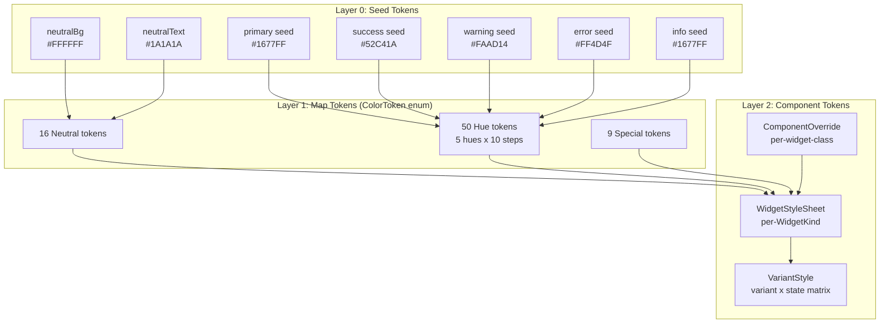
```mermaid
graph TD
    subgraph "Layer 0: Seed Tokens"
        S1[primary seed<br/>#1677FF]
        S2[success seed<br/>#52C41A]
        S3[warning seed<br/>#FAAD14]
        S4[error seed<br/>#FF4D4F]
        S5[info seed<br/>#1677FF]
        S6[neutralBg<br/>#FFFFFF]
        S7[neutralText<br/>#1A1A1A]
    end

    subgraph "Layer 1: Map Tokens (ColorToken enum)"
        N[16 Neutral tokens]
        H[50 Hue tokens<br/>5 hues x 10 steps]
        SP[9 Special tokens]
    end

    subgraph "Layer 2: Component Tokens"
        WS[WidgetStyleSheet<br/>per-WidgetKind]
        CO[ComponentOverride<br/>per-widget-class]
        VS[VariantStyle<br/>variant x state matrix]
    end

    S1 --> H
    S2 --> H
    S3 --> H
    S4 --> H
    S5 --> H
    S6 --> N
    S7 --> N

    N --> WS
    H --> WS
    SP --> WS
    WS --> VS
    CO --> WS
```

#### 1.4.1 Token Architecture Depth (Industry Comparison)

Matcha achieves 7 levels of token depth. Most web design systems stop at 4-5.

| Depth | Matcha | Material 3 | Ant Design v5 | Description |
|-------|--------|-----------|---------------|-------------|
| **Primitive** | JSON hex values | XML color resources | Less variables | Raw values |
| **Semantic** | `ColorToken` enum | `ColorScheme` roles | `token` functions | Named intent |
| **Component** | `WidgetStyleSheet` per `WidgetKind` | `ColorScheme` + Compose modifier | Component-level CSS vars | Per-widget defaults |
| **Variant** | `VariantStyle` array | Compose variant parameter | Component `type` prop | Visual variant |
| **State** | `StateStyle` per `InteractionState` | `Interaction.Indication` | CSS pseudo-classes | Interaction feedback |
| **Override** | `ComponentOverride` | `MaterialTheme` composition | `ConfigProvider` | Plugin/app customization |
| **Dynamic** | `RegisterDynamicTokens()` | N/A | N/A | Runtime extension |

**Design rule.** All visual properties are expressed as semantic design tokens, not raw values. This enables theme switching, density scaling, and accessibility overrides without widget code changes. Every widget must use `IThemeService::Resolve()` instead of hard-coded colors/sizes.

### 1.5 Architecture Layer Diagram

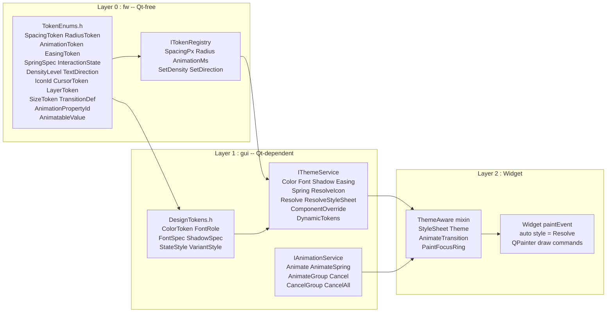
```mermaid
graph LR
    subgraph L0["Layer 0 : fw -- Qt-free"]
        TE["TokenEnums.h\nSpacingToken RadiusToken\nAnimationToken EasingToken\nSpringSpec InteractionState\nDensityLevel TextDirection\nIconId CursorToken LayerToken\nSizeToken TransitionDef\nAnimationPropertyId\nAnimatableValue"]
        ITR["ITokenRegistry\nSpacingPx Radius AnimationMs\nSetDensity SetDirection"]
    end

    subgraph L1["Layer 1 : gui -- Qt-dependent"]
        DT["DesignTokens.h\nColorToken FontRole\nFontSpec ShadowSpec\nStateStyle VariantStyle"]
        ITS["IThemeService\nColor Font Shadow Easing\nSpring ResolveIcon\nResolve ResolveStyleSheet\nComponentOverride\nDynamicTokens"]
        IAS["IAnimationService\nAnimate AnimateSpring\nAnimateGroup Cancel\nCancelGroup CancelAll"]
    end

    subgraph L2["Layer 2 : Widget"]
        TA["ThemeAware mixin\nStyleSheet Theme\nAnimateTransition\nPaintFocusRing"]
        W["Widget paintEvent\nauto style = Resolve\nQPainter draw commands"]
    end

    TE --> ITR
    TE --> DT
    ITR --> ITS
    DT --> ITS
    ITS --> TA
    IAS --> TA
    TA --> W
```

### 1.6 Terminology Glossary

| Term | Definition |
|------|-----------|
| **Token** | A named, semantic design value (color, spacing, duration, etc.) that abstracts the concrete visual parameter from its usage context |
| **Variant** | A visual sub-type of a widget (e.g., PushButton has Primary, Secondary, Ghost, Danger variants) |
| **State** | An interaction state of a widget (`InteractionState` enum: Normal, Hovered, Pressed, Disabled, Focused, Selected, Error, DragOver) |
| **Density** | A global UI compactness level that scales spacing, radius, shadow, and component sizes |
| **WidgetKind** | An enum identifying each widget type for style sheet resolution (54 entries) |
| **ResolvedStyle** | A fully concrete style snapshot (QColor, QFont, px values) produced by `IThemeService::Resolve()` |
| **ThemeAware** | A mixin class that auto-connects widgets to the theme engine and provides style accessors |
| **WidgetStyleSheet** | Per-widget-kind composite of geometry tokens + variant color maps |
| **ComponentOverride** | Per-widget-class token deviations registered by widget authors or plugins |
| **DynamicToken** | A plugin-registered token (color, font, or spacing) that extends the core vocabulary at runtime |

---

## Chapter 2. Color System

### 2.1 Color Token Vocabulary Overview

75 semantic color tokens organized in four categories:

| Category | Token Count | Naming Pattern |
|----------|:-----------:|---------------|
| Neutral (Surface/Fill/Border/Text) | 16 | Functional role names |
| Semantic Hue (Primary/Success/Warning/Error/Info) | 50 | `{Hue}{Step}` per Ant Design 10-step |
| Special Purpose | 9 | Unique functional names |
| **Total** | **75** | |

### 2.2 Neutral Scale: Surface / Fill / Border / Text

> 16 tokens. Synthesized from Ant Design v5 neutral categories + Radix 12-step semantics.

**Diagram**: Neutral token hierarchy (Mermaid)

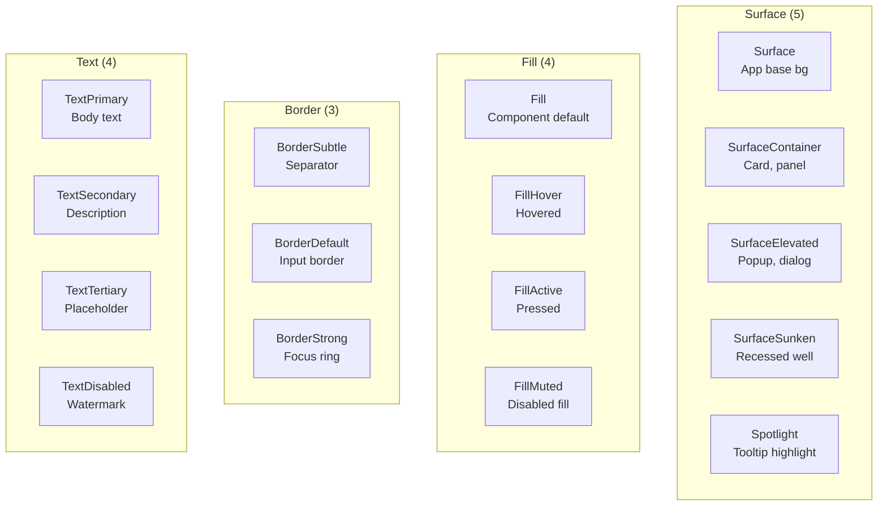
```mermaid
graph TD
    subgraph Surface["Surface (5)"]
        S0[Surface<br/>App base bg]
        S1[SurfaceContainer<br/>Card, panel]
        S2[SurfaceElevated<br/>Popup, dialog]
        S3[SurfaceSunken<br/>Recessed well]
        S4[Spotlight<br/>Tooltip highlight]
    end
    subgraph Fill["Fill (4)"]
        F0[Fill<br/>Component default]
        F1[FillHover<br/>Hovered]
        F2[FillActive<br/>Pressed]
        F3[FillMuted<br/>Disabled fill]
    end
    subgraph Border["Border (3)"]
        B0[BorderSubtle<br/>Separator]
        B1[BorderDefault<br/>Input border]
        B2[BorderStrong<br/>Focus ring]
    end
    subgraph Text["Text (4)"]
        T0[TextPrimary<br/>Body text]
        T1[TextSecondary<br/>Description]
        T2[TextTertiary<br/>Placeholder]
        T3[TextDisabled<br/>Watermark]
    end
```

**Complete Neutral Token Table**:

| Token | Radix Step | Ant Equivalent | Purpose | Light | Dark |
|-------|:----------:|---------------|---------|-------|------|
| `Surface` | 1 | `colorBgBase` | App base background | `#FFFFFF` | `#141414` |
| `SurfaceContainer` | 2 | `colorBgContainer` | Card, panel, sidebar | `#F7F8FA` | `#1F1F1F` |
| `SurfaceElevated` | 3 | `colorBgElevated` | Popup, dropdown, dialog | `#FFFFFF` | `#2A2A2A` |
| `SurfaceSunken` | -- | `colorBgLayout` | Recessed well, status bar | `#F3F3F5` | `#0F0F0F` |
| `Spotlight` | -- | `colorBgSpotlight` | Tooltip, floating highlight | `#FFFFFF` | `#3A3A3A` |
| `Fill` | 3 | `colorFill` | Interactive component default bg | `#F0F0F0` | `#353535` |
| `FillHover` | 4 | `colorFillSecondary` | Component hovered bg | `#E8E8E8` | `#424242` |
| `FillActive` | 5 | `colorFillTertiary` | Component pressed/active bg | `#E0E0E0` | `#4A4A4A` |
| `FillMuted` | -- | `colorFillQuaternary` | Subtle/disabled fill | `#F5F5F5` | `#2A2A2A` |
| `BorderSubtle` | 6 | `colorBorderSecondary` | Separator, container edge | `#E5E5E5` | `#3A3A3A` |
| `BorderDefault` | 7 | `colorBorder` | Input/button resting border | `#D9D9D9` | `#4A4A4A` |
| `BorderStrong` | 8 | -- | Hovered border, focus ring | `#B0B0B0` | `#606060` |
| `TextPrimary` | 12 | `colorText` | High-contrast body text | `#1A1A1A` | `#E8E8E8` |
| `TextSecondary` | 11 | `colorTextSecondary` | Description, secondary info | `#666666` | `#A0A0A0` |
| `TextTertiary` | -- | `colorTextTertiary` | Placeholder, hint text | `#999999` | `#707070` |
| `TextDisabled` | -- | `colorTextQuaternary` | Disabled text, watermark | `#CCCCCC` | `#505050` |

### 2.3 Semantic Hue Scales

> 5 hues x 10 steps = 50 tokens.

Each hue follows the **Ant Design 10-step model**:

| Step | Suffix | Semantic Role | Example Widget Use |
|:----:|--------|--------------|-------------------|
| 1 | `{Hue}Bg` | Lightest background | Alert info bg, Tag subtle bg |
| 2 | `{Hue}BgHover` | Background hover | Alert hover, Tag hover |
| 3 | `{Hue}Border` | Colored border | Input focus border, Badge outline |
| 4 | `{Hue}BorderHover` | Border hover | Input hovered + focused |
| 5 | `{Hue}Hover` | Component hover | PushButton(Primary) hover |
| 6 | `{Hue}` | Base / seed color | PushButton(Primary) default |
| 7 | `{Hue}Active` | Component pressed/active | PushButton(Primary) pressed |
| 8 | `{Hue}TextHover` | Text hover on neutral bg | Link hover, breadcrumb hover |
| 9 | `{Hue}Text` | Text on neutral background | Link default, error message text |
| 10 | `{Hue}TextActive` | Text pressed on neutral bg | Link active/visited |

**Hue definitions**:

| Hue | Default Seed | Purpose |
|-----|:------------|---------|
| Primary | `#1677FF` | Brand / accent. Interactive element default |
| Success | `#52C41A` | Positive outcome, completion, valid state |
| Warning | `#FAAD14` | Caution, degraded state, requires attention |
| Error | `#FF4D4F` | Failure, invalid input, destructive action |
| Info | `#1677FF` | Informational, independent from brand Primary |

> **Info hue** is independent from Primary (industry standard: Carbon, Ant, Fluent).
> If the brand primary changes to red/purple, Info must remain blue to avoid
> semantic collision with Error.

### 2.4 Special Purpose Tokens

| Token | Count | Purpose | Industry Reference |
|-------|:-----:|---------|-------------------|
| `OnAccent` | 1 | Text/icon on solid accent bg (white in light theme) | M3 `onPrimary` |
| `OnAccentSecondary` | 1 | Secondary text on solid accent bg | M3 `onPrimaryContainer` |
| `Focus` | 1 | Focus ring color | Carbon `focus` |
| `Selection` | 1 | Selection highlight (text, table row) | VS Code `selection.background` |
| `Link` | 1 | Hyperlink default color | Carbon `link-primary` |
| `Scrim` | 1 | Modal backdrop dim (dialog, drawer overlay) | M3 `scrim` |
| `Overlay` | 1 | Non-modal overlay bg (popover, dropdown backdrop) | -- |
| `Shadow` | 1 | Box-shadow base color | Fluent `colorNeutralShadow*` |
| `Separator` | 1 | Horizontal/vertical rule | Carbon `border-subtle` |

### 2.5 Tonal Palette Generation Algorithm

**Input**: Seed color (sRGB), ThemeMode (Light/Dark)
**Output**: 10-step tonal ramp as `std::array<QColor, 10>`

**Algorithm** (OKLCH color space):

1. Convert seed sRGB to OKLCH (Lightness, Chroma, Hue)
2. For each step i in [1..10]:
   - Light theme: L from 0.96 (step 1) to 0.30 (step 10)
   - Dark theme: L from 0.20 (step 1) to 0.90 (step 10)
3. Maintain constant chroma and hue from seed
4. Clamp to sRGB gamut (reduce chroma if necessary)
5. Convert back to QColor

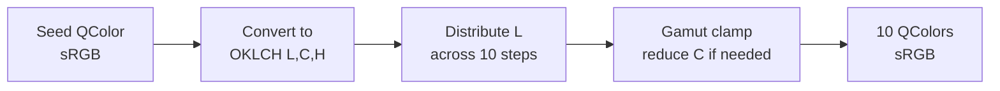
```mermaid
flowchart LR
    Seed[Seed QColor<br/>sRGB] --> OKLCH[Convert to<br/>OKLCH L,C,H]
    OKLCH --> Distribute[Distribute L<br/>across 10 steps]
    Distribute --> Gamut[Gamut clamp<br/>reduce C if needed]
    Gamut --> Output[10 QColors<br/>sRGB]
```

**API**: `TonalPaletteGenerator::GenerateLight(seed)` / `GenerateDark(seed)`

**Color space**: OKLCH (perceptually uniform). Reference: Bjorn Ottosson,
<https://bottosson.github.io/posts/oklab/>

OKLCH provides perceptual uniformity: equal lightness steps produce equal perceived brightness changes. HSL suffers from the Helmholtz-Kohlrausch effect. The implementation requires sRGB <-> OKLCH conversion functions and gamut clamping for high-chroma seeds.

### 2.6 Color Seeds & JSON Configuration

Theme JSON files support a `"colorSeeds"` object for algorithmic palette generation:

```json
{
  "colorSeeds": {
    "primary": "#1677FF",
    "success": "#52C41A",
    "warning": "#FAAD14",
    "error":   "#FF4D4F",
    "info":    "#1677FF"
  }
}
```

When a seed is provided, the 10-step palette for that hue is generated algorithmically.
Individual step colors can still be overridden by explicit hex values in the JSON.

### 2.7 Disabled State: Alpha Overlay Orthogonality

Disabled state is **orthogonal** to color semantics. Instead of per-variant disabled
tokens, a uniform alpha overlay is applied:

```
displayColor = baseTokenColor * kDisabledOpacity
```

where `kDisabledOpacity = 0.45F` (45% opacity).

This prevents combinatorial explosion of `{variant} x {hue} x {state}` tokens.
The framework applies this automatically when `InteractionState::Disabled` is active.

### 2.8 Contrast Checker & WCAG Compliance

**Class**: `ContrastChecker` (static utility)

| Method | Input | Output | Description |
|--------|-------|--------|-------------|
| `RelativeLuminance(color)` | `QColor` | `double [0,1]` | WCAG 2.1 relative luminance |
| `Ratio(fg, bg)` | `QColor, QColor` | `double [1,21]` | Contrast ratio |
| `MeetsAA(fg, bg)` | `QColor, QColor` | `bool` | >= 4.5:1 for normal text |
| `MeetsAAA(fg, bg)` | `QColor, QColor` | `bool` | >= 7:1 for normal text |
| `MeetsAALargeText(fg, bg)` | `QColor, QColor` | `bool` | >= 3:1 for large text |
| `SuggestFix(fg, bg, ratio)` | `QColor, QColor, double` | `QColor` | Adjusted fg meeting target ratio |

**Formula**:

$$L = 0.2126 \, R_{\text{lin}} + 0.7152 \, G_{\text{lin}} + 0.0722 \, B_{\text{lin}}$$

where

$$R_{\text{lin}} = \begin{cases} \dfrac{R/255}{12.92} & \text{if } R/255 \le 0.04045 \\[6pt] \left(\dfrac{R/255 + 0.055}{1.055}\right)^{2.4} & \text{otherwise} \end{cases}$$

---

## Chapter 3. Typography System

### 3.1 FontRole Enum

| Role | Default Size | Default Weight | Line Height | Letter Spacing | Use Case |
|------|:----------:|:-----------:|:----------:|:-------------:|----------|
| `Body` | 9pt | Normal (400) | 1.4x | 0px | Default widget text |
| `BodyMedium` | 9pt | Medium (500) | 1.4x | 0px | NyanLabel NameState |
| `BodyBold` | 9pt | Medium+Bold (600) | 1.4x | 0px | NyanLabel TitleState |
| `Caption` | 8pt | Normal (400) | 1.4x | 0px | ToolButton text, ActionBar tabs |
| `Heading` | 12pt | DemiBold (600) | 1.4x | 0px | Dialog titles, section headers |
| `Monospace` | 9pt | Normal (400) | 1.4x | 0px | Code display, LineEdit numeric |
| `ToolTip` | 8pt | Normal (400) | 1.4x | 0px | Tooltip overlays |

### 3.2 FontSpec Struct

```cpp
struct FontSpec {
    QString family;                     // Platform-resolved font family
    int     sizeInPt      = 9;          // DPI-independent point size
    int     weight        = 400;        // QFont::Weight (Normal=400, Bold=700)
    bool    italic        = false;      // Italic style flag
    qreal   lineHeightMultiplier = 1.4; // Line height = fontSize * multiplier
    qreal   letterSpacing = 0.0;        // Extra letter spacing in px
};
```

### 3.3 Platform Font Selection

| Platform | Primary Family | Monospace Family | Selection Method |
|----------|---------------|-----------------|-----------------|
| Windows | Segoe UI | Cascadia Mono / Consolas | `QFontDatabase::systemFont(GeneralFont)` |
| macOS | SF Pro | SF Mono / Menlo | `QFontDatabase::systemFont(GeneralFont)` |
| Linux | Noto Sans | Noto Sans Mono / DejaVu Sans Mono | `QFontDatabase::systemFont(GeneralFont)` |

### 3.4 Font Scale System

**Global font scale** multiplies all FontRole base sizes:

| Preset | Factor | Use Case |
|--------|:------:|----------|
| `FontSizePreset::Small` | 0.875x | Compact text for dense UIs |
| `FontSizePreset::Medium` | 1.0x | Default |
| `FontSizePreset::Large` | 1.25x | Accessibility / large displays |

**Custom factor**: `SetFontScale(float)` clamped to `[kFontScaleMin=0.5, kFontScaleMax=3.0]`.

**Effective size**: $\text{actualPt} = \text{basePt} \times \text{fontScaleFactor} \times \text{densityScale}$

### 3.5 JSON Font Override

Per-FontRole customization via the `"fonts"` JSON object:

```json
{
  "fonts": {
    "Heading": { "size": 14, "weight": 700 },
    "Body":    { "size": 10 }
  }
}
```

**Fields**: `size` (int, point size) and `weight` (int, QFont weight).
Unspecified fields retain platform defaults.

### 3.6 Dynamic Font Registration (Plugin)

Plugins register domain-specific fonts:

```cpp
DynamicFontDef defs[] = {
    { "CAD/PropertyGrid", FontSpec{ "Consolas", 8, 400 } },
};
theme.RegisterDynamicFonts(defs);

// Query
auto font = theme.DynamicFont("CAD/PropertyGrid"); // -> std::optional<FontSpec>
```

The global `_fontScale` is applied to dynamic font queries.

### 3.7 Complete FontRole Resolution Table

Actual font parameters after platform detection and default scale (1.0x).

#### 3.7.1 Windows (Segoe UI)

| Role | Family | Size (pt) | Weight | Italic | Line Height |
|------|--------|:---------:|:------:|:------:|:-----------:|
| `Body` | Segoe UI | 9 | 400 | No | 1.4x |
| `BodyMedium` | Segoe UI | 9 | 500 | No | 1.4x |
| `BodyBold` | Segoe UI | 9 | 600 | No | 1.4x |
| `Caption` | Segoe UI | 8 | 400 | No | 1.4x |
| `Heading` | Segoe UI | 12 | 600 | No | 1.4x |
| `Monospace` | Cascadia Code | 9 | 400 | No | 1.4x |
| `ToolTip` | Segoe UI | 8 | 400 | No | 1.4x |

#### 3.7.2 macOS (SF Pro Text)

| Role | Family | Size (pt) | Weight | Italic | Line Height |
|------|--------|:---------:|:------:|:------:|:-----------:|
| `Body` | SF Pro Text | 9 | 400 | No | 1.4x |
| `BodyMedium` | SF Pro Text | 9 | 500 | No | 1.4x |
| `BodyBold` | SF Pro Text | 9 | 600 | No | 1.4x |
| `Caption` | SF Pro Text | 8 | 400 | No | 1.4x |
| `Heading` | SF Pro Text | 12 | 600 | No | 1.4x |
| `Monospace` | SF Mono | 9 | 400 | No | 1.4x |
| `ToolTip` | SF Pro Text | 8 | 400 | No | 1.4x |

#### 3.7.3 Linux (Noto Sans)

| Role | Family | Size (pt) | Weight | Italic | Line Height |
|------|--------|:---------:|:------:|:------:|:-----------:|
| `Body` | Noto Sans | 9 | 400 | No | 1.4x |
| `BodyMedium` | Noto Sans | 9 | 500 | No | 1.4x |
| `BodyBold` | Noto Sans | 9 | 600 | No | 1.4x |
| `Caption` | Noto Sans | 8 | 400 | No | 1.4x |
| `Heading` | Noto Sans | 12 | 600 | No | 1.4x |
| `Monospace` | Noto Sans Mono | 9 | 400 | No | 1.4x |
| `ToolTip` | Noto Sans | 8 | 400 | No | 1.4x |

#### 3.7.4 Font Scale Effect

With font scale $s$, actual point size $= \max(\lfloor \text{basePt} \cdot s + 0.5 \rfloor,\; 6)$.

| Scale | Body | Caption | Heading | Monospace |
|:-----:|:----:|:-------:|:-------:|:---------:|
| 0.5x | 6pt (clamped) | 6pt | 6pt | 6pt |
| 0.875x (Small) | 8pt | 7pt | 11pt | 8pt |
| 1.0x (Medium) | 9pt | 8pt | 12pt | 9pt |
| 1.25x (Large) | 11pt | 10pt | 15pt | 11pt |
| 2.0x | 18pt | 16pt | 24pt | 18pt |
| 3.0x | 27pt | 24pt | 36pt | 27pt |

---

## Chapter 4. Spatial System

### 4.1 Spacing Tokens

| Token | Base px | Typical Use |
|-------|:-------:|------------|
| `None` | 0 | No spacing |
| `Px1` | 1 | Border width, single-pixel adjustments |
| `Px2` | 2 | Menu panel padding, icon-text gap |
| `Px3` | 3 | Corner radius, separator height |
| `Px4` | 4 | Standard padding, icon offset |
| `Px5` | 5 | NyanLine thickness |
| `Px6` | 6 | ComboBox container margin |
| `Px7` | 7 | ProgressBar groove height |
| `Px8` | 8 | Window shadow margin, row padding |
| `Px12` | 12 | Compact section gap, dialog inner padding |
| `Px16` | 16 | Icon standard size, section gaps |
| `Px20` | 20 | Submenu arrow margin |
| `Px24` | 24 | Drawer side strip, title row height |
| `Px32` | 32 | Button width, tab close reserve |
| `Px48` | 48 | Large section gap, dialog outer padding |
| `Px64` | 64 | Page-level section spacing |

**Design principle**: 4px base grid. All values are multiples of 4 or common
sub-multiples (1, 2, 3) for fine-grained adjustments.

**Actual pixel output**: $\lfloor \text{basePx} \times \text{densityScale} + 0.5 \rfloor$.

### 4.2 Density System

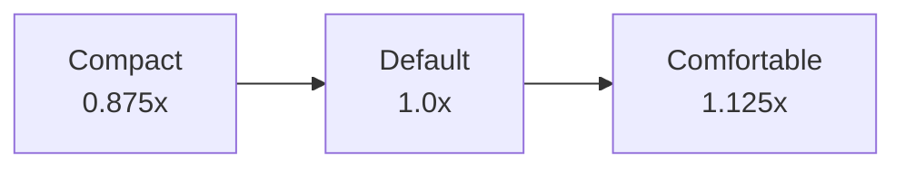
```mermaid
graph LR
    C[Compact<br/>0.875x] --> D[Default<br/>1.0x] --> CF[Comfortable<br/>1.125x]
```

| Level | Scale Factor | Target User |
|-------|:----------:|------------|
| `Compact` | 0.875 | Power users, small screens |
| `Default` | 1.000 | Standard |
| `Comfortable` | 1.125 | Touch devices, accessibility |

**Affected tokens**: All `SpacingPx()`, `Radius()`, `SizeToken`, shadow offsetY/blurRadius.

**API**: `SetDensity(DensityLevel)` -> rebuilds QSS + emits `ThemeChanged`.

### 4.3 Radius Tokens

| Token | Base px | Use Case |
|-------|:-------:|----------|
| `None` | 0 | No rounding (sharp corners) |
| `Small` | 2 | Subtle rounding (tag, badge) |
| `Default` | 3 | Standard component rounding |
| `Medium` | 4 | Card, panel |
| `Large` | 8 | Dialog, popover |
| `Round` | 255 | Pill shape (caller uses `min(w,h)/2`) |

Density-scaled in `Resolve()`: $\text{radiusPx} = \text{Radius}(\text{token}) \times \text{densityScale}$.

### 4.4 Size Tokens

| Token | Base px | Component Mapping |
|-------|:-------:|------------------|
| `Xs` | 20 | Badge, indicator, small icon button |
| `Sm` | 24 | Compact button, tag, checkbox indicator |
| `Md` | 32 | Standard button, input (DEFAULT) |
| `Lg` | 40 | Prominent button, header input |
| `Xl` | 48 | Hero button, touch target |

Density-scaled: $\text{actualPx} = \text{kBaseSizePx}[\text{token}] \times \text{densityScale}$.

### 4.5 Elevation & Shadow System

| Level | offsetY | blurRadius | opacity | Use Case |
|-------|:-------:|:---------:|:-------:|----------|
| `Flat` | 0 | 0 | 0.0 | Default (no shadow) |
| `Low` | 1 | 3 | 0.08 | Card, subtle lift |
| `Medium` | 2 | 6 | 0.12 | Dropdown, popover |
| `High` | 4 | 12 | 0.16 | Dialog, modal |
| `Window` | 8 | 24 | 0.20 | Floating window |

**ShadowSpec struct**: `{ offsetX, offsetY, blurRadius, opacity }`.

Shadow `offsetY` and `blurRadius` are density-scaled in `Resolve()`.

### 4.6 Layer (Z-index) Tokens

| Token | Z-index | Use Case |
|-------|:-------:|----------|
| `Base` | 0 | Normal content |
| `Elevated` | 100 | Cards, panels |
| `Sticky` | 200 | Sticky headers |
| `Dropdown` | 300 | Dropdown menus |
| `Modal` | 400 | Modal dialogs |
| `Popover` | 500 | Popovers, tooltips |
| `Notification` | 600 | Toast / snackbar |
| `Overlay` | 700 | Full-screen overlays |
| `Maximum` | 9999 | Debug overlays |

### 4.7 Density Scaling Effect Tables

Shows actual pixel values for key tokens at each density level.

#### 4.7.1 Spacing Token Scaling

| Token | Base | Compact (0.875x) | Default (1.0x) | Comfortable (1.125x) |
|-------|:----:|:-----------------:|:--------------:|:--------------------:|
| `Px1` | 1 | 1 | 1 | 1 |
| `Px2` | 2 | 2 | 2 | 2 |
| `Px4` | 4 | 4 | 4 | 5 |
| `Px8` | 8 | 7 | 8 | 9 |
| `Px12` | 12 | 11 | 12 | 14 |
| `Px16` | 16 | 14 | 16 | 18 |
| `Px24` | 24 | 21 | 24 | 27 |
| `Px32` | 32 | 28 | 32 | 36 |
| `Px48` | 48 | 42 | 48 | 54 |
| `Px64` | 64 | 56 | 64 | 72 |

#### 4.7.2 Size Token Scaling

| Token | Base | Compact | Default | Comfortable |
|-------|:----:|:-------:|:-------:|:-----------:|
| `Xs` | 20 | 18 | 20 | 23 |
| `Sm` | 24 | 21 | 24 | 27 |
| `Md` | 32 | 28 | 32 | 36 |
| `Lg` | 40 | 35 | 40 | 45 |
| `Xl` | 48 | 42 | 48 | 54 |

#### 4.7.3 Radius Token Scaling

| Token | Base | Compact | Default | Comfortable |
|-------|:----:|:-------:|:-------:|:-----------:|
| `None` | 0 | 0 | 0 | 0 |
| `Small` | 2 | 2 | 2 | 2 |
| `Default` | 3 | 3 | 3 | 3 |
| `Medium` | 4 | 4 | 4 | 5 |
| `Large` | 8 | 7 | 8 | 9 |
| `Round` | 255 | 255 | 255 | 255 |

#### 4.7.4 Shadow Scaling (ElevationToken)

| Level | Base offsetY | Compact | Default | Comfortable |
|-------|:-----------:|:-------:|:-------:|:-----------:|
| `Flat` | 0 | 0 | 0 | 0 |
| `Low` | 1 | 1 | 1 | 1 |
| `Medium` | 2 | 2 | 2 | 2 |
| `High` | 4 | 4 | 4 | 5 |
| `Window` | 8 | 7 | 8 | 9 |

| Level | Base blur | Compact | Default | Comfortable |
|-------|:---------:|:-------:|:-------:|:-----------:|
| `Flat` | 0 | 0 | 0 | 0 |
| `Low` | 3 | 3 | 3 | 3 |
| `Medium` | 6 | 5 | 6 | 7 |
| `High` | 12 | 11 | 12 | 14 |
| `Window` | 24 | 21 | 24 | 27 |

---

## Chapter 5. Motion System

### 5.1 Animation Duration Tokens

| Token | Duration | Perception Threshold | Use Case |
|-------|:--------:|---------------------|----------|
| `Instant` | 0ms | -- | No animation / test mode |
| `Quick` | 160ms | Causality (~100ms) | Micro-interactions (hover, focus) |
| `Normal` | 200ms | Attention window (~200ms) | Standard state transitions |
| `Slow` | 350ms | Deliberate transition | Page transitions, expand/collapse |

### 5.2 Easing Curve Tokens

| Token | Curve | Use Case |
|-------|-------|----------|
| `Linear` | Linear interpolation | Progress bars, deterministic animations |
| `OutCubic` | Decelerate (cubic) | Default for most transitions (exit fast) |
| `InOutCubic` | Accelerate then decelerate | Page transitions, modal entry |
| `Spring` | Spring dynamics (see 5.3) | Natural, physics-based motion |

**Mathematical definitions**:

- **Linear**: $f(t) = t$
- **OutCubic**: $f(t) = 1 - (1 - t)^3$. Properties: $f(0)=0$, $f(1)=1$, $f'(0)=3$, $f'(1)=0$ (zero terminal velocity). Perceived as "fast start, slow finish" -- ideal for elements entering the viewport.
- **InOutCubic**: $f(t) = 4t^3$ for $t < 0.5$; $f(t) = 1 - (-2t + 2)^3 / 2$ for $t \ge 0.5$. Properties: $f(0)=0$, $f(1)=1$, $f'(0)=0$, $f'(1)=0$ (zero velocity at both ends). Perceived as "ease in, ease out" -- ideal for page transitions.
- **Spring**: Not a parametric curve. Solved via semi-implicit Euler integration (see 5.3).

### 5.3 Spring Dynamics

**Model**: Damped harmonic oscillator

$$m \, x''(t) + c \, x'(t) + k \bigl(x(t) - x_{\text{target}}\bigr) = 0$$

where $m$ = mass, $c$ = damping, $k$ = stiffness.

**SpringSpec struct**: `{ mass=1.0, stiffness=200.0, damping=20.0 }`

**JSON configuration**:

```json
{
  "spring": {
    "mass": 1.0,
    "stiffness": 180.0,
    "damping": 18.0
  }
}
```

**Integration**: Semi-implicit Euler (SIE). Runs until convergence
(velocity < threshold AND displacement < threshold).

**API**: `IThemeService::Spring()` returns the global default `SpringSpec`.
`IAnimationService::AnimateSpring()` accepts per-call override.

### 5.4 TransitionDef

Per-widget animation configuration stored in `WidgetStyleSheet::transition`:

```cpp
struct TransitionDef {
    AnimationToken duration = AnimationToken::Normal;  // 200ms
    EasingToken    easing   = EasingToken::OutCubic;   // Decelerate
};
```

### 5.5 Reduced Motion (WCAG 2.1 SC 2.3.3)

`SetReducedMotion(true)` -> all `Animate()` calls snap to target value immediately.
`AnimationStarted` and `AnimationCompleted` notifications are still dispatched
(so trigger-verification tests work).

### 5.6 Speed Multiplier

`SetSpeedMultiplier(float)`: 1.0 = normal, 0.5 = half speed, 2.0 = double.
Affects all animation durations globally.

---
---

# Part II -- Theme Engine

> Chapters 6-8. The runtime infrastructure that resolves tokens to concrete values.

## Chapter 6. IThemeService Interface

### 6.1 Interface Overview & Inheritance

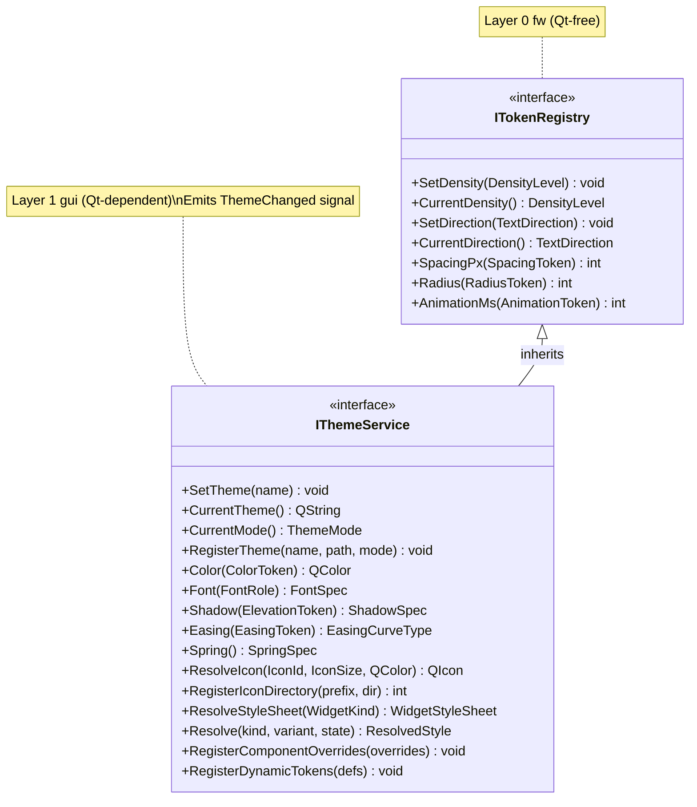
```mermaid
classDiagram
    class ITokenRegistry {
        <<interface>>
        +SetDensity(DensityLevel) void
        +CurrentDensity() DensityLevel
        +SetDirection(TextDirection) void
        +CurrentDirection() TextDirection
        +SpacingPx(SpacingToken) int
        +Radius(RadiusToken) int
        +AnimationMs(AnimationToken) int
    }

    class IThemeService {
        <<interface>>
        +SetTheme(name) void
        +CurrentTheme() QString
        +CurrentMode() ThemeMode
        +RegisterTheme(name, path, mode) void
        +Color(ColorToken) QColor
        +Font(FontRole) FontSpec
        +Shadow(ElevationToken) ShadowSpec
        +Easing(EasingToken) EasingCurveType
        +Spring() SpringSpec
        +ResolveIcon(IconId, IconSize, QColor) QIcon
        +RegisterIconDirectory(prefix, dir) int
        +ResolveStyleSheet(WidgetKind) WidgetStyleSheet
        +Resolve(kind, variant, state) ResolvedStyle
        +RegisterComponentOverrides(overrides) void
        +RegisterDynamicTokens(defs) void
    }

    ITokenRegistry <|-- IThemeService : inherits

    note for ITokenRegistry "Layer 0 fw (Qt-free)"
    note for IThemeService "Layer 1 gui (Qt-dependent)\nEmits ThemeChanged signal"
```

**Thread safety**: `IThemeService` is main-thread-only. All query methods are
`const` and safe for concurrent reads from the paint thread, but mutation
methods (`SetTheme`, `SetDensity`, etc.) must be called from the main thread.

### 6.2 Theme Lifecycle API

| Method | Signature | Description |
|--------|-----------|-------------|
| `SetTheme` | `void SetTheme(const QString& name)` | Load and activate a theme by name. Emits `ThemeChanged`. |
| `CurrentTheme` | `QString CurrentTheme() const` | Returns the name of the active theme. |
| `CurrentMode` | `ThemeMode CurrentMode() const` | Returns `Light` or `Dark` classification of the active theme. |
| `RegisterTheme` | `void RegisterTheme(const QString& name, const QString& jsonPath, ThemeMode mode)` | Register a custom theme. No slot limit. |

**Built-in theme constants**: `kThemeLight`, `kThemeDark`, `kThemeHighContrast`.

**ThemeMode enum**: `enum class ThemeMode : uint8_t { Light, Dark }`.

### 6.3 Token Query API

All query methods are O(1) flat-array lookups.

| Method | Input | Output | Notes |
|--------|-------|--------|-------|
| `Color(token)` | `ColorToken` | `QColor` | Indexed by `std::to_underlying(token)` |
| `Font(role)` | `FontRole` | `const FontSpec&` | Cached, font-scale applied |
| `Shadow(level)` | `ElevationToken` | `ShadowSpec` | Density-scaled |
| `Easing(token)` | `EasingToken` | `QEasingCurve::Type` | Maps to Qt enum |
| `Spring()` | -- | `SpringSpec` | Theme-configured spring parameters |
| `SpacingPx(token)` | `SpacingToken` | `int` | Density-scaled (inherited from ITokenRegistry) |
| `Radius(token)` | `RadiusToken` | `int` | Density-scaled (inherited from ITokenRegistry) |
| `AnimationMs(token)` | `AnimationToken` | `int` | Duration in milliseconds |

### 6.4 Icon Resolution API

| Method | Signature | Description |
|--------|-----------|-------------|
| `ResolveIcon` | `QIcon ResolveIcon(const IconId& uri, IconSize size, QColor tint) const` | Load SVG, colorize, cache. DPI-aware. |
| `RegisterIconDirectory` | `int RegisterIconDirectory(std::string_view uriPrefix, const QString& dirPath)` | Scan dir for .svg files, register each as `{prefix}/{filename}`. Returns count. |
| `InvalidateIconCache` | `void InvalidateIconCache()` | Clear cached icons (call after theme change). |

**Icon URI format**: `asset://matcha/icons/{name}` for built-in icons.
Plugins use custom prefixes: `asset://myplugin/icons/{name}`.

**Colorization**: SVG `fill` and `stroke` attributes are replaced with the `tint` color.
This enables single-source SVGs that adapt to any theme.

### 6.5 Declarative Style Resolution API

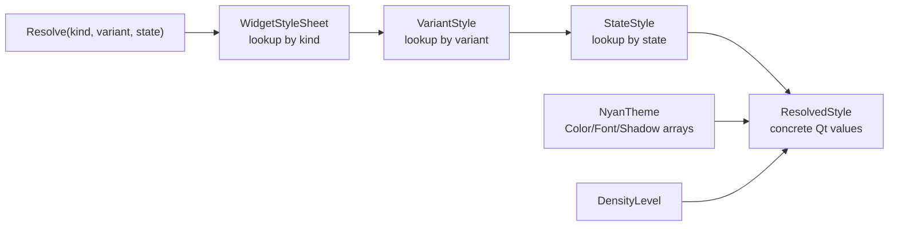
```mermaid
flowchart LR
    Input["Resolve(kind, variant, state)"] --> WSS[WidgetStyleSheet<br/>lookup by kind]
    WSS --> VS[VariantStyle<br/>lookup by variant]
    VS --> SS[StateStyle<br/>lookup by state]
    SS --> RS[ResolvedStyle<br/>concrete Qt values]
    Theme[NyanTheme<br/>Color/Font/Shadow arrays] --> RS
    Density[DensityLevel] --> RS
```

| Method | Input | Output | Description |
|--------|-------|--------|-------------|
| `Resolve` | `WidgetKind, size_t variantIdx, InteractionState` | `ResolvedStyle` | One-call complete style resolution |
| `ResolveStyleSheet` | `WidgetKind` | `const WidgetStyleSheet&` | Per-widget geometry + variant spans |

**ResolvedStyle struct** (all fields are concrete Qt values):

| Field | Type | Source |
|-------|------|--------|
| `background` | `QColor` | `StateStyle::background` -> `Color(token)` |
| `foreground` | `QColor` | `StateStyle::foreground` -> `Color(token)` |
| `border` | `QColor` | `StateStyle::border` -> `Color(token)` |
| `radiusPx` | `int` | `WidgetStyleSheet::radius` -> `Radius(token) * density` |
| `paddingHPx` | `int` | `WidgetStyleSheet::paddingH` -> `SpacingPx(token)` |
| `paddingVPx` | `int` | `WidgetStyleSheet::paddingV` -> `SpacingPx(token)` |
| `gapPx` | `int` | `WidgetStyleSheet::gap` -> `SpacingPx(token)` |
| `minHeightPx` | `int` | `WidgetStyleSheet::minHeight` -> `ToPixels(token) * density` |
| `borderWidthPx` | `int` | `StateStyle::borderWidth` -> `SpacingPx(token)` |
| `font` | `QFont` | `WidgetStyleSheet::font` -> `Font(role)` |
| `shadow` | `ShadowSpec` | `WidgetStyleSheet::elevation` -> `Shadow(token)` |
| `opacity` | `float` | `StateStyle::opacity` (1.0 normal, <1.0 disabled) |
| `durationMs` | `int` | `WidgetStyleSheet::transition.duration` -> `AnimationMs(token)` |
| `easingType` | `int` | `WidgetStyleSheet::transition.easing` -> `Easing(token)` |

### 6.6 Component Override API

```cpp
struct ComponentOverride {
    WidgetKind     kind;
    RadiusToken    radius;        // Override radius for this widget class
    SpacingToken   paddingH;      // Override horizontal padding
    SpacingToken   paddingV;      // Override vertical padding
    FontRole       font;          // Override font role
    ElevationToken elevation;     // Override elevation
};
```

**Registration**: `RegisterComponentOverrides(std::span<const ComponentOverride>)`

**Priority**: ComponentOverride > BuildDefaultVariants() defaults.

### 6.7 Dynamic Token API (Plugin Extension)

| Definition Struct | Fields | Description |
|------------------|--------|-------------|
| `DynamicColorDef` | `name, lightValue, darkValue` | Theme-aware color (different values per mode) |
| `DynamicFontDef` | `name, fontSpec` | Custom font specification |
| `DynamicSpacingDef` | `name, basePx` | Custom spacing value (density-scaled) |

| Method | Description |
|--------|-------------|
| `RegisterDynamicTokens(span<DynamicColorDef>)` | Register plugin colors |
| `RegisterDynamicFonts(span<DynamicFontDef>)` | Register plugin fonts |
| `RegisterDynamicSpacings(span<DynamicSpacingDef>)` | Register plugin spacings |
| `DynamicColor(name) -> optional<QColor>` | Query by string name |
| `DynamicFont(name) -> optional<FontSpec>` | Query by string name |
| `DynamicSpacingPx(name) -> optional<int>` | Query by string name (density-scaled) |
| `UnregisterDynamicTokens(span<string_view>)` | Remove by name |

### 6.8 Font Scale API

| Method | Description |
|--------|-------------|
| `SetFontScale(float)` | Set custom font scale factor [0.5, 3.0] |
| `FontScale() -> float` | Get current font scale |
| `SetFontSizePreset(FontSizePreset)` | Set from preset (Small/Medium/Large) |

### 6.9 Density & Direction API

| Method | Description |
|--------|-------------|
| `SetDensity(DensityLevel)` | Set density (rebuilds QSS, emits ThemeChanged) |
| `CurrentDensity() -> DensityLevel` | Get active density |
| `SetDirection(TextDirection)` | Set LTR/RTL (rebuilds QSS, emits ThemeChanged) |
| `CurrentDirection() -> TextDirection` | Get active direction |

### 6.10 Test Support API

| Method | Description |
|--------|-------------|
| `SetAnimationOverride(int forceMs)` | Force all animations to specified duration. 0 = instant snap. -1 = restore normal. |

### 6.11 ThemeChanged Signal & ThemeAware Mixin

**Signal**: `void ThemeChanged(const QString& newThemeName)`

Emitted by: `SetTheme()`, `SetDensity()`, `SetDirection()`, `SetFontScale()`.

**ThemeAware mixin** (for widgets):

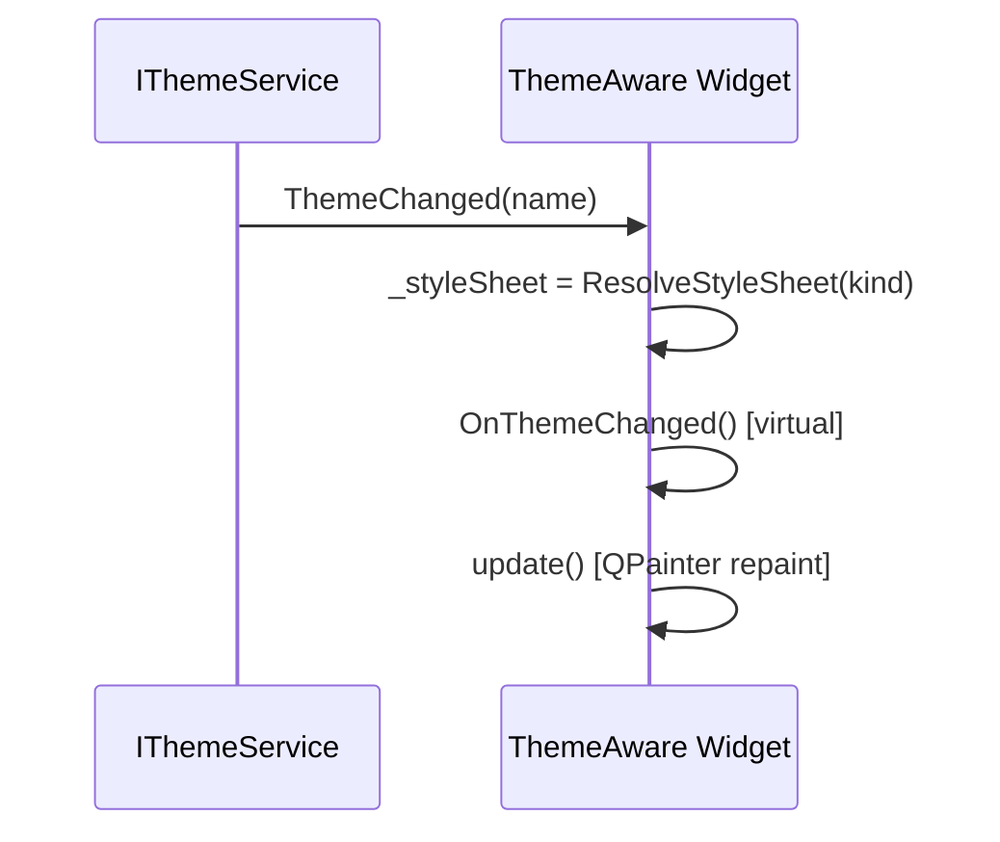
```mermaid
sequenceDiagram
    participant T as IThemeService
    participant W as ThemeAware Widget
    T->>W: ThemeChanged(name)
    W->>W: _styleSheet = ResolveStyleSheet(kind)
    W->>W: OnThemeChanged() [virtual]
    W->>W: update() [QPainter repaint]
```

| ThemeAware Method | Description |
|-------------------|-------------|
| `Theme() -> IThemeService&` | Access the global theme service |
| `StyleSheet() -> const WidgetStyleSheet&` | Cached per-widget style sheet |
| `OnThemeChanged()` | Virtual callback, override to trigger repaint |
| `AnimateTransition(propId, from, to)` | Animate using TransitionDef from StyleSheet |
| `PaintFocusRing(QPainter&, QRect, int radius)` | Draw standard focus indicator |

---

## Chapter 7. JSON Theme Configuration

### 7.1 Theme File Structure

```json
{
  "extends": "Light",
  "colorSeeds": { ... },
  "colors": { ... },
  "fonts": { ... },
  "spring": { ... },
  "fontScale": 1.0
}
```

All keys are optional. Missing keys inherit from `extends` theme or built-in defaults.

### 7.2 Color Overrides

The `"colors"` object maps ColorToken names to hex values:

```json
{
  "colors": {
    "Surface": "#FAFAFA",
    "Primary": "#0052CC",
    "TextPrimary": "#1A1A1A"
  }
}
```

Key names must exactly match the `ColorToken` enum member name (case-sensitive).

### 7.3 Color Seeds

The `"colorSeeds"` object triggers algorithmic palette generation:

```json
{
  "colorSeeds": {
    "primary": "#0052CC"
  }
}
```

When a seed is provided, the TonalPaletteGenerator produces 10 steps for that hue.
Explicit `"colors"` entries for the same hue override individual generated steps.

### 7.4 Font Overrides

```json
{
  "fonts": {
    "Heading": { "size": 14, "weight": 700 },
    "Monospace": { "size": 10 }
  }
}
```

Keys match `FontRole` enum names. Fields: `size` (int pt), `weight` (int).

### 7.5 Spring Configuration

```json
{
  "spring": {
    "mass": 1.0,
    "stiffness": 180.0,
    "damping": 18.0
  }
}
```

### 7.6 Font Scale

```json
{
  "fontScale": 1.25
}
```

Float value, clamped to [0.5, 3.0].

### 7.7 Theme Inheritance

The `"extends"` key references a registered theme by name:

```json
{
  "extends": "Dark",
  "colors": {
    "Primary": "#BB86FC"
  }
}
```

Inheritance is recursive. The resolution chain: this theme -> extends -> extends.extends -> built-in default.

### 7.8 Custom Theme Registration Flow

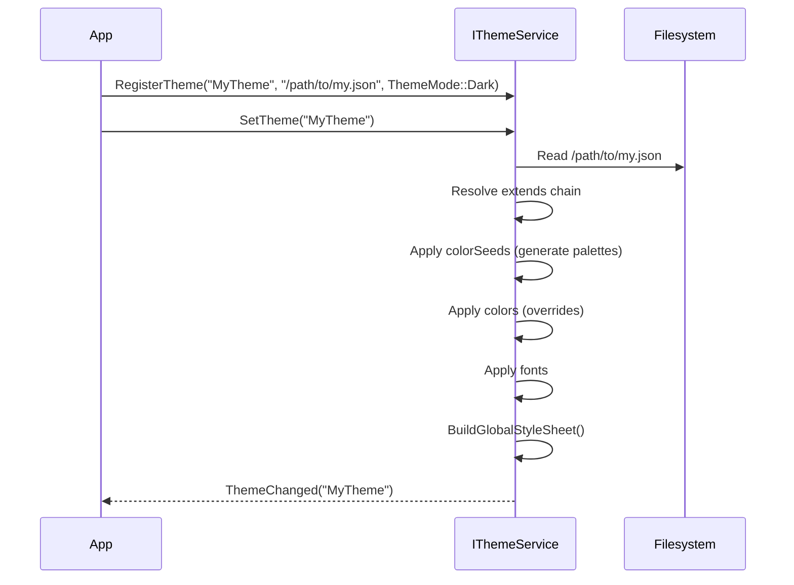
```mermaid
sequenceDiagram
    participant App
    participant ITS as IThemeService
    participant FS as Filesystem

    App->>ITS: RegisterTheme("MyTheme", "/path/to/my.json", ThemeMode::Dark)
    App->>ITS: SetTheme("MyTheme")
    ITS->>FS: Read /path/to/my.json
    ITS->>ITS: Resolve extends chain
    ITS->>ITS: Apply colorSeeds (generate palettes)
    ITS->>ITS: Apply colors (overrides)
    ITS->>ITS: Apply fonts
    ITS->>ITS: BuildGlobalStyleSheet()
    ITS-->>App: ThemeChanged("MyTheme")
```

### 7.9 Validation

**Schema**: `Resources/tokens_schema.json` (JSON Schema draft-07)

**Validator**: `Scripts/validate_tokens.py` (invoked by CMake custom command)

Validates:
- All required color keys present
- Hex color format (`#RRGGBB` or `#RRGGBBAA`)
- No unknown top-level keys
- Font size/weight ranges

### 7.10 Dark Mode Generation Rules

Dark mode is **not** a simple inversion. The palette generation algorithm requires:

1. **HSV/HSB color space operations**: convert seed color to HSV
2. **Bezier curves for lightness interpolation**: different parameters for light vs dark themes
3. **Saturation clamping in dark mode**: cap saturation to avoid visual fatigue under sustained use
4. **Port Ant Design's `generate()` function**: the algorithm produces 10 tonal steps from a seed

**Design decisions**:

| Decision | Resolution | Rationale |
|----------|-----------|-----------|
| `TextDisabled` vs `TextQuaternary` | Keep `TextDisabled` | Convenience token for always-disabled-looking text |
| Info hue independence | Yes, independent from Primary | Info may need distinct hue in domain contexts |
| Palette algorithm | Port Ant Design's `generate()` | Well-tested, industry-proven tonal generation |
| Codegen tool | Python | Cross-platform, easy JSON I/O |
| Merge `BgComponentStrong/Stronger` | Accept merge | Reduces token count without losing expressiveness |

### 7.11 DTFM Integration

The JSON palette format aligns with **W3C Design Tokens Format Module** (DTFM):

- Each token has `$type` and `$value` fields
- `$type` values: `color`, `dimension`, `fontFamily`, `fontWeight`, `duration`, `cubicBezier`
- Theme files can reference other tokens via `{token.path}` syntax
- Build-time codegen (Python) reads DTFM JSON and generates C++ constexpr arrays

---

## Chapter 8. NyanTheme Implementation

### 8.1 Token Storage

All token values are stored in flat `std::array` containers:

| Array | Type | Size | Index |
|-------|------|:----:|-------|
| `_colors` | `QColor` | 75 | `ColorToken` |
| `_fonts` | `FontSpec` | 7 | `FontRole` |
| `_shadows` | `ShadowSpec` | 5 | `ElevationToken` |
| `_easings` | `QEasingCurve::Type` | 4 | `EasingToken` |
| `_styleSheets` | `WidgetStyleSheet` | 54 | `WidgetKind` |

Lookup: `_colors[std::to_underlying(token)]` -- O(1), cache-friendly.

### 8.2 BuildFonts() Platform Logic

1. Query `QFontDatabase::systemFont(QFontDatabase::GeneralFont)` for primary family
2. Query monospace family: try "Cascadia Mono" (Win), "SF Mono" (mac), "Noto Sans Mono" (Linux)
3. Populate `_fonts[role]` with platform family + role-specific size/weight
4. Apply `_fontScale` multiplier

### 8.3 BuildShadows() Algorithm

For each `ElevationToken` level:
- `offsetY = level * 1` (Linear scale)
- `blurRadius = level * 3` (3x multiplier)
- `opacity = level * 0.04` (4% per level)
- Apply density scale to offsetY and blurRadius

### 8.4 BuildDefaultVariants()

Constructs `std::vector<VariantStyle>` for each `WidgetKind`.
Each VariantStyle has 8 `StateStyle` entries (one per `InteractionState`).

Detailed per-widget specifications in Chapter 10.

### 8.5 BuildGlobalStyleSheet()

Generates a global QSS string from design tokens, applied via
`QApplication::setStyleSheet()`. Covers standard Qt widgets:
QPushButton, QLineEdit, QTextEdit, QSpinBox, QComboBox, QScrollBar,
QTabBar, QCheckBox, QRadioButton, QGroupBox, QSlider, QProgressBar,
QToolTip, QMenu, QMenuBar, QHeaderView.

Rebuilt on: `SetTheme()`, `SetDensity()`, `SetDirection()`.

### 8.6 LoadPalette() JSON Parsing Pipeline

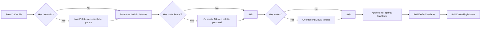
```mermaid
flowchart LR
    A[Read JSON file] --> B{Has 'extends'?}
    B -->|Yes| C[LoadPalette recursively for parent]
    B -->|No| D[Start from built-in defaults]
    C --> D
    D --> E{Has 'colorSeeds'?}
    E -->|Yes| F[Generate 10-step palette per seed]
    E -->|No| G[Skip]
    F --> G
    G --> H{Has 'colors'?}
    H -->|Yes| I[Override individual tokens]
    H -->|No| J[Skip]
    I --> J
    J --> K[Apply fonts, spring, fontScale]
    K --> L[BuildDefaultVariants]
    L --> M[BuildGlobalStyleSheet]
```

### 8.7 TonalPaletteGenerator

**Class**: `TonalPaletteGenerator` (static utility)

| Method | Input | Output |
|--------|-------|--------|
| `GenerateLight(QColor seed)` | Seed color | `std::array<QColor, 10>` light-theme ramp |
| `GenerateDark(QColor seed)` | Seed color | `std::array<QColor, 10>` dark-theme ramp |

**Algorithm**: OKLCH lightness distribution with sRGB gamut clamping.
See Chapter 2.5 for mathematical details.

### 8.8 SetTheme() Execution Order

Complete sequence when `SetTheme(name)` is called:

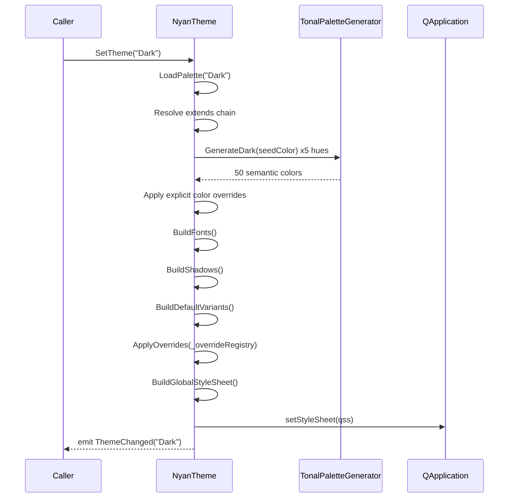
```mermaid
sequenceDiagram
    participant Caller
    participant NT as NyanTheme
    participant TPG as TonalPaletteGenerator
    participant QApp as QApplication

    Caller->>NT: SetTheme("Dark")
    NT->>NT: LoadPalette("Dark")
    NT->>NT: Resolve extends chain
    NT->>TPG: GenerateDark(seedColor) x5 hues
    TPG-->>NT: 50 semantic colors
    NT->>NT: Apply explicit color overrides
    NT->>NT: BuildFonts()
    NT->>NT: BuildShadows()
    NT->>NT: BuildDefaultVariants()
    NT->>NT: ApplyOverrides(_overrideRegistry)
    NT->>NT: BuildGlobalStyleSheet()
    NT->>QApp: setStyleSheet(qss)
    NT-->>Caller: emit ThemeChanged("Dark")
```

### 8.9 NyanTheme Internal Member Layout

| Member | Type | Initialized |
|--------|------|-------------|
| `_colors` | `std::array<QColor, 75>` | `LoadPalette()` |
| `_fonts` | `std::array<FontSpec, 7>` | `BuildFonts()` |
| `_shadows` | `std::array<ShadowSpec, 5>` | `BuildShadows()` |
| `_easings` | `std::array<QEasingCurve::Type, 4>` | Constructor (static) |
| `_styleSheets` | `std::array<WidgetStyleSheet, 54>` | `BuildDefaultVariants()` |
| `_iconRegistry` | `unordered_map<string, QString>` | `RegisterIconDirectory()` |
| `_dynamicColors` | `unordered_map<string, DynamicColorDef>` | `RegisterDynamicTokens()` |
| `_dynamicFonts` | `unordered_map<string, DynamicFontDef>` | `RegisterDynamicFonts()` |
| `_dynamicSpacings` | `unordered_map<string, DynamicSpacingDef>` | `RegisterDynamicSpacings()` |
| `_themeRegistry` | `unordered_map<string, ThemeEntry>` | `RegisterTheme()` |
| `_overrideRegistry` | `vector<ComponentOverride>` | `RegisterComponentOverrides()` |
| `_currentTheme` | `QString` | `SetTheme()` |
| `_currentMode` | `ThemeMode` | `SetTheme()` |
| `_fontScale` | `float` | Constructor (1.0) |
| `_density` | `DensityLevel` | Constructor (Default) |
| `_direction` | `TextDirection` | Constructor (LTR) |
| `_spring` | `SpringSpec` | `LoadPalette()` |
| `_paletteDir` | `QString` | Constructor |

### 8.10 BuildDefaultVariants() Coverage

`BuildDefaultVariants()` must populate all 54 `WidgetKind` entries. The function
internally dispatches to helper functions organized by widget tier:

```cpp
void NyanTheme::BuildDefaultVariants()
{
    BuildCoreInputVariants();       // PushButton, ToolButton, LineEdit, ...
    BuildContainerVariants();       // ScrollArea, Panel, GroupBox, ...
    BuildMenuVariants();            // MenuBar, Menu, MenuItem, ...
    BuildApplicationVariants();     // DocumentBar, ProgressBar, Tooltip, ...
    BuildDialogVariants();          // Dialog, DialogTitleBar, DialogFootBar, ...
    BuildActionBarVariants();       // ActionTab, ActionToolbar
    BuildShellVariants();           // MainTitleBar, StatusBar, DocumentToolBar, ...
}
```

Each helper constructs `VariantStyle` arrays using token references, not raw
color values. Example pattern:

```cpp
void NyanTheme::BuildCoreInputVariants()
{
    auto& sheet = _styleSheets[std::to_underlying(WidgetKind::PushButton)];
    sheet.radius    = RadiusToken::Default;
    sheet.paddingH  = SpacingToken::Px12;
    sheet.paddingV  = SpacingToken::Px6;
    sheet.font      = FontRole::BodyMedium;
    sheet.elevation = ElevationToken::Low;
    sheet.transition = { AnimationToken::Quick, EasingToken::OutCubic };

    // Variant 0: Primary
    sheet.variants[0].colors[Normal]   = { ColorToken::Primary,   ColorToken::OnAccent, ColorToken::Primary };
    sheet.variants[0].colors[Hovered]  = { ColorToken::PrimaryHover, ColorToken::OnAccent, ColorToken::PrimaryHover };
    sheet.variants[0].colors[Pressed]  = { ColorToken::PrimaryActive, ColorToken::OnAccent, ColorToken::PrimaryActive };
    sheet.variants[0].colors[Disabled] = { ColorToken::Primary, ColorToken::OnAccent, ColorToken::Primary, 0.45F };
    // ... (Focused, Selected, Error, DragOver)

    // Variant 1: Secondary
    // ... (similar pattern with neutral tokens)
}
```

### 8.11 BuildGlobalStyleSheet() QSS Generation

The generated QSS string covers ~300 lines of Qt stylesheet rules. Key patterns:

| Qt Widget | QSS Properties Set |
|-----------|-------------------|
| `QPushButton` | `background-color`, `color`, `border`, `border-radius`, `padding`, `font` |
| `QLineEdit` | `background-color`, `color`, `border`, `border-radius`, `padding`, `selection-*` |
| `QComboBox` | `background-color`, `color`, `border`, `padding`, `::drop-down`, `::down-arrow` |
| `QScrollBar` | `background`, `::handle`, `::add-line`, `::sub-line`, `width`/`height` |
| `QTabBar::tab` | `background`, `color`, `border-bottom`, `padding`, `:selected`, `:hover` |
| `QCheckBox::indicator` | `width`, `height`, `border`, `border-radius`, `:checked`, `:indeterminate` |
| `QSlider::groove` | `background`, `height`/`width`, `border-radius` |
| `QSlider::handle` | `background`, `width`, `height`, `border-radius`, `margin` |
| `QProgressBar` | `background`, `color`, `border`, `text-align`, `::chunk` |
| `QToolTip` | `background-color`, `color`, `border`, `padding`, `font` |
| `QMenu` | `background-color`, `color`, `border`, `padding`, `::item`, `::separator` |
| `QMenuBar` | `background-color`, `color`, `::item:selected`, `::item:pressed` |
| `QHeaderView::section` | `background-color`, `color`, `border`, `padding`, `font` |

All color values in the QSS are resolved from `_colors[token]` at generation time.
No token names appear in the generated QSS — only resolved hex values.

### 8.12 Style & Resource Reuse Iron Rules

> **The existing visual identity (color palette, icon assets, ToolBench configs, menu definitions) is a product of UI/UX design work and MUST be preserved verbatim.** Refactoring changes the **code architecture**, not the **art output**.

| Rule | Detail |
|------|--------|
| **R1: No color value changes** | ~85x2 color values in palette are canonical. No hex modification without designer sign-off. |
| **R2: No icon replacement** | All SVG/PNG icons are design deliverables. Missing files get same-size placeholder, never delete `.qrc` entries. |
| **R3: No style default changes** | `NyanAbstractStyle` defaults (Radius=3, Border=Line2, etc.) define the visual language. New `WidgetStyleSheet` must produce identical output. |
| **R4: ToolBench/Menu configs preserved** | `.cfg` and `.json` resource files consumed verbatim. |
| **R5: Theme path convention** | `:/<Theme>/<Theme>/...` pattern. `IThemeService::IconPath()` follows this. |
| **R6: Font baseline** | ToolButton font: 11px logical. No size changes without designer approval. |

### 8.13 Existing Art Asset Inventory

| Asset Category | Count | Format |
|---------------|-------|--------|
| Basic UI icons (16px) | 44 | SVG |
| App-level icons (20px) | 32 | SVG |
| General operation icons (32px) | 15 | PNG |
| Mesh operation icons (32px) | 55 | PNG |
| Part design icons (32px) | 70 | PNG |
| View control icons (32px) | 50 | PNG |
| Sketch operation icons (32px) | 40 | PNG |
| Special-purpose icons | 48 | PNG |
| Application logos | Mixed | PNG/ICO |
| Dark theme mirror | Same as above | Same |
| **Total icon assets** | **~830** | SVG/PNG |

> **Note**: The resource interface in this project maintains consistency with the future asset manager system, but does not provide concrete implementation. Migration will occur immediately after the asset manager system and resource compiler are merged into the mainstream.

---

# Part III -- Component Style System

> Chapters 9-11. The bridge between design tokens and widget painting.

## Chapter 9. Declarative Style Architecture

### 9.1 Motivation: Why Declarative Styling is Necessary

The declarative style system was introduced to address a specific, measurable
set of engineering deficiencies in traditional Qt widget painting:

| Problem | Quantification | Consequence |
|---------|---------------|-------------|
| Hardcoded color queries | **248** `svc.Color(token)` calls scattered across `paintEvent` methods | Theme switch requires auditing every widget |
| Unused variant infrastructure | `WidgetStyleSheet::variants` field allocated but never populated | Dead memory, false API promise |
| Dead default-building code | `BuildDefaultVariants()` compiled but never executed | Maintenance cost with zero benefit |
| Missing state overlay | `Color(token, state)` declared but not implemented | Hovered/pressed states use ad-hoc color math |
| Hardcoded pixel values | Spacing, sizes, border widths as magic numbers | Density scaling impossible |
| Manual font construction | `QFont` built inline in paint code | Font scale changes require touching every widget |

The root cause is a **missing abstraction**: there is no single function that
maps (widget identity, visual variant, interaction state) to a complete set
of visual properties. Each widget reinvents this mapping in its `paintEvent`,
producing inconsistencies, untestable visual logic, and O(N) maintenance cost
where N = widget count.

**The declarative style system eliminates this class of problems** by
introducing exactly that missing function: `IThemeService::Resolve()`.

> For implementation stages and migration examples, see sections 9.10-9.12.

### 9.2 Design-Code Isomorphism

The target is `UI = f(state)` where:

- **Domain** (state): `InteractionState` x `VariantIndex` x `WidgetKind`
- **Codomain** (visual output): `ResolvedStyle` (colors, geometry, typography, animation)
- **Mapping** (f): `IThemeService::Resolve(kind, variant, state)`

When this mapping is explicit and declarative, the C++ view layer achieves
structural isomorphism with the design component tree.

**Design rule.** Widget painting uses `ResolvedStyle = Theme().Resolve(kind, variant, state)` — a pure function from (WidgetKind, variant index, InteractionState) to visual properties. This eliminates scattered `if/else` color logic in paint methods. All 54 widget kinds need complete variant x state matrices in `BuildDefaultVariants()`.

### 9.3 Four Dimensions of Design Information Exchange

| Dimension | Content | Matcha Mechanism |
|-----------|---------|-----------------|
| **Static Primitives** | Colors, fonts, spacing, shadows, easing | `ColorToken`, `FontRole`, `SpacingToken`, `ShadowSpec`, `EasingToken` |
| **Layout Constraints** | Padding, margin, gap, min-height, density | `WidgetStyleSheet` geometry fields + `SizeToken` + `DensityLevel` |
| **Component FSM** | State enum, state-to-visual mapping | `InteractionState` + `StateStyle` + `VariantStyle` |
| **Dynamic Behavior** | Animation duration, easing, spring | `TransitionDef` + `AnimationToken` + `EasingToken` + `SpringSpec` |

### 9.4 WidgetStyleSheet Struct

```cpp
struct WidgetStyleSheet {
    // Geometry (density-scaled by Resolve)
    RadiusToken    radius      = RadiusToken::Default;
    SpacingToken   paddingH    = SpacingToken::Px4;
    SpacingToken   paddingV    = SpacingToken::Px4;
    SpacingToken   gap         = SpacingToken::Px4;
    SizeToken      minHeight   = SizeToken::Md;
    SpacingToken   borderWidth = SpacingToken::Px1;

    // Typography
    FontRole       font        = FontRole::Body;

    // Visual
    ElevationToken elevation   = ElevationToken::Flat;
    LayerToken     layer       = LayerToken::Base;

    // Transition
    TransitionDef  transition;

    // Variant color maps (non-owning view into NyanTheme storage)
    std::span<const VariantStyle> variants;
};
```

| Field | Type | Default | Description |
|-------|------|---------|-------------|
| `radius` | `RadiusToken` | `Default` (3px) | Corner radius |
| `paddingH` | `SpacingToken` | `Px4` (4px) | Horizontal content padding |
| `paddingV` | `SpacingToken` | `Px4` (4px) | Vertical content padding |
| `gap` | `SpacingToken` | `Px4` (4px) | Icon-text gap, inter-item spacing |
| `minHeight` | `SizeToken` | `Md` (32px) | Minimum component height |
| `borderWidth` | `SpacingToken` | `Px1` (1px) | Default border stroke width |
| `font` | `FontRole` | `Body` | Text font role |
| `elevation` | `ElevationToken` | `Flat` | Box shadow level |
| `layer` | `LayerToken` | `Base` | Z-index stacking order |
| `transition` | `TransitionDef` | `{Normal, OutCubic}` | Animation config for state changes |
| `variants` | `span<VariantStyle>` | -- | Non-owning view into variant color maps |

### 9.5 StateStyle Struct

```cpp
struct StateStyle {
    ColorToken   background  = ColorToken::Surface;
    ColorToken   foreground  = ColorToken::TextPrimary;
    ColorToken   border      = ColorToken::BorderSubtle;
    float        opacity     = 1.0F;
    SpacingToken borderWidth = SpacingToken::Px1;
    CursorToken  cursor      = CursorToken::Default;
};
```

| Field | Type | Description |
|-------|------|-------------|
| `background` | `ColorToken` | Widget background fill color |
| `foreground` | `ColorToken` | Text / icon color |
| `border` | `ColorToken` | Border stroke color |
| `opacity` | `float` | Entire widget opacity (0.0-1.0). Disabled = 0.45 |
| `borderWidth` | `SpacingToken` | Border stroke width (focused = 2px) |
| `cursor` | `CursorToken` | Mouse cursor shape |

### 9.6 VariantStyle Struct

```cpp
struct VariantStyle {
    std::array<StateStyle, kInteractionStateCount> colors = {};
};
```

8 states per variant: Normal, Hovered, Pressed, Disabled, Focused,
Selected, Error, DragOver.

### 9.7 ResolvedStyle Output

See Chapter 6.5 for the complete field table.

**Usage pattern** (target for all widgets):

```cpp
void MyWidget::paintEvent(QPaintEvent*) {
    QPainter p(this);
    auto style = Theme().Resolve(WidgetKind::MyWidget,
                                  variantIndex(), currentState());
    p.setOpacity(style.opacity);
    p.setBrush(style.background);
    p.setPen(QPen(style.border, style.borderWidthPx));
    p.drawRoundedRect(rect(), style.radiusPx, style.radiusPx);
    p.setFont(style.font);
    p.setPen(style.foreground);
    p.drawText(textRect(), Qt::AlignVCenter, text());
}
```

### 9.8 Density Scaling in Resolve()

The following fields are density-scaled inside `Resolve()`:

| Field | Formula |
|-------|---------|
| `radiusPx` | $\text{Radius}(\text{token}) \times \text{densityScale}$ |
| `paddingHPx` | $\text{SpacingPx}(\text{token})$ (already density-scaled) |
| `paddingVPx` | $\text{SpacingPx}(\text{token})$ |
| `gapPx` | $\text{SpacingPx}(\text{token})$ |
| `minHeightPx` | $\text{ToPixels}(\text{sizeToken}) \times \text{densityScale}$ |
| `borderWidthPx` | $\text{SpacingPx}(\text{token})$ |
| `shadow.offsetY` | $\text{base} \times \text{densityScale}$ |
| `shadow.blurRadius` | $\text{base} \times \text{densityScale}$ |

### 9.9 Standard Variant Patterns

Default `StateStyle` entries for the most commonly used variant patterns.
Widgets reference these patterns in Chapter 10.

#### 9.9.1 Standard Neutral Pattern (Secondary Button, Panel controls)

Used by: PushButton(Secondary), ToolButton(Default), ComboBox, SpinBox, LineEdit.

| State | background | foreground | border | opacity | cursor |
|-------|-----------|------------|--------|:-------:|--------|
| Normal | `Fill` | `TextPrimary` | `BorderDefault` | 1.0 | `Pointer` |
| Hovered | `FillHover` | `TextPrimary` | `BorderStrong` | 1.0 | `Pointer` |
| Pressed | `FillActive` | `TextPrimary` | `BorderStrong` | 1.0 | `Pointer` |
| Disabled | `Fill` | `TextPrimary` | `BorderDefault` | 0.45 | `Forbidden` |
| Focused | `Fill` | `TextPrimary` | `Focus` | 1.0 | `Pointer` |
| Selected | `PrimaryBg` | `Primary` | `PrimaryBorder` | 1.0 | `Pointer` |
| Error | `ErrorBg` | `Error` | `ErrorBorder` | 1.0 | `Pointer` |
| DragOver | `PrimaryBg` | `TextPrimary` | `Primary` | 1.0 | `Move` |

#### 9.9.2 Standard Primary Pattern (Brand CTA)

Used by: PushButton(Primary).

| State | background | foreground | border | opacity | cursor |
|-------|-----------|------------|--------|:-------:|--------|
| Normal | `Primary` | `OnAccent` | `Primary` | 1.0 | `Pointer` |
| Hovered | `PrimaryHover` | `OnAccent` | `PrimaryHover` | 1.0 | `Pointer` |
| Pressed | `PrimaryActive` | `OnAccent` | `PrimaryActive` | 1.0 | `Pointer` |
| Disabled | `Primary` | `OnAccent` | `Primary` | 0.45 | `Forbidden` |
| Focused | `Primary` | `OnAccent` | `Focus` | 1.0 | `Pointer` |

#### 9.9.3 Ghost Pattern (Minimal visual weight)

Used by: PushButton(Ghost), ToolButton(Ghost).

| State | background | foreground | border | opacity | cursor |
|-------|-----------|------------|--------|:-------:|--------|
| Normal | `Surface` (transparent) | `TextPrimary` | `Surface` (transparent) | 1.0 | `Pointer` |
| Hovered | `FillHover` | `TextPrimary` | `FillHover` | 1.0 | `Pointer` |
| Pressed | `FillActive` | `TextPrimary` | `FillActive` | 1.0 | `Pointer` |
| Disabled | `Surface` | `TextDisabled` | `Surface` | 0.45 | `Forbidden` |
| Focused | `Surface` | `TextPrimary` | `Focus` | 1.0 | `Pointer` |

#### 9.9.4 Danger Pattern (Destructive action)

Used by: PushButton(Danger).

| State | background | foreground | border | opacity | cursor |
|-------|-----------|------------|--------|:-------:|--------|
| Normal | `Error` | `OnAccent` | `Error` | 1.0 | `Pointer` |
| Hovered | `ErrorHover` | `OnAccent` | `ErrorHover` | 1.0 | `Pointer` |
| Pressed | `ErrorActive` | `OnAccent` | `ErrorActive` | 1.0 | `Pointer` |
| Disabled | `Error` | `OnAccent` | `Error` | 0.45 | `Forbidden` |
| Focused | `Error` | `OnAccent` | `Focus` | 1.0 | `Pointer` |

#### 9.9.5 Check Indicator Pattern

Used by: CheckBox (checked/unchecked variants), RadioButton.

**Unchecked** (variant 0):

| State | indicator bg | indicator border | check mark |
|-------|-------------|-----------------|-----------|
| Normal | `Surface` | `BorderDefault` | none |
| Hovered | `Surface` | `BorderStrong` | none |
| Pressed | `Surface` | `Primary` | none |

**Checked** (variant 1):

| State | indicator bg | indicator border | check mark |
|-------|-------------|-----------------|-----------|
| Normal | `Primary` | `Primary` | `OnAccent` |
| Hovered | `PrimaryHover` | `PrimaryHover` | `OnAccent` |
| Pressed | `PrimaryActive` | `PrimaryActive` | `OnAccent` |

#### 9.9.6 Toggle Track Pattern

Used by: ToggleSwitch.

**Off** (variant 0):

| State | track bg | thumb bg |
|-------|---------|---------|
| Normal | `FillMuted` | `Surface` |
| Hovered | `FillHover` | `Surface` |

**On** (variant 1):

| State | track bg | thumb bg |
|-------|---------|---------|
| Normal | `Primary` | `OnAccent` |
| Hovered | `PrimaryHover` | `OnAccent` |

#### 9.9.7 Tab Pattern (Active/Inactive)

Used by: TabWidget, DocumentBar, ActionTab.

| Variant | State | background | foreground | accent |
|---------|-------|-----------|------------|--------|
| Inactive | Normal | `Surface` | `TextSecondary` | none |
| Inactive | Hovered | `FillHover` | `TextPrimary` | none |
| Active | Normal | `SurfaceElevated` | `Primary` | `Primary` (2px bottom) |

#### 9.9.8 Data Row Pattern (Default/Selected/Striped)

Used by: DataTable, ListWidget, TreeWidget.

| Context | background | foreground | border |
|---------|-----------|------------|--------|
| Default | `Surface` | `TextPrimary` | `BorderSubtle` |
| Striped | `SurfaceContainer` | `TextPrimary` | `BorderSubtle` |
| Hovered | `FillHover` | `TextPrimary` | `BorderSubtle` |
| Selected | `PrimaryBg` | `TextPrimary` | `Primary` |

### 9.10 Implementation Stages

| Stage | Description | Deliverable |
|-------|-------------|-------------|
| 1 | `StateStyle` replaces `StateColors` | Add `opacity`, `borderWidth`, `cursor` fields |
| 2 | `SizeToken` enum | Replace hardcoded pixel values |
| 3 | `TransitionDef` struct | Combine `AnimationToken` + `EasingToken` |
| 4 | Extended `WidgetStyleSheet` | Add `paddingH/V`, `gap`, `minHeight`, `borderWidth`, `layer`, `transition` |
| 5 | `ResolvedStyle` struct | All resolved values: colors, geometry, font, shadow, opacity, transition |
| 6 | `IThemeService::Resolve()` | Returns `ResolvedStyle` for (WidgetKind, variant, state) |
| 7 | `constexpr DefaultPalette.h` | Compile-time default palettes |
| 8 | Migrate Tier 1 widgets | Replace hardcoded paint calls with `Resolve()` |
| 9 | Migrate Tier 2+3 widgets | Complete migration |
| 10 | Remove legacy paint code | Delete `svc.Color()` direct calls from `paintEvent` |

### 9.11 Migration Example

**Before** (hardcoded):

```cpp
void NyanPushButton::paintEvent(QPaintEvent*) {
    auto& svc = ThemeService();
    QColor bg = svc.Color(ColorToken::PrimaryNormal);
    QColor fg = svc.Color(ColorToken::FgInverse);
    // ... manual paint with raw colors
}
```

**After** (declarative):

```cpp
void NyanPushButton::paintEvent(QPaintEvent*) {
    auto style = ThemeService().Resolve(WidgetKind::PushButton, _variant, _state);
    // style.bg, style.fg, style.border, style.radius, style.font, style.shadow
    // ... paint with fully resolved values
}
```

### 9.12 Four-Dimension Coverage Matrix

| Dimension | Before RFC | After RFC |
|-----------|-----------|-----------|
| Static Primitives | Partial (colors only) | Full (colors + spacing + size + radius) |
| Layout Constraints | Manual pixels | SizeToken + density scaling |
| Component FSM | StateColors only | StateStyle (opacity, borderWidth, cursor) |
| Dynamic Behavior | AnimationToken only | TransitionDef (duration + easing combined) |

---

## Chapter 10. Per-Widget Component Specification

> This chapter is the core deliverable of the design system. Each widget
> is specified with a uniform 8-section template:
>
> 1. **Synopsis** -- Purpose, WidgetKind, UiNode class, A11yRole
> 2. **Theme-Customizable Properties** -- WidgetStyleSheet geometry overrides
> 3. **Variant & State Matrix** -- Complete (variant x InteractionState) -> token mapping
> 4. **Notification Catalog** -- Every notification emitted, trigger condition, payload
> 5. **UiNode Public API** -- Programmatic control surface
> 6. **Animation Specification** -- Animated properties, duration, easing, spring
> 7. **Mathematical Model** -- Layout equations, hit-test geometry, value mapping
> 8. **Accessibility Contract** -- Role, name policy, keyboard interaction

**Widget Categorization by Mathematical Model**

Widgets are ordered by section number but grouped here by their underlying
mathematical abstraction. Related widgets share behavioral patterns:

| Category | Mathematical Model | Widgets (section) |
|----------|-------------------|-------------------|
| **Discrete-State Buttons** | FSM: `InteractionState -> visual` | PushButton (10.1), ToolButton (10.2), LogoButton (10.43) |
| **Text Input** | String buffer + cursor position | LineEdit (10.3), SpinBox (10.4), SearchBox (10.30) |
| **Boolean/Ternary Selectors** | `{0,1}` or `{0,1,2}` state | CheckBox (10.7), RadioButton (10.8), Toggle (10.10) |
| **Continuous-Value Controls** | `value in [min, max] subset R` | Slider (10.9), RangeSlider (10.31) |
| **Discrete-Choice Selectors** | `index in {0..N-1}` | ComboBox (10.6), Cascader (10.38), DateTimePicker (10.41) |
| **Static Display** | Stateless projection | Label (10.11), Tag (10.12), Line (10.45), Avatar (10.36), Badge (10.37) |
| **Scrollable Containers** | `viewport subset content, offset in [0, overflow]` | ScrollArea (10.13), Panel (10.15), GroupBox (10.15), CollapsibleSection (10.14), StackedWidget (10.46) |
| **Tabbed Navigation** | `active in {0..N-1}` | TabWidget (10.17), ActionBar (10.19) |
| **Data Collections** | `Row[0..N] x Col[0..M], selection subset Rows` | DataTable (10.27), ListWidget (10.28), TreeWidget (10.29), Transfer (10.39) |
| **Dialog & Overlay** | Modal/modeless lifecycle FSM | Dialog (10.18), FileDialog (10.44), Tooltip (10.33), Notification (10.32), Message (10.34), Alert (10.35) |
| **Menus** | Recursive tree of items | ContextMenu (10.24), MenuBar/Menu/MenuItem (10.25-10.26) |
| **Property Editing** | Key-value pairs with typed editors | PropertyGrid (10.23), FormLayout (10.40), ColorPicker (referenced in 11.1) |
| **Progress & Status** | `progress in [0,1]` or indeterminate | ProgressBar (10.28b), Paginator (10.29b) |
| **Application Shell** | Fixed-position framework chrome | MainTitleBar (10.42), LogoButton (10.43), StatusBar (referenced in 11.1) |

---

### 10.1 PushButton

#### Synopsis

| Attribute | Value |
|-----------|-------|
| **WidgetKind** | `PushButton` |
| **UiNode class** | `PushButtonNode` (Scheme D typed WidgetNode) |
| **Qt widget** | `NyanPushButton` (custom QPushButton subclass) |
| **A11yRole** | `Button` |
| **Variant enum** | `gui::ButtonVariant { Primary, Secondary, Ghost, Danger }` |

#### Theme-Customizable Properties

| WidgetStyleSheet Field | Override | Default | Unit |
|----------------------|---------|---------|------|
| `radius` | `Default` | 3 | px |
| `paddingH` | `Px8` | 8 | px |
| `paddingV` | `Px4` | 4 | px |
| `gap` | `Px4` | 4 | px (icon-to-text) |
| `minHeight` | `Md` | 32 | px |
| `borderWidth` | `Px1` | 1 | px |
| `font` | `Body` | -- | -- |
| `elevation` | `Flat` | 0 | -- |
| `transition` | `{Normal, OutCubic}` | 200ms | -- |

#### Variant & State Matrix

**4 variants** x **8 states** = 32 style entries.

| Variant Index | Name | Standard Pattern (section 9.9) |
|:-------------:|------|-------------------------------|
| 0 | Primary | Standard Primary Pattern (9.9.2) |
| 1 | Secondary | Standard Neutral Pattern (9.9.1) |
| 2 | Ghost | Ghost Pattern (9.9.3) |
| 3 | Danger | Danger Pattern (9.9.4) |

PushButton does not use the Selected, Error, or DragOver states -- those
slots are left at default (no-op) values.

#### Notification Catalog

| Notification | Trigger | Payload | Dispatch |
|-------------|---------|---------|----------|
| `Activated` | Mouse click or Enter/Space key | (none) | Sync |
| `Pressed` | Mouse button down | (none) | Sync |
| `Released` | Mouse button up | (none) | Sync |
| `FocusChanged` | Focus in/out | `bool hasFocus` | Sync |
| `EnabledChanged` | `setEnabled()` call | `bool enabled` | Sync |
| `InteractionStateChanged` | Any state transition | `InteractionState old, new` | Sync |

#### UiNode Public API

| Method | Signature | Description |
|--------|-----------|-------------|
| `SetText` | `void SetText(string_view)` | Set button label text |
| `Text` | `string Text() const` | Get button label text |
| `SetVariant` | `void SetVariant(ButtonVariant)` | Switch visual variant |
| `SetIcon` | `void SetIcon(string_view iconId)` | Set icon (inherited from WidgetNode) |
| `SetEnabled` | `void SetEnabled(bool)` | Enable/disable (inherited) |
| `SetVisible` | `void SetVisible(bool)` | Show/hide (inherited) |
| `SetTooltip` | `void SetTooltip(TooltipSpec)` | Set tooltip (inherited) |

#### Animation Specification

| Property | From -> To | Duration | Easing | Trigger |
|----------|-----------|----------|--------|---------|
| `BackgroundColor` | old bg -> new bg | `Normal` (200ms) | `OutCubic` | State change |
| `ForegroundColor` | old fg -> new fg | `Normal` | `OutCubic` | State change |
| `BorderColor` | old border -> new border | `Normal` | `OutCubic` | State change |

All three colors animate simultaneously on every `InteractionState` transition.

#### Mathematical Model

**Hit-test geometry**:

```
contentRect = QRect(paddingH, paddingV, width - 2*paddingH, height - 2*paddingV)
iconRect    = QRect(paddingH, (height - iconSize) / 2, iconSize, iconSize)
textRect    = QRect(paddingH + iconSize + gap, 0, width - 2*paddingH - iconSize - gap, height)
```

When no icon: `textRect = contentRect`.

**Minimum size**: `minWidth = 2*paddingH + textWidth + (hasIcon ? iconSize + gap : 0)`,
`minHeight = max(SizeToken::Md, fontHeight + 2*paddingV)`.

#### Accessibility Contract

| Property | Value |
|----------|-------|
| **Role** | `A11yRole::Button` |
| **Name** | Auto-derived from `Text()`. If icon-only, must call `SetAccessibleName()`. |
| **Keyboard** | `Space`/`Enter` = Activated. `Tab` = focus next. |
| **Focus ring** | Drawn via `PaintFocusRing()` on keyboard focus. |

---

### 10.2 ToolButton

#### Synopsis

| Attribute | Value |
|-----------|-------|
| **WidgetKind** | `ToolButton` |
| **UiNode class** | `ToolButtonNode` |
| **A11yRole** | `Button` |
| **Variants** | Default (0), Active (1) |

#### Theme-Customizable Properties

| Field | Override | Default | Note |
|-------|---------|---------|------|
| `paddingH` | `Px4` | 4px | Compact horizontal padding |
| `paddingV` | `Px2` | 2px | Compact vertical padding |
| `minHeight` | `Sm` | 24px | Smaller than PushButton |
| `font` | `Caption` | -- | Smaller text |
| `radius` | `Default` | 3px | -- |

#### Variant & State Matrix

| Variant | State | Background | Foreground | Border |
|---------|-------|-----------|------------|--------|
| Default | Normal | `Surface` | `TextSecondary` | `Surface` |
| Default | Hovered | `FillHover` | `TextPrimary` | `FillHover` |
| Default | Pressed | `FillActive` | `TextPrimary` | `FillActive` |
| Default | Disabled | `Surface` | `TextSecondary` | `Surface` |
| Active | Normal | `PrimaryBg` | `Primary` | `PrimaryBg` |
| Active | Hovered | `PrimaryBgHover` | `PrimaryHover` | `PrimaryBgHover` |
| Active | Pressed | `PrimaryBgActive` | `PrimaryActive` | `PrimaryBgActive` |

#### Notification Catalog

| Notification | Trigger | Payload |
|-------------|---------|---------|
| `Activated` | Click, Enter, Space | (none) |
| `RightClicked` | Right mouse button | (none) |
| `FocusChanged` | Focus in/out | `bool hasFocus` |
| `InteractionStateChanged` | State transition | `InteractionState old, new` |

#### UiNode Public API

| Method | Description |
|--------|-------------|
| `SetText(string_view)` | Set label text |
| `SetCheckable(bool)` | Enable toggle mode |
| `IsCheckable() -> bool` | Query toggle mode |
| `SetChecked(bool)` | Set checked state (toggle mode) |
| `IsChecked() -> bool` | Query checked state |
| `SetIcon(string_view)` | Set icon (inherited) |

#### Animation

Same as PushButton: `BackgroundColor`, `ForegroundColor`, `BorderColor` animated
on state change with `{Normal, OutCubic}`.

#### Accessibility

Role: `Button`. Checkable buttons announce `checked`/`unchecked` state.
Right-click context available via `RightClicked` notification.

---

### 10.3 LineEdit

#### Synopsis

| Attribute | Value |
|-----------|-------|
| **WidgetKind** | `LineEdit` |
| **UiNode class** | `LineEditNode` |
| **A11yRole** | `TextInput` |
| **Variants** | Default (0) |

#### Theme-Customizable Properties

| Field | Override | Default | Note |
|-------|---------|---------|------|
| `paddingH` | `Px6` | 6px | Input text inset |
| `radius` | `Default` | 3px | -- |
| `minHeight` | `Md` | 32px | -- |
| `font` | `Body` | -- | -- |

**Additional token bindings** (not in WidgetStyleSheet, applied in QSS):

| Visual Element | Token |
|---------------|-------|
| Selection background | `Selection` |
| Selection text | `OnAccent` |
| Placeholder text | `TextTertiary` |

#### Variant & State Matrix

| State | Background | Foreground | Border | Opacity | Cursor |
|-------|-----------|------------|--------|:-------:|--------|
| Normal | `SurfaceElevated` | `TextPrimary` | `BorderDefault` | 1.0 | `Text` |
| Hovered | `SurfaceElevated` | `TextPrimary` | `BorderStrong` | 1.0 | `Text` |
| Focused | `SurfaceElevated` | `TextPrimary` | `Primary` | 1.0 | `Text` |
| Error | `SurfaceElevated` | `TextPrimary` | `Error` | 1.0 | `Text` |
| Disabled | `FillMuted` | `TextDisabled` | `BorderSubtle` | 0.45 | `Forbidden` |

#### Notification Catalog

| Notification | Trigger | Payload |
|-------------|---------|---------|
| `TextChanged` | Every keystroke / programmatic `SetText()` | `string text` (new content) |
| `EditingFinished` | Enter key or focus-out | (none) |
| `ReturnPressed` | Enter key | (none) |
| `FocusChanged` | Focus in/out | `bool hasFocus` |

**Important**: `TextChanged` fires on every character input. For debounced
processing, subscribe to `EditingFinished` instead.

#### UiNode Public API

| Method | Description |
|--------|-------------|
| `SetText(string_view)` | Set text content |
| `Text() -> string` | Get text content |
| `SetPlaceholder(string_view)` | Set placeholder text |
| `SetReadOnly(bool)` | Disable editing |
| `SetMaxLength(int)` | Set maximum character count |

#### Animation

Border color animates on state transitions:
- Normal -> Focused: `BorderColor` from `BorderDefault` to `Primary` (200ms OutCubic)
- Focused -> Normal: `BorderColor` from `Primary` to `BorderDefault` (200ms OutCubic)

#### Mathematical Model

**Text layout**: Single-line, clipped to `contentRect`. Horizontal scroll
when text exceeds visible width. Cursor blink rate: OS default (~530ms).

**Input validation**: No built-in validation. Application layer validates
via `EditingFinished` notification and sets Error state via border override.

#### Accessibility

Role: `TextInput`. Name: derived from associated label or `SetAccessibleName()`.
Keyboard: standard text editing (Ctrl+A, Ctrl+C/V/X, Home/End, etc.).

---

### 10.4 SpinBox

#### Synopsis

| Attribute | Value |
|-----------|-------|
| **WidgetKind** | `SpinBox` |
| **UiNode class** | `SpinBoxNode` |
| **A11yRole** | `SpinBox` |

Same theme styling as LineEdit (radius, padding, minHeight). Up/down buttons
use `ToolButton` styling internally.

#### Notification Catalog

| Notification | Trigger | Payload |
|-------------|---------|---------|
| `IntValueChanged` | Value change (arrow click, keyboard, programmatic) | `int value` |
| `EditingFinished` | Enter key or focus-out | (none) |

#### UiNode Public API

| Method | Description |
|--------|-------------|
| `SetValue(int)` | Set current value |
| `Value() -> int` | Get current value |
| `SetRange(int min, int max)` | Set valid range |
| `SetSuffix(string_view)` | Set unit suffix (e.g., "px", "mm") |

#### Mathematical Model

**Value domain**: `v in [min, max]`, step = 1 (default).
Clamping: `v' = clamp(v + delta, min, max)`.
Display: `sprintf("%d%s", v, suffix)`.

---

### 10.5 DoubleSpinBox

#### Synopsis

| Attribute | Value |
|-----------|-------|
| **WidgetKind** | `SpinBox` (shares WidgetKind with SpinBox) |
| **UiNode class** | `DoubleSpinBoxNode` |
| **A11yRole** | `SpinBox` |

#### Notification Catalog

| Notification | Trigger | Payload |
|-------------|---------|---------|
| `DoubleValueChanged` | Value change | `double value` |
| `EditingFinished` | Enter key or focus-out | (none) |

#### UiNode Public API

| Method | Description |
|--------|-------------|
| `SetValue(double)` | Set current value |
| `Value() -> double` | Get current value |
| `SetRange(double min, double max)` | Set valid range |
| `SetStep(double)` | Set increment step |
| `SetPrecision(int decimals)` | Set display precision |
| `SetSuffix(string_view)` | Set unit suffix |

#### Mathematical Model

**Value domain**: `v in [min, max] subset R`, step = `s`, precision = `d`.
Display: `sprintf("%.*f%s", d, v, suffix)`.
Keyboard: Up/Down arrows increment/decrement by `s`.

---

### 10.6 ComboBox

#### Synopsis

| Attribute | Value |
|-----------|-------|
| **WidgetKind** | `ComboBox` |
| **UiNode class** | `ComboBoxNode` |
| **A11yRole** | `ComboBox` |

Same base styling as LineEdit. Dropdown arrow icon uses `TextSecondary`.
Dropdown popup uses `SurfaceElevated` with `ElevationToken::Medium`,
`LayerToken::Dropdown`.

#### Notification Catalog

| Notification | Trigger | Payload |
|-------------|---------|---------|
| `IndexChanged` | Selection changes (user or programmatic) | `int index` |
| `TextActivated` | User selects an item by text | `string text` |
| `FocusChanged` | Focus in/out | `bool hasFocus` |

#### UiNode Public API

Items are **UiNode-based**: each item is a `UiNode` subtree (including
`ContainerNode` for composite layouts, `WidgetNode` subclasses, etc.).
`AddItem(text)` is a convenience that creates a `LabelNode` internally.
The popup view is replaced with `QListWidget` so every item's `Widget()`
is embedded via `setItemWidget()`.

| Method | Description |
|--------|-------------|
| `AddItemNode(unique_ptr<UiNode>)` | Inject any UiNode subtree as a combo item |
| `InsertItemNode(int, unique_ptr<UiNode>)` | Insert item node at position |
| `AddItem(string_view)` | Convenience: create LabelNode and add |
| `AddItems(span<string>)` | Convenience: add multiple text items |
| `ItemNode(int) -> UiNode*` | Access item node at index |
| `RemoveItem(int)` | Remove by index |
| `ItemCount() -> int` | Get item count |
| `SetCurrentIndex(int)` | Set selected index |
| `CurrentIndex() -> int` | Get selected index |
| `CurrentText() -> string` | Get selected text |
| `SetEditable(bool)` | Allow free-text input |
| `SetPlaceholder(string_view)` | Placeholder text for empty selection |
| `Clear()` | Remove all items and item nodes |

#### Animation

Dropdown popup: `SlideOffset` from -8px to 0px, `Quick` (160ms), `OutCubic`.

---

### 10.7 CheckBox

#### Synopsis

| Attribute | Value |
|-----------|-------|
| **WidgetKind** | `CheckBox` |
| **UiNode class** | `CheckBoxNode` |
| **A11yRole** | `CheckBox` |
| **Variants** | Unchecked (0), Checked (1) |

#### Theme-Customizable Properties

| Field | Override | Note |
|-------|---------|------|
| `gap` | `Px8` | Indicator-to-text gap |
| `minHeight` | `Sm` (24px) | -- |

**Indicator geometry** (custom painted, not WidgetStyleSheet):

| Property | Value |
|----------|-------|
| Indicator size | 16x16px (density-scaled) |
| Indicator radius | `RadiusToken::Small` (2px) |
| Check mark stroke | 2px, `OnAccent` color |

#### Variant & State Matrix

| State | Indicator BG | Indicator Border | Check Color | Label Color | Opacity |
|-------|-------------|-----------------|-------------|-------------|:-------:|
| Unchecked | `Surface` | `BorderDefault` | -- | `TextPrimary` | 1.0 |
| Unchecked+Hovered | `Surface` | `BorderStrong` | -- | `TextPrimary` | 1.0 |
| Checked | `Primary` | `Primary` | `OnAccent` | `TextPrimary` | 1.0 |
| Checked+Hovered | `PrimaryHover` | `PrimaryHover` | `OnAccent` | `TextPrimary` | 1.0 |
| Disabled | `FillMuted` | `BorderSubtle` | `TextDisabled` | `TextDisabled` | 0.45 |

#### Notification Catalog

| Notification | Trigger | Payload |
|-------------|---------|---------|
| `Toggled` | Check state change | `bool checked` |
| `Clicked` | Raw click event | (none) |

#### UiNode Public API

| Method | Description |
|--------|-------------|
| `SetChecked(bool)` | Set check state |
| `IsChecked() -> bool` | Get check state |
| `SetText(string_view)` | Set label text |

#### Animation

Indicator background: `BackgroundColor` transition `Normal` (200ms) `OutCubic`.
Check mark: instant snap (no animation on the mark itself).

#### Mathematical Model

**Indicator hit-test**: `indicatorRect = QRect(0, (h - 16) / 2, 16, 16)`.
**Label hit-test**: `labelRect = QRect(16 + gap, 0, w - 16 - gap, h)`.
Both regions are clickable (toggle on click anywhere).

#### Accessibility

Role: `CheckBox`. State announced: `checked` / `unchecked`.
Keyboard: `Space` toggles.

---

### 10.8 RadioButton

#### Synopsis

| Attribute | Value |
|-----------|-------|
| **WidgetKind** | `RadioButton` |
| **UiNode class** | `RadioButtonNode` |
| **A11yRole** | `RadioButton` |

Identical token mapping to CheckBox, except:
- Indicator shape: circle (12px diameter, density-scaled)
- Inner dot: 6px circle, `OnAccent` when selected
- Radio group exclusivity is handled by Qt's button group mechanism

#### Notification Catalog

Same as CheckBox: `Toggled(bool checked)`, `Clicked`.

#### UiNode Public API

Same as CheckBox: `SetChecked`, `IsChecked`, `SetText`.

#### Accessibility

Role: `RadioButton`. Must be in a group with other RadioButtons.
Keyboard: Arrow keys move selection within group.

---

### 10.9 Slider

#### Synopsis

| Attribute | Value |
|-----------|-------|
| **WidgetKind** | `Slider` |
| **UiNode class** | `SliderNode` |
| **A11yRole** | `Slider` |

#### Theme-Customizable Properties

| Property | Token / Value | Note |
|----------|-------------|------|
| Track height | `Px4` (4px) | Horizontal track thickness |
| Thumb diameter | 16px | Density-scaled |
| Track radius | `RadiusToken::Full` | Fully rounded |

#### State-Token Mapping

| Element | State | Token |
|---------|-------|-------|
| Track (unfilled) | Normal | `FillMuted` |
| Track (filled) | Normal | `Primary` |
| Thumb | Normal | `Primary` |
| Thumb | Hovered | `PrimaryHover` |
| Thumb | Pressed | `PrimaryActive` |
| Track (all) | Disabled | `FillMuted` (opacity 0.45) |
| Thumb | Disabled | `Primary` (opacity 0.45) |

#### Notification Catalog

| Notification | Trigger | Payload |
|-------------|---------|---------|
| `IntValueChanged` | Value changes (drag, click, keyboard) | `int value` |
| `SliderPressed` | Thumb drag begins | (none) |
| `SliderReleased` | Thumb drag ends | (none) |

**Design note**: `IntValueChanged` fires continuously during drag. For
commit-on-release, subscribe to `SliderReleased` then read current value.

#### UiNode Public API

| Method | Description |
|--------|-------------|
| `SetValue(int)` | Set current value |
| `Value() -> int` | Get current value |
| `SetRange(int min, int max)` | Set value range |
| `SetStep(int)` | Set step increment |

#### Animation

Thumb: `Scale` from 1.0 to 1.2 on hover (100ms OutCubic), back to 1.0 on leave.
Track fill color: no animation (instant repaint on value change).

#### Mathematical Model

**Value-to-position mapping**:

```
normalizedValue = (value - min) / (max - min)       // in [0, 1]
thumbCenterX    = trackLeft + normalizedValue * trackWidth
filledWidth     = normalizedValue * trackWidth
```

**Position-to-value mapping** (on mouse click/drag):

```
normalizedValue = clamp((mouseX - trackLeft) / trackWidth, 0, 1)
value           = round(min + normalizedValue * (max - min))
value           = round(value / step) * step           // snap to step
```

**Track geometry**: `trackRect = QRect(thumbR, (h - trackH) / 2, w - 2*thumbR, trackH)`.
**Thumb geometry**: `QRect(thumbCenterX - thumbR, (h - thumbD) / 2, thumbD, thumbD)`.

#### Accessibility

Role: `Slider`. Value announced as percentage.
Keyboard: Left/Down = decrement, Right/Up = increment, PageUp/PageDown = 10x step.

---

### 10.10 Toggle (Switch)

#### Synopsis

| Attribute | Value |
|-----------|-------|
| **WidgetKind** | `Toggle` |
| **UiNode class** | `ToggleSwitchNode` |
| **A11yRole** | `Toggle` |

#### Theme-Customizable Properties

**Track**: 36x20px (density-scaled), `RadiusToken::Full`.
**Thumb**: 16px circle, 2px inset from track edges.

#### State-Token Mapping

| State | Track | Thumb | Cursor |
|-------|-------|-------|--------|
| Off | `FillMuted` | `Surface` | `Pointer` |
| Off+Hovered | `FillHover` | `Surface` | `Pointer` |
| On | `Primary` | `OnAccent` | `Pointer` |
| On+Hovered | `PrimaryHover` | `OnAccent` | `Pointer` |
| Disabled+Off | `FillMuted` | `Surface` | `Forbidden` |
| Disabled+On | `Primary` | `OnAccent` | `Forbidden` |

Disabled states: opacity 0.45 on entire widget.

#### Notification Catalog

| Notification | Trigger | Payload |
|-------------|---------|---------|
| `Toggled` | Toggle state change | `bool checked` |

#### UiNode Public API

| Method | Description |
|--------|-------------|
| `SetChecked(bool)` | Set toggle state |
| `IsChecked() -> bool` | Get toggle state |

#### Animation

**Thumb position**: Spring animation (`SpringSpec{1.0, 200.0, 20.0}`)
on the X-coordinate of the thumb circle.

```
Off position:  thumbCenterX = 2 + thumbR = 10px
On position:   thumbCenterX = trackWidth - 2 - thumbR = 26px
```

**Track color**: `BackgroundColor` transition, `Normal` (200ms), `OutCubic`.

#### Mathematical Model

**Thumb travel**: `dx = trackWidth - 4 - thumbDiameter = 16px`.
**Hit-test**: Entire track+thumb area is clickable.

#### Accessibility

Role: `Toggle`. State announced: `on` / `off`.
Keyboard: `Space` toggles.

---

### 10.11 Label

#### Synopsis

| Attribute | Value |
|-----------|-------|
| **WidgetKind** | `Label` |
| **UiNode class** | `LabelNode` |
| **A11yRole** | `Label` |
| **Variant enum** | `gui::LabelRole { Title, Name, Body, Caption }` |

#### Theme-Customizable Properties

No WidgetStyleSheet geometry overrides (transparent background, no border, no padding).

| LabelRole | FontRole | Color Token |
|-----------|---------|-------------|
| `Title` | `Heading` | `TextPrimary` |
| `Name` | `BodyBold` | `TextPrimary` |
| `Body` | `Body` | `TextPrimary` |
| `Caption` | `Caption` | `TextSecondary` |

#### Notification Catalog

| Notification | Trigger | Payload |
|-------------|---------|---------|
| `LinkActivated` | User clicks a rich-text hyperlink | `string url` |

Pure display widget -- no other notifications.

#### UiNode Public API

| Method | Description |
|--------|-------------|
| `SetText(string_view)` | Set text (plain or rich-text HTML) |
| `Text() -> string` | Get text |
| `SetRole(LabelRole)` | Switch visual role (font + color) |

#### Accessibility

Role: `Label`. Not focusable unless contains links.

---

### 10.12 Tag

#### Synopsis

| Attribute | Value |
|-----------|-------|
| **WidgetKind** | `Tag` |
| **A11yRole** | `Label` |

#### Theme-Customizable Properties

| Field | Override | Note |
|-------|---------|------|
| `paddingH` | `Px4` | -- |
| `paddingV` | `Px2` | -- |
| `radius` | `Small` (2px) | Pill shape |
| `minHeight` | `Xs` (20px) | Compact |
| `font` | `Caption` | Small text |

#### State-Token Mapping

| State | Background | Foreground | Close Icon |
|-------|-----------|------------|-----------|
| Normal | `FillMuted` | `TextSecondary` | `TextTertiary` |
| Hovered (closable) | `FillHover` | `TextPrimary` | `TextSecondary` |

#### Animation

None. Tags are static display elements.

---

### 10.13 ScrollArea / ScrollBar

#### Synopsis

| Attribute | Value |
|-----------|-------|
| **WidgetKind** | `ScrollArea` / `ScrollBar` |
| **A11yRole** | `ScrollView` |

#### State-Token Mapping

| Element | State | Token |
|---------|-------|-------|
| Track | All | transparent |
| Thumb | Normal | `FillHover` |
| Thumb | Hovered | `FillActive` |
| Thumb | Pressed | `FillActive` |

**Minimum thumb size**: 40px. **Thumb width**: 6px (8px on hover).

#### Animation

Thumb width: `BorderWidth` animation from 6px to 8px on hover, `Quick` (160ms).
Thumb opacity: fade-in/fade-out when scroll area gains/loses hover.

---

### 10.14 CollapsibleSection

#### Synopsis

| Attribute | Value |
|-----------|-------|
| **WidgetKind** | `CollapsibleSection` |
| **UiNode class** | `CollapsibleSectionNode` |
| **A11yRole** | `Group` |

#### Theme-Customizable Properties

| Field | Value | Note |
|-------|-------|------|
| Background | `Surface` | Transparent feel |
| Border | `BorderSubtle` (bottom only) | Separator line |
| Title font | `BodyBold` | Section header |
| Chevron | 12px, `TextSecondary` | Rotation indicator |

#### Notification Catalog

| Notification | Trigger | Payload |
|-------------|---------|---------|
| `ExpandToggled` | Expand/collapse toggle | `bool expanded` |

#### UiNode Public API

| Method | Description |
|--------|-------------|
| `SetTitle(string_view)` | Set section title |
| `Title() -> string` | Get title |
| `SetExpanded(bool)` | Set expand state |
| `IsExpanded() -> bool` | Get expand state |
| `SetContentNode(UiNode*)` | Set content widget |

#### Animation

| Property | From | To | Duration | Easing |
|----------|------|-----|----------|--------|
| `ArrowRotation` | 0 deg | 90 deg | `Slow` (300ms) | `OutCubic` |
| `MaximumHeight` | 0 | contentHeight | `Slow` (300ms) | `OutCubic` |

**Collapse**: reverse of above (90->0, contentHeight->0).

#### Mathematical Model

**Content height**: measured via `QWidget::sizeHint().height()` on the content widget.
Animation target is dynamically computed on each expand.

```
expandedHeight = titleRowHeight + contentWidget.sizeHint().height()
collapsedHeight = titleRowHeight
```

#### Accessibility

Role: `Group`. Expanded/collapsed state announced.
Keyboard: `Enter`/`Space` toggles. Focus on title row.

---

### 10.15 Panel / GroupBox

**Panel** (`WidgetKind::Panel`): `SurfaceContainer` bg, `BorderSubtle` border,
`radius=Medium`. No notifications. Pure container.

**GroupBox** (`WidgetKind::GroupBox`): Same as Panel + `Heading` font for title,
chevron animates `ArrowRotation`. Similar to CollapsibleSection but with visible
border around the content area.

---

### 10.16 TabWidget

#### Synopsis

| Attribute | Value |
|-----------|-------|
| **WidgetKind** | `TabWidget` |
| **A11yRole** | `TabPanel` |
| **Variants** | Inactive (0), Active (1) |

#### Variant & State Matrix

| Variant | State | Background | Foreground | Border |
|---------|-------|-----------|------------|--------|
| Inactive | Normal | `Surface` | `TextSecondary` | `BorderSubtle` |
| Inactive | Hovered | `FillHover` | `TextPrimary` | `BorderSubtle` |
| Active | Normal | `SurfaceElevated` | `Primary` | `Primary` (bottom 2px accent) |

#### Animation

Tab switch: bottom accent bar slides to new tab position.
`Position` animation, `Normal` (200ms), `OutCubic`.

#### Accessibility

Role: `TabPanel`. Tabs are `Tab` role.
Keyboard: Left/Right arrows switch tabs. Home/End jump to first/last.

---

### 10.17 Dialog / DialogTitleBar / DialogFootBar

#### Synopsis

| Attribute | Value |
|-----------|-------|
| **WidgetKind** | `Dialog` / `DialogTitleBar` / `DialogFootBar` |
| **A11yRole** | `Dialog` or `AlertDialog` |

#### Theme-Customizable Properties

| Property | Token | Note |
|----------|-------|------|
| Background | `SurfaceElevated` | -- |
| Elevation | `High` | Strong shadow |
| Layer | `Modal` | Above all content |
| Radius | `Large` (8px) | Rounded corners |
| Overlay | `Overlay` color, 40% opacity | Backdrop dimming |

**DialogTitleBar**: `Heading` font, `TextPrimary` fg. Close button uses `ToolButton`.

**DialogFootBar**: `Surface` bg, right-aligned button row, `Px8` gap.

#### Notification Catalog

| Notification | Trigger | Payload |
|-------------|---------|---------|
| `DialogClosed` | Dialog dismissed | `uint8_t result` (0=Cancel, 1=Accept, 2+=custom) |
| `CloseRequested` | Close button or Escape key | vetoable (`SetCancel(true)` to prevent) |

#### Animation

Dialog entrance: `Opacity` from 0 to 1 + `Scale` from 0.95 to 1.0, `Normal` (200ms), `OutCubic`.
Backdrop: `Opacity` from 0 to 0.4, `Normal` (200ms).

---

### 10.18 ActionBar / ActionTab

#### Synopsis

| Attribute | Value |
|-----------|-------|
| **WidgetKind** | `ActionBar` / `ActionTab` |
| **A11yRole** | `Toolbar` / `Tab` |

**ActionBar**: `SurfaceContainer` bg, vertical tab strip on left.

**ActionTab** state mapping:

| State | Background | Foreground |
|-------|-----------|------------|
| Inactive | transparent | `TextSecondary` |
| Active | `PrimaryBg` | `Primary` |
| Hovered | `FillHover` | `TextPrimary` |

#### Notification Catalog

| Notification | Trigger | Payload |
|-------------|---------|---------|
| `TabSwitched` | Active tab changes | `string tabId` |
| `CollapsedChanged` | Panel collapse toggle | `bool collapsed` |

---

### 10.19 DataTable

#### Synopsis

| Attribute | Value |
|-----------|-------|
| **WidgetKind** | `DataTable` |
| **Widget class** | `NyanDataTable` |
| **UiNode class** | `DataTableNode` |
| **A11yRole** | `Table` |
| **Variants** | Default (0), Selected (1), Striped (2) |

Custom-painted table widget supporting rich column definitions, per-column sorting with custom comparators, row filtering (text or predicate), frozen (pinned) columns, multi-row selection, inline cell editing, per-row icons, and keyboard navigation. Does not use Qt Model/View — all painting and hit-testing is manual.

#### Variant & State Matrix

| Context | Background | Foreground | Border |
|---------|-----------|------------|--------|
| Header row | `SurfaceSunken` | `TextPrimary` (`BodyBold`) | `BorderSubtle` |
| Default row | `Surface` | `TextPrimary` | `BorderSubtle` |
| Striped row | `SurfaceContainer` | `TextPrimary` | `BorderSubtle` |
| Selected row | `PrimaryBg` | `TextPrimary` | `Primary` |
| Hovered row | `FillHover` | `TextPrimary` | `BorderSubtle` |
| Empty state | `Surface` | `TextDisabled` | (none) |
| Empty filter | `Surface` | `TextDisabled` ("No matching rows") | (none) |

#### ColumnDef (Widget Layer) / DataColumnDef (UiNode Layer)

Per-column metadata controlling appearance and behavior:

| Field | Type | Default | Description |
|-------|------|---------|-------------|
| `title` | `string` | `""` | Header display text |
| `width` | `int` | `80` | Column width in px |
| `minWidth` | `int` | `40` | Minimum resize width |
| `alignment` | `gui::HAlign` | `HAlign::Left` | Cell horizontal alignment (`Left`, `Center`, `Right`) |
| `sortable` | `bool` | `true` | Header click triggers sort |
| `editable` | `bool` | `true` | Per-column editable override |
| `visible` | `bool` | `true` | Column visibility toggle |
| `resizable` | `bool` | `true` | User drag-resize enabled |

Widget layer additionally supports `SortComparator` (`std::function<bool(const QString&, const QString&)>`) for custom sort logic per column.

#### Notification Catalog

| Notification | Trigger | Payload |
|-------------|---------|---------|
| `CellSelected` | Cell click | `int row, int col` |
| `CellChanged` | Cell value edited | `int row, int col, string value` |
| `DataChanged` | Bulk data update (`Clear()`, filter change, sort) | (none) |
| `RowAdded` | `AddRow()` called | `int row` |
| `RowRemoved` | `RemoveRow()` called | `int row` |
| `SelectionChanged` | Selection state changed | (none) |
| `SortChanged` | Column sort changed | `int column, int order` |
| `EmptyClicked` | Click on empty-state table | (none) |

#### UiNode Public API (`DataTableNode`)

**Column API:**

| Method | Description |
|--------|-------------|
| `SetColumns(span<DataColumnDef>)` | Set columns with rich metadata |
| `GetColumns() -> vector<DataColumnDef>` | Retrieve column definitions |
| `SetHeaders(span<string>)` | Set column headers (convenience, creates default ColumnDefs) |
| `Headers() -> vector<string>` | Get header titles |
| `ColumnCount() -> int` | Number of columns |

**Row API:**

| Method | Description |
|--------|-------------|
| `SetRowCount(int)` | Set row count |
| `RowCount() -> int` | Get row count |
| `AddRow(span<string>)` | Append row with cell values |
| `RemoveRow(int)` | Remove row by index |
| `RemoveSelectedRows() -> vector<int>` | Remove all selected rows, return removed indices |
| `RowData(int) -> vector<string>` | Get cell values for a row |
| `SetCellText(int, int, string_view)` | Set cell value |
| `CellText(int, int) -> string` | Get cell value |
| `Clear()` | Remove all rows |

**Selection API:**

| Method | Description |
|--------|-------------|
| `SetSelectionMode(SelectionMode)` | `SingleRow` or `MultiRow` |
| `GetSelectionMode() -> SelectionMode` | Current selection mode |
| `SelectRow(int)` | Programmatically select a row |
| `ClearSelection()` | Deselect all rows |
| `SelectedRow() -> int` | First selected row index (-1 if none) |
| `SelectedRows() -> vector<int>` | All selected row indices |

**Sort API:**

| Method | Description |
|--------|-------------|
| `SetSortingEnabled(bool)` | Enable/disable header-click sorting |
| `IsSortingEnabled() -> bool` | Query sorting enabled state |
| `SortByColumn(int, SortOrder)` | Programmatic sort (Ascending/Descending/None) |
| `SortColumn() -> int` | Current sort column (-1 if none) |
| `GetSortOrder() -> SortOrder` | Current sort order |

**Filter API:**

| Method | Description |
|--------|-------------|
| `SetFilterText(string_view)` | Filter rows by case-insensitive text match across all cells |
| `FilterText() -> string` | Current filter text |
| `ClearFilter()` | Remove active filter |
| `DisplayRowCount() -> int` | Number of visible rows after filtering |

Widget layer additionally supports `SetFilterPredicate(RowFilterPredicate)` for custom filter logic.

**Frozen Column API:**

| Method | Description |
|--------|-------------|
| `SetFrozenColumnCount(int)` | Pin N leftmost columns (0 = none). Frozen columns do not scroll horizontally. |
| `FrozenColumnCount() -> int` | Number of frozen columns |

**Appearance API:**

| Method | Description |
|--------|-------------|
| `SetAlternatingRowColors(bool)` | Enable striped rows |
| `IsAlternatingRowColors() -> bool` | Query striped state |
| `SetEditable(bool)` | Enable inline cell editing on double-click |
| `IsEditable() -> bool` | Query editable state |
| `SetColumnWidth(int, int)` | Set width of column N in px |
| `ColumnWidth(int) -> int` | Get width of column N |
| `SetRowIcon(int, string_view)` | Set per-row icon (asset:// URI) |

**Scroll API:**

| Method | Description |
|--------|-------------|
| `ScrollToRow(int)` | Scroll to make row visible at top |
| `EnsureRowVisible(int)` | Scroll minimum distance to make row visible |

#### Painting Architecture

The table is rendered in multiple passes to support frozen columns:

1. **Background** — rounded rect fill
2. **Empty state** — "Click to add data" or "No matching rows" (if filter active with 0 results)
3. **Scrollable headers** — clipped to `[frozenW, vpW)`, offset by `_hScrollOffset`
4. **Frozen headers** — clipped to `[0, frozenW)`, painted on top, no h-scroll
5. **Scrollable row cells** — same clip as scrollable headers, vertical scroll
6. **Frozen row cells** — painted on top, no h-scroll

Hit-testing (`HitTestHeader`, `HitTestRow`, `HitTestColumnEdge`) uses the same frozen/scrollable split.

#### Keyboard Navigation

| Key | Action |
|-----|--------|
| `Up` / `Down` | Move focus through display rows (filter-aware) |
| `Home` / `End` | Jump to first/last display row |
| `Tab` | Move to next column, wrap to next row |
| `Enter` | Begin cell edit (if editable) |
| `Escape` | Cancel cell edit |

Navigation operates on the **display row** space (post-filter), mapping back to data rows for selection.

#### Accessibility

Role: `Table`. Cell navigation via arrow keys. Selection announced via `SelectionChanged` notification.

---

### 10.20 ListWidget

#### Synopsis

| Attribute | Value |
|-----------|-------|
| **WidgetKind** | `ListWidget` |
| **UiNode class** | `ListWidgetNode` |
| **A11yRole** | `List` |

Similar token mapping to DataTable Default/Selected variants (single-column).

#### Notification Catalog

| Notification | Trigger | Payload |
|-------------|---------|---------|
| `IndexChanged` | Selection changes | `int index` |
| `ItemDoubleClicked` | Double-click on item | `int row` |

#### UiNode Public API

Items are **UiNode-based**: each item is a `UiNode` subtree (including
`ContainerNode` for composite layouts, `WidgetNode` subclasses, etc.).
`AddItem(text)` is a convenience that creates a `LabelNode` internally.
Each item's `Widget()` is embedded into the `QListWidget` row via `setItemWidget()`.

| Method | Description |
|--------|-------------|
| `AddItemNode(unique_ptr<UiNode>)` | Inject any UiNode subtree as a list item |
| `InsertItemNode(int, unique_ptr<UiNode>)` | Insert item node at position |
| `AddItem(string_view)` | Convenience: create LabelNode and add |
| `AddItems(span<string>)` | Convenience: add multiple text items |
| `ItemNode(int) -> UiNode*` | Access item node at index |
| `RemoveItem(int)` | Remove by index |
| `ItemCount() -> int` | Get item count |
| `SetCurrentIndex(int)` | Set selection |
| `CurrentIndex() -> int` | Get selection |
| `Clear()` | Remove all items and item nodes |

---

### 10.21 TreeWidget (StructureTree)

#### Synopsis

| Attribute | Value |
|-----------|-------|
| **WidgetKind** | `StructureTree` |
| **UiNode class** | `TreeWidgetNode` |
| **A11yRole** | `Tree` |

#### Notification Catalog

| Notification | Trigger | Payload |
|-------------|---------|---------|
| `SelectionChanged` | Selection model changes | (none) |
| `ItemDoubleClicked` | Double-click on row | `int row` |
| `CollapsedChanged` | Node expand/collapse | `bool collapsed` |
| `ContextMenuRequest` | Right-click | `int globalX, int globalY` + contributed nodes |

#### TreeItemNode (Data Model)

`TreeItemNode` is a lightweight data class (not a UiNode) representing
a single tree node. Each node holds `text`, optional `iconPath`, and
ordered children. `TreeWidgetNode` owns root items and internally syncs
them to a `QStandardItemModel` — no Qt types appear in the public API.

| Method | Description |
|--------|-------------|
| `TreeItemNode(string text)` | Construct with display text |
| `SetText(string_view)` | Change display text |
| `Text() -> string&` | Get display text |
| `SetIconPath(string_view)` | Optional icon resource path |
| `IconPath() -> string&` | Get icon path |
| `AddChild(unique_ptr<TreeItemNode>) -> TreeItemNode*` | Append child |
| `InsertChild(int, unique_ptr<TreeItemNode>) -> TreeItemNode*` | Insert child at index |
| `RemoveChild(int)` | Remove child at index |
| `ChildCount() -> int` | Number of direct children |
| `Child(int) -> TreeItemNode*` | Access child at index |
| `Parent() -> TreeItemNode*` | Non-owning parent (nullptr for roots) |
| `IndexInParent() -> int` | Index among siblings (-1 for roots) |

#### UiNode Public API

| Method | Description |
|--------|-------------|
| `AddRootItem(unique_ptr<TreeItemNode>) -> TreeItemNode*` | Add root-level tree item |
| `RemoveRootItem(int)` | Remove root item at index |
| `RootItem(int) -> TreeItemNode*` | Access root item at index |
| `RootItemCount() -> int` | Number of root items |
| `Clear()` | Remove all items |
| `SetHeaderLabel(string_view)` | Set column header text |
| `SyncModel()` | Rebuild internal model after direct TreeItemNode mutation |
| `SelectedPath() -> vector<int>` | Root-to-leaf index path of selection (empty if none) |
| `SetTitle(string_view)` | Set tree title bar text |
| `Title() -> string` | Get title |
| `ExpandAll()` | Expand all nodes |
| `CollapseAll()` | Collapse all nodes |

#### Animation

Expand/collapse chevron: `ArrowRotation` from 0 to 90 deg, `Normal` (200ms), `OutCubic`.

---

### 10.22 Menu System

**ContextMenu / Menu** (`WidgetKind::ContextMenu` / `Menu`):

| Property | Token |
|----------|-------|
| Background | `SurfaceElevated` |
| Elevation | `Medium` |
| Layer | `Dropdown` |
| Radius | `Default` |

**MenuItem** (`WidgetKind::MenuItem`):

| State | Background | Foreground |
|-------|-----------|------------|
| Normal | `SurfaceElevated` | `TextPrimary` |
| Hovered | `PrimaryBg` | `Primary` |
| Disabled | `SurfaceElevated` | `TextDisabled` (opacity 0.45) |

**MenuCheckItem**: Same as MenuItem + check indicator (`Primary` / `OnAccent`).

**MenuSeparator**: `Separator` color, 1px height, `Px8` horizontal margin.

**MenuBar**: `SurfaceContainer` bg. Active item: `FillHover` bg.

#### Notification

| Notification | Trigger | Payload |
|-------------|---------|---------|
| `ContextMenuRequest` | Right-click on any widget | `int globalX, globalY` + node vector |
| `ContextMenuItemActivated` | Menu item clicked | `string actionId` |

#### Animation

Menu popup: `SlideOffset` from -4px to 0px + `Opacity` from 0 to 1, `Quick` (160ms), `OutCubic`.

---

### 10.23 StatusBar

| Attribute | Value |
|-----------|-------|
| **WidgetKind** | `StatusBar` |
| **A11yRole** | `Toolbar` |

`SurfaceSunken` bg, `Caption` font, `TextSecondary` fg.
Items arranged via `StatusBarSide { Left, Right }` enum.
No notifications -- pure display container.

---

### 10.24 Splitter

| Attribute | Value |
|-----------|-------|
| **WidgetKind** | `Splitter` |

| State | Handle Color | Cursor |
|-------|-------------|--------|
| Normal | `BorderSubtle` | `SplitH` / `SplitV` |
| Hovered | `Primary` | `SplitH` / `SplitV` |
| Pressed | `PrimaryActive` | `SplitH` / `SplitV` |

Handle width: 4px (8px hit-test area).

---

### 10.25 PropertyGrid

#### Synopsis

| Attribute | Value |
|-----------|-------|
| **WidgetKind** | `PropertyGrid` |
| **UiNode class** | `PropertyGridNode` |
| **A11yRole** | `Table` |

#### Theme

Alternating rows: `Surface` / `SurfaceContainer`. Label column: `BodyBold`.
Value column uses embedded editors (LineEdit, SpinBox, ComboBox, CheckBox, ColorSwatch)
which inherit their own WidgetKind styling.

**PropertyType enum**: `Text`, `Integer`, `Double`, `Bool`, `Choice`, `Color`.

#### Notification Catalog

| Notification | Trigger | Payload |
|-------------|---------|---------|
| `PropertyChanged` | Any property value edited | `string key, string value` |

#### UiNode Public API

| Method | Description |
|--------|-------------|
| `AddProperty(name, type, default)` | Add property (multiple overloads) |
| `AddProperty(name, type, default, choices)` | Add Choice property |
| `SetPropertyValue(name, value)` | Set value programmatically |
| `PropertyValue(name) -> string` | Get value |
| `AddGroup(name)` | Add section group |
| `Clear()` | Remove all |

---

### 10.26 ColorPicker / ColorSwatch

#### ColorPicker

| Attribute | Value |
|-----------|-------|
| **WidgetKind** | `ColorPicker` |
| **UiNode class** | `ColorPickerNode` |

Domain-specific: displays literal colors (not themed). The picker area, hue bar,
and alpha slider are painted with actual color values, not design tokens.

| Notification | Trigger | Payload |
|-------------|---------|---------|
| `ColorChanged` | User selects color | `uint32_t rgba` |

API: `SetColor(uint32_t)`, `Color() -> uint32_t`, `SetAlphaEnabled(bool)`.

#### ColorSwatch

| Attribute | Value |
|-----------|-------|
| **WidgetKind** | `ColorSwatch` |

Small square showing a literal color. `radius=Small`, border=`BorderDefault`.
Dispatches `ColorChanged` on click (opens ColorPicker dialog).

---

### 10.27 DocumentBar

| Attribute | Value |
|-----------|-------|
| **WidgetKind** | `DocumentBar` |
| **A11yRole** | `TabPanel` |

Tab strip for document pages. Uses TabWidget Active/Inactive styling.

#### Notification Catalog

| Notification | Trigger | Payload |
|-------------|---------|---------|
| `TabPageSwitched` | Active tab changes | `PageId pageId` |
| `TabPageCloseRequested` | Close button on tab | `PageId pageId` |
| `TabPageDraggedOut` | Tab dragged outside bar | `PageId, int globalX, globalY` |
| `TabDroppedIn` | External tab dropped into bar | `PageId, int insertIndex` |
| `TabReordered` | Tab reordered via drag | `PageId, int oldIndex, newIndex` |

---

### 10.28 ProgressBar

#### Synopsis

| Attribute | Value |
|-----------|-------|
| **WidgetKind** | `ProgressBar` |
| **UiNode class** | `ProgressBarNode` |
| **A11yRole** | `ProgressBar` |

Pure display -- no user interaction, no notifications.

#### Theme-Customizable Properties

Groove height: `Px7` (7px). `RadiusToken::Full`.

**Variants** (3):

| Variant | Track | Fill |
|---------|-------|------|
| Primary | `FillMuted` | `Primary` |
| Success | `FillMuted` | `Success` |
| Error | `FillMuted` | `Error` |

#### UiNode Public API

| Method | Description |
|--------|-------------|
| `SetValue(int)` | Set current value (0-100) |
| `Value() -> int` | Get value |
| `SetRange(int min, int max)` | Set range |
| `SetIndeterminate(bool)` | Enable indeterminate (pulsing) mode |

#### Animation (Indeterminate mode)

Indeterminate fill: looping `SlideOffset` animation, infinite repeat,
`Normal` (200ms) per cycle, `Linear` easing. Fill bar width = 30% of track.

#### Mathematical Model

```
fillWidth = (value - min) / (max - min) * trackWidth
fillRect  = QRect(trackLeft, trackTop, fillWidth, grooveHeight)
```

---

### 10.29 Paginator

#### Synopsis

| Attribute | Value |
|-----------|-------|
| **WidgetKind** | `Paginator` |
| **UiNode class** | `PaginatorNode` |
| **A11yRole** | `Toolbar` |

#### Notification Catalog

| Notification | Trigger | Payload |
|-------------|---------|---------|
| `PageChanged` | Page navigation | `int page` (0-indexed) |
| `ResetClicked` | Reset button clicked | (none) |

#### UiNode Public API

| Method | Description |
|--------|-------------|
| `SetCount(int)` | Set total page count |
| `Count() -> int` | Get total pages |
| `SetCurrent(int)` | Set current page |
| `Current() -> int` | Get current page |
| `SetResetButtonVisible(bool)` | Show/hide reset button |

Page buttons use `ToolButton` Default/Active variant styling.
Active page: `Primary` bg, `OnAccent` fg.

---

### 10.30 SearchBox

#### Synopsis

| Attribute | Value |
|-----------|-------|
| **WidgetKind** | (shares `LineEdit`) |
| **UiNode class** | `SearchBoxNode` |
| **A11yRole** | `SearchBox` |

LineEdit styling + search icon (`TextTertiary`) on the left.

#### Notification Catalog

| Notification | Trigger | Payload |
|-------------|---------|---------|
| `TextChanged` | Every keystroke | `string text` |
| `SearchSubmitted` | Enter key or submit action | `string text` |

#### UiNode Public API

| Method | Description |
|--------|-------------|
| `SetText(string_view)` | Set search text |
| `Text() -> string` | Get search text |
| `SetPlaceholder(string_view)` | Set placeholder |
| `SetSearchMode(SearchMode)` | Set search mode |
| `Clear()` | Clear text |

---

### 10.31 RangeSlider

#### Synopsis

| Attribute | Value |
|-----------|-------|
| **WidgetKind** | `Slider` (shares with Slider) |
| **UiNode class** | `RangeSliderNode` |
| **A11yRole** | `Slider` |

Dual-handle slider defining a `[low, high]` sub-interval.

#### Notification Catalog

| Notification | Trigger | Payload |
|-------------|---------|---------|
| `RangeChanged` | Either handle moves | `int low, int high` |

#### UiNode Public API

| Method | Description |
|--------|-------------|
| `SetRange(int min, int max)` | Set domain |
| `SetLow(int)` | Set low handle |
| `Low() -> int` | Get low value |
| `SetHigh(int)` | Set high handle |
| `High() -> int` | Get high value |
| `SetStep(int)` | Set step |

#### Mathematical Model

Same as Slider, but with two independent thumbs:

```
lowNorm   = (low - min) / (max - min)
highNorm  = (high - min) / (max - min)
lowThumbX  = trackLeft + lowNorm * trackWidth
highThumbX = trackLeft + highNorm * trackWidth
filledRect = QRect(lowThumbX, trackY, highThumbX - lowThumbX, trackH)
```

Constraint: `low <= high` enforced by the widget.

---

### 10.32 Notification (Toast)

#### Synopsis

| Attribute | Value |
|-----------|-------|
| **WidgetKind** | `Notification` |
| **UiNode class** | `NotificationNode` |
| **A11yRole** | `Label` (live region) |

#### Theme

| Property | Token |
|----------|-------|
| Background | `SurfaceElevated` |
| Elevation | `High` |
| Radius | `Default` |

**Semantic type colors** (type field, `uint8_t`):

| Type | Icon Tint | Left Accent |
|------|----------|-------------|
| 0 (Info) | `Info` | `Info` |
| 1 (Success) | `Success` | `Success` |
| 2 (Warning) | `Warning` | `Warning` |
| 3 (Error) | `Error` | `Error` |

#### Notification Catalog

| Notification | Trigger | Payload |
|-------------|---------|---------|
| `Dismissed` | Auto-dismiss timeout or manual close | (none) |
| `ActionClicked` | Action button clicked | (none) |

#### UiNode Public API

| Method | Description |
|--------|-------------|
| `SetMessage(string_view)` | Set message text |
| `Message() -> string` | Get message |
| `SetType(uint8_t)` | Set semantic type (0-3) |
| `Type() -> uint8_t` | Get type |
| `SetDurationMs(int)` | Set auto-dismiss delay (0 = no auto) |
| `SetAction(string_view)` | Set action button label |
| `ClearAction()` | Remove action button |
| `ShowAt(int globalX, int globalY)` | Show at screen position |
| `Dismiss()` | Programmatic dismiss |

#### Animation

| Property | From | To | Duration | Easing |
|----------|------|-----|----------|--------|
| `SlideOffset` (entrance) | -60px | 0px | `Normal` (200ms) | `OutCubic` |
| `Opacity` (entrance) | 0.0 | 1.0 | `Normal` | `OutCubic` |
| `SlideOffset` (exit) | 0px | -60px | `Normal` | `InCubic` |
| `Opacity` (exit) | 1.0 | 0.0 | `Normal` | `InCubic` |

---

### 10.33 Tooltip

| Attribute | Value |
|-----------|-------|
| **WidgetKind** | `Tooltip` |
| **A11yRole** | `Tooltip` |

`Spotlight` bg, `ToolTip` font, `TextPrimary` fg,
`ElevationToken::Medium`, `LayerToken::Popover`.

**RichTooltip**: Same + icon slot + description line using `TextSecondary`.

Show delay: 500ms. Fade-in: `Opacity` 0->1, `Quick` (160ms).

---

### 10.34 Message

#### Synopsis

| Attribute | Value |
|-----------|-------|
| **WidgetKind** | `Message` |
| **UiNode class** | `MessageNode` |
| **Qt widget** | `NyanMessage` |
| **Role** | Transient feedback banner, auto-dismissing |
| **Variants** | `MessageSemantic{Info, Success, Warning, Error}` |
| **Category** | Dialog & Overlay (lifecycle FSM) |

#### Theme-Customizable Properties

| Property | Token/Value |
|----------|-------------|
| radius | `RadiusToken::Default` |
| paddingH / paddingV | `Px12` / `Px8` |
| elevation | `ElevationToken::E2` |
| font | `FontRole::Body` |
| minHeight | `SizeToken::Md` (32px) |
| icon size | `IconSize::Sm` (16px) |

#### Variant x State Token Mapping

| Variant | background | foreground | border | icon color |
|---------|-----------|------------|--------|-----------|
| Info | `InfoBg` | `TextPrimary` | `InfoBorder` | `Info6` |
| Success | `SuccessBg` | `TextPrimary` | `SuccessBorder` | `Success6` |
| Warning | `WarningBg` | `TextPrimary` | `WarningBorder` | `Warning6` |
| Error | `ErrorBg` | `TextPrimary` | `ErrorBorder` | `Error6` |

All variants share the same InteractionState behavior: Normal only (no hover/press).

#### Notification Catalog

| Notification | Payload | When |
|-------------|---------|------|
| `MessageShown` | `MessageSemantic semantic, string text` | After slide-in animation completes |
| `MessageDismissed` | `MessageSemantic semantic` | After auto-dismiss or manual close |

#### UiNode Public API

| Method | Description |
|--------|-------------|
| `Show(string_view text, MessageSemantic)` | Display message with auto-dismiss timer |
| `SetDuration(int ms)` | Auto-dismiss delay (default: 3000ms) |
| `Dismiss()` | Manual close |

#### Animation

| Trigger | Property | Duration | Easing |
|---------|----------|----------|--------|
| Show | `translateY` (slide down from -32px) | `Normal` (200ms) | `OutCubic` |
| Dismiss | `opacity` (1.0 -> 0.0) | `Fast` (150ms) | `InCubic` |

#### Mathematical Model

Lifecycle FSM: `Hidden -> Entering -> Visible -> Exiting -> Hidden`.
Timer `T`: after `Show()`, `T = duration_ms`. When `T` expires, transition to `Exiting`.
Position: centered horizontally at top of parent container.

#### Accessibility

| Property | Value |
|----------|-------|
| A11yRole | `Alert` (for Error/Warning) or `Status` (for Info/Success) |
| Live region | `aria-live="polite"` (Info/Success), `"assertive"` (Warning/Error) |
| Screen reader | Announces message text on show |

---

### 10.35 Alert

#### Synopsis

| Attribute | Value |
|-----------|-------|
| **WidgetKind** | `Alert` |
| **UiNode class** | `AlertNode` |
| **Qt widget** | `NyanAlert` |
| **Role** | Persistent inline feedback banner with optional close button |
| **Variants** | `MessageSemantic{Info, Success, Warning, Error}` |
| **Category** | Dialog & Overlay (lifecycle FSM) |

#### Theme-Customizable Properties

Same as Message (10.34) except: `elevation = ElevationToken::Flat` (inline, not floating).

#### Variant x State Token Mapping

Same token mapping as Message (10.34). Additional close button follows Ghost pattern (9.9.3).

#### Notification Catalog

| Notification | Payload | When |
|-------------|---------|------|
| `AlertDismissed` | `MessageSemantic semantic` | User clicks close button |

#### UiNode Public API

| Method | Description |
|--------|-------------|
| `SetSemantic(MessageSemantic)` | Set visual variant |
| `SetMessage(string_view)` | Set display text |
| `SetClosable(bool)` | Show/hide close button (default: true) |
| `SetIcon(IconId)` | Override default semantic icon |

#### Animation

| Trigger | Property | Duration | Easing |
|---------|----------|----------|--------|
| Dismiss | `height` (current -> 0) + `opacity` (1 -> 0) | `Normal` (200ms) | `OutCubic` |

#### Mathematical Model

Binary lifecycle: `Visible <-> Dismissed`. No timer (unlike Message).
Layout: inline block, occupies full parent width. Height collapses on dismiss.

#### Accessibility

Same as Message. Close button: `A11yRole::Button`, accessible name "Close alert".

---

### 10.36 Avatar

#### Synopsis

| Attribute | Value |
|-----------|-------|
| **WidgetKind** | `Avatar` |
| **UiNode class** | `AvatarNode` |
| **Qt widget** | `NyanAvatar` |
| **Role** | Circular user/entity representation |
| **Variants** | `AvatarMode{Initials, Image, Icon}` |
| **Category** | Static Display (stateless projection) |

#### Theme-Customizable Properties

| Property | Token/Value |
|----------|-------------|
| radius | Circular (50% of size) |
| sizes | `Xs`(20), `Sm`(24), `Md`(32), `Lg`(40), `Xl`(64) |
| font | `FontRole::Caption` (Xs/Sm), `FontRole::Body` (Md+) |

#### Variant x State Token Mapping

| Mode | background | foreground | border |
|------|-----------|------------|--------|
| Initials | `PrimaryBg` | `Primary` | none |
| Image | none (image fill) | N/A | `BorderSubtle` (1px) |
| Icon | `FillMuted` | `TextSecondary` | none |

Hover state: only if clickable (`A11yRole::Button`). Uses `FillHover` bg overlay.

#### Notification Catalog

| Notification | Payload | When |
|-------------|---------|------|
| `AvatarClicked` | none | Only if interactive mode enabled |

#### UiNode Public API

| Method | Description |
|--------|-------------|
| `SetInitials(string_view)` | 1-2 character display |
| `SetImage(QPixmap)` | Circular-cropped image |
| `SetIcon(IconId)` | Icon mode |
| `SetSize(AvatarSize)` | Resize |

#### Mathematical Model

Projection: `f(initials, image, icon, size) -> circular rendered output`.
Initials extraction: first character of first and last word of input string.
Image: center-crop to circle using QPainterPath clipping.

#### Accessibility

| Property | Value |
|----------|-------|
| A11yRole | `Image` (display) or `Button` (interactive) |
| Accessible name | Initials text or alt-text for image |

---

### 10.37 Badge

#### Synopsis

| Attribute | Value |
|-----------|-------|
| **WidgetKind** | `Badge` (uses parent widget's kind for style resolution) |
| **UiNode class** | `BadgeNode` |
| **Qt widget** | Painted overlay on parent |
| **Role** | Numeric or dot indicator on parent widget |
| **Variants** | `BadgeMode{Dot, Count}` |
| **Category** | Static Display (stateless projection) |

#### Theme-Customizable Properties

| Property | Token/Value |
|----------|-------------|
| size (dot) | 8px diameter |
| size (count) | `SizeToken::Xs` (20px) height, variable width |
| font | `FontRole::Caption` (10px) |
| radius | Circular (50%) |

#### Variant x State Token Mapping

| Mode | background | foreground | border |
|------|-----------|------------|--------|
| Dot | `Error` | N/A | `Surface` (1px, contrast ring) |
| Count | `Error` | `OnAccent` | `Surface` (1px) |

No interaction states -- Badge is always passive.

#### Notification Catalog

None. Badge is a pure display element.

#### UiNode Public API

| Method | Description |
|--------|-------------|
| `SetCount(int)` | Display count (0 hides badge, 99+ shows "99+") |
| `SetDot(bool)` | Switch to dot mode |
| `SetMaxCount(int)` | Overflow threshold (default: 99) |

#### Mathematical Model

Display function:
- `count == 0` -> hidden
- `0 < count <= maxCount` -> show `count`
- `count > maxCount` -> show `"{maxCount}+"`

Position: anchored to top-right corner of parent, offset (-4, -4)px.

#### Accessibility

Decorative. Not focusable. Parent widget's accessible description should include badge info.

---

### 10.38 Cascader

#### Synopsis

| Attribute | Value |
|-----------|-------|
| **WidgetKind** | `Cascader` |
| **UiNode class** | `CascaderNode` |
| **Qt widget** | `NyanCascader` |
| **Role** | Multi-level hierarchical dropdown selector |
| **Variants** | (single variant) |
| **Category** | Discrete-Choice Selector (tree path selection) |

#### Theme-Customizable Properties

Trigger field: same as ComboBox (10.6). Each dropdown level: same as Menu styling.

#### Variant x State Token Mapping

Trigger: follows Standard Neutral Pattern (9.9.1).
Each level panel: `SurfaceElevated` bg, `ElevationToken::E3`.
Items: Menu item styling (hover: `FillHover`, selected: `PrimaryBg`).

#### Notification Catalog

| Notification | Payload | When |
|-------------|---------|------|
| `CascaderValueChanged` | `vector<string> path` | Selection path changes |
| `CascaderPanelOpened` | `int level` | A new level panel opens |

#### UiNode Public API

| Method | Description |
|--------|-------------|
| `SetOptions(CascaderOption root)` | Set tree data |
| `Value() -> vector<string>` | Current selection path |
| `SetValue(vector<string>)` | Programmatic selection |
| `SetPlaceholder(string_view)` | Trigger placeholder text |

#### Mathematical Model

Selection: path `P = (p_0, p_1, ..., p_k)` in a tree of depth `d`.
Each `p_i` is an index into the children of `p_{i-1}`.
Display text: `join(labels[p_0], " / ", labels[p_1], ..., labels[p_k])`.

#### Accessibility

| Property | Value |
|----------|-------|
| A11yRole | `ComboBox` (trigger) + `Menu` (each level panel) |
| Keyboard | Left/Right to navigate levels, Up/Down within level, Enter to select |

---

### 10.39 Transfer

#### Synopsis

| Attribute | Value |
|-----------|-------|
| **WidgetKind** | `Transfer` |
| **UiNode class** | `TransferNode` |
| **Qt widget** | `NyanTransfer` |
| **Role** | Dual-list selector with move operations |
| **Variants** | (single variant) |
| **Category** | Data Collection (subset selection: S ⊂ U) |

#### Theme-Customizable Properties

Each list panel: ListWidget styling. Arrow buttons: PushButton(Primary) when items selected, PushButton(Disabled) otherwise.

#### Variant x State Token Mapping

| Component | Styling Source |
|-----------|---------------|
| Left list | ListWidget (10.28) |
| Right list | ListWidget (10.28) |
| Move-right button | PushButton Primary (enabled) / Disabled |
| Move-left button | PushButton Primary (enabled) / Disabled |
| Search (if enabled) | SearchBox (10.30) |

#### Notification Catalog

| Notification | Payload | When |
|-------------|---------|------|
| `TransferChanged` | `vector<string> targetKeys` | Items moved between lists |

#### UiNode Public API

| Method | Description |
|--------|-------------|
| `SetDataSource(vector<TransferItem>)` | All available items |
| `SetTargetKeys(vector<string>)` | Currently selected (right-side) items |
| `TargetKeys() -> vector<string>` | Get current selection |
| `SetSearchable(bool)` | Enable search filtering |

#### Mathematical Model

Universe `U = {item_0, ..., item_{n-1}}`. Target set `T ⊂ U`.
Source display: `U \ T`. Target display: `T`.
Move-right: `T' = T ∪ S` where `S` = selected items in source.
Move-left: `T' = T \ S` where `S` = selected items in target.

#### Accessibility

| Property | Value |
|----------|-------|
| A11yRole | `Group` (container), each list `List`, buttons `Button` |
| Keyboard | Tab between lists and buttons, Space to select, Enter to move |

---

### 10.40 FormLayout

#### Synopsis

| Attribute | Value |
|-----------|-------|
| **WidgetKind** | `FormLayout` |
| **UiNode class** | `FormLayoutNode` |
| **Qt widget** | `NyanFormLayout` |
| **Role** | Label-value grid for structured data entry |
| **Variants** | `FormLayoutStyle{Horizontal, Vertical}` |
| **Category** | Property Editing (key-value pairs) |

#### Theme-Customizable Properties

| Property | Token/Value |
|----------|-------------|
| label font | `FontRole::BodyBold` |
| label alignment | Right-aligned (Horizontal), Left-aligned (Vertical) |
| label color | `TextSecondary` |
| row gap | `SpacingToken::Px8` |
| label-field gap | `SpacingToken::Px12` |
| label width | 33% of container (Horizontal mode) |

#### Variant x State Token Mapping

FormLayout itself has no interaction states. Child widgets provide their own styling.

#### Notification Catalog

None. FormLayout is a pure layout container. Child widgets emit their own notifications.

#### UiNode Public API

| Method | Description |
|--------|-------------|
| `AddRow(string_view label, WidgetNode* field)` | Add label-field pair |
| `InsertRow(int index, string_view label, WidgetNode*)` | Insert at position |
| `RemoveRow(int index)` | Remove row |
| `SetLabelWidth(int percent)` | Label column width (Horizontal mode) |

#### Mathematical Model

Grid: `rows[0..n-1]`, each row = `(label: string, field: WidgetNode*)`.
Layout: 2-column grid (Horizontal) or stacked label-above-field (Vertical).

#### Accessibility

| Property | Value |
|----------|-------|
| A11yRole | `Group` |
| Label association | Each field's accessible name = row label text |

---

### 10.41 DateTimePicker

#### Synopsis

| Attribute | Value |
|-----------|-------|
| **WidgetKind** | `DateTimePicker` |
| **UiNode class** | `DateTimePickerNode` |
| **Qt widget** | `NyanDateTimePicker` |
| **Role** | Calendar/time popup for date-time selection |
| **Variants** | `PickerMode{Date, Time, DateTime}` |
| **Category** | Discrete-Choice Selector (date ∈ calendar grid) |

#### Theme-Customizable Properties

| Property | Token/Value |
|----------|-------------|
| Trigger field | ComboBox styling |
| Popup | `SurfaceElevated`, `ElevationToken::E3` |
| Day cell size | `SizeToken::Md` (32x32) |
| Selected day | `Primary` bg, `OnAccent` fg |
| Today indicator | `Primary` border (1px), no bg fill |
| Disabled day | opacity 0.45 |

#### Variant x State Token Mapping

| Day Cell State | background | foreground | border |
|---------------|-----------|------------|--------|
| Normal | `Surface` | `TextPrimary` | none |
| Hovered | `FillHover` | `TextPrimary` | none |
| Selected | `Primary` | `OnAccent` | `Primary` |
| Today | `Surface` | `Primary` | `Primary` (1px) |
| Disabled | `Surface` | `TextDisabled` | none |
| Other month | `Surface` | `TextQuaternary` | none |

#### Notification Catalog

| Notification | Payload | When |
|-------------|---------|------|
| `DateTimeChanged` | `int64_t msecsSinceEpoch` | Selection confirmed |
| `DateTimePickerOpened` | none | Popup opens |
| `DateTimePickerClosed` | none | Popup closes |

#### UiNode Public API

| Method | Description |
|--------|-------------|
| `SetDateTime(int64_t msecs)` | Set current value |
| `DateTime() -> int64_t` | Get current value |
| `SetMinDateTime(int64_t)` | Lower bound |
| `SetMaxDateTime(int64_t)` | Upper bound |
| `SetFormat(string_view)` | Display format (e.g., "yyyy-MM-dd HH:mm") |

#### Mathematical Model

Calendar grid: 6 rows x 7 columns = 42 day cells for month view.
First cell: Monday of the week containing the 1st of current month.
Navigation: `month ∈ [1,12]`, `year ∈ [1970, 2099]`.
Time: `hour ∈ [0,23]`, `minute ∈ [0,59]`, `second ∈ [0,59]`.

#### Accessibility

| Property | Value |
|----------|-------|
| A11yRole | `ComboBox` (trigger) + `Grid` (calendar) |
| Keyboard | Arrow keys navigate days, Page Up/Down for months, Enter to select |
| Announce | "Selected [date]" on selection change |

---

### 10.42 MainTitleBar

#### Synopsis

| Attribute | Value |
|-----------|-------|
| **WidgetKind** | `MainTitleBar` |
| **UiNode class** | `MainTitleBarNode` |
| **Qt widget** | `NyanMainTitleBar` |
| **Role** | Top-level window title bar with menu, document bar, quick command |
| **Variants** | (single variant) |
| **Category** | Application Shell (fixed-position chrome) |

#### Theme-Customizable Properties

| Property | Token/Value |
|----------|-------------|
| Row 1 (system) bg | `SurfaceSunken` |
| Row 2 (document) bg | `PrimaryBg` |
| height (total) | Row 1: `SizeToken::Lg` (40px), Row 2: `SizeToken::Md` (32px) |
| system button size | 46x32px (Windows convention) |

#### Variant x State Token Mapping

| Component | Normal bg | Hover bg | Pressed bg |
|-----------|----------|----------|-----------|
| Close button | transparent | `Error` | `ErrorActive` |
| Minimize button | transparent | `FillHover` | `FillActive` |
| Maximize button | transparent | `FillHover` | `FillActive` |

Close button fg: `TextPrimary` (normal), `OnAccent` (hovered/pressed).
Other buttons fg: `TextPrimary` always.

#### Notification Catalog

System button notifications are handled at the WindowNode level, not MainTitleBar.

#### UiNode Public API

| Method | Return | Description |
|--------|--------|-------------|
| `GetMenuBar()` | `observer_ptr<MenuBarNode>` | Access to menu bar |
| `GetDocumentBar()` | `observer_ptr<DocumentBarNode>` | Access to document tab bar |
| `GetQuickCommandSlot()` | `observer_ptr<ContainerNode>` | Quick command search slot |
| `GetGlobalButtonSlot()` | `observer_ptr<ContainerNode>` | Global action buttons slot |
| `SetTitle(string_view)` | void | Window title text |
| `Title()` | `string_view` | Get current title |

#### Mathematical Model

Layout: vertical stack of two fixed-height rows.
Row 1: `[LogoButton | MenuBar | drag-area (flex) | QuickCommand | GlobalButtons | Min|Max|Close]`
Row 2: `[DocumentBar (full width)]`

#### Accessibility

| Property | Value |
|----------|-------|
| A11yRole | `Toolbar` |
| System buttons | Each has `Button` role with accessible name |
| Drag area | Not focusable, not accessible |

---

### 10.43 LogoButton

#### Synopsis

| Attribute | Value |
|-----------|-------|
| **WidgetKind** | `LogoButton` |
| **UiNode class** | `LogoButtonNode` |
| **Qt widget** | `NyanLogoButton` |
| **Role** | Application branding icon with optional menu |
| **Variants** | (single variant) |
| **Category** | Application Shell (fixed-position chrome) |

#### Theme-Customizable Properties

| Property | Token/Value |
|----------|-------------|
| size | 40x40px (matches Row 1 height) |
| icon tint | `Primary` |
| hover bg | `FillHover` |

#### Variant x State Token Mapping

Follows Ghost Pattern (9.9.3) with `Primary` icon tint instead of `TextPrimary`.

#### Notification Catalog

| Notification | Payload | When |
|-------------|---------|------|
| `LogoButtonClicked` | none | Click (may open application menu) |

#### UiNode Public API

| Method | Description |
|--------|-------------|
| `SetIcon(IconId)` | Application logo icon |
| `SetMenu(ContextMenu*)` | Optional dropdown menu on click |

#### Mathematical Model

Single-state button: `f(clicked) -> open menu or emit notification`.

#### Accessibility

| Property | Value |
|----------|-------|
| A11yRole | `Button` |
| Accessible name | Application name |

---

### 10.44 FileDialog

#### Synopsis

| Attribute | Value |
|-----------|-------|
| **WidgetKind** | `FileDialog` |
| **UiNode class** | `FileDialogNode` |
| **Qt widget** | `NyanFileDialog` |
| **Role** | Modal file selection dialog with browser |
| **Variants** | `FileDialogMode{Open, Save, SelectDirectory}` |
| **Category** | Dialog & Overlay (modal lifecycle FSM) |

#### Theme-Customizable Properties

Inherits Dialog (10.18) styling. Additional components:

| Component | Styling Source |
|-----------|---------------|
| Path breadcrumb bar | PushButton(Ghost) chain with `ChevronRight` separators |
| File list | DataTable (10.27) |
| Filename input | LineEdit (10.3) |
| File type selector | ComboBox (10.6) |
| Navigation sidebar | ListWidget (10.28) with icon + label |

#### Notification Catalog

| Notification | Payload | When |
|-------------|---------|------|
| `FileDialogAccepted` | `vector<string> paths` | User confirms selection |
| `FileDialogRejected` | none | User cancels |
| `FileDialogDirectoryChanged` | `string path` | Navigation to new directory |

#### UiNode Public API

| Method | Description |
|--------|-------------|
| `SetMode(FileDialogMode)` | Open/Save/SelectDirectory |
| `SetFilters(vector<FileFilter>)` | Extension filters |
| `SetInitialDirectory(string_view)` | Starting path |
| `SelectedPaths() -> vector<string>` | Get result after accept |
| `SetMultiSelect(bool)` | Allow multiple file selection (Open mode) |

#### Mathematical Model

State: `(currentDir, selectedFiles[], filterIndex, filenameText)`.
Navigation: `currentDir` changes on breadcrumb click, sidebar click, or double-click directory.
Accept guard: filename must be non-empty (Save) or selection non-empty (Open).

#### Accessibility

Inherits Dialog accessibility. File list: `Table` role. Path bar: `Navigation` role.

---

### 10.45 Line (Separator)

#### Synopsis

| Attribute | Value |
|-----------|-------|
| **WidgetKind** | `Line` |
| **UiNode class** | `LineNode` |
| **Qt widget** | `NyanLine` |
| **Role** | Visual separator between content sections |
| **Variants** | `LineOrientation{Horizontal, Vertical}` |
| **Category** | Static Display (stateless projection) |

#### Theme-Customizable Properties

| Property | Token/Value |
|----------|-------------|
| color | `ColorToken::Separator` |
| thickness | `SpacingToken::Px1` (1px) |
| margin | `SpacingToken::Px8` (8px each side, along the axis) |

#### Variant x State Token Mapping

No interaction states. Single visual: 1px line in `Separator` color.

#### Notification Catalog

None. Pure display element.

#### UiNode Public API

| Method | Description |
|--------|-------------|
| `SetOrientation(LineOrientation)` | Horizontal or vertical |

#### Mathematical Model

Degenerate rectangle: `width = parentWidth, height = 1px` (horizontal) or
`width = 1px, height = parentHeight` (vertical).

#### Accessibility

| Property | Value |
|----------|-------|
| A11yRole | `Separator` |
| Focusable | No |

---

### 10.46 StackedWidget

#### Synopsis

| Attribute | Value |
|-----------|-------|
| **WidgetKind** | `StackedWidget` |
| **UiNode class** | `StackedWidgetNode` |
| **Qt widget** | `NyanStackedWidget` |
| **Role** | Container showing one child at a time with transition animation |
| **Variants** | (single variant) |
| **Category** | Scrollable Container (index-based child visibility) |

#### Theme-Customizable Properties

| Property | Token/Value |
|----------|-------------|
| transition | `AnimationToken::Normal` (200ms), `OutCubic` |
| background | transparent (inherits parent) |

#### Variant x State Token Mapping

No own visual states. Each child page provides its own styling.

#### Notification Catalog

| Notification | Payload | When |
|-------------|---------|------|
| `StackedPageChanged` | `int oldIndex, int newIndex` | Active page changes |

#### UiNode Public API

| Method | Description |
|--------|-------------|
| `AddPage(WidgetNode*)` | Add child page |
| `RemovePage(int index)` | Remove by index |
| `SetCurrentIndex(int)` | Switch visible page |
| `CurrentIndex() -> int` | Get active page index |
| `PageCount() -> int` | Number of pages |

#### Animation

| Trigger | Property | Duration | Easing |
|---------|----------|----------|--------|
| Page switch | `opacity` cross-fade (old: 1->0, new: 0->1) | `Normal` (200ms) | `OutCubic` |

#### Mathematical Model

State: `activeIndex ∈ {0, ..., N-1}` where `N = page count`.
Visibility: `page[i].visible = (i == activeIndex)`.
Transition: concurrent opacity animation on outgoing and incoming pages.

#### Accessibility

| Property | Value |
|----------|-------|
| A11yRole | `Group` |
| Active page | Only active page is in tab order |

---

## Chapter 11. WidgetKind Registry & Component Override

> Complete reference for the widget registry, variant system, and component
> override mechanism.

### 11.1 WidgetKind Enum (54 entries)

> **54 vs 66**: The `WidgetKind` enum has **54** entries because some widget
> classes share a `WidgetKind` (e.g., `SpinBox` and `DoubleSpinBox` both use
> `WidgetKind::SpinBox`). The total number of distinct widget *classes* is
> **66** (see Chapter 30.3). The style system indexes by `WidgetKind`, so
> shared-Kind widgets share the same `WidgetStyleSheet` and variant matrix.

Complete list organized by tier:

| Tier | Widgets |
|------|---------|
| **Tier 1: Core Input** | PushButton, ToolButton, LineEdit, SpinBox, ComboBox, CheckBox, RadioButton, Slider, Toggle, Label, Tag |
| **Tier 2: Container & Layout** | ScrollArea, ScrollBar, Panel, GroupBox, CollapsibleSection, TabWidget, Dialog, PopConfirm, ActionBar, DataTable, ListWidget, TableWidget, StructureTree, ContextMenu, StatusBar, Splitter, PropertyGrid, ColorPicker |
| **Tier 3: Application** | DocumentBar, Legend, ProgressBar, ColorSwatch, Paginator, SelectionInput, StackedWidget, Tooltip |
| **Menu System** | MenuBar, Menu, MenuItem, MenuSeparator, MenuCheckItem |
| **Notification** | Notification |
| **Title Bar** | MainTitleBar |
| **Dialog System** | DialogTitleBar, DialogFootBar, FileDialog |
| **ActionBar System** | ActionTab, ActionToolbar |
| **Phase 3b** | Cascader, Transfer, FormLayout |
| **Phase 3c** | Message, Alert, Avatar |
| **Shell Split** | DocumentToolBar, LogoButton |

### 11.2 WidgetKind to UiNode Class Mapping

Each `WidgetKind` has a corresponding `WidgetNode` subclass:

| WidgetKind | UiNode Class | Qt Widget Class | Variant Enum |
|-----------|-------------|----------------|-------------|
| `PushButton` | `PushButtonNode` | `NyanPushButton` | `ButtonVariant{Primary,Secondary,Ghost,Danger}` |
| `ToolButton` | `ToolButtonNode` | `NyanToolButton` | `ButtonVariant{Default,Ghost}` |
| `LineEdit` | `LineEditNode` | `NyanLineEdit` | (single variant) |
| `SpinBox` | `SpinBoxNode` | `NyanSpinBox` | (single variant) |
| `DoubleSpinBox` | `DoubleSpinBoxNode` | `NyanDoubleSpinBox` | (single variant) |
| `ComboBox` | `ComboBoxNode` | `NyanComboBox` | (single variant) |
| `CheckBox` | `CheckBoxNode` | `NyanCheckBox` | `CheckState{Unchecked,Checked,Indeterminate}` |
| `RadioButton` | `RadioButtonNode` | `NyanRadioButton` | `CheckState{Unchecked,Checked}` |
| `Slider` | `SliderNode` | `NyanSlider` | (single variant) |
| `Toggle` | `ToggleNode` | `NyanToggle` | `ToggleState{Off,On}` |
| `Label` | `LabelNode` | `NyanLabel` | (single variant) |
| `Tag` | `TagNode` | `NyanTag` | `TagVariant{Default,Primary,Success,Warning,Error}` |
| `ScrollArea` | `ScrollAreaNode` | `NyanScrollArea` | (single variant) |
| `ScrollBar` | `ScrollBarNode` | `QScrollBar` | (single variant) |
| `Panel` | `PanelNode` | `NyanPanel` | (single variant) |
| `GroupBox` | `GroupBoxNode` | `NyanGroupBox` | `GroupState{Expanded,Collapsed}` |
| `CollapsibleSection` | `CollapsibleSectionNode` | `NyanCollapsibleSection` | `GroupState{Expanded,Collapsed}` |
| `TabWidget` | `TabWidgetNode` | `NyanTabWidget` | `TabState{Active,Inactive}` |
| `Dialog` | `DialogNode` | `NyanDialog` | (single variant) |
| `DataTable` | `DataTableNode` | `NyanDataTable` | `RowState{Default,Striped,Selected}` |
| `ListWidget` | `ListWidgetNode` | `NyanListWidget` | `RowState{Default,Selected}` |
| `StructureTree` | `StructureTreeNode` | `NyanStructureTree` | `TreeNodeState{Collapsed,Expanded}` |
| `ContextMenu` | `ContextMenuNode` | `NyanContextMenu` | (single variant) |
| `Menu` | `MenuNode` | `NyanMenu` | (single variant) |
| `MenuItem` | `MenuItemNode` | `NyanMenuItem` | (single variant) |
| `ProgressBar` | `ProgressBarNode` | `NyanProgressBar` | `ProgressStyle{Determinate,Indeterminate}` |
| `Tooltip` | `TooltipNode` | `NyanTooltip` | (single variant) |
| `Notification` | `NotificationNode` | `NyanNotification` | `AlertLevel{Info,Success,Warning,Error}` |
| `DocumentBar` | `DocumentBarNode` | `NyanDocumentBar` | `TabState{Active,Inactive}` |
| `StatusBar` | `StatusBarNode` | `NyanStatusBar` | (single variant) |
| `Splitter` | `SplitterNode` | `NyanSplitter` | (single variant) |
| `PropertyGrid` | `PropertyGridNode` | `NyanPropertyGrid` | (single variant) |
| `ColorPicker` | `ColorPickerNode` | `NyanColorPicker` | (single variant) |
| `ColorSwatch` | `ColorSwatchNode` | `NyanColorSwatch` | (single variant) |

### 11.3 Variant System Architecture

Each `WidgetKind` has a fixed number of variants. Each variant is a complete
`VariantStyle` (8 `StateStyle` entries). The variant index selects the active
color set.

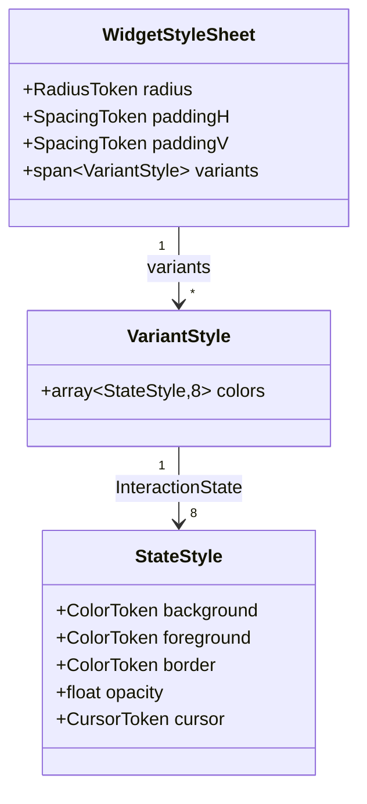
```mermaid
classDiagram
    class WidgetStyleSheet {
        +RadiusToken radius
        +SpacingToken paddingH
        +SpacingToken paddingV
        +span~VariantStyle~ variants
    }
    class VariantStyle {
        +array~StateStyle,8~ colors
    }
    class StateStyle {
        +ColorToken background
        +ColorToken foreground
        +ColorToken border
        +float opacity
        +CursorToken cursor
    }
    WidgetStyleSheet "1" --> "*" VariantStyle : variants
    VariantStyle "1" --> "8" StateStyle : InteractionState
```

**Variant count by widget**:

| Variants | Widgets |
|:--------:|---------|
| 1 | LineEdit, SpinBox, ComboBox, Slider, Label, ScrollArea, Panel, Dialog, Menu, Tooltip, StatusBar, Splitter |
| 2 | Toggle(Off/On), CheckBox(Unchecked/Checked), RadioButton, GroupBox, CollapsibleSection, TabWidget, DocumentBar, ProgressBar |
| 3 | CheckBox(+Indeterminate), DataTable(Default/Striped/Selected) |
| 4 | PushButton(Primary/Secondary/Ghost/Danger), Notification(Info/Success/Warning/Error) |
| 5 | Tag(Default/Primary/Success/Warning/Error) |

### 11.4 ComponentOverride Mechanism

Widget authors or plugins can register per-widget-class token deviations:

```cpp
ComponentOverride overrides[] = {
    { WidgetKind::PushButton, RadiusToken::Large,
      SpacingToken::Px12, SpacingToken::Px8,
      FontRole::BodyBold, ElevationToken::Low },
};
theme.RegisterComponentOverrides(overrides);
```

### 11.5 ComponentOverride Struct

```cpp
struct ComponentOverride {
    WidgetKind     kind;
    std::optional<RadiusToken>    radius;
    std::optional<SpacingToken>   paddingH;
    std::optional<SpacingToken>   paddingV;
    std::optional<SpacingToken>   gap;
    std::optional<SizeToken>      minHeight;
    std::optional<FontRole>       font;
    std::optional<ElevationToken> elevation;
    std::optional<TransitionDef>  transition;
};
```

Only non-nullopt fields override the default. This allows selective overrides
without specifying every field.

### 11.6 Override Priority Rules

```
ComponentOverride > BuildDefaultVariants() > WidgetStyleSheet defaults
```

Overrides are applied during `SetTheme()` / theme change. They persist across
theme switches (registered once, applied to every theme).

### 11.7 Override Lifecycle

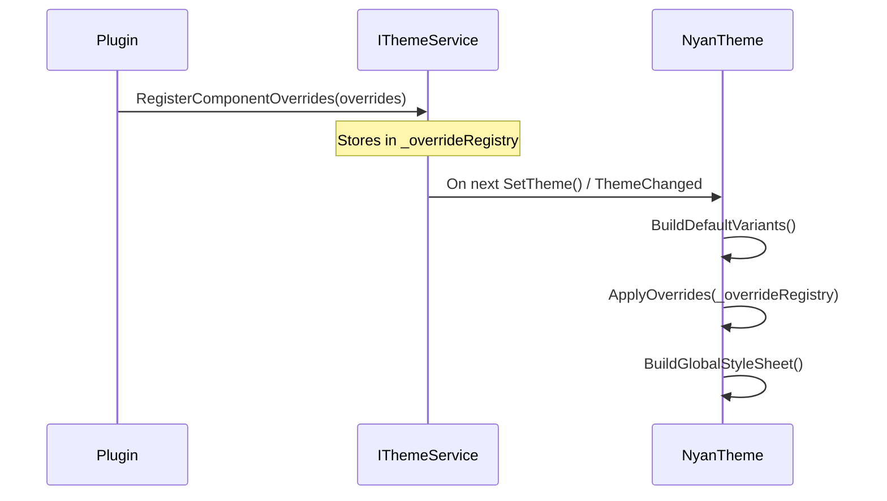
```mermaid
sequenceDiagram
    participant Plugin
    participant ITS as IThemeService
    participant NyanTheme

    Plugin->>ITS: RegisterComponentOverrides(overrides)
    Note over ITS: Stores in _overrideRegistry
    ITS->>NyanTheme: On next SetTheme() / ThemeChanged
    NyanTheme->>NyanTheme: BuildDefaultVariants()
    NyanTheme->>NyanTheme: ApplyOverrides(_overrideRegistry)
    NyanTheme->>NyanTheme: BuildGlobalStyleSheet()
```

### 11.8 Variant Color Override (Advanced)

For overriding specific variant x state color mappings:

```cpp
struct VariantColorOverride {
    WidgetKind     kind;
    int            variantIndex;
    InteractionState state;
    std::optional<ColorToken> background;
    std::optional<ColorToken> foreground;
    std::optional<ColorToken> border;
    std::optional<float>      opacity;
};
```

**Use case**: A plugin that needs PushButton(Primary) to use `Success` hue
instead of `Primary` hue.

```cpp
VariantColorOverride override = {
    .kind = WidgetKind::PushButton,
    .variantIndex = 0,  // Primary
    .state = InteractionState::Normal,
    .background = ColorToken::Success,
    .foreground = ColorToken::OnAccent,
    .border = ColorToken::Success,
};
theme.RegisterVariantColorOverride(override);
```

---
---

# Part IV -- Animation Engine

> Chapters 12-15. Centralized, token-driven animation architecture.

## Chapter 12. Animation Architecture

### 12.1 Design Principles

| Principle | Description |
|-----------|-------------|
| **What/How/When/Who separation** | Widget says WHAT to animate (PropertyId, from, to). Service decides HOW (duration, easing from WidgetStyleSheet). Framework decides WHEN (state change trigger). Test harness controls WHO (override to snap). |
| **Qt-free public API** | `IAnimationService` uses `AnimationPropertyId`, `AnimatableValue`, `TransitionHandle` -- no `QPropertyAnimation`, `QVariant`, `QByteArray` in public interface. |
| **State-space trajectory** | Animation is a trajectory in state space: `x(t): [0, T] -> ValueSpace`. Spring dynamics: ODE solution. Eased: parametric curve. |

> **Qt-Free Public Animation API** -- `IAnimationService` uses `AnimatableValue`, `AnimationPropertyId`, `TransitionHandle` with no Qt types in public interface. Enables future backend replacement and simplifies C ABI wrapping. Internal conversion layer between `AnimatableValue` and `QVariant`/`QPropertyAnimation`.

### 12.2 IAnimationService Interface

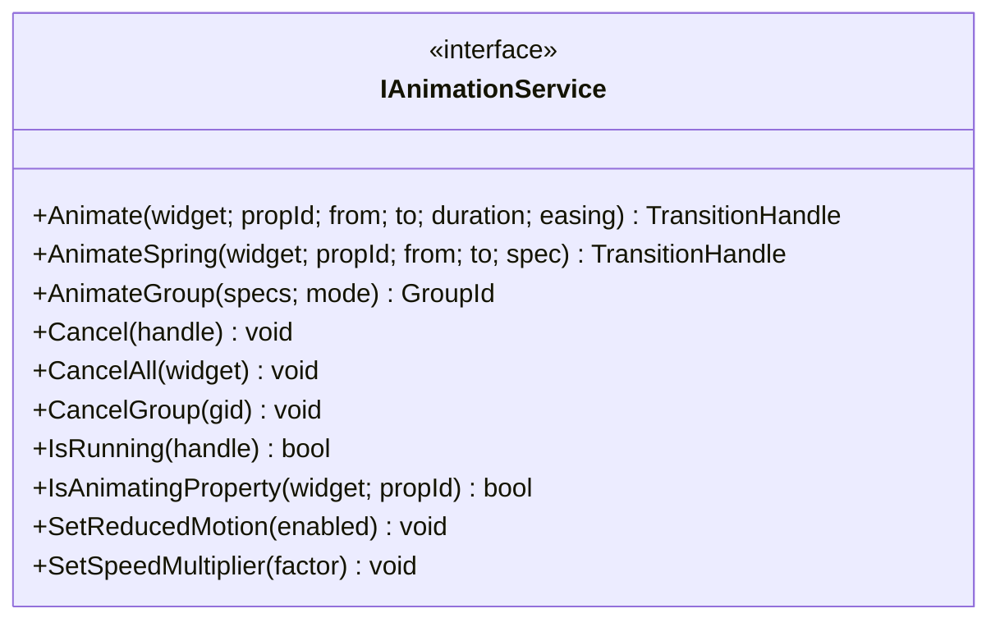
```mermaid
classDiagram
    class IAnimationService {
        <<interface>>
        +Animate(widget; propId; from; to; duration; easing) TransitionHandle
        +AnimateSpring(widget; propId; from; to; spec) TransitionHandle
        +AnimateGroup(specs; mode) GroupId
        +Cancel(handle) void
        +CancelAll(widget) void
        +CancelGroup(gid) void
        +IsRunning(handle) bool
        +IsAnimatingProperty(widget; propId) bool
        +SetReducedMotion(enabled) void
        +SetSpeedMultiplier(factor) void
    }
```

| Method | Input | Output | Description |
|--------|-------|--------|-------------|
| `Animate` | `WidgetNode*, AnimationPropertyId, AnimatableValue from, AnimatableValue to, AnimationToken, EasingToken` | `TransitionHandle` | Start eased animation. Auto re-targets from current interpolated value if same `(target, property)` is already animating. |
| `AnimateSpring` | `WidgetNode*, AnimationPropertyId, AnimatableValue from, AnimatableValue to, SpringSpec` | `TransitionHandle` | Start spring animation. Same re-targeting behavior as `Animate`. |
| `AnimateGroup` | `span<GroupAnimationSpec>, GroupMode` | `GroupId` | Parallel or sequential group. Each sub-animation registered individually for interruption isolation. |
| `Cancel` | `TransitionHandle` | `void` | Cancel running animation. Dispatches `AnimationCancelled`. |
| `CancelAll` | `WidgetNode*` | `void` | Cancel all animations for widget (standalone + group members). |
| `CancelGroup` | `GroupId` | `void` | Cancel entire group and all member transitions. Dispatches `AnimationCancelled` per member. |
| `IsRunning` | `TransitionHandle` | `bool` | Check if animation is active |
| `IsAnimatingProperty` | `WidgetNode*, AnimationPropertyId` | `bool` | Check if property is being animated (standalone or group member) |
| `SetReducedMotion` | `bool` | `void` | Enable/disable reduced motion |
| `SetSpeedMultiplier` | `float` | `void` | Global speed factor |

### 12.3 AnimationPropertyId Enum

| Property | Description | Value Type |
|----------|-------------|-----------|
| `Opacity` | Widget opacity (0.0-1.0) | Double |
| `BackgroundColor` | Background fill color | Rgba |
| `ForegroundColor` | Text/icon color | Rgba |
| `BorderColor` | Border stroke color | Rgba |
| `Position` | Widget position | Point2D |
| `SlideOffset` | Translation offset for slide animations | Double |
| `MaximumHeight` | QWidget::maximumHeight for expand/collapse | Int |
| `MinimumHeight` | QWidget::minimumHeight | Int |
| `ArrowRotation` | Chevron rotation angle (degrees) | Double |
| `Scale` | Transform scale factor | Double |
| `BorderWidth` | Border stroke width | Int |
| `ContentHeight` | Content area height (expand/collapse) | Int |
| `ScrollOffset` | Scroll position | Double |
| `UserDefined` | Start of plugin-defined range (1000+) | Any |

### 12.4 AnimatableValue Tagged Union

```cpp
struct AnimatableValue {
    enum class Tag : uint8_t { Double, Int, Rgba, Point2D };
    Tag tag;
    union {
        double  d;
        int     i;
        uint32_t rgba;    // Packed ARGB
        struct { int x; int y; } pt;
    };

    static AnimatableValue FromDouble(double v);
    static AnimatableValue FromInt(int v);
    static AnimatableValue FromRgba(uint8_t r, uint8_t g, uint8_t b, uint8_t a);
    static AnimatableValue FromPoint(int x, int y);
};
```

Qt-free. Internal `AnimationService` converts to `QVariant` for `QPropertyAnimation`.

### 12.5 TransitionHandle

```cpp
struct TransitionHandle {
    uint64_t id = 0;
    explicit operator bool() const { return id != 0; }
};
```

Opaque handle for cancellation and status queries. Zero = invalid/no animation.

### 12.6 GroupMode and GroupId

| Mode | Description |
|------|-------------|
| `Parallel` | All animations in the group start simultaneously (`QParallelAnimationGroup`) |
| `Sequential` | Each animation starts after the previous one completes (`QSequentialAnimationGroup`) |

`GroupId` is an opaque `enum class : uint64_t` returned by `AnimateGroup()`. Used by `CancelGroup()` to cancel the entire group.

### 12.7 Interruption Re-targeting

When `Animate()` or `AnimateSpring()` is called on a `(target, property)` pair that already has a running animation:

1. The running animation's **current interpolated value** is captured via `QVariantAnimation::currentValue()`
2. The running animation is stopped and an `AnimationCancelled` notification is dispatched
3. The new animation starts from the **captured value** (not the caller-supplied `from`)

This provides smooth visual continuity during rapid state changes (e.g., mouse hover flickering, button press/release during transition).

```
Time -->   |----old anim (bg: gray->blue)----X
                                             |
                                             +----new anim (bg: current->red)---->
                                             ^
                                             captured at ~60% interpolation
```

**Invariant**: If no existing animation is found on `(target, property)`, the caller-supplied `from` is used as-is.

### 12.8 Group Animation Architecture

Group animations provide multi-widget coordinated transitions. Key design:

**Sub-animation registration**: Each `GroupAnimationSpec` produces an individual `TransitionEntry` registered in the active animation map with its own `TransitionHandle`. The entry carries an `owningGroup` field linking it back to the `GroupId`.

**Interruption isolation**: Because group sub-animations are registered individually, a new `Animate()` call on the same `(target, property)` will correctly interrupt just that sub-animation while other group members continue. `CancelAll(widget)` also correctly finds and cancels group members for that widget.

**Lifetime management**:

| Scenario | Qt Object Lifetime | `_active` Entry |
|----------|-------------------|-----------------|
| Standalone animation finishes | `deleteLater()` by `OnFinished` | Erased, `AnimationCompleted` dispatched |
| Group member finishes individually | Group owns Qt object | Erased from `_active`, `AnimationCompleted` dispatched |
| Entire group finishes | Group `deleteLater()` by `OnGroupFinished` | All remaining members erased, `AnimationCompleted` dispatched per member |
| `CancelGroup(gid)` called | Group `stop()` + `deleteLater()` | All members erased, `AnimationCancelled` dispatched per member |
| External `Animate()` interrupts a group member | Only that sub-entry removed from `_active` | `AnimationCancelled` dispatched; group continues with remaining members |

**Notification lifecycle** (per sub-animation within a group):

```
AnimateGroup() called
  --> AnimationStarted(propId, subHandle)   [per spec]
  ...
  --> AnimationCompleted(propId, subHandle)  [on natural finish]
  OR
  --> AnimationCancelled(propId, subHandle)  [on Cancel/CancelAll/CancelGroup/re-target]
```

---

## Chapter 13. Spring Animation Physics

### 13.1 Damped Harmonic Oscillator Model

The spring animation solves the second-order ODE:

$$m \, x''(t) + c \, x'(t) + k \bigl(x(t) - x_{\text{target}}\bigr) = 0$$

where:
- $m$ = mass (default 1.0, dimensionless)
- $c$ = damping coefficient (default 20.0)
- $k$ = stiffness (default 200.0)
- $x_{\text{target}}$ = target value

**Damping ratio**:

$$\zeta = \frac{c}{2\sqrt{m \, k}}$$

| Regime | Condition | Behavior |
|--------|-----------|----------|
| Underdamped | $\zeta < 1$ | Oscillates around target, decaying |
| Critically damped | $\zeta = 1$ | Fastest approach without overshoot |
| Overdamped | $\zeta > 1$ | Slow exponential approach |

Default `SpringSpec{1.0, 200.0, 20.0}` gives $\zeta \approx 0.707$ (underdamped, slight overshoot).

### 13.2 Semi-Implicit Euler Integration

$$v(t + \Delta t) = v(t) + \Delta t \left( -\frac{k}{m}\bigl(x(t) - x_{\text{target}}\bigr) - \frac{c}{m}\,v(t) \right)$$

$$x(t + \Delta t) = x(t) + \Delta t \cdot v(t + \Delta t)$$

Semi-implicit Euler (symplectic): uses new velocity to update position.
Energy-conserving for oscillatory systems. Fixed timestep: $\Delta t = 1/60$ (60 FPS).

### 13.3 Convergence Detection

Animation terminates when:
- $|v(t)| < \varepsilon_v$ (default $\varepsilon_v = 0.01$)
- $|x(t) - x_{\text{target}}| < \varepsilon_x$ (default $\varepsilon_x = 0.1$)

Both conditions must hold simultaneously for `kSettleFrames` consecutive frames (default 3).

### 13.4 CFL Stability Condition

For explicit Euler-like integrators, the CFL stability limit is:

$$\Delta t < 2\sqrt{\frac{m}{k}}$$

With $m=1, k=200$: $\Delta t_{\max} = 0.141\text{s}$. At 60 FPS, $\Delta t = 0.0167\text{s}$ -- safely within limits.

If a custom `SpringSpec` violates CFL ($\Delta t > 2\sqrt{m/k}$), the engine:
1. Logs a warning
2. Falls back to `OutCubic` easing with `AnimationToken::Normal` duration

### 13.5 Multi-Type Spring Interpolation

| Type | Interpolation Strategy |
|------|----------------------|
| `Double` | Direct scalar spring |
| `Int` | Scalar spring, rounded to int at output |
| `Rgba` | Component-wise spring on R,G,B,A independently |
| `Point2D` | Independent spring on x and y |

---

## Chapter 14. Widget Animation Integration

### 14.1 ThemeAware::AnimateTransition() Helpers

```cpp
// Auto-resolve duration/easing from WidgetStyleSheet::transition
TransitionHandle AnimateTransition(AnimationPropertyId propId,
                                    AnimatableValue from,
                                    AnimatableValue to);

// Explicit control
TransitionHandle AnimateTransition(AnimationPropertyId propId,
                                    AnimatableValue from,
                                    AnimatableValue to,
                                    AnimationToken duration,
                                    EasingToken easing);
```

### 14.2 State Transition Animation

When `InteractionState` changes (e.g., Normal -> Hovered), the framework
animates `BackgroundColor`, `ForegroundColor`, and `BorderColor` using the
widget's `TransitionDef` (typically 200ms OutCubic).

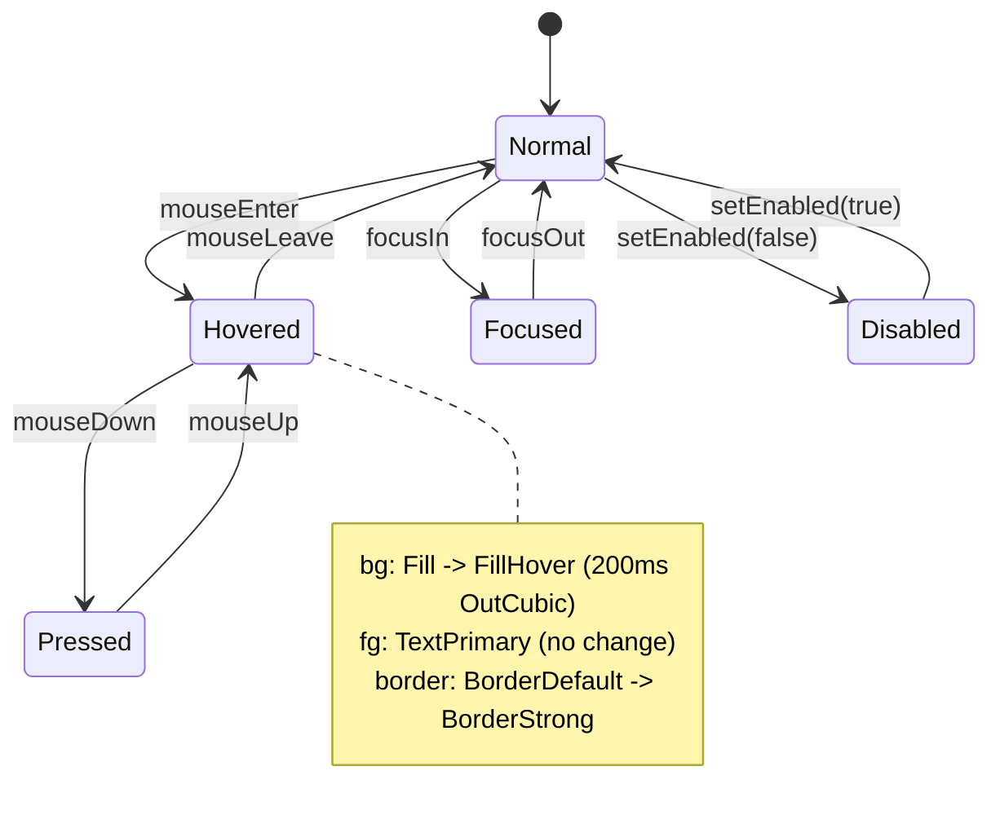
```mermaid
stateDiagram-v2
    [*] --> Normal
    Normal --> Hovered: mouseEnter
    Hovered --> Normal: mouseLeave
    Hovered --> Pressed: mouseDown
    Pressed --> Hovered: mouseUp
    Normal --> Focused: focusIn
    Focused --> Normal: focusOut
    Normal --> Disabled: setEnabled(false)
    Disabled --> Normal: setEnabled(true)

    note right of Hovered
        bg: Fill -> FillHover (200ms OutCubic)
        fg: TextPrimary (no change)
        border: BorderDefault -> BorderStrong
    end note
```

### 14.3 Animation Notifications

Three notification types dispatched via `WidgetNode::SendNotification()`:

| Notification | Payload | When |
|-------------|---------|------|
| `AnimationStarted` | `{ propertyId, handle }` | Animation begins (or snaps in test mode) |
| `AnimationCompleted` | `{ propertyId, handle }` | Animation reaches target |
| `AnimationCancelled` | `{ propertyId, handle }` | Animation cancelled by `Cancel()` or new animation on same property |

### 14.4 Animation in Test Mode

When `SetAnimationOverride(0)` is active:
- All `Animate()` calls set target value immediately (no interpolation)
- `AnimationStarted` is dispatched (trigger-verification tests work)
- `AnimationCompleted` is dispatched immediately after Started
- No `QPropertyAnimation` objects are created
- Zero visual delay -- all widget tests remain deterministic

### 14.5 Per-Widget Animation Catalog (Summary Index)

> This table is a convenience index. The authoritative animation specification
> for each widget is in its Chapter 10 "Animation" section.

| Widget | Animated Properties | Duration | Easing |
|--------|-------------------|:--------:|--------|
| PushButton | bg, fg, border colors | Normal | OutCubic |
| Toggle | track color, thumb position | Normal | Spring |
| GroupBox | ArrowRotation, ContentHeight | Slow | OutCubic |
| CollapsibleSection | ArrowRotation, ContentHeight | Slow | OutCubic |
| StackedWidget | Opacity (cross-fade) | Normal | OutCubic |
| Notification | SlideOffset (slide-in/out) | Normal | OutCubic |
| ComboBox | SlideOffset (dropdown) | Quick | OutCubic |
| Menu | SlideOffset (popup) | Quick | OutCubic |

---

## Chapter 15. Accessibility: Reduced Motion

### 15.1 WCAG 2.1 SC 2.3.3 Compliance

WCAG Success Criterion 2.3.3 (AAA): Motion animation triggered by interaction
can be disabled. Matcha provides `SetReducedMotion(true)` which instantly snaps
all animations to their target values.

### 15.2 OS Detection

| Platform | API | Detection |
|----------|-----|-----------|
| Windows | `SystemParametersInfoW(SPI_GETCLIENTAREAANIMATION)` | Returns `FALSE` if animations disabled |
| macOS | `NSWorkspace.accessibilityDisplayShouldReduceMotion` | Returns `YES` if reduce motion enabled |
| Linux/GNOME | `org.gnome.desktop.interface.enable-animations` | GSettings boolean |

`Application::Initialize()` queries OS preference on startup and calls
`AnimationService::SetReducedMotion()` accordingly.

### 15.3 Behavioral Contract

When reduced motion is active:
- `Animate()` snaps to target (0ms duration)
- `AnimateSpring()` snaps to target
- `AnimateGroup()` snaps all members
- State transition colors snap (no interpolation)
- `AnimationStarted` / `AnimationCompleted` are still dispatched
- Scroll animations snap (no smooth scrolling)
- Page transition cross-fades snap (instant switch)

---
---

# Part V -- Iconography & Cursors

> Chapters 16-17.

## Chapter 16. Icon System

> Complete reference for icon identification, design language, URI hierarchy,
> color inheritance, resolution pipeline, and plugin extensibility.

### 16.1 Design Philosophy

An icon system for a CAD/CAE desktop application faces fundamentally different
constraints than web icon libraries:

| Constraint | Web (Material/Lucide) | Desktop CAD (Matcha) | Design Consequence |
|------------|----------------------|----------------------|-------------------|
| **Icon count** | 1,000-5,000 general-purpose | 300-800 domain-specific + general | Need open registry, not closed enum |
| **Extensibility** | npm package update | Plugin DLL at runtime | URI-based, not ordinal-based |
| **Colorization** | CSS `color` property | Theme-aware, multi-token | SVG `fill`/`stroke` replacement at load |
| **Size range** | 16-48px, discrete | 12-32px, 5 discrete sizes | Pixel-grid aligned at each size |
| **Semantic density** | Low (generic actions) | High (mesh op vs part op vs sketch op) | Hierarchical classification needed |
| **DPI awareness** | CSS handles scaling | Qt devicePixelRatio | Integer pixel sizes, no fractional |

**Core design decision**: Replace the closed `IconToken` enum with an open
URI-based `IconId` system. This trades compile-time exhaustiveness for runtime
extensibility -- the correct trade-off when plugin count is unbounded and icon
vocabulary is domain-specific.

> **URI-Based Icon System** -- Replace closed `IconToken` enum with open `asset://` URI strings. Plugins need to register domain-specific icons. Icon lookup uses string hash map instead of array index; slight runtime cost, negligible with caching.

### 16.2 URI Hierarchy Design

#### 16.2.1 URI Scheme

All icon identifiers follow the `asset://` URI scheme:

```
asset://<authority>/<category>/<name>
```

| Component | Description | Examples |
|-----------|-------------|---------|
| **Scheme** | Always `asset://` | Fixed protocol identifier |
| **Authority** | Icon set owner (vendor/plugin namespace) | `matcha`, `fea-plugin`, `cfd-viz` |
| **Category** | Functional grouping within the authority | `icons`, `cursors`, `logos` |
| **Name** | Leaf identifier (no extension) | `save`, `undo`, `mesh-boolean` |

**Design rationale**: The three-level hierarchy (authority/category/name)
mirrors the organizational structure of a plugin ecosystem:

1. **Authority** prevents namespace collisions between independent plugins
2. **Category** separates icon types (UI icons vs domain glyphs vs logos)
3. **Name** identifies the specific glyph within its category

#### 16.2.2 Built-in URI Prefix

```cpp
constexpr std::string_view kMatchaIconPrefix = "asset://matcha/icons/";
```

All framework-provided icons live under this prefix. The `fw::icons::`
namespace provides compile-time constants:

```cpp
namespace fw::icons {
    inline constexpr std::string_view Save       = "asset://matcha/icons/save";
    inline constexpr std::string_view Undo       = "asset://matcha/icons/undo";
    inline constexpr std::string_view Redo       = "asset://matcha/icons/redo";
    inline constexpr std::string_view Close      = "asset://matcha/icons/close";
    inline constexpr std::string_view ChevronR   = "asset://matcha/icons/chevron-right";
    // ~50 total
}
```

**Why `constexpr string_view` and not `constexpr char[]`**: `string_view` provides
`.size()`, comparison operators, and hash support without heap allocation.
The string data resides in `.rodata`. At callsite, `fw::icons::Save` is
zero-cost -- no allocation, no copy, just a pointer+length pair.

#### 16.2.3 Plugin URI Convention

Plugins register their own authority:

```cpp
// FEA plugin registers its icon directory
theme.RegisterIconDirectory("asset://fea-plugin/icons/",
                            pluginPath + "/icons");

// Usage in plugin code
button.SetIcon("asset://fea-plugin/icons/stress-field");
```

**Collision prevention rule**: Each plugin MUST use a unique authority string.
The convention is `<plugin-id>/icons/` where `plugin-id` matches
`IExpansionPlugin::Id()`.

#### 16.2.4 URI Resolution Order

When `ResolveIcon(iconId, size, color)` is called:

1. Look up `iconId` in `_iconRegistry` (hash map: `string -> filesystem path`)
2. If found: load SVG from path, colorize, rasterize at `size` px
3. If not found: return null `QIcon` (caller should handle gracefully)

No fallback chain. No wildcard matching. This is intentional -- ambiguous
resolution creates debugging nightmares in plugin-heavy environments.

### 16.3 Icon Design Language

#### 16.3.1 Grid Specification

All Matcha icons are designed on a **square pixel grid** with consistent
optical sizing rules:

| Property | Value | Rationale |
|----------|-------|-----------|
| **Canvas** | N x N px (where N = target IconSize) | 1:1 mapping to render size |
| **Safe area** | 2px inset on each edge | Prevents optical clipping at small sizes |
| **Stroke weight** | 1.5px (Sm/Md), 2.0px (Lg/Xl) | Maintains legibility across sizes |
| **Corner radius** | 1px (internal shapes) | Consistent with RadiusToken::Small |
| **Optical alignment** | Centered within safe area | Triangular shapes shift right 0.5-1px for optical centering |

```
+------------------+     N = 16px example
|  2px padding     |
|  +------------+  |
|  |            |  |     12 x 12 px safe area
|  |   glyph   |  |     1.5px stroke weight
|  |            |  |
|  +------------+  |
|                  |
+------------------+
```

**Why fixed stroke weight, not proportional?** At 12-32px sizes, proportional
stroke weight (e.g., 10% of canvas) produces strokes of 1.2px-3.2px, which
causes sub-pixel rendering artifacts on non-Retina displays. Fixed weight
at 1.5px snaps cleanly to the pixel grid at 1x DPR.

#### 16.3.2 Style Principles

| Principle | Description | Counter-example |
|-----------|-------------|----------------|
| **Outlined, not filled** | Default style uses stroke outlines, not solid fill | Avoids visual heaviness in dense toolbars |
| **Geometric, not organic** | Shapes derived from circles, rectangles, 45-degree diagonals | Organic curves feel out of place in engineering UI |
| **Minimal detail** | Each icon conveys one concept with minimum strokes | No decorative elements, no drop shadows |
| **Neutral weight** | Visual weight balanced across the icon set | No icon should "pop" more than others at same size |
| **Consistent metaphor** | Same real-world concept = same visual treatment | Arrow always means navigation, pencil always means edit |

**Design thinking**: The outlined geometric style is chosen because:
1. **Colorization**: Outlined icons respond better to single-color tinting than filled icons
2. **Density**: Engineering toolbars pack 20-40 icons; outlined style reduces visual noise
3. **Accessibility**: High contrast between stroke and background at all sizes
4. **Scalability**: Geometric primitives scale cleanly across the 5 size stops

#### 16.3.3 Size-Specific Optimization

Icons are NOT simply scaled from a single master. Each IconSize has its own
SVG optimized for that pixel grid:

| IconSize | Pixels | Use Case | Optimization |
|----------|:------:|----------|-------------|
| `Xs` (12) | 12x12 | Inline indicators, tree expand/collapse | Simplified to 2-3 strokes max |
| `Sm` (16) | 16x16 | Menu items, small buttons, status bar | Standard detail level |
| `Md` (20) | 20x20 | Toolbar buttons (default) | Full detail level |
| `Lg` (24) | 24x24 | Large toolbar, card headers | Additional detail possible |
| `Xl` (32) | 32x32 | Feature icons, empty states | Maximum detail, optional fill |

**Fallback rule**: If a specific size variant is not available, the resolution
pipeline selects the nearest larger size and scales down (never scales up).
Scaling down preserves detail; scaling up creates blurriness.

### 16.4 Icon Classification Taxonomy

#### 16.4.1 Seven Functional Categories

Icons are organized by their **semantic function**, not by visual appearance:

| Category | URI Segment | Count | Description |
|----------|-------------|:-----:|-------------|
| **File** | `file-*` | ~8 | Document lifecycle: new, open, save, save-as, close, import, export, print |
| **Edit** | `edit-*` | ~8 | Modification actions: undo, redo, cut, copy, paste, delete, select-all, find |
| **View** | `view-*` | ~6 | Display control: zoom-in, zoom-out, fit-all, grid-toggle, wireframe, shaded |
| **Navigation** | `nav-*` or directional | ~8 | Spatial movement: arrow-*, chevron-*, expand, collapse, home, back |
| **Action** | (domain-specific) | ~10 | Generic actions: add, remove, refresh, settings, filter, sort, pin, lock |
| **Status** | `status-*` | ~5 | State indicators: check, warning, error, info, loading |
| **UI Chrome** | `ui-*` | ~5 | Framework chrome: close, minimize, maximize, restore, menu |

#### 16.4.2 Domain-Specific Categories (Plugin-Registered)

| Domain | Authority | Typical Icons | Count |
|--------|-----------|--------------|:-----:|
| **Part Design** | `part-design` | extrude, revolve, fillet, chamfer, pocket, pad, mirror, pattern | ~70 |
| **Mesh Operations** | `mesh-ops` | boolean-union, boolean-subtract, boolean-intersect, refine, decimate | ~55 |
| **Sketch** | `sketch` | line, arc, circle, rectangle, spline, dimension, constraint | ~40 |
| **View Control** | `view-ctrl` | orbit, pan, zoom-window, section-plane, explode | ~50 |
| **FEA** | `fea-plugin` | stress-field, displacement, mesh-quality, boundary-condition | ~30 |
| **CFD** | `cfd-viz` | velocity-field, pressure-contour, streamline, particle-trace | ~20 |

**Total icon assets**: ~830 (see section 8.13 for detailed art asset inventory).

#### 16.4.3 Naming Convention

Icon names within each category follow a consistent pattern:

```
<verb>-<object>[-<modifier>]
```

| Pattern | Example | Description |
|---------|---------|-------------|
| `<verb>` | `save`, `undo`, `close` | Single-action icons |
| `<verb>-<object>` | `zoom-in`, `fit-all`, `select-face` | Action on target |
| `<object>-<modifier>` | `arrow-right`, `chevron-down` | Parameterized variants |
| `<state>` | `check`, `warning`, `error` | Status indicators |

**Forbidden patterns**:
- No size suffixes in names (size is a query parameter, not identity)
- No color suffixes (color is determined by theme context)
- No file extensions (`.svg` is an implementation detail)

### 16.5 Color Inheritance Model

#### 16.5.1 Single-Token Colorization

The default colorization model: each icon inherits a **single foreground color**
from its widget context. This color is applied uniformly to all `stroke` and
`fill` attributes in the SVG.

```
Icon Color = f(widget context)

where:
  - Button icon     -> ResolvedStyle.fg (from variant x state)
  - Menu item icon  -> ColorToken::TextPrimary (normal) / TextDisabled (disabled)
  - Status icon     -> Semantic color (Success/Warning/Error/Info hue step 6)
  - Tree node icon  -> ColorToken::TextSecondary
```

**Why single-token, not multi-token?** Multi-colored icons (e.g., folder with
yellow body + blue tab) create three problems:
1. **Theme brittleness**: Each color must be mapped to a token; N colors = N bindings
2. **Contrast unpredictability**: Color combinations may fail WCAG in some themes
3. **Cognitive overhead**: Colored icons compete with semantic color signals (error red, success green)

For the rare case where multi-color is needed (e.g., application logos), use
pre-rendered PNG assets instead of colorized SVG.

#### 16.5.2 Colorization Algorithm

```
For each SVG element:
  1. If element has `fill` attribute and `fill != "none"`:
     Replace fill value with tintColor
  2. If element has `stroke` attribute and `stroke != "none"`:
     Replace stroke value with tintColor
  3. If element has `opacity` attribute: preserve as-is
  4. If element has class="preserve-color": skip colorization
```

The `preserve-color` CSS class is an escape hatch for icons that must retain
their original colors (rare; used only for brand logos in About dialogs).

#### 16.5.3 State-Dependent Color Mapping

Icon color tracks the widget's `InteractionState` through the resolved style:

| Widget State | Icon Color Source | Typical Result (Light) | Typical Result (Dark) |
|-------------|-------------------|----------------------|---------------------|
| Normal | `ResolvedStyle.fg` | `TextPrimary` (~#1C1C1E) | `TextPrimary` (~#E5E5E7) |
| Hovered | `ResolvedStyle.fg` | Same (hover changes bg, not fg) | Same |
| Pressed | `ResolvedStyle.fg` | Slightly adjusted | Slightly adjusted |
| Disabled | `ResolvedStyle.fg` | `TextDisabled` (~#A0A0A8) | `TextDisabled` (~#5C5C64) |
| Focused | `ResolvedStyle.fg` | Same as Normal | Same as Normal |
| Selected | `ResolvedStyle.fg` | `OnAccent` (white) on accent bg | `OnAccent` on accent bg |

**Key principle**: The icon never independently determines its color. It always
inherits from the enclosing widget's resolved style. This ensures visual
consistency between icon and label text within the same widget.

#### 16.5.4 Semantic Status Icons

Exception to single-token model: status indicator icons (check, warning, error,
info) use their **semantic hue color** rather than the widget foreground:

| Status Icon | Color Token | Rationale |
|------------|-------------|-----------|
| `check` / `success` | `Success6` | Green conveys positive state |
| `warning` | `Warning6` | Amber conveys caution |
| `error` | `Error6` | Red conveys failure |
| `info` | `Info6` | Blue conveys information |

These are colorized with the hue step 6 (mid-tone) of the respective semantic
palette, ensuring WCAG AA contrast against both Surface and SurfaceContainer
backgrounds in all themes.

### 16.6 SVG Format Requirements

#### 16.6.1 Authoring Rules

| Rule | Detail | Rationale |
|------|--------|-----------|
| **Root `viewBox`** | Must be `"0 0 N N"` where N = target size | Enables correct scaling |
| **No embedded styles** | No `<style>` block; use inline attributes | Colorization replaces inline attrs |
| **No `<text>` elements** | Text must be converted to paths | Font unavailability on target system |
| **No `<image>` references** | No embedded raster images | Defeats colorization purpose |
| **No gradients** | Flat fills/strokes only | Gradients break single-token colorization |
| **Coordinates snapped** | All coordinates on 0.5px grid | Prevents sub-pixel blur at 1x DPR |
| **Minimal DOM** | Flatten groups, remove Illustrator metadata | Reduces parse time |
| **`fill="currentColor"`** | Default fill value in source SVG | Signals colorization intent |

#### 16.6.2 File Organization

```
Resources/Icons/
  16/                     <- Sm size variants
    save.svg
    undo.svg
    ...
  20/                     <- Md size variants (default)
    save.svg
    undo.svg
    ...
  24/                     <- Lg size variants
    save.svg
    ...
  32/                     <- Xl size variants
    save.svg
    ...
```

`RegisterIconDirectory()` scans the directory, registering each `.svg` file
as a URI. Size selection happens at `ResolveIcon()` time based on the
requested `IconSize`.

### 16.7 Resolution Pipeline

#### 16.7.1 API

```cpp
auto IThemeService::ResolveIcon(const IconId& iconId,
                                 IconSize size,
                                 QColor tintColor) -> QIcon;
```

#### 16.7.2 Pipeline Stages

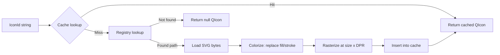
```mermaid
flowchart LR
    A[IconId string] --> B{Cache lookup}
    B -->|Hit| G[Return cached QIcon]
    B -->|Miss| C[Registry lookup]
    C -->|Not found| H[Return null QIcon]
    C -->|Found path| D[Load SVG bytes]
    D --> E[Colorize: replace fill/stroke]
    E --> F[Rasterize at size x DPR]
    F --> G2[Insert into cache]
    G2 --> G
```

#### 16.7.3 Cache Architecture

| Property | Value |
|----------|-------|
| **Key** | `(uri_string, size_px, rgba_u32)` triple |
| **Value** | `QIcon` (contains `QPixmap` at target DPR) |
| **Structure** | `std::unordered_map<CacheKey, QIcon>` with custom hash |
| **Invalidation** | Full cache clear on `ThemeChanged` signal |
| **Capacity** | Unbounded (typical working set: ~200-400 entries) |
| **Thread safety** | Main thread only (same as all UI operations) |

**Why full invalidation on theme change?** Because tint colors change when
the theme changes (dark ↔ light). Partial invalidation would require tracking
which icons use which color tokens -- complexity not justified given that
cache rebuild after theme switch takes < 50ms for 400 icons.

### 16.8 RTL Icon Flipping

#### 16.8.1 Flippable vs Non-Flippable

Not all icons should be mirrored in RTL layouts. Only **directional** icons
are flipped:

| Flippable (mirror in RTL) | Non-Flippable (same in RTL) |
|--------------------------|---------------------------|
| `chevron-right`, `chevron-left` | `check`, `close`, `warning` |
| `arrow-right`, `arrow-left` | `zoom-in`, `zoom-out` |
| `undo`, `redo` | `settings`, `filter` |
| `indent`, `outdent` | `save`, `delete` |
| `nav-back`, `nav-forward` | Symmetric icons (plus, minus) |

#### 16.8.2 Flippability Determination

```cpp
auto IsRtlFlippable(std::string_view iconId) -> bool;
```

The function checks against a built-in set of known flippable icon names.
Plugin icons are non-flippable by default. Plugins can register flippable
icons by calling a registration API.

**Design rationale**: An opt-in flippable list (rather than opt-out) is safer.
An incorrectly flipped domain icon (e.g., a mesh operation glyph) is more
confusing than a non-flipped directional arrow.

#### 16.8.3 Flip Implementation

RTL flip is applied at rasterization time (after colorization):

```cpp
if (textDirection == TextDirection::RTL && IsRtlFlippable(iconId)) {
    QImage img = pixmap.toImage().mirrored(true, false);  // horizontal flip
    pixmap = QPixmap::fromImage(img);
}
```

### 16.9 Plugin Icon Registration

#### 16.9.1 Registration API

```cpp
auto IThemeService::RegisterIconDirectory(
    std::string_view uriPrefix,
    QString dirPath) -> int;
```

**Parameters**:
- `uriPrefix`: URI prefix to register (e.g., `"asset://fea-plugin/icons/"`)
- `dirPath`: Filesystem directory containing `.svg` files

**Return**: Count of icons registered, or negative error code.

**Behavior**: Scans `dirPath` for `*.svg` files. For each file `foo.svg`,
registers `"<uriPrefix>foo"` -> `"<dirPath>/foo.svg"` in the icon registry.

#### 16.9.2 Registration Lifecycle

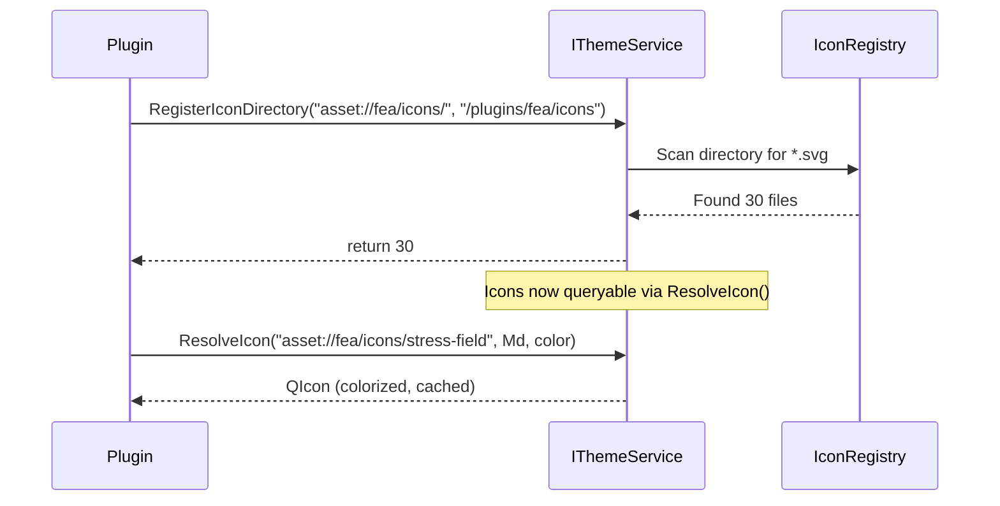
```mermaid
sequenceDiagram
    participant Plugin
    participant Theme as IThemeService
    participant Registry as IconRegistry

    Plugin->>Theme: RegisterIconDirectory("asset://fea/icons/", "/plugins/fea/icons")
    Theme->>Registry: Scan directory for *.svg
    Registry-->>Theme: Found 30 files
    Theme-->>Plugin: return 30
    Note over Theme: Icons now queryable via ResolveIcon()
    Plugin->>Theme: ResolveIcon("asset://fea/icons/stress-field", Md, color)
    Theme-->>Plugin: QIcon (colorized, cached)
```

#### 16.9.3 Unregistration

Icons registered by a plugin are NOT automatically removed when the plugin
stops. The icon registry is append-only during application lifetime.
This is intentional: widgets may still hold references to `IconId` strings
after plugin shutdown, and returning null icons would cause visual artifacts.

### 16.10 Accessibility Considerations

| Requirement | Implementation |
|------------|----------------|
| **Decorative icons** | Icons next to text labels are decorative; set `QAccessible::NameChanged` to text only |
| **Standalone icons** | Icon-only buttons MUST have `SetAccessibleName()` on the WidgetNode |
| **High contrast** | Icons automatically adapt via colorization from high-contrast theme tokens |
| **Reduced motion** | N/A (icons are static) |
| **Minimum touch target** | Icon buttons must meet 32x32px minimum touch target regardless of icon size |

---

## Chapter 17. Cursor System

### 17.1 CursorToken Enum

| Token | Qt Mapping | Description |
|-------|-----------|-------------|
| `Default` | `Qt::ArrowCursor` | Standard pointer |
| `Pointer` | `Qt::PointingHandCursor` | Clickable element |
| `Text` | `Qt::IBeamCursor` | Text input |
| `Wait` | `Qt::WaitCursor` | Busy/loading |
| `Crosshair` | `Qt::CrossCursor` | Precise selection |
| `Move` | `Qt::SizeAllCursor` | Draggable element |
| `SplitH` | `Qt::SplitHCursor` | Horizontal splitter |
| `SplitV` | `Qt::SplitVCursor` | Vertical splitter |
| `ResizeN` | `Qt::SizeVerCursor` | Resize north |
| `ResizeE` | `Qt::SizeHorCursor` | Resize east |
| `ResizeNE` | `Qt::SizeBDiagCursor` | Resize diagonal NE |
| `ResizeNW` | `Qt::SizeFDiagCursor` | Resize diagonal NW |
| `Forbidden` | `Qt::ForbiddenCursor` | Action not allowed |
| `Grab` | `Qt::OpenHandCursor` | Grab-ready |
| `Grabbing` | `Qt::ClosedHandCursor` | Currently grabbing |

### 17.2 Widget State -> Cursor Mapping

Cursors are specified per-state in `StateStyle::cursor`:

```cpp
StateStyle normal  = { .cursor = CursorToken::Pointer };   // Clickable
StateStyle disabled = { .cursor = CursorToken::Forbidden }; // Not allowed
StateStyle dragging = { .cursor = CursorToken::Grabbing };  // Drag in progress
```

The framework applies the cursor from the resolved `StateStyle` automatically
when the widget's interaction state changes.

---
---

# Part VI -- Accessibility & Internationalization

> Chapters 18-19.

## Chapter 18. Accessibility Infrastructure

### 18.1 A11yRole Enum

28 semantic roles for UI elements:

| Category | Roles |
|----------|-------|
| **Input** | Button, CheckBox, RadioButton, Slider, SpinBox, ComboBox, TextInput, Toggle, SearchBox |
| **Container** | Group, Panel, TabPanel, Dialog, AlertDialog, Menu, MenuBar, Toolbar, ScrollView, Table, Tree, List |
| **Display** | Label, Image, ProgressBar, Separator, Tooltip |
| **Navigation** | Link, Tab |

**Mapping**: Each `A11yRole` maps to `QAccessible::Role` at the widget layer.

### 18.2 WidgetNode Accessibility Properties

| Method | Description |
|--------|-------------|
| `SetAccessibleName(string_view)` | Human-readable label for screen readers |
| `AccessibleName() -> string_view` | Get current accessible name |
| `SetA11yRole(A11yRole)` | Set semantic role |
| `GetA11yRole() -> A11yRole` | Get semantic role |
| `IsFocusable() -> bool` | Whether widget can receive keyboard focus |
| `SetFocusable(bool)` | Set focus capability |

### 18.3 Focus Management

The focus system has three layers:

| Layer | Class | Responsibility |
|-------|-------|----------------|
| **Tab traversal** | `FocusTabEventFilter` (internal to `WidgetNode`) | Intercepts Tab/Shift+Tab QKeyEvent, uses `FocusChain::Collect` + `Next`/`Previous` to move focus within the enclosing focus scope |
| **Focus scope** | `UiNode::SetFocusScope(bool)` | Marks a subtree boundary. Tab cycling is trapped within the scope. `DialogNode` sets this automatically in its constructor |
| **Focus manager** | `FocusManager` (global service) | Centralized tracking of focused node, cross-region F6 cycling, save/restore for dialog open/close |

#### 18.3.1 Tab Key Interception

When `SetFocusable(true)` is called on a `WidgetNode`, a `FocusTabEventFilter`
(QObject event filter) is automatically installed on the underlying QWidget.

On Tab/Shift+Tab keypress:

1. Find the enclosing focus scope via `FindEnclosingFocusScope()`, or walk to tree root if none
2. Call `FocusChain::Collect(scope)` to gather all focusable nodes, sorted by `TabIndex`
3. Resolve the currently focused `WidgetNode` via `QApplication::focusWidget()` + `WidgetNode::FromWidget()`. If `FromWidget` returns nullptr (external QWidget has Qt focus), fall back to the filter's owning node
4. Call `FocusChain::Next()` or `FocusChain::Previous()` and transfer focus
5. Notify `GetFocusManager()->NotifyFocusGained()` so the global tracker stays in sync
6. Event is consumed (Qt native Tab order is bypassed)

#### 18.3.2 Focus Scope

`UiNode::SetFocusScope(true)` creates a focus trap boundary. `FocusChain::Collect()`
does not descend into child focus scopes, so Tab/Shift+Tab cycles only within the
scope subtree.

Nodes that auto-set focus scope:

| Node | Reason |
|------|--------|
| `DialogNode` | Modal/semi-modal dialogs must trap Tab within dialog content |

Business-layer code may set focus scope on any `UiNode` for custom trapping (e.g.,
a floating panel or an embedded wizard).

#### 18.3.3 FocusManager Service

`FocusManager` is created by `Application::Initialize()` and accessed globally
via `GetFocusManager()`.

**Focus tracking API:**

| Method | Description |
|--------|-------------|
| `NotifyFocusGained(WidgetNode*)` | Update tracked focused node + dispatch `FocusChanged(true)` notification via `SendNotification` |
| `NotifyFocusLost(WidgetNode*)` | Clear tracked node if it matches + dispatch `FocusChanged(false)` notification |
| `FocusedNode()` | Currently focused WidgetNode (or nullptr) |
| `PreviousFocusedNode()` | Previously focused WidgetNode |

**Scope-aware traversal API:**

| Method | Description |
|--------|-------------|
| `FocusNext(current)` | Move to next focusable within enclosing scope |
| `FocusPrevious(current)` | Move to previous focusable within enclosing scope |

**Cross-region focus flow (F6/Shift+F6):**

| Method | Description |
|--------|-------------|
| `RegisterRegion(FocusRegion)` | Register a named region with sort order. `FocusRegion::rootToken` (weak_ptr from `AliveToken()`) guards lifetime |
| `UnregisterRegion(id)` | Remove a region |
| `FocusNextRegion()` | Cycle to next region (F6 behavior) |
| `FocusPreviousRegion()` | Cycle to previous region (Shift+F6) |
| `FocusRegionById(id)` | Jump to specific region |
| `ActiveRegionId()` | Current region ID |

**Focus save/restore stack (for nested dialogs):**

| Method | Description |
|--------|-------------|
| `PushFocusState()` | Push current focus onto the restore stack (one level per call) |
| `PopFocusState()` | Pop and restore the most recently pushed focus. No-op if stack empty |
| `FocusRestoreDepth()` | Current depth of the restore stack |
| `SaveFocusState()` | Legacy alias for `PushFocusState()` |
| `RestoreFocusState()` | Legacy alias for `PopFocusState()` |

Nested dialog scenario: Dialog A opens Dialog B. Each `PushFocusState()` saves
the current focus. Closing B pops to A's focus, closing A pops to the original.

**Region lifetime safety:**

`FocusRegion::rootToken` stores a `weak_ptr<void>` from `EventNode::AliveToken()`.
Before any region operation (`FocusRegionById`, `FocusNextRegion`, `NotifyFocusGained`),
`PurgeStaleRegions()` removes entries whose token has expired. This prevents
dangling `root` pointer access when a region's UiNode subtree is destroyed.

#### 18.3.4 Focus Ring Painting

**Focus ring painting**: `ThemeAware::PaintFocusRing(QPainter&, QRect, int radius)`

Uses `Focus` color token, 2px border width, drawn outside the widget rect.

**Keyboard-only focus**: Focus ring is only visible when focus was acquired via
keyboard (Tab/Shift+Tab), not via mouse click. This follows the `:focus-visible`
CSS pseudo-class convention.

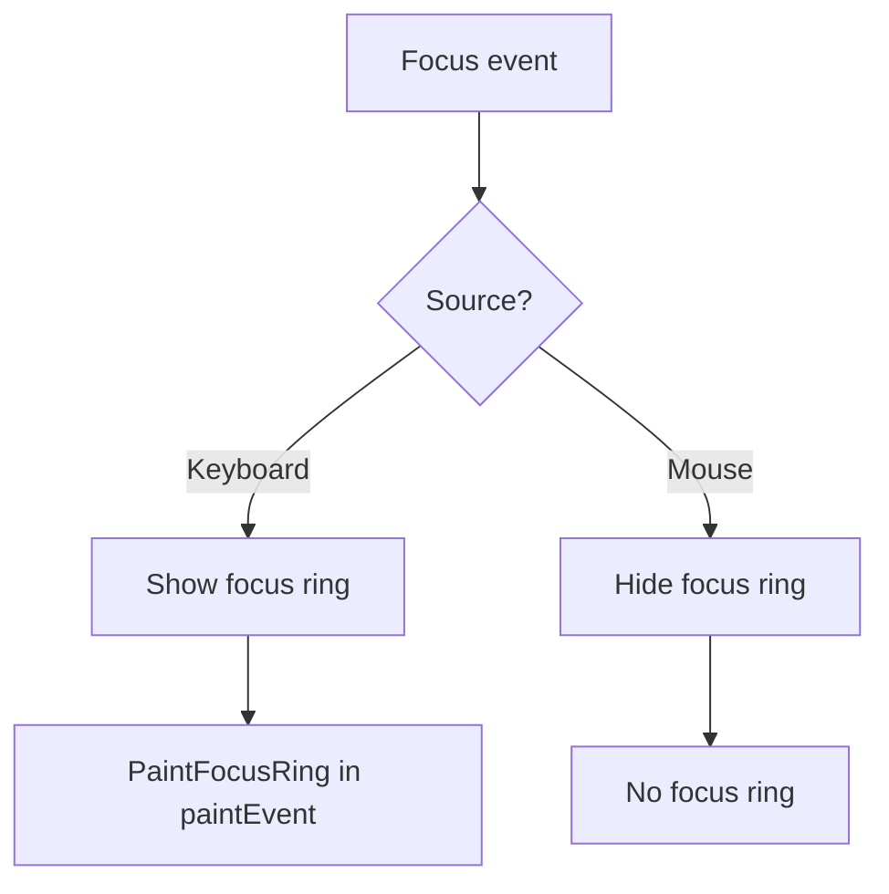
```mermaid
flowchart TD
    A[Focus event] --> B{Source?}
    B -->|Keyboard| C[Show focus ring]
    B -->|Mouse| D[Hide focus ring]
    C --> E[PaintFocusRing in paintEvent]
    D --> F[No focus ring]
```

### 18.4 ContrastChecker API

See Chapter 2.8 for complete API reference.

**Integration with A11yAudit**: The audit tool uses `ContrastChecker::MeetsAA()`
to verify all text-on-background combinations in a widget tree.

### 18.5 A11yAudit (Test-Time Auditor)

**Class**: `A11yAudit` (static utility, test-time only)

| Method | Input | Output | Description |
|--------|-------|--------|-------------|
| `Audit(root)` | `WidgetNode*` | `vector<A11yViolation>` | Walk subtree, report violations |
| `AuditWidget(widget)` | `WidgetNode*` | `vector<A11yViolation>` | Audit single widget |

**Violation rules**:

| Rule ID | Severity | Description |
|---------|----------|-------------|
| `a11y.name.missing` | Error | Interactive widget has no accessible name |
| `a11y.role.missing` | Warning | Widget has default role (should be explicit) |
| `a11y.contrast.below-aa` | Error | Text/bg contrast ratio < 4.5:1 |
| `a11y.contrast.below-aa-large` | Warning | Large text contrast ratio < 3:1 |
| `a11y.focus.unreachable` | Error | Focusable widget not reachable via Tab |

**A11yViolation struct**:

```cpp
struct A11yViolation {
    std::string ruleId;
    std::string widgetPath;    // Node path in UiNode tree
    std::string message;       // Human-readable description
    Severity    severity;      // Error, Warning, Info
};
```

### 18.6 High Contrast Theme

`kThemeHighContrast` is a registered built-in theme with:
- All text tokens at maximum contrast (black on white / white on black)
- Focus ring: 3px solid (instead of 2px)
- Border tokens at full opacity (no subtle/muted variants)
- All hue steps at maximum saturation

**High Contrast token overrides** (relative to Light theme):

| Token | Light | HighContrast | Change |
|-------|-------|-------------|--------|
| `TextPrimary` | `#E01F1F20` (88% opacity) | `#FF000000` (100% black) | Full opacity |
| `TextSecondary` | `#C03C3C3E` (75%) | `#FF000000` (100%) | Promoted to primary |
| `TextDisabled` | `#668B8B8E` (40%) | `#99666666` (60%) | Higher visibility |
| `BorderSubtle` | `#E7E7E9` | `#999999` | Stronger contrast |
| `BorderDefault` | `#DCDCDE` | `#666666` | Much stronger |
| `Focus` | `#0066FF` | `#0000FF` | Saturated blue |

### 18.7 Keyboard Navigation Map

Every interactive widget defines a keyboard interaction contract:

| Widget | Key | Action |
|--------|-----|--------|
| PushButton | `Enter`, `Space` | Activate |
| CheckBox | `Space` | Toggle checked state |
| RadioButton | `Space` | Select (within group: `Arrow` keys cycle) |
| Slider | `Left`/`Down` | Decrement by step |
| Slider | `Right`/`Up` | Increment by step |
| Slider | `PageDown`/`PageUp` | Decrement/increment by page step |
| Slider | `Home`/`End` | Jump to min/max |
| SpinBox | `Up`/`Down` | Increment/decrement |
| ComboBox | `Enter`, `Space` | Open dropdown |
| ComboBox (open) | `Up`/`Down` | Navigate items |
| ComboBox (open) | `Enter` | Select item |
| ComboBox (open) | `Escape` | Close dropdown |
| Toggle | `Space` | Toggle on/off |
| TabWidget | `Left`/`Right` | Switch tabs |
| Tree | `Left` | Collapse node |
| Tree | `Right` | Expand node |
| Tree | `Up`/`Down` | Navigate nodes |
| Menu | `Up`/`Down` | Navigate items |
| Menu | `Enter` | Activate item |
| Menu | `Right` | Open sub-menu |
| Menu | `Left`, `Escape` | Close sub-menu / menu |
| Dialog | `Escape` | Close dialog |
| Dialog | `Enter` | Activate primary button |
| DataTable | `Arrow` keys | Navigate cells |
| DataTable | `Enter` | Begin cell edit |
| DataTable | `Escape` | Cancel cell edit |
| SearchBox | `Enter` | Submit search |
| SearchBox | `Escape` | Clear and blur |
| CollapsibleSection | `Enter`, `Space` | Toggle expand/collapse |

### 18.8 Screen Reader Announcements

Widgets automatically announce state changes to assistive technology:

| Event | Announcement |
|-------|-------------|
| CheckBox toggled | "Checked" / "Unchecked" |
| Toggle switched | "On" / "Off" |
| ComboBox selection | "Selected: {item text}" |
| Tab switched | "{tab name}, tab {n} of {total}" |
| Dialog opened | "{dialog title}, dialog" |
| Dialog closed | "Dialog closed" |
| Toast appeared | "{severity}: {message}" |
| Progress changed | "{value} percent" (throttled to every 10%) |
| Tree node expanded | "Expanded" |
| Tree node collapsed | "Collapsed" |

### 18.9 Focus Trap in Modal Dialogs

When a `Dialog` is shown with `NyanDialog::exec()` or `NyanDialog::open()`:

1. Focus is moved to the first focusable child
2. Tab cycling is confined within the dialog
3. `Shift+Tab` from first focusable wraps to last
4. `Tab` from last focusable wraps to first
5. `Escape` closes the dialog and restores focus to the previous widget

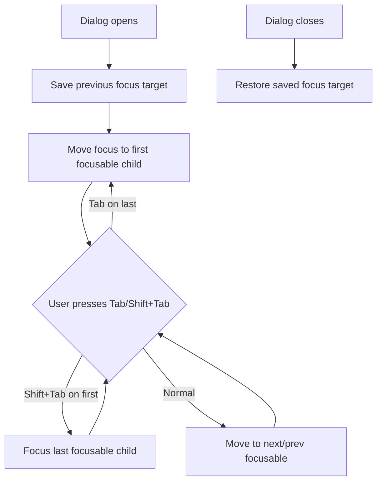
```mermaid
flowchart TD
    A[Dialog opens] --> B[Save previous focus target]
    B --> C[Move focus to first focusable child]
    C --> D{User presses Tab/Shift+Tab}
    D -->|Tab on last| C
    D -->|Shift+Tab on first| E[Focus last focusable child]
    D -->|Normal| F[Move to next/prev focusable]
    E --> D
    F --> D
    G[Dialog closes] --> H[Restore saved focus target]
```

### 18.10 Live Region Support

Notification toasts use ARIA live region semantics:

| Severity | Politeness | Behavior |
|----------|-----------|----------|
| Info | `polite` | Read after current speech |
| Success | `polite` | Read after current speech |
| Warning | `assertive` | Interrupt current speech |
| Error | `assertive` | Interrupt current speech |

Implemented via `QAccessible::updateAccessibility()` with appropriate event types.

### 18.11 Mnemonic (Access Key) System

> Comprehensive specification for keyboard mnemonic (access key) support across
> all Matcha widget types. Mnemonics provide keyboard-driven navigation to UI
> controls without requiring Tab traversal, essential for accessibility (WCAG 2.1
> SC 2.1.1) and power-user efficiency in CAD/CAE applications.
>
> **Reference**: Microsoft Win32 UX Guidelines — Keyboard / Access Keys;
> Qt `QKeySequence::mnemonic()`; wxWidgets Mnemonic Tutorial.

#### 18.11.1 Terminology

| Term | Definition |
|------|-----------|
| **Mnemonic** (access key) | A single alphanumeric character in a control's label that, when combined with Alt (or pressed directly in certain contexts), activates or focuses that control. Declared by prefixing the character with `&` in the label string. |
| **Shortcut key** (accelerator) | A Ctrl/Function-key combination (e.g., `Ctrl+S`) that directly invokes a command. Defined in `CommandHeaderDescriptor::shortcut`. Not covered in this section — see `WorkbenchManager::RegisterShortcuts()`. |
| **Underline indicator** | A single-character underline decoration rendered beneath the mnemonic character to visually communicate the access key. |
| **Mnemonic scope** | The set of controls within which mnemonic characters must be unique and within which mnemonic keystrokes are dispatched. |
| **Buddy** | A non-labelled input control associated with a `LabelNode` via `SetBuddy()`. The label's mnemonic transfers focus to the buddy. |
| **`&` syntax** | The ampersand character in a label string marks the next character as the mnemonic. Literal ampersand is escaped as `&&`. Example: `"&File"` → mnemonic `F`, displayed as `F̲ile`. |

#### 18.11.2 Applicable Widget Types

Mnemonic support is categorized by **activation behavior** (what happens when the mnemonic is triggered):

| Category | Widget (UiNode / Nyan*) | Activation Behavior | Mnemonic Required? |
|----------|------------------------|--------------------|--------------------|
| **Menu bar** | `MenuBarNode` / `NyanMenuBar` | Opens the corresponding menu dropdown | Yes — all top-level menus |
| **Menu item** | `MenuNode` items / `NyanMenuItem` | Triggers the item (or opens submenu) | Yes — all menu items |
| **Push button** | `PushButtonNode` / `NyanPushButton` | Clicks the button | Yes — dialog commit/action buttons with non-standard labels |
| **Check box** | `CheckBoxNode` / `NyanCheckBox` | Toggles checked state | Yes — dialog/form check boxes |
| **Radio button** | `RadioButtonNode` / `NyanRadioButton` | Selects the radio button | Yes — dialog/form radio buttons |
| **Toggle switch** | `ToggleSwitchNode` / `NyanToggleSwitch` | Toggles on/off | Yes — when label text is present |
| **Label (buddy)** | `LabelNode` / `NyanLabel` | Transfers focus to the buddy control | Yes — form labels preceding input controls |
| **Group box** | `GroupBoxNode` / `NyanGroupBox` | Transfers focus to the first focusable child within the group | Conditional — when individual children lack unique mnemonics |
| **Collapsible section** | `CollapsibleSectionNode` / `NyanCollapsibleSection` | Toggles expand/collapse | Optional — useful in property panels with many sections |
| **Tab (ActionBar)** | `ActionTabNode` / ActionBar tab button | Switches to the tab | Optional — tabs are primarily navigated via Ctrl+Tab |
| **Toolbar button** | `ToolButtonNode` / `NyanToolButton` | Clicks the button | No — toolbar buttons use shortcut keys, not mnemonics |
| **ComboBox** | `ComboBoxNode` / `NyanComboBox` | Opens the dropdown and focuses | Via buddy label only — combo boxes lack visible mnemonic text |
| **LineEdit / SpinBox** | `LineEditNode`, `SpinBoxNode`, etc. | Focuses the input | Via buddy label only |

#### 18.11.3 Activation Modes

Mnemonic activation differs by context. Three distinct modes exist:

| Mode | Trigger | Context | Example |
|------|---------|---------|---------|
| **Alt+Letter** | User holds Alt and presses the mnemonic character | Main window (no menu/dialog active) | `Alt+F` opens File menu |
| **Direct Letter** | User presses the mnemonic character alone (no Alt) | Inside an open menu | `S` triggers Save item in an open File menu |
| **Alt+Letter (dialog)** | User holds Alt and presses the mnemonic character | Inside a modal/modeless dialog | `Alt+A` clicks Apply button in dialog |

**State machine**:

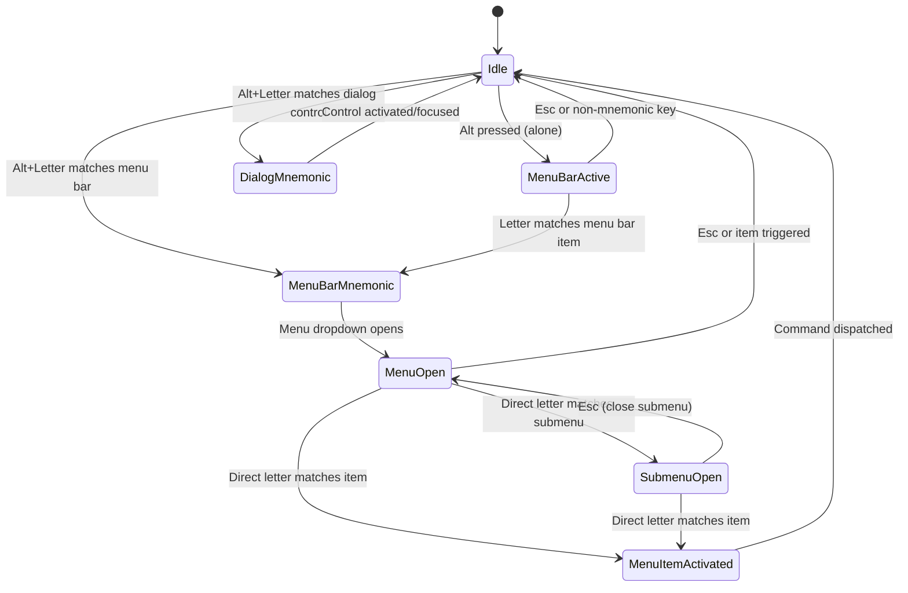
```mermaid
stateDiagram-v2
    [*] --> Idle
    Idle --> MenuBarActive : Alt pressed (alone)
    Idle --> MenuBarMnemonic : Alt+Letter matches menu bar
    Idle --> DialogMnemonic : Alt+Letter matches dialog control

    MenuBarActive --> Idle : Esc or non-mnemonic key
    MenuBarActive --> MenuBarMnemonic : Letter matches menu bar item

    MenuBarMnemonic --> MenuOpen : Menu dropdown opens
    MenuOpen --> MenuItemActivated : Direct letter matches item
    MenuOpen --> SubmenuOpen : Direct letter matches submenu
    MenuOpen --> Idle : Esc or item triggered

    SubmenuOpen --> MenuItemActivated : Direct letter matches item
    SubmenuOpen --> MenuOpen : Esc (close submenu)

    MenuItemActivated --> Idle : Command dispatched
    DialogMnemonic --> Idle : Control activated/focused
```

#### 18.11.4 Underline Visibility

Following the Windows platform convention:

| Setting | Underline behavior | When |
|---------|--------------------|------|
| **Default** | Underlines are **hidden** until the user presses Alt | Matches `SPI_GETKEYBOARDCUES` = false (Windows default) |
| **Always visible** | Underlines are **always shown** | User has enabled "Always underline access keys" in OS accessibility settings, or `MnemonicState::SetAlwaysShow(true)` is called |
| **High Contrast** | Underlines are **always shown** | `kThemeHighContrast` is active |

**`MnemonicState` tracks a global boolean `_altHeld`** that is set to `true` when:

1. The Alt key is pressed (KeyPress event for `Qt::Key_Alt`)
2. The "Always underline access keys" OS setting is enabled
3. `MnemonicState::SetAlwaysShow(true)` is called programmatically

It is set to `false` when:

1. The Alt key is released (KeyRelease event for `Qt::Key_Alt`) and `AlwaysShow` is false
2. A mnemonic is activated (underlines hide after the action completes)
3. Escape is pressed

All widgets that render mnemonic text must query `MnemonicState::ShouldShowUnderline()` in their `paintEvent()` and repaint when the state changes. `MnemonicState` emits a signal/notification to trigger global repaint.

#### 18.11.5 Menu Bar Mnemonic Behavior

**Applies to**: `NyanMenuBar` / `MenuBarNode`

**Text declaration**: `menuBar->AddMenu("&File")` — the `&` marks `F` as the mnemonic.

**Interaction sequence**:

| Step | User action | System response |
|------|------------|-----------------|
| 1 | Presses and releases Alt (alone) | Menu bar enters "active" state. All menu bar button mnemonic underlines become visible. First menu button receives visual highlight (not open). |
| 2 | Presses mnemonic letter (e.g., `F`) | Corresponding menu opens below its button. Menu bar "active" state transitions to "menu open". |
| 3 | Alt+Letter (combined) | Equivalent to steps 1+2 atomically — menu opens directly. |
| 4 | Presses Escape while menu bar is active (no menu open) | Menu bar deactivates. Underlines hide. Focus returns to previous widget. |
| 5 | Presses non-matching letter while menu bar is active | No action. Key is consumed (not forwarded to application). |
| 6 | Clicks elsewhere while menu bar is active | Menu bar deactivates. |

**Visual states for menu bar buttons**:

| State | Background | Text color | Underline |
|-------|-----------|-----------|-----------|
| Normal | Transparent | `TextPrimary` | Hidden (unless AlwaysShow) |
| Alt held (no menu open) | Transparent | `TextPrimary` | **Visible** |
| Hovered | `FillActive` | `TextPrimary` | Follows Alt state |
| Active (menu open) | `PrimaryBgHover` | `TextPrimary` | **Visible** |

**Left/Right navigation**: When a menu is open, Left/Right arrow keys cycle through adjacent menus. The new menu opens and the old one closes atomically (single-open invariant).

#### 18.11.6 Menu Item Mnemonic Behavior

**Applies to**: `NyanMenuItem` / `NyanMenuCheckItem` inside `NyanMenu`

**Text declaration**: `menu->AddItem("&Save")` — the `&` marks `S` as the mnemonic.

**Critical distinction from menu bar**: Inside an open menu, mnemonics activate on a **direct keypress** (no Alt required). This matches Windows, macOS, and Qt native behavior.

**Interaction sequence**:

| Step | User action | System response |
|------|------------|-----------------|
| 1 | Menu is open, user presses mnemonic letter `S` | If exactly one item matches: item is triggered immediately. Menu closes. |
| 2 | Menu is open, user presses letter matching a submenu | Submenu opens. Focus moves into the submenu. |
| 3 | Multiple items share the same mnemonic | First press highlights the first match. Second press cycles to the next match. Enter activates the highlighted item. |
| 4 | No item matches the pressed letter | Key is consumed (no action). |

**Underline visibility in menus**: Mnemonic underlines are **always visible** inside an open menu, regardless of `MnemonicState`. The rationale: once a user has opened a menu, they are already in keyboard navigation mode and need to see all available mnemonics.

**Visual layout** (extending the existing `NyanMenuItem` spec):

```
┌──────────────────────────────────────────────┐
│ [icon 16x16]  S̲ave                  Ctrl+S  │
│ [icon 16x16]  Save &As...           Ctrl+Shift+S │
│ ──────────────────────────────────────────── │
│ [icon 16x16]  &Print                Ctrl+P  │
│ [icon 16x16]  E̲xit                  Alt+F4  │
└──────────────────────────────────────────────┘
```

The underline is drawn on the mnemonic character within the text label. The shortcut text (right-aligned) is a separate `QKeySequence` display and has no underline.

**Disabled items**: Mnemonic underlines are still rendered on disabled items (at `TextDisabled` opacity), but pressing the mnemonic key on a disabled item produces no action.

**Separator items**: `NyanMenuSeparator` has no text and no mnemonic.

**Dynamic items** (e.g., recent files): Assign numeric mnemonics `&1`, `&2`, ... `&9`, `&0` for the first 10 items. Items beyond 10 have no mnemonic.

#### 18.11.7 Dialog Control Mnemonic Behavior

**Applies to**: All interactive controls inside `NyanDialog` / `NyanInputDialog` / `NyanPopConfirm`

**Activation**: `Alt+Letter` (same as main window, but scoped to the dialog's focus scope).

**Button mnemonics**:

| Button | Standard mnemonic | Notes |
|--------|------------------|-------|
| OK | None | Activated via `Enter` key |
| Cancel | None | Activated via `Escape` key |
| Close | None | Activated via `Escape` key |
| Apply | `&Apply` (`A`) | Must have explicit mnemonic |
| Yes | `&Yes` (`Y`) | Must have explicit mnemonic |
| No | `&No` (`N`) | Must have explicit mnemonic |
| Save | `&Save` (`S`) | Business-specific commit button |
| Don't Save | `Do&n't Save` (`N`) | Use `n` in "Don't" for consistency with No |
| Retry | `&Retry` (`R`) | |
| Custom | First letter of first word | Assigned by application code |

**Form controls in dialogs**: Check boxes (`"&Enable grid snap"`), radio buttons (`"&Absolute coordinates"`), and labels with buddies (`"&Name:"` + LineEdit) all use `Alt+Letter` within the dialog scope.

**Focus behavior on activation**:

| Control type | On mnemonic activation |
|-------------|----------------------|
| PushButton | `click()` is invoked |
| CheckBox | `toggle()` is invoked |
| RadioButton | `setChecked(true)` is invoked |
| ToggleSwitch | `toggle()` is invoked |
| Label (with buddy) | Focus transfers to buddy |
| GroupBox | Focus transfers to first focusable child |
| LineEdit / SpinBox / ComboBox | Focus transfers to the control (via buddy label) |

#### 18.11.8 Label Buddy Mechanism

**Applies to**: `LabelNode` / `NyanLabel`

**Purpose**: Labels for input controls (LineEdit, SpinBox, ComboBox, etc.) that do not have their own visible caption need a way to be focused via keyboard. The label acts as a mnemonic proxy.

**API**:

```cpp
// UiNode layer
class LabelNode : public WidgetNode {
    void SetBuddy(WidgetNode* buddy);
    [[nodiscard]] auto Buddy() const -> WidgetNode*;
};
```

**Behavior**:

1. `LabelNode::SetText("&Name:")` extracts mnemonic character `N`
2. `LabelNode::SetBuddy(lineEditNode)` associates the label with the input
3. When user presses `Alt+N`, `MnemonicManager` finds the label, then transfers focus to `lineEditNode`
4. The label's mnemonic underline follows `MnemonicState` visibility rules

**Tab order requirement**: The buddy must be the next focusable control after the label in Tab order. This is a convention (not enforced), consistent with the Windows dialog manager behavior.

**Visual**: The label renders its text using `DrawMnemonicText()`. The underline appears only on the mnemonic character, not on the full label text.

#### 18.11.9 GroupBox Mnemonic Behavior

**Applies to**: `GroupBoxNode` / `NyanGroupBox`

**Text declaration**: `groupBox->SetTitle("&Coordinate System")` — mnemonic `C`.

**Activation**: `Alt+C` transfers focus to the **first focusable child** within the group box's UiNode subtree (determined by `FocusChain::Collect()` within the group).

**When to use**: Assign a mnemonic to a group box only when there is a shortage of unique mnemonic characters for the individual controls within the group. Prefer individual control mnemonics when possible.

#### 18.11.10 ActionBar / Toolbar Mnemonic Behavior

**Applies to**: `ActionTabNode` / `ActionBarNode` tab buttons

ActionBar tabs and toolbar buttons in Matcha's ribbon-like interface follow a different paradigm from traditional dialog mnemonics:

| Element | Mnemonic support | Rationale |
|---------|-----------------|-----------|
| ActionBar tab labels | **Optional** | Tabs are primarily switched via Ctrl+Tab/Ctrl+Shift+Tab or mouse. Mnemonic is a secondary access path. |
| Toolbar buttons (`ToolButtonNode`) | **No** | Toolbar buttons use `CommandHeaderDescriptor::shortcut` (e.g., `Ctrl+S`) rather than mnemonics. They typically display icons without text. |
| ActionBar as a whole | **Alt+number** convention | Alt+1..Alt+9 can switch to the 1st..9th tab. This is an ordinal access pattern, not a character mnemonic. |

If a tab label declares a mnemonic (e.g., `"&Mesh Operations"`), pressing `Alt+M` while the ActionBar has focus activates that tab. However, this is lower priority than menu bar mnemonics; if `Alt+M` matches a menu bar entry, the menu bar takes precedence.

#### 18.11.11 CollapsibleSection Mnemonic Behavior

**Applies to**: `CollapsibleSectionNode` / `NyanCollapsibleSection`

**Text declaration**: `section->SetTitle("&Advanced Settings")` — mnemonic `A`.

**Activation**: `Alt+A` toggles the section between expanded and collapsed. If the section is being expanded, focus moves to the first focusable child within the section content.

**Use case**: Property panels in CAD applications often contain many collapsible sections. Mnemonics provide direct keyboard access to specific sections without scrolling.

#### 18.11.12 Mnemonic Scope and Conflict Resolution

Mnemonics must be unique within a **scope**. Scopes are hierarchical and mirror the focus scope system (see 18.3.2):

| Scope | Controls included | Conflict domain |
|-------|------------------|----------------|
| **Main window** | Menu bar entries only | Menu bar button labels |
| **Open menu** | All items in the current menu level | Items within one `NyanMenu` |
| **Dialog** | All interactive controls within the dialog's focus scope | Dialog buttons, check boxes, radio buttons, labels, group boxes |
| **Side panel / embedded form** | Controls within a `SetFocusScope(true)` subtree | Scoped independently from the main window |

**Conflict resolution rules**:

1. **Same scope, duplicate mnemonic**: First `Alt+Letter` press focuses/highlights the first matching control. Subsequent presses cycle through all matches. `Enter` activates the currently focused match. (This matches Windows `WM_NEXTDLGCTL` behavior.)
2. **Cross-scope priority**: Menu bar mnemonics always take precedence over main window controls. Dialog mnemonics are isolated to the dialog scope and do not conflict with the parent window.
3. **Build-time validation**: `A11yAudit` should include a rule `a11y.mnemonic.duplicate` (Warning severity) that reports duplicate mnemonics within the same scope.

**A11yAudit rule addition**:

| Rule ID | Severity | Description |
|---------|----------|-------------|
| `a11y.mnemonic.duplicate` | Warning | Two or more controls in the same scope share a mnemonic character |
| `a11y.mnemonic.missing` | Info | Interactive control with a visible label has no mnemonic assigned |

#### 18.11.13 Rendering Specification

**Mnemonic text parsing** (`MnemonicState::Parse`):

| Input | Display text | Mnemonic char | Underline index |
|-------|-------------|---------------|-----------------|
| `"&File"` | `"File"` | `F` | 0 |
| `"Save &As..."` | `"Save As..."` | `A` | 5 |
| `"Do&n't Save"` | `"Don't Save"` | `n` | 2 |
| `"Zoom && Pan"` | `"Zoom & Pan"` | (none) | -1 |
| `"Exit"` | `"Exit"` | (none) | -1 |

**Underline rendering** (`DrawMnemonicText`):

| Property | Value |
|----------|-------|
| Underline color | Same as text color (`TextPrimary`, or `TextDisabled` for disabled controls) |
| Underline thickness | 1px (1.5px in High Contrast theme) |
| Underline offset | 1px below the text baseline |
| Underline width | Exact width of the mnemonic character glyph |
| Font | Same as the control's label font; the underlined character is not bolded or otherwise styled differently |

**Rendering algorithm**:

```
1. Parse the raw text to extract displayText, mnemonicChar, underlineIndex
2. Draw displayText using QPainter::drawText() with the control's font and color
3. If ShouldShowUnderline() AND underlineIndex >= 0:
   a. Measure the x-offset of the mnemonic character using QFontMetrics::horizontalAdvance(displayText, 0, underlineIndex)
   b. Measure the width of the mnemonic character using QFontMetrics::horizontalAdvance(mnemonicChar)
   c. Calculate y-position = text baseline + 1px
   d. Draw a line from (x, y) to (x + charWidth, y) using the text color
```

#### 18.11.14 Controls Exempt from Mnemonic

The following controls should **not** be assigned mnemonics (following Microsoft UX Guidelines):

| Control | Reason | Alternative access |
|---------|--------|-------------------|
| OK button | `Enter` key is the universal activator | Enter |
| Cancel / Close button | `Escape` key is the universal dismissal | Escape |
| Help button | `F1` is the universal help key | F1 |
| Link labels | Underline conflicts with hyperlink styling; too many links for unique keys | Tab navigation |
| Tab names (ActionBar tabs) | Tabs are navigated via Ctrl+Tab | Ctrl+Tab / Ctrl+Shift+Tab |
| Browse buttons (`"..."`) | Cannot assign unique character | Tab to the button |
| Unlabeled icon buttons | No visible text to underline | Shortcut key or Tab |
| Progress bars / separators | Non-interactive | N/A |
| Spin box / slider (standalone) | No visible label text on the control itself | Via buddy label |

**Exception**: A button labeled with a **non-standard** text that means OK or Cancel (e.g., `"&Save and Continue"`, `"&Discard Changes"`) **must** have an explicit mnemonic because Enter/Escape alone may be ambiguous when multiple commit buttons exist.

#### 18.11.15 Mnemonic Assignment Guidelines

Priority-ordered process for assigning mnemonics in a dialog or form:

1. **Commit buttons first**: Assign standard mnemonics (`&Yes`/`Y`, `&No`/`N`, `&Apply`/`A`, `&Retry`/`R`). Use the standard access key table (see below).
2. **Most frequently used controls next**: Prefer the first character of the first word.
3. **Remaining controls**: Prefer early characters, distinctive consonants, or vowels.
4. **If >20 interactive controls**: Some controls may share mnemonics or go without. Prioritize unique mnemonics for the most-used controls.

**Standard mnemonic assignment table** (subset, per Microsoft Win32 UX Guidelines):

| Mnemonic | Command | Mnemonic | Command |
|----------|---------|----------|---------|
| A | Apply, About | N | New, Next, No |
| B | Back, Bold | O | Open, Options |
| C | Close, Copy | P | Print, Paste |
| D | Delete | R | Redo, Retry, Restore |
| E | Edit | S | Save, Show, Stop |
| F | File, Find, Font | T | Tools |
| H | Help, Hide | U | Underline, Undo |
| I | Insert | V | View |
| M | More, Move | W | Window |
| x | Exit | Y | Yes |

**Character selection heuristics**:

- **Prefer**: Wide characters (`W`, `M`, capitals), characters early in the label
- **Avoid**: Narrow characters (`i`, `l`), characters with descenders (`g`, `j`, `p`, `q`, `y`), characters adjacent to descenders

#### 18.11.16 Internationalization Considerations

| Aspect | Requirement |
|--------|-------------|
| **Localized labels** | The `&` marker must be placed in each localized string independently. Translators choose the mnemonic character appropriate for the target language. |
| **CJK input** | CJK labels typically cannot use character-based mnemonics. For CJK locales, mnemonics fall back to numeric access (`Alt+1`, `Alt+2`, ...) or are disabled entirely. Menu items in CJK use an appended Latin letter: `"ファイル(&F)"`. |
| **RTL scripts** | Mnemonic underline position follows text direction. In RTL, the underline is visually in the same position relative to the character but the character itself is mirrored in layout. |
| **Duplicate `&` escape** | `&&` renders a literal `&` without creating a mnemonic. This is required in any label that displays an ampersand (e.g., `"Save && Load"`). |

#### 18.11.17 Screen Reader Integration

| Event | Announcement |
|-------|-------------|
| Control focused via mnemonic | Screen reader announces the control's accessible name + role, same as Tab-based focus |
| Menu opened via mnemonic | `"{menu name}, menu"` — same as mouse-opened menu |
| Button activated via mnemonic | Same as Enter/Space activation — the action result is announced |
| Dialog control focused | Same as Tab focus — `"{label}, {role}"` |

Mnemonic characters are communicated to assistive technology via `QAccessibleInterface::text(QAccessible::Accelerator)`, which returns `"Alt+{char}"` for the control's mnemonic. Screen readers announce this when the user queries control properties.

#### 18.11.18 Architecture: MnemonicManager

`MnemonicManager` is the central coordinator for mnemonic dispatch. It is created
by `Application::Initialize()` and accessed via `GetMnemonicManager()`.

**Core classes**:

```cpp
// Foundation/MnemonicState.h — global underline visibility state
class MnemonicState : public QObject {
    Q_OBJECT
public:
    static auto Instance() -> MnemonicState&;

    [[nodiscard]] auto ShouldShowUnderline() const -> bool;
    void SetAltHeld(bool held);
    void SetAlwaysShow(bool always);

    struct ParseResult {
        QString displayText;
        QChar   mnemonicChar;   // '\0' if none
        int     underlineIndex; // -1 if none
    };
    static auto Parse(const QString& text) -> ParseResult;

    static void DrawMnemonicText(QPainter& painter, const QRect& rect,
                                  int flags, const QString& rawText,
                                  bool showUnderline);

Q_SIGNALS:
    void UnderlineVisibilityChanged(bool visible);
};
```

```cpp
// UiNodes/Core/MnemonicManager.h — dispatch and registration
enum class MnemonicScope : uint8_t {
    Global,     // Menu bar mnemonics (Alt+F opens File menu)
    Menu,       // Open menu items (direct letter press)
    Dialog,     // Dialog controls (Alt+Letter within dialog scope)
    Panel,      // Side panel / embedded form with SetFocusScope(true)
};

class MnemonicManager {
public:
    struct Registration {
        MnemonicScope           scope;
        QChar                   character;  // Case-insensitive
        std::function<void()>   handler;
        std::weak_ptr<void>     aliveToken; // Lifetime guard
    };

    auto Register(Registration reg) -> ScopedSubscription;

    // Returns true if a matching mnemonic was found and dispatched
    auto Dispatch(MnemonicScope activeScope, QChar ch) -> bool;

    void PushScope(MnemonicScope scope);
    void PopScope();
    [[nodiscard]] auto ActiveScope() const -> MnemonicScope;
};
```

**Scope stack behavior**:

```mermaid
sequenceDiagram
    participant U as User
    participant MM as MnemonicManager
    participant MB as MenuBar
    participant M as Menu
    participant D as Dialog

    Note over MM: scope = Global
    U->>MM: Alt+F
    MM->>MB: Dispatch(Global, 'F')
    MB->>M: Open File menu
    MM->>MM: PushScope(Menu)
    Note over MM: scope = Menu

    U->>MM: 'S' (direct)
    MM->>M: Dispatch(Menu, 'S') → Save triggered
    MM->>MM: PopScope()
    Note over MM: scope = Global

    U->>D: Opens dialog
    MM->>MM: PushScope(Dialog)
    Note over MM: scope = Dialog
    U->>MM: Alt+A
    MM->>D: Dispatch(Dialog, 'A') → Apply clicked
    U->>D: Closes dialog
    MM->>MM: PopScope()
    Note over MM: scope = Global
```

**Integration with existing systems**:

| System | Integration point |
|--------|------------------|
| `NyanMenuBar` | Migrates from internal `eventFilter` mnemonic handling to `MnemonicManager::Register(Global, ...)`. `ExtractMnemonic()` replaced by `MnemonicState::Parse()`. |
| `NyanMenu` | Registers all item mnemonics in `Menu` scope when opened. Unregisters on close. Direct keypress dispatch (no Alt). |
| `NyanDialog` | On `show()`, registers all child control mnemonics in `Dialog` scope. On `hide()`, unregisters. |
| `LabelNode` | If buddy is set and text contains `&`, registers in the enclosing scope. Handler calls `buddy->SetFocus()`. |
| `WorkbenchManager` | Shortcut keys (`Ctrl+S`) remain separate from mnemonics. No integration needed — the two systems are orthogonal. |
| `FocusManager` | After mnemonic activation, `NotifyFocusGained()` is called if the mnemonic transferred focus (label buddy, group box). |
| `A11yAudit` | New rules `a11y.mnemonic.duplicate` and `a11y.mnemonic.missing` are added to the audit walker. |

---

## Chapter 19. Internationalization

> Complete i18n support reference for the design system.

### 19.1 Text Direction (LTR / RTL)

**Enum**: `TextDirection { LTR, RTL }`

**API**: `SetDirection(TextDirection)` on `ITokenRegistry` / `IThemeService`.

**Detection**: `QGuiApplication::layoutDirection()` returns the system default.
Matcha respects this on initialization and allows runtime override.

### 19.2 Layout Direction Impact

| Aspect | LTR Behavior | RTL Behavior |
|--------|-------------|-------------|
| `paddingH` | Left padding | Right padding |
| Icon position | Left of text | Right of text |
| Chevron direction | Right-pointing (`>`) | Left-pointing (`<`) |
| Tab bar flow | Left to right | Right to left |
| Menu cascade | Right side | Left side |
| Scroll direction | Standard | Standard (scroll is bidirectional) |
| Progress bar fill | Left to right | Right to left |
| Slider track | Left = min | Right = min |
| Breadcrumb separator | `>` | `<` |
| Close button | Top-right | Top-left |
| Dialog buttons | OK right, Cancel left | OK left, Cancel right |

### 19.3 Icon Flipping

Directional icons auto-flip in RTL mode. See section 16.8 for the complete
flippable/non-flippable classification, flippability determination API, and
flip implementation details.

### 19.4 Font Fallback for CJK / RTL Scripts

| Script | Fallback Family (Windows) | Fallback Family (macOS) | Fallback Family (Linux) |
|--------|--------------------------|------------------------|------------------------|
| CJK (Chinese Simplified) | Microsoft YaHei | PingFang SC | Noto Sans CJK SC |
| CJK (Chinese Traditional) | Microsoft JhengHei | PingFang TC | Noto Sans CJK TC |
| CJK (Japanese) | Yu Gothic | Hiragino Sans | Noto Sans CJK JP |
| CJK (Korean) | Malgun Gothic | Apple SD Gothic Neo | Noto Sans CJK KR |
| Arabic | Segoe UI | Geeza Pro | Noto Sans Arabic |
| Hebrew | Segoe UI | Arial Hebrew | Noto Sans Hebrew |
| Devanagari | Nirmala UI | Devanagari Sangam MN | Noto Sans Devanagari |
| Thai | Leelawadee UI | Thonburi | Noto Sans Thai |

Font fallback is handled by Qt's font matching engine. Matcha ensures the
primary font family is set correctly per platform; Qt handles script-level
fallback automatically.

### 19.5 Number and Date Formatting

Matcha does not provide its own i18n formatting library. Widgets that display
numeric values (SpinBox, DoubleSpinBox, Paginator, ProgressBar) use Qt's
`QLocale` for:

| Feature | Qt API | Example (en-US) | Example (de-DE) |
|---------|--------|-----------------|-----------------|
| Decimal separator | `QLocale::decimalPoint()` | `.` | `,` |
| Thousands separator | `QLocale::groupSeparator()` | `,` | `.` |
| Percentage | `QLocale::percent()` | `%` | `%` |

**DoubleSpinBox** respects locale decimal separator for both display and input parsing.

### 19.6 Bidirectional Text in Labels

`NyanLabel` uses `Qt::LayoutDirectionAuto` for text alignment when no explicit
alignment is set. Qt's bidirectional text algorithm (Unicode Bidi) handles
mixed-direction text within a single label.

For explicit control:

```cpp
label.node().SetProperty("textAlign", "start"); // Logical: LTR=left, RTL=right
label.node().SetProperty("textAlign", "end");   // Logical: LTR=right, RTL=left
label.node().SetProperty("textAlign", "center");
```

---
---

# Part VII -- Plugin Extension

> Chapters 20-22.

## Chapter 20. Dynamic Token Extension

> Complete reference for plugin-defined design tokens.

### 20.1 DynamicColorDef Struct

```cpp
struct DynamicColorDef {
    std::string name;         // Unique token name (convention: "Domain/TokenName")
    std::string lightValue;   // Hex color for Light themes (#RRGGBB or #RRGGBBAA)
    std::string darkValue;    // Hex color for Dark themes
};
```

### 20.2 DynamicFontDef Struct

```cpp
struct DynamicFontDef {
    std::string name;         // Unique token name
    FontSpec    spec;         // Base font spec (family, size, weight)
};
```

Dynamic fonts respect `FontScale`: actual size $= \max(\lfloor \text{spec.pointSize} \cdot \text{fontScale} + 0.5 \rfloor,\; 6)$.

### 20.3 DynamicSpacingDef Struct

```cpp
struct DynamicSpacingDef {
    std::string name;         // Unique token name
    int         basePx;       // Base pixel value before density scaling
};
```

Dynamic spacings respect `DensityLevel`: actual px $= \lfloor \text{basePx} \times \text{densityScale} + 0.5 \rfloor$.

### 20.4 Registration API

```cpp
// Color tokens (theme-aware: different values per light/dark mode)
DynamicColorDef colorDefs[] = {
    { "FEA/StressHigh",  "#FF0000", "#FF4444" },  // light, dark
    { "FEA/StressLow",   "#0000FF", "#4444FF" },
    { "FEA/StressMid",   "#FFFF00", "#FFFF66" },
    { "CAD/OverConstrained", "#E34D59", "#E86B6B" },
    { "CAD/UnderConstrained", "#0066FF", "#3385FF" },
    { "CAD/FullyConstrained", "#32CE99", "#4DD9A8" },
};
theme.RegisterDynamicTokens(colorDefs);

// Font tokens
DynamicFontDef fontDefs[] = {
    { "CAD/Dimension", FontSpec{ "Consolas", 8, 400 } },
    { "CAD/Tolerance", FontSpec{ "Consolas", 7, 400 } },
};
theme.RegisterDynamicFonts(fontDefs);

// Spacing tokens (density-scaled)
DynamicSpacingDef spacingDefs[] = {
    { "CAD/ConstraintGap", 6 },   // base 6px, density-scaled
    { "CAD/DimensionPad", 4 },    // base 4px
    { "FEA/LegendMargin", 8 },    // base 8px
};
theme.RegisterDynamicSpacings(spacingDefs);
```

### 20.5 Query API

```cpp
auto stressColor = theme.DynamicColor("FEA/StressHigh");       // std::optional<QColor>
auto dimFont     = theme.DynamicFont("CAD/Dimension");          // std::optional<FontSpec>
auto gap         = theme.DynamicSpacingPx("CAD/ConstraintGap"); // std::optional<int>
```

Returns `std::nullopt` if the token name is not registered.

### 20.6 Theme-Aware Dynamic Colors

`DynamicColorDef` has both `lightValue` and `darkValue`. The engine returns
the appropriate value based on `CurrentMode()`:

```mermaid
flowchart TD
    A[DynamicColor query] --> B{CurrentMode?}
    B -->|Light| C[Return lightValue]
    B -->|Dark| D[Return darkValue]
```

When the theme changes (e.g., Light -> Dark), all dynamic color queries
automatically return the appropriate mode's value. No re-registration needed.

### 20.7 Naming Convention

Dynamic token names should follow a hierarchical convention:

```
<Domain>/<Category>/<Name>
```

| Pattern | Example | Description |
|---------|---------|-------------|
| `FEA/Stress/<Level>` | `FEA/Stress/High` | FEA stress visualization |
| `FEA/Displacement/<Level>` | `FEA/Displacement/Max` | Displacement field |
| `CAD/Constraint/<State>` | `CAD/Constraint/Over` | Geometric constraint |
| `CAD/Dimension/<Part>` | `CAD/Dimension/Font` | Dimension annotation |
| `CFD/Flow/<Property>` | `CFD/Flow/Velocity` | CFD visualization |

### 20.8 Unregistration

```cpp
std::string_view names[] = { "FEA/StressHigh", "FEA/StressLow" };
theme.UnregisterDynamicTokens(names);
```

Unregistration removes the token from all lookup maps. Subsequent queries
return `std::nullopt`. Active widgets using these tokens should handle
the nullopt case gracefully.

### 20.9 Dynamic Token Lifecycle

```mermaid
sequenceDiagram
    participant Plugin
    participant ITS as IThemeService
    participant Widget

    Plugin->>ITS: RegisterDynamicTokens(colorDefs)
    Note over ITS: Store in _dynamicColors map
    Widget->>ITS: DynamicColor("FEA/StressHigh")
    ITS-->>Widget: QColor(#FF0000) [Light mode]
    Note over ITS: Theme switches to Dark
    Widget->>ITS: DynamicColor("FEA/StressHigh")
    ITS-->>Widget: QColor(#FF4444) [Dark mode]
    Plugin->>ITS: UnregisterDynamicTokens(names)
    Widget->>ITS: DynamicColor("FEA/StressHigh")
    ITS-->>Widget: std::nullopt
```

### 20.10 Storage Implementation

Dynamic tokens are stored in `std::unordered_map`:

| Map | Key Type | Value Type | Capacity |
|-----|---------|-----------|---------|
| `_dynamicColors` | `std::string` | `DynamicColorDef` | Unbounded |
| `_dynamicFonts` | `std::string` | `DynamicFontDef` | Unbounded |
| `_dynamicSpacings` | `std::string` | `DynamicSpacingDef` | Unbounded |

Lookup: O(1) amortized. Slower than static token array indexing (`_colors[enum]`)
but acceptable for plugin use cases where query frequency is low.

> **Dynamic Token Extension** -- Plugins can register domain-specific color, font, and spacing tokens at runtime via `RegisterDynamicTokens()`. CAD/CAE plugins have domain-specific visual requirements (FEA stress colors, geometric constraint indicators) that cannot be anticipated by the base design system. Dynamic tokens stored in `unordered_map` (not flat array).

---

## Chapter 21. Custom Theme Registration

> Complete reference for theme registration and inheritance.

### 21.1 Registration Flow

```cpp
// 1. Register the theme (does not activate)
theme.RegisterTheme("CorporateBlue",
                     "/themes/corporate-blue.json",
                     ThemeMode::Light);

// 2. Activate
theme.SetTheme("CorporateBlue");
```

### 21.2 ThemeEntry Storage

```cpp
struct ThemeEntry {
    QString    jsonPath;   // Absolute path to JSON theme file
    ThemeMode  mode;       // Light or Dark classification
};
```

All registered themes are stored in `std::unordered_map<std::string, ThemeEntry>`.

### 21.3 Theme Inheritance

```json
{
  "extends": "Light",
  "colorSeeds": {
    "primary": "#003366"
  },
  "fonts": {
    "Body": { "size": 10 }
  }
}
```

Only overridden values are specified. Everything else inherits from the parent theme.

**Inheritance resolution order**:

1. Read this theme's JSON
2. If `"extends"` key present, recursively resolve parent
3. Apply parent's values as base
4. Apply this theme's `colorSeeds` (generates new tonal palettes)
5. Apply this theme's `colors` (overrides individual tokens)
6. Apply this theme's `fonts`, `spring`, `fontScale`

**Circular inheritance detection**: If `extends` chain forms a cycle,
`LoadPalette()` logs an error and falls back to built-in defaults.

### 21.4 Multiple Registration

No slot limit. Themes stored in `unordered_map<string, ThemeEntry>`.
Re-registering with the same name overwrites the previous entry.

### 21.5 Built-in Theme Constants

| Constant | Name | Mode | Description |
|----------|------|------|-------------|
| `kThemeLight` | `"Light"` | Light | Default light theme |
| `kThemeDark` | `"Dark"` | Dark | Default dark theme |
| `kThemeHighContrast` | `"HighContrast"` | Light | WCAG AAA high contrast |

These are pre-registered at `NyanTheme` construction. They can be overridden
by calling `RegisterTheme()` with the same name (not recommended).

### 21.6 Theme Discovery Pattern

For plugin-contributed themes:

```cpp
void PluginInit(IThemeService& theme) {
    // Register all JSON files in plugin's theme directory
    QDir themeDir(pluginPath + "/themes");
    for (const auto& entry : themeDir.entryInfoList({"*.json"})) {
        QString name = entry.baseName();
        ThemeMode mode = name.contains("dark", Qt::CaseInsensitive)
                         ? ThemeMode::Dark : ThemeMode::Light;
        theme.RegisterTheme(name.toStdString(),
                            entry.absoluteFilePath(),
                            mode);
    }
}
```

### 21.7 Theme Change Signal

When `SetTheme()` is called:

1. `LoadPalette(newThemeName)` — loads JSON, resolves inheritance, generates palettes
2. `BuildDefaultVariants()` — rebuilds all WidgetStyleSheet variant matrices
3. `ApplyOverrides()` — re-applies registered ComponentOverrides
4. `BuildGlobalStyleSheet()` — regenerates QSS
5. `emit ThemeChanged(newThemeName)` — notifies all `ThemeAware` widgets

`ThemeAware` widgets receive the signal and call `update()` to repaint with
new token values. No manual intervention needed.

> **String-Based Theme Identifiers** -- `ThemeId = QString` instead of fixed `enum class ThemeId`. Plugins need to register custom themes at runtime. No compile-time exhaustiveness checks for theme names; mitigated by built-in constants (`kThemeLight`, `kThemeDark`).

---

## Chapter 22. C ABI (NyanCApi)

> Complete reference for the C-language plugin interface to the design system.
> All functions use `extern "C"` linkage and are exported from the Matcha shared library.

### 22.1 Theme Control API

| C Function | Signature | Return |
|------------|-----------|--------|
| `NyanTheme_SetTheme` | `int NyanTheme_SetTheme(NyanApp* app, const char* themeName)` | `NYAN_OK` or error |
| `NyanTheme_CurrentName` | `int NyanTheme_CurrentName(NyanApp* app, char* outBuf, int bufSize)` | `NYAN_OK` or `NYAN_ERR_BUFFER_TOO_SMALL` |
| `NyanTheme_Register` | `int NyanTheme_Register(NyanApp* app, const char* name, const char* jsonPath, int isDark)` | `NYAN_OK` or error |
| `NyanTheme_SetFontScale` | `int NyanTheme_SetFontScale(NyanApp* app, float scale)` | `NYAN_OK` |
| `NyanTheme_FontScale` | `float NyanTheme_FontScale(NyanApp* app)` | Current scale (0.5-3.0) |
| `NyanTheme_SetDensity` | `int NyanTheme_SetDensity(NyanApp* app, int densityLevel)` | `NYAN_OK` |
| `NyanTheme_SetDirection` | `int NyanTheme_SetDirection(NyanApp* app, int direction)` | `NYAN_OK` |

### 22.2 Dynamic Token API (C ABI)

| C Function | Signature | Return |
|------------|-----------|--------|
| `NyanTheme_RegisterDynamicColor` | `int NyanTheme_RegisterDynamicColor(NyanApp*, const char* name, const char* lightHex, const char* darkHex)` | `NYAN_OK` |
| `NyanTheme_QueryDynamicColor` | `int NyanTheme_QueryDynamicColor(NyanApp*, const char* name, uint32_t* outRgba)` | `NYAN_OK` or `NYAN_ERR_NOT_FOUND` |
| `NyanTheme_UnregisterDynamicColor` | `int NyanTheme_UnregisterDynamicColor(NyanApp*, const char* name)` | `NYAN_OK` |

### 22.3 Icon Registration API (C ABI)

| C Function | Signature | Return |
|------------|-----------|--------|
| `NyanTheme_RegisterIconDirectory` | `int NyanTheme_RegisterIconDirectory(NyanApp*, const char* uriPrefix, const char* dirPath)` | Count of icons registered, or negative error |

### 22.4 Error Codes

| Code | Name | Description |
|:----:|------|-------------|
| 0 | `NYAN_OK` | Success |
| 1 | `NYAN_ERR_NULL_PTR` | Null pointer argument |
| 2 | `NYAN_ERR_INVALID_ARG` | Invalid argument value |
| 3 | `NYAN_ERR_NOT_FOUND` | Named resource not found |
| 4 | `NYAN_ERR_IO` | File I/O error |
| 5 | `NYAN_ERR_PARSE` | JSON parse error |
| 6 | `NYAN_ERR_SCHEMA` | JSON schema validation failure |
| 7 | `NYAN_ERR_ALREADY_EXISTS` | Resource already registered |
| 8 | `NYAN_ERR_BUFFER_TOO_SMALL` | Output buffer too small |

### 22.5 C ABI Usage Example

```c
#include <NyanCApi.h>

void setup_custom_theme(NyanApp* app) {
    // Register and activate a custom theme
    int rc = NyanTheme_Register(app, "CorporateBlue",
                                 "/themes/corporate-blue.json", 0);
    if (rc != NYAN_OK) return;

    rc = NyanTheme_SetTheme(app, "CorporateBlue");
    if (rc != NYAN_OK) return;

    // Register plugin-specific color tokens
    NyanTheme_RegisterDynamicColor(app,
        "FEA/StressHigh", "#FF0000", "#FF4444");
    NyanTheme_RegisterDynamicColor(app,
        "FEA/StressLow", "#0000FF", "#4444FF");

    // Register plugin icons
    NyanTheme_RegisterIconDirectory(app,
        "asset://fea-plugin/icons/", "/plugins/fea/icons");

    // Set accessibility preferences
    NyanTheme_SetFontScale(app, 1.25f);
    NyanTheme_SetDensity(app, 2);  // Comfortable
}
```

### 22.6 Thread Safety

All C ABI functions must be called from the **GUI thread** (Qt main thread).
Calling from other threads is undefined behavior. The C ABI does not provide
mutex-protected wrappers — thread marshalling is the caller's responsibility.

### 22.7 Memory Ownership

- `const char*` string arguments are **not retained** — callers may free after call returns.
- `char* outBuf` is caller-owned — caller allocates, C ABI writes.
- `NyanApp*` pointer must remain valid for the application lifetime.

---
---

# Part VIII -- Testing & Validation

> Chapters 23-25.

## Chapter 23. Test Infrastructure

> Complete reference for design system testing facilities.

### 23.1 SetAnimationOverride(0)

The primary test support mechanism. When active:
- All animations snap to target value (0ms duration)
- Widget state transitions are deterministic
- No timing-dependent test failures
- All existing widget tests pass without modification
- `AnimationStarted` / `AnimationCompleted` notifications still dispatched

**Called automatically** in `WidgetTestFixture` constructor.

**Manual usage** (for custom test harnesses):

```cpp
auto& anim = app.AnimationService();
anim.SetSpeedMultiplier(0.0f);  // Equivalent to SetAnimationOverride(0)
```

### 23.2 A11yAudit Integration

```cpp
TEST_CASE("PushButton accessibility") {
    WidgetTestFixture fixture;
    NyanPushButton btn("Save");
    auto violations = A11yAudit::AuditWidget(&btn.node());
    CHECK(violations.empty());
}
```

**Batch audit** (all widgets in a tree):

```cpp
TEST_CASE("Shell accessibility audit") {
    WidgetTestFixture fixture;
    auto shell = CreateTestShell();
    auto violations = A11yAudit::Audit(&shell.rootNode());

    for (const auto& v : violations) {
        CAPTURE(v.ruleId, v.widgetPath, v.message);
        CHECK(v.severity != Severity::Error);
    }
}
```

### 23.3 WidgetTestFixture

Standard test setup:
1. Initialize `QApplication` (if not already)
2. Create `NyanTheme` with Light theme
3. Call `SetAnimationOverride(0)`
4. Provide `Theme()` accessor for tests
5. Set up `NotificationQueue` for async notification testing

**Fixture API**:

| Method | Description |
|--------|-------------|
| `Theme() -> IThemeService&` | Access the test theme instance |
| `FlushQueue()` | Process all pending queued notifications |
| `SimulateMouseClick(widget, pos)` | Send mouse press + release events |
| `SimulateKeyPress(widget, key)` | Send key press event |
| `SimulateHover(widget, pos)` | Send mouse enter + move events |

### 23.4 NotificationSpy Test Pattern

For verifying notification emission:

```cpp
class NotificationSpy : public CommandNode {
    std::vector<std::shared_ptr<Notification>> _captured;
public:
    void AnalyseNotification(CommandNode*, Notification& n) override {
        _captured.push_back(n.Clone());
        n.SetAccepted(true);
    }

    template <typename T>
    int Count() const {
        return std::ranges::count_if(_captured,
            [](auto& n) { return n->IsA<T>(); });
    }

    template <typename T>
    const T& Last() const {
        auto it = std::ranges::find_if(_captured | std::views::reverse,
            [](auto& n) { return n->IsA<T>(); });
        return it->get()->template As<T>();
    }
};
```

**Usage**:

```cpp
TEST_CASE("Slider emits IntValueChanged") {
    WidgetTestFixture fixture;
    NotificationSpy spy(nullptr);
    NyanSlider slider;
    slider.node().SetParent(&spy);

    slider.node().SetValue(42);

    CHECK(spy.Count<IntValueChanged>() == 1);
    CHECK(spy.Last<IntValueChanged>().Value() == 42);
}
```

### 23.5 Theme Testing Patterns

**Testing with multiple themes**:

```cpp
TEST_CASE("Widget colors adapt to theme") {
    WidgetTestFixture fixture;
    NyanPushButton btn("OK");

    // Test Light theme
    fixture.Theme().SetTheme("Light");
    auto lightStyle = fixture.Theme().Resolve(
        WidgetKind::PushButton, 0, InteractionState::Normal);

    // Test Dark theme
    fixture.Theme().SetTheme("Dark");
    auto darkStyle = fixture.Theme().Resolve(
        WidgetKind::PushButton, 0, InteractionState::Normal);

    CHECK(lightStyle.background != darkStyle.background);
}
```

**Testing density scaling**:

```cpp
TEST_CASE("Widget height scales with density") {
    WidgetTestFixture fixture;
    NyanPushButton btn("OK");

    fixture.Theme().SetDensity(DensityLevel::Compact);
    int compactH = btn.minimumHeight();

    fixture.Theme().SetDensity(DensityLevel::Comfortable);
    int comfortH = btn.minimumHeight();

    CHECK(compactH < comfortH);
}
```

### 23.6 Visual Regression Testing (Strategy)

Matcha does not ship a visual regression framework, but supports it via:

| Facility | Purpose |
|----------|---------|
| `SetAnimationOverride(0)` | Deterministic snapshots (no animation mid-frame) |
| `SetTheme("Light")` | Known baseline theme |
| `SetDensity(Default)` | Known baseline density |
| `SetFontScale(1.0)` | Known baseline font scale |
| `SetDirection(LTR)` | Known baseline text direction |
| `QWidget::grab()` | Qt built-in widget screenshot |

Recommended external tool: Qt Test `QVERIFY(QTest::qWaitForWindowExposed(widget))` +
`QPixmap::toImage()` comparison.

---

## Chapter 24. JSON Validation Pipeline

> Complete reference for theme file validation.

### 24.1 tokens_schema.json

JSON Schema (draft-07) defining the structure of theme JSON files.

**Required top-level properties**: none (all optional, inheritable via `extends`).

**Allowed top-level keys**: `extends`, `colors`, `colorSeeds`, `fonts`, `spring`, `fontScale`.

**Color value format**: `"#RRGGBB"` or `"#RRGGBBAA"` (regex: `^#[0-9A-Fa-f]{6}([0-9A-Fa-f]{2})?$`).

**Schema structure**:

```json
{
    "$schema": "http://json-schema.org/draft-07/schema#",
    "type": "object",
    "additionalProperties": false,
    "properties": {
        "extends": { "type": "string" },
        "colors": {
            "type": "object",
            "additionalProperties": false,
            "properties": {
                "Surface": { "$ref": "#/definitions/color" },
                "SurfaceContainer": { "$ref": "#/definitions/color" },
                ...
            }
        },
        "colorSeeds": {
            "type": "object",
            "additionalProperties": false,
            "properties": {
                "primary": { "$ref": "#/definitions/color" },
                "success": { "$ref": "#/definitions/color" },
                "warning": { "$ref": "#/definitions/color" },
                "error":   { "$ref": "#/definitions/color" },
                "info":    { "$ref": "#/definitions/color" }
            }
        },
        "fonts": {
            "type": "object",
            "properties": {
                "Body":      { "$ref": "#/definitions/fontSpec" },
                "Caption":   { "$ref": "#/definitions/fontSpec" },
                "Heading":   { "$ref": "#/definitions/fontSpec" },
                "Monospace": { "$ref": "#/definitions/fontSpec" }
            }
        },
        "spring": { "$ref": "#/definitions/springSpec" },
        "fontScale": { "type": "number", "minimum": 0.5, "maximum": 3.0 }
    },
    "definitions": {
        "color": {
            "type": "string",
            "pattern": "^#[0-9A-Fa-f]{6}([0-9A-Fa-f]{2})?$"
        },
        "fontSpec": {
            "type": "object",
            "properties": {
                "family": { "type": "string" },
                "size":   { "type": "number", "minimum": 6, "maximum": 72 },
                "weight": { "type": "integer", "minimum": 100, "maximum": 900 }
            }
        },
        "springSpec": {
            "type": "object",
            "properties": {
                "mass":      { "type": "number", "minimum": 0.01 },
                "stiffness": { "type": "number", "minimum": 1.0 },
                "damping":   { "type": "number", "minimum": 0.0 }
            }
        }
    }
}
```

### 24.2 validate_tokens.py

Python script invoked as CMake custom command during build.

**Checks**:
1. JSON syntax validity
2. Schema compliance (via `jsonschema` library)
3. All ColorToken enum names covered in Light.json and Dark.json
4. No extraneous color keys (typo detection)
5. Font size/weight range validation
6. ColorSeed hex format validation
7. `extends` chain cycle detection (no circular inheritance)

**Exit codes**:

| Code | Meaning |
|:----:|---------|
| 0 | All validations passed |
| 1 | JSON syntax error |
| 2 | Schema validation failure |
| 3 | Missing required color token |
| 4 | Extraneous key detected |

**CMake integration**:

```cmake
add_custom_command(
    OUTPUT ${CMAKE_BINARY_DIR}/tokens_validated.stamp
    COMMAND ${Python3_EXECUTABLE} ${CMAKE_SOURCE_DIR}/Scripts/validate_tokens.py
            --schema ${CMAKE_SOURCE_DIR}/Resources/tokens_schema.json
            --light  ${CMAKE_SOURCE_DIR}/Resources/Themes/Light.json
            --dark   ${CMAKE_SOURCE_DIR}/Resources/Themes/Dark.json
    DEPENDS ${theme_files} ${schema_file}
)
```

### 24.3 CI Integration

Validation runs on every PR. Build fails if any theme file is invalid.

**CI pipeline order**:

```mermaid
flowchart LR
    A[Checkout] --> B[validate_tokens.py]
    B --> C[CMake Configure]
    C --> D[Build]
    D --> E[Unit Tests]
    E --> F[Widget Tests]
    F --> G[Integration Tests]
```

### 24.4 Adding a New Theme File

When creating a new theme JSON file:

1. Copy `Light.json` or `Dark.json` as a template
2. Modify desired color/font/spring values
3. Run `validate_tokens.py` locally: `python Scripts/validate_tokens.py --schema ... --theme path/to/new.json`
4. Register in application code via `RegisterTheme()`
5. Add to CMake `DEPENDS` list for validation

---

## Chapter 25. Design Token Consistency Checks

> Compile-time and runtime verification of design token integrity.

### 25.1 static_assert Guards

Compile-time verification that enum counts match storage array sizes:

```cpp
static_assert(std::to_underlying(ColorToken::Count_)    == kColorTokenCount);
static_assert(std::to_underlying(SpacingToken::Count_)   == 16);
static_assert(std::to_underlying(FontRole::Count_)       == kFontRoleCount);
static_assert(std::to_underlying(ElevationToken::Count_)  == kElevationTokenCount);
static_assert(std::to_underlying(WidgetKind::Count_)     == kWidgetKindCount);
static_assert(std::to_underlying(EasingToken::Count_)     == kEasingTokenCount);
static_assert(std::to_underlying(RadiusToken::Count_)     == kRadiusTokenCount);
static_assert(std::to_underlying(LayerToken::Count_)      == kLayerTokenCount);
static_assert(std::to_underlying(AnimationToken::Count_)  == kAnimationTokenCount);
static_assert(std::to_underlying(InteractionState::Count_) == kInteractionStateCount);
```

### 25.2 Enum-to-NameTable Synchronization

Name lookup tables (for JSON parsing) must match enum order.
Verified by unit tests that iterate all enum values and check name resolution.

```cpp
TEST_CASE("ColorToken name table is complete") {
    for (int i = 0; i < kColorTokenCount; ++i) {
        auto token = static_cast<ColorToken>(i);
        auto name = ColorTokenName(token);
        CHECK_FALSE(name.empty());
        CHECK(ColorTokenFromName(name) == token);
    }
}
```

### 25.3 WidgetStyleSheet Coverage Test

Verifies that every `WidgetKind` has a non-empty `WidgetStyleSheet` with
at least one `VariantStyle`:

```cpp
TEST_CASE("All WidgetKinds have style sheets") {
    WidgetTestFixture fixture;
    for (int i = 0; i < kWidgetKindCount; ++i) {
        auto kind = static_cast<WidgetKind>(i);
        auto sheet = fixture.Theme().StyleSheet(kind);
        CAPTURE(i, WidgetKindName(kind));
        CHECK_FALSE(sheet.variants.empty());
    }
}
```

### 25.4 Token Roundtrip Test

Verifies that all color tokens survive a theme serialize-deserialize cycle:

```cpp
TEST_CASE("Color tokens roundtrip through JSON") {
    WidgetTestFixture fixture;
    for (int i = 0; i < kColorTokenCount; ++i) {
        auto token = static_cast<ColorToken>(i);
        QColor color = fixture.Theme().Color(token);
        CHECK(color.isValid());
        CHECK(color.alpha() > 0 || token == ColorToken::Scrim);
    }
}
```

### 25.5 Cross-Theme Contrast Verification

Automated test that checks WCAG AA contrast compliance for all
text-on-background token combinations in both Light and Dark themes:

```cpp
TEST_CASE("WCAG AA contrast compliance") {
    WidgetTestFixture fixture;
    for (auto themeName : {"Light", "Dark"}) {
        fixture.Theme().SetTheme(themeName);

        struct Pair { ColorToken text; ColorToken bg; };
        Pair pairs[] = {
            { ColorToken::TextPrimary,   ColorToken::Surface },
            { ColorToken::TextPrimary,   ColorToken::SurfaceContainer },
            { ColorToken::TextSecondary, ColorToken::Surface },
            { ColorToken::OnAccent,      ColorToken::Primary },
            { ColorToken::OnAccent,      ColorToken::Error },
        };

        for (auto [text, bg] : pairs) {
            QColor fg = fixture.Theme().Color(text);
            QColor bgc = fixture.Theme().Color(bg);
            float ratio = ContrastChecker::Ratio(fg, bgc);
            CAPTURE(themeName, text, bg, ratio);
            CHECK(ratio >= 4.5f);
        }
    }
}
```

### 25.6 Test Coverage Target

| Category | Target | Description |
|----------|:------:|-------------|
| Token enum completeness | 100% | Every enum value has name, every name resolves |
| WidgetStyleSheet coverage | 100% | Every WidgetKind has non-empty style sheet |
| Color contrast AA | 100% | All text/bg pairs meet 4.5:1 |
| Notification emission | 90%+ | Interactive widgets emit correct notifications |
| Accessibility audit | 100% | Zero Error-severity violations |
| Font scale extremes | 100% | All roles at 0.5x and 3.0x produce valid fonts |
| Density extremes | 100% | Compact and Comfortable produce valid layouts |

---

# Part IX. UI Architecture

> This part specifies the UiNode tree, multi-window protocol, viewport management,
> renderer abstraction, shutdown sequence, ActionBar dock behavior, and style reuse policy.
> These chapters bridge the design system (Parts I-VIII) with the framework implementation.

### Why a Design System Specification Includes Framework Architecture

Matcha is not a detached "design token library" consumed by an independent
widget toolkit. It is an **integrated design system + widget framework**: the
design tokens, style resolution engine, animation service, and widget tree
are co-designed as a single artifact shipped in one shared library (`Matcha.dll`).

This integration has a concrete architectural consequence: **design tokens must
flow correctly through the UiNode tree at runtime**. Specifically:

1. **Token propagation**: `IThemeService::Resolve(kind, variant, state)` requires
   the framework to know every widget's `WidgetKind`, current variant index, and
   `InteractionState`. These are UiNode-layer properties (Chapter 26).
2. **Theme change broadcast**: `ThemeChanged` signal must reach every `ThemeAware`
   widget in every window, including floating windows created after the initial
   theme setup. This requires the multi-window protocol (Chapter 27).
3. **Animation lifecycle**: `IAnimationService` handles must survive viewport
   reparenting during tab drag-out. This requires the renderer abstraction
   (Chapter 28) and shutdown sequence (section 26.8).
4. **Component override scope**: `ComponentOverride` registrations are global
   to `IThemeService`, but their visual effect must propagate to all existing
   widget instances. The notification architecture (Chapter 26.5) defines how.

Without these chapters, the design system specification would be incomplete --
it would define **what** visual properties exist but not **how** they reach
the pixels on screen.

## Chapter 26. UiNode Tree Architecture

### 26.1 Application / Shell / WindowNode Split

The framework separates three concerns:

| Class | Role | Qt Dependency |
|-------|------|---------------|
| **`Application`** | Non-UiNode. Owns `QApplication` lifecycle. `Initialize`, `Tick`, `ProcessEvents`, `FlushDirtyViewports`, `Shutdown`. Multi-window: `CreateWindow`, `DestroyWindow`. | Pimpl hides Qt |
| **`Shell`** | UiNode root. **Zero Qt members.** `MainWindow()`, `GetActionBar()`, `GetDocumentManager()`, `FreezeUpdates()`. | None |
| **`WindowNode`** | UiNode per top-level window. Pimpl hides `QMainWindow`. `WindowKind`: Main/Floating/Detached. | Pimpl hides Qt |

### 26.2 UiNode Base Class

`UiNode` provides: `Id()`, `Type()`, `Name()`, `Parent()`, `Children()`, `AddChild()`, `RemoveChild()`, `FindById()`, `FindByName()`, tree traversal (`Descendants()`, `DescendantsOfType()`).

**Widget-tree sync hooks** (virtual, default no-op): `OnChildAdded(UiNode*)`, `OnChildRemoved(UiNode*)`. Container subclasses override to sync Qt widget tree.

**Dual API pattern**: (1) **Imperative** -- convenience factories like `AddTab(id, label)` that create child + widget + tree insertion in one call; (2) **Declarative** -- construct node externally, then `parent->AddNode(move(node))`.

### 26.3 Container Node Inventory

| UiNode | Widget | Key API |
|--------|--------|---------|
| `ActionBarNode` | `NyanActionBar` | `AddTab()`, `SwitchTab()`, `SetDockSide()`, `SetCollapsed()` |
| `ActionTabNode` | `NyanActionTab` | `AddToolbar()`, `RemoveToolbar()` |
| `ActionToolbarNode` | `NyanActionToolbar` | `AddButton()`, `RemoveButton()` |
| `ActionButtonNode` | `NyanToolButton` | `SetEnabled()`, `SetChecked()`, `SetCheckable()` |
| `DialogNode` | `NyanDialog` | `ShowModal()`, `ShowSemiModal()`, `ShowModeless()`, `Close()` |
| `StatusBarNode` | `NyanStatusBar` | `AddLabel()`, `AddProgress()`, `AddWidget()`, `RemoveItem()` |
| `ContextMenu` | `NyanContextMenu` | `AddContributor()`, `RemoveContributor()` |
| `DocumentArea` | Internal | `AddPage()`, `RemovePage()`, `ActivePage()`, `SwitchPage()` |
| `ControlBar` | Business-layer | `Clear()`, `AddChild()` |
| `ContainerNode` | Layout compose | `SetSpacing()`, `SetMargins()`, LayoutKind: V/H/Grid/Form/Stack |
| `WidgetWrapper` | User QWidget | General-purpose wrapper |

### 26.4 WidgetNode Typed Subclasses (Scheme D)

~15 typed subclasses provide direct UiNode-level access for high-frequency atomic widgets:

| Node | Widget | Key Notifications |
|------|--------|-------------------|
| `PushButtonNode` | `NyanPushButton` | `Activated`, `Pressed`, `Released` |
| `ToolButtonNode` | `NyanToolButton` | `Activated`, `RightClicked` |
| `LineEditNode` | `NyanLineEdit` | `TextChanged`, `EditingFinished`, `ReturnPressed` |
| `CheckBoxNode` | `NyanCheckBox` | `Toggled`, `Clicked` |
| `RadioButtonNode` | `NyanRadioButton` | `Toggled`, `Clicked` |
| `ToggleSwitchNode` | `NyanToggleSwitch` | `Toggled` |
| `ComboBoxNode` | `NyanComboBox` | `IndexChanged`, `TextActivated` |
| `SpinBoxNode` | `NyanSpinBox` | `ValueChanged`, `EditingFinished` |
| `DoubleSpinBoxNode` | `NyanDoubleSpinBox` | `ValueChanged`, `EditingFinished` |
| `SliderNode` | `NyanSlider` | `ValueChanged`, `SliderPressed`, `SliderReleased` |
| `SearchBoxNode` | `NyanSearchBox` | `TextChanged`, `SearchSubmitted` |
| `LabelNode` | `NyanLabel` | `LinkActivated` |
| `ProgressBarNode` | `NyanProgressBar` | *(none -- pure display)* |
| `ColorSwatchNode` | `NyanColorSwatch` | `ColorChanged`, `Activated` |
| `ColorPickerNode` | `NyanColorPicker` | `ColorChanged` |
| `ListWidgetNode` | `NyanListWidget` | `IndexChanged`, `ItemDoubleClicked` |
| `DataTableNode` | `NyanDataTable` | `CellSelected`, `CellChanged`, `DataChanged`, `RowAdded`, `RowRemoved`, `SelectionChanged`, `SortChanged`, `EmptyClicked` |
| `TreeWidgetNode` | `NyanStructureTree` | `SelectionChanged`, `ItemDoubleClicked`, `ContextMenuRequested` |
| `PropertyGridNode` | `NyanPropertyGrid` | `PropertyChanged` |

Common base API: `SetEnabled()`, `SetVisible()`, `SetToolTip()`, `SetIcon()`.

### 26.5 Notification Architecture

> **Upward-Only Notification Propagation** -- Notifications propagate upward only (child -> parent -> ancestor), never downward or sideways. Simplifies reasoning about notification flow. Prevents circular dispatch. Matches established CAD framework patterns (CATIA V5 Command/Notification architecture). Consumers must be ancestors of the sender. Use `NotificationBridge` pattern for non-parent consumers.

> **3-Layer Subscription Safety** -- Three layers of lifetime safety: (L1) ScopedSubscription subscriber guard, (L2) EventNode bidirectional tracking with publisher token, (L3) Cross-boundary cleanup on RemoveChild. Prevents dangling pointer access during destruction. Small memory overhead per subscription (two `weak_ptr`). Zero-cost when all objects are alive.

> **Queued Notification with Generation Stamp** -- Queued (async) notifications carry a `SourceGeneration` stamp, auto-set from the sender's `Generation()` counter. Async notifications may arrive after the sender's state has changed again, making the notification semantically stale. Subscribers should compare `notif.SourceGeneration()` with `sender.Generation()` to detect staleness.

### 26.6 Cascade Menu Behavior

A cascade menu is a popup menu whose items may themselves open child menus, forming a tree of arbitrary depth. This section defines the observable interaction contract for `NyanMenu` / `MenuNode` cascade menus. The contract follows the standard desktop cascade convention shared by Windows Explorer, macOS Finder, CATIA V5, and Qt Creator; deviations are noted explicitly.

#### 26.6.1 Structural Rules

A menu contains an ordered sequence of **items**, **separators**, and **submenu triggers**. Each submenu trigger is visually distinguished by a right-facing chevron. Activating a submenu trigger opens a child menu; the child is itself a full menu and may contain further submenu triggers, yielding an N-level cascade. There is no hard depth limit, though usability guidance recommends at most 3 levels.

At any given moment, each menu has **at most one open child submenu**. Opening a new child implicitly closes the previous one.

#### 26.6.2 Opening & Positioning

| Trigger | Behavior |
|---------|----------|
| MenuBar button click | Root menu appears below the button. |
| MenuBar button hover (while another menu is already open) | Previous menu closes; hovered menu opens. Single-open invariant maintained. |
| Alt + mnemonic | Root menu opens. Mnemonic character is the letter following `&` in the menu label. |
| Context menu request | Root menu appears at cursor position. |

**Popup animation**: The menu slides in from the cursor direction over 160 ms with deceleration easing. If the menu would extend beyond the screen edge, its position is clamped to the available screen geometry on all four sides.

**Submenu positioning**: A child menu appears aligned to the top-right corner of its trigger item. If this would place the child off-screen, the child flips to the left side of the trigger.

#### 26.6.3 Hover & Submenu Interaction

| # | Scenario | Expected Behavior |
|---|----------|-------------------|
| H1 | Hover a submenu trigger | After a 200 ms dwell delay, the child menu opens. |
| H2 | Hover a normal (non-submenu) item while a child is open | The child menu closes immediately. |
| H3 | Hover back to the trigger item that owns the currently open child | The child stays open (no close/reopen cycle). |
| H4 | Hover a different submenu trigger while a child is open | The old child closes immediately; a new 200 ms delay begins for the new trigger. |
| H5 | Move the cursor diagonally from the trigger toward the open child menu (safe triangle zone) | The child stays open, even if the cursor momentarily crosses other items. The safe zone is the triangle formed by the cursor origin, the child's top-left corner, and the child's bottom-left corner. |

#### 26.6.4 Dismissal Rules

| # | Trigger | Effect on menu chain |
|---|---------|---------------------|
| D1 | Click a leaf item | The item fires. **The entire chain closes** — from the clicked item's menu up to the root. |
| D2 | Escape key | **Only the innermost open menu closes.** Focus returns to its parent menu. If pressed on the root menu, the root closes. |
| D3 | Click outside all open menus | **The entire chain closes** — root and all descendants. |
| D4 | MenuBar button click while that button's menu is open | The menu toggles closed. |

**Cascade-close invariant**: When a menu at level N is dismissed by an outside click (D3) or by item activation (D1), every menu at level > N is also dismissed. Escape (D2) is the only operation that closes a single level.

#### 26.6.5 Keyboard Navigation

| Key | Context | Behavior |
|-----|---------|----------|
| Down | Inside a menu | Move highlight to the next item (wraps to top). Separators are skipped. |
| Up | Inside a menu | Move highlight to the previous item (wraps to bottom). Separators are skipped. |
| Enter / Return | Item highlighted | Activate the item (equivalent to click). If the item is a submenu trigger, opens the submenu. |
| Right | On a submenu trigger | Open the submenu. |
| Right | On a non-submenu item in a root menu | Switch to the next menu in the MenuBar (if present). |
| Left | Inside a submenu | Close the submenu, return focus to parent menu. |
| Left | Inside a root menu | Switch to the previous menu in the MenuBar (if present). |
| Escape | Any menu | Close the innermost open menu (same as D2). |

#### 26.6.6 Multi-Level Cascade (3+ Levels)

All rules above apply recursively. Specific behaviors for deep cascades:

| Scenario | Behavior |
|----------|----------|
| Escape at level 3 | Level 3 closes. Level 2 and root remain open. |
| Outside click with 3 levels open | All three levels close. |
| Leaf item click at level 3 | Item fires; levels 3, 2, and root all close. |
| Mouse moves from level 3 back to level 1 (skipping level 2) | Level 3 closes. Level 2 closes. Level 1 processes the hover normally (may open a different submenu or highlight a normal item). |

#### 26.6.7 UiNode-Layer Event Routing

When the cursor exits a child menu's geometry, the widget emits a directional signal. The `MenuNode` UiNode layer handles this by walking up the `MenuNode` parent chain: each ancestor checks whether the cursor is within its own menu's geometry. The first ancestor that contains the cursor position processes the hover (potentially closing intermediate submenus). If no ancestor contains the position, the event is a candidate for outside-click dismissal.

This routing is necessary because Qt's popup grab delivers mouse events only to the topmost popup. Without UiNode-layer forwarding, a parent menu would not learn that the cursor has re-entered its area while a child popup holds the grab.

#### 26.6.8 Notification

| Notification | Sender | Payload | Trigger |
|-------------|--------|---------|---------|
| `Activated` | `MenuNode` | *(none)* | Any descendant leaf item is triggered (click or Enter) |

The `Activated` notification propagates upward through the UiNode tree, allowing ancestors (e.g., `MenuBarNode`, `Shell`) to react to menu item activation without coupling to the specific item.

### 26.7 Plugin System

Plugins extend the application by receiving the `Shell` root UiNode in `Start()`, giving them full access to the UiNode tree and `IDocumentManager`. No global state access is permitted.

#### 26.7.1 IExpansionPlugin Interface

```cpp
class IExpansionPlugin {
public:
    virtual ~IExpansionPlugin() = default;
    virtual auto Id() -> std::string_view = 0;
    virtual auto Start(Shell& shell) -> Expected<void> = 0;
    virtual void Stop() = 0;
};
```

#### 26.7.2 PluginHost

- `LoadPlugin(path) -> Expected<string_view>`: loads DLL, calls factory function
- `LoadPluginsFromDirectory(dir) -> Expected<vector<string_view>>`: filesystem scan using `std::ranges` + `std::filesystem`
- `StopPlugin(id)`, `StopAll()`: lifecycle management
- No `dlclose`/`FreeLibrary` -- DLL stays loaded

#### 26.7.3 Plugin C Entry Point

```cpp
extern "C" MATCHA_EXPORT IExpansionPlugin* CreateExpansionPlugin();
```

Single factory function per DLL.

### 26.8 Application Shutdown Sequence

#### 26.8.1 Core Invariant

> **INV-SHUTDOWN**: At any point during shutdown, if a UiNode's destructor body is executing, every QWidget that this UiNode created via `CreateWidget()` / `BuildWindow()` **is guaranteed to still be alive**.

Enforced by: (1) `CommandNode::DestroyChildren()` called before deleting Qt widget; (2) `QPointer` guard in `WindowNode::~WindowNode`.

#### 26.8.2 Five-Phase Shutdown Model

| Phase | Name | Postcondition | Layer |
|-------|------|---------------|-------|
| **S0** | Exit main loop | `ShouldClose() == true` | App |
| **S1** | Detach business observers | All `ScopedSubscription` released. UiNode tree ALIVE. | App |
| **S2** | Stop services | Plugins stopped, floating windows closed, main window hidden. | App |
| **S3** | Framework teardown | `Application::Shutdown()`: Shell destroyed (UiNode + Qt widgets gone). | Framework |
| **S4** | Platform cleanup | OS handles released, deferred Qt deletions processed. | App/OS |

#### 26.8.3 Canonical Shutdown Code

```cpp
// S0: exit main loop (ShouldClose() == true)

// S1: Detach business observers
_impl->mainWindow.CloseFloatingWindows();
_impl->mainWindow.Teardown();
_impl->debugWindow.reset();

// S2: Stop services
_impl->app->MainWindow().Close();
_impl->app->MainWindow().Hide();
_impl->sketchEditor.Stop();
_impl->pluginHost.StopAll();

// S3: Framework teardown
_impl->app->Shutdown();

// S4: Platform cleanup
ReleaseSingleInstanceLock();
QApplication::processEvents();
```

---

## Chapter 27. Multi-Window & Floating Tab Protocol

### 27.1 WindowNode Inner Component Table

| Component | Main Window | Floating Window | Notes |
|-----------|:-----------:|:---------------:|-------|
| **NyanMainTitleBar** | Yes (64px, 2-row) | No | Logo, MenuBar, QuickCmds, DocumentBar, GlobalBtns |
| **NyanDocumentBar** | Inside TitleBar Row 2 | Yes (standalone) | Supports tab drag-out/drag-back |
| **WorkspaceFrame** | Full | Full | Extensible container |
| **ActionBar** | Full (4-side dockable) | Full | Per-window independent |
| **DocumentArea** | Full | Full | Both support multiple tabs |
| **ControlBar** | Per-document | Per-document | Follows active document |
| **StatusBar** | Full | Simplified | Floating: coordinates + progress only |
| **Dialog floating** | Yes | Yes | Snap-to-peer alignment |

### 27.2 Document-DocumentPage One-to-Many Model

A single `Document` can have **multiple** `DocumentPage` views in different windows:

- `DocumentPage` has `DocId()` to look up parent Document
- Multiple Pages share model data but have **independent** ViewportGroup (cameras, split modes)
- Undo/Redo operates at Document level -- all Pages re-render on `OnModelChanged`
- `SetModified(true)` propagates to all Pages of the same Document
- Closing a DocumentPage does NOT close the Document -- only the **last** Page triggers close flow
- Right-click tab: **"New View"** creates additional DocumentPage (CATIA "Window > New Window")

**IDocumentManager 1:N extensions**:

```cpp
auto CreateDocumentPage(DocId doc, WindowId targetWindow = {}) -> Expected<PageId>;
auto GetDocumentPages(DocId doc) -> std::span<DocumentPage*>;
auto GetPageWindow(PageId page) -> WindowNode*;
auto ActiveWindow() -> WindowNode*;
```

### 27.3 Tab Drag-Out / Drag-Back Protocol

**Drag-out** (any window -> new FloatingWindow):

1. `NyanDocumentBar` detects vertical drag > tab height
2. `QDrag` initiated with tab screenshot pixmap
3. Drop on empty area: `Application::CreateWindow(Floating)`, reparent `DocumentPage` UiNode
4. `IViewportRenderer` receives `OnNativeHandleChanged()` -- rebuilds swapchain
5. Source window tab bar updates

**Drag-back** (FloatingWindow -> any window):

1. Drop target recognition (DocumentBar tab area)
2. DocumentPage UiNode reparent (reverse direction)
3. Source FloatingWindow auto-destroys if zero remaining pages

**Close behavior**:
- Closing floating window: for each page -- last Page of Document triggers close with save prompt; non-last Page just destroys Page
- Closing main window: all floating windows close first, then application shutdown

### 27.4 Tab Drag & Drop Specification

Three drag scenarios:

| Scenario | Trigger | Mechanism | MIME Type |
|----------|---------|-----------|-----------|
| **A: Bar-Internal Reorder** | Horizontal drag within bar | Pure mouse tracking (no QDrag) | None |
| **B: Cross-Window Transfer** | Vertical drag out of bar, drop on another bar | `QDrag` with MIME | `application/x-matcha-tab` |
| **C: Drag-to-Void** | Drop on empty space | `QDrag::exec()` returns `IgnoreAction` | `application/x-matcha-tab` |

**Floating window tab bar auto-hide**: `TabCount <= 1` -> hidden; `TabCount >= 2` -> visible (Floating style only).

**New widget signals**: `TabReordered(PageId, oldIdx, newIdx)`, `TabDropReceived(PageId, sourceWin, insertIdx)`, `TabDraggedToVoid(PageId, globalPos)`.

**New UiNode notifications**: `TabReordered`, `TabDroppedIn`, `TabPageDraggedOut`.

### 27.5 Z-Order Strategy (Qt Window Flags)

| Spec Level | Content | Qt Implementation |
|:----------:|---------|-------------------|
| I | Tooltip / PopConfirm | `Qt::ToolTip` flag, auto-hide timer |
| II | Modal Dialog | `QDialog` + `Qt::ApplicationModal` |
| III | Semi-Modal / Non-Modal | `QDialog` + `Qt::WindowModal` or non-modal |
| IV | Floating WindowNode | `QMainWindow` + `setParent(mainWindow)` + `Qt::Window` |
| V | WorkspaceFrame overlays | Child `QWidget` within WindowNode's WorkspaceFrame |
| VI | Main WindowNode / bars | Top-level `QMainWindow` |
| VII | Application | N/A (process level) |

**Critical rule**: `setParent(mainWindow)` on FloatingWindowNode ensures correct stacking.

---

## Chapter 28. Viewport System

### 28.1 Data Model

```
TreeNode = std::variant<SplitNode, LeafNode>

SplitNode {
    direction : SplitDirection     // H (Left|Right) or V (Top|Bottom)
    ratio     : double [0.1, 0.9] // first child gets ratio * size
    first     : unique_ptr<TreeNode>
    second    : unique_ptr<TreeNode>
}

LeafNode {
    viewportId : ViewportId
    viewport   : Viewport*         // non-owning
}
```

The binary split tree is a **pure layout topology** structure, not part of the UiNode child list. `Viewport` nodes remain as flat UiNode children of `ViewportGroup`.

### 28.2 State Machine

```mermaid
stateDiagram-v2
    [*] --> Normal
    Normal --> Dragging : drag viewport header
    Normal --> Maximized : double-click header
    Normal --> Resizing : drag splitter

    Dragging --> Normal : drop (split/swap)

    Maximized --> Normal : double-click / Escape / Ctrl+Shift+Enter

    Resizing --> Resizing : drag continues
    Resizing --> Normal : mouse release
```

**Normal**: Split tree displayed, all viewports visible. Transitions via drag, double-click header, splitter drag, keyboard shortcuts.

**Dragging**: User dragging viewport header. Drop zones: Top/Bottom/Left/Right (split), Center (swap). 30% edge threshold for zone detection.

**Maximized**: Single viewport fills area, others hidden but tree preserved. Exit via double-click, Escape, or `Ctrl+Shift+Enter`.

**Resizing**: User dragging splitter divider. Live ratio update clamped to `[0.1, 0.9]`.

### 28.3 Keyboard Shortcuts

| Shortcut | Action | Guard |
|----------|--------|-------|
| `Ctrl+\` | Split active horizontally (50/50) | Active exists, not maximized |
| `Ctrl+Shift+\` | Split active vertically (50/50) | Active exists, not maximized |
| `Ctrl+W` | Close active viewport | Count > 1, not maximized |
| `Ctrl+Shift+Enter` | Toggle maximize / restore | Active exists |

### 28.4 Viewport Behavior Notifications

| # | Notification | Payload | Trigger |
|---|-------------|---------|---------|
| 1 | ViewportCreated | `newId, splitFrom, dir` | Split creates new viewport |
| 2 | ViewportRemoved | `removedId` | Viewport destroyed |
| 3 | ViewportSwapped | `a, b` | Two viewports exchange positions |
| 4 | ViewportMoved | `movedId` | Drag-and-drop SplitAndMove |
| 5 | ViewportMaximized | `vpId` | Enter maximized mode |
| 6 | ViewportRestored | `vpId` | Exit maximized mode |
| 7 | ActiveViewportChanged | `newActiveId` | Focus switches |
| 8 | StateChanged | `oldState, newState` | Group state transitions |
| 9 | SplitRatioChanged | `firstChild, secondChild, ratio` | Splitter divider dragged |
| 10 | LayoutRebuilt | *(none)* | `RebuildWidgetTree` completes |

**Firing order**: Notifications fire after tree mutation but before widget rebuild (exception: `LayoutRebuilt` fires after rebuild). All callbacks on GUI thread.

### 28.5 Viewport Widget Classes

| Widget | Responsibility |
|--------|----------------|
| `ViewportHeaderBar` | 24px header: label, close button (hover), QDrag initiation, ghost mode |
| `DropZoneOverlay` | Transparent overlay: T/B/L/R/Center zone highlights during drag |
| `ViewportFrame` | Composite: HeaderBar (top) + ViewportWidget (fill) + DropZoneOverlay (stacked) |

MIME type for viewport drag: `application/x-matcha-viewport`.

### 28.6 IViewportRenderer Interface

```cpp
class IViewportRenderer {
public:
    virtual auto OnAttach(void* nativeHandle, QSize size, qreal dpr) -> Expected<void> = 0;
    virtual void OnDetach() = 0;
    virtual auto OnRenderFrame() -> Expected<void> = 0;
    virtual void OnResize(QSize size, qreal dpr) = 0;
    virtual void OnDprChanged(qreal dpr) = 0;
    virtual void OnVisibilityChanged(bool visible) = 0;
    virtual void OnNativeHandleChanged(void* handle, QSize size, qreal dpr) = 0;
    virtual void OnInputEvent(InputEvent event) = 0;
    virtual void OnInputBatch(std::span<InputEvent> events) = 0;
    virtual auto IsReady() -> bool = 0;
};
```

All callbacks invoked on **Qt main thread**. Renderer must not block > 16ms.

### 28.7 IViewportHost

Abstract interface for dirty-flag management: `RequestFrame(ViewportId)` (thread-safe). Implemented by `Viewport` internally. Renderer calls `RequestFrame()` whenever scene changes.

### 28.8 Push vs. Pull Model

| Aspect | Pull (Framework-Driven) | Push (Renderer-Driven) |
|--------|------------------------|------------------------|
| **Frame initiation** | `Application::Tick()` flushes dirty viewports | Renderer thread + `RequestFrame()` |
| **Thread model** | All on main thread | Render thread + main thread present |
| **GPU idle cost** | Zero (no dirty = no render) | Continuous |
| **Latency** | 1 Tick cycle | Near-zero |
| **Best for** | CAD editing, static scenes (default) | Simulation, real-time viz |

### 28.9 Wayland Strategy

- **Windows/macOS/X11 (default)**: `QWindow::createWindowContainer` -- external engine receives raw native handle (HWND/NSView/XID) and creates its own swapchain
- **Wayland**: Native handles unavailable. `ViewportWidget` becomes `QRhiWidget` subclass allocating render-target texture. Engine renders via `VK_KHR_external_memory` / `GL_EXT_memory_object` for zero-copy interop
- **Override**: env var `MATCHA_VIEWPORT_BACKEND=native` or `rhi`

### 28.10 Timing Hazards & Mitigations

| Hazard | Mitigation |
|--------|-----------|
| Resize during render | Callbacks serialized; OnResize queued until OnRenderFrame returns |
| DPR change without resize | `OnDprChanged` fires separately; renderer handles both independently |
| Native handle change | `OnNativeHandleChanged` fires; renderer rebuilds swapchain |
| Vsync stall | Pull: use `VK_PRESENT_MODE_IMMEDIATE`/`MAILBOX`. Push: render offscreen, OnRenderFrame only blits |
| Multi-viewport contention | Sequential flush; budget 4ms per viewport at 60fps/4 viewports |
| Input batching | Events batched per Tick cycle, delivered via `OnInputBatch(span)` |
| Renderer crash | `try/catch` wrapper; unbind renderer, show error placeholder |

---

## Chapter 29. ActionBar Drag & Dock Behavior

### 29.1 Dock States

The ActionBar can be: (1) **Docked** to an edge (Bottom/Top/Left/Right); (2) **Undocked (floating)** in `ActionBarFloatingFrame`; (3) **Collapsed (docked)** with trapezoid handle; (4) **Collapsed (undocked)** with mini-button.

### 29.2 Drag State Machine

```
Idle -> DragPending (MousePress in empty area)
     -> Dragging    (manhattan distance exceeded)
     -> FinalizeDrop (MouseRelease)
     -> Idle
```

**Key**: When `BeginDrag()` hides ActionBar, Qt stops delivering mouse events. Fix: `container->grabMouse()` ensures events flow during drag.

### 29.3 Drop Scenarios

| Drop Location | Action |
|--------------|--------|
| Container bottom edge | Dock to bottom (horizontal) |
| Container top edge | Dock to top (horizontal) |
| Container left edge | Dock to left (vertical) |
| Container right edge | Dock to right (vertical) |
| Center / outside | Undock into `ActionBarFloatingFrame` |

### 29.4 Collapse Behavior

| State | Action | Visual |
|-------|--------|--------|
| Docked + Expanded | Click collapse | ActionBar hidden, trapezoid handle on dock edge |
| Docked + Collapsed | Click trapezoid | ActionBar expanded |
| Undocked + Expanded | Click collapse | Mini-button at collapse button's position |
| Undocked + Collapsed | Click mini-button | ActionBar expands **in-place** |

---
---

# Part X. Implementation Roadmap

## Chapter 30. Implementation Roadmap Summary

### 30.1 Guiding Principles

- **Bottom-up**: lower layers complete and tested before upper layers
- **Test-first**: tests written alongside implementation, dual framework (doctest + Qt Test)
- **One compilable artifact per phase**: single library `Matcha` + demo `NyanCad`
- **C++23 idioms**: `std::expected`, `std::ranges`, `deducing this`, `std::flat_map`, `if consteval`
- **No C++ modules or coroutines**

### 30.2 Phase Timeline

| Phase | Weeks | Cumulative | Tests (cumul.) | Key Milestone |
|-------|-------|------------|----------------|---------------|
| **1: Skeleton & Foundation** | 1-2 | 2 | ~20 | CMake, StrongId, ErrorCode, `Expected<T>`, CI |
| **2: Design Token System** | 3-4 | 4 | ~55 | All token enums, WidgetStyleSheet, IThemeService, NyanTheme |
| **3a: Tier 1 Core Widgets** | 5-7 | 7 | ~112 | 26 core input widgets |
| **3b: Tier 2 Containers** | 8-9 | 9 | ~163 | 18 container/layout widgets |
| **3c: Tier 3 App Shell** | 10-12 | 12 | ~228 | 22 application widgets + UpdateGuard |
| **4: UiNode Tree + Layout** | 13-17 | 17 | ~347 | UiNode, Application, Shell, WindowNode, ViewportGroup, IDocumentManager |
| **5: Viewport** | 18-20 | 20 | ~367 | Viewport UiNode, IViewportRenderer, Wayland strategy |
| **6: Plugins** | 21-23 | 23 | ~392 | PluginHost, IExpansionPlugin |
| **7: C ABI** | 24-26 | 26 | ~422 | NyanCApi.h complete, WidgetId generation counter |
| **8: NyanCad Demo** | 27-30 | 30 | ~442 | Full demo, 6 plugins, mesh editors |
| **9: Hardening** | 31-33 | 33 | **470+** | Stress tests, High-DPI, TSAN, performance baseline |
| **10: Docs & Freeze** | 34-35 | 35 | **470+** | API freeze 1.0.0, Doxygen, packaging |

**Total: 35 weeks** (~9 months). Test target: 470+ (120 unit + 120 widget + 60 integration + gap-fill).

### 30.3 Widget Library Tiers

| Tier | Count | Phase | Dependency |
|------|-------|-------|------------|
| **Tier 0** (design tokens) | 8 types | Phase 2 | Foundation only |
| **Tier 1** (core input) | 26 widgets (#1-26) | Phase 3a | Tier 0 only |
| **Tier 2** (container/layout) | 18 widgets (#27-44) | Phase 3b | Tier 0 + Tier 1 |
| **Tier 3** (application shell) | 22 widgets (#45-68, minus #48-49 removed) | Phase 3c | Tier 0 + 1 + 2 |
| **Total** | **66 widgets** + 8 token types | Phases 2-3 | Bottom-up, no cycles |

### 30.4 Testing Strategy

**Dual Test Framework**:
- **doctest**: Foundation/service logic (no Qt dependency)
- **Qt Test**: Widget rendering/interaction (requires `QApplication`)

**WidgetTestFixture**: Headless `QApplication`, animation suppression (0ms via `SetAnimationOverride(0)`), `qWaitFor` for async assertions, `createWidget<T>()` factory, `MockRenderer`.

**GUI Test Categories**: Widget API, user interaction, keyboard navigation, theme switching, layout correctness, High-DPI, accessibility, dialog flow, drag and drop, stress/flicker.

---
---

# Appendices

## Appendix A. Design System Glossary

Canonical definitions for all design system terms used in this specification,
organized by architectural layer for systematic cross-referencing between the
Design System (this document) and UI Architecture primitives.

### A.1 Foundation Layer

| Term | Definition |
|------|-----------|
| **AliveToken** | A `weak_ptr<void>` created from a `shared_ptr` sentinel, used to detect object destruction in async notification dispatch. |
| **CommandNode** | Base class in the UiNode tree providing parent-child hierarchy, notification dispatch, and subscription management. |
| **EventNode** | Base class providing publish-subscribe event system with bidirectional lifetime tracking. |
| **Notification** | Base class for all typed messages dispatched upward through the CommandNode tree. |
| **NotificationQueue** | Async dispatch queue for deferred notifications, flushed on next event loop iteration. |
| **ScopedSubscription** | RAII guard that automatically unsubscribes from an event when destroyed. |
| **SourceGeneration** | uint64_t stamp on queued notifications, compared against `CommandNode::Generation()` for stale detection. |
| **WidgetNode** | Base class for all UiNode-layer widget representations. Holds accessible name, icon, focusability. |

### A.2 Token Layer

| Term | Definition |
|------|-----------|
| **AnimationToken** | Enum of duration presets: `Instant`(0ms), `Quick`(160ms), `Normal`(200ms), `Slow`(350ms). |
| **ColorToken** | Enum of 75 semantic color slots: 16 Neutral, 50 Semantic Hue (5 hues x 10 steps), 9 Special purpose. |
| **CursorToken** | Enum of 15 mouse cursor shapes (Default, Pointer, Text, Wait, Move, etc.) mapped to `Qt::CursorShape`. |
| **DensityLevel** | Enum: `Compact`(0.875x), `Default`(1.0x), `Comfortable`(1.125x). Scales spacing, size, radius, and shadow tokens. |
| **DesignToken** | An abstract, named value (color, spacing, font, duration, etc.) that bridges design intent and implementation. |
| **EasingToken** | Enum of easing curve presets: `Linear`, `OutCubic`, `InOutCubic`, `Spring`. |
| **ElevationToken** | Enum of shadow depth levels: `Flat`, `Low`, `Medium`, `High`, `Window`. |
| **FontRole** | Enum of 7 typographic roles: `Body`, `BodyMedium`, `BodyBold`, `Caption`, `Heading`, `Monospace`, `ToolTip`. |
| **FontScale** | Global multiplier (0.5-3.0) applied to all font point sizes. Formula: $\max(\lfloor \text{basePt} \cdot s + 0.5 \rfloor,\; 6)$. |
| **FontSizePreset** | Convenience enum: `Small`(0.875x), `Medium`(1.0x), `Large`(1.25x). Maps to `FontScale` value. |
| **FontSpec** | Struct: `{ QString family; int pointSize; int weight; }` describing a resolved font. |
| **IconId** | `std::string` typedef for asset URI icon identifiers (e.g., `"asset://matcha/icons/save"`). |
| **IconSize** | Enum of icon pixel sizes: `Xs`(12), `Sm`(16), `Md`(20), `Lg`(24), `Xl`(32). |
| **InteractionState** | Enum of 8 widget interaction states: `Normal`, `Hovered`, `Pressed`, `Disabled`, `Focused`, `Selected`, `Error`, `DragOver`. |
| **LayerToken** | Enum of z-order stacking contexts: `Base`(0), `Elevated`(100), `Dropdown`(200), `Sticky`(300), `Popover`(400), `Modal`(500), `Notification`(600), `Toast`(700). |
| **OKLCH** | Perceptual color space (Lightness, Chroma, Hue) used for tonal palette generation. Superior to HSL for perceptual uniformity. |
| **RadiusToken** | Enum of corner radius presets: `None`(0), `Small`(2), `Default`(3), `Medium`(4), `Large`(8), `Round`(255). |
| **ShadowSpec** | Struct: `{ int offsetY; int blurRadius; float opacity; QColor color; }` for box shadow rendering. |
| **SizeToken** | Enum of component height presets: `Xs`(20), `Sm`(24), `Md`(32), `Lg`(40), `Xl`(48) px. |
| **SpacingToken** | Enum of 16 spacing values from `None`(0) through `Px64`(64) in a roughly geometric progression. |
| **TextDirection** | Enum: `LTR`, `RTL`. Affects padding direction, icon position, chevron direction, menu cascade side. |
| **TransitionDef** | Struct: `{ AnimationToken duration; EasingToken easing; }` specifying default state-change animation. |

### A.3 Component Layer

| Term | Definition |
|------|-----------|
| **A11yRole** | Enum of 28 semantic accessibility roles mapped to `QAccessible::Role`. |
| **BuildDefaultVariants()** | NyanTheme method that constructs the complete `VariantStyle` array for every `WidgetKind`, defining the default color matrix. |
| **BuildGlobalStyleSheet()** | NyanTheme method that generates a QSS string from design tokens, applied globally via `QApplication::setStyleSheet()`. |
| **ComponentOverride** | A struct allowing plugins to override default `WidgetStyleSheet` fields for a specific `WidgetKind`. |
| **ResolvedStyle** | Output struct from `IThemeService::Resolve()` containing all computed visual properties for painting. |
| **StateStyle** | Struct defining visual tokens (background, foreground, border, opacity, cursor) for one `InteractionState`. |
| **VariantColorOverride** | Struct for overriding specific variant x state color mappings in a widget's style matrix. |
| **VariantStyle** | Struct containing `array<StateStyle, 8>` -- one `StateStyle` per `InteractionState` for a given variant. |
| **WidgetKind** | Enum of 54+ widget type identifiers, used as index into the style sheet registry. |
| **WidgetStyleSheet** | Struct combining geometry tokens (radius, padding, gap, minHeight), typography (font role), visual (elevation, layer), transition, and variant color maps. |

### A.4 Animation Layer

| Term | Definition |
|------|-----------|
| **AnimatableValue** | Tagged union (`Double`, `Int`, `Rgba`, `Point2D`) representing a value that can be interpolated by the animation engine. |
| **AnimationPropertyId** | Enum identifying which visual property of a widget is being animated (e.g., `Opacity`, `BackgroundColor`, `SlideOffset`). |
| **CFL condition** | Courant-Friedrichs-Lewy stability condition for the spring integrator: $\Delta t < 2\sqrt{m/k}$. |
| **GroupMode** | Enum for animation groups: `Parallel` (all start together) or `Sequential` (chained). |
| **ReducedMotion** | Accessibility mode where all animations snap to target value (0ms duration). Honors OS preference. |
| **SpringSpec** | Struct: `{ float mass; float stiffness; float damping; }` for spring animation dynamics. |
| **TransitionHandle** | Opaque `uint64_t` handle for animation cancellation and status queries. Zero = invalid. |

### A.5 Service Layer

| Term | Definition |
|------|-----------|
| **ContrastChecker** | Static utility computing WCAG 2.1 luminance contrast ratio between two colors. |
| **DynamicColorDef** | Registration struct for plugin-defined color tokens with light/dark mode values. |
| **IAnimationService** | Abstract interface for all animation operations: eased, spring, group (parallel/sequential), cancel, cancel-group, re-targeting interruption, reduced motion, speed multiplier. |
| **IThemeService** | Abstract interface for all theme operations: token queries, style resolution, icon resolution, dynamic tokens, etc. |
| **NyanTheme** | Concrete implementation of `IThemeService`. Manages token storage, palette generation, style building. |
| **ThemeAware** | Mixin class providing theme-aware painting helpers (`AnimateTransition`, `PaintFocusRing`, `Theme()`). |
| **ThemeChanged** | Signal emitted by `IThemeService` when the active theme changes. Receivers call `update()` to repaint. |
| **ThemeEntry** | Struct: `{ QString jsonPath; ThemeMode mode; }` stored in the theme registry. |
| **ThemeId** | `using ThemeId = QString`. String-based theme identifier (e.g., `"Light"`, `"Dark"`, `"CorporateBlue"`). |
| **ThemeMode** | Enum: `Light`, `Dark`. System-level classification for theme variants. |
| **TonalPaletteGenerator** | Static utility that generates 10-step color ramps from a seed color using OKLCH lightness distribution. |

### A.6 UI Architecture Layer

| Term | Definition |
|------|-----------|
| **Application** | Non-UiNode. Owns `QApplication` lifecycle. Manages multi-window creation/destruction and event processing. |
| **Shell** | UiNode root. Zero Qt members. Holds `MainWindow()`, `GetActionBar()`, `GetDocumentManager()`. |
| **WindowNode** | UiNode representing a top-level OS window. Contains TitleBar, WorkspaceFrame, StatusBar children. |
| **ContainerNode** | Non-visual UiNode that groups children. `Wrap()` factory for non-owning widget adoption. |
| **CommandNode** | Base class for UiNodes that send/receive notifications. Provides `SendNotification()`, `Subscribe()`, generation counter. |
| **EventNode** | Lower base providing bidirectional subscription tracking and cross-boundary cleanup on subtree detach. |
| **ScopedSubscription** | RAII guard that auto-unsubscribes on destruction. Holds subscriber `AliveToken` for lifetime safety. |
| **NotificationQueue** | Deferred notification dispatch queue. Entries carry optional `guardToken` for external lifetime binding. |
| **DocumentView** | Pure C++ object (not QWidget) managing a document tab's content via `DocumentArea` WidgetNode. |
| **ViewportGroup** | Binary split tree for viewport layout. TreeNode/SplitNode/LeafNode with keyboard-driven resize. |

---

## Appendix B. UI State Snapshot (Undo/Redo Bridge)

### B.1 Design Principle

Framework provides `SnapshotState() -> QByteArray` / `RestoreState(QByteArray)` on each stateful UiNode container. Business layer's Command stack calls these at will. Framework never initiates undo/redo itself.

### B.2 ISnapshotable Interface

```cpp
class ISnapshotable {
public:
    virtual ~ISnapshotable() = default;
    [[nodiscard]] virtual auto SnapshotState() const -> QByteArray = 0;
    virtual auto RestoreState(QByteArray snapshot) -> std::expected<void, SnapshotError> = 0;
};

enum class SnapshotError : uint8_t {
    CorruptData, VersionMismatch, ServiceNotReady
};
```

### B.3 Per-Service Snapshot Coverage

| UiNode / Service | State Captured |
|-----------------|----------------|
| `IDocumentManager` | Active document, creation order, per-Document page list, active window |
| `WindowNode` | Kind, position, size, visibility, parent relationship |
| `ActionBar` | Active tab per document, button checked states |
| `Dialog` | Visible modeless dialogs, positions, snap groups |
| `ViewportGroup` | Active viewport, split mode, split ratio per DocumentPage |
| `StatusBar` | Not snapshotable (transient) |
| `ContextMenu` | Not snapshotable (ephemeral) |

**Format**: Version-prefixed binary (4-byte header + tagged sections). Forward-compatible: unknown tags skipped.

**Scope exclusion**: Widget-level micro-state (scroll position, text cursor) NOT captured. Only service-level logical state. Typically < 1 KB.

---

## Appendix C. Workbench & Workshop Architecture

> This appendix documents the Workshop/Workbench pattern as an implementation
> guide for Matcha-based CAD/CAE applications. It begins with the problem
> statement, analyzes the CATIA V5 reference architecture in detail, then
> maps each concept to Matcha's UiNode tree.

### C.1 The Problem: UI Reconfiguration under Document-Type Polymorphism

A CAD/CAE application must solve the following combinatorial problem:

**Given** $N$ document types (Part, Assembly, Drawing, Mesh, ...), $M$ task
modes per document type (e.g., Part has Solid Modeling, Sketch, Sheet Metal),
and $P$ third-party plugins that each contribute commands to one or more
(document type, task mode) pairs:

**Produce** a UI configuration (toolbars, menus, side panels, context menus,
keyboard shortcuts) that:

1. **Reflects the current context** -- only commands relevant to the active
   document type and task mode are visible and enabled
2. **Switches atomically** -- changing document or task mode must swap the
   entire UI configuration in a single, flicker-free transaction
3. **Is extensible** -- plugins can contribute commands to existing
   configurations without modifying the host application code
4. **Supports lazy loading** -- command implementation DLLs are not loaded
   until the user actually invokes a command
5. **Maintains command availability** -- each command's enabled/disabled state
   is determined by the current selection and model state

Without a structured architecture, the naive approach is $O(N \times M)$
hard-coded `if/else` branches in every UI setup function, with each plugin
adding more branches. This is the "God Interface" problem described in
Chapter 0.

### C.2 CATIA V5 Workshop/Workbench Model (Reference Architecture)

CATIA V5's CAA (Component Application Architecture) solves this problem with
a three-level hierarchy: **Application Frame > Workshop > Workbench**.

#### C.2.1 Conceptual Model

```
Application Frame (CATApplicationFrame)
  -- singleton, owns menu bar, status bar, standard toolbar
  -- always present regardless of document type
  |
  +-- Workshop (one per document type)
  |     -- bound to a document type (Part, Product, Drawing, ...)
  |     -- defines the "base command set" for that document type
  |     -- activated automatically when a document of its type gains focus
  |     -- one workshop active at a time
  |     |
  |     +-- Workbench A (task mode within the workshop)
  |     |     -- e.g. "Part Design" within Part workshop
  |     |     -- adds task-specific toolbars and menus
  |     |     -- one workbench active at a time (within the workshop)
  |     |
  |     +-- Workbench B
  |           -- e.g. "Sketcher" within Part workshop
  |
  +-- Workshop Addins (extend any workshop)
  +-- Workbench Addins (extend a specific workbench)
```

#### C.2.2 Key Abstractions

| CATIA Concept | Role | Lifecycle |
|---------------|------|-----------|
| **CATApplicationFrame** | Singleton. Owns the main window chrome (menu bar, standard toolbar, status bar). Provides `GetFrame()`, `SetMessage()`. | Session-scoped |
| **CATFrmEditor** | The Controller in MVC. One per open document. Manages visualization and interactivity. Created when document is opened, destroyed when closed. | Document-scoped |
| **Workshop** | Bound to a document type. Defines the base command headers, menus, and toolbars that are always available when editing that document type. Internally backed by a `CATCmdWorkshop`. | Document-type-scoped |
| **Workbench** | A task-mode specialization within a workshop. Adds/replaces toolbars and menus. Backed by `CATCmdWorkbench`. Only one active at a time within a workshop. | Task-mode-scoped |
| **Command Header** | A lightweight proxy for a command. Holds: DLL name, class name, icon, tooltip, help, keyboard shortcut. The actual command class is **not loaded** until invoked. | Lazy, per-session |
| **Addin** | A plugin extension point. Workshop addins contribute commands to all workbenches of a workshop. Workbench addins contribute to a specific workbench. | Plugin-scoped |

#### C.2.3 Workshop vs. Workbench: The Precise Distinction

**Workshop** represents the **document type** level. It is the lower-level,
API-facing concept. In CATIA's internal architecture (inherited from V4),
a Workshop is a class or interface that defines a set of commands and their
arrangement. The Workshop is **automatically selected** based on the type of
the "UI-active object" (the document or feature that currently has focus).

**Workbench** represents the **task mode** level. It is the user-facing
concept. When a user says "switch to Part Design" or "enter Sketcher",
they are switching workbenches. A Workbench is always **contained within**
a Workshop and adds task-specific commands on top of the workshop's base
commands.

The relationship is strictly hierarchical:

- One Workshop contains 1..N Workbenches
- One Workbench belongs to exactly one Workshop
- Switching document type → Workshop changes → active Workbench resets to default
- Switching task mode → only Workbench changes; Workshop stays

**Historical note.** In CATIA V4, there were only Workshops (no Workbenches).
V5 introduced Workbenches as a user-facing refinement on top of the V4
Workshop API. This explains the naming confusion: the bottom layer kept the
old name "Workshop" while the user-visible layer got the new name "Workbench".

#### C.2.4 Command Header and Lazy Loading

The Command Header pattern is central to the architecture's scalability:

1. At Workshop/Workbench creation time, `CreateCommands()` instantiates
   **only Command Headers** (lightweight metadata objects), not actual commands
2. Each header stores: `(commandClassName, dllName, arguments)`
3. Toolbars and menus reference headers by ID, displaying the header's
   icon and tooltip
4. When the user clicks a toolbar button or menu item, the framework:
   a. Loads the DLL specified in the header (if not already loaded)
   b. Instantiates the command class
   c. Passes focus to the command (activates it)
5. When the command completes or is cancelled, focus returns to the
   default command (typically a selection command)

This means a Workshop with 200 commands only loads the 1-2 DLLs actually
used, not all 200 command DLLs.

### C.3 Entity Resolution Order and Command Visibility

When the framework needs to determine which commands are visible and
enabled, it resolves entities in a strict priority order (highest first):

```
1. CATAfrGeneralWks     -- Application-level commands (always present)
2. Current Workshop     -- Document-type base commands
3. Workshop Addins      -- Plugin extensions to the workshop
4. Current Workbench    -- Task-mode commands
5. Workbench Addins     -- Plugin extensions to the workbench
```

**Visibility rule**: A command header defined at level $k$ is visible in the
UI if and only if the corresponding entity at level $k$ is active. When the
user switches from Workbench A to Workbench B (both in the same Workshop),
commands from level 4 change but levels 1-3 remain.

**Command reuse rule**: A command header ID should only be reused within the
same entity level. Reusing a Workbench-level header in another Workbench
forces the framework to load all workbenches to resolve the header, defeating
lazy loading.

### C.4 Addin Extension Model

Addins are the primary plugin extension mechanism. They answer the question:
*"How does a third-party plugin add commands to an existing workshop or
workbench without modifying its source code?"*

#### C.4.1 Workshop Addin

A Workshop Addin contributes commands to **all workbenches** of a given
workshop. The contributed toolbar appears regardless of which workbench is
active.

Use case: A "Mesh Quality" plugin adds an analysis toolbar to the Mesh
workshop. This toolbar is visible whether the user is in Surface Meshing
or Volume Meshing workbench.

#### C.4.2 Workbench Addin

A Workbench Addin contributes commands to **one specific workbench** only.
The contributed toolbar appears only when that workbench is active.

Use case: A "Sheet Metal Punch Library" plugin adds a toolbar that only
appears in the Sheet Metal workbench, not in generic Part Design.

#### C.4.3 Addin Discovery

In CATIA V5, addins are discovered via the `CATImplementClass` /
`CATDeclareClass` macros and interface implementation. The framework queries
all classes implementing `CATIPRDWorkshopAddin` (or the specific workshop's
addin interface) at workshop activation time.

### C.5 Activation Lifecycle

The activation sequence when the user switches documents or task modes:

#### C.5.1 Document Switch (Workshop Transition)

```
User clicks on Document B (type: Assembly) while Document A (type: Part) is active

1. Deactivate current Workbench of Workshop A
   - Remove Workbench-level toolbars and menus
   - Deactivate Workbench addins
2. Deactivate Workshop A
   - Remove Workshop-level toolbars and menus
   - Deactivate Workshop addins
3. Activate Workshop B (Assembly)
   - CreateCommands(): instantiate all command headers
   - CreateWorkshop(): build toolbar/menu containers
   - Activate Workshop addins (CreateCommands + CreateToolbars)
4. Activate default Workbench of Workshop B
   - CreateCommands(): workbench-specific headers
   - CreateWorkbench(): workbench-specific containers
   - Activate Workbench addins
5. Rebuild UI layout
   - Menu bar: merge Application + Workshop + Workbench menus
   - Toolbar area: display Workshop toolbars + Workbench toolbars
   - Side panel: show workbench-specific panels (if any)
```

#### C.5.2 Task Mode Switch (Workbench Transition within Same Workshop)

```
User selects "Switch to Sketcher" while in Part Design workbench

1. Deactivate current Workbench (Part Design)
   - Remove Workbench-level toolbars and menus
   - Deactivate Workbench addins
   - Optionally hide Workshop extension tabs
2. Activate new Workbench (Sketcher)
   - CreateCommands(): Sketcher-specific headers
   - CreateWorkbench(): Sketcher toolbar/menu containers
   - Activate Workbench addins
3. Rebuild UI layout (Workshop toolbars unchanged)
```

Note: Workshop-level commands remain visible throughout. Only
workbench-level commands change.

### C.6 Matcha Mapping: From CATIA Concepts to UiNode Tree

| CATIA V5 Concept | Matcha Equivalent | Notes |
|-----------------|-------------------|-------|
| `CATApplicationFrame` | `Application` + `Shell` | `Application` owns Qt lifecycle; `Shell` is UiNode root |
| `CATFrmEditor` | `DocumentView` + `DocumentPage` | `DocumentView` is the Controller; `DocumentPage` is the per-tab visual |
| `CATFrmLayout` | `IDocumentManager` | Manages document creation, destruction, activation |
| `CATFrmWindow` | `WindowNode` | Top-level OS window |
| Workshop | `WorkshopDescriptor` (business layer) | Maps to ActionBar base tabs + side panel |
| Workbench | `WorkbenchDescriptor` (business layer) | Maps to additional ActionBar tabs + optional overrides |
| Command Header | `ActionButtonNode` with lazy factory | Metadata in UiNode; command not loaded until `Activated` |
| Workshop Addin | `IExpansionPlugin::Start()` + Workshop-level toolbar contribution | Plugin adds nodes to Workshop's ActionBar tabs |
| Workbench Addin | `IExpansionPlugin::Start()` + Workbench-level toolbar contribution | Plugin adds nodes to a specific Workbench's tabs |
| `CATCmdContainer` (Toolbar) | `ActionToolbarNode` inside `ActionTabNode` | Contains `ActionButtonNode` children |
| `CreateCommands()` | `TabFactory` / `ToolbarFactory` lambdas in Descriptors | Deferred: factories called only when workbench activates |
| `CATAfrGeneralWks` | `MainTitleBarNode::GetQuickCommandSlot()` + `MenuBarNode` | Always-visible application-level commands |
| `CATIWorkbenchTransition` | `WorkbenchManager::ActivateWorkbench()` | Orchestrator for UI reconfiguration |
| Entity Resolution Order | UiNode tree child order within `ActionBarNode` | Application tabs first, Workshop tabs next, Workbench tabs last |
| `UpdateGuard` (Matcha-specific) | No CATIA equivalent | Zero-flicker transaction bracket for batch UiNode mutations |

### C.7 Matcha Workshop/Workbench Architecture

#### C.7.1 Design Principles

| Principle | CATIA CAA Reference | Matcha Approach |
|-----------|--------------------|--------------------|
| **Declarative over imperative** | V5 `CreateCommands()` / `CreateWorkshop()` virtual overrides | Descriptor structs + `TabBlueprint` + `CmdHeaderId` references |
| **Type-safe identifiers** | V5 uses string IDs everywhere | `StrongId<Tag>` (compile-time distinct types for Workshop, Workbench, CmdHeader) |
| **Lazy evaluation** | Command Header pattern: DLL not loaded until invoked | `CommandHeaderDescriptor::factory` is `move_only_function`; invoked only on first activation |
| **Declarative plugin binding** | `CATIPRDWorkshopAddin` interface implementation | `IWorkshopContributor::GetAddins()` returns typed `AddinDescriptor` |
| **Explicit lifecycle** | `Activate/Deactivate` on CATCmdWorkshop/Workbench | `IWorkbenchLifecycle::OnActivate(Shell&)` / `OnDeactivate(Shell&)` |
| **Centralized resolution** | CAA Late Type / Interface Dictionary | `WorkshopRegistry` — single source of truth for all descriptors |

#### C.7.2 Type-Safe Identifiers

All Workshop/Workbench/Command references use `StrongId<Tag>` (already in
`Foundation/Types.h`). This eliminates typo-class bugs: a `WorkshopId` cannot
be accidentally passed where a `WorkbenchId` is expected.

```cpp
using WorkshopId  = StrongId<struct WorkshopIdTag>;
using WorkbenchId = StrongId<struct WorkbenchIdTag>;
using CmdHeaderId = StrongId<struct CmdHeaderIdTag>;
```

**Factory helpers** for convenient literal construction:

```cpp
constexpr auto wsId  = WorkshopId::From("mesh_workshop");
constexpr auto wbId  = WorkbenchId::From("surface_mesh");
constexpr auto cmdId = CmdHeaderId::From("cmd.mesh.refine");
```

#### C.7.3 Command Header Descriptor

The Command Header is the fundamental unit of lazy command loading.
At Workshop/Workbench registration time, only the **descriptor** is stored.
The actual command UiNode is not constructed until the user invokes it.

```cpp
/// Factory that creates a CommandNode on first invocation.
/// Shared (not move-only) so the same factory can be referenced by
/// multiple descriptors or registry lookups without ownership issues.
using CommandFactory = std::shared_ptr<
    std::move_only_function<std::unique_ptr<CommandNode>() const>>;

/// Optional callback queried to determine command availability.
/// Return true if the command should be enabled. nullptr => always enabled.
using CommandAvailabilityFn = std::function<bool()>;

struct CommandHeaderDescriptor {
    CmdHeaderId   id;              // Unique command identifier
    std::string   label;           // "Refine Mesh"
    std::string   iconId;          // Icon asset URI for NyanToolButton
    std::string   tooltip;         // Tooltip text
    std::string   shortcut;        // "Ctrl+R" (empty = no shortcut)
    std::string   libraryHint;     // DLL name hint for future cross-DLL lazy load
    IconSize      iconSize = IconSize::Sm;

    // Lazy command factory (shared_ptr for shareability across registry lookups).
    // nullptr => button is metadata-only (e.g. separator, label).
    CommandFactory      factory;

    // Optional availability predicate (nullptr => always enabled).
    CommandAvailabilityFn availability;
};
```

**Activation flow (P0a: ButtonClicked -> factory closed loop):**

```
1. User clicks ActionButtonNode (or triggers QShortcut)
2. ButtonClicked notification propagates up UiNode tree
3. WorkbenchManager::OnButtonClicked intercepts, resolves CmdHeaderId
4. If factory != nullptr:
     a. Destroy previous _activeCommand (if any)
     b. auto cmd = (*factory)()  -- invoke lazy factory
     c. _activeCommand = std::move(cmd)
5. Dispatch CommandInvoked notification
```

This matches CATIA's pattern where 200 command headers exist but only
1-2 DLLs are loaded during a typical session.

#### C.7.4 Tab and Toolbar Blueprints

Tabs and toolbars are defined **declaratively** as blueprints rather than
imperatively via factory functions. This enables:

- **Introspection**: the registry can enumerate all commands in a workshop
  without instantiating any UI
- **Serialization**: blueprints are pure data, suitable for config files
- **Validation**: the registry can detect duplicate CmdHeaderIds at
  registration time

```cpp
/// Describes one toolbar within a tab.
struct ToolbarBlueprint {
    std::string                toolbarId;   // "toolbar.mesh.refine"
    std::string                label;       // "Refine"
    std::vector<CmdHeaderId>   commands;    // Ordered list of command headers
};

/// Describes one tab within the ActionBar.
struct TabBlueprint {
    std::string                    tabId;       // "tab.mesh.operations"
    std::string                    label;       // "Operations"
    std::vector<ToolbarBlueprint>  toolbars;    // Ordered list of toolbars
};

/// Menu blueprint types for declarative menu definition (P3a).
struct MenuItemBlueprint {
    CmdHeaderId  commandId;     // References a CommandHeaderDescriptor
    std::string  label;         // Override label (empty => use descriptor label)
};

struct MenuBlueprint {
    std::string                    menuId;    // "menu.mesh.operations"
    std::string                    label;     // "Operations"
    std::vector<MenuItemBlueprint> items;     // Ordered menu items
};

/// Factory for side panel or control bar content (business layer).
using PanelFactory = std::move_only_function<std::unique_ptr<UiNode>() const>;
```

**Materialization** (blueprint -> live UiNode tree) is performed by
`WorkbenchManager` at activation time:

```
TabBlueprint --[materialize]--> ActionTabNode
  ToolbarBlueprint --> ActionToolbarNode
    CmdHeaderId --[resolve from registry]--> ActionButtonNode
      (icon, label, tooltip, shortcut from CommandHeaderDescriptor)
      (factory NOT called yet -- only on user click)
```

#### C.7.5 Workshop Descriptor

```cpp
struct WorkshopDescriptor {
    WorkshopId                               id;
    std::string                              label;

    // Command headers owned by this workshop.
    // These are registered in the global WorkshopRegistry and resolvable
    // by CmdHeaderId from any blueprint within this workshop or its addins.
    std::vector<CommandHeaderDescriptor>      commands;

    // Base tabs: always visible when this workshop is active.
    std::vector<TabBlueprint>                baseTabs;

    // Default workbench to activate when workshop activates.
    WorkbenchId                              defaultWorkbenchId;

    // All workbench IDs that belong to this workshop (for validation).
    std::vector<WorkbenchId>                 workbenchIds;

    // Optional: lifecycle callbacks for workshop-level resource management.
    // nullptr => no-op.
    std::shared_ptr<IWorkbenchLifecycle>     lifecycle;
};
```

#### C.7.6 Workbench Descriptor

```cpp
struct WorkbenchDescriptor {
    WorkbenchId                              id;
    std::string                              label;
    WorkshopId                               workshopId;     // Parent workshop

    // Command headers specific to this workbench.
    std::vector<CommandHeaderDescriptor>      commands;

    // Task-specific tabs (added on top of workshop base tabs).
    std::vector<TabBlueprint>                taskTabs;

    // Workshop base tab IDs to hide while this workbench is active.
    std::vector<std::string>                 hiddenBaseTabIds;

    // Optional: lifecycle callbacks for workbench-level resource management.
    std::shared_ptr<IWorkbenchLifecycle>     lifecycle;
};
```

#### C.7.7 Addin Descriptor

Addins are the plugin extension point. A single `AddinDescriptor` can target
either a workshop (visible across all workbenches) or a specific workbench.

```cpp
struct AddinDescriptor {
    std::string                              pluginId;    // Owning plugin ID
    std::variant<WorkshopId, WorkbenchId>    target;      // What to extend

    // Additional command headers contributed by this addin.
    std::vector<CommandHeaderDescriptor>      commands;

    // Additional tabs contributed by this addin.
    std::vector<TabBlueprint>                addinTabs;
};
```

**Resolution rule**: When a Workshop activates, the registry collects all
`AddinDescriptor` entries whose `target` matches the `WorkshopId`. When a
Workbench activates, it additionally collects addins targeting that `WorkbenchId`.

### C.8 Lifecycle Interfaces

#### C.8.1 IWorkbenchLifecycle

Both `WorkshopDescriptor` and `WorkbenchDescriptor` optionally hold a
`shared_ptr<IWorkbenchLifecycle>`. The `WorkbenchManager` calls these hooks
during activation/deactivation transitions.

```cpp
class IWorkbenchLifecycle {
public:
    virtual ~IWorkbenchLifecycle() = default;

    /// Called after the workshop/workbench UI is materialized.
    /// Use for: allocating expensive resources, connecting to document model,
    /// subscribing to Notifications.
    virtual void OnActivate(Shell& shell) = 0;

    /// Called before the workshop/workbench UI is torn down.
    /// Use for: releasing resources, unsubscribing Notifications,
    /// saving transient state.
    virtual void OnDeactivate(Shell& shell) = 0;
};
```

**Lifecycle call order for workshop switch:**

```
1. current_workbench.lifecycle->OnDeactivate(shell)
2. current_workshop.lifecycle->OnDeactivate(shell)
3. [UiNode tree mutation: remove old tabs, add new tabs]
4. new_workshop.lifecycle->OnActivate(shell)
5. new_workbench.lifecycle->OnActivate(shell)
```

**Lifecycle call order for workbench switch (same workshop):**

```
1. current_workbench.lifecycle->OnDeactivate(shell)
2. [UiNode tree mutation: remove old workbench tabs, add new]
3. new_workbench.lifecycle->OnActivate(shell)
```

#### C.8.2 IWorkshopContributor

Plugins that wish to contribute Workshop/Workbench addins implement this
interface. It is queried by the `WorkshopRegistry` during plugin loading.

```cpp
class IWorkshopContributor {
public:
    virtual ~IWorkshopContributor() = default;

    /// Return all addin descriptors this plugin provides.
    /// Called once during plugin Start().
    virtual auto GetAddins() -> std::vector<AddinDescriptor> = 0;
};
```

**Integration with IExpansionPlugin:**

```cpp
class MyPlugin : public IExpansionPlugin, public IWorkshopContributor {
public:
    auto Start(Shell& shell) -> Expected<void> override {
        // Register addins with the workshop registry
        if (auto* reg = shell.GetApplication()->GetWorkshopRegistry()) {
            for (auto&& addin : GetAddins()) {
                reg->RegisterAddin(std::move(addin));
            }
        }
        return {};
    }

    auto GetAddins() -> std::vector<AddinDescriptor> override {
        return {
            AddinDescriptor{
                .pluginId = std::string(Id()),
                .target   = WorkshopId::From("mesh_workshop"),
                .commands = { /* ... */ },
                .addinTabs = { /* ... */ },
            }
        };
    }
};
```

Plugins are NOT required to implement `IWorkshopContributor`. Simple plugins
(e.g., a viewport overlay) can continue to implement only `IExpansionPlugin`.

### C.9 WorkshopRegistry

The `WorkshopRegistry` is a centralized, non-owning index of all registered
descriptors. It is created by `Application::Initialize()` and accessible via
`Application::GetWorkshopRegistry()`.

#### C.9.1 API

```cpp
class WorkshopRegistry {
public:
    // -- Registration (P1a: returns false on duplicate ID) --
    auto RegisterWorkshop(WorkshopDescriptor desc)   -> bool;
    auto RegisterWorkbench(WorkbenchDescriptor desc)  -> bool;
    void RegisterAddin(AddinDescriptor desc);

    // -- Unregistration (P1a: returns false if ID not found) --
    auto UnregisterWorkshop(WorkshopId id)   -> bool;
    auto UnregisterWorkbench(WorkbenchId id) -> bool;

    // -- Lookup --
    auto FindWorkshop(WorkshopId id)    -> WorkshopDescriptor*;
    auto FindWorkbench(WorkbenchId id)  -> WorkbenchDescriptor*;

    // -- Addin query --
    auto FindAddins(WorkshopId id)      -> std::vector<const AddinDescriptor*>;
    auto FindAddins(WorkbenchId id)     -> std::vector<const AddinDescriptor*>;

    // -- Command resolution --
    auto ResolveCommand(CmdHeaderId id) -> const CommandHeaderDescriptor*;

    // -- Enumeration --
    auto WorkshopCount()  -> size_t;
    auto WorkbenchCount() -> size_t;
    auto AllWorkshopIds()               -> std::vector<WorkshopId>;
    auto WorkbenchIdsFor(WorkshopId id) -> std::vector<WorkbenchId>;

    // -- Validation --
    struct ValidationResult {
        bool                    valid;
        std::vector<std::string> errors;
    };
    auto Validate() -> ValidationResult;
};
```

> **P1a changes:** `RegisterWorkshop` and `RegisterWorkbench` now return `bool`
> (false on duplicate ID). `UnregisterWorkshop` and `UnregisterWorkbench` added
> for dynamic plugin unloading. `WorkshopCount()` / `WorkbenchCount()` added
> for enumeration.

#### C.9.2 Command Resolution Order

When `WorkbenchManager` materializes a `TabBlueprint`, it resolves each
`CmdHeaderId` in the following order:

```
1. Current Workbench's commands[]
2. Current Workshop's commands[]
3. Active Workbench Addins' commands[]
4. Active Workshop Addins' commands[]
```

First match wins. This mirrors CATIA's entity resolution order (C.3) but
with compile-time type safety.

#### C.9.3 Validation

`WorkshopRegistry::Validate()` performs structural checks at startup:

| Check | Error if |
|-------|----------|
| Orphan workbench | `WorkbenchDescriptor::workshopId` not found in registry |
| Missing default | `WorkshopDescriptor::defaultWorkbenchId` not registered |
| Dangling command ref | `TabBlueprint` references `CmdHeaderId` not found in any descriptor |
| Duplicate ID | Same `WorkshopId`, `WorkbenchId`, or `CmdHeaderId` registered twice |
| Cycle detection | Workshop A's default workbench belongs to Workshop B |

### C.10 WorkbenchManager State Machine

`WorkbenchManager` is a **Matcha framework class**. It owns the
activation/deactivation orchestration and is the single point of contact
for UI reconfiguration.

#### C.10.1 State

```cpp
class WorkbenchManager {
    Shell&             _shell;
    WorkshopRegistry&  _registry;

    WorkshopId         _activeWorkshopId;
    WorkbenchId        _activeWorkbenchId;

    // Stack for push/pop (e.g. Sketcher enters from Part Design)
    struct StackEntry {
        WorkshopId   workshopId;
        WorkbenchId  workbenchId;
    };
    std::vector<StackEntry> _stack;

    // Materialized UiNode IDs for teardown tracking
    std::vector<std::string> _workshopTabIds;
    std::vector<std::string> _workbenchTabIds;
    std::vector<std::string> _workshopAddinTabIds;
    std::vector<std::string> _workbenchAddinTabIds;
    std::vector<std::string> _hiddenBaseTabIds;    // P1b: tabs hidden by HideTabsById

    // P0a: Active command from lazy factory invocation
    std::unique_ptr<CommandNode>   _activeCommand;

    // P2a: QShortcut instances (Qt parent-owned, manually deleted)
    std::vector<QShortcut*>        _shortcuts;
};
```

**P0b: Notification types dispatched by WorkbenchManager:**

| Notification | Dispatched when |
|-------------|-----------------|
| `WorkshopActivated(WorkshopId)` | Workshop activation completes |
| `WorkshopDeactivated(WorkshopId)` | Workshop deactivation begins |
| `WorkbenchActivated(WorkbenchId)` | Workbench activation completes |
| `WorkbenchDeactivated(WorkbenchId)` | Workbench deactivation begins |
| `CommandInvoked(CmdHeaderId)` | Command factory invoked via OnButtonClicked |

#### C.10.2 ActivateWorkshop(workshopId) -> bool

```
Precondition: workshopId registered in WorkshopRegistry
Postcondition: Workshop + default Workbench active, UI materialized
Returns: true on success, false if workshopId not found (P2c)

 0. AssertMainThread()                           // P2d
 1. if _activeWorkshopId == workshopId: return true (no-op)
 2. ws = registry.FindWorkshop(workshopId)
 3. if ws == nullptr: return false
 4. guard = shell.FreezeUpdates()               // RAII UpdateGuard
 5. if _activeWorkbenchId.IsValid():
        DeactivateWorkbench()                   // lifecycle + teardown + Dispatch WorkbenchDeactivated
 6. if _activeWorkshopId.IsValid():
        DeactivateWorkshop()                    // lifecycle + teardown + Dispatch WorkshopDeactivated
 7. _activeWorkshopId = workshopId
 8. MaterializeTabs(ws->baseTabs, actionBar)     // create ActionTabNodes
 9. _workshopTabIds = [IDs of created tabs]
10. MaterializeAddins(workshopId)                // query + materialize workshop addins
11. ws->lifecycle->OnActivate(shell)             // lifecycle hook
12. Dispatch WorkshopActivated(workshopId)       // P0b
13. ActivateWorkbench(ws->defaultWorkbenchId)    // recursive call
14. return true
15. // guard destructor -> repaint
```

#### C.10.3 ActivateWorkbench(workbenchId) -> bool

```
Precondition: workbenchId belongs to _activeWorkshopId
Postcondition: Workbench active, task-specific UI materialized
Returns: true on success, false if workbenchId not found (P2c)

 0. AssertMainThread()                           // P2d
 1. if _activeWorkbenchId == workbenchId: return true (no-op)
 2. wb = registry.FindWorkbench(workbenchId)
 3. if wb == nullptr: return false
 4. guard = shell.FreezeUpdates()
 5. if _activeWorkbenchId.IsValid():
        DeactivateWorkbench()                    // lifecycle + teardown + Dispatch WorkbenchDeactivated
 6. _activeWorkbenchId = workbenchId
 7. HideTabsById(wb->hiddenBaseTabIds)           // P1b: hide, not remove
 8. MaterializeTabs(wb->taskTabs, actionBar)     // + Subscribe ButtonClicked on each button
 9. _workbenchTabIds = [IDs of created tabs]
10. MaterializeAddins(workbenchId)
11. RegisterShortcuts(wb->commands)              // P2a: bind QShortcut for each shortcut field
12. wb->lifecycle->OnActivate(shell)
13. Dispatch WorkbenchActivated(workbenchId)      // P0b
14. return true
15. // guard destructor -> repaint
```

#### C.10.4 PushWorkbench / PopWorkbench

Some task modes (e.g., Sketcher) temporarily replace the **entire** workshop-
level UI. This is modeled as a stack:

```cpp
void WorkbenchManager::PushWorkbench(WorkbenchId wbId) {
    _stack.push_back({_activeWorkshopId, _activeWorkbenchId});
    // Find the workbench's parent workshop
    auto* wb = _registry.FindWorkbench(wbId);
    if (wb->workshopId != _activeWorkshopId) {
        ActivateWorkshop(wb->workshopId);  // full workshop switch
    } else {
        ActivateWorkbench(wbId);           // same workshop, workbench only
    }
}

void WorkbenchManager::PopWorkbench() {
    assert(!_stack.empty());
    auto [wsId, wbId] = _stack.back();
    _stack.pop_back();
    if (wsId != _activeWorkshopId) {
        ActivateWorkshop(wsId);            // restores workshop + default workbench
        ActivateWorkbench(wbId);           // then override to saved workbench
    } else {
        ActivateWorkbench(wbId);
    }
}
```

**`WorkbenchGuard`** (RAII) ensures `PopWorkbench()` on scope exit.
**P2b: Atomic construction** -- the guard now takes a `WorkbenchId` and calls
`PushWorkbench` in its constructor, eliminating the gap between push and guard:

```cpp
class WorkbenchGuard {
public:
    /// Atomic: calls PushWorkbench(wbId) in constructor.
    explicit WorkbenchGuard(WorkbenchManager& mgr, WorkbenchId wbId);
    ~WorkbenchGuard() { _mgr.PopWorkbench(); }
    // Move-only, non-copyable
private:
    WorkbenchManager& _mgr;
};

// Usage (P2b: no gap between push and guard ownership):
WorkbenchGuard guard(mgr, WorkbenchId::From("sketcher"));
// ... sketcher operations ...
// guard destructor -> PopWorkbench()
```

#### C.10.5 MaterializeTabs (Blueprint to UiNode)

The materialization algorithm converts declarative blueprints into live
UiNode subtrees:

```
MaterializeTabs(blueprints, actionBar):
  for each TabBlueprint tab in blueprints:
    tabNode = actionBar->AddTab(tab.tabId, tab.label)
    for each ToolbarBlueprint toolbar in tab.toolbars:
      toolbarNode = tabNode->AddToolbar(toolbar.toolbarId, toolbar.label)
      for each CmdHeaderId cmdId in toolbar.commands:
        header = registry.ResolveCommand(cmdId)
        if header == nullptr: log warning, skip
        buttonNode = toolbarNode->AddButton(header->id, header->label)
        buttonNode->SetIcon(header->iconId, header->iconSize)
        buttonNode->SetToolTip(header->tooltip)
        // header->factory is NOT called here — only on ButtonClicked
```

**Lazy command instantiation (P0a)** happens when `ButtonClicked` notification
propagates to `WorkbenchManager`. Each `ActionButtonNode` created during
`MaterializeTabs` has a `Subscribe(button, "ButtonClicked", ...)` callback
wired to `OnButtonClicked`.

```
WorkbenchManager::OnButtonClicked(cmdHeaderId):
  header = registry.ResolveCommand(cmdHeaderId)
  if header == nullptr || header->factory == nullptr: return
  _activeCommand.reset()                     // destroy previous command
  auto cmd = (*header->factory)()            // invoke lazy factory
  if cmd:
    _activeCommand = std::move(cmd)
  Dispatch CommandInvoked(cmdHeaderId)        // P0b notification
```

**P2a: Shortcut binding** during `RegisterShortcuts`:

```
RegisterShortcuts(commands, parentWidget):
  for each CommandHeaderDescriptor cmd in commands:
    if cmd.shortcut is empty: skip
    sc = new QShortcut(QKeySequence(cmd.shortcut), parentWidget)
    connect sc->activated to OnButtonClicked(cmd.id)
    _shortcuts.push_back(sc)

UnregisterShortcuts():
  for sc in _shortcuts: delete sc
  _shortcuts.clear()
```

### C.11 Timing and Safety Guarantees

| Guarantee | Mechanism |
|-----------|-----------|
| **Zero flicker** | `Shell::FreezeUpdates()` returns RAII `UpdateGuard`; all tab/panel mutations happen inside the guard |
| **Viewport frame sync** | Viewport dirty flags deferred until `UpdateGuard` destruction |
| **Stack integrity** | `WorkbenchGuard` (RAII) ensures `PopWorkbench` on exception or early return. P2b: atomic constructor eliminates push-guard gap |
| **Lifecycle ordering** | `OnDeactivate` always called before tree teardown; `OnActivate` always called after tree materialization |
| **Thread safety (P2d)** | All `WorkbenchManager` public methods assert Qt main thread (`Q_ASSERT(QThread::currentThread() == qApp->thread())`) |
| **Lazy command loading** | `CommandHeaderDescriptor::factory` (shared_ptr) invoked only on `ButtonClicked`; 200 commands = 200 lightweight descriptors, 0 DLLs loaded until use |
| **Deterministic teardown** | `DeactivateWorkbench` removes all workbench tab IDs before `DeactivateWorkshop` removes workshop tab IDs; no orphaned nodes |
| **Addin isolation** | Workshop and workbench addin tabs tracked separately; an addin crash/unload removes only its tabs |
| **Registry validation** | `WorkshopRegistry::Validate()` runs at startup; structural errors (orphan workbench, dangling command ref, duplicate ID) reported before first activation |
| **Duplicate ID rejection (P1a)** | `RegisterWorkshop`/`RegisterWorkbench` return `false` on duplicate ID; caller can detect and handle |
| **Dynamic unregistration (P1a)** | `UnregisterWorkshop`/`UnregisterWorkbench` for plugin unloading; returns `false` if ID not found |
| **Tab hiding (P1b)** | `HideTabsById`/`ShowTabsById` preserve tab nodes (no destroy/recreate); `_hiddenBaseTabIds` tracks hidden tabs for restore |
| **Shortcut lifecycle (P2a)** | `RegisterShortcuts` at workbench activation, `UnregisterShortcuts` at deactivation; QShortcuts parented to window widget |
| **Notification dispatch (P0b)** | 5 notification types dispatched at well-defined points in the activation/deactivation sequence |
| **Graceful failure (P2c)** | `ActivateWorkshop`/`ActivateWorkbench` return `bool`; `false` on unknown ID without side effects |

---

## Appendix D. Business-Layer ABI Boundary

### D.1 Architecture

```mermaid
graph LR
    A["App.exe"] -- "links (stable ABI)" --> B["BusinessLayer.dll"]
    B -- "links (can recompile)" --> C["Matcha.dll"]

    A -. "biz public headers<br/>zero Matcha includes" .-> B
    B -. "biz .cpp includes Matcha" .-> C
    C -. "internal<br/>no Pimpl needed" .-> C
```

### D.2 Rules

| Rule | Detail |
|------|--------|
| **Matcha widgets: NO Pimpl** | Private members directly in class. Saves ~3400 LOC boilerplate. |
| **ABI stability at business layer** | Business layer Pimpl-hides all Matcha types from application. |
| **Business public headers: zero Matcha includes** | `#include <NyanXxx.h>` only in `.cpp` files. |
| **C ABI for FFI** | `NyanCApi.h` remains the stable boundary for Python/Rust/C#. |

---

## Appendix E. Application Architecture Glossary

> This glossary collects canonical CAD application architecture terms
> inherited from the CATIA V4/V5/3DEXPERIENCE lineage. Each term is defined
> in its industry-standard sense and mapped to its current Matcha implementation
> (or marked as not yet implemented / business-layer responsibility).

### E.1 Top-Level Container & Document Management

| English Term | Chinese | Definition | Matcha Implementation |
|-------------|---------|------------|----------------------|
| **Root Window / Main Frame** | 根窗口/主窗体 | 应用程序的主窗口，承载所有子容器 | `WindowNode` (UiNode) + `QMainWindow` (Widget layer) |
| **MDI (Multiple Document Interface)** | 多文档界面 | 允许在同一个主窗口内打开多个子文档（零件、装配、图纸）的架构模式。状态：层叠、平铺、水平/垂直排列。**子类型**：Tabbed MDI（选项卡式），在 MDI 基础上子文档以选项卡形式排列在顶部 | `DocumentArea` (UiNode) + `TabBarNode` (UiNode)。Matcha 采用 Tabbed MDI 模式 |
| **Document Window** | 文档子窗口 | MDI 容器内的独立窗口，封装特定的视图和模型数据 | `DocumentPage` (UiNode) — 每个 tab 对应一个 DocumentPage |
| **SDI (Single Document Interface)** | 单文档界面 | 每个文档窗口独立运行于操作系统进程或顶级窗口中 | 未采用。Matcha 使用 Tabbed MDI |
| **Workspace / Workbench** | 工作台/工作空间 | 面向终端用户的产品名称和入口，实际上是在创建一个继承或关联自 Workshop 机制的组件。例：零件设计、线框曲面设计、装配设计、网格剖分等，切换时工具栏和侧边栏布局自动重组 | 框架层。`WorkbenchDescriptor` (声明式描述) + `WorkbenchManager::ActivateWorkbench()` (状态机) + `ActionBarNode` (UI 物化) |
| **Workshop** | 车间 | 面向底层开发（CAA）的技术实体名称，是一个基础的类或接口概念。在底层架构中，Workbench 往往是基于 Workshop 的机制搭建的。历史遗留从 V4 到 V5，UI 改了 Workbench 但底层很大程度上继承了 Workshop 的 API | 框架层。`WorkshopDescriptor` (声明式描述) + `WorkshopRegistry` (注册/查找/验证) + `WorkbenchManager::ActivateWorkshop()` (状态机) |
| **Session Context** | 会话上下文 | 单次应用程序运行期的全局环境对象 | `Application` (non-UiNode) + `Shell` (UiNode root) |

### E.2 Docking & Panel System

| English Term | Chinese | Definition | Matcha Implementation |
|-------------|---------|------------|----------------------|
| **Docking Manager** | 停靠管理器 | 核心布局引擎，负责计算所有窗格的位置、大小、堆叠顺序及 Z 轴层级支持，持百分比布局与像素边界约束 | 未实现独立 Docking Manager。当前由 `WorkspaceFrame` + `ContainerNode` 布局管理 |
| **Dock Pane / Dock Window** | 停靠窗格 | 具有特定功能的容器面板。例：FeatureManager（特征树）、Layer Manager（图层管理器）。状态：Docked（停靠）、Floating（浮动）、Auto-Hide（自动隐藏） | `ContainerNode` + 侧面板（业务层通过 `IWorkbenchLifecycle::OnActivate` 创建） |
| **Auto-Hide Channel** | 自动隐藏通道 | 当窗格启用自动隐藏时，缩回至主窗口边缘留下的窄条。交互：鼠标 Hover 时滑出，移开时收起 | 未实现。预留于未来 Docking 系统 |
| **Pinning / Pin Button** | 图钉按钮 | 控制窗格在 Auto-Hide 与 Always Visible 状态间切换的 UI 元件 | `NyanStructureTree` 已有 Pin Button（`SetTitleBarPinned()`），通用 Dock Pin 未实现 |
| **Tabbed Document** | 标签页文档 | 用于管理 MDI 子窗口的 Tab 控件，文档标签。支持水平滚动、右键菜单（关闭/新建/垂直拆分）、拖拽重排 | `TabBarNode` + `TabItemNode`。支持拖拽重排、右键菜单、关闭按钮 |
| **Splitter Container** | 分割容器 | 包含两个或多个子面板的容器，中间由可拖动的 Splitter Bar（分割条）隔开 | `ViewportGroup`（二叉分割树 `SplitTreeNode`）+ `NyanSplitter` (Widget) |
| **Floating Window** | 浮动窗口 | 脱离主窗体边界的独立窗口，位于主窗口上层，支持拖回停靠位置 | `FloatingWindowNode` / `FloatingTabWindowNode` + `ActionBarFloatingFrame` |
| **Nested Docking** | 嵌套停靠 | 高级布局能力，允许窗格在左右分割的基础上再进行上下分割，形成复杂的田字格布局 | `ViewportGroup` 支持递归二叉分割（水平/垂直），实现任意嵌套布局 |
| **Layout Anchor** | 布局锚点 | 定义窗格相对于父容器的对齐策略（Left/Right/Top/Bottom/Fill），通常在 `SaveLayout` 序列化时保存此数据 | 未实现独立锚点系统。`ViewportGroup` 使用 split ratio 持久化 |
| **Locked Layout State** | 布局锁定状态 | 冻结 Docking Manager 的交互响应，禁止拖拽、移动窗格。通常在全屏演示模式或误操作防护时开启 | 未实现。可通过 `SetEnabled(false)` 在各 UiNode 上局部实现 |

### E.3 Functional Area Architecture

| English Term | Chinese | Definition | Matcha Implementation |
|-------------|---------|------------|----------------------|
| **Application Menu** | 应用程序菜单 | 点击左上角大图标或文件弹出的全屏或下拉菜单 | `MenuBarNode` + `MenuNode` / `MenuItemNode` |
| **Menu Bar** | 菜单栏 | 主窗体上方，用于放 logo、文件管理、窗口最小化关闭 | `MenuBarNode` (UiNode) + `NyanMenuBar` (Widget)。集成于 `MainTitleBarNode` |
| **Navigation Bar** | 导航栏 | 主窗体上方，用于工作台切换、文档标签、全局功能 | `DocumentToolBarNode` — 文档标签区域 + 全局工具按钮 |
| **Quick Access Toolbar (QAT)** | 快速访问工具栏 | 位于文档窗口上方的微型工具条，视图控制工具 | `MainTitleBarNode::GetQuickCommandSlot()` — 返回 `ContainerNode`，业务层填充 `ToolButtonNode` |
| **Main ToolBar** | 主工具栏 | 容纳所有功能命令的复合控件 | `ActionBarNode` — 包含多个 `ActionTabNode`，每个 Tab 包含 `ActionToolbarNode` |
| **ToolTab** | 工具页签 | 命令的逻辑分类页（如"实体建模"、"草图"、"网格剖分"） | `ActionTabNode` — `ActionBarNode` 的子页签 |
| **ToolGroup** | 工具分组 | 页签内的逻辑分组 | `ActionToolbarNode` 内的 `ActionButtonNode` 分组，通过 `LineNode` 分隔 |
| **Enhanced Tooltip** | 增强型提示框 | 鼠标悬停时的富文本气泡 | `NyanRichTooltip` (Widget)。支持双层延迟显示（brief summary + detailed info）、图标、快捷键、预览图封装 |
| **Tear-off Toolbar** | 分离工具栏 | 允许从 Main ToolBar 将一个工具页签拖拽出的独立悬浮工具条 | `ActionBarFloatingFrame` — ActionBar 拖拽分离后的浮动窗口 |
| **Floating Toolbar** | 浮动工具栏 | 鼠标悬停在特定物体上时动态弹出的微型工具条，又叫快捷上下文工具栏 | 未实现独立浮动工具栏。可通过 `ContextMenu` + `ActionButtonNode` 近似 |
| **ViewCube** | 罗盘 | 位于视口右下角的 3D 导航立方体 | 业务层/渲染层负责。框架提供 `Viewport` + `IViewportRenderer` 接口 |
| **Status Bar** | 状态栏 | 底部的窄条容器，需支持分区。例：提示区、坐标显示区、鼠标状态区等 | `StatusBarNode` (UiNode) + `NyanStatusBar` (Widget)。支持多分区 |

### E.4 Viewport & Graphics Region Architecture

| English Term | Chinese | Definition | Matcha Implementation |
|-------------|---------|------------|----------------------|
| **View / Graphics Viewport** | 图形视口 | 承载 3D 渲染（OpenGL/DirectX/Vulkan）句柄的窗口部件，通常需要处理双缓冲、垂直同步及高 DPI 缩放 | `Viewport` (UiNode) + `ViewportWidget` / `ViewportFrame` (Widget) + `IViewportRenderer` 接口 |
| **Active Viewport** | 激活视口 | 在多视口布局中，当前接收键盘输入和鼠标事件的视口。交互：边框加粗、标题高亮 | `ViewportGroup::ActiveViewportChanged` 通知 + `_activeViewportId` 状态 |
| **Viewport Splitter** | 视口分割器 | 将一个视口沿水平或垂直方向切割为两个的逻辑操作，创建一个新的视图对象，共享同一模型数据但相机参数独立 | `ViewportGroup::SplitViewport()` — 二叉树分割，产生 `ViewportCreated` / `ViewportSplit` 通知 |
| **Tiled Viewports** | 平铺视口模式 | 将屏幕划分为标准的工程视图阵列，四视图 | `ViewportGroup` 支持通过多次 `SplitViewport` 实现。无内置预设但可编程创建 |
| **Linked Views** | 关联视图/同步视图 | 一种视图模式配置，主视图的平移/缩放/旋转事件广播并同步到其他从视图，保持相对位置一致 | 未实现。需业务层通过 `Viewport` 通知订阅 + 相机同步实现 |
| **Overlay Layer / HUD Layer** | 叠加层 | 渲染在 3D 场景之上的 2D UI 层（通常使用 HTML5 或 Canvas 2D 绘制）。例：坐标读数、动态输入框、Viewport Triad（坐标系手柄）、快捷操作菜单 | 业务层/渲染层。框架提供 `ViewportHeaderBar` 作为视口内 2D 覆盖条 |
| **Background/Foreground Plane** | 背景/前景平面 | 视图的视觉层。背景：处理渐变色填充、环境贴图、地板网格。前景：处理全屏特效（如 VR 模式下的遮罩）、反锯齿处理 | 业务层/渲染层。超出框架职责范围 |

### E.5 Modal & Modeless Interaction Framework

| English Term | Chinese | Definition | Matcha Implementation |
|-------------|---------|------------|----------------------|
| **Modal Dialog** | 模态对话框 | 阻塞父窗口输入的弹出窗口 | `DialogNode` (UiNode) + `NyanDialog` (Widget)，`SetModal(true)` |
| **Modeless Dialog** | 非模态对话框 | 允许用户在保持对话框打开的同时操作主窗口 | `DialogNode` + `NyanDialog`，`SetModal(false)` |
| **Semi-Modal** | 半模态状态 | 一种特殊的交互模式，锁定工具链但允许特定视图操作 | 未实现独立半模态。可通过业务层控制 `SetEnabled()` 选择性锁定 UI 区域 |
| **Focus Scope / Focus Manager** | 焦点域/焦点管理器 | 管理键盘输入焦点在 Main ToolBar、PropertyGrid、Viewport、CommandLine 之间流转的系统 | `FocusManager` (UiNode 层) + `WidgetNode::SetFocusable()` / `SetTabIndex()` |
| **Rubber Band / Marquee** | 框选框 | 鼠标拖拽生成的矩形或多边形选择区域 | 业务层/渲染层负责。框架提供 DnD 通知（`DragMoved` 含坐标）可用于框选起止点 |

---

*End of Matcha Design System Specification*
