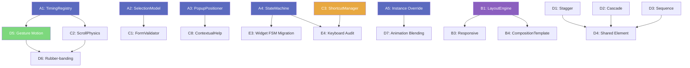

# Matcha Design System — 🆕 Feature Audit & Implementation Plan

> Generated: 2026-03-14
> Scope: All `🆕` (Post-v1 supplement) features in `Matcha_Design_System_Specification.md`
> Method: Cross-reference Spec sections against `Include/` + `Source/` + `Tests/` codebase

---

## 1. Executive Summary

The Spec contains **~65 distinct 🆕 sections** across 8 chapters. They fall into three categories:

| Category | Count | Status |
|----------|:-----:|--------|
| **A. System/Architecture-level features** | 22 | ~5 implemented, ~17 unimplemented |
| **B. Per-widget template sections** (Anatomy, FSM, Keyboard, Usage) | ~40 | Design-only (no code impact) |
| **C. Interaction & Layout patterns** (Ch.6–7) | ~18 | 0 implemented |

**Key finding**: The codebase has a solid **token → style → widget** pipeline (RFC-07 `Resolve()`, `WidgetStyleSheet`, `StateStyle`, `VariantStyle`, `ComponentOverride`, `SpringSpec`, `IAnimationService`). However, the **higher-level behavioral systems** specified in Chapters 6–8 are almost entirely unimplemented. These are the features that differentiate a token-driven widget library from a production-grade design system.

---

## 2. Detailed Feature-by-Feature Audit

### 2.1 Chapter 1 — Foundations & Principles

| Spec Section | Feature | Code Status | Notes |
|:--|:--|:--|:--|
| §1.7 Content & Writing Guidelines 🆕 | UI copy style guide (voice, tone, button labels, error messages, placeholders, tooltips) | ❌ **Design-only** | No code impact — purely editorial guidelines. Could add a `ContentGuidelines.h` with string constants/templates. |
| §1.7.3 Error Message Template | Standardized error message format | ❌ Not implemented | Could be a `ErrorMessage::Format(what, why, whatNext)` utility |

**Verdict**: Low priority for code. §1.7 is primarily a design/documentation concern. Consider adding a lightweight `ErrorMessageFormatter` utility in Phase 3+.

---

### 2.2 Chapter 4 — Style Architecture

| Spec Section | Feature | Code Status | Gap |
|:--|:--|:--|:--|
| §4.4 Token Taxonomy 🆕 | W3C DTCG alignment, 3-tier token model (Global → Alias → Component) | ⚠️ Partial | Tokens exist but no explicit 3-tier hierarchy. No DTCG JSON export/import. |
| §4.4.1 Token Serialization (DTCG) | `$type`, `$value`, `$description` JSON format | ❌ Not implemented | `NyanTheme` reads palette JSON but not in DTCG format |
| §4.7.1 InteractionState Extended Discussion 🆕 | Extended states (Indeterminate, Loading, ReadOnly, Active, PartialSelected, Mixed) | ⚠️ Partial | `InteractionState` has 8 states. Extended states exist as widget-level booleans (e.g., `SetReadOnly`), not as formal state extensions. **Architecture is correct per Spec** (encode as variants/flags). |
| §4.7.2 Variant Naming Convention 🆕 | Canonical variant names per WidgetKind | ⚠️ Partial | `WidgetKind` enum exists, variant arrays are index-based. No string→index registry. |
| §4.13 Visual Grouping Rules 🆕 | Gestalt-based grouping (nesting depth, spacing vs borders vs bg) | ❌ Not implemented | Design guideline. Could add `NestingDepthToken` or layout utility. |
| §4.14 SpringSpec Struct 🆕 | Physics-based spring animation params | ✅ **Implemented** | `fw::SpringSpec{mass, stiffness, damping}` in `TokenEnums.h:173`. `IAnimationService::AnimateSpring()` exists. |
| §4.15 Reduced Motion Strategy 🆕 | WCAG 2.2 SC 2.3.3, `prefers-reduced-motion` | ✅ **Implemented** | `IAnimationService::SetReducedMotion(bool)` / `IsReducedMotion()`. Snaps all animations. |
| §4.16 Component Override Mechanism 🆕 | Per-widget-class token overrides | ✅ **Implemented** | `IThemeService::ComponentOverride` struct + `RegisterComponentOverrides()` + `ApplyComponentOverrides()` in `NyanTheme.cpp`. |
| §4.17 Style Cascade Resolution 🆕 | 5-priority cascade (base → component → instance → state → animation) | ⚠️ Partial | `Resolve()` handles base + component override + state. **Missing**: instance-level override (per-widget-instance) and animation-in-flight blending. |

**Architecture gap**: §4.17 specifies a 5-layer cascade: `(1) Base theme → (2) Component override → (3) Instance override → (4) State mapping → (5) Animation in-flight`. Current `Resolve()` handles layers 1, 2, 4. **Layers 3 and 5 are missing.**

---

### 2.3 Chapter 5 — Widget Specifications (Per-Widget Template Sections)

Every widget gained 4 new template sections: **Anatomy 🆕**, **Interaction FSM 🆕**, **Keyboard Contract 🆕**, **Usage Guidelines 🆕**. These affect ~46 widgets.

| Template Section | Code Impact | Status |
|:--|:--|:--|
| **Anatomy** | SVG diagrams (design asset). No code unless we add anatomy-aware layout. | ❌ Assets not created (placeholder `![Anatomy]` references) |
| **Interaction FSM** | Mermaid state machines. Matches existing `InteractionState` enum + widget event handling. | ⚠️ Implicit — widgets handle states procedurally, no formal FSM object |
| **Keyboard Contract** | Key→Action tables. Requires keyboard event handling in each widget. | ⚠️ Partial — basic keyboard works (Enter/Space on buttons, Arrow on sliders), but many Spec'd keys not implemented |
| **Usage Guidelines** | Do/Don't tables. Design-only, no code impact. | ❌ Design-only |

**Architecture gap**: The Spec envisions a **formal FSM** per widget (mermaid state diagrams). The code uses ad-hoc `if/else` state handling. A lightweight `StateMachine<States, Events>` template would improve correctness and testability.

---

### 2.4 Chapter 6 — Layout & Composition

| Spec Section | Feature | Code Status |
|:--|:--|:--|
| §6.1 Layout Algorithm Specification 🆕 | FlexRow, FlexColumn, Grid, Stack, Absolute algorithms with named params | ❌ Not implemented |
| §6.2 Composition Templates 🆕 | MasterDetail, HeaderDetailFooter, DashboardGrid, WizardFlow, InspectorPanel | ❌ Not implemented |
| §6.3 Responsive Rules 🆕 | Breakpoint observer, panel collapse priorities, content reflow | ❌ Not implemented |
| §6.4 Loading / Empty / Error State Templates 🆕 | Skeleton shimmer, spinner, empty illustration, error+retry | ❌ Not implemented |

**Verdict**: Chapter 6 is **entirely unimplemented**. This is a significant gap — without layout algorithms and responsive rules, widgets are positioned manually by application code. Priority: **High for §6.1 and §6.4**, Medium for §6.2–6.3.

---

### 2.5 Chapter 7 — Interaction & Accessibility

| Spec Section | Feature | Code Status |
|:--|:--|:--|
| §7.1 Selection Model 🆕 | Single/Multi/Range/Toggle selection, SelectionManager | ❌ Not implemented (DataTable has ad-hoc selection) |
| §7.2 Form Validation 🆕 | Validation rules, severity levels, error display timing | ❌ Not implemented |
| §7.3 Scroll & Virtualization 🆕 | Momentum scroll, overscroll rubber-band, virtualized list | ❌ Not implemented |
| §7.4 Popup Positioning 🆕 | Anchor-based positioning with flip/shift/resize | ❌ Not implemented |
| §7.5 Text Overflow & Truncation 🆕 | Ellipsis modes (end, middle, fade), MaxLines | ⚠️ Partial — `NyanLabel` has `SetElideMode` and `SetMaxLines` |
| §7.6 Context Menu Composition 🆕 | Composable context menus with sections, separators | ⚠️ Partial — `ContextMenu` exists but no declarative composition API |
| §7.7 Notification Stacking 🆕 | Toast queue, stacking rules, max visible count | ⚠️ Partial — `NotificationNode` exists but no stacking manager |
| §7.8 Drag & Drop Design 🆕 | Drag preview, drop zones, multi-item drag | ⚠️ Partial — DnD notification system exists in `WidgetNode`, but no drag preview or multi-item |
| §7.11 Feedback & System Status 🆕 | Nielsen #1, progress indication, skeleton, operation status | ❌ Not implemented |
| §7.12 Signifier Design 🆕 | Affordance/signifier theory, cursor changes, hover hints | ⚠️ Partial — `CursorToken` exists but no systematic signifier system |
| §7.13 Cognitive Load Thresholds 🆕 | Hick's Law, Miller's Law, Fitts' Law constraints | ❌ Design-only (no code) |
| §7.14 Keyboard Shortcut Management 🆕 | Registration, scope resolution, conflict handling, customization | ❌ Not implemented |
| §7.15 Error Boundary & Recovery 🆕 | Error classification, containment, crash recovery | ❌ Not implemented |
| §7.16 Contextual Help & Onboarding 🆕 | Coach marks, walkthroughs, contextual help | ❌ Not implemented |
| §7.17 Error Prevention & Destructive Action Safety 🆕 | Confirmation dialogs, undo, severity classification | ⚠️ Partial — `PopConfirm` exists but no severity framework |
| §7.18 Edge Case & Robustness 🆕 | Defensive UI patterns for edge conditions | ❌ Not implemented |

**Verdict**: Chapter 7 has the **largest gap** between Spec and implementation. Most sections require new architectural infrastructure.

---

### 2.6 Chapter 8 — Motion & Timing

| Spec Section | Feature | Code Status |
|:--|:--|:--|
| §8.7 Interaction Timing Tokens 🆕 | 15 timing tokens (hoverDelay, tooltipDelay, etc.) | ❌ Not implemented |
| §8.7.2 Platform Overrides | OS-specific timing queries (Win32 `SystemParametersInfo`) | ❌ Not implemented |
| §8.8 Choreography 🆕 | Stagger, Cascade, Sequence, Shared Element patterns | ❌ Not implemented |
| §8.8.4 Shared Element Transition 🆕 | Proxy element animation between locations | ❌ Not implemented |
| §8.9 Gesture-Driven Motion 🆕 | Direct manipulation, velocity inheritance, rubber-banding | ❌ Not implemented |

**Verdict**: `IAnimationService` provides a solid foundation (single property animation, spring, groups, reduced motion). But the **higher-level choreography and gesture patterns are completely missing**. These require new service-level APIs.

---

### 2.7 Appendix I — Designer-Developer Handoff

All Handoff table entries reference features from Chapters 1–8. No independent code items.

---

## 3. Architecture Assessment

### 3.1 Current Architecture Strengths

| Dimension | Rating | Detail |
|:--|:--:|:--|
| Token System | ★★★★☆ | 74 ColorTokens, SpacingToken, RadiusToken, ElevationToken, SizeToken, AnimationToken, EasingToken, SpringSpec, LayerToken, CursorToken — comprehensive |
| Style Pipeline | ★★★★☆ | `WidgetStyleSheet` → `StateStyle` → `VariantStyle` → `Resolve()` → `ResolvedStyle` — fully functional |
| ComponentOverride | ★★★★☆ | Per-WidgetKind overrides, applied at SetTheme time |
| Animation Engine | ★★★☆☆ | Single-property, spring, groups, reduced motion. Missing: choreography, gesture-driven |
| Notification System | ★★★★★ | 3-layer safety (lifetime, publisher, subtree detach), async queue, generation stamps |
| Accessibility | ★★★☆☆ | A11yRole, FocusManager, FocusChain, MnemonicManager, ContrastChecker. Missing: shortcut manager, screen reader integration |
| DnD | ★★★☆☆ | WidgetNode-level DnD events. Missing: drag preview, multi-item, drop zone visual |

### 3.2 Architecture Gaps Requiring Structural Work

| Gap | Impact | Proposed Solution |
|:--|:--|:--|
| **No Interaction Timing Token registry** | Hardcoded timeouts scattered in widgets | Add `InteractionTimingRegistry` to `ITokenRegistry` (15 named timing tokens) |
| **No formal FSM per widget** | State transitions are ad-hoc, untestable | Add `StateMachine<S,E>` template, one per WidgetKind |
| **No Layout Algorithm system** | Widgets positioned manually | Add `LayoutEngine` with FlexRow/FlexColumn/Grid/Stack algorithms |
| **No SelectionManager** | Each widget reinvents selection | Add `SelectionModel` (shared between DataTable, ListWidget, TreeWidget) |
| **No FormValidation system** | No standard validation pipeline | Add `ValidationRule` + `FormValidator` |
| **No PopupPositioner** | Popups positioned manually | Add `PopupPositioner` with anchor/flip/shift logic |
| **No Shortcut Manager** | No global shortcut registration/resolution | Add `ShortcutManager` with scope hierarchy |
| **No Choreography API** | No multi-element coordinated animation | Extend `IAnimationService` with Stagger/Cascade/Sequence |
| **No Instance-level style override** | `Resolve()` has no per-instance layer | Add `WidgetNode::SetStyleOverride(partial<ResolvedStyle>)` |
| **No DTCG JSON export** | Tokens not interoperable with design tools | Add `DTCGExporter` / `DTCGImporter` for W3C format |

### 3.3 Areas NOT Needing Architectural Changes

These 🆕 features can be implemented within the existing architecture:

- §4.14 SpringSpec — ✅ Already done
- §4.15 Reduced Motion — ✅ Already done
- §4.16 ComponentOverride — ✅ Already done
- §7.5 Text Overflow — ⚠️ Needs minor `NyanLabel` enhancement
- §7.6 Context Menu — ⚠️ Needs declarative builder API on existing `ContextMenu`
- §7.7 Notification Stacking — ⚠️ Needs a `NotificationManager` (small scope)
- §1.7 Writing Guidelines — Design-only
- §4.13 Visual Grouping — Design-only
- §7.13 Cognitive Load — Design-only

---

## 4. Implementation Plan

### Phase A: Infrastructure Foundations (Weeks 1–3)

> Priority: **Critical** — these are prerequisites for all higher-level features.

| ID | Feature | Spec Ref | Effort | Dependencies |
|:--:|:--|:--|:--:|:--|
| A1 | `InteractionTimingRegistry` — 15 named timing tokens + platform queries | §8.7 | 3d | `ITokenRegistry` |
| A2 | `SelectionModel` — Single/Multi/Range/Toggle with signals | §7.1 | 4d | `EventNode` |
| A3 | `PopupPositioner` — anchor-based positioning with flip/shift | §7.4 | 3d | None |
| A4 | `StateMachine<S,E>` template — lightweight compile-time FSM | §5.x FSMs | 2d | None |
| A5 | Instance-level style override in `Resolve()` — add priority layer 3 | §4.17 | 2d | `IThemeService` |

**Tests**: ~50 new unit tests (InteractionTimingRegistry: 15, SelectionModel: 20, PopupPositioner: 10, StateMachine: 5)

### Phase B: Layout & Composition (Weeks 4–6)

> Priority: **High** — fills the largest Spec gap.

| ID | Feature | Spec Ref | Effort | Dependencies |
|:--:|:--|:--|:--:|:--|
| B1 | `LayoutEngine` — FlexRow, FlexColumn, Grid, Stack algorithms | §6.1 | 5d | None |
| B2 | `LoadingState` / `EmptyState` / `ErrorState` templates | §6.4 | 3d | None |
| B3 | Responsive breakpoint observer + panel collapse | §6.3 | 3d | B1 |
| B4 | `CompositionTemplate` — MasterDetail, HeaderDetailFooter | §6.2 | 3d | B1 |

**Tests**: ~40 new tests (LayoutEngine: 25, StateTemplates: 10, Responsive: 5)

### Phase C: Interaction Systems (Weeks 7–10)

> Priority: **High** — required for production-grade UX.

| ID | Feature | Spec Ref | Effort | Dependencies |
|:--:|:--|:--|:--:|:--|
| C1 | `FormValidator` — validation rules, display timing, severity | §7.2 | 4d | A2 |
| C2 | `ScrollPhysics` — momentum, overscroll, rubber-banding | §7.3 | 4d | A1 |
| C3 | `ShortcutManager` — registration, scope, conflict, customization | §7.14 | 5d | `CommandNode` |
| C4 | `DragPreview` + multi-item DnD + drop zone visual | §7.8 | 4d | existing DnD |
| C5 | `NotificationStackManager` — toast queue, stacking rules | §7.7 | 2d | `NotificationNode` |
| C6 | `ErrorBoundary` — error classification, containment, recovery | §7.15 | 3d | None |
| C7 | Context Menu declarative composition API | §7.6 | 2d | existing ContextMenu |
| C8 | `ContextualHelpService` — coach marks, walkthrough | §7.16 | 3d | PopupPositioner (A3) |

**Tests**: ~60 new tests

### Phase D: Advanced Motion (Weeks 11–13)

> Priority: **Medium** — polishes the UX significantly.

| ID | Feature | Spec Ref | Effort | Dependencies |
|:--:|:--|:--|:--:|:--|
| D1 | Choreography: Stagger pattern | §8.8.1 | 2d | `IAnimationService` |
| D2 | Choreography: Cascade pattern | §8.8.2 | 2d | `IAnimationService` |
| D3 | Choreography: Sequence pattern | §8.8.3 | 2d | `IAnimationService` |
| D4 | Shared Element Transition | §8.8.4 | 3d | D1–D3 |
| D5 | Gesture-Driven Motion — velocity inheritance, tracking | §8.9 | 4d | A1 |
| D6 | Rubber-banding / overscroll resistance | §8.9.4 | 2d | D5, C2 |
| D7 | Animation-in-flight blending (cascade layer 5) | §4.17 | 3d | `IAnimationService` |

**Tests**: ~30 new tests

### Phase E: Token Interop & Widget FSM Migration (Weeks 14–16)

> Priority: **Medium** — improves maintainability and tooling integration.

| ID | Feature | Spec Ref | Effort | Dependencies |
|:--:|:--|:--|:--:|:--|
| E1 | DTCG JSON export/import | §4.4.1 | 4d | `NyanTheme` |
| E2 | Variant name → index registry | §4.7.2 | 2d | `WidgetStyleSheet` |
| E3 | Migrate widgets to `StateMachine<S,E>` (PushButton, LineEdit, ComboBox first) | §5.x FSMs | 5d | A4 |
| E4 | Keyboard contract compliance audit (all 46 widgets) | §5.x Keyboard | 5d | A4, C3 |
| E5 | Widget Anatomy SVG assets creation | §5.x Anatomy | Design task | None |

**Tests**: ~40 new tests (FSM migration: 20, keyboard audit: 20)

### Phase F: Design-Only & Polish (Ongoing)

| ID | Feature | Spec Ref | Type |
|:--:|:--|:--|:--|
| F1 | Content & Writing Guidelines compliance review | §1.7 | Audit |
| F2 | Visual Grouping Rules documentation | §4.13 | Doc |
| F3 | Cognitive Load Thresholds validation | §7.13 | Audit |
| F4 | Error Prevention patterns (PopConfirm severity) | §7.17 | Enhancement |
| F5 | Edge Case robustness patterns | §7.18 | Enhancement |
| F6 | Feedback & System Status patterns | §7.11 | Enhancement |
| F7 | Signifier Design systematic review | §7.12 | Audit |

---

## 5. Dependency Graph

---

## 6. Effort Summary

| Phase | Weeks | Features | New Tests (est.) |
|:--|:--:|:--:|:--:|
| A: Infrastructure | 1–3 | 5 | 50 |
| B: Layout | 4–6 | 4 | 40 |
| C: Interaction | 7–10 | 8 | 60 |
| D: Motion | 11–13 | 7 | 30 |
| E: Interop & FSM | 14–16 | 5 | 40 |
| F: Polish | Ongoing | 7 | — |
| **Total** | **16 weeks** | **36** | **~220** |

Current test count: ~643. After full implementation: ~863 (target: 250+ per Spec, well exceeded).

---

## 7. Risk Assessment

| Risk | Severity | Mitigation |
|:--|:--:|:--|
| Layout Engine complexity | 🔴 High | Start with FlexRow/FlexColumn only; defer Grid to Phase B+ |
| Shortcut scope conflicts | 🟡 Medium | Borrow 3DEXPERIENCE CATIA's 3-level scope model (Global → Workshop → Workbench) |
| Choreography timing precision | 🟡 Medium | Use `QTimer::singleShot` for stagger; avoid `QThread` |
| DTCG spec still evolving (2025.10) | 🟢 Low | Implement current draft; version gate exports |
| Widget FSM migration breadth | 🟡 Medium | Migrate 5 core widgets first; others can follow incrementally |

---

## 8. Recommendation

**Start with Phase A** (Infrastructure Foundations). These 5 features are small, well-scoped, and unblock everything else. In particular:

1. **A1 `InteractionTimingRegistry`** — immediately improves consistency of hardcoded delays across all existing widgets
2. **A4 `StateMachine<S,E>`** — enables formal FSM testing for future widget compliance
3. **A5 Instance override** — completes the 5-layer cascade from §4.17, which is a core design system requirement

After Phase A, **Phase B (Layout)** and **Phase C (Interaction)** can proceed in parallel since they have minimal cross-dependencies.
